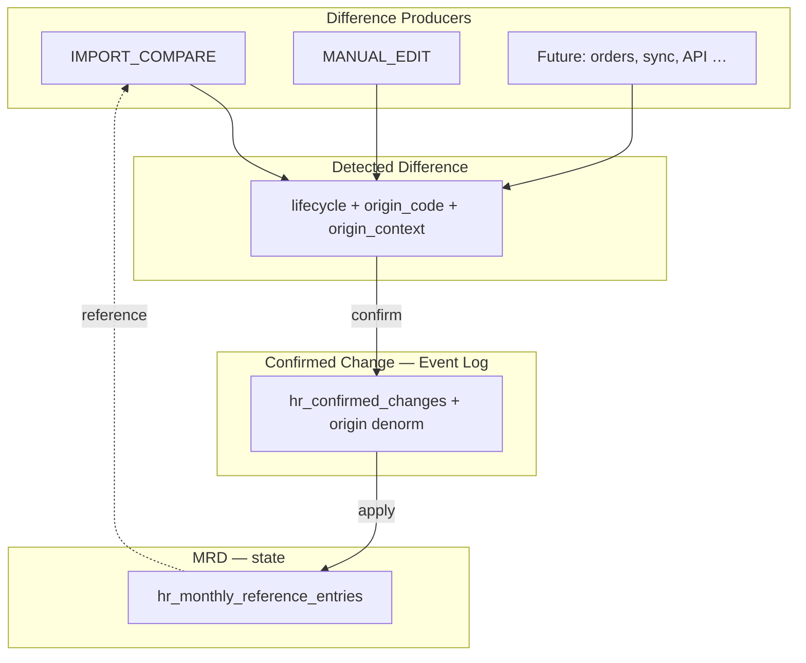

# ADR-058 — Architecture Assessment: Baseline/Publish → MRD

**Date:** 2026-07-19 (редакция v4)  
**Status:** **Accepted** — aligned with ADR-058 v4; **no code changes yet**  
**Parent ADR:** [ADR-058 Monthly Reference Dataset](../adr/ADR-058-monthly-reference-dataset-architecture.md)  
**Terminology:** код — **MRD**, **Detected Difference**, **Confirmed Change**, **Difference Origin**; документы и WP — **Месячный эталонный набор данных**, **обнаруженное различие**, **подтверждённое изменение**, **происхождение различия**

---

## 1. Executive Summary

### As-is

```text
Import IN_REVIEW → Complete Import Review → APPLY_PENDING → Publish Baseline → hr_control_list_baselines
```

Diff columns на строках import — **ephemeral**, пересчитываются; решения HR не сохраняются как first-class entities.

### To-be (ADR-058 v4)

**Три сущности + Difference Origin на каждом Detected Difference:**

| Сущность | Роль |
|----------|------|
| **MRD** | Текущее подтверждённое **состояние** |
| **Detected Difference** | Persistent entity + lifecycle + **Difference Origin** |
| **Confirmed Change** | Append-only **Event Log** (включая denormalized origin) |

```text
[Difference Producer × N]   ← Import, manual, sync, orders, repair, …
  → Detected Difference [DETECTED] + difference_origin_code
  → HR confirm / reject
  → Confirmed Change event
  → MRD entry update
```

**Import** — producer с origin **`IMPORT_COMPARE`**, не единственный канал.

Параллельно: **fork-version**, **fork-period** — замена Publish Baseline.

**Вывод:** diff algorithms (ADR-040) сохраняются; output materialize в **persistent Detected Differences** с reconcile; confirm пишет **immutable event** и обновляет MRD state.

---

## 2. Three-Entity Model (target)



| Layer | Mutable? | SoT for |
|-------|----------|---------|
| MRD entries | Yes (ACTIVE period only) | Текущие кадровые данные контрольного списка |
| Detected Difference | Status transitions only | Очередь и история обработки различий |
| Confirmed Change | **No** (append-only) | Аудит подтверждений |

**Удалено из target model:** `hr_difference_decisions` — reject/confirm status на Detected Difference; confirm audit — только в Confirmed Change event.

---

## 3. Target Entity Map vs as-is

| Сущность | As-is | Target |
|----------|-------|--------|
| Import | `hr_import_*` staging | Keep |
| Automatic Comparison | `compute_batch_monthly_diff` — перезаписывает diff columns | **Adapt:** reconcile → upsert Detected Differences |
| Detected Difference | diff columns на rows; ephemeral | **New:** persistent + lifecycle + **Difference Origin** |
| Confirmed Change | bulk publish baseline | **New:** `hr_confirmed_changes` Event Log |
| MRD | `hr_control_list_baselines` + entries | **Adapt:** confirmed state only |

---

## 4. Detected Difference — Assessment

### 4.1. Decision: **New** (first-class entity)

| Aspect | Detail |
|--------|--------|
| **Problem as-is** | Каждый `compute-diff` перезаписывает row diff columns; CONFIRMED/REJECTED решения теряются |
| **Target** | Persistent `hr_detected_differences` с `lifecycle_status` |
| **Lifecycle** | `DETECTED` → `CONFIRMED` \| `REJECTED` \| `SUPERSEDED` |
| **Logical key** | `report_period` + `mrd_id` + `entity_scope` + `attribute` (+ `record_kind`) |
| **Supersession** | `supersedes_difference_id` — chain замены |

### 4.2. Automatic Comparison reconcile — **Adapt**

| Rule | Behavior |
|------|----------|
| Existing `CONFIRMED` / `REJECTED` | **Never recreate** for same logical key |
| Existing `DETECTED`, same candidate | Keep; update `last_comparison_run_id` |
| Existing `DETECTED`, changed candidate | Old → `SUPERSEDED`; new → `DETECTED` |
| New candidate, no open difference | Insert `DETECTED` |
| Candidate gone | Open `DETECTED` → `SUPERSEDED` |

**Service target:** `hr_import_monthly_diff_service` → split: **comparison engine** + **difference reconcile service**.

**New table:** `hr_comparison_runs` — audit прогонов (batch_id, mrd_id, started_at, stats).

### 4.3. Row-level diff columns — **Adapt** (secondary)

Denormalized cache for debug / legacy UI; **SoT = `hr_detected_differences`**, not row columns.

### 4.4. Difference Origin — **New**

| Aspect | Detail |
|--------|--------|
| **Decision** | **New** business attribute on every Detected Difference |
| **Fields** | `difference_origin_code` (FK → extensible registry), `origin_context` (JSONB) |
| **Registry** | `hr_difference_origin_types` — add codes without schema change to difference entity |
| **Phase 1 seeds** | `IMPORT_COMPARE`, `MANUAL_EDIT`, `SYSTEM_RECALC`, `MRD_FORK`, `DATA_REPAIR` (illustrative) |
| **Uses** | Audit trail; analytics by channel; UI filters; future routing rules / RBAC by origin |

**Producer pattern:** each subsystem implements `create_difference(..., origin_code, origin_context)` — **no change** to Detected Difference model when adding `PERSONNEL_ORDER`, `SYNC_INTEGRATION`, etc.

**Reconcile impact:** `IMPORT_COMPARE` reconcile does not overwrite origin on unchanged open difference; superseding creates new row with **creating producer's** origin.

**Confirmed Change impact:** denormalize `difference_origin_code` + `origin_context` snapshot into event at confirm time.

**Routing / evolution (Phase 2+):**

| Capability | Enabled by Origin |
|------------|-------------------|
| Separate queues per origin | Filter `difference_origin_code` |
| Auto-confirm policies | Rules per origin (e.g. never for IMPORT_COMPARE) |
| SLA / priority | Origin-based sort |
| Integration ownership | Trace sync failures to `SYNC_INTEGRATION` |
| Personnel orders bridge | `PERSONNEL_ORDER` producer without MRD model change |

---

## 5. Confirmed Change — Assessment

### 5.1. Decision: **New** (Event Log, not state)

| Aspect | Detail |
|--------|--------|
| **Nature** | Append-only events; **no UPDATE/DELETE** |
| **Trigger** | HR confirm on `DETECTED` difference only |
| **Effect** | Transaction: insert event → difference CONFIRMED → MRD entry mutate |
| **Reject** | No event; difference → REJECTED with audit fields on difference row |

### 5.2. Event payload (minimum)

`detected_difference_id`, `report_period`, `mrd_id`, `entity_scope`, `attribute`, `old_value`, `new_value`, `confirmed_by`, `confirmed_at`, `basis` (optional), **`difference_origin_code`**, **`origin_context`** (denormalized snapshot).

### 5.3. As-is mapping

| As-is | Target |
|-------|--------|
| `publish_baseline_from_batch` (bulk state write) | Decomposed: N × Confirmed Change events + MRD updates |
| `hr_publication_origins` on publish | Provenance via event fields + optional `confirmation_origin_id` |
| `HR_IMPORT_REVIEW_COMPLETED` audit | Retire as HR gate; comparison run audit instead |

---

## 6. Mechanism Assessment (summary)

Легенда: **Keep** | **Adapt** | **Replace** | **New**

| Mechanism | Decision | Notes |
|-----------|----------|-------|
| Baseline → MRD | Adapt | State container |
| Publish Baseline | Replace | fork-version + fork-period |
| Complete Import Review | Replace | No HR gate; compare auto |
| APPLY_PENDING | Replace | → COMPARED |
| Publication Origin | Adapt | Event/version provenance |
| Effective Baseline | Adapt | → `resolve_active_mrd(period)` |
| Publish Gate | Replace | Parse readiness + difference confirm rules |
| Baseline History | Adapt | MRD journal + lifecycle view |
| Soft/restore/hard delete | Adapt | MRD version admin |
| Diff business types | New | NEVER_CONFIRMED / PERIOD_CHANGED on difference |
| Detected Difference lifecycle | **New** | DETECTED / CONFIRMED / REJECTED / SUPERSEDED |
| **Difference Origin** | **New** | Extensible registry + origin_context |
| Difference Producer contract | **New** | Multi-source without model change |
| Comparison reconcile | **New** | No blind recreate |
| Confirmed Change Event Log | **New** | Append-only |
| `hr_difference_decisions` | **Not planned** | Folded into difference status + event |

---

## 7. Database target (delta v4)

| Table | v3 | v4 update |
|-------|-----|-----------|
| `hr_detected_differences` | lifecycle, logical_key | + **`difference_origin_code`**, **`origin_context`** |
| `hr_difference_origin_types` | — | **New** extensible registry |
| `hr_confirmed_changes` | Event Log | + denormalized origin on confirm |
| `hr_comparison_runs` | New | Unchanged (IMPORT_COMPARE runs) |
| `hr_difference_decisions` | Removed | Still not planned |
| `hr_import_rows.diff_*` | Secondary cache | Unchanged |

---

## 8. Gap Analysis (updated)

| Gap | Priority | WP |
|-----|----------|-----|
| `hr_detected_differences` + lifecycle + logical_key + **origin** | P0 | WP-MRD-001 |
| `hr_difference_origin_types` registry + seed origins | P0 | WP-MRD-001 |
| Difference Producer service contract | P0 | WP-MRD-002 |
| `hr_confirmed_changes` Event Log schema | P0 | WP-MRD-001 |
| Comparison reconcile service | P0 | WP-MRD-002 |
| Confirm transaction: event → difference → MRD | P0 | WP-MRD-002 |
| Reject: lifecycle only (no event) | P0 | WP-MRD-002 |
| SUPERSEDED chain on re-import | P0 | WP-MRD-002 |
| ACTIVE(period) + fork ops | P0 | WP-MRD-003 |
| UI: DETECTED queue + origin filter + supersession chain | P0 | WP-MRD-004 |
| Confirmed Changes read-only journal UI | P1 | WP-MRD-004 |
| MRD export | P1 | WP-MRD-005 |
| Deprecate publish + row-primary review | P2 | WP-MRD-006 |

---

## 9. Risk Register (updated)

| ID | Risk | Mitigation |
|----|------|------------|
| R1 | Reconcile bug duplicates differences | Unique index on `(period, mrd_id, logical_key, lifecycle_status)` where DETECTED; tests |
| R2 | Event/state drift | Single transaction; MRD update only via confirm handler |
| R3 | Orphan DETECTED after many imports | Supersede policy + periodic cleanup report |
| R4 | HR confused by SUPERSEDED chain | UI shows supersedes link + reason |
| R5 | Row diff columns out of sync | Mark denormalized; regenerate from differences |

---

## 10. Resolved / Remaining Questions

**Resolved in v3:**

- Detected Difference = persistent entity, not script output.
- Compare must reconcile, not recreate blindly.
- Lifecycle DETECTED / CONFIRMED / REJECTED / SUPERSEDED.
- Confirmed Change = Event Log; MRD update is derived effect.
- Three entities explicitly separated.

**Resolved in v4:**

- Difference Origin on every Detected Difference.
- Extensible origin registry; Import = one producer (`IMPORT_COMPARE`).
- Future sources (orders, sync, API) without model change.

**Remaining:**

1. REMOVED attribute: soft mark vs delete MRD entry?
2. CONFLICT `technical_diff_class`: block confirm until resolved?
3. `APPLIED` batch for `employee_documents` — separate from MRD?
4. Reject Event Log — required in v1 or difference audit sufficient?

---

## 11. Conclusion

ADR-058 v4 фиксирует **трёхслойную архитектуру** + **Difference Origin**:

1. **MRD** — mutable confirmed state.
2. **Detected Difference** — persistent process entity с lifecycle, reconcile и **происхождением**.
3. **Confirmed Change** — immutable confirm events (origin denormalized).
4. **Multi-producer** — Import один из каналов; расширение через registry + producer contract.

As-is diff engine — foundation для Automatic Comparison, но требует **reconcile layer** и **decoupling** от row-level ephemeral diff. Рефакторинг кода и миграции — по WP; **не начинать** до старта WP-MRD-001.

---

## History

| Date | Change |
|------|--------|
| 2026-07-19 | v2 — pipeline, business types, ACTIVE per period, fork, Publish replacement |
| 2026-07-19 | v3 — lifecycle, Event Log, three entities |
| 2026-07-19 | v4 — Difference Origin; extensible registry; multi-producer architecture |
