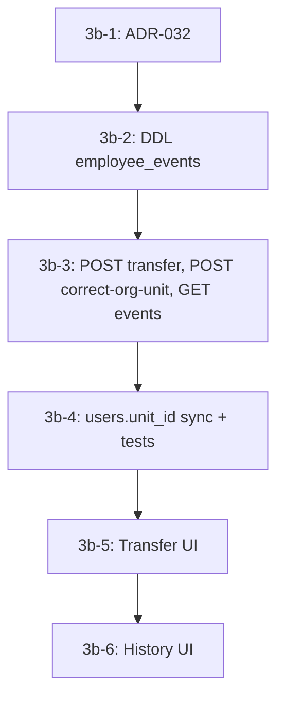

# ADR-032 — Архитектура кадрового перевода сотрудника (Employee Transfer Architecture)

## Статус
Черновик

## Дата
2026-06-12

## Связанные ADR
- ADR-031 — Directory contract (Personnel / Employees, transfer как отдельная операция)
- ADR-004 — Org Units (справочник `org_units`)
- ADR-014 — Data sync policy (`employees`, `users.unit_id`)

## Контекст

В Corpsite HR Phase 3a завершён и зафиксирован в коде (HEAD `827661a`):

- `PATCH /directory/employees/{id}` **не принимает** `org_unit_id` (тест `test_update_employee_forbidden_fields_return_422`);
- в `EmployeeDrawer` отделение **read-only** в режиме Edit;
- Edit меняет только `full_name`, `position_id`, `employment_rate`, `date_from`;
- Correction stub убран из UI — смена отделения через Edit запрещена;
- `POST /directory/employees/{id}/terminate` — отдельная операция увольнения;
- `POST /directory/employees/{id}/transfer` задекларирован в ADR-031, но **не реализован**.

В системе существуют **две параллельные org-привязки**:

| Источник | Поле | Назначение |
|----------|------|------------|
| `employees` | `org_unit_id` | Кадровая запись; source of truth для списков `/directory/employees`, экрана отделения |
| `users` | `unit_id` | RBAC scope (`compute_scope`), рабочие контакты (`working_contacts_routes`) |

Working contacts — read-модель, не таблица. Отделение в ней берётся из **`users.unit_id`**, должность — из **`employees.position_id`**. Без синхронизации при смене отделения возникает рассинхрон: Employees показывают новое подразделение, Working Contacts и RBAC — старое.

Должность (`positions`) и системная роль (`roles`) — разные сущности (ADR-031). Один сотрудник может иметь должность «Начальник ОВЭиПД» и роль `QM_HEAD`, `ADMIN` или обе через будущий RBAC.

Текущие операции create / update / terminate **не пишут** кадровую историю. `employees.*` — snapshot «сейчас», без timeline кадровых событий.

---

## Проблема

1. **Нет отдельной бизнес-операции Transfer.** Смена `org_unit_id` невозможна через Edit, но и не реализована через dedicated endpoint. HR не может оформить кадровый перевод в системе.

2. **Смешение семантик.** Исправление ошибочного отделения при импорте и реальный кадровый перевод — разные процессы. Одна форма (Edit) или один журнал «изменений полей» не различает их и не даёт аудита (дата приказа, `order_ref`, автор).

3. **Рассинхрон `employees` ↔ `users`.** При любом изменении `employees.org_unit_id` без обязательного обновления `users.unit_id` ломаются working contacts, org-scope RBAC и доверие к данным.

4. **Нет кадровой event table.** Без append-only журнала событий невозможно:
   - показать историю переводов в Drawer;
   - в перспективе унифицировать приём, перевод, увольнение, восстановление, смену ставки;
   - отличить correction от transfer в отчётности и sync (ADR-014).

5. **Риск auto role update.** Автоматическая смена `users.role_id` при переводе смешивает должность и права и противоречит модели Corpsite.

---

## Решение

Phase 3b вводит **кадровые события** как первичную модель изменения org-привязки сотрудника, а не журнал UPDATE полей.

Ключевые принципы:

1. Таблица **`employee_events`** — единая кадровая event table (не `employee_transfers`).
2. **`employee_events` — append-only.** Ошибки исправляются новым событием, не UPDATE строки.
3. **`employees.*` — текущий snapshot;** `employee_events` — история кадровых фактов.
4. **Transfer и Correction** — единственные пути смены `employees.org_unit_id` (не Edit, не PATCH).
5. При Transfer / Correction: **обязательный sync `users.unit_id`** в той же транзакции, если есть linked user.
6. **`users.role_id` не меняется автоматически** ни при одной операции Phase 3b.
7. **`employees.date_from` не меняется** при переводе; дата перевода — `effective_date` в событии.
8. API истории: **`GET /directory/employees/{id}/events`** (не `/transfers`).

Имя `employee_events` выбрано в пользу согласованности с таблицей `employees` и маршрутами `/directory/employees`. Термин «personnel events» в UI/документации ADR-031 допустим как доменный alias.

---

## `employee_events` как кадровая event table

Одна строка = **бизнес-событие** («что произошло с сотрудником»), с контекстом до/после. Это не audit log отдельных полей и не generic change journal.

### Таксономия типов событий

| `event_type` | Смысл | Phase 3b |
|--------------|-------|----------|
| `HIRE` | Приём на работу | Отложено (backfill из `create_employee`) |
| `TRANSFER` | Кадровый перевод между подразделениями | **Реализуется** |
| `CORRECTION` | Исправление ошибочного отделения | **Реализуется** |
| `TERMINATION` | Увольнение | Отложено (backfill из `terminate_employee`) |
| `RATE_CHANGE` | Изменение ставки | Задел на будущее |
| `REINSTATE` | Восстановление | Задел на будущее |

### Концептуальная схема (не миграция)

```sql
-- Концепт для ADR-032 / Phase 3b-2. Не оформлять как alembic-миграцию в 3b-1.
CREATE TABLE employee_events (
  event_id          BIGINT GENERATED ALWAYS AS IDENTITY PRIMARY KEY,
  employee_id       BIGINT NOT NULL REFERENCES employees(employee_id),
  event_type        TEXT NOT NULL,
  effective_date    DATE NOT NULL,

  -- snapshot «до» (NULL для HIRE)
  from_org_unit_id  BIGINT NULL REFERENCES org_units(unit_id),
  from_position_id  BIGINT NULL REFERENCES positions(position_id),
  from_rate         NUMERIC(4,2) NULL,

  -- snapshot «после» (NULL для TERMINATION)
  to_org_unit_id    BIGINT NULL REFERENCES org_units(unit_id),
  to_position_id    BIGINT NULL REFERENCES positions(position_id),
  to_rate           NUMERIC(4,2) NULL,

  order_ref         TEXT NULL,
  comment           TEXT NULL,
  created_by        BIGINT NOT NULL REFERENCES users(user_id),
  created_at        TIMESTAMPTZ NOT NULL DEFAULT now(),

  CONSTRAINT chk_event_type CHECK (
    event_type IN ('HIRE', 'TRANSFER', 'CORRECTION', 'TERMINATION')
  )
);

CREATE INDEX ix_employee_events_employee_date
  ON employee_events (employee_id, effective_date DESC, event_id DESC);
```

### Snapshot vs history

| Слой | Роль |
|------|------|
| `employees` | Текущее состояние: `org_unit_id`, `position_id`, `employment_rate`, `date_from`, `date_to`, `is_active` |
| `employee_events` | Неизменяемая цепочка кадровых фактов с `effective_date` и контекстом from/to |

---

## Append-only rule

`employee_events` — **строго append-only**:

- **INSERT** — единственная допустимая операция приложения;
- **UPDATE** — запрещён (нет API, нет UI, нет сервисных endpoint'ов);
- **DELETE** — запрещён в приложении (допустим только ops rollback до prod, вне runtime).

Исправление ошибочно записанного события:

- **не** правка строки в `employee_events`;
- **новое** событие `CORRECTION` с обязательным `comment`, фиксирующее фактическое состояние.

`employees.*` обновляется как snapshot текущего состояния; история в `employee_events` не переписывается.

---

## Edit vs Transfer vs Correction

Три операции имеют разную семантику и не должны смешиваться в одной форме.

### Edit (`PATCH /directory/employees/{id}`) — Phase 3a, без изменений в 3b

| Аспект | Поведение |
|--------|-----------|
| Назначение | Правка текущей кадровой записи без смены подразделения |
| Поля | `full_name`, `position_id`, `employment_rate`, `date_from` |
| `org_unit_id` | **Запрещён** (422) |
| Событие | Не создаётся в Phase 3b |
| `users.unit_id` | Не меняется |
| `users.role_id` | Не меняется |

Escape hatch «Показать все должности» в Edit остаётся для случаев, когда должность формально не типична для отделения, но сотрудник остаётся в **том же** `org_unit_id`.

### Transfer (`POST /directory/employees/{id}/transfer`)

| Аспект | Поведение |
|--------|-----------|
| Назначение | Реальное кадровое событие: смена подразделения (и часто должности/ставки) |
| Частота | Штатная HR-операция |
| `effective_date` | Обязательна (дата приказа / перевода) |
| `order_ref` | Желательно (ADR-031) |
| Событие | `event_type = TRANSFER` |
| История | Фиксирует from/to; не создаёт «ложный» период в ошибочном отделении |
| UX | Отдельный wizard/modal, не режим Edit |

Ограничение: для `TRANSFER` требуется `from_org_unit_id <> to_org_unit_id` (перевод в то же отделение — не transfer).

### Correction (`POST /directory/employees/{id}/correct-org-unit`)

| Аспект | Поведение |
|--------|-----------|
| Назначение | Исправление ошибки данных (импорт, опечатка при создании) |
| Частота | Редко, privileged HR / техадмин |
| `comment` | **Обязателен** |
| `order_ref` | Не требуется |
| Событие | `event_type = CORRECTION` |
| Семантика | «Фактически всегда был в другом отделении», без кадрового приказа о переводе |
| UX | Отдельное действие с warning-disclaimer; не в Transfer wizard и не в Edit |

### Сводная матрица

| Операция | `org_unit_id` | `position_id` | Событие | Sync `users.unit_id` | Sync `users.role_id` |
|----------|---------------|---------------|---------|----------------------|----------------------|
| Edit | ❌ | ✅ | ❌ (3b) | ❌ | ❌ |
| Transfer | ✅ | ✅ (опц.) | TRANSFER | ✅ обязательно | ❌ |
| Correction | ✅ | ✅ (опц.) | CORRECTION | ✅ обязательно | ❌ |
| Terminate (существует) | ❌ | ❌ | TERMINATION (позже) | deactivate user | ❌ |
| Create (существует) | set | set | HIRE (позже) | при create user | ❌ |

---

## Mandatory `users.unit_id` sync

При **Transfer** и **Correction**, если существует `users` с `employee_id = :id`:

```
employees.org_unit_id  →  to_org_unit_id
users.unit_id          →  to_org_unit_id   (обязательно, та же транзакция)
```

Правила:

- Флага `sync_user_unit` **нет**. Sync не опционален.
- Если linked user отсутствует — шаг пропускается.
- Если linked user существует — обновление `users.unit_id` **обязательно**; иначе транзакция не должна завершаться успешно.

Закрываемый рассинхрон:

| Потребитель | Поле отделения после sync |
|-------------|--------------------------|
| `/directory/employees` | `employees.org_unit_id` |
| Working contacts | `users.unit_id` (= то же значение) |
| RBAC `compute_scope` | `users.unit_id` |

`users.role_id`, `telegram_*`, `login` — **не меняются** при Transfer / Correction.

---

## No automatic `users.role_id` update

**Роль ≠ должность** (ADR-031). Перевод сотрудника в другое подразделение **не означает** автоматическую смену прав доступа.

Правила Phase 3b:

- Ни Transfer, ни Correction, ни Edit **не обновляют** `users.role_id`.
- Backend не выводит «рекомендуемую роль» из `to_position_id` или `to_org_unit_id`.
- UI Transfer wizard показывает **warning**: «Проверьте роль доступа сотрудника» — без auto-change.
- Смена роли остаётся отдельной операцией (существующий или будущий admin flow).

Пример: начальник ОВЭиПД с ролью `QM_HEAD` переводится в администрацию — должность и отделение меняются через Transfer, роль `QM_HEAD` сохраняется до явного решения HR/техадмина.

---

## API contract

Базовый префикс: `/directory/employees`. Все операции Transfer / Correction / Events — **privileged-only** (как create / update / terminate).

`PATCH /directory/employees/{id}` **не расширяется** полем `org_unit_id`.

### `POST /directory/employees/{id}/transfer`

Кадровый перевод. Создаёт событие `TRANSFER`, обновляет snapshot `employees`, синхронизирует `users.unit_id`.

**Request body:**

```json
{
  "to_org_unit_id": 123,
  "to_position_id": 45,
  "to_employment_rate": 1.0,
  "effective_date": "2026-06-15",
  "order_ref": "123-к",
  "comment": "Перевод по приказу"
}
```

| Поле | Обязательность | Правила |
|------|----------------|---------|
| `to_org_unit_id` | да | Существующий активный `org_units.unit_id`; ≠ текущему |
| `to_position_id` | нет | Default: текущая `employees.position_id`; должен существовать в `positions` |
| `to_employment_rate` | нет | Default: текущая ставка; `> 0`, `<= 2` |
| `effective_date` | да | Дата перевода / приказа; не подменяет `date_from` |
| `order_ref` | нет | Номер приказа |
| `comment` | нет | Произвольный комментарий |

**Response `200`:**

```json
{
  "item": { },
  "event": {
    "event_id": 1,
    "event_type": "TRANSFER",
    "effective_date": "2026-06-15",
    "from_org_unit_id": 44,
    "to_org_unit_id": 123,
    "from_position_id": 97,
    "to_position_id": 45,
    "from_rate": 1.0,
    "to_rate": 1.0,
    "order_ref": "123-к",
    "comment": "Перевод по приказу",
    "created_by": 4,
    "created_at": "2026-06-15T10:00:00Z"
  }
}
```

`item` — тот же контракт, что `GET /directory/employees/{id}` после обновления.

**Ошибки:** `403` (не privileged), `404` (employee / org unit / position), `409` (конфликт / inactive employee), `422` (валидация).

### `POST /directory/employees/{id}/correct-org-unit`

Исправление ошибочного отделения. Создаёт событие `CORRECTION`.

**Request body:**

```json
{
  "to_org_unit_id": 44,
  "to_position_id": 85,
  "effective_date": "2026-06-01",
  "comment": "Ошибка импорта: фактически работает в ОВЭиПД"
}
```

| Поле | Обязательность | Правила |
|------|----------------|---------|
| `to_org_unit_id` | да | Целевое (фактическое) отделение |
| `to_position_id` | нет | Только если должность тоже была указана неверно |
| `effective_date` | да | Дата, с которой запись считается корректной |
| `comment` | **да** | Обоснование исправления |

**Response `200`:** тот же формат `{ item, event }`, `event.event_type = "CORRECTION"`.

Для `CORRECTION` допускается `from_org_unit_id = to_org_unit_id` только если меняется `position_id` (редкий кейс); основной сценарий — исправление `org_unit_id`.

### `GET /directory/employees/{id}/events`

История кадровых событий сотрудника (append-only read).

**Query params (опционально):**

| Param | Default | Описание |
|-------|---------|----------|
| `event_type` | все | Фильтр: `TRANSFER`, `CORRECTION`, позже `HIRE`, `TERMINATION` |
| `limit` | 50 | 1–200 |
| `offset` | 0 | Пагинация |

**Response `200`:**

```json
{
  "items": [
    {
      "event_id": 2,
      "event_type": "TRANSFER",
      "effective_date": "2026-06-15",
      "from_org_unit_id": 44,
      "to_org_unit_id": 123,
      "from_position_id": 97,
      "to_position_id": 45,
      "from_rate": 1.0,
      "to_rate": 1.0,
      "order_ref": "123-к",
      "comment": null,
      "created_by": 4,
      "created_at": "2026-06-15T10:00:00Z"
    }
  ],
  "total": 1
}
```

Phase 3b возвращает `TRANSFER` и `CORRECTION`. После backfill — `HIRE` и `TERMINATION` без смены URL и базового контракта.

Сортировка: `effective_date DESC`, `event_id DESC`.

---

## Transaction contract

Transfer и Correction выполняются в **одной атомарной транзакции** БД:

```
BEGIN
  1. SELECT employees ... FOR UPDATE
     (опционально: SELECT users ... FOR UPDATE WHERE employee_id = :id)

  2. Validate:
     - employee существует и is_active = true (для Transfer; Correction — по правилам 3b-3)
     - to_org_unit_id существует
     - to_position_id существует (если передан)
     - privileged caller
     - для TRANSFER: from_org_unit_id <> to_org_unit_id

  3. Snapshot from_* из текущего employees:
     from_org_unit_id, from_position_id, from_rate (= employment_rate)

  4. UPDATE employees SET
       org_unit_id = :to_org_unit_id,
       position_id = COALESCE(:to_position_id, position_id),
       employment_rate = COALESCE(:to_employment_rate, employment_rate)
     WHERE employee_id = :id
     -- date_from, date_to, is_active, department_id — НЕ трогаем

  5. IF EXISTS (SELECT 1 FROM users WHERE employee_id = :id)
       UPDATE users SET unit_id = :to_org_unit_id
       WHERE employee_id = :id
     -- role_id, is_active, telegram_*, login — НЕ трогаем

  6. INSERT INTO employee_events (
       employee_id, event_type, effective_date,
       from_org_unit_id, from_position_id, from_rate,
       to_org_unit_id, to_position_id, to_rate,
       order_ref, comment, created_by
     ) VALUES (...)

COMMIT
```

Гарантии:

- Либо все шаги 4–6 успешны, либо rollback (нет частичного перевода).
- `employees.org_unit_id` и `users.unit_id` (при наличии user) согласованы после commit.
- Событие записано до возврата ответа API.
- `created_by` = `user_id` инициатора из JWT.

Идемпотентность: Phase 3b **не требует** dedupe key; повторный POST с теми же параметрами создаёт второе событие (HR ответственен). Dedupe — deferred decision.

---

## Deferred decisions

Решения, **намеренно отложенные** за пределы Phase 3b:

| Тема | Статус | Комментарий |
|------|--------|-------------|
| `position_id` только через Transfer | Отложено | Phase 3a разрешает смену должности в Edit; правило «врач → заведующий = Transfer/PROMOTION» — future consideration |
| Backfill `HIRE` из `create_employee` | Phase 3c+ | Запись в `employee_events` при создании |
| Backfill `TERMINATION` из `terminate_employee` | Phase 3c+ | Унификация с существующим terminate flow |
| SCD-2 `employee_assignments` | Phase 3c+ | Полноценные периоды «где работал» без переписывания snapshot |
| `department_id` legacy cleanup | Отложено | Параллельный FK на `departments`; в 3b не трогаем |
| `user_supervisors` при переводе | Out of scope 3b | Матрица подчинения — отдельная задача |
| Auto / рекомендуемая смена `role_id` | Отклонено | Только manual admin flow + UI warning |
| Связь `employees` ↔ `contacts` | Отложено | `person_id` без жёсткого FK |
| `RATE_CHANGE`, `REINSTATE` event types | Задел | Типы в CHECK; реализация позже |
| Идемпотентность POST transfer | Отложено | Client-generated idempotency key — при необходимости |
| HR-реестр `/directory/transfers` | Phase 3c+ | Пока достаточно `GET .../events` в Drawer |
| Физический DELETE employee | Out of scope | Только для ошибочных записей, отдельный privileged flow |

---

## Phase 3b implementation plan

| Этап | Deliverable | Критерий готовности |
|------|-------------|---------------------|
| **3b-1** | **ADR-032** (этот документ) | Архитектура утверждена: `employee_events`, append-only, sync, API, границы Edit/Transfer/Correction |
| **3b-2** | DDL `employee_events` | Таблица, FK, индекс `(employee_id, effective_date DESC)`; append-only на уровне приложения |
| **3b-3** | Backend endpoints | `POST .../transfer`, `POST .../correct-org-unit`, `GET .../events`; privileged-only; валидация |
| **3b-4** | Mandatory `users.unit_id` sync + tests | Транзакция из § Transaction contract; тест: после transfer working contacts и RBAC scope совпадают с `employees.org_unit_id` |
| **3b-5** | Transfer UI | Wizard в `EmployeeDrawer` + action «Перевести» на экране отделения (`OrgPageClient`); org_unit остаётся read-only в Edit |
| **3b-6** | History UI | Блок «История кадровых событий» в Drawer; `GET .../events`; Correction — отдельная форма с disclaimer |

**Explicitly out of scope 3b:**

- auto `users.role_id` update;
- расширение `PATCH /employees` полем `org_unit_id`;
- `user_supervisors` recalculation;
- SCD-2 assignments;
- backfill HIRE / TERMINATION;
- миграция / cleanup `department_id`.



---

## Последствия

### Положительные
- Transfer — кадровое событие с аудитом, а не silent UPDATE;
- Correction и Transfer разведены по семантике, API и UX;
- `employee_events` готов к HIRE / TERMINATION / RATE_CHANGE без смены модели;
- обязательный sync `users.unit_id` устраняет рассинхрон HR / RBAC / working contacts;
- сохраняется граница Phase 3a: Edit не меняет отделение.

### Цена / риски
- Дополнительная таблица и три endpoint'а;
- HR должен явно проверять роль после перевода (нет auto-update);
- До backfill HIRE/TERMINATION история в `GET events` неполная для старых сотрудников;
- `department_id` legacy может оставаться рассинхронным с `org_unit_id` до отдельной задачи.

---

## История документа

| Дата | Версия | Изменение |
|------|--------|-----------|
| 2026-06-12 | Draft | Первоначальный черновик на основе HR Phase 3a (HEAD `827661a`) и архитектурного аудита Phase 3b |
