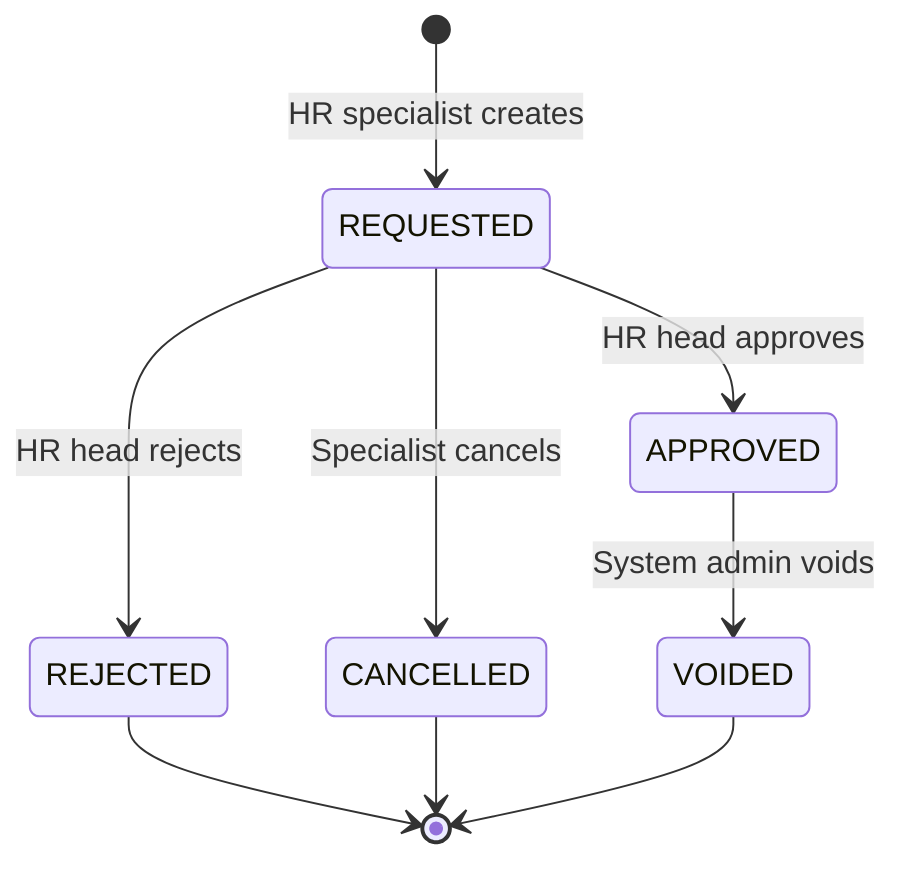

# ADR-035 — HR Transfer Approval and Event Voiding

## Статус

**Принят** (design only; реализация — Phase 3d)

## Дата

2026-06-15

## Связанные ADR и контекст

- [ADR-032 — Employee Transfer Architecture](./ADR-032-employee-transfer-architecture.md) — `employee_events`, immediate apply, append-only snapshot
- [ADR-033 — Personnel Governance Model](./ADR-033-personnel-governance-model.md) — роли HR, запрет DELETE истории
- **HR Phase 3c — Personnel Journal Enrichment** — расширение `GET /directory/personnel-events` (должность, ставка, колонка «Детали» в кадровом журнале); prerequisite для отображения `lifecycle_status` в Phase 3d

## Контекст

После Phase 3b перевод (`POST /directory/employees/{id}/transfer`) **сразу** меняет `employees.*`, синхронизирует `users.unit_id` и пишет `employee_events` с `event_type = TRANSFER`. Доступ — любой privileged-пользователь.

**Инцидент:** перевод сотрудника в другое отделение с несвязанной должностью (например, «Дворник») технически валиден, но кадрово подозрителен. Данные в `employee_events` сохраняются (`from_position_id`, `to_position_id`, `from_rate`, `to_rate` — см. Phase 3c); проблема — отсутствие **контроля до применения** и **административного void** после ошибки.

Phase 3c закрыл **отображение** snapshot в журнале; ADR-035 закрывает **governance** (согласование + void).

---

## Проблема

1. Нет workflow «заявка → согласование → применение».
2. Ошибочный перевод сразу меняет snapshot и RBAC scope.
3. [ADR-032](./ADR-032-employee-transfer-architecture.md) / [ADR-033](./ADR-033-personnel-governance-model.md) запрещают DELETE и UPDATE snapshot-полей — нужен формальный **void** без физического удаления.
4. Кадровый журнал (Phase 3c) не показывает статус процесса (Requested / Approved / Rejected / Voided).
5. RBAC не разделяет HR-специалиста и HR-руководителя.

---

## Решение

### Жизненный цикл перевода

| `lifecycle_status` | Смысл | Меняет `employees`? | В журнале |
|--------------------|-------|---------------------|-----------|
| **REQUESTED** | Заявка на перевод | **Нет** | «На согласовании» |
| **APPROVED** | Перевод применён | **Да** | «Утверждён» |
| **REJECTED** | Отклонён HR head | **Нет** | «Отклонён» |
| **CANCELLED** | Отменён автором до решения | **Нет** | «Отменён» |
| **VOIDED** | Аннулирован после применения | **Откат** к `from_*` | «Аннулирован» |

Только **APPROVED** меняет кадровый snapshot (как сейчас при immediate transfer).



### Amendment к ADR-032

[ADR-032](./ADR-032-employee-transfer-architecture.md) декларирует strict append-only для snapshot-полей `employee_events`. ADR-035 **дополняет**:

> Допускается **ограниченный UPDATE** только полей жизненного цикла и void-аудита. Поля snapshot (`from_*`, `to_*`, `effective_date`, `order_ref` at creation) **неизменяемы** после INSERT.

Физический **DELETE** по-прежнему запрещён ([ADR-033](./ADR-033-personnel-governance-model.md)).

---

## Минимальные изменения схемы (Phase 3d)

```sql
ALTER TABLE public.employee_events
  ADD COLUMN lifecycle_status TEXT NOT NULL DEFAULT 'APPROVED',
  ADD COLUMN reviewed_by BIGINT NULL REFERENCES public.users(user_id),
  ADD COLUMN reviewed_at TIMESTAMPTZ NULL,
  ADD COLUMN review_comment TEXT NULL,
  ADD COLUMN voided_by BIGINT NULL REFERENCES public.users(user_id),
  ADD COLUMN voided_at TIMESTAMPTZ NULL,
  ADD COLUMN void_reason TEXT NULL;

ALTER TABLE public.employee_events
  ADD CONSTRAINT chk_employee_events_lifecycle_status CHECK (
    lifecycle_status IN ('REQUESTED', 'APPROVED', 'REJECTED', 'CANCELLED', 'VOIDED')
  );

ALTER TABLE public.employee_events
  ADD CONSTRAINT chk_employee_events_void_reason CHECK (
    lifecycle_status <> 'VOIDED'
    OR (void_reason IS NOT NULL AND btrim(void_reason) <> '')
  );

CREATE INDEX ix_employee_events_lifecycle_status
  ON public.employee_events (lifecycle_status, effective_date DESC);
```

**Legacy backfill:** все существующие строки → `lifecycle_status = 'APPROVED'`.

---

## RBAC

| Роль | Идентификация | Права |
|------|---------------|-------|
| **HR specialist** | `DIRECTORY_HR_SPECIALIST_ROLE_IDS` | Создать REQUESTED; отменить свою REQUESTED |
| **HR head** | `DIRECTORY_HR_HEAD_ROLE_IDS` (`HR_HEAD` в seed) | Approve / Reject REQUESTED |
| **System Administrator** | `role_id = 2` / `is_system_admin` | Void APPROVED TRANSFER/CORRECTION |
| **Privileged legacy** | `DIRECTORY_PRIVILEGED_*` | Bypass на переходный период (env flag) |

---

## API (design, Phase 3d)

| Endpoint | Назначение |
|----------|------------|
| `POST /directory/employees/{id}/transfer` | При flag=1 → REQUESTED без изменения `employees`; при flag=0 — текущее поведение |
| `POST /directory/employee-events/{event_id}/approve` | REQUESTED → APPROVED + apply snapshot |
| `POST /directory/employee-events/{event_id}/reject` | REQUESTED → REJECTED; `review_comment` обязателен |
| `POST /directory/employee-events/{event_id}/cancel` | REQUESTED → CANCELLED (автор или HR head) |
| `POST /directory/employee-events/{event_id}/void` | APPROVED → VOIDED; `void_reason` обязателен; rollback `employees` + `users.unit_id` |

`GET /directory/personnel-events` (Phase 3c + 3d): добавить `lifecycle_status`, `review_comment`, `void_reason`, timestamps — badge и строка в колонке «Детали».

---

## Void vs CORRECTION

| | CORRECTION ([ADR-032](./ADR-032-employee-transfer-architecture.md)) | VOID (ADR-035) |
|---|-----|------|
| Кто | HR head / privileged HR | System admin |
| Семантика | «Фактически было иначе» | «Событие недействительно» |
| История | Новая строка CORRECTION | Та же строка → VOIDED |

---

## Миграция с immediate-transfer

| Phase | Deliverable |
|-------|-------------|
| **3d-1** | ADR-035 (этот документ) |
| **3d-2** | DB migration + backfill `APPROVED` |
| **3d-3** | RBAC helpers (`is_hr_specialist`, `is_hr_head`, `can_void_personnel_event`) |
| **3d-4** | API: create REQUESTED (flag-gated) |
| **3d-5** | API: approve / reject / cancel |
| **3d-6** | API: void + rollback tests |
| **3d-7** | Journal: `lifecycle_status` в «Детали» (на базе Phase 3c) |
| **3d-8** | UI: inbox HR head |
| **3d-9** | UI: void (admin) |
| **3d-10** | Prod cutover: `PERSONNEL_TRANSFER_APPROVAL_REQUIRED=1`, bypass=0 |

Env:

```env
PERSONNEL_TRANSFER_APPROVAL_REQUIRED=0   # 0 = legacy immediate; 1 = workflow
PERSONNEL_TRANSFER_APPROVAL_BYPASS_PRIVILEGED=1   # переходный период
DIRECTORY_HR_SPECIALIST_ROLE_IDS=...
DIRECTORY_HR_HEAD_ROLE_IDS=...
```

---

## Риски

| Риск | Mitigation |
|------|------------|
| Конфликт с ADR-033 «no delete» | VOID ≠ DELETE; addendum в ADR-033 |
| UPDATE lifecycle vs append-only | Whitelist полей; snapshot immutable |
| Два REQUESTED на сотрудника | Max 1 REQUESTED per employee (app + partial unique index) |
| Void при более поздних APPROVED events | Запрет void если есть более новые APPROVED события |
| NULL `from_position_id` при void | Rollback допускает NULL (см. nullable transfer fix) |

---

## Out of scope

- Штатное расписание / валидация «должность ∈ отделение»
- Email/TG уведомления
- Multi-step approval
- Void HIRE/TERMINATION (MVP: TRANSFER/CORRECTION only)
- Физический DELETE

---

## Последствия

**Положительные:** кадровый контроль до snapshot; audit-safe void; журнал отражает lifecycle (расширение Phase 3c).

**Цена:** controlled UPDATE на `employee_events`; новые endpoint'ы; inbox UX; void rollback при цепочке событий.

---

## История документа

| Дата | Версия | Изменение |
|------|--------|-----------|
| 2026-06-15 | Accepted | Design: approval workflow + void; ссылки на ADR-032, ADR-033, Phase 3c |
