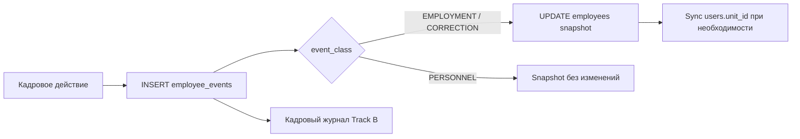
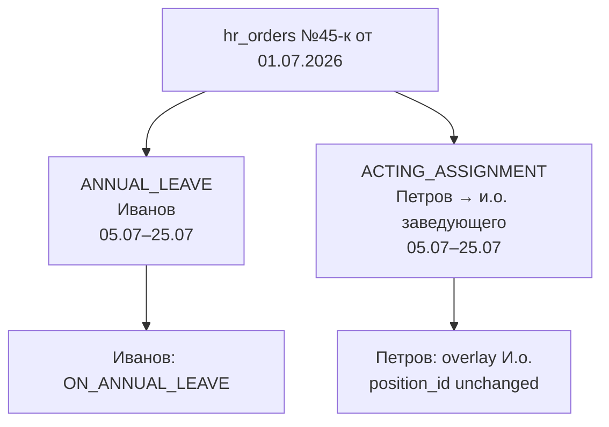

# ADR-036 — HR Events Unified Model

## Статус

**Принят** (design only).

**Реализация:** [Approved for implementation planning](../hr/HR-EVENTS-IMPLEMENTATION-STATUS.md) — следующий шаг **Phase 1A — HR Events Foundation**.

## Дата

2026-06

## Связанные ADR

- [ADR-032 — Employee Transfer Architecture](./ADR-032-employee-transfer-architecture.md) — `employee_events`, append-only, TRANSFER / CORRECTION
- [ADR-033 — Personnel Governance Model](./ADR-033-personnel-governance-model.md) — роли HR, запрет DELETE истории, snapshot vs journal
- [ADR-035 — HR Transfer Approval and Event Voiding](./ADR-035-hr-transfer-approval-and-event-voiding.md) — lifecycle workflow, void (Phase 3d+)
- [ADR-014 — Data Sync Policy](./ADR-014-data-sync-policy.md) — sync `employees.org_unit_id` ↔ `users.unit_id`
- [ADR-031 — Directory Personnel Contacts Contract](./ADR-031-directory-personnel-contacts-contract.md) — контракт Personnel / Employees
- **ADR-034 (local demo)** — реестр профессиональных документов (`certificate_types`, `employee_certificates`); отдельный контур до Phase 3 unified registry

---

## Контекст

К июню 2026 года в Corpsite реализован кадровый контур Phase 3b–3c:

- таблица **`employee_events`** (append-only): `HIRE`, `TRANSFER`, `CORRECTION`, `TERMINATION`;
- операции `POST …/transfer`, `POST …/terminate`, `POST …/correct-org-unit`;
- org-wide **Кадровый журнал** (Track B): `GET /directory/personnel-events`;
- per-employee **Кадровая история** (Track A): `GET /directory/employees/{id}/events`;
- UI: кнопка «Перевести» в `EmployeeDrawer`, форма перевода, enriched journal.

Параллельно выявлены архитектурные разрывы:

1. **`PATCH /directory/employees/{id}`** может менять `position_id`, `employment_rate`, `date_from` **без записи в журнал**.
2. Нет отдельных типов для **смены должности в том же отделении** (`POSITION_CHANGE`) и **изменения ставки** (`RATE_CHANGE`) — только TRANSFER (требует смены org) или CORRECTION (семантика ошибки).
3. Поле **`order_ref` TEXT** — transitional fallback, не полноценная модель приказа (номер, дата, подписант, файл).
4. Файлы приказов на практике хранятся на **локальном файловом сервере** больницы (`\\server\share\…`), не в Corpsite.
5. Кадровые **записи** (премия, выговор) не унифицированы с employment-событиями.
6. **Исполнение обязанностей (и.о.)** не моделируется; отпуск и назначение замещающего — связанный, но не формализованный процесс.
7. `EmployeeDrawer` воспринимается как точка изменения состояния (Edit + «Перевести»), хотя по [ADR-033](./ADR-033-personnel-governance-model.md) история обязательна для всех кадровых изменений.

ADR-036 определяет **единую модель кадровых событий (HR Events)**, правила snapshot, модель приказов и roadmap расширений.

---

## Проблема

1. **Snapshot меняется в обход журнала** — Edit/PATCH для position, rate, date_from.
2. **Неполная таксономия employment-событий** — реальные кадровые действия (должность, ставка, отпуск) не имеют dedicated типов.
3. **Приказ = текст** — `order_ref` не несёт дату, подписанта, ссылку на файл.
4. **Personnel actions** (премия, дисциплина) не входят в единый контур «Оформить».
5. **CORRECTION смешивается** с реальными кадровыми действиями в UX.
6. **Leave + acting (ИО)** — два связанных факта без формальной цепочки и общего приказа.
7. **Journal CRUD** — риск «правки истории» вместо void / correction.

---

## Решение

### Главный принцип

**Кадровое событие → запись в журнал → обновление snapshot сотрудника** (если событие этого требует).

`EmployeeDrawer` **показывает** текущее состояние. Изменение кадрового состояния выполняется **только** через оформление кадрового события (кнопка **«Оформить»**, заголовок формы — **«Кадровое действие»**).



### Три класса событий

| `event_class` | Смысл | Меняет snapshot | UX |
|---------------|-------|-----------------|-----|
| **EMPLOYMENT** | Кадровые события, меняющие состояние занятости | ✅ | «Оформить» → Занятость |
| **PERSONNEL** | Кадровые записи (премия, дисциплина) | ❌ | «Оформить» → Записи |
| **CORRECTION** | Исправление ошибки учёта | ✅ | «Исправить данные» (отдельно) |

**CORRECTION** не является обычным кадровым действием и **не** включается в общий список «Оформить».

#### Subgroup для PERSONNEL (registry / UI only)

В БД: `event_class = PERSONNEL`. В registry и UI — поле `subgroup`:

| subgroup | Типы |
|----------|------|
| **REWARD** | `BONUS` |
| **DISCIPLINARY** | `REMARK`, `REPRIMAND`, `SEVERE_REPRIMAND`, `REPRIMAND_LIFT` |

### Registry типов (MVP)

MVP: **Python enum + registry** (`HR_EVENT_REGISTRY`) — без таблицы `hr_event_types`.

Phase 2: таблица `hr_event_types`, если понадобится администрирование справочника без деплоя.

---

## Event classes — полная матрица

| code | class | subgroup | MVP | order | snapshot | overlay | period |
|------|-------|----------|-----|-------|----------|---------|--------|
| HIRE | EMPLOYMENT | — | ✅ | 1b | ✅ | — | — |
| TRANSFER | EMPLOYMENT | — | ✅ | 1b | ✅ org+pos+rate | — | — |
| POSITION_CHANGE | EMPLOYMENT | — | ✅ | 1b | ✅ pos (+rate\*) | — | — |
| RATE_CHANGE | EMPLOYMENT | — | ✅ | 1b | ✅ rate | — | — |
| TERMINATION | EMPLOYMENT | — | ✅ | 1b | ✅ terminate | — | — |
| REHIRE | EMPLOYMENT | — | ✅ | 1b | ✅ restore | — | — |
| ANNUAL_LEAVE | EMPLOYMENT | — | ✅ | 1b | ✅ status | — | ✅ |
| MATERNITY_LEAVE | EMPLOYMENT | — | ✅ | 1b | ✅ status | — | ✅ |
| UNPAID_LEAVE | EMPLOYMENT | — | ✅ | 1b | ✅ status | — | ✅ |
| BONUS | PERSONNEL | REWARD | ✅ | 1b | ❌ | — | — |
| REMARK | PERSONNEL | DISCIPLINARY | ✅ | 1b | ❌ | — | — |
| REPRIMAND | PERSONNEL | DISCIPLINARY | ✅ | 1b | ❌ | — | — |
| SEVERE_REPRIMAND | PERSONNEL | DISCIPLINARY | ✅ | 1b | ❌ | — | — |
| REPRIMAND_LIFT | PERSONNEL | DISCIPLINARY | ✅ | 1b | ❌ | — | — |
| CORRECTION | CORRECTION | — | ✅ | opt | ✅ fix | — | — |
| ACTING_ASSIGNMENT | EMPLOYMENT | — | ❌ Ph.3 | ✅ | ❌ | ✅ | ✅ |

\* При combo «должность + ставка» одним приказом — одно событие `POSITION_CHANGE` с `to_rate ≠ from_rate`.

---

## Employment Events — спецификация MVP

### TRANSFER

Кадровый перевод: **обязательная смена** `org_unit_id`.

| Поле | Правило |
|------|---------|
| `to_org_unit_id` | ≠ `from_org_unit_id` |
| `to_position_id` | опционально (default — текущая) |
| `to_rate` | опционально |
| Snapshot | org, position, rate; **sync** `users.unit_id` |

### POSITION_CHANGE

Смена должности **в том же отделении** (пример: врач → заведующий).

| Поле | Правило |
|------|---------|
| `from_org_unit_id` | = `to_org_unit_id` = текущий unit |
| `from_position_id` | ≠ `to_position_id` |
| Snapshot | `position_id` → `to_position_id`; org без изменений; **не** sync `users.unit_id` |

**Отличие от TRANSFER:** org не меняется.  
**Отличие от CORRECTION:** реальное кадровое назначение; `comment` опционален.

**Журнал — Детали:** `Должность: {from} → {to}`; при смене ставки — `Ставка: {from} → {to}`.

### RATE_CHANGE

Изменение только ставки (0.5 → 1.0, 1.0 → 1.5).

| Поле | Правило |
|------|---------|
| org, position | без изменений (`from_*` = `to_*`) |
| `from_rate` | ≠ `to_rate` |
| Snapshot | `employment_rate` → `to_rate` |

**Журнал — Детали:** `Ставка: {from} → {to}`.

### TERMINATION

| Поле | Правило |
|------|---------|
| `metadata.reason` | **обязателен** |
| Snapshot | `is_active=false`, `date_to=effective_date`, `employment_status=TERMINATED`, deactivate user |

**Справочник причин (`metadata.reason`):**

| code | label_ru |
|------|----------|
| `own_request` | По собственному желанию |
| `mutual_agreement` | По соглашению сторон |
| `transfer_to_other_employer` | Перевод к другому работодателю |
| `redundancy` | Сокращение |
| `other` | Иное |

При `other` — **`comment` обязателен**.

### Leave events (MVP)

`ANNUAL_LEAVE`, `MATERNITY_LEAVE`, `UNPAID_LEAVE` — **одно событие с периодом**, без START/END на первом этапе.

| Поле | Правило |
|------|---------|
| `period_start`, `period_end` | обязательны |
| `effective_date` | = `period_start` |
| Snapshot | `employment_status` → `ON_*`; `status_period_start/end` на employees |
| Возврат | on-read: если `today > period_end` → `ACTIVE` (если нет более позднего APPROVED employment event) |

Отдельные события возврата (`*_LEAVE_END`) — **deferred**, если фактическая дата ≠ плановой.

### REHIRE

Восстановление уволенного сотрудника с сохранением `employee_id`.

---

## Personnel Actions

Не меняют snapshot. Записываются только в `employee_events`.

| code | subgroup | Обязательные поля MVP |
|------|----------|----------------------|
| BONUS | REWARD | `effective_date`; `metadata.amount` — optional |
| REMARK | DISCIPLINARY | `effective_date`, `comment` |
| REPRIMAND | DISCIPLINARY | `effective_date`, `comment`; приказ желателен |
| SEVERE_REPRIMAND | DISCIPLINARY | то же |
| REPRIMAND_LIFT | DISCIPLINARY | `comment`; `metadata.related_event_id` — Phase 2 |

---

## Corrections

`CORRECTION` — исправление **ошибки учёта** (импорт, опечатка), не реальное кадровое действие.

| Правило | Значение |
|---------|----------|
| API | `POST /directory/employees/{id}/corrections` (отдельный endpoint) |
| `comment` | **обязателен** |
| UX | «Исправить данные», не в списке «Оформить» |
| Snapshot | обновляется; sync `users.unit_id` при смене org |

См. [ADR-032](./ADR-032-employee-transfer-architecture.md) — void vs CORRECTION vs [ADR-035](./ADR-035-hr-transfer-approval-and-event-voiding.md) void.

---

## Snapshot rules

### Таблица влияния

| event_type | org_unit | position | rate | is_active | date_to | employment_status | status_period | users.unit_id | users.role_id |
|------------|----------|----------|------|-----------|---------|-------------------|---------------|---------------|---------------|
| HIRE | set | set | set | true | clear | ACTIVE | clear | sync | — |
| TRANSFER | set | set\* | set\* | true | — | ACTIVE | clear | **sync** | — |
| POSITION_CHANGE | — | **set** | set\* | true | — | ACTIVE | — | — | — |
| RATE_CHANGE | — | — | **set** | true | — | ACTIVE | — | — | — |
| TERMINATION | — | — | — | false | set | TERMINATED | clear | — | deactivate |
| REHIRE | set | set | set | true | clear | ACTIVE | clear | sync | — |
| ANNUAL_LEAVE | — | — | — | true\*\* | — | ON_ANNUAL_LEAVE | set | — | — |
| MATERNITY_LEAVE | — | — | — | true\*\* | — | ON_MATERNITY_LEAVE | set | — | — |
| UNPAID_LEAVE | — | — | — | true\*\* | — | ON_UNPAID_LEAVE | set | — | — |
| BONUS / REMARK / … | — | — | — | — | — | — | — | — | — |
| CORRECTION | set\* | set\* | set\* | \* | \* | \* | \* | sync\* | — |
| VOID | rollback `from_*` | rollback | rollback | rollback | rollback | recalc | recalc | rollback | — |
| ACTING_ASSIGNMENT (Ph.3) | — | **—** | **—** | true | — | ACTIVE | — | — | **—** |

\* optional if unchanged  
\*\* active, но с leave-status (не увольнение)

### Инварианты

1. **`users.role_id` не меняется автоматически** ни при одном employment-событии ([ADR-032](./ADR-032-employee-transfer-architecture.md)).
2. **`employees.date_from` не меняется** при TRANSFER; дата перевода — `effective_date` в событии.
3. **`employees` — snapshot «сейчас»**; **`employee_events` — история** ([ADR-033](./ADR-033-personnel-governance-model.md)).
4. Employment-операции во время `ON_*_LEAVE` — **запрещены** (кроме CORRECTION) до отдельного решения.

### Расширение `employees` (Phase 1 migration)

| Поле | Назначение |
|------|------------|
| `employment_status` | `ACTIVE`, `ON_ANNUAL_LEAVE`, `ON_MATERNITY_LEAVE`, `ON_UNPAID_LEAVE`, `TERMINATED` |
| `status_period_start` | начало текущего leave/overlay периода |
| `status_period_end` | плановый конец |

---

## Journal immutability

### Разрешено

| Операция | Механизм |
|----------|----------|
| **Создать** | `POST …/personnel-events`, `POST …/corrections` |
| **Аннулировать** | `POST …/employee-events/{id}/void` → `lifecycle_status=VOIDED` + rollback snapshot |
| **Корректировать** | новое событие `CORRECTION`, не правка строки |

### Запрещено

- UPDATE snapshot-полей существующей строки журнала;
- DELETE строки журнала.

### Amendment к ADR-032 (согласовано с ADR-035)

Допускается **ограниченный UPDATE** только полей жизненного цикла и void-аудита. Поля snapshot события **неизменяемы** после INSERT.

### `lifecycle_status`

| Статус | MVP | Phase 2+ |
|--------|-----|----------|
| `DRAFT` | schema ready, не используется | черновик |
| `APPROVED` | единственный при создании | применён snapshot |
| `VOIDED` | void admin/HR | откат snapshot |

Workflow `REQUESTED` / `REJECTED` — см. [ADR-035](./ADR-035-hr-transfer-approval-and-event-voiding.md), Phase 3d+.

**Void chain:** запрет void, если существуют более новые APPROVED employment-события для того же сотрудника ([ADR-035](./ADR-035-hr-transfer-approval-and-event-voiding.md)).

---

## Order / hr_orders model

### Transitional: `order_ref` TEXT

До Phase 1b поле `employee_events.order_ref` — **единственный** способ указать номер приказа.

Статус: **transitional fallback**. Sunset в Phase 3 после backfill `order_id`.

### Целевая модель: `hr_orders` (Phase 1b)

```text
hr_orders
  order_id                  BIGINT PK
  order_number              TEXT NOT NULL
  order_date                DATE NOT NULL

  signed_by_employee_id     BIGINT NULL FK → employees(employee_id)
  signed_by_name            TEXT NULL
  signed_by_position        TEXT NULL

  storage_type              TEXT NOT NULL DEFAULT 'LOCAL_SHARE'
                            -- LOCAL_SHARE | URL | CORPSITE_UPLOAD | DOCUMENT_REGISTRY
  order_file_url            TEXT NULL
  order_file_path           TEXT NULL              -- \\server\share\hr_orders\2026\45-k.pdf
  document_id               BIGINT NULL            -- Phase 3: unified document_registry
  file_comment              TEXT NULL

  comment                   TEXT NULL
  created_by                BIGINT NOT NULL FK → users(user_id)
  created_at                TIMESTAMPTZ NOT NULL DEFAULT now()
```

### Правила подписанта

| Ситуация | Поля |
|----------|------|
| Подписант — сотрудник | `signed_by_employee_id` + denormalized name/position |
| Не заведён в справочнике | `signed_by_name` + `signed_by_position` |

### Файл приказа и storage_type

Файлы приказов часто хранятся **на локальном файловом сервере** больницы, не в Corpsite.

| storage_type | MVP | Описание |
|--------------|-----|----------|
| `LOCAL_SHARE` | ✅ основной | UNC-путь `\\server\share\…` |
| `URL` | ✅ | HTTP(S) ссылка |
| `CORPSITE_UPLOAD` | ❌ Phase 3 | upload в Corpsite |
| `DOCUMENT_REGISTRY` | ❌ Phase 3 | `document_id` → внутренний реестр |

**MVP-ограничения:**

- файлы **не загружаются** в Corpsite;
- хранится только текст `order_file_path` / `order_file_url` + `file_comment`;
- **URL** — кликабельная ссылка в UI;
- **UNC** — **копируемый текст**; браузер может не открывать локальные пути (security); MVP **не зависит** от auto-open файла.

**Эволюция хранения:**

| Phase | Deliverable |
|-------|-------------|
| 1 | `order_ref` TEXT |
| 1b | `hr_orders` + `employee_events.order_id` FK |
| 2 | валидация / нормализация URL и UNC |
| 3 | `document_registry` или `CORPSITE_UPLOAD` |

### Целевая связь

```text
hr_orders.order_id  ←──  employee_events.order_id
```

**Один приказ — несколько событий:** допустимо (отпуск + ИО одним приказом).

### Цепочка документов (Phase 3)

```text
Документ (file) → hr_orders → employee_events → employees
```

**ADR-034** (профессиональные сертификаты) остаётся отдельным контуром до unified `document_registry`. Не смешивать сертификаты и кадровые приказы в одной таблице на MVP.

---

## Отображение приказа

### Форма кадрового события

| Поле | MVP | Phase 1b+ |
|------|-----|-----------|
| Номер приказа | `order_ref` | `order_number` |
| Дата приказа | — | `order_date` |
| Подписал | — | employee picker / `signed_by_name` |
| Должность подписанта | — | auto / manual |
| Файл / путь | — | `order_file_path` / `order_file_url` |
| Комментарий к файлу | — | `file_comment` |

### Колонка «Приказ» в кадровом журнале

**Целевой формат (Phase 1b+):**

```text
№ {order_number} от {order_date}, подписал {signed_by_display}
```

**MVP (transitional):** если только `order_ref` — текущий mono badge.

**Файл в журнале (Phase 1b UI):**

- URL → ссылка «Файл»
- LOCAL_SHARE → иконка + copy path

---

## ACTING_ASSIGNMENT — исполнение обязанностей (Deferred, Phase 3)

### Назначение

**Временное исполнение обязанностей** другого сотрудника **без смены штатной должности** замещающего.

### Сценарий

1. Сотрудник A уходит в отпуск (`ANNUAL_LEAVE`).
2. Сотрудник B назначается **и.о.** заведующего на период отпуска A.
3. Оба факта — **один приказ**.

### Поля события

| Поле | Назначение |
|------|------------|
| `event_type` | `ACTING_ASSIGNMENT` |
| `event_class` | `EMPLOYMENT` |
| `employee_id` (строка события) | `acting_employee_id` — кто исполняет |
| `replaced_employee_id` | кого замещает (metadata или dedicated column) |
| `acting_position_id` | какую должность/роль исполняет |
| `org_unit_id` | где исполняет |
| `period_start`, `period_end` | период ИО |
| `order_id` | общий приказ с leave-событием |
| `comment` | опционально |

Phase 3: optional таблица **`employee_acting_assignments`** для overlay queries.

### Snapshot — overlay, не mutation

| Поле employees (замещающий) | Действие |
|-----------------------------|----------|
| `position_id` | **не менять** |
| `org_unit_id` | **не менять** |
| `employment_rate` | **не менять** |
| `users.role_id` | **не менять** (MVP / Phase 3 initial) |

**Overlay** отображается в карточке и журнале; не перезаписывает штатную должность.

### Цепочка отпуск + ИО



**Правила:**

1. Leave и ACTING — **разные** `employee_id` в `employee_events`.
2. Связь через **общий `order_id`**.
3. Периоды должны совпадать или пересекаться — валидация Phase 3.
4. Void — по `event_id`; UI warning при linked events.

---

## BASIS — основание кадрового события (Backlog, post-MVP)

> **Не входит в MVP и Phase 1–3.** Зафиксировано в backlog для будущего кадрового документооборота.

**Приказ (`hr_orders`)** — формальный кадровый акт организации (№, дата, подписант, файл).

**Основание (BASIS)** — документ или факт, **на котором основано** оформление события *до* или *параллельно* приказу. Приказ и основание — разные сущности: одно событие может иметь приказ без отдельного основания, основание без приказа (редко), или оба.

### Планируемые поля (на `employee_events` или связанная таблица)

| Поле | Тип | Назначение |
|------|-----|------------|
| `basis_type` | TEXT / enum | Тип основания |
| `basis_reference` | TEXT | Ссылка на документ: номер, дата, краткое описание, путь к файлу |

### Справочник `basis_type` (черновик)

| code | label_ru |
|------|----------|
| `employee_application` | Заявление сотрудника |
| `internal_memo` | Служебная записка |
| `commission_decision` | Решение комиссии |
| `manager_recommendation` | Представление руководителя |
| `external_order` | Внешний приказ |
| `court_decision` | Решение суда |

### Примеры использования (будущее)

| Событие | basis_type | basis_reference |
|---------|------------|-----------------|
| ANNUAL_LEAVE | `employee_application` | «Заявление №12 от 01.07.2026» |
| TERMINATION | `employee_application` | «Заявление по собственному желанию от 15.03.2026» |
| TRANSFER | `manager_recommendation` | «Представление главного врача от 10.02.2026» |
| REPRIMAND | `commission_decision` | «Протокол комиссии №3 от 20.01.2026» |
| REHIRE | `external_order` | «Распоряжение МЗ №…» |

### Целевая цепочка (Phase 4+ document workflow)

```text
Основание (basis) → Приказ (hr_orders) → Кадровое событие → Snapshot
```

На MVP достаточно `comment` и transitional `order_ref`; поля `basis_*` добавляются, когда появится полноценный кадровый документооборот и unified `document_registry`.

---

## Edit restrictions

### Проблема

`PATCH /directory/employees/{id}` сегодня принимает `position_id`, `employment_rate`, `date_from` **без события** — нарушает принцип журнала.

### Решение MVP

| Поле | PATCH MVP | Куда перенести |
|------|-----------|----------------|
| `full_name` | ✅ разрешён | опечатка ФИО, не кадровое движение |
| `position_id` | ❌ запретить | `POSITION_CHANGE` или `CORRECTION` |
| `employment_rate` | ❌ запретить | `RATE_CHANGE` или `CORRECTION` |
| `date_from` | ❌ запретить | `HIRE` / `CORRECTION` |
| `org_unit_id` | ❌ уже запрещён | `TRANSFER` / `CORRECTION` |

**UI:** org, position, rate, dates — **read-only** в Edit с подсказкой «Изменить через Оформить».

---

## Расширение `employee_events` (Phase 1 migration)

| Поле | Назначение |
|------|------------|
| `event_class` | `EMPLOYMENT` / `PERSONNEL` / `CORRECTION` |
| `period_start`, `period_end` | leave, acting (Phase 3) |
| `lifecycle_status` | `DRAFT` / `APPROVED` / `VOIDED` |
| `voided_by`, `voided_at`, `void_reason` | void audit |
| `metadata` | JSONB: termination reason, bonus amount, replaced_employee_id, … |
| `order_id` | FK → `hr_orders` (Phase 1b) |
| `order_ref` | **transitional** |

Backfill: существующие строки → `lifecycle_status=APPROVED`, `event_class` по `event_type`.

---

## API (design)

### Новые endpoints

| Method | Path | Назначение |
|--------|------|------------|
| GET | `/directory/hr-event-registry` | типы для UI: code, class, subgroup, label_ru, fields |
| POST | `/directory/employees/{id}/personnel-events` | Employment + Personnel |
| POST | `/directory/employees/{id}/corrections` | CORRECTION |
| POST | `/directory/employee-events/{event_id}/void` | VOID |
| POST | `/directory/hr-orders` | Phase 1b: создать приказ |
| GET | `/directory/hr-orders` | Phase 1b: поиск для привязки |

### Deprecated aliases (сохранить совместимость)

| Endpoint | → |
|----------|---|
| `POST …/transfer` | `personnel-events(TRANSFER)` |
| `POST …/terminate` | `personnel-events(TERMINATION)` |
| `POST …/correct-org-unit` | `corrections` |

Sunset aliases — Phase 4+.

### Обогащение list endpoints

`GET /directory/personnel-events`, `GET …/employees/{id}/events`:

- `event_class`, `event_label`, `subgroup`
- `period_start`, `period_end`
- `lifecycle_status`
- `order_number`, `order_date`, `signed_by_display` (Phase 1b)
- `metadata` (filtered by role)

---

## MVP event list

### Employment (`POST …/personnel-events`)

1. HIRE — via `POST /employees` (alias сохраняется)
2. TRANSFER
3. POSITION_CHANGE
4. RATE_CHANGE
5. TERMINATION (+ `metadata.reason`)
6. REHIRE
7. ANNUAL_LEAVE
8. MATERNITY_LEAVE
9. UNPAID_LEAVE

### Personnel (`POST …/personnel-events`)

10. BONUS
11. REMARK
12. REPRIMAND
13. SEVERE_REPRIMAND
14. REPRIMAND_LIFT

### Corrections (`POST …/corrections`)

15. CORRECTION

### Governance

- `POST …/employee-events/{id}/void`

### Приказы MVP

- Phase 1: `order_ref` TEXT only
- Phase 1b: `hr_orders` + `order_id`

---

## Deferred event list

| Элемент | Phase | Notes |
|---------|-------|-------|
| ACTING_ASSIGNMENT | 3 | overlay; leave+acting chain |
| employee_acting_assignments table | 3 | overlay queries |
| *_LEAVE_END events | 2+ | фактический возврат ≠ period_end |
| hr_orders full UI (pick existing) | 1b–2 | search by number/date |
| File upload CORPSITE_UPLOAD | 3 | |
| document_registry FK | 3 | ADR-034 convergence |
| RBAC acting scope | 4+ | см. Open Questions |
| hr_event_types table | 2 | admin справочник |
| ADR-035 workflow (REQUESTED…) | 3d+ | поверх DRAFT/APPROVED |
| Remove order_ref TEXT | 3 | после backfill order_id |
| Deprecated endpoint removal | 4+ | |
| **BASIS** (`basis_type`, `basis_reference`) | 4+ | основание события; post-MVP документооборот |

---

## UI (design)

### EmployeeDrawer

| Элемент | Решение |
|---------|---------|
| Кнопка | **«Оформить»** |
| Modal/drawer title | **«Кадровое действие»** |
| Edit | только `full_name`; остальное read-only |
| Отдельно | **«Исправить данные»** → CORRECTION |

### Форма «Оформить»

**Шаг 1:** класс → тип  
**Шаг 2:** поля по registry

Группы:

- **Занятость:** перевод, увольнение, смена должности, ставка, отпуска, восстановление
- **Записи → Поощрение:** премия
- **Записи → Дисциплина:** замечание, выговор, …

Deprecate: `EmployeeTransferDrawer` → wrapper над universal form.

### Кадровый журнал

| Колонка | Содержание |
|---------|------------|
| Событие | `label_ru` из registry |
| Статус | APPROVED / VOIDED (DRAFT скрыт) |
| Тип | code (фильтры) или переименовать «Код» |
| Приказ | форматированный текст + file link/copy |

**CRUD журнала — не делать.**

---

## Migration plan

| Phase | Deliverable |
|-------|-------------|
| **0** | ADR-036 (этот документ) |
| **1** | Schema: event_class, period, lifecycle, metadata, employment_status; registry; personnel-events, corrections, void; POSITION_CHANGE, RATE_CHANGE, TERMINATION.reason; restrict PATCH; order_ref transitional |
| **1b** | hr_orders; employee_events.order_id; form fields order; journal «Приказ» formatted |
| **2** | UI «Оформить»; leave types; file display (URL click, UNC copy); journal columns |
| **3** | ACTING_ASSIGNMENT + overlay; leave+acting validation; document_registry design |
| **3d** | ADR-035 workflow поверх lifecycle |
| **4** | RBAC acting (if approved); sunset order_ref; remove deprecated aliases |

---

## Risks

| Риск | Mitigation |
|------|------------|
| PATCH gap до деплоя Phase 1 | координация backend + UI Edit |
| order_ref + order_id dual-write | transitional period; backfill script |
| UNC paths in browser | copy-only MVP; no auto-open |
| Void chain | ADR-035 rule: no void if newer APPROVED events |
| Leave period vs actual return | on-read reactivation; optional END event Phase 2 |
| One order, multi-event void | void per event_id; UI linked warning |
| ACTING vs RBAC | MVP: informational only |
| ADR-034 ≠ HR orders | explicit separation until Phase 3 registry |
| Registry in code | hr_event_types table Phase 2 |

---

## Open questions

| # | Вопрос | Рекомендация ADR |
|---|--------|------------------|
| 1 | POSITION + RATE одним приказом | одно `POSITION_CHANGE` с `to_rate` |
| 2 | Employment ops during leave | запрет кроме CORRECTION |
| 3 | ACTING: event row on acting employee | `employee_id = acting_employee_id`; replaced in metadata |
| 4 | ACTING storage | Phase 3: `employee_acting_assignments` table |
| 5 | **ACTING_ASSIGNMENT → RBAC?** | **A: только информационно; не менять `users.role_id` (MVP / Phase 3)** |
| 6 | Void leave without void acting | void по event_id; UI warning |
| 7 | signed_by_position source | auto from employee + manual override |
| 8 | order_number uniqueness | `(order_number, order_date)` or per-year scope |
| 9 | LOCAL_SHARE path validation | Phase 2 regex |
| 10 | hr_orders: inline vs separate screen | inline in form Phase 1b |
| 11 | TERMINATION reason=other | comment required |
| 12 | Pick existing order for 2nd event | GET /hr-orders search |
| 13 | REPRIMAND_LIFT without related_event_id | comment required; link Phase 2 |
| 14 | On-read leave reactivation vs cron | on-read MVP; cron Phase 2 |

### RBAC для ACTING_ASSIGNMENT (explicit)

| Вариант | Описание |
|---------|----------|
| **A. Только информационно** | overlay в UI; RBAC без изменений |
| **B. Временный acting scope** | auto/semi-auto расширение прав |
| **C. Ручное назначение** | ИО в HR; права отдельно через admin |

**Рекомендация:** **вариант A** для MVP и Phase 3 initial. B/C — Phase 4+, отдельный ADR.

---

## Appendix A — Пример приказа №45-к

### hr_orders

| Поле | Значение |
|------|----------|
| order_number | 45-к |
| order_date | 2026-07-01 |
| signed_by_name | Сидорова А.П. |
| signed_by_position | Главный врач |
| storage_type | LOCAL_SHARE |
| order_file_path | `\\medserver\hr\orders\2026\45-k.pdf` |
| file_comment | Оригинал в канцелярии |

### employee_events (Phase 3; один order_id)

| # | type | employee | period | effect |
|---|------|----------|--------|--------|
| 1 | ANNUAL_LEAVE | Иванов И.И. | 05.07–25.07.2026 | ON_ANNUAL_LEAVE |
| 2 | ACTING_ASSIGNMENT | Петров П.П. | 05.07–25.07.2026 | overlay: и.о. заведующего, replaces Иванов |

### Журнал — колонка «Приказ» (обе строки)

```text
№ 45-к от 01.07.2026, подписал Сидорова А.П.
📁 \\medserver\hr\orders\2026\45-k.pdf  (copy)
```

### Карточки (Phase 3)

**Петров:**  
`Должность: Врач (штатная)`  
`И.о. заведующего — 05.07.2026–25.07.2026 (замещает Иванов И.И.)`

**Иванов:**  
`Статус: Трудовой отпуск до 25.07.2026`

---

## Appendix B — Связь с ADR-035

[ADR-035](./ADR-035-hr-transfer-approval-and-event-voiding.md) вводит workflow **REQUESTED → APPROVED** поверх immediate apply.

ADR-036 задаёт базовый **`lifecycle_status`**: `DRAFT` / `APPROVED` / `VOIDED`.

Mapping (Phase 3d):

| ADR-035 | ADR-036 base |
|---------|--------------|
| REQUESTED | DRAFT (или отдельный sub-status) |
| APPROVED | APPROVED |
| REJECTED | DRAFT → closed |
| VOIDED | VOIDED |

ADR-036 не отменяет ADR-035; реализуется **после** Phase 1–2 unified events.

---

## Последствия принятия ADR

**Положительные:**

1. Единая точка оформления кадровых фактов.
2. Полная трассируемость snapshot ↔ journal.
3. Явная модель приказов с подписантом и файлом.
4. Готовность к leave + acting без переделки ядра.
5. Разделение реальных действий и исправлений ошибок.

**Цена:**

1. Новые endpoints и registry handlers.
2. Ограничение PATCH — breaking change для Edit UI.
3. Dual-write `order_ref` / `order_id` в transitional period.
4. Phase 3 overlay для ACTING — дополнительная read-model.

---

## История документа

| Дата | Версия | Изменение |
|------|--------|-----------|
| 2026-06 | Accepted | Unified HR Events model v3: POSITION_CHANGE, RATE_CHANGE, hr_orders, ACTING_ASSIGNMENT roadmap, leave+acting chain, file storage |
| 2026-06 | Accepted | Backlog: BASIS (basis_type, basis_reference) для post-MVP документооборота |
