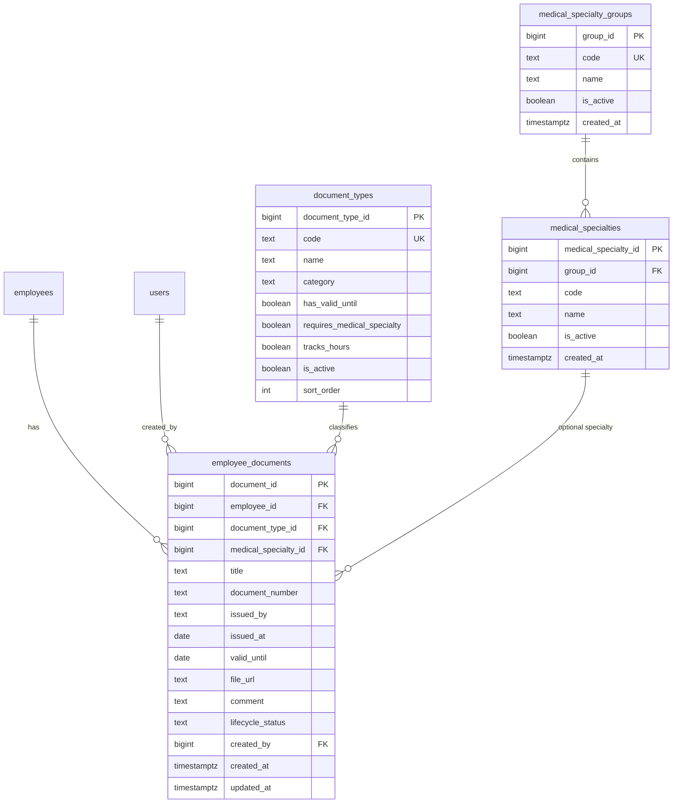

# ADR-037 — Employee Documents Registry (Phase 1A)

## Статус

**Принят** (design only; review decisions зафиксированы 2026-06).

**Реализация:** Phase 1A — production-ready реестр профессиональных документов сотрудника.

## Дата

2026-06

## Связанные ADR

- [ADR-031 — Directory Personnel Contacts Contract](./ADR-031-directory-personnel-contacts-contract.md) — раздел Personnel, Track A/B
- [ADR-033 — Personnel Governance Model](./ADR-033-personnel-governance-model.md) — RBAC HR, append-only journal
- [ADR-036 — HR Events Unified Model](./ADR-036-hr-events-unified-model.md) — разделение проф. документов и кадровых приказов; `document_registry` Phase 3
- **ADR-034 (local demo, deprecated)** — `certificate_types` / `employee_certificates`; read-only demo, заменяется ADR-037
- [HR Demo Local Runbook](../demo/HR-DEMO-LOCAL-RUNBOOK.md) — demo SQL scripts (sunset после Phase 1A)

---

## Контекст

Аудит ADR-034 показал:

- на VPS вкладка «Реестр документов» работает через **demo-модель** (`certificate_types`, `employee_certificates`, read-only API);
- production Alembic **не содержит** таблиц документов;
- вкладка локально скрыта флагом `demoOnly` до применения demo SQL;
- demo покрывает только сертификаты с `expires_at`, без CRUD, файлов, справочника специальностей.

ADR-037 фиксирует **document-centric** production-модель: одна таблица `employee_documents` для любых профессиональных документов (сертификат, аккредитация, удостоверение ПК, диплом переподготовки, конференция, семинар, мастер-класс).

**Не входит в Phase 1A:** учёт часов НМО, upload файлов, Google Drive, Excel import, интеграция с `employee_events`, отчёты, `employee_professions`, `verification_status`, `remind_before_days`.

---

## Проблема

1. Demo ADR-034 не является production source of truth.
2. Нет CRUD — HR не может вести реестр в системе.
3. Специальности захардкожены в UI (`professionalProfile.ts`), не в БД.
4. Training-centric модель (отдельные `training_types`, часы) избыточна для универсального реестра на MVP.
5. `employees.position_id` ≠ медицинская специальность; нужен отдельный справочник.

---

## Решение

### Принципы Phase 1A

| # | Принцип |
|---|---------|
| 1 | **Document-centric:** тип документа задаёт поведение через `document_types`, не отдельная сущность «обучение» |
| 2 | **Отдельный контур от HR Events:** документы не пишутся в `employee_events` (см. ADR-036) |
| 3 | **Soft lifecycle:** UI Phase 1A — только `ACTIVE` и `SUPERSEDED`; удаление = SUPERSEDED, не DELETE. `DRAFT` зарезервирован в CHECK, workflow — Phase 1B+ |
| 4 | **Expiry computed:** `expiry_status` вычисляется из `valid_until`, не хранится |
| 5 | **file_url only:** URL или UNC-текст, copyable link; upload — Phase 2+ |
| 6 | **Privileged HR RBAC:** как `/directory/personnel-events` |
| 7 | **No employee_events side effects:** CRUD документов не пишет в кадровый журнал |
| 8 | **Specialties read-only:** groups/specialties — seed + GET; редактирование справочника — Phase 1B+ |
| 9 | **Inactive employees:** документы уволенных/неактивных сотрудников остаются в реестре для privileged HR |

---

## ER-схема (окончательная, Phase 1A)



### Связи

```text
employees.employee_id          ←── employee_documents.employee_id
document_types.document_type_id ←── employee_documents.document_type_id
medical_specialties.medical_specialty_id ←── employee_documents.medical_specialty_id (NULL allowed)
medical_specialty_groups.group_id ←── medical_specialties.group_id
users.user_id                  ←── employee_documents.created_by
```

### Ограничения и индексы

```text
employee_documents.lifecycle_status IN ('ACTIVE', 'SUPERSEDED', 'DRAFT')
  -- DRAFT: reserved in schema; Phase 1A API/UI accept only ACTIVE | SUPERSEDED

document_types.category IN ('CREDENTIAL', 'EDUCATION', 'PARTICIPATION')

medical_specialties UNIQUE (group_id, code)

ix_employee_documents_employee_active
  ON (employee_id, lifecycle_status) WHERE lifecycle_status = 'ACTIVE'

ix_employee_documents_type
  ON (document_type_id)

ix_employee_documents_specialty
  ON (medical_specialty_id) WHERE medical_specialty_id IS NOT NULL

ix_employee_documents_valid_until
  ON (valid_until) WHERE lifecycle_status = 'ACTIVE' AND valid_until IS NOT NULL
```

**Phase 1B (не в 1A):** partial unique `(employee_id, document_type_id, medical_specialty_id) WHERE lifecycle_status = 'ACTIVE' AND requires_medical_specialty`.

---

## Список таблиц

### Phase 1A — создаются Alembic

| Таблица | Назначение | Строк seed (мин.) |
|---------|------------|-------------------|
| `medical_specialty_groups` | Группы: врачи, медсёстры (**read-only seed**) | 2 (`DOCTOR`, `NURSE`) |
| `medical_specialties` | Справочник мед. специальностей (**read-only seed**) | 10–20 |
| `document_types` | Типы проф. документов + поведение | 7 |
| `employee_documents` | Реестр документов сотрудников | 0 (runtime CRUD) |

### Phase 1A — используются (существуют)

| Таблица | Роль |
|---------|------|
| `employees` | FK сотрудника |
| `users` | FK `created_by`, RBAC |

### Отложено (не Phase 1A)

| Таблица / поле | Фаза | Назначение |
|----------------|------|------------|
| `employee_professions` | 1B | Основная/доп. специальность сотрудника |
| `employee_documents.hours` | 1B | Учёт часов обучения |
| `employee_documents.verification_status` | 1B | UNVERIFIED / VERIFIED / REJECTED |
| `employee_documents.remind_before_days` | 2 | Индивидуальные напоминания |
| `document_files` | 2 | Метаданные upload / версии |
| `certificate_requirements` | 2 | Обязательные документы по specialty/group |
| `medical_specialties` CRUD (admin) | 1B | Редактирование справочника специальностей |
| `training_types` | — | **Не планируется**; заменено `document_types.category` |

### Deprecated (sunset после Phase 1A deploy)

| Demo ADR-034 | Замена |
|--------------|--------|
| `certificate_types` | `document_types` |
| `employee_certificates` | `employee_documents` |
| `GET /directory/professional-documents*` | Deprecated; UI Phase 1A → `GET /directory/employee-documents*` (backend demo endpoints остаются, без 410) |

---

## DDL-контракт (reference)

### `medical_specialty_groups`

| Column | Type | Notes |
|--------|------|-------|
| `group_id` | BIGINT IDENTITY PK | |
| `code` | TEXT NOT NULL UNIQUE | `DOCTOR`, `NURSE` |
| `name` | TEXT NOT NULL | «Врачи», «Средний мед. персонал» |
| `is_active` | BOOLEAN NOT NULL DEFAULT TRUE | |
| `created_at` | TIMESTAMPTZ NOT NULL DEFAULT now() | |

### `medical_specialties`

| Column | Type | Notes |
|--------|------|-------|
| `medical_specialty_id` | BIGINT IDENTITY PK | |
| `group_id` | BIGINT NOT NULL FK → groups | |
| `code` | TEXT NOT NULL | UNIQUE per group |
| `name` | TEXT NOT NULL | |
| `is_active` | BOOLEAN NOT NULL DEFAULT TRUE | |
| `created_at` | TIMESTAMPTZ NOT NULL DEFAULT now() | |

### `document_types`

| Column | Type | Notes |
|--------|------|-------|
| `document_type_id` | BIGINT IDENTITY PK | |
| `code` | TEXT NOT NULL UNIQUE | см. seed ниже |
| `name` | TEXT NOT NULL | UI label |
| `category` | TEXT NOT NULL | CREDENTIAL \| EDUCATION \| PARTICIPATION |
| `has_valid_until` | BOOLEAN NOT NULL DEFAULT FALSE | UI: поле «Действует до» |
| `requires_medical_specialty` | BOOLEAN NOT NULL DEFAULT FALSE | validation on POST/PUT |
| `tracks_hours` | BOOLEAN NOT NULL DEFAULT FALSE | unused in 1A UI |
| `is_active` | BOOLEAN NOT NULL DEFAULT TRUE | |
| `sort_order` | INT NOT NULL DEFAULT 0 | |

**Seed `document_types`:**

| code | name | category | has_valid_until | requires_specialty |
|------|------|----------|-----------------|-------------------|
| `SPECIALIST_CERT` | Сертификат специалиста | CREDENTIAL | ✓ | ✓ |
| `ACCREDITATION` | Аккредитация | CREDENTIAL | ✓ | ✓ |
| `QUAL_UPGRADE` | Удостоверение о повышении квалификации | EDUCATION | ✗ | ✗ |
| `RETRAINING_DIPLOMA` | Диплом о переподготовке | EDUCATION | ✗ | ✓ |
| `CONFERENCE_CERT` | Сертификат участия в конференции | PARTICIPATION | ✗ | ✗ |
| `SEMINAR_CERT` | Свидетельство семинара | PARTICIPATION | ✗ | ✗ |
| `MASTERCLASS_CERT` | Сертификат мастер-класса | PARTICIPATION | ✗ | ✗ |

### `employee_documents`

| Column | Type | Notes |
|--------|------|-------|
| `document_id` | BIGINT IDENTITY PK | |
| `employee_id` | BIGINT NOT NULL FK → employees | |
| `document_type_id` | BIGINT NOT NULL FK → document_types | |
| `medical_specialty_id` | BIGINT NULL FK → medical_specialties | required if type.requires_medical_specialty |
| `title` | TEXT NULL | свободное название |
| `document_number` | TEXT NULL | номер документа |
| `issued_by` | TEXT NULL | кем выдан |
| `issued_at` | DATE NULL | дата выдачи |
| `valid_until` | DATE NULL | required if type.has_valid_until |
| `file_url` | TEXT NULL | URL или UNC; max 2000 in API |
| `comment` | TEXT NULL | |
| `lifecycle_status` | TEXT NOT NULL DEFAULT 'ACTIVE' | ACTIVE \| SUPERSEDED (Phase 1A UI/API); DRAFT — reserved in CHECK only |
| `created_by` | BIGINT NOT NULL FK → users | |
| `created_at` | TIMESTAMPTZ NOT NULL DEFAULT now() | |
| `updated_at` | TIMESTAMPTZ NOT NULL DEFAULT now() | trigger or app-level on PUT |

---

## Alembic migration plan

### Ревизия

```text
Revision ID:  d9e8f71a2b05  (placeholder — assign at implementation)
Revises:      c7f3d92a1e04  (hr_events_phase_1a — current head)
File:         alembic/versions/d9e8f71a2b05_add_employee_documents_phase_1a.py
Title:        add employee documents registry phase 1a
```

### Upgrade steps (ordered)

| Step | Action |
|------|--------|
| 1 | `CREATE TABLE medical_specialty_groups` + seed DOCTOR, NURSE |
| 2 | `CREATE TABLE medical_specialties` + seed (мин. 4 doctor + 2 nurse specialties) |
| 3 | `CREATE TABLE document_types` + seed 7 types |
| 4 | `CREATE TABLE employee_documents` + FK + CHECK + indexes |
| 5 | Do **not** drop demo tables in 1A (parallel deprecation) |

**Backfill не входит в обязательную Alembic migration.**

Demo `employee_certificates` → `employee_documents` — **optional**, только если на VPS нужно сохранить demo-данные. Выполняется **отдельным manual script** (не `alembic upgrade`):

```text
scripts/manual/adr037_backfill_demo_certificates.sql   (создать при необходимости)
```

Script: run manually after migration; map `MED_SPEC`→`SPECIALIST_CERT`, `ACCRED`→`ACCREDITATION`; idempotent; не часть CI.

### Downgrade

| Step | Action |
|------|--------|
| 1 | `DROP TABLE employee_documents` |
| 2 | `DROP TABLE document_types` |
| 3 | `DROP TABLE medical_specialties` |
| 4 | `DROP TABLE medical_specialty_groups` |

### Seed specialties (minimum)

**Groups:** `DOCTOR` / «Врачи», `NURSE` / «Средний медицинский персонал».

**Specialties (example):**

| group | code | name |
|-------|------|------|
| DOCTOR | ONCOLOGY | Врач-онколог |
| DOCTOR | SURGERY | Врач-хирург |
| DOCTOR | THERAPY | Врач-терапевт |
| DOCTOR | GYNECOLOGY | Врач-акушер-гинеколог |
| NURSE | GENERAL | Медицинская сестра |
| NURSE | OR | Операционная медсестра |

### Implementation files (reference)

| Layer | Path |
|-------|------|
| Migration | `alembic/versions/d9e8f71a2b05_add_employee_documents_phase_1a.py` |
| Service | `app/services/employee_documents_service.py` |
| Routes | `app/directory/employee_documents_routes.py` |
| Router | `app/directory/router.py` (include) |
| Tests | `tests/test_employee_documents_routes.py` |
| UI client | `corpsite-ui/app/directory/personnel/_lib/documentsApi.client.ts` |
| UI page | refactor `ProfessionalDocumentsPageClient.tsx` |
| Nav | `PersonnelSubNav.tsx` — remove `demoOnly` |

---

## API contract

**Base path:** `/directory`  
**Auth:** Bearer JWT or dev `X-User-Id`  
**RBAC:** privileged HR only (`DIRECTORY_PRIVILEGED_USER_IDS`); unprivileged → `403 Forbidden`

### Computed fields

**`expiry_status`** (read-only, not stored):

| Value | Rule |
|-------|------|
| `NO_EXPIRY` | `valid_until IS NULL` |
| `VALID` | `valid_until > today + 60 days` |
| `EXPIRING_60` | `today + 30 < valid_until ≤ today + 60` |
| `EXPIRING_30` | `today < valid_until ≤ today + 30` |
| `EXPIRED` | `valid_until ≤ today` |

Constants: `EXPIRY_WARN_60_DAYS = 60`, `EXPIRY_WARN_30_DAYS = 30` (service layer).

---

### `GET /directory/document-types`

Справочник типов документов.

**Query:** `is_active` (bool, default true)

**Response 200:**

```json
{
  "items": [
    {
      "document_type_id": 1,
      "code": "SPECIALIST_CERT",
      "name": "Сертификат специалиста",
      "category": "CREDENTIAL",
      "has_valid_until": true,
      "requires_medical_specialty": true,
      "tracks_hours": false,
      "sort_order": 10
    }
  ],
  "total": 7
}
```

---

### `GET /directory/medical-specialty-groups`

**Response 200:**

```json
{
  "items": [
    { "group_id": 1, "code": "DOCTOR", "name": "Врачи", "is_active": true }
  ],
  "total": 2
}
```

---

### `GET /directory/medical-specialties`

**Query:**

| Param | Type | Description |
|-------|------|-------------|
| `group_id` | int | filter by group |
| `group_code` | string | `DOCTOR` \| `NURSE` |
| `is_active` | bool | default true |

**Response 200:**

```json
{
  "items": [
    {
      "medical_specialty_id": 1,
      "group_id": 1,
      "group_code": "DOCTOR",
      "code": "ONCOLOGY",
      "name": "Врач-онколог",
      "is_active": true
    }
  ],
  "total": 6
}
```

---

### `GET /directory/employee-documents`

Org-wide register (replaces demo `GET /professional-documents`).

**Query:**

| Param | Type | Description |
|-------|------|-------------|
| `employee_id` | int | filter by employee |
| `document_type_id` | int | filter by type |
| `document_type_code` | string | alternative to id |
| `medical_specialty_id` | int | filter by specialty |
| `group_code` | string | filter by specialty group |
| `lifecycle_status` | string | default `ACTIVE` |
| `expiry_status` | string | VALID, EXPIRING_60, EXPIRING_30, EXPIRED, NO_EXPIRY |
| `q` | string | search employee full_name (case-insensitive) |
| `employee_is_active` | bool | optional filter; **default: no filter** — inactive employees' docs remain visible |
| `limit` | int | default 100, max 500 |
| `offset` | int | default 0 |

**Response 200:**

```json
{
  "items": [
    {
      "document_id": 42,
      "employee_id": 7,
      "employee_name": "Иванова Мария Петровна",
      "document_type_id": 1,
      "document_type_code": "SPECIALIST_CERT",
      "document_type_name": "Сертификат специалиста",
      "medical_specialty_id": 1,
      "medical_specialty_name": "Врач-онколог",
      "title": null,
      "document_number": "СП-12345",
      "issued_by": "Минздрав",
      "issued_at": "2021-03-15",
      "valid_until": "2026-03-14",
      "file_url": "https://drive.example/doc/abc",
      "comment": null,
      "lifecycle_status": "ACTIVE",
      "expiry_status": "EXPIRING_60",
      "created_at": "2026-06-16T10:00:00Z",
      "updated_at": "2026-06-16T10:00:00Z"
    }
  ],
  "total": 1
}
```

---

### `GET /directory/employee-documents/{document_id}`

**Response 200:** single item (same shape as list item).  
**Response 404:** document not found.

---

### `POST /directory/employee-documents`

**Request body:**

```json
{
  "employee_id": 7,
  "document_type_id": 1,
  "medical_specialty_id": 1,
  "title": null,
  "document_number": "СП-12345",
  "issued_by": "Минздрав",
  "issued_at": "2021-03-15",
  "valid_until": "2026-03-14",
  "file_url": "https://drive.example/doc/abc",
  "comment": null,
  "lifecycle_status": "ACTIVE"
}
```

`lifecycle_status` в POST опционален (default `ACTIVE`); значение `DRAFT` → 422 в Phase 1A.

**Validation:**

| Rule | HTTP |
|------|------|
| `employee_id` exists | 404 |
| `document_type_id` exists and active | 400 |
| `requires_medical_specialty` → `medical_specialty_id` required | 422 |
| `has_valid_until` → `valid_until` required | 422 |
| `!has_valid_until` → `valid_until` must be null | 422 |
| `file_url` max 2000 chars | 422 |

**HR import promotion (ADR-039 Phase 3F):** Manual POST/PUT rules above apply to the personnel UI. Promotion from `hr_import_normalized_records` uses a narrower override:

| Import `record_kind` | `medical_specialty_id` on promotion |
|----------------------|-----------------------------------|
| `category` | Optional — `QUALIFICATION_CATEGORY` has `requires_medical_specialty = FALSE`; free-text `specialty_text` kept in staging and reflected in promoted `title` / `source_text` |
| `training` | Optional — unresolved or empty `specialty_text` does not block promotion; FK set only when catalog resolves exactly |
| `certificate` | Required when `SPECIALIST_CERTIFICATION.requires_medical_specialty` (unchanged) |

Category and non-clinical training rows are **HR evidence records** in the import contour; specialty FK remains required for manual specialist credentials and certificate promotion.

| `lifecycle_status` must be `ACTIVE` (default) or omitted; `DRAFT` rejected in Phase 1A | 422 |
| POST/PUT/DELETE must **not** insert/update `employee_events` | — |

**Response 201:** created item with `document_id`, `expiry_status`, audit fields.

---

### `PUT /directory/employee-documents/{document_id}`

**Request body:** partial update (same fields as POST, all optional except at least one field).

**Rules:**

- Cannot change `employee_id` (immutable) — 422 if sent.
- Re-validate type/specialty/expiry rules on change.
- Set `updated_at = now()`.

**Response 200:** updated item.

---

### `DELETE /directory/employee-documents/{document_id}`

Soft delete: sets `lifecycle_status = SUPERSEDED`.

**Response 200:**

```json
{
  "document_id": 42,
  "lifecycle_status": "SUPERSEDED"
}
```

Hard DELETE **запрещён** в Phase 1A.

---

### Deprecated endpoints (Phase 1A)

Demo endpoints **остаются** в backend, помечены deprecated. **410 Gone не возвращать** в Phase 1A.

| Endpoint | Behavior Phase 1A |
|----------|-------------------|
| `GET /directory/professional-documents/availability` | Deprecated; unchanged behavior if demo tables exist |
| `GET /directory/professional-documents` | Deprecated; unchanged read-only demo if demo tables exist |

**UI Phase 1A:** полностью переключить на `/directory/employee-documents*`; **не вызывать** demo API (`demoApi.client.ts` → `documentsApi.client.ts`). Sunset demo endpoints — Phase 1B+.

---

### Error envelope

Стандарт Corpsite: `{ "detail": "..." }` (FastAPI HTTPException).

---

## UI wireframe — вкладка «Реестр документов»

**Route:** `/directory/personnel/documents`  
**Nav:** PersonnelSubNav — три вкладки всегда видимы (без `demoOnly`).

### Layout (ASCII wireframe)

```text
┌─────────────────────────────────────────────────────────────────────────────┐
│  [ Сотрудники ]  [ Кадровый журнал ]  [ Реестр документов ● ]               │
├─────────────────────────────────────────────────────────────────────────────┤
│  Реестр профессиональных документов                                         │
│  Сводный реестр для контроля сроков.                          [ + Добавить ]│
├─────────────────────────────────────────────────────────────────────────────┤
│  ┌─────────┐ ┌─────────┐ ┌─────────┐ ┌─────────┐ ┌─────────┐              │
│  │ Истёк   │ │ ≤ 30 дн │ │ ≤ 60 дн │ │Действует│ │ Без срок│   ← chips    │
│  │   2     │ │   1     │ │   3     │ │   12    │ │    4    │   (click=filter)│
│  └─────────┘ └─────────┘ └─────────┘ └─────────┘ └─────────┘              │
├─────────────────────────────────────────────────────────────────────────────┤
│  Статус [▼ Все ]  Тип [▼ Все ]  Специальность [▼ Все ]  Группа [▼ Все ]     │
│  Поиск сотрудника [________________________]              показано: 18 / 22   │
│  [ Все ] [ Проблемные ] [ Истёк ] [ ≤30 ] [ ≤60 ]          ← quick filters  │
├─────────────────────────────────────────────────────────────────────────────┤
│  Сотрудник      │ Тип документа    │ Специальность │ №      │ До    │ Статус│
│─────────────────┼──────────────────┼───────────────┼────────┼───────┼───────│
│  Иванова М.П.   │ Сертификат спец. │ Врач-онколог  │ СП-123 │14.03.│ ≤60д  │
│  Петров А.С.    │ Аккредитация     │ Врач-хирург   │ АК-77  │01.07.│ ≤30д  │
│  Сидорова Е.В.  │ Семинар          │ —             │ С-001  │   —   │ Без   │
│  ...            │                  │               │        │       │       │
└─────────────────────────────────────────────────────────────────────────────┘
  row click → EmployeeDrawer (existing)
  row menu / edit icon → DocumentFormModal
```

### Modal «Добавить / Редактировать документ»

```text
┌──────────────────────────────────────────┐
│  Добавить документ                    ✕  │
├──────────────────────────────────────────┤
│  Сотрудник *        [▼ выбор / поиск ]   │
│  Тип документа *    [▼ document_types ]  │
│  Специальность      [▼ specialties    ]  │  ← visible if type.requires_medical_specialty
│  Название           [________________ ]  │
│  Номер документа    [________________ ]  │
│  Кем выдан          [________________ ]  │
│  Дата выдачи        [__.__.____        ]  │
│  Действует до       [__.__.____        ]  │  ← visible if type.has_valid_until
│  Ссылка на файл     [________________ ]  │  ← URL/UNC text only; copyable; http(s)=link
│  Комментарий        [________________ ]  │
│                                          │
│              [ Отмена ]  [ Сохранить ]   │
└──────────────────────────────────────────┘
```

### UI behavior rules

| Element | Behavior |
|---------|----------|
| Summary chips | Count from `expiry_status`; click sets filter |
| «Проблемные» | EXPIRED + EXPIRING_30 + EXPIRING_60 |
| Specialty column | `—` if null |
| Valid until column | `—` if NO_EXPIRY |
| file_url in modal | Text field + copyable display; http(s) clickable; UNC copy-only (ADR-036); **no upload control** |
| file_url in table | Optional icon/link column Phase 1B; in 1A — in modal only |
| lifecycle_status in UI | ACTIVE only for new docs; delete → SUPERSEDED; no DRAFT selector |
| Specialties dropdown | Populated from `GET /medical-specialties` (read-only seed); no admin CRUD |
| EmployeeDrawer | Reuse; `EmployeeProfessionalProfile` reads `GET ?employee_id=` |
| Empty state | «Нет документов» + CTA «Добавить» |
| Error state | Banner with retry |

### Files to change (implementation reference)

| File | Change |
|------|--------|
| `PersonnelSubNav.tsx` | Remove `demoOnly`, remove availability fetch |
| `ProfessionalDocumentsPageClient.tsx` | CRUD UI, new API client |
| `documentsApi.client.ts` | New production client |
| `professionalProfile.ts` | Remove demo constants; use API specialty names |
| `EmployeeProfessionalProfile.tsx` | Filter documents by `employee_id` from new API |
| `demoApi.client.ts` | **Remove** professional-documents calls from UI (Phase 1A acceptance) |

---

## Roadmap после Phase 1A

| Phase | Scope |
|-------|-------|
| **1A** | This ADR — CRUD registry, types, specialties, expiry, file_url |
| **1B** | `employee_professions`, `hours`, `verification_status`, unique ACTIVE constraint, specialties CRUD, DRAFT workflow |
| **2** | `remind_before_days`, reports, `certificate_requirements`, file upload |
| **3** | ADR-036 `document_registry` convergence, `employee_events` link |

---

## Критерии приёмки Phase 1A

### Database

- [ ] Alembic `upgrade head` создаёт 4 таблицы без ошибок на чистой БД после `c7f3d92a1e04`
- [ ] Seed содержит 2 groups, ≥6 specialties, 7 document_types
- [ ] FK constraints: orphan `employee_documents` row rejected
- [ ] `lifecycle_status` CHECK enforced
- [ ] Downgrade удаляет таблицы в обратном порядке

### API

- [ ] `GET /directory/document-types` — 200, 7 items для privileged user
- [ ] `GET /directory/medical-specialties?group_code=DOCTOR` — фильтрация работает
- [ ] `GET /directory/employee-documents` — 200, пустой список на fresh DB
- [ ] `POST /directory/employee-documents` — 201, корректный `expiry_status`
- [ ] POST с `SPECIALIST_CERT` без specialty → 422
- [ ] POST с `SEMINAR_CERT` + `valid_until` → 422 (type has_valid_until=false)
- [ ] `PUT /directory/employee-documents/{id}` — обновляет поля, `updated_at` меняется
- [ ] `DELETE /directory/employee-documents/{id}` — soft SUPERSEDED, не в default list
- [ ] Unprivileged user → 403 на все mutating endpoints
- [ ] Filter `expiry_status=EXPIRED` возвращает только просроченные ACTIVE docs
- [ ] Documents for **inactive** employees (`employees.is_active = false`) remain in default list for privileged HR (no implicit filter excluding them)
- [ ] POST/PUT/DELETE document **does not** create rows in `employee_events` (verify count before/after)
- [ ] POST with `lifecycle_status: "DRAFT"` → 422
- [ ] No POST/PUT/PATCH endpoints for `medical_specialties` or `medical_specialty_groups` (GET only)
- [ ] `pytest tests/test_employee_documents_routes.py` — green

### UI

- [ ] Вкладка «Реестр документов» видна без demo SQL / без `demoOnly`
- [ ] Список загружается из `GET /employee-documents`
- [ ] Фильтры: статус срока, тип, специальность, поиск ФИО — работают
- [ ] Summary chips показывают counts и фильтруют
- [ ] «Добавить документ» — modal, сохранение через POST, строка появляется в таблице
- [ ] Редактирование существующего документа через PUT
- [ ] Soft delete убирает документ из списка ACTIVE
- [ ] Conditional fields: specialty / valid_until по `document_types` flags
- [ ] `file_url` сохраняется как текст; отображается copyable; http(s) — кликабельная ссылка; **нет** upload control / file picker
- [ ] Row click открывает EmployeeDrawer
- [ ] `EmployeeProfessionalProfile` показывает документы сотрудника из production API
- [ ] UI **не вызывает** `/directory/professional-documents*` (no demo API calls)
- [ ] Lifecycle UI: только ACTIVE (create/edit) и SUPERSEDED (delete); нет DRAFT workflow

### Deprecation / docs

- [ ] `HR-DEMO-LOCAL-RUNBOOK.md` обновлён: ADR-037 replaces ADR-034 demo path
- [ ] Demo endpoints помечены deprecated в code comments
- [ ] Optional manual backfill script documented; not run in mandatory migration path

### Explicitly NOT in acceptance (Phase 1A)

- [ ] Upload файлов
- [ ] Google Drive integration
- [ ] Excel import
- [ ] Hours / 144ч за 5 лет
- [ ] `employee_events` записи при CRUD
- [ ] `verification_status`
- [ ] `employee_professions`
- [ ] Org-wide expiry report export

---

## Риски

| # | Риск | Митигация |
|---|------|-----------|
| 1 | Demo + production tables coexist on VPS | Optional backfill; deprecate demo API; document cutover |
| 2 | Duplicate ACTIVE certs same type | Service validation in 1A; unique index in 1B |
| 3 | Incomplete specialty seed | Read-only seed in 1A; admin CRUD for specialties — Phase 1B; seed enough for MVP |
| 4 | UNC `file_url` not clickable | Copyable text + tooltip (ADR-036 pattern) |
| 5 | Scope creep into hours/verification | Acceptance checklist explicit exclusions |
| 6 | Breaking VPS demo tab during migration | Feature flag or availability on new tables first |

---

## Review decisions (зафиксировано)

| # | Решение |
|---|---------|
| 1 | **Backfill** demo `employee_certificates` → `employee_documents` — **optional**. Не включать в обязательную Alembic migration. Отдельный manual script только если нужно сохранить VPS demo data. |
| 2 | **Demo endpoints** `/directory/professional-documents*` — **deprecated** в Phase 1A, **без 410**. UI после Phase 1A **не использует** demo API. |
| 3 | **Lifecycle:** Phase 1A UI — только `ACTIVE` и `SUPERSEDED`. `DRAFT` остаётся в DB CHECK как reserved; workflow DRAFT — не в Phase 1A. |
| 4 | **Specialties:** `medical_specialty_groups` и `medical_specialties` — **read-only seed** в Phase 1A. Только GET endpoints; CRUD/UI редактирования — отложено. |
| 5 | **Acceptance extras:** документы неактивных сотрудников видны privileged HR; CRUD не пишет в `employee_events`; `file_url` — text/copyable link, без upload. |

---

## Решение (summary)

Phase 1A вводит **document-centric** production registry на 4 таблицах с CRUD API, computed expiry, `file_url` (text/copyable, no upload), read-only seed справочников типов и специальностей. Demo ADR-034 deprecated без 410; UI полностью на production API. CRUD не пишет в `employee_events`. Backfill demo data — optional manual script, не Alembic. Training-centric сущности, DRAFT workflow и specialties admin — Phase 1B+.
