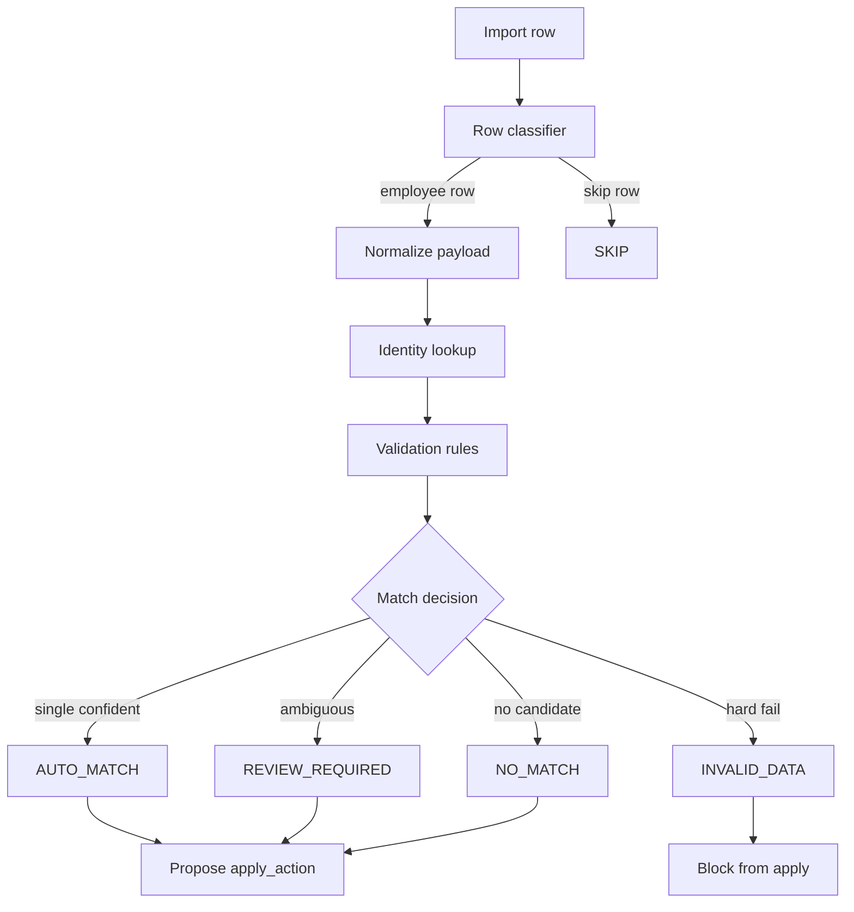
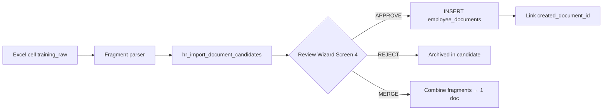
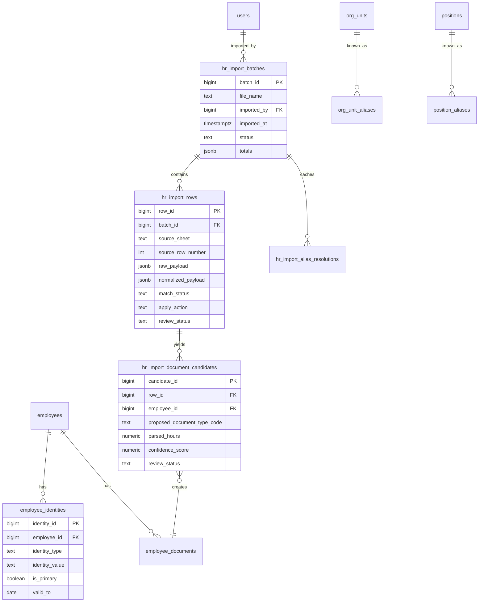

# ADR-038 — Employee Identity & HR Import Architecture

## Статус

**Предложен** (design only; код, миграции и коммиты не входят в scope ADR).

## Дата

2026-06

## Связанные ADR и артефакты

- [ADR-033 — Personnel Governance Model](./ADR-033-personnel-governance-model.md) — кадровые операции, `employee_events`, RBAC HR
- [ADR-031 — Directory Personnel Contacts Contract](./ADR-031-directory-personnel-contacts-contract.md) — разделение сотрудник / контакт / должность
- [ADR-037 — Employee Documents Registry](./ADR-037-employee-documents-registry.md) — `employee_documents`, Phase 1B hours/verification
- [ADR-014 — Data Sync Policy](./ADR-014-data-sync-policy.md) — legacy `employees_import*`, delta-import сотрудников
- [ADR-032 — Employee Transfer Architecture](./ADR-032-employee-transfer-architecture.md) — кадровые операции перевода
- [ADR-036 — HR Events Unified Model](./ADR-036-hr-events-unified-model.md) — разделение проф. документов и кадровых приказов
- Phase 0 / 0B: `scripts/import_hr_control_list.py` (dry-run parser, commit `47a0a0f`)
- Phase 1: domain mapping review (без apply)

---

## Context

К июню 2026 завершены:

| Фаза | Результат |
|------|-----------|
| ADR-037 Phase 1B | Реестр документов, учёт часов ПК (144 ч / 5 лет) |
| HR Import Phase 0 / 0B | Dry-run парсер контрольного списка Excel → CSV preview |
| HR Import Phase 1 | Domain mapping review, выявлены блокеры apply |

**Текущая модель `employees`** (Alembic baseline):

```text
employee_id, full_name, department_id, position_id,
date_from, date_to, employment_rate, is_active, org_unit_id
```

**ИИН отсутствует.** Сопоставление сотрудника при импорте невозможно надёжно.

**Результаты Phase 0 на реальном файле** (`контрольный июнь.xlsx`, ~1076 строк):

| Метрика | Значение |
|---------|----------|
| Строк с валидным ИИН | большинство |
| Строк без ИИН | есть |
| Групп дублирующихся ИИН | 11 (22 строки) — совместители, переводы, дубли листов |
| `missing_full_name` в preview | 1076 — парсер doctors profile не читает колонку C (ФИО в merged layout); требует доработки parser Phase 2 |
| Листы «совместители» | отдельные sheet_type `part_time` |
| Декларационные / итоговые строки | sheet_type `declaration`, section headers |
| `training_raw` / `certification_raw` | многозначный свободный текст (до 9+ записей в одной ячейке) |
| `department` | merged cells, варианты написания («№3» vs «№ 3») |
| `position_raw` | составные строки («Врач терапевт … Заведующий … с 01.12.2022») |

**Legacy import** (`employees_import_stage`, `employees_import`) — flat-таблицы для простого CSV/XLSX upsert по `employee_id` + ФИО + отдел + должность. Не поддерживают batch lifecycle, match engine, document parsing, review queue.

**Цель ADR-038:** зафиксировать архитектуру идентичности сотрудника, staging, match engine, document candidates и HR Import Wizard **до** любого apply в production.

---

## Problem

1. **Нет стабильного ключа сотрудника** — `full_name` не уникален; `employee_id` в Excel отсутствует; ИИН не хранится в БД.
2. **Excel ≠ кадровая модель Corpsite** — совместители, декларации, итоги, merged departments, составные должности.
3. **Профессиональные данные требуют human-in-the-loop** — training/certification не мапятся 1:1 в `employee_documents` без review.
4. **Существующий import path опасен для apply** — прямой upsert в `employees` нарушает ADR-033 (нет `employee_events`, нет review).
5. **Org unit / position mismatch** — текст Excel не совпадает с canonical `org_units` / `positions` без alias mapping.
6. **PII и RBAC** — ИИН, дата рождения, пол, национальность требуют политики хранения и маскирования.

**Блокеры apply (зафиксированы Phase 1 review):**

- отсутствует ИИН в `employees`;
- нет стратегии идентификации;
- Excel содержит совместителей;
- Excel содержит декларационные и итоговые строки;
- department требует alias mapping;
- training/certification — многозначный текст;
- `employee_documents` готовы, но нужны staging и review.

---

# 1. Employee Identity Design

## 1.1. Варианты

### Вариант A — `employees.iin`

Добавить колонку `iin TEXT NULL` непосредственно в `employees`.

| Критерий | Оценка |
|----------|--------|
| **Плюсы** | Простые JOIN при match; минимальная схема; быстрый MVP; понятен HR; один источник для UI «ИИН сотрудника» |
| **Минусы** | Только один тип идентификатора; история смены ИИН теряется; смешение кадрового snapshot и identity; сложнее добавить табельный № / внешний ID позже |
| **Влияние на импорт** | Match = `SELECT employee_id FROM employees WHERE iin = :iin`. Простой и быстрый pipeline |
| **Влияние на безопасность** | PII в основной кадровой таблице; нужен column-level masking в API; расширение RBAC на поле |
| **Влияние на развитие** | Потребует миграции в B при появлении второго ID; смена ИИН = UPDATE + audit вручную |

### Вариант B — `employee_identities`

Отдельная таблица идентификаторов:

```text
employee_identities (
  identity_id       BIGINT IDENTITY PK,
  employee_id       BIGINT NOT NULL FK → employees,
  identity_type     TEXT NOT NULL,     -- IIN | TAB_NUMBER | EXTERNAL_HR_ID | ...
  identity_value    TEXT NOT NULL,
  is_primary        BOOLEAN NOT NULL DEFAULT FALSE,
  valid_from        DATE NULL,
  valid_to          DATE NULL,
  source            TEXT NULL,           -- MANUAL | HR_IMPORT | LEGACY
  created_at        TIMESTAMPTZ NOT NULL DEFAULT now(),
  created_by        BIGINT NULL FK → users
)
```

| Критерий | Оценка |
|----------|--------|
| **Плюсы** | Расширяемость; история смены ИИН через `valid_to`; несколько ID на сотрудника; чистое разделение PII; audit trail по `source` |
| **Минусы** | Дополнительный JOIN; сложнее UI; нужны правила «один primary IIN»; больше кода match engine |
| **Влияние на импорт** | Match через `identity_type='IIN' AND identity_value=:iin AND valid_to IS NULL`. Fallback на secondary types — Phase 3+ |
| **Влияние на безopасность** | PII изолирован; можно ограничить SELECT identities отдельным permission; маскирование на уровне service |
| **Влияние на развитие** | Естественная база для интеграции с 1C / SAP / табельным учётом без изменения `employees` |

### Вариант C — Гибрид: `employees.iin` + `employee_identities`

- `employees.iin` — denormalized cache primary IIN (maintained by service/trigger).
- `employee_identities` — canonical store + history.

| Критерий | Оценка |
|----------|--------|
| **Плюсы** | Быстрый lookup + полная история; совместимость с простыми запросами |
| **Минусы** | Дублирование; риск рассинхронизации cache vs identities; избыточен для MVP |
| **Рекомендация** | **Не для Phase 2.** Рассмотреть только если profiling покажет проблему JOIN на >10k сотрудников |

## 1.2. Политики по ИИН

### Нужен ли UNIQUE по ИИН?

**Да**, с оговорками:

```sql
CREATE UNIQUE INDEX uq_employee_identities_iin_active
  ON employee_identities (identity_value)
  WHERE identity_type = 'IIN' AND valid_to IS NULL;
```

Для варианта A — аналогичный partial unique на `employees.iin WHERE iin IS NOT NULL`.

**Обоснование:** один физический человек = один активный ИИН в системе. Совместительство — это **несколько employment records / assignments**, а не два разных `employee_id` с одним ИIN (см. §4, sheet `part_time`).

### Отсутствующий ИИН

| Ситуация | Действие |
|----------|----------|
| Строка import без ИИН | `match_status = REVIEW_REQUIRED` или `INVALID_DATA` если нет и ФИО |
| Fallback match | Normalized `full_name` + `birth_date` (если есть в staging) → fuzzy score; **никогда AUTO** без ИИН |
| Apply | Запрет AUTO apply; HR вручную связывает строку с `employee_id` или создаёт сотрудника + вводит ИИН |
| Хранение | ИИН не обязателен в `employees` на insert, но **обязателен для AUTO match** |

### Дубли ИИН (в файле или в БД)

| Ситуация | Действие |
|----------|----------|
| Дубль в одном batch (2+ строки) | Обе → `REVIEW_REQUIRED`, `error_codes` содержит `duplicate_iin_in_batch`; HR выбирает primary row или merge |
| ИИН совпадает, ФИО разное | `REVIEW_REQUIRED`, `iin_name_mismatch`; **запрет AUTO** |
| ИИН совпадает, разные листы (основной + совместитель) | Классификация `part_time_employment`; link к **одному** `employee_id`; обновление assignment, не создание нового employee |
| ИИН уже в БД, другой employee | `REVIEW_REQUIRED`, `iin_conflict_existing`; HR resolution + audit |

### Изменение ИИН

1. **Не перезаписывать silently.** Старый IIN → `valid_to = today` в `employee_identities`; новый → INSERT с `is_primary=true`.
2. Создать `employee_events` типа `CORRECTION` с payload `{ "field": "iin", "old": "...", "new": "..." }` (расширение ADR-033).
3. Import batch с новым IIN для known employee (match by name) → `REVIEW_REQUIRED`, не AUTO.

---

# 2. Personal Data Scope

Принцип: **Corpsite — не кадровое делопроизводство** (ADR-033). Хранить только то, что нужно для идентификации, compliance и рабочих процессов.

| Поле | Решение | Аргументация |
|------|---------|--------------|
| **Дата рождения** | **Staging only** (`hr_import_rows.normalized_payload`) | Нужна для disambiguation при review; не используется в RBAC/задачах; хранение в `employees` создаёт лишний PII footprint; после match можно отбросить или архивировать в batch |
| **Пол** | **Staging only** | Не влияет на кадровые операции Corpsite; может помочь при fuzzy match; не хранить в production без явного запроса HR/legal |
| **Национальность** | **Не хранить** (discard after parse) | Не используется системой; compliance-риск без business value |
| **Телефон** | **Не в `employees`**; опционально → `contacts` / `users.phone` через **отдельный reviewed apply** | ADR-031: контакт ≠ сотрудник; телефон из Excel часто личный/устаревший; import в contacts только после REVIEW и явного согласия HR |

**Phase 3+ (optional):** таблица `employee_personal_data` с encrypted-at-rest полями и отдельным RBAC, если кадровая служба формально запросит.

---

# 3. Match Engine Design

## 3.1. Pipeline



## 3.2. Этапы

### Import row

Вход: `raw_payload` (JSON всех ячеек) + metadata (`source_sheet`, `source_row_number`, `sheet_type`).

Row classifier (до match):

| `sheet_type` | Классификатор |
|--------------|---------------|
| `declaration` | → SKIP (`declarative_row`) |
| section header / total | → SKIP (`summary_row`) |
| `part_time` | → employee row, flag `is_part_time=true` |
| empty / no name & no iin | → SKIP (`empty_row`) |

### Identity lookup

Приоритет:

1. **IIN exact** → `employee_identities` (или `employees.iin`)
2. **Normalized full_name exact** + same org_unit (low confidence, max REVIEW)
3. **Fuzzy name** (Levenshtein / token sort) + birth_date if present → REVIEW only

### Validation

- IIN checksum / length (12 digits) — уже в Phase 0 `clean_iin()`
- Department resolvable via alias map (or `unknown_department`)
- Position parseable (or `unknown_position`)
- Name present for employee rows
- No duplicate IIN conflict without resolution

### Match status

| Status | Условие | Действие системы |
|--------|---------|------------------|
| **AUTO_MATCH** | Valid IIN → ровно 1 active employee; ФИО compatible (normalized similarity ≥ threshold); department mappable; не part_time conflict | `apply_action` candidate = AUTO; попадает в apply preview; **не пишет в БД** до confirm batch |
| **REVIEW_REQUIRED** | Duplicate IIN; IIN+name mismatch; fuzzy name; unknown dept/position; part_time row; missing IIN with name; multiple candidates | В review queue Wizard Screen 3; HR resolves → `review_status=APPROVED|REJECTED|MERGED` |
| **NO_MATCH** | Valid row, IIN not in DB, name not found | Предложить CREATE employee (после HR approve); или link manually |
| **INVALID_DATA** | Invalid IIN format; missing name AND missing IIN; unparseable required fields | Block apply; visible in error report; `error_codes` populated |

**Порог AUTO:** только IIN exact match + name compatibility + mappable dept. **Всё остальное — REVIEW.**

---

# 4. Staging Architecture

## 4.1. Таблицы

### `hr_import_batches`

| Column | Type | Notes |
|--------|------|-------|
| `batch_id` | BIGINT IDENTITY PK | |
| `file_name` | TEXT NOT NULL | оригинальное имя файла |
| `file_sha256` | TEXT NULL | dedup / audit |
| `imported_by` | BIGINT NOT NULL FK → users | |
| `imported_at` | TIMESTAMPTZ NOT NULL DEFAULT now() | |
| `status` | TEXT NOT NULL | `UPLOADED` \| `PARSED` \| `IN_REVIEW` \| `APPLY_PENDING` \| `APPLIED` \| `PARTIALLY_APPLIED` \| `FAILED` \| `CANCELLED` |
| `sheet_manifest` | JSONB NULL | список листов, sheet_type, row counts |
| `totals` | JSONB NOT NULL DEFAULT '{}' | `{ "rows": N, "auto": N, "review": N, "skip": N, "invalid": N, "documents": N }` |
| `audit_summary` | JSONB NULL | агрегаты Phase 0 style |
| `applied_at` | TIMESTAMPTZ NULL | |
| `applied_by` | BIGINT NULL FK → users | |
| `error_message` | TEXT NULL | batch-level fatal |

### `hr_import_rows`

| Column | Type | Notes |
|--------|------|-------|
| `row_id` | BIGINT IDENTITY PK | |
| `batch_id` | BIGINT NOT NULL FK → hr_import_batches | |
| `source_sheet` | TEXT NOT NULL | |
| `source_row_number` | INT NOT NULL | |
| `sheet_type` | TEXT NULL | doctors, nurses, part_time, declaration, … |
| `row_kind` | TEXT NOT NULL DEFAULT 'employee' | `employee` \| `document_fragment` \| `skip` |
| `raw_payload` | JSONB NOT NULL | все ячейки as-is |
| `normalized_payload` | JSONB NOT NULL | parsed fields (full_name, iin, department, position_raw, training_raw, …) |
| `matched_employee_id` | BIGINT NULL FK → employees | после match / review |
| `match_status` | TEXT NOT NULL | AUTO_MATCH \| REVIEW_REQUIRED \| NO_MATCH \| INVALID_DATA \| SKIPPED |
| `match_score` | NUMERIC(5,4) NULL | 0..1 для fuzzy |
| `match_method` | TEXT NULL | `iin_exact` \| `name_exact` \| `name_fuzzy` \| `manual` |
| `apply_action` | TEXT NULL | SKIP \| REVIEW \| AUTO \| CREATE_EMPLOYEE \| UPDATE_EMPLOYEE \| CREATE_DOCUMENT |
| `error_codes` | TEXT[] NULL | `missing_iin`, `duplicate_iin_in_batch`, … |
| `review_status` | TEXT NULL | `PENDING` \| `APPROVED` \| `REJECTED` \| `MERGED` |
| `reviewed_by` | BIGINT NULL | |
| `reviewed_at` | TIMESTAMPTZ NULL | |
| `review_notes` | TEXT NULL | |
| `applied_at` | TIMESTAMPTZ NULL | idempotency marker |

**Индексы:**

```text
ix_hr_import_rows_batch          ON (batch_id)
ix_hr_import_rows_match_status   ON (batch_id, match_status)
ix_hr_import_rows_iin            ON ((normalized_payload->>'iin'))  -- expression, Phase 2
uq_hr_import_rows_source         UNIQUE (batch_id, source_sheet, source_row_number)
```

### `hr_import_document_candidates` (см. §6)

### `hr_import_alias_resolutions` (runtime cache per batch)

| Column | Type | Notes |
|--------|------|-------|
| `resolution_id` | BIGINT PK | |
| `batch_id` | BIGINT FK | |
| `alias_type` | TEXT | `department` \| `position` |
| `raw_value` | TEXT | |
| `canonical_id` | BIGINT | org_unit_id or position_id |
| `resolved_by` | TEXT | `auto` \| `manual` |

## 4.2. Почему нельзя использовать `employees_import_stage` / `employees_import`

| Критерий | Legacy tables | Требование HR control list |
|----------|---------------|----------------------------|
| Назначение | Flat staging для ADR-014 delta CSV (employee_id, full_name, dept, pos) | Multi-sheet Excel, documents, IIN, review workflow |
| Batch lifecycle | Нет batch_id, status, audit | Полный lifecycle UPLOADED → APPLIED |
| Payload | Fixed columns, no JSON | raw + normalized JSONB |
| Match engine | Нет | match_status, scores, methods |
| Review | Нет | review_status, reviewed_by |
| Document parsing | Нет | training_raw → candidates |
| Row classification | Нет | skip declaration, part_time flags |
| RBAC / audit | Minimal | imported_by, applied_by, timestamps |
| Idempotency | TRUNCATE + reload | Per-batch immutable rows after apply |
| Code reference | Unused in app services (только baseline DDL) | New dedicated service layer |

**Вывод:** legacy таблицы остаются для ops/sync runbooks (ADR-014). HR control list import — **отдельный контур** `hr_import_*`. Не расширять legacy schema.

---

# 5. Import Classification

## 5.1. Матрица: тип данных → apply_action

| Тип данных | match_status | apply_action | Apply behaviour |
|------------|--------------|--------------|-----------------|
| **Новый сотрудник** (NO_MATCH, valid IIN+name) | NO_MATCH | REVIEW → CREATE | После approve: HIRE event + insert employee + identity |
| **Существующий сотрудник** (IIN match, compatible name) | AUTO_MATCH | AUTO | CORRECTION/UPDATE snapshot fields per policy; no silent org_unit change (ADR-033: transfer op) |
| **Документ ПК** (parsed from training_raw) | any matched employee | REVIEW | Document candidate → employee_documents after approve |
| **Сертификат** (certification_raw) | any matched employee | REVIEW | Document candidate |
| **Несовпадение ФИО** (IIN match, name drift) | REVIEW_REQUIRED | REVIEW | HR confirms same person → CORRECTION full_name or reject |
| **Дубль ИИН** (in batch or DB) | REVIEW_REQUIRED | REVIEW | HR merge / pick primary row |
| **Неизвестное отделение** | REVIEW_REQUIRED | REVIEW | HR maps alias or creates mapping; blocks AUTO |
| **Неизвестная должность** | REVIEW_REQUIRED | REVIEW | HR maps to canonical position or creates alias |
| **Декларационная запись** | SKIPPED | SKIP | No DB write |
| **Итоговая строка** | SKIPPED | SKIP | No DB write |
| **Совместитель** (part_time sheet) | REVIEW_REQUIRED | REVIEW | Link to existing employee; optional secondary assignment record (Phase 3) |
| **Invalid IIN / empty row** | INVALID_DATA / SKIPPED | SKIP | Error report only |
| **Телефон** | REVIEW_REQUIRED | REVIEW | Optional separate path to contacts (Phase 3) |

## 5.2. Правило по умолчанию

```text
When in doubt → REVIEW, never AUTO.
AUTO allowed only for: IIN exact + name compatible + known dept + known position + not part_time + not duplicate.
```

---

# 6. Document Candidate Architecture

## 6.1. Решение: candidates first, not direct `employee_documents`

**Не создавать** `employee_documents` напрямую из parse.

**Причины:**

- `training_raw` содержит 1..N записей в одной ячейке (нумерованный список, разные годы, часы);
- тип документа не always obvious (`ПК` vs `SEMINAR_CERT` vs `CONFERENCE_CERT`);
- ADR-037 Phase 1B: `hours`, `verification_status` — нужен human confirm;
- ошибочный AUTO document pollutes compliance registry.

## 6.2. Таблица `hr_import_document_candidates`

| Column | Type | Notes |
|--------|------|-------|
| `candidate_id` | BIGINT IDENTITY PK | |
| `batch_id` | BIGINT NOT NULL FK | |
| `row_id` | BIGINT NOT NULL FK → hr_import_rows | source row |
| `employee_id` | BIGINT NULL FK | after employee match |
| `fragment_index` | INT NOT NULL DEFAULT 0 | Nth doc from same cell |
| `proposed_document_type_code` | TEXT NULL | SPECIALIST_CERT, QUAL_UPGRADE, … |
| `proposed_title` | TEXT NULL | parsed course name |
| `parsed_hours` | NUMERIC(8,2) NULL | |
| `parsed_issued_at` | DATE NULL | year → date |
| `parsed_valid_until` | DATE NULL | usually null for PK |
| `raw_fragment` | TEXT NOT NULL | substring source |
| `confidence_score` | NUMERIC(5,4) NOT NULL | 0..1 |
| `parse_method` | TEXT NULL | `regex_v1`, `llm_assisted` (future) |
| `review_status` | TEXT NOT NULL DEFAULT 'PENDING' | PENDING \| APPROVED \| REJECTED \| MERGED |
| `reviewed_by` | BIGINT NULL | |
| `reviewed_at` | TIMESTAMPTZ NULL | |
| `created_document_id` | BIGINT NULL FK → employee_documents | after apply |
| `reject_reason` | TEXT NULL | |

## 6.3. Жизненный цикл



**Apply document:** только `review_status=APPROVED` + valid `employee_id` + passes ADR-037 validation (type, hours, specialty rules).

**Confidence thresholds:**

| Score | UI default |
|-------|------------|
| ≥ 0.85 | Pre-selected for bulk approve |
| 0.50 – 0.84 | Shown, not pre-selected |
| < 0.50 | Flagged «low confidence», expand raw_fragment |

---

# 7. Org Unit & Position Mapping

## 7.1. Проблема

Excel department ≠ `org_units.name` / `departments.name`:

- merged section headers;
- «ОТДЕЛЕНИЕ ХИРУРГИИ №3» vs «ОТДЕЛЕНИЕ ХИРУРГИИ № 3»;
- abbreviations («отд.», «блок Е»).

Excel position ≠ `positions.name`:

- «Врач терапевт 15.09.2014г. Заведующий отделения с 01.12.2022г пр. №1905/1» → canonical `Врач-терапевт` + note about head role.

## 7.2. Справочники alias

### `org_unit_aliases`

| Column | Type | Notes |
|--------|------|-------|
| `alias_id` | BIGINT PK | |
| `org_unit_id` | BIGINT NOT NULL FK → org_units | |
| `alias_text` | TEXT NOT NULL | normalized form |
| `alias_raw` | TEXT NULL | display original |
| `match_mode` | TEXT NOT NULL DEFAULT 'EXACT' | EXACT \| PREFIX \| REGEX (future) |
| `is_active` | BOOLEAN DEFAULT TRUE | |
| `created_by` | BIGINT FK | |
| `created_at` | TIMESTAMPTZ | |

```sql
CREATE UNIQUE INDEX uq_org_unit_aliases_normalized
  ON org_unit_aliases (lower(trim(regexp_replace(alias_text, '\s+', ' ', 'g'))))
  WHERE is_active;
```

### `position_aliases`

| Column | Type | Notes |
|--------|------|-------|
| `alias_id` | BIGINT PK | |
| `position_id` | BIGINT NOT NULL FK → positions | |
| `alias_text` | TEXT NOT NULL | normalized |
| `parse_pattern` | TEXT NULL | optional regex for extraction |
| `extracted_role` | TEXT NULL | e.g. HEAD_OF_UNIT flag |
| `is_active` | BOOLEAN | |

### Normalization pipeline

```text
raw department
  → uppercase, ё→е, collapse spaces
  → normalize № / N / No variants: «№ 3» → «№3»
  → strip punctuation except №
  → lookup org_unit_aliases
  → if miss: REVIEW queue + «create alias» action
```

```text
raw position_raw
  → strip dates (regex \d{1,2}\.\d{1,2}\.\d{4})
  → strip «с …г», приказ numbers
  → take primary title token (before comma / «заведующий»)
  → lookup position_aliases
  → if composite: flag head_of_unit in normalized_payload metadata
```

## 7.3. Bootstrap

Seed aliases from:

1. Existing `org_units.name` + `departments.name` (self-alias);
2. First HR import review session (approved mappings → persistent aliases);
3. Manual admin UI (Phase 2C).

---

# 8. HR Import Wizard

**Route (proposed):** `/directory/personnel/import`

**RBAC:** privileged HR only (same as employee_documents, personnel-events).

## Screen 1 — Upload

**HR видит:**

- Drag-drop zone (.xlsx);
- Last import history (batch list: file, date, status);
- Warning: «Импорт не изменяет данные до подтверждения на шаге 5».

**Действие:** POST file → create `hr_import_batches` status=UPLOADED → parse → PARSED.

## Screen 2 — Audit summary

**HR видит:**

- Totals chips: rows / valid IIN / missing IIN / duplicates / review required / skipped;
- Per-sheet breakdown table;
- Warnings (unknown sheets, parser gaps);
- Download links: preview CSV, errors CSV (как Phase 0);
- Button «Перейти к review» (disabled if batch FAILED).

**Данные:** `batch.totals`, `batch.audit_summary`, aggregated from `hr_import_rows`.

## Screen 3 — Review queue

**HR видит:**

- Filterable table: match_status=REVIEW_REQUIRED | NO_MATCH;
- Columns: ФИО, IIN, department (raw → mapped), position (raw → parsed), sheet, errors;
- Row actions: Approve match / Select employee / Reject row / Create alias;
- Bulk: approve selected matches.

**Resolution** updates `matched_employee_id`, `review_status`, `apply_action`.

## Screen 4 — Document candidates

**HR видит:**

- Cards grouped by employee;
- Each candidate: raw fragment, proposed type, hours, year, confidence;
- Edit type/hours/title before approve;
- Bulk approve high-confidence.

**Only rows with matched employee_id.**

## Screen 5 — Apply confirmation

**HR видит:**

- Summary counts: N employees create, M update, K documents create;
- Explicit list of **AUTO** actions (read-only confirm);
- Checkbox «Я проверил review queue»;
- Danger zone: conflicts remaining → block with message.

**Action:** batch status → APPLY_PENDING → transactional apply.

## Screen 6 — Result report

**HR видит:**

- Applied / skipped / failed counts;
- Link to created `employee_events` ids;
- Link to new `employee_documents`;
- Download apply log (CSV);
- batch status = APPLIED | PARTIALLY_APPLIED.

---

# 9. Security & RBAC

## 9.1. Матрица permissions

| Действие | Кто может | Механизм |
|----------|-----------|----------|
| **Загрузка файла** | Privileged HR (`DIRECTORY_PRIVILEGED_USER_IDS` / `_ROLE_IDS`) | `require_privileged_or_403` |
| **Просмотр audit / review queue** | Privileged HR | same |
| **Разрешение match (review)** | Privileged HR | same + audit `reviewed_by` |
| **Создание alias mapping** | Privileged HR | same; future: separate `HR_REFERENCE_ADMIN` |
| **Подтверждение apply batch** | Privileged HR | same; **re-auth or confirm dialog** recommended Phase 2B |
| **Создание employee_documents из candidates** | Privileged HR | same as ADR-037 CRUD |
| **Apply изменений employees** | Privileged HR | через HIRE/CORRECTION events, not raw UPDATE |
| **Просмотр полного ИИН** | Privileged HR | Authenticated personnel/admin API и UI возвращают полный 12-значный ИИН; защита — RBAC и `require_privileged_or_403`, не masking |
| **System admin** | Tech access, **не** штатный HR apply | ADR-033: admin не выполняет кадровые операции |

## 9.2. PII controls

- `normalized_payload` in DB: IIN stored full (needed for match); authenticated API/UI return full IIN.
- Masking допускается только в неавторизованных CLI preview (`import_hr_control_list.py --preview`).
- Batch files: не хранить xlsx на disk после parse (optional: store encrypted blob in object storage Phase 3).
- Audit: `imported_by`, `applied_by`, `reviewed_by` на каждой строке.
- Retention: `hr_import_rows` retain 24 months, then archive (policy TBD with legal).

## 9.3. Связь с ADR-033

- Apply employee changes **только** через кадровые операции → `employee_events`.
- Import apply service вызывает existing hire/correction services, не direct SQL UPDATE на org_unit (transfer requires TRANSFER event).

---

# Options Considered

| Option | Identity | Staging | Documents | Wizard | Verdict |
|--------|----------|---------|-----------|--------|---------|
| **O1 — Minimal** | `employees.iin` only | Reuse `employees_import_stage` | Direct insert employee_documents | CLI only | ❌ Не meets review/blockers |
| **O2 — Full staging, simple identity** | `employees.iin` | `hr_import_*` | Candidates + review | 6-screen wizard | ✅ MVP viable |
| **O3 — Full staging, extensible identity** | `employee_identities` | `hr_import_*` | Candidates + review | 6-screen wizard | ✅ **Recommended** |
| **O4 — O3 + hybrid cache** | Both | `hr_import_*` | Candidates | Wizard | ❌ Over-engineered for now |

---

# Decision

## D1. Employee identity

**Принять вариант B — `employee_identities`** как canonical store для ИИН и будущих идентификаторов.

- `identity_type = 'IIN'` для контрольного списка;
- partial UNIQUE на active IIN (`valid_to IS NULL`);
- один `is_primary = true` IIN на сотрудника;
- смена ИИН = close old + insert new + CORRECTION event.

**Не добавлять `employees.iin`** в Phase 2 (denormalization отложена).

## D2. Personal data

- birth_date, sex → **staging only**;
- nationality → **discard**;
- phone → **optional reviewed path to contacts**, not employees.

## D3. Staging

**Создать** `hr_import_batches`, `hr_import_rows`, `hr_import_document_candidates`, `hr_import_alias_resolutions`.

**Не использовать** `employees_import_stage` / `employees_import`.

## D4. Match engine

Pipeline §3; statuses AUTO_MATCH / REVIEW_REQUIRED / NO_MATCH / INVALID_DATA / SKIPPED.

**Default conservative:** AUTO только при IIN exact + compatible name + resolved dept/position.

## D5. Documents

**Candidates first** → review → `employee_documents`.

## D6. Alias mapping

**Persistent tables** `org_unit_aliases`, `position_aliases` + normalization functions shared with import.

## D7. UI

**HR Import Wizard** — 6 экранов (§8), privileged HR only.

## D8. Apply contract

- Employee mutations → HIRE / CORRECTION / (future) secondary assignment for part_time;
- Documents → ADR-037 validated insert;
- Batch transactional with partial failure → PARTIALLY_APPLIED + detailed log.

---

# Consequences

## Positive

- Блокеры Phase 1 сняты архитектурно до coding;
- Human-in-the-loop для PII и documents;
- Совместимость с ADR-033 (events) и ADR-037 (documents);
- Extensible identity без переделки `employees`;
- Legacy ADR-014 import не ломается.

## Negative / costs

- 5+ новых таблиц; новый service layer + UI wizard;
- Parser Phase 0 требует доработки (ФИО column, row classifier, fragment parser);
- HR workload на первых импортах (alias bootstrap, review queue);
- Дубли ИИН и совместители требуют manual resolution.

## Risks

| Risk | Mitigation |
|------|------------|
| Low AUTO rate → HR fatigue | Bulk approve UI; alias seeding; improve parser |
| Wrong document parse | confidence scores; mandatory review; raw_fragment visible |
| IIN data leak | RBAC (`require_privileged_or_403`); audit; no public API |
| Silent org change | Block direct org_unit UPDATE; force TRANSFER workflow |
| Part-time model unclear | Phase 2: link only; Phase 3: `employee_assignments` if needed |

---

# Future Phases

| Phase | Scope | Depends on |
|-------|-------|------------|
| **2A — Identity & staging DDL** | `employee_identities`, `hr_import_batches`, `hr_import_rows`, Alembic, backfill IIN manual tool | ADR-038 approved |
| **2B — Match engine + parser hardening** | Row classifier, ФИО fix, API parse endpoint, match statuses, alias tables seed | 2A |
| **2C — HR Import Wizard UI** | Screens 1–3 (upload, audit, review) | 2B |
| **2D — Document candidates** | Fragment parser, candidates table, Wizard Screen 4, apply to employee_documents | 2C, ADR-037 |
| **2E — Apply pipeline** | Screens 5–6, HIRE/CORRECTION integration, batch apply transaction | 2D |
| **3 — Part-time assignments** | `employee_assignments` or rate split model; multi-row IIN resolution | 2E + business rules |
| **3 — PII vault** | Optional `employee_personal_data` if HR/legal requires | — |
| **3 — Re-auth on apply** | Step-up confirmation for batch apply | security review |

**Recommended next phase after ADR approval:** **Phase 2A** (identity DDL + staging tables + no UI).

---

# Recommendations (summary)

| Question | Recommendation |
|----------|----------------|
| **Нужен ли `employees.iin`?** | **Нет** в Phase 2. Использовать `employee_identities`. Denormalized cache — только если profiling покажет need |
| **Нужны ли staging tables?** | **Да**, `hr_import_batches` + `hr_import_rows` (+ candidates, alias resolutions) |
| **Нужны ли document candidates?** | **Да**, обязательны перед insert в `employee_documents` |
| **Нужен ли HR Import Wizard?** | **Да**, 6 экранов; CLI (`import_hr_control_list.py`) остаётся для ops/dry-run |
| **Следующая фаза разработки** | **Phase 2A:** Alembic для `employee_identities` + `hr_import_*` + seed alias self-mappings |

---

# Appendix A — ER diagram (target Phase 2)



---

# Appendix B — Review decisions checklist (for approval meeting)

- [ ] Confirm `employee_identities` over `employees.iin`
- [ ] Confirm staging tables separate from legacy import
- [ ] Confirm document candidates mandatory
- [ ] Confirm AUTO match policy (IIN-only)
- [ ] Confirm part_time handling (link, not duplicate employee)
- [ ] Confirm personal data staging-only policy
- [ ] Confirm Wizard scope for Phase 2C–2E
- [ ] Assign owner for alias bootstrap session with HR
