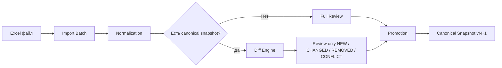
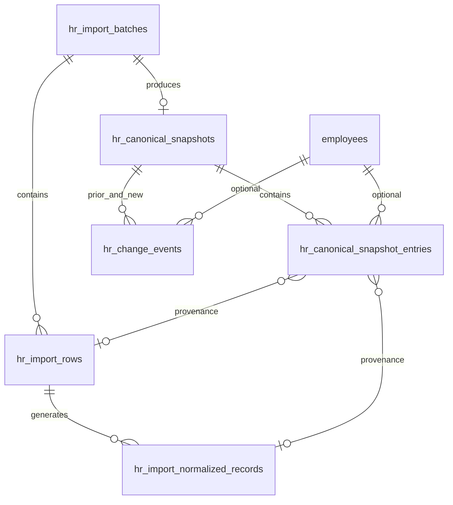

# ADR-040 — Canonical HR Snapshot & Monthly Diff

## Статус

**Accepted / Implemented** (2026-06-19)

| Phase | Scope | Status |
|-------|-------|--------|
| **A** | Canonical snapshot DDL + promotion service | ✅ |
| **B** | Monthly diff engine, batch diff columns, API | ✅ |
| **C** | Review UI — badges, summary, field diff, REMOVED | ✅ |
| **D** | Canonical snapshot export to Excel | ✅ |
| **E** | Review by exception — hide UNCHANGED по умолчанию | ✅ |
| **F** | Materialized HR change events (`hr_change_events`) | ✅ |
| **G** | HR change events UI | ✅ |

**Operator runbooks:**

- [Dual Personnel Registry](../runbooks/hr-dual-personnel-registry.md) — два кадровых контура (operational vs HR canonical)
- [Canonical Snapshot & Monthly Diff](../runbooks/hr-canonical-snapshot-monthly-diff.md) — monthly diff workflow *(если оформлен отдельно)*

## Дата

2026-06-19

## Связанные документы

- [ADR-041 — Dual Personnel Registry Model](./ADR-041-dual-personnel-registry-model.md) — **Canonical Snapshot ≠ Operational Employee registry**; optional `employee_id` binding
- [Runbook — Dual Personnel Registry](../runbooks/hr-dual-personnel-registry.md)
- [Operator runbook — Canonical Snapshot & Monthly Diff](../runbooks/hr-canonical-snapshot-monthly-diff.md)
- [ADR-038 — Employee Identity & HR Import Architecture](./ADR-038-employee-identity-hr-import-architecture.md) — staging, match engine, batch lifecycle
- [ADR-038-A1 — Import Integrity Hardening](./ADR-038-A1-import-integrity-hardening.md) — `employee_import_profile_overrides`, `missing_from_latest_import`
- [ADR-039 Phase 3B — Training Normalization Schema](./ADR-039-Phase-3B-schema.md) — `hr_import_normalized_records`, `source_record_key`
- [ADR-039 Phase 3F — Promotion](./ADR-039-Phase-3B-schema.md) — promote staging → `employee_documents`
- [ADR-039 Phase 3G/3H — Employee binding & roster promotion](./ADR-038-employee-identity-hr-import-architecture.md) — `employee_id` propagation
- [ADR-033 — Personnel Governance Model](./ADR-033-personnel-governance-model.md) — snapshot vs journal

---

## Context

ADR-039 рассматривает каждый импорт как **независимый пакет данных**: парсинг → review → promotion внутри одного `batch_id`.

На практике кадровый отдел **ежемесячно** выгружает файл из внешней системы. После импорта в Corpsite часть записей исправляется вручную:

- ИИН;
- специальности;
- документы об образовании;
- категории;
- ручные привязки сотрудников (`employee_id`);
- review override на `hr_import_normalized_records`.

Через месяц приходит новый файл, который может содержать:

- те же старые ошибки из первичной системы;
- уже исправленные в Corpsite данные;
- новые изменения.

**Результат сегодня:** пользователь повторно видит и утверждает одни и те же записи, которые уже были исправлены ранее.

**Частичное решение уже есть (ADR-038 Phase A/A.1):**

| Механизм | Scope | Ограничение |
|----------|-------|-------------|
| `employee_import_profile_overrides` | employee-level profile fields | не покрывает normalized records, roster rows без `employee_id`, REMOVED |
| `missing_from_latest_import` | флаг на карте сотрудника | нет diff по полям, нет batch-level review filter |
| `source_record_key` (ADR-039 3B) | dedup внутри `row_id` | не сравнивает импорты между собой |
| `review_override` (ADR-039 3F.3) | sparse corrections на staging record | теряется контекст «эталон vs новый файл» |

ADR-040 закрывает gap: **единый канонический снимок** после утверждения + **diff engine** для всех последующих импортов.

---

## Problem

1. Нет понятия «последнее утверждённое состояние кадровой выгрузки» как эталона системы.
2. Review UI показывает все строки batch, а не только реальные изменения относительно эталона.
3. Ручные исправления не участвуют в сравнении с новым Excel — сравнивается сырой parse, а не merged canonical view.
4. Нет классификации REMOVED (сотрудник был в каноне, но отсутствует в новом файле).
5. Нет обратной выгрузки исправленного Excel для кадровой службы.

---

## Decision

Ввести **Canonical HR Snapshot** — версионированный эталон кадровой выгрузки, материализованный после review + promotion batch.

Все последующие импорты проходят **Diff against Canonical Snapshot**; в review по умолчанию попадают только отличия.

> **Canonical Snapshot ≠ Employee registry (ADR-041).**  
> Канонический снимок описывает **HR Canonical Registry** (полный контрольный список из `HR_CONTROL_LIST`), а не раздел «Персонал → Сотрудники». Запись в snapshot может существовать без `employee_id` и без учётной записи Corpsite. Operational registry (`employees`) и HR canonical registry развиваются параллельно; monthly diff сравнивает incoming import с canonical snapshot, не с live `employees`.

---

## Target Model



**Первый импорт (bootstrap):**

```text
Excel → Import Batch → Review (full) → Promotion → Canonical Snapshot v1
```

**Последующие импорты:**

```text
Новый Excel → Normalization → Diff against Canonical Snapshot → Review (diff only) → Promotion → Canonical Snapshot vN+1
```

---

## Record Classification

Каждая **логическая запись** нового импорта получает `diff_status`:

| Status | Условие | Review по умолчанию |
|--------|---------|---------------------|
| `UNCHANGED` | `canonical_hash` совпадает с эталоном | Скрыта |
| `NEW` | Ключ сопоставления отсутствует в snapshot | Показана |
| `CHANGED` | Ключ найден, `canonical_hash` отличается | Показана |
| `REMOVED` | Запись есть в snapshot, отсутствует в новом batch | Показана |
| `CONFLICT` | Невозможно однозначно сопоставить (дубли ключа, ambiguous match) | Показана |

### Review UI rules

- По умолчанию фильтр: `diff_status IN ('NEW','CHANGED','REMOVED','CONFLICT')`.
- Переключатель: `[ ] Показывать неизменённые записи` → добавляет `UNCHANGED`.
- Счётчики summary: `{ unchanged, new, changed, removed, conflict }` per batch.

---

## Diff Engine

### Match key (приоритет)

Для **roster-level** записей (строка сотрудника в контрольном списке):

1. `employee_id` — если привязан в Corpsite (после 3G binding или roster promotion).
2. `IIN` — 12 цифр, нормализованный (`regexp_replace` non-digits).
3. `full_name + birth_date` — нормализованное ФИО (`lower`, `ё→е`, collapse spaces) + ISO date.

Для **normalized records** (`hr_import_normalized_records`):

1. `employee_id` + `record_kind` + `source_record_key` (после merge review_override).
2. Fallback: `row_match_key` родительской roster-строки + `record_kind` + `source_record_key`.

**CONFLICT** если:

- один match key → несколько строк в incoming batch;
- один incoming key → несколько snapshot entries с разным `canonical_hash`;
- IIN match, но `full_name` similarity ниже порога (reuse ADR-038 match policy).

### canonical_hash

Детерминированный SHA-256 от **канонического представления** записи **после merge overrides**:

```python
canonical = "|".join([
    entity_scope,           # emp:{id} | iin:{12} | name:{norm}|dob:{iso}
    record_kind,            # roster | training | certificate | category | education
    *sorted_normalized_fields,
])
canonical_hash = sha256(canonical).hexdigest()
```

**Roster fields в hash** (после department recoding + profile override):

`full_name`, `iin`, `birth_date`, `department` (canonical org unit name), `position_raw`, `org_unit_id`, `position_id`, `training_raw`, `certification_raw`, `education_raw`, `degree_raw`, `experience_raw`, `note_raw`.

**Normalized record fields в hash** (после `merge_review_override`):

`title`, `issue_date`, `expiry_date`, `hours`, `document_number`, `document_type_code`, `medical_specialty_id`, `provider`, `record_kind`.

Исключения из hash (volatile / provenance):

`metadata`, `parse_method`, `confidence`, `fragment_index`, `source_field`, batch/row ids, timestamps.

### Diff algorithm (per batch)

```text
1. Load active canonical snapshot (latest promoted version).
2. Build snapshot index: match_key → { canonical_hash, snapshot_entry_id, payload }.
3. For each incoming logical record (roster + normalized):
   a. compute match_key, merged payload, canonical_hash
   b. lookup snapshot index
   c. assign diff_status + field_diffs (for CHANGED)
4. For each snapshot entry not matched by incoming:
   assign REMOVED (scoped to roster employees present in prior snapshot)
5. Persist diff results on batch rows / normalized records
```

---

## Field Diff Display (CHANGED)

API и UI для `CHANGED` возвращают `field_diffs[]`:

```json
{
  "field": "position_raw",
  "label": "Должность",
  "old_value": "Медицинский техник",
  "new_value": "Инженер по медицинскому оборудованию"
}
```

Правила:

- `old_value` — из canonical snapshot (merged overrides included).
- `new_value` — из incoming после normalization + row-level overrides, **до** approve.
- Labels — reuse existing UI label maps (`normalizedRecordLabels.ts`, roster card labels).

---

## Canonical Excel Export

**Endpoint:** `GET /directory/personnel/canonical-snapshot/export.xlsx`

**Параметры:** `source_type=roster` (default, maps to `HR_CONTROL_LIST`), `snapshot_id` (optional), `include_metadata=true|false`.

**Источник данных:** active canonical snapshot (или указанный `snapshot_id`); roster entries `record_kind=roster`, effective merged payload.

**Формат:** flat XLSX «Канонический реестр» — ИИН, ФИО, дата рождения, должность, отделение, категория, образование, сертификат, часы обучения, статус, Employee ID, Match key; optional metadata columns.

**UI:** кнопка «Выгрузить эталонный Excel» на import summary, списке batch-ей, странице «Изменения реестра».

**Назначение:** передача кадровому отделу для внесения исправлений в первичную систему.

**Out of scope (Phase D):** побайтовое воспроизведение исходного внешнего Excel-шаблона; sheet «Отсутствуют в выгрузке» для REMOVED.

### IIN display policy (authenticated contour)

В authenticated personnel/admin API, UI, canonical snapshot payload/hash и export.xlsx ИИН передаётся **полностью** (12 цифр). Masking не используется: защита обеспечивается авторизацией и RBAC (`require_privileged_or_403`). Исключение — CLI preview в `import_hr_control_list.py` (неавторизованный debug output).

---

## Phase A — Canonical Snapshot Schema (DDL)

### New tables

#### `hr_canonical_snapshots`

| Column | Type | Notes |
|--------|------|-------|
| `snapshot_id` | BIGINT PK | |
| `source_batch_id` | BIGINT FK → hr_import_batches | batch that produced this snapshot |
| `version` | INT NOT NULL | monotonic per `source_type` |
| `source_type` | TEXT NOT NULL | default `HR_CONTROL_LIST` |
| `status` | TEXT NOT NULL | `active` \| `superseded` |
| `entry_count` | INT NOT NULL | denormalized |
| `promoted_by` | BIGINT FK → users | |
| `promoted_at` | TIMESTAMPTZ NOT NULL | |
| `superseded_by_snapshot_id` | BIGINT NULL FK self | |
| `superseded_at` | TIMESTAMPTZ NULL | |

Constraint: at most one `status='active'` per `source_type`.

#### `hr_canonical_snapshot_entries`

| Column | Type | Notes |
|--------|------|-------|
| `entry_id` | BIGINT PK | |
| `snapshot_id` | BIGINT FK | |
| `entity_scope` | TEXT NOT NULL | `emp:123` \| `iin:…` \| `name:…\|dob:…` |
| `record_kind` | TEXT NOT NULL | `roster` \| `training` \| … |
| `match_key` | TEXT NOT NULL | deterministic join key for diff |
| `canonical_hash` | TEXT NOT NULL | sha256 hex |
| `employee_id` | BIGINT NULL FK | |
| `payload` | JSONB NOT NULL | merged canonical view |
| `source_row_id` | BIGINT NULL FK | provenance |
| `source_normalized_record_id` | BIGINT NULL FK | provenance |

Indexes:

- `(snapshot_id, match_key)` UNIQUE
- `(snapshot_id, canonical_hash)`
- `(snapshot_id, employee_id)` WHERE employee_id IS NOT NULL

### Batch diff columns (Phase B migration)

On `hr_import_rows` and `hr_import_normalized_records` (identical set):

| Column | Type | Notes |
|--------|------|-------|
| `diff_status` | TEXT NULL | `UNCHANGED` \| `NEW` \| `CHANGED` \| `REMOVED` \| `CONFLICT` |
| `canonical_snapshot_id` | BIGINT NULL FK → `hr_canonical_snapshots` | active snapshot used for compare |
| `canonical_entry_id` | BIGINT NULL FK → `hr_canonical_snapshot_entries` | matched entry, if any |
| `canonical_hash` | TEXT NULL | incoming effective payload hash |
| `field_diffs` | JSONB NULL | per-field `{ field: { canonical, incoming } }` for CHANGED/CONFLICT |
| `diff_computed_at` | TIMESTAMPTZ NULL | last diff run timestamp |

CHECK constraints mirror classification enum on both tables.

**REMOVED** roster/normalized rows absent from the new batch are stored separately:

#### `hr_import_diff_removals`

| Column | Type | Notes |
|--------|------|-------|
| `removal_id` | BIGINT PK | |
| `batch_id` | BIGINT FK | incoming batch |
| `canonical_snapshot_id` | BIGINT FK | |
| `canonical_entry_id` | BIGINT FK | snapshot entry not matched |
| `match_key` | TEXT | |
| `record_kind` | TEXT | `roster` \| normalized kinds |
| `canonical_hash` | TEXT | |
| `payload` | JSONB | canonical merged view at compare time |
| `diff_status` | TEXT | always `REMOVED` |
| `diff_computed_at` | TIMESTAMPTZ | |

Unique: `(batch_id, canonical_entry_id)`.

### Snapshot promotion trigger

After batch reaches `APPLIED` (or explicit «Finalize canonical snapshot» action):

1. Build entries from approved roster rows + promoted/approved normalized records (merged overrides).
2. Mark prior active snapshot `superseded`.
3. Insert new snapshot `active`.

Idempotent: re-run on same batch with existing snapshot → no-op or explicit replace policy (default: no-op if snapshot already exists for `source_batch_id`).

---

## Implementation Phases

| Phase | Deliverable | Depends on |
|-------|-------------|------------|
| **A** | DDL: `hr_canonical_snapshots`, `hr_canonical_snapshot_entries`; snapshot promotion service (no diff) | ADR-039 3F/3G/3H |
| **B** | Diff engine service; batch diff columns; API `GET …/diff-summary`, `POST …/compute-diff` | Phase A |
| **C** | Review UI: diff badges, field diff panel, filters NEW/CHANGED/REMOVED/CONFLICT | Phase B ✅ |
| **D** | Canonical Excel export | Phase A ✅ |
| **E** | Default hide UNCHANGED; toggle «Показывать неизменённые»; review-by-exception UX | Phase C ✅ |
| **F** | Materialized change events between snapshot versions | Phase A ✅ |
| **G** | HR change events register UI | Phase F ✅ |

**Alembic revisions:**

| Phase | Revision |
|-------|----------|
| A | `q9r0s1t2u3v4_adr040_phase_a_canonical_snapshot_schema.py` ✅ |
| B | `r0s1t2u3v4w5_adr040_phase_b_monthly_diff_schema.py` ✅ |
| F | `s1t2u3v4w5x6_adr040_phase_f_hr_change_events_schema.py` ✅ |

**Phase A deliverables:**

| Artifact | Path |
|----------|------|
| Migration | `alembic/versions/q9r0s1t2u3v4_adr040_phase_a_canonical_snapshot_schema.py` |
| Service | `app/services/hr_canonical_snapshot_service.py` |
| Promotion hook (roster) | `hr_import_roster_promotion_service.promote_roster_batch` |
| Promotion hook (normalized) | `hr_import_promotion_service.promote_normalized_records` |
| Tests | `tests/test_hr_import_phase_040a_canonical_snapshot.py` |

**Phase B deliverables:**

| Artifact | Path |
|----------|------|
| Migration | `alembic/versions/r0s1t2u3v4w5_adr040_phase_b_monthly_diff_schema.py` |
| Diff service | `app/services/hr_import_monthly_diff_service.py` |
| Canonical helpers (exported) | `build_roster_*_payload`, `build_normalized_*_payload`, `compute_canonical_hash`, `_canonical_correction_fields` in `hr_canonical_snapshot_service.py` |
| Auto-run after import | `hr_import_service.import_control_list` → `maybe_compute_batch_monthly_diff()` after `populate_normalized_records()` |
| Review API (staging rows) | `hr_import_analytics_service.list_batch_rows` merges diff fields via `load_row_diff_fields` |
| Review API (normalized) | `hr_import_normalized_record_service._serialize_monthly_diff_fields` |
| Routes | `GET /personnel/import/batches/{batch_id}/diff-summary`, `POST /personnel/import/batches/{batch_id}/compute-diff` |
| Tests | `tests/test_hr_import_phase_040b_monthly_diff.py` |

**Phase B — classification rules (implemented):**

| Status | Rule |
|--------|------|
| `NEW` | no active snapshot, **or** incoming `match_key` absent in active snapshot |
| `UNCHANGED` | `match_key` found and recomputed canonical hash equals incoming hash |
| `CHANGED` | `match_key` found, hashes differ, changed fields do **not** intersect `_canonical_correction_fields` |
| `CONFLICT` | duplicate incoming `match_key` in batch; **or** changed fields intersect prior review/profile corrections in canonical payload |
| `REMOVED` | canonical snapshot entry not matched by any incoming row/record → persisted in `hr_import_diff_removals` |

**Phase B — `field_diffs` shape:**

```json
{
  "position_raw": {
    "canonical": "Медицинский техник",
    "incoming": "Инженер по медицинскому оборудованию"
  }
}
```

Persisted only for `CHANGED` and `CONFLICT`. Hash compare uses effective merged payload; volatile keys (incl. `_canonical_correction_fields`) excluded from hash but used for CONFLICT detection.

**Phase B — integration notes:**

- `maybe_compute_batch_monthly_diff` runs inside a nested savepoint — diff failure logs and returns `None` without failing the import.
- Import batch summary may include `monthly_diff` metadata when diff runs successfully.
- Without active canonical snapshot all incoming logical records receive `NEW`.
- Re-import of identical file against snapshot → `UNCHANGED` (verified in tests).

**Phase B — test coverage (`040a` + `040b` + business scenarios, 20 tests):**

- repeat import → `UNCHANGED`
- new employee → `NEW` + prior snapshot entry → `REMOVED`
- changed field → `CHANGED` + `field_diffs`
- Excel disagrees with corrected canonical field → `CONFLICT`
- no active snapshot → all `NEW`
- auto-diff on upload
- roster dry-run promotion unaffected
- **business scenario A** — repeat same-month import after snapshot → all `UNCHANGED`, review by exception empty (`test_hr_import_phase_040b_monthly_diff_business_scenarios.py`)
- **business scenario B** — next-month import → `UNCHANGED` / `NEW` / `CHANGED` / `REMOVED` in one batch
- **business scenario C** — manual review correction preserved → `CONFLICT` on stale re-import, canonical not overwritten

**Phase C deliverables:**

| Artifact | Path |
|----------|------|
| Diff labels / badge helpers | `corpsite-ui/app/directory/personnel/_lib/monthlyDiffLabels.ts` |
| Diff status badge | `corpsite-ui/.../ImportDiffStatusBadge.tsx` |
| Summary + recompute panel | `corpsite-ui/.../ImportMonthlyDiffSummaryPanel.tsx` |
| Field diff panel | `corpsite-ui/.../ImportFieldDiffPanel.tsx` |
| REMOVED section | `corpsite-ui/.../ImportMonthlyDiffRemovedSection.tsx` |
| API client | `importApi.client.ts` — `getImportBatchDiffSummary`, `computeImportBatchDiff` |
| Roster review list + detail | `PersonnelImportReviewPageClient.tsx`, `PersonnelImportRowReviewPageClient.tsx` |
| Normalized review list + drawer | `PersonnelImportNormalizedRecordsReviewPageClient.tsx`, `ImportNormalizedRecordDrawer.tsx` |
| Row review API diff fields | `hr_import_row_review_service.get_row_review_detail` |

**Phase C — intentionally deferred (implemented in Phase D):**

- canonical Excel export → `hr_canonical_snapshot_export_service.py`

**Phase D deliverables (Canonical Excel export):**

| Artifact | Path |
|----------|------|
| Export service | `app/services/hr_canonical_snapshot_export_service.py` |
| Route | `GET /directory/personnel/canonical-snapshot/export.xlsx` |
| UI button | `corpsite-ui/.../CanonicalSnapshotExportButton.tsx` |
| API client | `importApi.client.ts` — `buildCanonicalSnapshotExportUrl`, `downloadCanonicalSnapshotExport` |
| Tests | `tests/test_hr_import_phase_040d_canonical_snapshot_export.py` |

**Phase E deliverables (Review by Exception):**

| Artifact | Path |
|----------|------|
| Hide-unchanged filter (roster) | `hr_import_analytics_service.list_batch_rows(hide_unchanged=True)` |
| Hide-unchanged filter (normalized) | `hr_import_normalized_record_service.list_review_normalized_records(hide_unchanged=True)` — SQL filter, no full-table fetch to client |
| Review visibility summary | `hr_import_monthly_diff_service.build_review_visibility()` → `review_visibility` on `diff-summary` |
| API query param | `?hide_unchanged=true` on `GET …/batches/{id}/rows` and `GET …/normalized-records` |
| Toggle + visibility counts | `ImportMonthlyDiffSummaryPanel.tsx` — «Показывать неизменённые» (OFF по умолчанию), Visible records / Hidden unchanged |
| No-changes banner | `ImportReviewByExceptionBanner.tsx` — «Review complete / No changes detected» |
| Roster review default filter | `PersonnelImportReviewPageClient.tsx` |
| Normalized review default filter | `PersonnelImportNormalizedRecordsReviewPageClient.tsx` |
| Tests | `tests/test_hr_import_phase_040e_review_by_exception.py` |

**Phase E — default filtering:**

- Review lists pass `hide_unchanged=true` unless user enables «Показывать неизменённые».
- Visible by default: `NEW`, `CHANGED`, `REMOVED` (via removals section), `CONFLICT`.
- Hidden by default: `UNCHANGED`.
- `review_visibility.no_changes_detected=true` when `hidden_unchanged > 0` and `visible_records == 0` (e.g. repeat import 1847 UNCHANGED → empty review, no user action).

**Phase F deliverables (Materialized HR change events):**

| Artifact | Path |
|----------|------|
| Migration | `alembic/versions/s1t2u3v4w5x6_adr040_phase_f_hr_change_events_schema.py` |
| Comparison service | `app/services/hr_snapshot_comparison_service.py` |
| Auto-materialize hook | `hr_canonical_snapshot_service.build_canonical_snapshot_from_batch` → `maybe_materialize_change_events_after_snapshot` |
| Route | `GET /directory/personnel/hr-change-events` |
| Tests | `tests/test_hr_import_phase_040f_hr_change_events.py` |

**Phase F — event types:** `NEW`, `REMOVED`, `POSITION_CHANGED`, `DEPARTMENT_CHANGED`, `EDUCATION_CHANGED`, `CERTIFICATE_CHANGED`.

**Phase G deliverables (HR change events UI):**

| Artifact | Path |
|----------|------|
| Page | `/directory/personnel/hr-change-events` |
| List client | `PersonnelHrChangeEventsPageClient.tsx` |
| Table + drawer | `HrChangeEventsTable.tsx`, `HrChangeEventDrawer.tsx` |
| Labels | `hrChangeEventLabels.ts` |
| API client | `hrChangeEventsApi.client.ts` |
| Nav | `PersonnelSubNav.tsx` — «Изменения реестра» |
| Deep links | `EmployeeImportCard2PageClient`, `ImportMonthlyDiffSummaryPanel` |
| Tests | `hrChangeEventLabels.test.ts`, `hrChangeEventsApi.client.test.ts`, `HrChangeEventsTable.test.tsx`, `CanonicalSnapshotExportButton.test.tsx` |

---

## API Surface

| Method | Path | Phase |
|--------|------|-------|
| GET | `/directory/personnel/import/batches/{id}/diff-summary` | B ✅ |
| POST | `/directory/personnel/import/batches/{id}/compute-diff` | B ✅ |
| GET | `/directory/personnel/canonical-snapshot/export.xlsx` | D ✅ |
| GET | `/directory/personnel/hr-change-events` | F ✅ |

Review list endpoints support `hide_unchanged=true` (default in UI) to exclude `UNCHANGED` server-side before pagination.

---

## Relationship to Existing Tables



**Не дублировать:**

- `employee_import_profile_overrides` — остаётся live override layer; snapshot **материализует** effective state на момент promotion.
- `employee_documents` — post-promotion registry; snapshot entries for `record_kind != roster` mirror promoted normalized view, not live documents table.

---

## Success Criteria

После утверждения июньского импорта и повторного получения июньского файла (с теми же данными + исправлениями в первичной системе):

1. Неизменённые записи получают `UNCHANGED` и **не попадают** в review по умолчанию.
2. Отображаются только реальные `NEW` / `CHANGED` / `REMOVED` / `CONFLICT`.
3. Ручные исправления (override, binding, promotion) **сохранены** в canonical snapshot и участвуют в hash.
4. Доступна выгрузка «Канонический Excel» для кадровой службы.
5. Если кадровики внесли все исправления в первичную систему → повторный импорт → 100% `UNCHANGED` → promotion snapshot optional (no-op).

---

## Risks & Mitigations

| Risk | Mitigation |
|------|------------|
| Bootstrap: нет v0 snapshot | Первый batch = full review; promotion создаёт v1 |
| Hash drift при изменении canonical field set | Version field in hash prefix `v1\|…`; migration recomputes snapshot |
| REMOVED false positives (временно absent in Excel) | HR confirms REMOVED in review; optional «soft removed» Phase E+ |
| Performance on ~1000+ rows | Index on `match_key`; compute-diff async job for large batches |
| Conflict with ADR-038 sync export | Canonical export = HR-facing Excel; sync package = instance replication (orthogonal) |

---

## Out of Scope

- Автоматический apply CHANGED без human review (ADR-033 governance).
- Трёхсторонний merge (canonical vs incoming vs live `employees` snapshot) — только canonical vs incoming import.
- Real-time sync с внешней HR системой.
