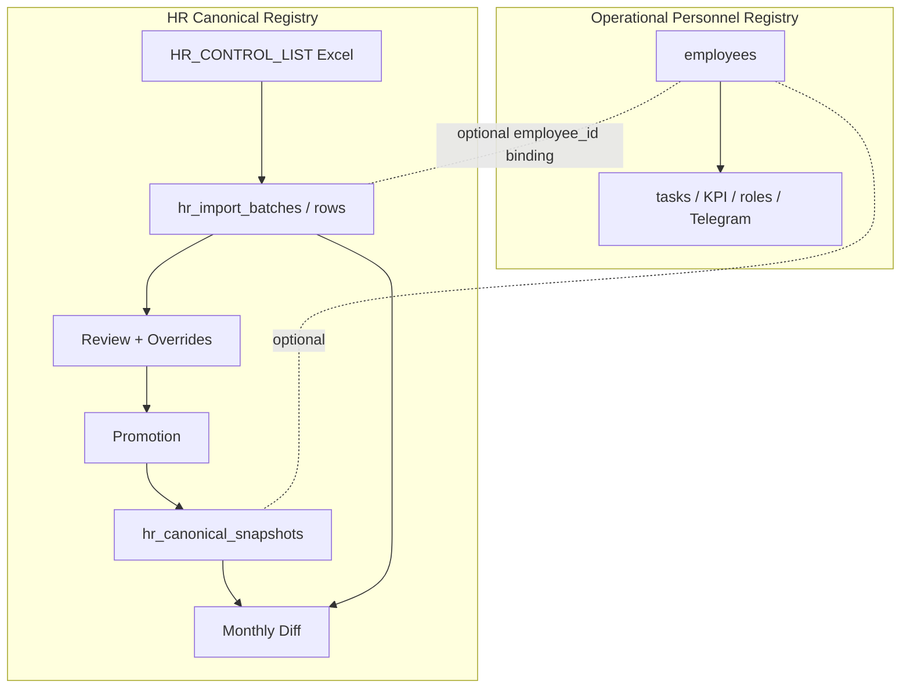

# ADR-041 — Dual Personnel Registry Model

## Статус

**Accepted** (2026-06-19)

## Дата

2026-06-19

## Связанные документы

- [ADR-033 — Personnel Governance Model](./ADR-033-personnel-governance-model.md) — operational employees, events, governance
- [ADR-038 — Employee Identity & HR Import Architecture](./ADR-038-employee-identity-hr-import-architecture.md) — staging, match engine, optional binding
- [ADR-039 Phase 3B — Training Normalization Schema](./ADR-039-Phase-3B-schema.md) — `hr_import_normalized_records`, optional `employee_id`
- [ADR-040 — Canonical HR Snapshot & Monthly Diff](./ADR-040-canonical-hr-snapshot-monthly-diff.md) — эталон кадровой выгрузки, monthly diff
- [Runbook — Dual Personnel Registry](../runbooks/hr-dual-personnel-registry.md) — операторское пояснение для HR и админов
- [ADR-048 — Person Ownership and Identity Creation Policy](./ADR-048-person-ownership-identity-creation-policy.md) — ownership Person и правила CREATE/LINK (append-only note §Cross-reference)

---

## Context

После внедрения ADR-038 (HR import staging), ADR-039 (normalized records, promotion) и ADR-040 (canonical snapshot, monthly diff) в Corpsite фактически существуют **два параллельных кадровых контура**, которые решают разные задачи:

| Контур | Раздел UI | Типичный объём | Назначение |
|--------|-----------|----------------|------------|
| **Operational Personnel Registry** | Персонал → Сотрудники | ~33 сотрудника (пилот) | Задачи, мониторинг, Telegram, рабочие процессы, роли, KPI, учётные записи |
| **HR Canonical Registry** | Импорт HR → Review → Promotion → Canonical Snapshot | 3000+ строк контрольного списка | Кадровая аналитика, образование, сертификаты, возрастная структура, изменения реестра, экспорт Excel |

Оба контура используют общие справочники (подразделения, должности), но **не являются одним реестром**:

- Operational registry — это `employees` и связанные operational-таблицы; сотрудники добавляются **постепенно и осознанно**.
- HR Canonical Registry — это `hr_import_*`, `hr_canonical_snapshots`, `hr_canonical_snapshot_entries`; строится из `HR_CONTROL_LIST` через Import → Review → Promotion.

Путаница возникает, когда оператор ожидает, что каждая строка HR import автоматически станет сотрудником в «Сотрудниках», или что canonical snapshot заменяет operational registry.

---

## Problem

1. HR import может содержать полный состав организации, но operational registry намеренно содержит только участников рабочих процессов Corpsite.
2. Отсутствие `employee_id` на строке import review воспринимается как ошибка, хотя для HR analytics это нормально.
3. Кнопка «Восстановить привязки» используется как универсальный fix, хотя предназначена для batch-scoped repair.
4. Аналитика смешивает метрики по `employees` и по canonical/import registry без явного разделения контуров.

---

## Decision

### D1. Два контура развиваются параллельно

**Operational Personnel Registry** и **HR Canonical Registry** — отдельные архитектурные домены. Ни один не заменяет другой.

### D2. HR import / promotion НЕ создаёт Employee автоматически

- Импорт контрольного списка **не** создаёт записи в `employees`.
- Roster promotion (ADR-038 Phase 3H) может создать `employees` только при **явном** HR-решении в review (HIRE path), не как побочный эффект upload.
- Canonical snapshot promotion **материализует** кадровый эталон; это не enrollment в operational registry.

### D3. Связь между контурами — optional

| Связь | Механизм | Обязательность |
|-------|----------|----------------|
| Import row → Employee | `hr_import_rows.employee_id`, Phase 3G binding (IIN / ФИО) | **Optional** |
| Normalized record → Employee | `hr_import_normalized_records.employee_id` | **Optional** (required только для promotion в `employee_documents`) |
| Canonical entry → Employee | `hr_canonical_snapshot_entries.employee_id` | **Optional** |
| HR change event → Employee | `hr_change_events.employee_id` | **Optional** |

Отсутствие привязки **не является ошибкой** для HR analytics, canonical snapshot, monthly diff, change events или canonical Excel export.

Match key для monthly diff (ADR-040): `employee_id` → `IIN` → `full_name + birth_date`. Привязка к Employee повышает точность, но не обязательна.

### D4. Batch-scoped repair привязок

Кнопка / endpoint «Восстановить привязки в этом импорте» (`repair_batch_employee_bindings`) — **только** для восстановления `employee_id` на строках **текущего batch**, где сотрудник уже существует в operational registry (по ИИН или ФИО).

Не использовать для:

- массового создания сотрудников из import;
- «исправления» отсутствия привязки у записей, которым не нужен operational Employee;
- глобальной синхронизации двух реестров.

### D5. Аналитика в двух направлениях

| Направление | Источник данных | Примеры |
|-------------|-----------------|---------|
| **Operational analytics** | `employees`, tasks, KPI, roles, Telegram bindings | Загрузка по отделам (operational), активные пользователи, задачи на сотрудника |
| **HR analytics** | `hr_canonical_snapshot_entries`, `hr_import_*`, `hr_change_events` | Возрастная структура, образование, сертификаты, изменения должности/отдела по полному реестру, canonical export |

Отчёты должны явно указывать контур. Нельзя выводить «всего сотрудников организации» из `COUNT(employees)` при наличии полного HR canonical registry.

### D6. Monthly diff и ручные исправления

Canonical snapshot (ADR-040) — эталон **HR Canonical Registry**, не operational `employees`.

- Ручные исправления в import review участвуют в canonical hash.
- Повторный импорт с устаревшими данными из внешней системы → `CONFLICT` / `CHANGED`, не silent overwrite.
- Operational Employee card не обновляется автоматически из HR import diff.

---

## Target Model

---

## Consequences

### Positive

- Ясное разделение «кто работает в Corpsite» vs «полный кадровый состав организации».
- HR может вести полный реестр без принудительного создания учётных записей.
- Monthly diff и review by exception работают на canonical scope без блокеров по binding.
- Operational registry остаётся компактным и управляемым.

### Negative / trade-offs

- Два источника «правды» по численности персонала — требуется дисциплина в отчётах и UI-подписях.
- Привязка Employee ↔ HR row остаётся ручной/полуавтоматической (IIN, ФИО).
- Promotion normalized records в `employee_documents` по-прежнему требует `employee_id` — это intentional gate для operational documents.

### Risks

| Risk | Mitigation |
|------|------------|
| Операторы ожидают auto-create Employee | Runbook + UI labels «Не привязана» как норма; ADR-041 в onboarding |
| Дублирование данных employee vs canonical | Optional binding; canonical — HR-facing; employee — operational |
| Отчёты смешивают контуры | Явная маркировка источника в каждом отчёте (D5) |

---

## Out of Scope (this ADR)

- Изменение модели `employees`
- Автоматическое создание сотрудников из HR import
- Новые дашборды
- Изменение прав доступа
- Миграции схемы (документирование не требует DDL)

---

## Success Criteria

1. Документ ADR-041 и runbook доступны команде и HR.
2. ADR-040 и ADR-038/039 ссылаются на dual registry model.
3. Regression tests monthly diff покрывают repeat-import и cross-month сценарии без реальных PII.
4. В UI/review «Не привязана» трактуется как допустимое состояние для HR analytics.

---

## Cross-reference (append-only, ADR-048)

Политика **ownership Person**, **Create-or-Link** при explicit enrollment и границы dual registry vs operational identity bridge определены в [ADR-048 — Person Ownership and Identity Creation Policy](./ADR-048-person-ownership-identity-creation-policy.md). ADR-041 (optional binding, explicit HR decisions) **не изменяется**; ADR-048 уточняет materialization `persons` на operational path.
