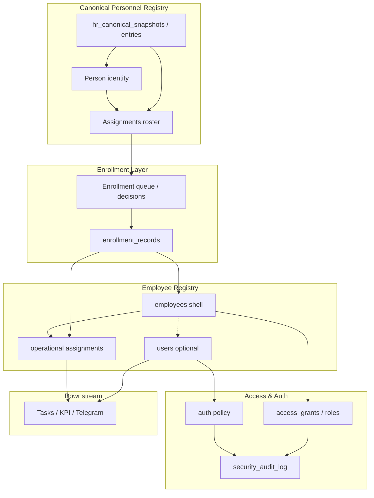
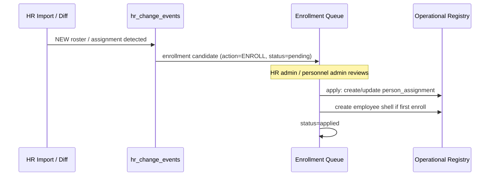
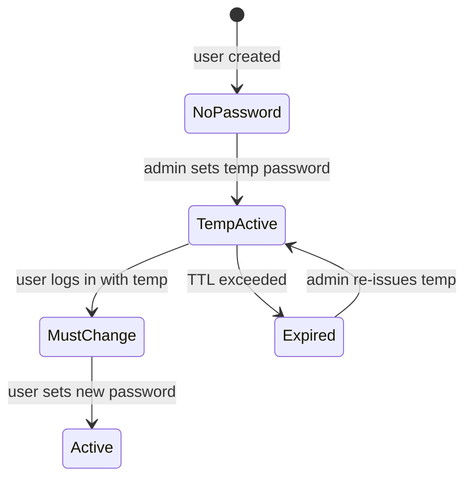

# ADR-042 Phase A — Personnel Access & Enrollment Architecture

## Статус

**Proposed** (design only; миграции, API, UI и код **не входят** в scope Phase A)

## Дата

2026-06-20

## Связанные документы

| ADR | Связь |
|-----|-------|
| [ADR-033 — Personnel Governance Model](./ADR-033-personnel-governance-model.md) | кадровые события, разделение HR / sysadmin |
| [ADR-038 — Employee Identity & HR Import](./ADR-038-employee-identity-hr-import-architecture.md) | `employee_identities`, staging, match engine |
| [ADR-040 — Canonical HR Snapshot & Monthly Diff](./ADR-040-canonical-hr-snapshot-monthly-diff.md) | эталон, diff, `hr_change_events` |
| [ADR-041 — Dual Personnel Registry Model](./ADR-041-dual-personnel-registry-model.md) | два контура; enrollment как осознанный мост |
| [ADR-023 — RBAC v2 Lean Scope](./ADR-023-rbac-v2-lean-scope-and-approvals.md) | task visibility; **не** заменяет Access Registry |
| [ADR-032 — Employee Transfer Architecture](./ADR-032-employee-transfer-architecture.md) | `employee_events`, snapshot vs history |
| [ADR-013 — JWT Migration](./ADR-013-jwt-migration.md) | текущая auth-модель |

---

## Context

После завершения ADR-039 (promotion pipeline), ADR-040 (canonical snapshot, monthly diff, change events) и ADR-041 (dual registry) в Corpsite зафиксированы **два параллельных кадровых контура**:

```text
HR Canonical Registry          Operational Personnel Registry
(hr_import_*, snapshots)   ≠   (employees, tasks, KPI, Telegram)
         optional employee_id binding
```

**Следующий шаг** — формализовать осознанный мост между контурами (**Enrollment**) и независимую модель **доступа** и **аутентификации**, не смешивая их с кадровыми операциями и task-RBAC.

### Текущее состояние (as-is)

| Область | Реализация сегодня | Ограничение |
|---------|-------------------|-------------|
| Operational employee | `employees`: одна строка = один snapshot (одно `org_unit_id`, одна `position_id`, одна `employment_rate`) | Нет модели совместительства / двойных ролей |
| Identity | `employee_identities` (IIN → `employee_id`) | Привязка только к operational employee |
| Canonical roster | `hr_canonical_snapshot_entries` (`record_kind = roster`, payload JSONB) | Не материализует assignments; строки ≈ roster row, не Person |
| HR ↔ Employee link | optional `employee_id` на import/canonical rows | Нет enrollment workflow |
| Users | `users` (login, `password_hash`, `role_id`, `unit_id`, `employee_id`) | `role_id` = task-роль (QM_HEAD и т.д.), не access level |
| Auth | JWT login, pbkdf2 hash | Нет temp password, lockout, must-change, audit |
| Audit | `employee_events`, `task_audit_log` | Нет security/auth audit |

### Целевой поток (to-be)



### Ключевой принцип Phase A

> **Управляем назначениями (assignments), а не сотрудниками.**

Person — носитель идентичности (ИИН, ФИО, дата рождения).  
Assignment — конкретное кадровое назначение (отделение + должность + тип занятости + ставка + период).  
Employee (operational) — enrollment-оболочка для участия в рабочих процессах Corpsite.

---

# Задача 1. Assignment Model

## 1.1. Концептуальная модель

```text
Person (1) ──< Assignment (N)
```

Один Person может иметь **несколько одновременно активных** assignments:

| Пример | Assignment A | Assignment B |
|--------|-------------|-------------|
| Заведующий + врач | Заведующий отделением, ставка 0.5 | Врач-терапевт, ставка 0.5 |
| Старшая + процедурная | Старшая медсестра, основное | Медсестра процедурного кабинета, совместительство |
| Стационар + диспансер | Стационар, отделение X | Амбулатория, отделение Y |
| Основная + совместительство | Основная ставка 1.0 | Совместительство 0.25 |

## 1.2. Сущности

### Person (`persons`)

Каноническая идентичность физического лица. Не равна `employees` и не равна `users`.

| Поле | Тип | Описание |
|------|-----|----------|
| `person_id` | BIGINT PK | Surrogate key |
| `primary_iin` | TEXT NULL | Нормализованный ИИН (12 цифр); UNIQUE WHERE NOT NULL |
| `full_name` | TEXT NOT NULL | Каноническое ФИО |
| `birth_date` | DATE NULL | Дата рождения |
| `match_key` | TEXT NOT NULL | Стабильный ключ: `iin:{12}` \| `name:{norm}\|dob:{iso}` (reuse ADR-040) |
| `status` | TEXT NOT NULL | `active` \| `inactive` \| `merged` |
| `merged_into_person_id` | BIGINT NULL | При дедупликации |
| `created_at` | TIMESTAMPTZ | |
| `updated_at` | TIMESTAMPTZ | |

**Источник истины для Person:** HR Canonical Registry (promoted snapshot roster entries). Operational Person создаётся/обновляется при enrollment, но identity anchor остаётся в canonical контуре.

### Assignment (`person_assignments`)

| Поле | Тип | Описание |
|------|-----|----------|
| `assignment_id` | BIGINT PK | |
| `person_id` | BIGINT FK → persons | |
| `department_id` | BIGINT FK → departments NULL | Legacy dept dimension (если используется) |
| `org_unit_id` | BIGINT FK → org_units NULL | **Primary org dimension** (ADR-032/014) |
| `position_id` | BIGINT FK → positions NOT NULL | |
| `employment_type` | TEXT NOT NULL | `primary` \| `part_time` \| `internal_combo` \| `external` |
| `rate` | NUMERIC(4,2) NOT NULL | 0.25 / 0.5 / 0.75 / 1.0; CHECK rate > 0 AND rate <= 1 |
| `start_date` | DATE NOT NULL | |
| `end_date` | DATE NULL | NULL = бессрочно / открытый период |
| `active_flag` | BOOLEAN NOT NULL DEFAULT TRUE | Derived + persisted; см. §1.4 |
| `source` | TEXT NOT NULL | `canonical` \| `manual` \| `enrollment` \| `correction` |
| `canonical_entry_id` | BIGINT NULL FK → hr_canonical_snapshot_entries | Provenance |
| `assignment_key` | TEXT NOT NULL | Dedup key внутри person |
| `created_at` | TIMESTAMPTZ | |
| `updated_at` | TIMESTAMPTZ | |

**`assignment_key`** (dedup внутри person):

```text
{org_unit_id}|{position_id}|{employment_type}|{start_date}
```

### Operational bridge (`employees` — эволюция, не replacement)

`employees` становится **operational shell** для enrolled person:

| Поле | Изменение |
|------|-----------|
| `person_id` | NEW FK → persons (UNIQUE WHERE enrolled) |
| `org_unit_id`, `position_id`, `employment_rate` | **Deprecated as primary truth** → переносятся в assignments; остаются как **primary assignment snapshot** для backward compatibility |
| `is_active` | TRUE если есть ≥1 active assignment И enrollment active |

> Phase B реализует dual-write; Phase C — read path на assignments.

## 1.3. ER-схема

```mermaid
erDiagram
    persons ||--o{ person_assignments : has
    persons ||--o| employees : "enrolled as"
    persons ||--o{ person_identities : "optional mirror"

    org_units ||--o{ person_assignments : "org_unit"
    positions ||--o{ person_assignments : position
    departments ||--o{ person_assignments : "legacy dept"

    hr_canonical_snapshot_entries ||--o| person_assignments : "canonical_entry_id"
    hr_canonical_snapshot_entries }o--|| hr_canonical_snapshots : belongs

    employees ||--o| users : "linked user"
    employees ||--o{ employee_events : history

    persons {
        bigint person_id PK
        text primary_iin UK
        text full_name
        date birth_date
        text match_key UK
        text status
    }

    person_assignments {
        bigint assignment_id PK
        bigint person_id FK
        bigint org_unit_id FK
        bigint position_id FK
        text employment_type
        numeric rate
        date start_date
        date end_date
        boolean active_flag
        text assignment_key
    }

    employees {
        bigint employee_id PK
        bigint person_id FK
        text full_name
        boolean is_active
    }

    hr_canonical_snapshot_entries {
        bigint entry_id PK
        text record_kind
        text match_key
        bigint employee_id FK
        jsonb payload
    }
```



## 1.4. Правила `active_flag`

```text
active_flag = (start_date <= today)
          AND (end_date IS NULL OR end_date >= today)
          AND (status != 'voided')
          AND (person.status = 'active')
```

При закрытии assignment (`end_date` в прошлом) — `active_flag = FALSE`, запись **не удаляется** (append-friendly history).

## 1.5. Связь с canonical snapshot

Roster entry в `hr_canonical_snapshot_entries` (`record_kind = roster`) маппится на:

1. **Person** — по match_key (IIN → name+dob fallback, reuse ADR-040).
2. **Assignment** — по полям payload: `org_unit_id`, `position_id`, `employment_rate`, sheet_type (`part_time` → `employment_type = part_time`).

Один Person ↔ N roster entries в snapshot (основной лист + лист совместителей).

## 1.6. Миграция as-is → to-be (концепт Phase B)

| Шаг | Действие |
|-----|----------|
| 1 | Backfill `persons` из canonical snapshot + `employee_identities` |
| 2 | Для каждого `employees` создать 1 assignment (primary, rate из `employment_rate`) |
| 3 | Добавить `employees.person_id` |
| 4 | Dual-write: кадровые операции пишут assignment + обновляют primary snapshot на `employees` |

---

# Задача 2. Enrollment Architecture

## 2.1. Что является enrollment unit?

### Анализ вариантов

| Вариант | Описание | Плюсы | Минусы |
|---------|----------|-------|--------|
| **Person** | Enrollment целиком по человеку | Простой UX «включить в Corpsite» | Нельзя enroll только одно совместительство; смешивает access и кадровые роли |
| **Assignment** | Enrollment по каждому назначению | Точное соответствие HR roster; частичный доступ; совместительство изолировано | Больше записей в queue; нужен Person shell |
| **Person + Assignment** | Композитная заявка | Гибкость | Избыточная сложность; дублирование решений |

### Рекомендация: **Assignment — enrollment unit; Person — identity anchor**

```text
Enrollment decision scope = Assignment
Enrollment identity anchor  = Person
Operational shell           = Employee (1:1 с Person после первого enroll)
```

**Обоснование:**

1. HR control list (ADR-038/040) уже содержит **несколько roster rows на одного человека** (основной + part_time sheets).
2. Принцип «управляем назначениями» требует granular decisions: enroll врача, но не enroll совместительство в процедурный кабинет.
3. Person нужен для stable link canonical ↔ operational независимо от числа assignments.
4. Employee создаётся **один раз** при первом enrolled assignment; последующие assignments добавляются к существующему employee.

### Enrollment record

```text
enrollment_records (
  enrollment_id       BIGINT PK,
  person_id             BIGINT FK → persons,
  assignment_id         BIGINT FK → person_assignments NULL,  -- после materialize
  canonical_entry_id    BIGINT FK → hr_canonical_snapshot_entries,
  employee_id           BIGINT FK → employees NULL,
  action                TEXT,  -- ENROLL | EXTEND | TERMINATE | SKIP | RE_ENROLL
  status                TEXT,  -- pending | approved | applied | rejected | superseded
  requested_by          BIGINT FK → users,
  decided_by            BIGINT FK → users NULL,
  decided_at            TIMESTAMPTZ NULL,
  apply_notes           TEXT NULL,
  source_snapshot_id    BIGINT FK → hr_canonical_snapshots,
  source_change_event_id BIGINT NULL FK → hr_change_events,
  created_at            TIMESTAMPTZ
)
```

## 2.2. Обработка сценариев

### Новые назначения



- Триггер: `hr_change_events.event_type = NEW` + `record_kind = roster` **или** ручная заявка.
- Default: **не auto-apply** (согласовано с ADR-041 D2).

### Увольнение

| Canonical signal | Enrollment action | Operational effect |
|----------------|-------------------|-------------------|
| REMOVED (все assignments person) | TERMINATE person | Закрыть все assignments (`end_date`), `employees.is_active = false`, optional deactivate user |
| REMOVED (один assignment) | TERMINATE assignment | Закрыть один assignment; employee active если остаются другие |
| TERMINATION event (manual HR) | TERMINATE | То же через `employee_events.TERMINATION` |

User account: **не удалять**; `users.is_active = false` — отдельное решение enrollment (может остаться для audit).

### Перевод

Canonical: `DEPARTMENT_CHANGED` / `POSITION_CHANGED` на roster entry.

| Подход | Рекомендация |
|--------|--------------|
| Close old + open new assignment | **Preferred** — сохраняет history, согласовано с ADR-032 append-only |
| Update in place | Только для `CORRECTION` (ошибка данных), не для transfer |

Enrollment action: `EXTEND` с `action_detail = TRANSFER` → close prior assignment (`end_date = effective_date - 1`), create new assignment.

### Совместительство

- Каждый part-time roster row = отдельный assignment в canonical.
- Enrollment может быть **частичным**: primary enrolled, part_time pending.
- Operational tasks могут bind к **primary assignment** by default; part_time — opt-in (Phase C).

### Повторный импорт

| Ситуация | Поведение |
|----------|-----------|
| UNCHANGED vs canonical | No enrollment action |
| CHANGED field on enrolled assignment | Enrollment candidate `EXTEND` / review queue |
| CONFLICT | Block auto-apply; manual resolution |
| Re-import after TERMINATE | Candidate `RE_ENROLL`; новый enrollment_record, не reuse старых IDs |
| Duplicate enrollment attempt | Idempotency by `(canonical_entry_id, action, source_snapshot_id)` UNIQUE |

## 2.3. Связь canonical_person ↔ employee_registry_person

### Таблица связей

```text
person_enrollment_links (
  link_id               BIGINT PK,
  person_id             BIGINT FK → persons NOT NULL,
  employee_id           BIGINT FK → employees NOT NULL,
  enrolled_at           TIMESTAMPTZ NOT NULL,
  enrolled_by           BIGINT FK → users,
  first_enrollment_id   BIGINT FK → enrollment_records,
  status                TEXT,  -- active | terminated | suspended
  terminated_at         TIMESTAMPTZ NULL,
  UNIQUE (person_id),
  UNIQUE (employee_id)
)
```

### Match path (приоритет, reuse ADR-040)

1. `person_enrollment_links.person_id` ↔ `employees.person_id`
2. `employee_identities.identity_value` (IIN) ↔ `persons.primary_iin`
3. `hr_canonical_snapshot_entries.employee_id` (legacy optional binding)
4. `match_key` (IIN / name+dob)

### Инварианты

- Один Person → максимум один active Employee (operational shell).
- Один Employee → ровно один Person после enrollment.
- Assignments без enrollment остаются только в canonical контуре.
- Отсутствие link **не ошибка** для HR analytics (ADR-041 D3).

---

# Задача 3. Access Registry

## 3.1. Требования

Независимая от task-roles (`roles.code = QM_HEAD`) модель **системного доступа**.

### Уровни доступа

| Level | Code | Смысл |
|-------|------|-------|
| 0 | `NONE` | Нет доступа к модулю / разделу |
| 1 | `OBSERVER` | Read-only |
| 2 | `MANAGER` | Read + операционные действия в scope |
| 3 | `ADMIN` | Full control в scope + admin actions |

### Subjects (кому назначается)

| Subject type | Пример |
|--------------|--------|
| `user` | Конкретный пользователь |
| `position` | Все на данной должности |
| `org_unit` | Все в подразделении (+ optional subtree) |
| `person` | Будущее: до создания user account |

### Objects (к чему назначается)

| Object type | Пример |
|-------------|--------|
| `module` | `personnel`, `hr_import`, `tasks`, `admin_cabinet` |
| `resource` | `employees.list`, `enrollment.queue`, `audit.log` |

Effective access = **max** level по всем matching grants (deny-wins optional для Phase C).

## 3.2. Вариант A — Access Grants Table

```text
access_grants (
  grant_id          BIGINT PK,
  subject_type      TEXT,   -- user | position | org_unit | person
  subject_id        BIGINT,
  object_type       TEXT,   -- module | resource
  object_key        TEXT,
  access_level      TEXT,   -- NONE | OBSERVER | MANAGER | ADMIN
  scope_org_unit_id BIGINT NULL,  -- optional dept scope
  include_subtree   BOOLEAN DEFAULT FALSE,
  valid_from        DATE NULL,
  valid_to          DATE NULL,
  granted_by        BIGINT FK → users,
  created_at        TIMESTAMPTZ
)
```

| Плюсы | Минусы |
|-------|--------|
| Максимальная гибкость | Много строк; сложнее UI |
| Прямое mapping business rules | Evaluation query может быть тяжёлым |
| Легко audit per-grant | Риск grant sprawl без governance |
| Position/org_unit grants без user | Нужен resolver при смене должности |

**Подходит если:** нужна fine-grained политика, разные уровни по модулям, delegated admin.

## 3.2. Вариант B — Role Assignment Table

```text
access_roles (
  access_role_id    BIGINT PK,
  code              TEXT UNIQUE,  -- PERSONNEL_OBSERVER, HR_MANAGER, SYS_ADMIN
  name              TEXT,
  default_level     TEXT
)

access_role_permissions (
  access_role_id    BIGINT FK,
  object_key        TEXT,
  access_level      TEXT,
  PRIMARY KEY (access_role_id, object_key)
)

access_role_assignments (
  assignment_id     BIGINT PK,
  access_role_id    BIGINT FK,
  subject_type      TEXT,
  subject_id        BIGINT,
  scope_org_unit_id BIGINT NULL,
  valid_from/to     ...
)
```

| Плюсы | Минусы |
|-------|--------|
| Компактное управление | Менее гибко для edge cases |
| Понятные роли для sysadmin UI | Новая роль = migration/config |
| Быстрый evaluation (role → permissions) | Position-based access требует indirect mapping |
| Знакомая модель (RBAC) | Риск confusion с task `roles` table |

**Подходит если:** стабильный набор ролей, enterprise-style admin, минимум grant rows.

## 3.3. Вариант C — Гибрид (рекомендуется)

```text
access_roles + access_role_permissions     -- baseline bundles
access_grants                               -- overrides / exceptions
access_effective_cache (optional, Phase C)  -- materialized view
```

**Правила evaluation:**

1. Collect grants from: direct user grants + position grants (via active assignments) + org_unit grants.
2. Collect role permissions from assigned access_roles.
3. Merge: `effective = max(level)`, unless explicit `DENY` grant (Phase C).
4. `NONE` = absence of any grant.

| Плюсы | Минусы |
|-------|--------|
| Roles для 80% cases, grants для exceptions | Две таблицы + resolver logic |
| Position/dept inheritance через assignments | Сложнее тестировать |
| Разделение task-roles и access-roles | Требует naming discipline |
| Extensible без schema churn | Initial implementation больше |

### Рекомендация Phase B

**Вариант C (Hybrid)** с явным naming prefix `access_*` vs existing `roles` (task executor).

Task RBAC (ADR-023) и Access Registry — **orthogonal**:

| Dimension | Task RBAC | Access Registry |
|-----------|-----------|-----------------|
| Question | Кто видит/исполняет задачу? | Кто видит раздел/может admin action? |
| Table | `roles`, task fields | `access_roles`, `access_grants` |
| Scope | initiator, executor_role, dept | module, resource, org subtree |

---

# Задача 4. System Administrator Cabinet

## 4.1. Назначение

Изолированный раздел для **технического администрирования** (ADR-033 §3: sysadmin ≠ HR operations).

**Route namespace (концепт):** `/admin/*`  
**Required access:** `admin_cabinet` ≥ MANAGER; destructive actions ≥ ADMIN.

## 4.2. Раздел 1 — Пользователи

### Функции

- Список пользователей (filter: active/inactive, role, org_unit, has employee link).
- Карточка пользователя: login, full_name, employee link, access roles, last login, lock status.
- Создание пользователя (с привязкой к employee или standalone service account).
- Активация / деактивация (`is_active`).
- Привязка / отвязка `employee_id` (с audit).

### Сценарии

| ID | Сценарий | Актор | Результат |
|----|----------|-------|-----------|
| U-1 | Создать user для enrolled employee | Sysadmin | user + temp password + must_change flag |
| U-2 | Деактивировать user при увольнении | Sysadmin / auto-suggest from enrollment | `is_active=false`, sessions invalidated |
| U-3 | Перепривязать user к другому employee | Sysadmin | audit + validation (one user ↔ one employee) |
| U-4 | Service account для Telegram bot | Sysadmin | user без employee, restricted access_role |

## 4.3. Раздел 2 — Доступы

### Функции

- Справочник access_roles (read-only для MANAGER, edit для ADMIN).
- Назначение access_role на user / position / org_unit.
- Exception grants (hybrid model).
- Preview effective access для user («что видит пользователь X»).

### Сценарии

| ID | Сценарий | Результат |
|----|----------|-----------|
| A-1 | Назначить OBSERVER на org_unit | Все users в subtree получают read |
| A-2 | Повысить user до ADMIN admin_cabinet | access_role assignment + audit |
| A-3 | Временный grant (valid_to) | Auto-expire, audit |
| A-4 | Position-based grant | Новый user на должности наследует access |

## 4.4. Раздел 3 — Enrollment

### Функции

- Очередь pending enrollment (from hr_change_events + manual).
- Diff view: canonical assignment vs operational state.
- Approve / reject / defer enrollment.
- Bulk enroll by org_unit filter.
- History applied enrollments.

### Сценарии

| ID | Сценарий | Результат |
|----|----------|-----------|
| E-1 | Review NEW from monthly diff | Approve → person + assignment + optional user |
| E-2 | Reject enrollment | status=rejected, no operational change |
| E-3 | Partial enroll (primary only) | One assignment applied, part_time stays pending |
| E-4 | Re-enroll after termination | New enrollment_record, new assignment period |

> **Note:** HR admin может иметь enrollment rights через access_role `HR_ENROLLMENT_MANAGER`; sysadmin — технический fallback, не primary operator (ADR-033).

## 4.5. Раздел 4 — Пароли

### Функции

- Set temporary password (generate or manual input once).
- Force password change on next login.
- Reset password (invalidate old, issue temp).
- Unlock account.
- View password **policy status** only (never plaintext/hash).

### Сценарии

| ID | Сценарий | Результат |
|----|----------|-----------|
| P-1 | New user onboarding | temp password + `must_change_password=true` |
| P-2 | User forgot password | reset → temp + force change + audit |
| P-3 | Brute-force lockout | auto lock → sysadmin unlock |
| P-4 | Admin attempts view password | UI/API blocked; only reset available |

## 4.6. Раздел 5 — Аудит

### Функции

- Security audit log viewer (filters: event_type, actor, target, date range).
- Export CSV (privileged).
- Correlation: user ↔ enrollment ↔ access change timeline.

### Сценарии

| ID | Сценарий | Результат |
|----|----------|-----------|
| L-1 | Investigate failed logins | Filter AUTH_LOGIN_FAILED by login/IP |
| L-2 | Review admin actions | Filter actor_user_id + admin event types |
| L-3 | Compliance report | Export monthly access changes |

---

# Задача 5. Authentication & Password Policy

## 5.1. Принципы

1. **Никогда не хранить пароль в открытом виде** — только slow hash (reuse pbkdf2 или migrate to argon2).
2. **Sysadmin не может просмотреть текущий пароль** — только reset/set temp.
3. **Temp password — одноразовый вход** → forced change.
4. Password hash **не возвращается** в API responses.

## 5.2. Расширение модели `users`

| Поле | Тип | Описание |
|------|-----|----------|
| `password_hash` | TEXT | Existing; pbkdf2/argon2 |
| `must_change_password` | BOOLEAN DEFAULT FALSE | Force change on next login |
| `password_changed_at` | TIMESTAMPTZ NULL | Last successful change |
| `temp_password_issued_at` | TIMESTAMPTZ NULL | When temp was set |
| `temp_password_expires_at` | TIMESTAMPTZ NULL | Optional expiry (e.g. 72h) |
| `failed_login_count` | INT DEFAULT 0 | Rolling counter |
| `locked_at` | TIMESTAMPTZ NULL | Account lock timestamp |
| `locked_until` | TIMESTAMPTZ NULL | Auto-unlock time |
| `lock_reason` | TEXT NULL | `brute_force` \| `admin` \| `policy` |
| `last_login_at` | TIMESTAMPTZ NULL | |
| `last_failed_login_at` | TIMESTAMPTZ NULL | |

## 5.3. Policy parameters (config)

| Parameter | Default | Description |
|-----------|---------|-------------|
| `AUTH_MIN_PASSWORD_LENGTH` | 10 | |
| `AUTH_MAX_FAILED_ATTEMPTS` | 5 | Before lock |
| `AUTH_LOCK_DURATION_MINUTES` | 30 | Auto-unlock |
| `AUTH_TEMP_PASSWORD_TTL_HOURS` | 72 | Temp expiry |
| `AUTH_PASSWORD_HISTORY_COUNT` | 5 | Prevent reuse (Phase C) |

## 5.4. Flows

### Temporary password



### Login decision tree

```text
1. user exists & login match
2. if locked_at && now < locked_until → reject (423 Locked)
3. if !password_hash → reject (403)
4. if temp expired → reject (403, admin must reset)
5. verify hash
   - fail → increment failed_login_count, maybe lock, audit
   - ok  → reset failed count, check must_change_password
6. issue JWT (include claim `must_change_password` if true)
7. if must_change → restrict API to /auth/me, /auth/change-password only
```

### Admin reset password

- Generate cryptographically secure temp (16+ chars) **или** allow admin-typed temp (shown once in UI).
- Set `must_change_password = true`, `temp_password_issued_at = now`.
- Invalidate existing JWT sessions (token version bump — Phase B).
- Audit: `AUTH_PASSWORD_RESET_BY_ADMIN`.

### Block / unblock

| Action | Fields | Audit event |
|--------|--------|-------------|
| Auto lock | `locked_at`, `locked_until`, `lock_reason=brute_force` | `AUTH_ACCOUNT_LOCKED` |
| Admin lock | `locked_at`, `locked_until=NULL`, `lock_reason=admin` | `AUTH_ACCOUNT_LOCKED_BY_ADMIN` |
| Admin unlock | clear lock fields, reset failed count | `AUTH_ACCOUNT_UNLOCKED` |

---

# Задача 6. Audit Architecture

## 6.1. Принципы

- **Отдельная таблица** `security_audit_log` — не смешивать с `employee_events` (кадровые) и `task_audit_log` (задачи).
- **Append-only** — INSERT only.
- **No PII in clear text** where avoidable — mask password, truncate user-agent.
- Actor = `users.user_id` или NULL для failed login unknown.

## 6.2. Базовая схема

```text
security_audit_log (
  audit_id            BIGINT PK,
  event_type          TEXT NOT NULL,
  event_at            TIMESTAMPTZ NOT NULL DEFAULT now(),
  actor_user_id       BIGINT NULL FK → users,
  target_user_id      BIGINT NULL FK → users,
  target_person_id    BIGINT NULL,
  target_employee_id  BIGINT NULL,
  enrollment_id       BIGINT NULL,
  grant_id            BIGINT NULL,
  ip_address          INET NULL,
  user_agent          TEXT NULL,
  success             BOOLEAN NOT NULL,
  failure_reason      TEXT NULL,
  metadata            JSONB NULL,
  request_id          TEXT NULL
)
```

## 6.3. События и состав полей

| event_type | success | Обязательные поля | metadata (пример) |
|------------|---------|-----------------|-------------------|
| `AUTH_LOGIN` | true/false | actor/target_user_id, ip, user_agent | `{login_attempt}` masked |
| `AUTH_LOGOUT` | true | actor_user_id | `{session_duration_sec}` |
| `AUTH_LOGIN_FAILED` | false | ip, user_agent, failure_reason | `{login_masked, attempt_count}` |
| `AUTH_PASSWORD_CHANGED` | true | actor=target_user_id | `{self_service: true}` |
| `AUTH_PASSWORD_RESET_BY_ADMIN` | true | actor_user_id, target_user_id | `{temp_issued: true}` |
| `AUTH_PASSWORD_CHANGE_FORCED` | true | target_user_id | `{reason: "must_change"}` |
| `AUTH_ACCOUNT_LOCKED` | true | target_user_id | `{reason, failed_count}` |
| `AUTH_ACCOUNT_LOCKED_BY_ADMIN` | true | actor, target | `{reason}` |
| `AUTH_ACCOUNT_UNLOCKED` | true | actor, target | |
| `ACCESS_ROLE_ASSIGNED` | true | actor, target_user_id | `{access_role_code, scope_org_unit_id}` |
| `ACCESS_ROLE_REVOKED` | true | actor, target | `{access_role_code}` |
| `ACCESS_GRANT_CREATED` | true | actor | `{subject_type, subject_id, object_key, level}` |
| `ACCESS_GRANT_REVOKED` | true | actor | `{grant_id}` |
| `ENROLLMENT_REQUESTED` | true | actor | `{enrollment_id, person_id, action}` |
| `ENROLLMENT_APPROVED` | true | actor | `{enrollment_id, employee_id}` |
| `ENROLLMENT_REJECTED` | true | actor | `{enrollment_id, reason}` |
| `ENROLLMENT_APPLIED` | true | actor/system | `{assignment_id, employee_id}` |
| `USER_CREATED` | true | actor | `{target_user_id, employee_id}` |
| `USER_DEACTIVATED` | true | actor, target | `{reason}` |

## 6.4. Retention & access

| Policy | Value |
|--------|-------|
| Retention | ≥ 1 year online; archive after (ops decision) |
| Read access | `admin_cabinet.audit` ≥ OBSERVER |
| Export | ≥ MANAGER |
| PII masking in UI | login partially masked for non-ADMIN |

---

# Задача 7. ADR Recommendation

## 7.1. Предлагаемая структура ADR-042 (full ADR, post Phase A)

```text
ADR-042 — Personnel Access & Enrollment Architecture

§1  Context & Problem
§2  Decisions Summary
    D1  Assignment-centric personnel model (Person → Assignments)
    D2  Assignment as enrollment unit
    D3  Enrollment as explicit bridge (no auto-create from HR import)
    D4  Hybrid Access Registry (access_roles + access_grants)
    D5  Security audit log separate from employee_events
    D6  Password policy (hash-only, admin reset, no view)
§3  Data Model (persons, person_assignments, enrollment_*, access_*)
§4  Enrollment Workflows
§5  Access Evaluation
§6  Sysadmin Cabinet Scope
§7  Auth & Password Policy
§8  Audit Events
§9  Migration & Compatibility (employees dual-write)
§10 Phased Implementation Plan
§11 Consequences, Risks, Open Questions
§12 Out of Scope
```

### Phased implementation (recommended)

| Phase | Scope |
|-------|-------|
| **A** (this doc) | Architecture audit, DB design, no code |
| **B1** | `persons`, `person_assignments`, backfill |
| **B2** | `enrollment_records`, queue from hr_change_events |
| **B3** | `access_roles`, `access_grants`, resolver |
| **B4** | `security_audit_log`, auth policy fields |
| **C1** | Sysadmin Cabinet UI |
| **C2** | Enrollment UI for HR admin |
| **C3** | Deprecate single-position read path on employees |

## 7.2. Список новых таблиц

| Table | Purpose |
|-------|---------|
| `persons` | Canonical person identity |
| `person_assignments` | Assignment model |
| `person_enrollment_links` | Person ↔ Employee stable link |
| `enrollment_records` | Enrollment decisions & workflow |
| `access_roles` | Named access role bundles |
| `access_role_permissions` | Role → object → level |
| `access_role_assignments` | Role → subject |
| `access_grants` | Exception / fine-grained grants |
| `security_audit_log` | Auth, access, enrollment audit |

### Изменения существующих таблиц (Phase B)

| Table | Changes |
|-------|---------|
| `employees` | + `person_id`; snapshot fields deprecated gradually |
| `users` | + password policy fields (§5.2) |

## 7.3. Список новых API (контракты Phase B/C)

### Enrollment

| Method | Path | Description |
|--------|------|-------------|
| GET | `/admin/enrollment/queue` | Pending enrollment candidates |
| GET | `/admin/enrollment/{id}` | Enrollment detail + diff |
| POST | `/admin/enrollment/{id}/approve` | Apply enrollment |
| POST | `/admin/enrollment/{id}/reject` | Reject with reason |
| GET | `/admin/enrollment/history` | Applied enrollments |
| POST | `/admin/enrollment/manual` | Manual enrollment request |

### Assignments

| Method | Path | Description |
|--------|------|-------------|
| GET | `/directory/persons/{id}/assignments` | Person assignments |
| GET | `/directory/employees/{id}/assignments` | Via person link |
| POST | `/directory/assignments/{id}/close` | Close assignment (HR op) |

### Access

| Method | Path | Description |
|--------|------|-------------|
| GET | `/admin/access/roles` | List access_roles |
| POST | `/admin/access/roles/{id}/assign` | Assign role to subject |
| DELETE | `/admin/access/assignments/{id}` | Revoke |
| POST | `/admin/access/grants` | Create exception grant |
| GET | `/admin/access/effective/{user_id}` | Preview effective access |

### Users & Passwords (extend existing)

| Method | Path | Description |
|--------|------|-------------|
| POST | `/admin/users/{id}/reset-password` | Issue temp password |
| POST | `/admin/users/{id}/unlock` | Unlock account |
| POST | `/admin/users/{id}/force-password-change` | Set must_change flag |
| POST | `/auth/change-password` | Self-service change |
| GET | `/admin/users` | Extend filters (locked, must_change) |

### Audit

| Method | Path | Description |
|--------|------|-------------|
| GET | `/admin/audit/security` | Query security_audit_log |
| GET | `/admin/audit/security/export` | CSV export |

## 7.4. Список новых UI экранов

| Code | Screen | Section |
|------|--------|---------|
| SA-1 | Admin Dashboard | Overview: pending enrollments, locked users, recent audit |
| SA-2 | Users List | Users |
| SA-3 | User Detail | Users + Passwords + Access tabs |
| SA-4 | Create User Wizard | Users |
| SA-5 | Access Roles List | Access |
| SA-6 | Access Assignment Form | Access |
| SA-7 | Effective Access Preview | Access |
| SA-8 | Enrollment Queue | Enrollment |
| SA-9 | Enrollment Review Drawer | Enrollment (canonical vs operational diff) |
| SA-10 | Enrollment History | Enrollment |
| SA-11 | Password Reset Modal | Passwords (no view, reset only) |
| SA-12 | Locked Accounts List | Passwords |
| SA-13 | Security Audit Log | Audit |
| SA-14 | Audit Export | Audit |

**Navigation:** Admin Cabinet — отдельный top-level item, visible only if `admin_cabinet` access ≥ OBSERVER.

## 7.5. Риски и спорные решения

| # | Risk / Decision | Impact | Mitigation |
|---|-----------------|--------|------------|
| R1 | **Assignment vs Employee legacy** | Breaking changes in employees list, tasks routing | Dual-write period; primary assignment snapshot on employees |
| R2 | **Confusion: task `roles` vs access `access_roles`** | Wrong role assigned | Naming, separate UI sections, documentation |
| R3 | **Enrollment queue overload** (3000+ canonical) | Operator fatigue | Default filter: only NEW/changed enrolled candidates; bulk actions |
| R4 | **Partial enroll complexity** | Tasks assigned to wrong org | Primary assignment flag; explicit task scope rules |
| R5 | **Person deduplication** | Duplicate persons (IIN change, typos) | `merged_into_person_id`; manual merge tool Phase C |
| R6 | **Auto-lock false positives** | Shared IP lockout | Unlock workflow; optional IP allowlist for service accounts |
| R7 | **JWT invalidation on password reset** | Stolen token remains valid | Token version claim on users (Phase B) |
| R8 | **HR admin vs sysadmin boundary** | ADR-033 violation | Enrollment for HR role; sysadmin cabinet for auth/access only |
| R9 | **Position-based access drift** | User transfers, access stale | Resolver uses active assignments; re-eval on assignment change event |
| R10 | **Canonical ≠ operational rate/position** | Data conflict | Enrollment diff view; CHANGED triggers review, not silent sync |

### Open questions (for Phase B review)

1. **Primary assignment selection** — highest rate? longest tenure? explicit flag?
2. **User auto-create on enrollment** — default on/off per org_unit?
3. **DENY grants** — needed in Phase B or defer to Phase C?
4. **Argon2 migration** — migrate existing pbkdf2 hashes on login?
5. **Person table location** — shared schema or HR schema prefix?

---

## Out of Scope (Phase A)

- Alembic migrations
- FastAPI endpoints
- React / UI components
- Telegram bot changes
- Task RBAC refactor
- Automatic enrollment from HR import
- Payroll / timesheet integration

---

## Success Criteria (Phase A)

1. ✅ ER-модель Person → Assignments задокументирована.
2. ✅ Enrollment unit = Assignment; связь canonical ↔ operational определена.
3. ✅ Три варианта Access Registry сравнены; рекомендован Hybrid.
4. ✅ Sysadmin Cabinet — функциональная спecification по 5 разделам.
5. ✅ Password policy — hash-only, no admin view, temp/lock/reset flows.
6. ✅ Security audit — event catalog с полями.
7. ✅ Roadmap таблиц, API, UI для Phase B/C.

---

## Appendix A — Glossary

| Term | Definition |
|------|------------|
| **Person** | Identity anchor (IIN/name); may exist only in canonical registry |
| **Assignment** | Person + org_unit + position + employment_type + rate + period |
| **Employee** | Operational shell after enrollment; link to tasks/users |
| **Enrollment** | Explicit decision to materialize canonical assignment in operational registry |
| **Access level** | NONE / OBSERVER / MANAGER / ADMIN for modules/resources |
| **Task role** | Existing `roles` table — executor/initiator for tasks (ADR-023) |

## Appendix B — Mapping from current `employees` row

```text
employees (1 row today)  →  persons (1) + person_assignments (1 primary)
employees.org_unit_id    →  person_assignments.org_unit_id
employees.position_id    →  person_assignments.position_id
employees.employment_rate→  person_assignments.rate
employees.date_from/to   →  person_assignments.start_date/end_date
employee_identities      →  persons.primary_iin (via person link)
```
