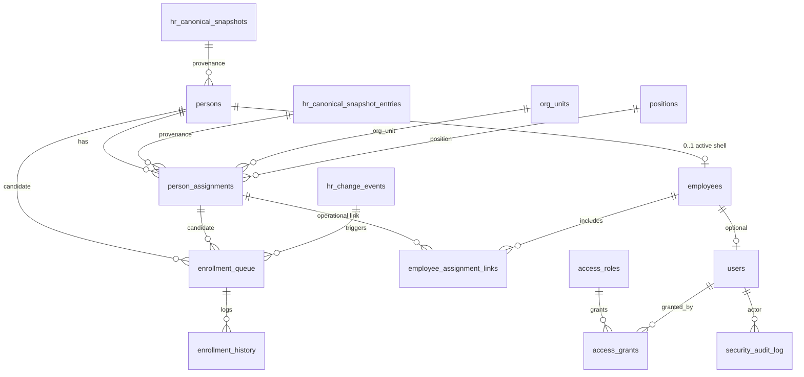

# ADR-042 Phase B1 — DB Schema Design

## Статус

**Implemented** (Phase B2 migrations applied — see [B2 Migration Plan](./ADR-042-phase-b2-migration-plan.md))

## Дата

2026-06-20

## Связанные документы

- [ADR-042 Phase A — Personnel Access & Enrollment Architecture](./ADR-042-phase-a-personnel-access-enrollment-architecture.md)
- [ADR-041 — Dual Personnel Registry Model](./ADR-041-dual-personnel-registry-model.md)
- [ADR-040 — Canonical HR Snapshot & Monthly Diff](./ADR-040-canonical-hr-snapshot-monthly-diff.md)
- [ADR-038 — Employee Identity & HR Import](./ADR-038-employee-identity-hr-import-architecture.md)
- [ADR-033 — Personnel Governance Model](./ADR-033-personnel-governance-model.md)

## Принятые решения (наследуются из Phase A)

| # | Решение |
|---|---------|
| 1 | Enrollment unit = **Assignment** |
| 2 | Identity anchor = **Person** |
| 3 | `employees` = operational shell, **не замена** `persons` |
| 4 | Access Registry **ортогонален** task-`roles` |
| 5 | Hybrid access: `access_roles` + `access_grants` |
| 6 | `security_audit_log` — отдельно от `employee_events` / `task_audit_log` |
| 7 | Sysadmin **не видит** текущие пароли |
| 8 | Primary path создания operational employee = **enrollment** |
| 9 | Manual creation = **emergency fallback** |

---

## 1. Финальный список таблиц

### Новые таблицы (Phase B1)

| # | Table | Назначение |
|---|-------|------------|
| 1 | `persons` | Единая идентичность физического лица |
| 2 | `person_assignments` | Кадровые назначения (canonical + operational source) |
| 3 | `employee_assignment_links` | Какие assignments включены в operational contour |
| 4 | `enrollment_queue` | Очередь кандидатов на enrollment |
| 5 | `enrollment_history` | Append-only история решений enrollment |
| 6 | `access_roles` | Справочник уровней доступа (≠ task `roles`) |
| 7 | `access_grants` | Выдача access role субъекту / target |
| 8 | `security_audit_log` | Журнал безопасности и admin actions |

### Изменяемые таблицы (Phase B1 design, apply in B2)

| Table | Изменение |
|-------|-----------|
| `employees` | ADD `person_id`, `operational_status`, `enrolled_at`, `enrolled_by_user_id`, `enrollment_source`; **legacy columns сохраняются** |
| `users` | ADD password policy / lockout columns |

### Не создаём в B1

| Artifact | Причина |
|----------|---------|
| `access_role_permissions` | Phase B3; B1 grants ссылаются напрямую на `access_roles` + optional `resource_key` |
| `access_effective_cache` | Phase B3 materialized resolver |
| `person_enrollment_links` | Заменено парой `employees.person_id` + `employee_assignment_links` |

---

## 2. Naming & type conventions

| Rule | Value |
|------|-------|
| Schema | `public` |
| PK naming | `{entity}_id BIGINT GENERATED ALWAYS AS IDENTITY` |
| Timestamps | `TIMESTAMPTZ NOT NULL DEFAULT now()` |
| Soft status | `TEXT` + `CHECK` (не Postgres ENUM — проще эволюция через Alembic) |
| FK on delete | Person/assignment: `RESTRICT`; audit refs: `SET NULL`; queue history: `RESTRICT` |
| Text normalization | IIN stored as 12-digit string; `match_key` lowercase |

---

## 3. Enum values (CHECK constraints)

### `persons.person_status`

| Value | Meaning |
|-------|---------|
| `active` | Актуальная identity |
| `inactive` | Нет активных assignments / выбывший из canonical |
| `merged` | Дедуплицирован в другого person |

### `persons.source`

| Value | Meaning |
|-------|---------|
| `canonical` | Materialized из HR canonical snapshot |
| `manual` | Emergency / ручное создание |
| `migration` | Backfill из legacy `employees` |
| `enrollment` | Создан в процессе enrollment apply |

### `person_assignments.employment_type`

| Value | Meaning |
|-------|---------|
| `primary` | Основное место работы |
| `part_time` | Совместительство |
| `internal_combo` | Совмещение должностей (заведующий + врач) |
| `external` | Внешнее совместительство |
| `locum` | Замещение / временная замена |

### `person_assignments.source`

| Value | Meaning |
|-------|---------|
| `canonical` | Из snapshot / import |
| `manual` | HR manual entry |
| `migration` | Backfill |
| `enrollment` | Создан при apply enrollment |
| `correction` | Исправление ошибки (ADR-032 CORRECTION path) |
| `transfer` | Close-old-open-new transfer |

### `person_assignments.lifecycle_status`

| Value | Meaning |
|-------|---------|
| `active` | Открытый период |
| `closed` | `end_date` установлен |
| `voided` | Ошибочная запись (не участвует в active) |

### `employees.operational_status` (NEW column)

| Value | Meaning |
|-------|---------|
| `draft` | Emergency manual create, не enrolled |
| `active` | Enrolled, ≥1 active assignment link |
| `suspended` | Временно отключён (admin) |
| `terminated` | Все assignments unenrolled / person inactive |

### `employees.enrollment_source` (NEW column)

| Value | Meaning |
|-------|---------|
| `enrollment` | Normal path |
| `manual_emergency` | Fallback без queue |
| `migration` | Legacy backfill |

### `employee_assignment_links.link_status`

| Value | Meaning |
|-------|---------|
| `active` | Assignment в operational contour |
| `unenrolled` | Явно исключён |
| `superseded` | Заменён re-enroll |

### `enrollment_queue.queue_status`

| Value | Meaning |
|-------|---------|
| `PENDING` | Ожидает решения |
| `APPROVED` | Одобрено, apply pending |
| `REJECTED` | Отклонено |
| `SUPERSEDED` | Заменён новым queue item |
| `ENROLLED` | Успешно применён |

### `enrollment_queue.reason` (detection reason)

| Value | Meaning |
|-------|---------|
| `NEW_ASSIGNMENT` | Новое назначение в canonical |
| `CHANGED_ASSIGNMENT` | Изменение полей enrolled assignment |
| `REMOVED_ASSIGNMENT` | REMOVED в diff |
| `RE_ENROLL` | Повторный enroll после termination |
| `MANUAL_REQUEST` | Ручная заявка |

### `enrollment_history.event_type`

| Value | Meaning |
|-------|---------|
| `DETECTED` | Попал в queue |
| `APPROVED` | Решение approve |
| `REJECTED` | Решение reject |
| `ENROLLED` | Apply успешен |
| `UNENROLLED` | Assignment исключён из operational |
| `RE_ENROLLED` | Повторный enroll |
| `SUPERSEDED` | Queue item superseded |

### `access_grants.target_type`

| Value | Meaning |
|-------|---------|
| `PERSON` | `persons.person_id` |
| `ASSIGNMENT` | `person_assignments.assignment_id` |
| `POSITION` | `positions.position_id` |
| `ORG_UNIT` | `org_units.unit_id` |
| `EMPLOYEE` | `employees.employee_id` |
| `USER` | `users.user_id` (explicit user grant) |

### `access_grants.scope_type`

| Value | Meaning |
|-------|---------|
| `GLOBAL` | Без ограничения org scope |
| `ORG_UNIT` | `scope_id` → org_unit (+ optional subtree) |
| `SELF` | Только собственные данные subject |

### `security_audit_log.event_type`

`LOGIN_SUCCESS`, `LOGIN_FAILED`, `LOGOUT`, `PASSWORD_RESET_REQUESTED`, `PASSWORD_RESET_COMPLETED`, `PASSWORD_CHANGED`, `TEMP_PASSWORD_ISSUED`, `USER_LOCKED`, `USER_UNLOCKED`, `ACCESS_GRANTED`, `ACCESS_REVOKED`, `ACCESS_CHANGED`, `ENROLLMENT_APPROVED`, `ENROLLMENT_REJECTED`, `ENROLLMENT_COMPLETED`, `USER_BLOCKED`, `USER_UNBLOCKED`

---

## 4. Table specifications

### 4.1. `persons`

**Назначение:** единая идентичность сотрудника; anchor для canonical и operational контуров.

```sql
-- DESIGN ONLY — not a migration script

CREATE TABLE public.persons (
    person_id               BIGINT GENERATED ALWAYS AS IDENTITY PRIMARY KEY,

    -- Identity
    iin                     TEXT NULL,           -- normalized 12 digits
    full_name               TEXT NOT NULL,
    last_name               TEXT NULL,
    first_name              TEXT NULL,
    middle_name             TEXT NULL,
    birth_date              DATE NULL,
    match_key               TEXT NOT NULL,       -- stable dedup key (ADR-040)

    -- Lifecycle
    person_status           TEXT NOT NULL DEFAULT 'active',
    merged_into_person_id   BIGINT NULL
        REFERENCES public.persons (person_id) ON DELETE RESTRICT,

    -- Provenance
    source                  TEXT NOT NULL DEFAULT 'canonical',
    canonical_snapshot_id   BIGINT NULL
        REFERENCES public.hr_canonical_snapshots (snapshot_id) ON DELETE SET NULL,
    canonical_entry_id      BIGINT NULL
        REFERENCES public.hr_canonical_snapshot_entries (entry_id) ON DELETE SET NULL,

    created_at              TIMESTAMPTZ NOT NULL DEFAULT now(),
    updated_at              TIMESTAMPTZ NOT NULL DEFAULT now(),

    CONSTRAINT chk_persons_status
        CHECK (person_status IN ('active', 'inactive', 'merged')),
    CONSTRAINT chk_persons_source
        CHECK (source IN ('canonical', 'manual', 'migration', 'enrollment')),
    CONSTRAINT chk_persons_match_key_nonempty
        CHECK (length(trim(match_key)) > 0),
    CONSTRAINT chk_persons_full_name_nonempty
        CHECK (length(trim(full_name)) > 0),
    CONSTRAINT chk_persons_iin_format
        CHECK (iin IS NULL OR iin ~ '^[0-9]{12}$'),
    CONSTRAINT chk_persons_merged_target
        CHECK (
            (person_status = 'merged' AND merged_into_person_id IS NOT NULL)
            OR (person_status <> 'merged' AND merged_into_person_id IS NULL)
        )
);
```

#### Dedup strategy (повторный импорт)

```text
1. Normalize IIN → if match active person with same iin → reuse person_id (UPDATE names if canonical wins).
2. Else lookup match_key (iin:{12} | name:{norm}|dob:{iso}) UNIQUE among person_status IN ('active','inactive').
3. Else INSERT new person.
4. On duplicate IIN with different match_key → CONFLICT queue (manual merge), do NOT auto-merge.
5. merged persons: match_key retained; partial unique excludes merged rows.
```

#### Unique constraints

| Name | Definition |
|------|------------|
| `uq_persons_match_key_active` | `UNIQUE (match_key) WHERE person_status IN ('active', 'inactive')` |
| `uq_persons_iin_active` | `UNIQUE (iin) WHERE iin IS NOT NULL AND person_status = 'active'` |

#### Indexes

| Name | Columns | Notes |
|------|---------|-------|
| `ix_persons_iin` | `(iin) WHERE iin IS NOT NULL` | Match engine |
| `ix_persons_full_name` | `(lower(full_name))` | Search / fallback match |
| `ix_persons_birth_date` | `(birth_date) WHERE birth_date IS NOT NULL` | Fallback match |
| `ix_persons_canonical_entry` | `(canonical_entry_id) WHERE canonical_entry_id IS NOT NULL` | Provenance |
| `ix_persons_status` | `(person_status)` | Filters |

#### FK summary

| Column | References |
|--------|------------|
| `merged_into_person_id` | `persons.person_id` |
| `canonical_snapshot_id` | `hr_canonical_snapshots.snapshot_id` |
| `canonical_entry_id` | `hr_canonical_snapshot_entries.entry_id` |

---

### 4.2. `person_assignments`

**Назначение:** кадровое назначение Person; enrollment unit.

```sql
CREATE TABLE public.person_assignments (
    assignment_id           BIGINT GENERATED ALWAYS AS IDENTITY PRIMARY KEY,
    person_id               BIGINT NOT NULL
        REFERENCES public.persons (person_id) ON DELETE RESTRICT,

    org_unit_id             BIGINT NOT NULL
        REFERENCES public.org_units (unit_id) ON DELETE RESTRICT,
    position_id             BIGINT NOT NULL
        REFERENCES public.positions (position_id) ON DELETE RESTRICT,
    department_id           BIGINT NULL
        REFERENCES public.departments (department_id) ON DELETE SET NULL,

    employment_type         TEXT NOT NULL DEFAULT 'primary',
    rate                    NUMERIC(4,2) NOT NULL,
    start_date              DATE NOT NULL,
    end_date                DATE NULL,

    -- Persisted; maintained by service/trigger on write
    active_flag             BOOLEAN NOT NULL DEFAULT FALSE,
    is_primary              BOOLEAN NOT NULL DEFAULT FALSE,
    lifecycle_status        TEXT NOT NULL DEFAULT 'active',

    -- Dedup within person
    assignment_key          TEXT NOT NULL,

    source                  TEXT NOT NULL DEFAULT 'canonical',
    canonical_snapshot_id   BIGINT NULL
        REFERENCES public.hr_canonical_snapshots (snapshot_id) ON DELETE SET NULL,
    canonical_entry_id      BIGINT NULL
        REFERENCES public.hr_canonical_snapshot_entries (entry_id) ON DELETE SET NULL,

    created_at              TIMESTAMPTZ NOT NULL DEFAULT now(),
    updated_at              TIMESTAMPTZ NOT NULL DEFAULT now(),

    CONSTRAINT chk_pa_employment_type
        CHECK (employment_type IN (
            'primary', 'part_time', 'internal_combo', 'external', 'locum'
        )),
    CONSTRAINT chk_pa_rate_range
        CHECK (rate > 0 AND rate <= 1.5),
    CONSTRAINT chk_pa_dates
        CHECK (end_date IS NULL OR end_date >= start_date),
    CONSTRAINT chk_pa_source
        CHECK (source IN (
            'canonical', 'manual', 'migration', 'enrollment', 'correction', 'transfer'
        )),
    CONSTRAINT chk_pa_lifecycle
        CHECK (lifecycle_status IN ('active', 'closed', 'voided')),
    CONSTRAINT chk_pa_assignment_key_nonempty
        CHECK (length(trim(assignment_key)) > 0)
);
```

#### `assignment_key` formula

```text
assignment_key = lower(
  org_unit_id || '|' ||
  position_id || '|' ||
  employment_type || '|' ||
  start_date::text
)
```

Provenance link to canonical roster row via `canonical_entry_id` (not part of key — transfer creates new row with new start_date).

#### `active_flag` vs computed status

| Mechanism | Role |
|-----------|------|
| **Computed** (resolver) | `is_active_computed = lifecycle_status = 'active' AND person.person_status = 'active' AND start_date <= CURRENT_DATE AND (end_date IS NULL OR end_date >= CURRENT_DATE)` |
| **Persisted `active_flag`** | Denormalized for index-friendly queries; updated in same transaction as date/lifecycle changes |

**Rule:** API read paths Phase B2 use persisted `active_flag`; nightly reconciliation job optional.

#### Overlapping assignments policy

| Scenario | Policy |
|----------|--------|
| Different `assignment_key` (e.g. part_time in other org) | **ALLOW** concurrent `active_flag = true` |
| Same org+position+type, overlapping dates | **DISALLOW** for `lifecycle_status = 'active'` |
| Transfer | **Close old** (`end_date`, `lifecycle_status = 'closed'`, `active_flag = false`) + **INSERT new** row (`source = 'transfer'`) |
| Correction | Void old (`lifecycle_status = 'voided'`) + INSERT corrected row |

#### EXCLUDE constraint (Phase B2 migration — optional hard guarantee)

```sql
-- DESIGN: apply if pg_trgm/btree_gist available
-- EXCLUDE USING gist (
--   person_id WITH =,
--   org_unit_id WITH =,
--   position_id WITH =,
--   employment_type WITH =,
--   daterange(start_date, COALESCE(end_date, 'infinity'::date), '[]') WITH &&
-- ) WHERE (lifecycle_status = 'active')
```

If EXCLUDE omitted in B2, enforce in enrollment/HR service layer.

#### Unique constraints

| Name | Definition |
|------|------------|
| `uq_pa_canonical_entry` | `UNIQUE (canonical_entry_id) WHERE canonical_entry_id IS NOT NULL` |

One canonical roster row → at most one assignment row.

#### Indexes

| Name | Columns |
|------|---------|
| `ix_pa_person_id` | `(person_id)` |
| `ix_pa_person_active` | `(person_id, active_flag) WHERE active_flag = TRUE` |
| `ix_pa_org_unit` | `(org_unit_id, active_flag) WHERE active_flag = TRUE` |
| `ix_pa_position` | `(position_id) WHERE active_flag = TRUE` |
| `ix_pa_canonical_entry` | `(canonical_entry_id) WHERE canonical_entry_id IS NOT NULL` |
| `ix_pa_dates` | `(person_id, start_date DESC, end_date DESC NULLS FIRST)` |

---

### 4.3. `employees` (evolution)

**Назначение:** operational shell; **существующая таблица расширяется**, не пересоздаётся.

> ~15 FK references from `users`, `employee_events`, `employee_documents`, `hr_import_*`, `hr_canonical_snapshot_entries`, `hr_change_events`, `employee_identities` — **PK `employee_id` сохраняется**.

#### Legacy columns (сохраняются Phase B2–C)

```text
employee_id, full_name, department_id, position_id,
date_from, date_to, employment_rate, is_active, org_unit_id
```

Legacy columns = **primary assignment snapshot** для backward compatibility (tasks, directory UI, RBAC scope).

#### New columns (ADD in Phase B2)

```sql
ALTER TABLE public.employees ADD COLUMN IF NOT EXISTS
    person_id BIGINT NULL
        REFERENCES public.persons (person_id) ON DELETE RESTRICT;

ALTER TABLE public.employees ADD COLUMN IF NOT EXISTS
    operational_status TEXT NOT NULL DEFAULT 'active';

ALTER TABLE public.employees ADD COLUMN IF NOT EXISTS
    enrolled_at TIMESTAMPTZ NULL;

ALTER TABLE public.employees ADD COLUMN IF NOT EXISTS
    enrolled_by_user_id BIGINT NULL
        REFERENCES public.users (user_id) ON DELETE SET NULL;

ALTER TABLE public.employees ADD COLUMN IF NOT EXISTS
    enrollment_source TEXT NOT NULL DEFAULT 'migration';

ALTER TABLE public.employees ADD COLUMN IF NOT EXISTS
    updated_at TIMESTAMPTZ NULL;
```

#### One employee per person?

**Decision: YES — at most one non-terminated employee per person.**

| Constraint | Definition |
|------------|------------|
| `uq_employees_person_active` | `UNIQUE (person_id) WHERE person_id IS NOT NULL AND operational_status IN ('draft', 'active', 'suspended')` |

Terminated employee row **не удаляется**; re-enroll reactivates same row OR creates new per policy (recommend: **reactivate same `employee_id`** to preserve FK history).

#### CHECK

```sql
CONSTRAINT chk_employees_operational_status
    CHECK (operational_status IN ('draft', 'active', 'suspended', 'terminated')),
CONSTRAINT chk_employees_enrollment_source
    CHECK (enrollment_source IN ('enrollment', 'manual_emergency', 'migration'))
```

#### Indexes (new)

| Name | Definition |
|------|------------|
| `ix_employees_person_id` | `(person_id) WHERE person_id IS NOT NULL` |
| `uq_employees_person_active` | partial unique above |

#### Dual-write rule (Phase B2–C)

При изменении primary assignment → sync legacy columns:

```text
employees.org_unit_id      ← primary active assignment.org_unit_id
employees.position_id      ← primary active assignment.position_id
employees.employment_rate  ← primary active assignment.rate
employees.date_from        ← primary active assignment.start_date
employees.date_to          ← primary active assignment.end_date
employees.is_active        ← operational_status = 'active' AND EXISTS active link
employees.full_name        ← persons.full_name
```

---

### 4.4. `employee_assignment_links`

**Назначение:** partial enrollment — какие assignments входят в operational contour.

```sql
CREATE TABLE public.employee_assignment_links (
    link_id                 BIGINT GENERATED ALWAYS AS IDENTITY PRIMARY KEY,

    employee_id             BIGINT NOT NULL
        REFERENCES public.employees (employee_id) ON DELETE RESTRICT,
    assignment_id           BIGINT NOT NULL
        REFERENCES public.person_assignments (assignment_id) ON DELETE RESTRICT,

    link_status             TEXT NOT NULL DEFAULT 'active',

    enrolled_at             TIMESTAMPTZ NOT NULL DEFAULT now(),
    enrolled_by_user_id     BIGINT NOT NULL
        REFERENCES public.users (user_id) ON DELETE RESTRICT,

    unenrolled_at           TIMESTAMPTZ NULL,
    unenrolled_by_user_id   BIGINT NULL
        REFERENCES public.users (user_id) ON DELETE SET NULL,

    enrollment_queue_id     BIGINT NULL,  -- FK added after enrollment_queue exists

    created_at              TIMESTAMPTZ NOT NULL DEFAULT now(),

    CONSTRAINT chk_eal_status
        CHECK (link_status IN ('active', 'unenrolled', 'superseded')),
    CONSTRAINT chk_eal_unenroll_pair
        CHECK (
            (link_status = 'active' AND unenrolled_at IS NULL)
            OR (link_status IN ('unenrolled', 'superseded') AND unenrolled_at IS NOT NULL)
        ),
    CONSTRAINT uq_eal_employee_assignment
        UNIQUE (employee_id, assignment_id)
);
```

#### Partial enrollment & совместительство

```text
Person P has assignments A1 (primary), A2 (part_time).
Employee E linked to P.
Links: (E, A1) active; A2 not linked → operational contour only primary.
Later enroll A2 → INSERT new link (E, A2).
```

#### Close assignment → unenroll link

When `person_assignments.lifecycle_status` → `closed`:

- Service sets `employee_assignment_links.link_status = 'unenrolled'`, `unenrolled_at = now()`.
- Does **not** DELETE link (audit trail).

#### Re-enroll

- Old link: `superseded`.
- New link row OR reactivate with new `enrolled_at` (recommend: **new link row** if gap > 0 days; else reactivate — configurable in B2 service).

#### Indexes

| Name | Columns |
|------|---------|
| `ix_eal_employee_active` | `(employee_id) WHERE link_status = 'active'` |
| `ix_eal_assignment_active` | `(assignment_id) WHERE link_status = 'active'` |
| `uq_eal_one_active_per_assignment` | `UNIQUE (assignment_id) WHERE link_status = 'active'` |

**Invariant:** one assignment → at most one active operational link (one employee).

---

### 4.5. `enrollment_queue`

**Назначение:** текущее состояние кандидатов на enrollment.

```sql
CREATE TABLE public.enrollment_queue (
    queue_id                BIGINT GENERATED ALWAYS AS IDENTITY PRIMARY KEY,

    person_id               BIGINT NULL
        REFERENCES public.persons (person_id) ON DELETE RESTRICT,
    assignment_id           BIGINT NULL
        REFERENCES public.person_assignments (assignment_id) ON DELETE RESTRICT,

    change_event_id         BIGINT NULL
        REFERENCES public.hr_change_events (change_event_id) ON DELETE SET NULL,
    canonical_entry_id      BIGINT NULL
        REFERENCES public.hr_canonical_snapshot_entries (entry_id) ON DELETE SET NULL,

    queue_status            TEXT NOT NULL DEFAULT 'PENDING',
    reason                  TEXT NOT NULL,

    detected_at             TIMESTAMPTZ NOT NULL DEFAULT now(),
    resolved_at             TIMESTAMPTZ NULL,
    resolved_by_user_id     BIGINT NULL
        REFERENCES public.users (user_id) ON DELETE SET NULL,
    decision_comment        TEXT NULL,

    superseded_by_queue_id  BIGINT NULL
        REFERENCES public.enrollment_queue (queue_id) ON DELETE SET NULL,

    idempotency_key         TEXT NOT NULL,

    created_at              TIMESTAMPTZ NOT NULL DEFAULT now(),
    updated_at              TIMESTAMPTZ NOT NULL DEFAULT now(),

    CONSTRAINT chk_eq_status
        CHECK (queue_status IN (
            'PENDING', 'APPROVED', 'REJECTED', 'SUPERSEDED', 'ENROLLED'
        )),
    CONSTRAINT chk_eq_reason
        CHECK (reason IN (
            'NEW_ASSIGNMENT', 'CHANGED_ASSIGNMENT', 'REMOVED_ASSIGNMENT',
            'RE_ENROLL', 'MANUAL_REQUEST'
        )),
    CONSTRAINT chk_eq_target_present
        CHECK (person_id IS NOT NULL OR assignment_id IS NOT NULL OR canonical_entry_id IS NOT NULL),
    CONSTRAINT chk_eq_resolved_pair
        CHECK (
            (queue_status IN ('PENDING', 'APPROVED') AND resolved_at IS NULL)
            OR (queue_status IN ('REJECTED', 'ENROLLED', 'SUPERSEDED') AND resolved_at IS NOT NULL)
            OR (queue_status = 'SUPERSEDED')
        )
);
```

#### Idempotency (повторный импорт)

```text
idempotency_key =
  coalesce(change_event_id::text, canonical_entry_id::text, manual_uuid)
  || '|' || reason
  || '|' || coalesce(assignment_id::text, person_id::text, '')
```

| Name | Definition |
|------|------------|
| `uq_eq_idempotency_active` | `UNIQUE (idempotency_key) WHERE queue_status IN ('PENDING', 'APPROVED')` |

Repeat import with same change → no duplicate PENDING row.

#### Indexes

| Name | Columns |
|------|---------|
| `ix_eq_status_detected` | `(queue_status, detected_at DESC)` |
| `ix_eq_person` | `(person_id) WHERE person_id IS NOT NULL` |
| `ix_eq_assignment` | `(assignment_id) WHERE assignment_id IS NOT NULL` |
| `ix_eq_change_event` | `(change_event_id) WHERE change_event_id IS NOT NULL` |

#### FK back to `employee_assignment_links`

```sql
ALTER TABLE public.employee_assignment_links
    ADD CONSTRAINT fk_eal_enrollment_queue
    FOREIGN KEY (enrollment_queue_id)
    REFERENCES public.enrollment_queue (queue_id)
    ON DELETE SET NULL;
```

---

### 4.6. `enrollment_history`

**Назначение:** append-only журнал всех enrollment transitions.

```sql
CREATE TABLE public.enrollment_history (
    history_id              BIGINT GENERATED ALWAYS AS IDENTITY PRIMARY KEY,

    queue_id                BIGINT NOT NULL
        REFERENCES public.enrollment_queue (queue_id) ON DELETE RESTRICT,

    event_type              TEXT NOT NULL,
    event_at                TIMESTAMPTZ NOT NULL DEFAULT now(),

    actor_user_id           BIGINT NULL
        REFERENCES public.users (user_id) ON DELETE SET NULL,

    person_id               BIGINT NULL
        REFERENCES public.persons (person_id) ON DELETE SET NULL,
    assignment_id           BIGINT NULL
        REFERENCES public.person_assignments (assignment_id) ON DELETE SET NULL,
    employee_id             BIGINT NULL
        REFERENCES public.employees (employee_id) ON DELETE SET NULL,
    link_id                 BIGINT NULL
        REFERENCES public.employee_assignment_links (link_id) ON DELETE SET NULL,

    comment                 TEXT NULL,
    metadata                JSONB NOT NULL DEFAULT '{}'::jsonb,

    CONSTRAINT chk_eh_event_type
        CHECK (event_type IN (
            'DETECTED', 'APPROVED', 'REJECTED', 'ENROLLED',
            'UNENROLLED', 'RE_ENROLLED', 'SUPERSEDED'
        ))
);
```

**Append-only:** INSERT only; no UPDATE/DELETE in application.

#### Indexes

| Name | Columns |
|------|---------|
| `ix_eh_queue_id` | `(queue_id, event_at DESC)` |
| `ix_eh_person` | `(person_id, event_at DESC) WHERE person_id IS NOT NULL` |
| `ix_eh_employee` | `(employee_id, event_at DESC) WHERE employee_id IS NOT NULL` |
| `ix_eh_event_type` | `(event_type, event_at DESC)` |

---

### 4.7. `access_roles`

**Назначение:** справочник уровней доступа (отдельно от task `roles`).

```sql
CREATE TABLE public.access_roles (
    access_role_id          BIGINT GENERATED ALWAYS AS IDENTITY PRIMARY KEY,

    code                    TEXT NOT NULL,
    name                    TEXT NOT NULL,
    description             TEXT NULL,

    access_level            TEXT NOT NULL,   -- NONE | OBSERVER | MANAGER | ADMIN
    level_rank              SMALLINT NOT NULL,  -- numeric for max() resolution

    is_system               BOOLEAN NOT NULL DEFAULT FALSE,
    is_active               BOOLEAN NOT NULL DEFAULT TRUE,

    -- Optional scope default for role template
    default_resource_key    TEXT NULL,       -- e.g. 'module:personnel'

    created_at              TIMESTAMPTZ NOT NULL DEFAULT now(),
    updated_at              TIMESTAMPTZ NOT NULL DEFAULT now(),

    CONSTRAINT uq_access_roles_code UNIQUE (code),
    CONSTRAINT chk_access_roles_level
        CHECK (access_level IN ('NONE', 'OBSERVER', 'MANAGER', 'ADMIN')),
    CONSTRAINT chk_access_roles_rank
        CHECK (
            (access_level = 'NONE'     AND level_rank = 0) OR
            (access_level = 'OBSERVER' AND level_rank = 10) OR
            (access_level = 'MANAGER'  AND level_rank = 20) OR
            (access_level = 'ADMIN'    AND level_rank = 30)
        )
);
```

#### Role hierarchy

```text
NONE (0) < OBSERVER (10) < MANAGER (20) < ADMIN (30)
Effective access = MAX(level_rank) across matching grants.
```

#### NONE as system role

`NONE` role exists for **explicit deny override** (Phase B3 evaluator); default absence of grants = implicit NONE (no row).

#### Seed data (Phase B2 migration data, not B1)

| code | access_level | level_rank | is_system |
|------|--------------|------------|-----------|
| `ACCESS_NONE` | NONE | 0 | true |
| `ACCESS_OBSERVER` | OBSERVER | 10 | true |
| `ACCESS_MANAGER` | MANAGER | 20 | true |
| `ACCESS_ADMIN` | ADMIN | 30 | true |
| `SYSADMIN_CABINET` | ADMIN | 30 | true |
| `HR_ENROLLMENT_MANAGER` | MANAGER | 20 | true |

Custom roles: `is_system = false`, any `access_level`, optional `default_resource_key`.

---

### 4.8. `access_grants`

**Назначение:** выдача `access_role` на target; hybrid exceptions.

```sql
CREATE TABLE public.access_grants (
    grant_id                BIGINT GENERATED ALWAYS AS IDENTITY PRIMARY KEY,

    access_role_id          BIGINT NOT NULL
        REFERENCES public.access_roles (access_role_id) ON DELETE RESTRICT,

    target_type             TEXT NOT NULL,
    target_id               BIGINT NOT NULL,

    resource_key            TEXT NOT NULL DEFAULT '*',  -- '*' = all; 'module:personnel', etc.

    scope_type              TEXT NOT NULL DEFAULT 'GLOBAL',
    scope_id                BIGINT NULL,   -- org_unit_id when scope_type = ORG_UNIT
    include_subtree         BOOLEAN NOT NULL DEFAULT FALSE,

    starts_at               TIMESTAMPTZ NOT NULL DEFAULT now(),
    ends_at                 TIMESTAMPTZ NULL,
    active_flag             BOOLEAN NOT NULL DEFAULT TRUE,

    granted_by_user_id      BIGINT NOT NULL
        REFERENCES public.users (user_id) ON DELETE RESTRICT,
    reason                  TEXT NULL,

    created_at              TIMESTAMPTZ NOT NULL DEFAULT now(),
    revoked_at              TIMESTAMPTZ NULL,
    revoked_by_user_id      BIGINT NULL
        REFERENCES public.users (user_id) ON DELETE SET NULL,

    CONSTRAINT chk_ag_target_type
        CHECK (target_type IN (
            'PERSON', 'ASSIGNMENT', 'POSITION', 'ORG_UNIT', 'EMPLOYEE', 'USER'
        )),
    CONSTRAINT chk_ag_scope_type
        CHECK (scope_type IN ('GLOBAL', 'ORG_UNIT', 'SELF')),
    CONSTRAINT chk_ag_scope_pair
        CHECK (
            (scope_type = 'ORG_UNIT' AND scope_id IS NOT NULL)
            OR (scope_type IN ('GLOBAL', 'SELF') AND scope_id IS NULL)
        ),
    CONSTRAINT chk_ag_dates
        CHECK (ends_at IS NULL OR ends_at > starts_at),
    CONSTRAINT chk_ag_revoked_pair
        CHECK (
            (active_flag = TRUE AND revoked_at IS NULL)
            OR (active_flag = FALSE AND revoked_at IS NOT NULL)
        )
);
```

#### Effective access algorithm (Phase B3 service)

```text
1. Collect grants where:
   - active_flag = TRUE
   - starts_at <= now() AND (ends_at IS NULL OR ends_at > now())
   - target matches user via:
     a) USER direct
     b) EMPLOYEE → users.employee_id
     c) PERSON → employees.person_id → user
     d) ASSIGNMENT → active employee_assignment_links → employee → user
     e) POSITION → user's active assignments with position_id
     f) ORG_UNIT → user's active assignments org_unit_id (+ subtree if include_subtree)
2. Filter by resource_key match (* or exact or prefix).
3. effective_rank = MAX(access_roles.level_rank).
4. Explicit ACCESS_NONE grant with matching resource_key → force rank 0 (deny-wins for that resource).
5. Map rank → level label.
```

#### NONE vs ADMIN conflict

| Case | Resolution |
|------|------------|
| No grants | Implicit NONE |
| OBSERVER + ADMIN same resource | ADMIN wins (MAX rank) |
| ADMIN + explicit NONE deny grant | **NONE wins** (deny override — document in grant reason) |
| Different resources | Independent per `resource_key` |

#### Indexes (evaluator performance)

| Name | Columns |
|------|---------|
| `ix_ag_target` | `(target_type, target_id) WHERE active_flag = TRUE` |
| `ix_ag_role` | `(access_role_id) WHERE active_flag = TRUE` |
| `ix_ag_resource` | `(resource_key) WHERE active_flag = TRUE` |
| `ix_ag_scope` | `(scope_type, scope_id) WHERE active_flag = TRUE AND scope_type = 'ORG_UNIT'` |
| `ix_ag_validity` | `(starts_at, ends_at) WHERE active_flag = TRUE` |
| `ix_ag_user_lookup` | Composite via expression — Phase B3: materialized view `access_grants_active` |

#### Auditability

Every INSERT/soft-revoke → `security_audit_log` (`ACCESS_GRANTED` / `ACCESS_REVOKED` / `ACCESS_CHANGED`).

---

### 4.9. `security_audit_log`

**Назначение:** append-only security, auth, access, enrollment audit.

```sql
CREATE TABLE public.security_audit_log (
    audit_id                BIGINT GENERATED ALWAYS AS IDENTITY PRIMARY KEY,

    event_type              TEXT NOT NULL,
    happened_at             TIMESTAMPTZ NOT NULL DEFAULT now(),

    actor_user_id           BIGINT NULL
        REFERENCES public.users (user_id) ON DELETE SET NULL,
    target_user_id          BIGINT NULL
        REFERENCES public.users (user_id) ON DELETE SET NULL,
    target_person_id        BIGINT NULL
        REFERENCES public.persons (person_id) ON DELETE SET NULL,
    target_employee_id      BIGINT NULL
        REFERENCES public.employees (employee_id) ON DELETE SET NULL,

    ip_address              INET NULL,
    user_agent              TEXT NULL,

    success                 BOOLEAN NOT NULL DEFAULT TRUE,
    failure_reason          TEXT NULL,

    metadata                JSONB NOT NULL DEFAULT '{}'::jsonb,
    request_id              TEXT NULL,

    CONSTRAINT chk_sal_event_type
        CHECK (event_type IN (
            'LOGIN_SUCCESS', 'LOGIN_FAILED', 'LOGOUT',
            'PASSWORD_RESET_REQUESTED', 'PASSWORD_RESET_COMPLETED', 'PASSWORD_CHANGED',
            'TEMP_PASSWORD_ISSUED',
            'USER_LOCKED', 'USER_UNLOCKED', 'USER_BLOCKED', 'USER_UNBLOCKED',
            'ACCESS_GRANTED', 'ACCESS_REVOKED', 'ACCESS_CHANGED',
            'ENROLLMENT_APPROVED', 'ENROLLMENT_REJECTED', 'ENROLLMENT_COMPLETED'
        ))
);
```

**No password data** in `metadata` — only `{login_masked, temp_issued: true, grant_id, ...}`.

#### Indexes

| Name | Columns |
|------|---------|
| `ix_sal_happened_at` | `(happened_at DESC)` |
| `ix_sal_event_type` | `(event_type, happened_at DESC)` |
| `ix_sal_actor` | `(actor_user_id, happened_at DESC) WHERE actor_user_id IS NOT NULL` |
| `ix_sal_target_user` | `(target_user_id, happened_at DESC) WHERE target_user_id IS NOT NULL` |
| `ix_sal_target_person` | `(target_person_id, happened_at DESC) WHERE target_person_id IS NOT NULL` |

#### Partitioning (optional Phase C)

Range partition by `happened_at` monthly — if volume exceeds ~1M rows/year.

---

### 4.10. `users` extension

#### Current columns (as-is, baseline + migrations)

```text
user_id, full_name, google_login, phone, telegram_id,
role_id (FK → task roles), unit_id, is_active, created_at,
telegram_username, telegram_bound_at, login, password_hash,
employee_id (FK → employees, UNIQUE WHERE NOT NULL)
```

#### Proposed new columns

```sql
ALTER TABLE public.users ADD COLUMN IF NOT EXISTS
    must_change_password BOOLEAN NOT NULL DEFAULT FALSE;

ALTER TABLE public.users ADD COLUMN IF NOT EXISTS
    password_changed_at TIMESTAMPTZ NULL;

ALTER TABLE public.users ADD COLUMN IF NOT EXISTS
    temp_password_expires_at TIMESTAMPTZ NULL;

ALTER TABLE public.users ADD COLUMN IF NOT EXISTS
    failed_login_count INTEGER NOT NULL DEFAULT 0;

ALTER TABLE public.users ADD COLUMN IF NOT EXISTS
    locked_at TIMESTAMPTZ NULL;

ALTER TABLE public.users ADD COLUMN IF NOT EXISTS
    locked_until TIMESTAMPTZ NULL;

ALTER TABLE public.users ADD COLUMN IF NOT EXISTS
    locked_reason TEXT NULL;

ALTER TABLE public.users ADD COLUMN IF NOT EXISTS
    last_login_at TIMESTAMPTZ NULL;

ALTER TABLE public.users ADD COLUMN IF NOT EXISTS
    last_failed_login_at TIMESTAMPTZ NULL;

ALTER TABLE public.users ADD COLUMN IF NOT EXISTS
    token_version INTEGER NOT NULL DEFAULT 1;  -- JWT invalidation on password reset
```

#### Constraints

```sql
CONSTRAINT chk_users_failed_login_count
    CHECK (failed_login_count >= 0),
CONSTRAINT chk_users_locked_reason
    CHECK (locked_reason IS NULL OR locked_reason IN (
        'brute_force', 'admin', 'policy', 'security'
    )),
CONSTRAINT chk_users_lock_pair
    CHECK (
        (locked_at IS NULL AND locked_until IS NULL AND locked_reason IS NULL)
        OR (locked_at IS NOT NULL)
    )
```

#### Password storage rules

| Rule | Implementation |
|------|----------------|
| Never plaintext | Only `password_hash` (existing pbkdf2; argon2 optional B3) |
| Admin cannot read | No column for plaintext; reset generates hash server-side once |
| Temp password | Same hash column; `must_change_password = true`, `temp_password_expires_at` set |
| API never returns hash | Existing pattern preserved |

#### Indexes

| Name | Columns |
|------|---------|
| `ix_users_locked` | `(locked_at) WHERE locked_at IS NOT NULL` |
| `ix_users_must_change` | `(must_change_password) WHERE must_change_password = TRUE` |

---

## 5. ER diagram (Phase B1)



---

## 6. Legacy `employees` — стратегия совместимости

### 6.1. Проблема

`employees` — hub для ~15 FK. Полная замена таблицы **невозможна** без cascade ripples.

### 6.2. Решение: evolve in place

| Layer | Role |
|-------|------|
| `persons` | Identity truth |
| `person_assignments` | Assignment truth |
| `employees` | Stable operational PK + legacy snapshot columns |
| `employee_assignment_links` | Operational enrollment scope |

### 6.3. Backfill mapping (Phase B2 data migration)

```text
FOR EACH legacy employees row E:
  1. INSERT persons P from E.full_name + employee_identities.iin + match_key
  2. INSERT person_assignments A from E.org_unit_id, E.position_id, E.employment_rate, E.date_from/to
  3. UPDATE E.person_id = P.person_id, E.enrollment_source = 'migration', E.enrolled_at = E.created_at ?? now()
  4. INSERT employee_assignment_links (E, A, active)
  5. Keep E.full_name, E.org_unit_id, ... unchanged (already consistent)
```

### 6.4. Emergency manual create (fallback)

```text
1. INSERT persons (source = 'manual')
2. INSERT person_assignments
3. INSERT employees (operational_status = 'draft', enrollment_source = 'manual_emergency')
4. INSERT employee_assignment_links
5. Optional: skip enrollment_queue OR enqueue MANUAL_REQUEST for audit
6. security_audit_log + enrollment_history
```

### 6.5. `employee_identities` coexistence

| Phase | Policy |
|-------|--------|
| B2 | Keep `employee_identities.employee_id`; add optional `person_id` column (future) |
| B3 | Dual-read: IIN via persons.primary path |
| C | Deprecate direct employee_identities → persons.iin |

---

## 7. Migration plan (Phase B2)

### B2.1 — DDL wave 1 (no data movement)

| Step | Action |
|------|--------|
| 1 | CREATE `persons` |
| 2 | CREATE `person_assignments` |
| 3 | ALTER `employees` ADD new columns (nullable `person_id`) |
| 4 | CREATE `employee_assignment_links` |
| 5 | CREATE `enrollment_queue`, `enrollment_history` |
| 6 | CREATE `access_roles` + seed system roles |
| 7 | CREATE `access_grants` |
| 8 | CREATE `security_audit_log` |
| 9 | ALTER `users` ADD password policy columns |

**Gate:** all migrations reversible; zero runtime code change required yet.

### B2.2 — Backfill script (transactional batches)

| Step | Action |
|------|--------|
| 1 | Backfill `persons` from `employees` + `employee_identities` |
| 2 | Backfill `person_assignments` (1 per employee) |
| 3 | UPDATE `employees.person_id`, `enrollment_source = 'migration'` |
| 4 | Backfill `employee_assignment_links` |
| 5 | Verify: COUNT(active employees) = COUNT(active links) = COUNT(primary assignments) |

### B2.3 — Dual-write triggers / service flags

| Flag | Behavior |
|------|----------|
| `PERSON_ASSIGNMENTS_DUAL_WRITE` | HR ops write assignments + sync employees snapshot |
| `ENROLLMENT_QUEUE_ENABLED` | hr_change_events → enrollment_queue detector (async job) |

### B2.4 — Validation queries (post-backfill)

```sql
-- Orphans: employee without person
SELECT employee_id FROM employees WHERE person_id IS NULL AND operational_status <> 'terminated';

-- Person without assignment
SELECT person_id FROM persons p
WHERE NOT EXISTS (SELECT 1 FROM person_assignments pa WHERE pa.person_id = p.person_id);

-- Active link without active assignment
SELECT link_id FROM employee_assignment_links l
JOIN person_assignments a ON a.assignment_id = l.assignment_id
WHERE l.link_status = 'active' AND a.active_flag = FALSE;
```

### B2.5 — Rollback strategy

| Level | Action |
|-------|--------|
| Pre-data | Drop new tables; drop new columns on employees/users |
| Post-data | Keep tables; set `person_id` NULL; runtime continues on legacy columns only |

---

## 8. Risks before implementation

| # | Risk | Severity | Mitigation |
|---|------|----------|------------|
| R1 | **Legacy FK hub on `employees`** | High | Never drop/rename `employee_id`; evolve in place |
| R2 | **Dual-write drift** (assignments vs employees snapshot) | High | Primary assignment flag; reconciliation job; tests |
| R3 | **Person dedup errors** (IIN typos) | High | CONFLICT → manual merge UI; `merged_into_person_id` |
| R4 | **Overlapping assignment EXCLUDE** performance | Medium | Optional gist EXCLUDE; service-layer validation fallback |
| R5 | **access_roles vs task `roles` naming** | Medium | Prefix `access_`; separate API namespace `/admin/access/*` |
| R6 | **NONE deny semantics complexity** | Medium | Defer deny-wins to B3; document explicit NONE grants |
| R7 | **Enrollment queue flood** (3000+ rows) | Medium | Idempotency key; filter NEW/CHANGED only; not auto-PENDING for UNCHANGED |
| R8 | **Partial enroll — task routing** | Medium | Primary assignment + explicit link scope in task RBAC Phase C |
| R9 | **users.token_version** JWT invalidation | Low | Bump on password reset; client re-login |
| R10 | **Nullable IIN persons** | Medium | match_key fallback; stricter review for enroll without IIN |
| R11 | **Re-enroll same person** | Medium | Reactivate employee row; supersede old links |
| R12 | **security_audit_log growth** | Low | Retention policy; monthly partitions Phase C |

---

## 9. Open questions for B2 kickoff

1. **`is_primary` assignment selection** — highest rate, earliest start_date, or explicit operator flag?
2. **Re-enroll:** reactivate terminated `employees` row vs new `employee_id`?
3. **Deny grants (ACCESS_NONE):** implement in B2 evaluator or defer B3?
4. **`department_id` on assignments:** keep nullable legacy or org_unit-only?
5. **Partition `security_audit_log` immediately** or wait for volume signal?

---

## 10. Out of scope (Phase B1)

- Alembic revision files
- SQLAlchemy ORM models
- FastAPI routes
- React screens
- Enrollment detector job
- Access evaluator service
- JWT middleware changes

---

## 11. Success criteria (Phase B1)

1. ✅ 8 новых таблиц + 2 расширяемые таблицы fully specified.
2. ✅ PK, FK, UNIQUE, CHECK, indexes documented per table.
3. ✅ Enum values as CHECK lists.
4. ✅ Legacy `employees` compatibility strategy defined.
5. ✅ Phase B2 migration plan with backfill, dual-write, validation, rollback.
6. ✅ Risks catalogued.
