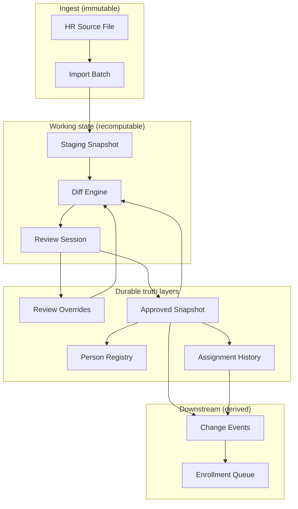
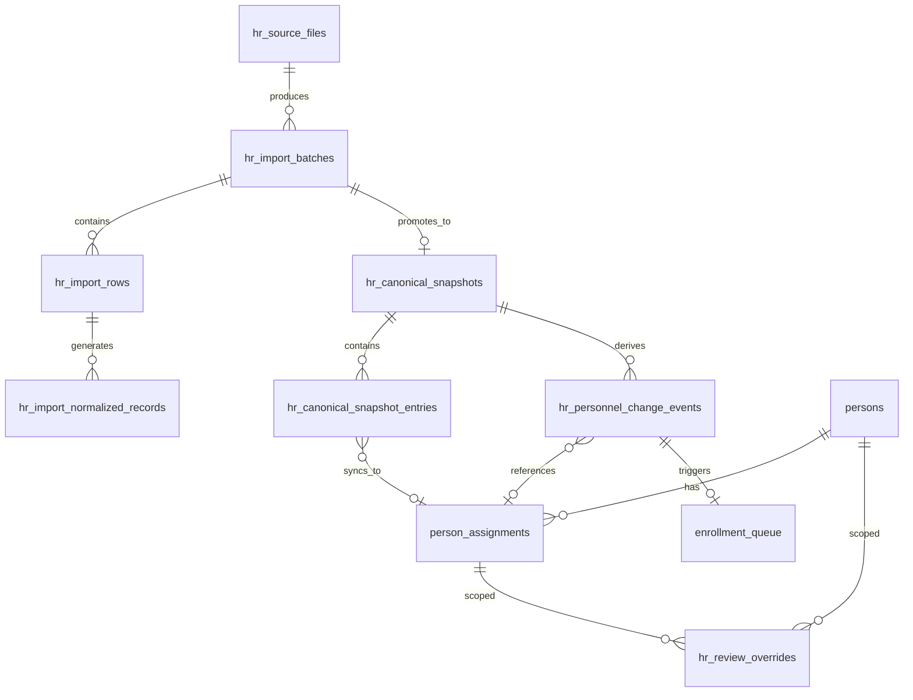
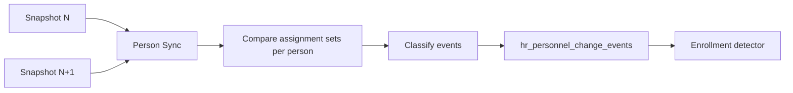
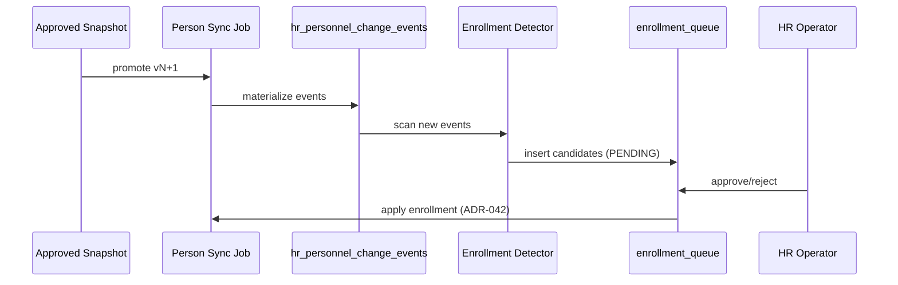

# ADR-043 Phase A — Personnel Lifecycle & Monthly HR Synchronization

## Статус

**Proposed** (design only; миграции, API, UI и код **не входят** в scope Phase A)

## Дата

2026-06-20

## Связанные документы

| ADR | Связь |
|-----|-------|
| [ADR-033 — Personnel Governance Model](./ADR-033-personnel-governance-model.md) | governance, append-only history, HR vs sysadmin |
| [ADR-038 — Employee Identity & HR Import](./ADR-038-employee-identity-hr-import-architecture.md) | staging, match engine, batch lifecycle |
| [ADR-039 Phase 3B — Training Normalization Schema](./ADR-039-Phase-3B-schema.md) | `hr_import_normalized_records`, `source_record_key` |
| [ADR-040 — Canonical HR Snapshot & Monthly Diff](./ADR-040-canonical-hr-snapshot-monthly-diff.md) | эталон, diff, `hr_change_events` (implemented) |
| [ADR-041 — Dual Personnel Registry Model](./ADR-041-dual-personnel-registry-model.md) | два контура; optional binding |
| [ADR-042 Phase A — Personnel Access & Enrollment](./ADR-042-phase-a-personnel-access-enrollment-architecture.md) | Person → Assignments, enrollment unit |
| [ADR-042 Phase B1 — DB Schema Design](./ADR-042-phase-b1-schema-design.md) | `persons`, `person_assignments`, `enrollment_queue` |
| [ADR-043 Phase A.1 — Override Governance](./ADR-043-phase-a1-override-governance.md) | lifecycle, audit history, tiered approval |
| [ADR-043 Phase B1 — DB Schema Design](./ADR-043-phase-b1-schema-design.md) | DDL design, migration plan B2 |
| [ADR-043 Phase B2 — Migration Note](./ADR-043-phase-b2-migration-note.md) | Alembic `x6y7z8a9b0c1`, validation, tests |

---

## Problem Statement

После завершения ADR-039 (normalization + promotion), ADR-040 (canonical snapshot + monthly diff + change events), ADR-041 (dual registry) и развёртывания ADR-042 (Person / Assignments / Enrollment) в Corpsite существует рабочий контур ежемесячного HR-импорта, но **не завершён полный жизненный цикл кадровых данных**.

### Что уже работает (ADR-040)

```text
Excel → Import Batch → Normalization → Diff vs Active Snapshot → Review → Promotion → Snapshot vN+1 → Change Events
```

- Классификация `UNCHANGED | NEW | CHANGED | REMOVED | CONFLICT`.
- Ручные исправления в review **материализуются** в snapshot payload (`_canonical_correction_fields`).
- Повторный импорт с устаревшими данными из внешней системы → `CONFLICT`, не silent overwrite.

### Оставшийся gap

| Сценарий | Проблема сегодня |
|----------|------------------|
| Июнь импортирован и исправлен вручную | Исправления живут в snapshot payload и batch-scoped `review_override`, но **не как независимый слой** |
| Приходит **новый** июньский файл (тот же месяц, другая версия) | Diff сравнивает с active snapshot (хорошо), но override-политика не формализована по полям; нет явных правил снятия override |
| Кадровое событие «перевод» | ADR-040 генерирует `DEPARTMENT_CHANGED` / `POSITION_CHANGED` на уровне roster row, не на уровне **Person → Assignment** |
| Enrollment | ADR-042 определяет queue, но триггеры от HR diff не унифицированы с assignment-centric моделью |
| Исторический аудит | Snapshots хранятся, но нет единой модели «что вечно / что пересчитывается / что источник истины» |

### Цель ADR-043 Phase A

Спроектировать **полный жизненный цикл** кадровых данных от файла до enrollment-кандидатов:

1. HR Source Lifecycle — модель от файла до change events.
2. Monthly Snapshot Strategy — выбор стратегии хранения.
3. Review Override Architecture — persistent overrides, независимые от batch.
4. Override Persistence Rules — когда сохранять / снимать / конфликтовать.
5. Monthly Diff Engine — assignment-centric события.
6. Assignment History — перевод, совместительство, ставка, увольнение, повторный приём.
7. Enrollment Integration — автомат vs ручное решение.
8. HR Operations UI — функциональная спецификация кабинета кадровой службы.
9. Scalability — оценка на 1700 сотрудников × 36 месяцев.

> **Scope boundary:** ADR-043 Phase A — только архитектурный проект. Код, миграции, API и UI **не создаются** в этом ADR.

---

## Architecture Options

### Контекст: целевой pipeline



### Задача 1. HR Source Lifecycle

#### Модель стадий

| Стадия | Сущность | Назначение |
|--------|----------|------------|
| **HR Source File** | Внешний артеfact + metadata | Неизменяемый вход; checksum, `report_month`, `source_system`, `uploaded_at` |
| **Import Batch** | `hr_import_batches` | Парсинг, нормализация, lifecycle (`UPLOADED → REVIEW → APPLIED`) |
| **Snapshot (working)** | Effective view batch + overrides | Промежуточное состояние **до** promotion; пересчитывается при re-diff |
| **Review** | Human decisions + override writes | Принятие/отклонение diff; запись persistent overrides |
| **Approved Snapshot** | `hr_canonical_snapshots` + entries | Версионированный эталон HR Canonical Registry |
| **Change Events** | `hr_personnel_change_events` *(evolution of `hr_change_events`)* | Append-only журнал семантических кадровых изменений |

#### Что хранится вечно (immutable / append-only)

| Artifact | Retention | Обоснование |
|----------|-----------|-------------|
| HR Source File (blob или content hash + path) | Permanent | Аудит «что прислали»; доказательная база |
| `hr_import_batches` + rows + normalized records | Permanent | Provenance chain; replay при hash drift |
| Все `hr_canonical_snapshots` (включая `superseded`) | Permanent | Point-in-time audit; rollback reference |
| `hr_review_overrides` (active + superseded) | Permanent | История ручных решений; governance |
| `hr_personnel_change_events` | Append-only | Кадровая история; enrollment triggers |
| `persons`, `person_assignments` (closed rows) | Permanent | Assignment-centric history (ADR-042) |

#### Что может быть пересчитано

| Artifact | Trigger | Примечание |
|----------|---------|------------|
| `diff_status`, `field_diffs` на batch rows | `POST compute-diff` | Зависит от active snapshot + active overrides |
| Working effective payload | Re-merge canonical + overrides | Не персистируется отдельно — вычисляется |
| Change events для snapshot pair | Re-materialize | Idempotent replace для пары `(prior, new)` — как ADR-040 Phase F |
| `person_assignments` из approved snapshot | Person sync job | Derived; rebuild из snapshot + rules |
| Enrollment candidates | Re-detect после events | Queue idempotency по anchor key |

#### Иерархия источников истины

| Вопрос | Источник истины |
|--------|-----------------|
| «Какой кадровый состав организации по HR?» | **Active Approved Snapshot** + **Active Review Overrides** → Effective Canonical |
| «Кто физически этот человек?» | **`persons`** (identity anchor); sync из roster effective IIN/name/dob |
| «Какие у него назначения?» | **`person_assignments`** (materialized from roster entries) |
| «Кто работает в Corpsite (operational)?» | **`employees` + `employee_assignment_links`** после enrollment (ADR-042) |
| «Что было в исходном Excel?» | **Import batch staging** — provenance only, **не** operational truth |
| «Что прислала внешняя система в июне?» | **HR Source File** + batch — external mirror, **не** Corpsite truth |

```text
Effective Canonical = merge(Active Approved Snapshot entry, Active Review Overrides for scope)
Diff(incoming batch) = compare(incoming effective, Effective Canonical)
```

---

### Задача 2. Monthly Snapshot Strategy

#### Вариант A — Full monthly snapshot (каждый месяц отдельный полный снимок)

**Описание:** Каждый approved promotion создаёт полный `hr_canonical_snapshot_entries` для всего реестра (~1700+ roster + normalized). Исторические версии сохраняются как `superseded`.

| Критерий | Оценка |
|----------|--------|
| Объём данных | ~9–12 MB / snapshot (см. § Scalability); 36 мес ≈ 350–450 MB |
| Сложность diff | **Низкая** — index `match_key`, hash compare (уже ADR-040) |
| Аудит | **Отличный** — point-in-time «состояние на конец месяца» |
| Откат | **Простой** — re-activate snapshot vN (governance gate) |
| Производительность | O(N) per diff; N≈2200 roster + 6800 normalized; <5 s на PostgreSQL |

#### Вариант B — Incremental snapshot (только дельты)

**Описание:** Хранить только изменения относительно prior month; baseline reconstruction при query.

| Критерий | Оценка |
|----------|--------|
| Объём данных | **Меньше** при стабильном составе (~5–15% delta/month) |
| Сложность diff | **Высокая** — нужен chain replay, risk of drift |
| Аудит | **Слабый** — «состояние на дату» требует replay всех deltas |
| Откат | **Сложный** — truncate chain или rebuild |
| Производительность | Быстрый append delta; **медленный** historical query |

#### Вариант C — Hybrid (рекомендуется)

**Описание:**

1. **Full monthly snapshot** для roster / assignment state (как ADR-040 сегодня).
2. **Full monthly snapshot** для normalized records (training, education, certs) — тот же promotion pass.
3. **Incremental artifacts** только для derived data:
   - `hr_personnel_change_events` — delta между snapshot N и N+1;
   - `hr_import_diff_removals` — per-batch REMOVED rows;
   - optional `hr_monthly_diff_summary` — denormalized counters per batch.

| Критерий | Оценка |
|----------|--------|
| Объём данных | Как A для snapshots + ~50–200 KB events/month |
| Сложность diff | **Низкая** на full snapshots; events — derived |
| Аудит | **Отличный** — snapshots + event journal |
| Откат | Snapshot re-activate; events re-materialize |
| Производительность | Best of A; events query без replay |

#### Рекомендация: **Вариант C (Hybrid)**

- **Не менять** базовую модель ADR-040 (full snapshot promotion).
- **Добавить** assignment-centric change events как derived layer (§ Diff Strategy).
- **Не внедрять** incremental-only storage для canonical entries — ROI не оправдан при N≈1700.

**Правило `report_month`:** batch может иметь `report_month` (YYYY-MM). Повторный импорт **того же месяца** — новый batch, diff против **active snapshot** (не против prior-month-only). Snapshot version monotonic по `promoted_at`, не по calendar month.

---

## Data Model

### Задача 1 (продолжение). ER — HR Source Lifecycle



### Новая сущность: `hr_source_files` (Phase B)

| Column | Type | Notes |
|--------|------|-------|
| `source_file_id` | BIGINT PK | |
| `content_sha256` | TEXT NOT NULL | Dedup identical uploads |
| `original_filename` | TEXT NOT NULL | |
| `report_month` | DATE NOT NULL | First day of month |
| `source_system` | TEXT NOT NULL | default `HR_CONTROL_LIST` |
| `byte_size` | BIGINT NOT NULL | |
| `storage_ref` | TEXT NOT NULL | Path / object key |
| `uploaded_by` | BIGINT FK → users | |
| `uploaded_at` | TIMESTAMPTZ NOT NULL | |

`hr_import_batches.source_file_id` FK — связь batch ↔ file.

### Person-centric materialization (связь с ADR-042)

После promotion approved snapshot запускается **Person Sync Job** (async, idempotent):

```text
For each roster entry in new active snapshot:
  1. Upsert persons by match_key
  2. Upsert person_assignments by assignment_key
  3. Close assignments absent from snapshot (end_date = report_month last day)
  4. Emit hr_personnel_change_events (assignment-centric)
```

**Primary object:** `Person → Assignments`, не `Employee`.

`employees` обновляется **только через enrollment** (ADR-041 D2, ADR-042).

### Задача 6. Assignment History

#### Модель (наследует ADR-042)

```text
Person (1) ──< Assignment (N, temporal)
```

| Сценарий | Canonical signal | Assignment effect | Event type |
|----------|-----------------|-------------------|------------|
| **Перевод** | org_unit_id изменился | Close old assignment (`end_date = effective - 1 day`); open new | `TRANSFER` |
| **Смена должности** (без перевода) | position_id изменился | Close + open **или** in-place `CORRECTION` если data fix | `POSITION_CHANGED` |
| **Совместительство** | Новый roster row, тот же person, `employment_type=part_time` | New assignment; primary остаётся | `NEW_ASSIGNMENT` |
| **Изменение ставки** | rate изменился, org+position те же | Close + open с новым rate (append-only) | `RATE_CHANGED` |
| **Увольнение (полное)** | Все assignments REMOVED | `end_date` на все; `person.status = inactive` | `TERMINATED_PERSON` |
| **Увольнение (частичное)** | Один assignment REMOVED | Close один assignment | `CLOSED_ASSIGNMENT` |
| **Повторный приём** | Person inactive → NEW assignment | Reactivate person; new assignment(s) | `NEW_PERSON` или `NEW_ASSIGNMENT` + `RE_ENROLL` enrollment |

#### `assignment_key` (dedup, reuse ADR-042)

```text
{person_id}|{org_unit_id}|{position_id}|{employment_type}|{start_date}
```

#### Transfer vs Correction

| Тип | Условие | Действие |
|-----|---------|----------|
| **TRANSFER** | org_unit_id changed, business-effective date | Close old + open new assignment |
| **CORRECTION** | Same effective placement; data error in prior snapshot | Update assignment metadata with `source=correction`; **не** создавать transfer event |
| **POSITION_CHANGED** | position_id changed, org_unit_id same | Close + open (preferred) или correction if same-day typo |

Governance (ADR-033): transfer **не** in-place update primary org on `employees` — только через assignment close/open.

#### Совместительство

- Каждый part-time roster row → отдельный `person_assignment`.
- `is_primary` flag — одно primary assignment per person (highest rate; tie → longest tenure).
- Enrollment granular per assignment (ADR-042 §2.1).

---

## Override Strategy

### Задача 3. Review Override Architecture

#### Проблема (повторный импорт июня)

```text
Июнь v1 imported → reviewed → IIN исправлен вручную → snapshot v12 promoted
        ↓
Июнь v2 arrives (внешняя система всё ещё с ошибочным IIN)
        ↓
Expected: effective IIN = override; diff показывает CONFLICT или UNCHANGED (если v2 совпал с override)
        ↓
Override НЕ теряется при promotion v13
```

#### Три слоя значений

| Layer | Definition | Storage |
|-------|------------|---------|
| **Canonical Value** | Последнее approved значение из active snapshot entry payload | `hr_canonical_snapshot_entries.payload[field]` |
| **Review Override** | Активная ручная коррекция, привязанная к **scope**, не к batch | `hr_review_overrides` |
| **Effective Value** | `coalesce(active_override, canonical_value)` — участвует в diff hash | Computed at diff time |

```text
effective(field) = active_override(scope, field)?.value ?? canonical(field)
canonical_hash   = sha256(sorted effective fields)
```

#### Таблица `hr_review_overrides` (Phase B)

> **Governance (Phase A.1):** полный жизненный цикл, audit history, tiered approval — см. [ADR-043 Phase A.1 — Override Governance](./ADR-043-phase-a1-override-governance.md).

| Column | Type | Notes |
|--------|------|-------|
| `override_id` | BIGINT PK | |
| `scope_type` | TEXT NOT NULL | `person` \| `assignment` \| `roster_entry` \| `normalized_record` |
| `scope_key` | TEXT NOT NULL | Stable: `person:{id}`, `assignment:{id}`, `match_key:{key}`, `norm:{employee\|iin}:{kind}:{source_record_key}` |
| `person_id` | BIGINT NULL FK | Denormalized for queries |
| `assignment_id` | BIGINT NULL FK | |
| `record_kind` | TEXT NULL | roster \| training \| … |
| `field_name` | TEXT NOT NULL | |
| `override_value` | JSONB NOT NULL | Typed value |
| `canonical_value_at_set` | JSONB NULL | Snapshot value when override created |
| `justification` | TEXT NULL | Operator rationale; required Tier 1+ (A.1) |
| `evidence_url` | TEXT NULL | External evidence link (A.1) |
| `basis_diff` | JSONB NULL | `{ canonical, incoming, diff_status }` at creation (A.1) |
| `governance_tier` | SMALLINT NOT NULL | 0 \| 1 \| 2 (A.1) |
| `lifecycle_status` | TEXT NOT NULL | `active` \| `pending_approval` \| `rejected` (A.1) |
| `status` | TEXT NOT NULL | `active` \| `superseded` \| `expired` \| `revoked` |
| `persistence_policy` | TEXT NOT NULL | See § Override Persistence Rules |
| `source_batch_id` | BIGINT NULL FK | Batch where override was created |
| `source_snapshot_id` | BIGINT NULL FK | Snapshot at creation |
| `created_by_user_id` | BIGINT FK → users | |
| `created_at` | TIMESTAMPTZ NOT NULL | |
| `approved_by_user_id` | BIGINT NULL FK → users | Tier 2 explicit; else promoter (A.1) |
| `approved_at` | TIMESTAMPTZ NULL | |
| `superseded_by_override_id` | BIGINT NULL FK self | |
| `revoked_at` | TIMESTAMPTZ NULL | |
| `revoked_by_user_id` | BIGINT FK NULL | |
| `revoke_reason` | TEXT NULL | Required on manual revoke (A.1) |
| `stale_flag` | BOOLEAN DEFAULT FALSE | Governance stale, not auto-revoke (A.1) |

**Append-only audit:** `hr_review_override_history` — см. ADR-043 Phase A.1.

**Unique active constraint:** `(scope_key, field_name) WHERE status = 'active' AND lifecycle_status = 'active'`.

#### Merge algorithm (diff time)

```text
1. Load active snapshot entry by match_key
2. Load active overrides for scope_key(s) — person + assignment + entry
3. Build effective_payload = snapshot.payload deep-merge overrides
4. Track override_fields in effective_payload._override_fields (analog _canonical_correction_fields)
5. Compute incoming effective from batch row + batch-scoped review_override (legacy)
6. Compare hashes; CONFLICT if incoming disagrees with effective AND field has active override
```

#### Migration from ADR-040

| Legacy | ADR-043 |
|--------|---------|
| `_canonical_correction_fields` in snapshot payload | **Retained** as materialized audit stamp; source → `hr_review_overrides` on promotion |
| `review_override` on normalized records | Batch-scoped staging; on approve → persist to `hr_review_overrides` |
| `employee_import_profile_overrides` | Remains for operational employee card; **separate** from HR canonical overrides |

---

### Задача 4. Override Persistence Rules

#### Когда override **сохраняется**

| Trigger | Action |
|---------|--------|
| Operator saves field correction in Review UI | Insert `hr_review_overrides` status=`active` |
| Promotion batch → snapshot | Materialize overrides from batch decisions; supersede stale if explicit |
| Identity merge (duplicate persons) | Re-scope overrides to survivor `person_id` |

#### Когда override **автоматически снимается**

| Policy code | Condition | Result |
|-------------|-----------|--------|
| `until_incoming_matches` | Incoming effective value == override value | status → `expired` (auto-accept external fix) |
| `until_snapshot_superseded` | New snapshot promoted without conflict on field | Optional expire (config per field) |
| `identity_key_change` | IIN changed via approved identity correction | Old IIN-scoped overrides → `superseded` |
| `assignment_closed` | Assignment end_date set | Assignment-scoped overrides → `expired` |
| `explicit_revoke` | Operator revokes in Overrides UI | status → `revoked` |

#### Когда возникает **конфlict**

```text
CONFLICT = incoming_value ≠ effective_value AND active_override exists AND NOT auto-expire policy matched
```

#### Примеры по полям

| Field | Default persistence | Auto-expire | Conflict behavior |
|-------|---------------------|-------------|-------------------|
| **ФИО** (`full_name`) | `until_incoming_matches` | Если новый файл совпал с override | CONFLICT + show effective vs incoming |
| **ИИН** (`iin`) | **Permanent** (`manual_only_revoke`) | Never auto | CONFLICT; blocks promotion until HR resolves |
| **Должность** (`position_id` / `position_raw`) | `until_incoming_matches` | External HR fixed position | CONFLICT if override active |
| **Подразделение** (`org_unit_id`) | `until_incoming_matches` | External HR fixed dept | CONFLICT; may trigger TRANSFER review |
| **Специальность** (normalized `medical_specialty_id`) | `until_incoming_matches` | Rare auto-expire | CONFLICT in normalized review |
| **Обучение** (training hours/title) | `until_incoming_matches` | New cert supersedes | CHANGED not CONFLICT if no override |
| **Ставка** (`rate`) | `until_incoming_matches` | Payroll sync fixed | RATE_CHANGED event + optional CONFLICT |
| **Дата рождения** | `manual_only_revoke` | Never | CONFLICT — identity field |

#### Identity fields (IIN, birth_date, full_name)

- Overrides scoped to **`person`**, not roster row.
- IIN change requires **identity correction workflow** (not silent hash key migration).
- Match key migration: old key → new key mapping table `person_identity_history` (Phase C).

---

## Diff Strategy

### Задача 5. Monthly Diff Engine — Assignment-Centric Events

ADR-040 `hr_change_events` остаётся **entry-level** journal. ADR-043 вводит **`hr_personnel_change_events`** — semantic layer на Person/Assignment.

#### Event catalog

| Event type | Generation rule | Person scope | Assignment scope |
|------------|---------------|--------------|------------------|
| `NEW_PERSON` | match_key absent in `persons`; new roster row | Create person | — |
| `TERMINATED_PERSON` | All assignments for person REMOVED in effective snapshot | person.status → inactive | Close all |
| `NEW_ASSIGNMENT` | Known person; new assignment_key | — | Insert assignment |
| `CLOSED_ASSIGNMENT` | assignment_key in prior effective, absent in new | — | end_date set |
| `TRANSFER` | org_unit_id changed (same person, overlapping period) | — | Close old + open new |
| `POSITION_CHANGED` | position_id changed, org_unit_id unchanged | — | Close + open |
| `DEPARTMENT_CHANGED` | Alias for org change on legacy reports | — | Maps to TRANSFER |
| `RATE_CHANGED` | rate changed; org+position+type same | — | Close + open |
| `IDENTITY_CHANGED` | IIN / name / dob changed with approved override | Update person | — |
| `EDUCATION_CHANGED` | Normalized education record hash diff | — | — |
| `TRAINING_CHANGED` | Normalized training record hash diff | — | — |

#### Generation pipeline



**Algorithm (per person):**

```text
prior_assignments = active assignments at snapshot N (effective)
new_assignments   = active assignments at snapshot N+1 (effective)

For each person_id:
  if person new → NEW_PERSON
  if all prior active, none new → TERMINATED_PERSON
  for each assignment_key in new \ prior → NEW_ASSIGNMENT
  for each assignment_key in prior \ new → CLOSED_ASSIGNMENT
  for each matched key with changed org_unit → TRANSFER
  for each matched key with changed position (same org) → POSITION_CHANGED
  for each matched key with changed rate only → RATE_CHANGED
```

**Effective date:** `report_month` last day of new snapshot batch, unless batch carries explicit `effective_date`.

#### Relationship to ADR-040 events

| ADR-040 (`hr_change_events`) | ADR-043 (`hr_personnel_change_events`) |
|------------------------------|----------------------------------------|
| Entry-level NEW/REMOVED | Aggregated to NEW_PERSON / NEW_ASSIGNMENT / CLOSED_ASSIGNMENT |
| DEPARTMENT_CHANGED | TRANSFER (+ assignment close/open) |
| POSITION_CHANGED | POSITION_CHANGED (+ assignment close/open) |
| — | RATE_CHANGED, TERMINATED_PERSON |

Both journals coexist: ADR-040 for HR analytics/export; ADR-043 for Person lifecycle + enrollment.

#### Re-import same month

| Case | Diff result | Events |
|------|-------------|--------|
| Identical to effective canonical | All UNCHANGED | None |
| External reverted override field | CONFLICT on field | None until resolved |
| Partial file (missing rows) | REMOVED | CLOSED_ASSIGNMENT / TERMINATED_PERSON after review |
| Corrected external matches override | UNCHANGED; override → expired | None |

---

## Enrollment Integration

### Задача 7. Связь с ADR-042

Enrollment unit = **Assignment**; identity anchor = **Person** (ADR-042 §2.1).

#### Automatic enrollment queue (detector)

| Event | Queue reason | Default action | Auto-apply |
|-------|-------------|----------------|------------|
| `NEW_ASSIGNMENT` | `NEW_ASSIGNMENT` | ENROLL | **No** |
| `NEW_PERSON` + primary roster | `NEW_ASSIGNMENT` | ENROLL | **No** |
| `CLOSED_ASSIGNMENT` (enrolled) | `REMOVED_ASSIGNMENT` | TERMINATE assignment | **No** |
| `TERMINATED_PERSON` (enrolled) | `REMOVED_ASSIGNMENT` | TERMINATE person | **No** |
| `TRANSFER` (enrolled) | `CHANGED_ASSIGNMENT` | EXTEND / TRANSFER | **No** |
| `POSITION_CHANGED` (enrolled) | `CHANGED_ASSIGNMENT` | EXTEND | **No** |
| `RATE_CHANGED` (enrolled) | `CHANGED_ASSIGNMENT` | EXTEND (optional) | **No** |
| `EDUCATION_CHANGED` / `TRAINING_CHANGED` | — | **Not enqueued** | — |

Idempotency key (reuse ADR-042 B3):

```text
{change_event_id}|{reason}|{assignment_id|person_id}
```

#### Requires manual decision (never auto-apply)

| Situation | Why |
|-----------|-----|
| Any ENROLL / TERMINATE / EXTEND | ADR-041 D2 — operational registry is intentional |
| `CONFLICT` on identity fields | Identity ambiguity |
| `NEW_ASSIGNMENT` part_time | Partial enroll policy |
| `RE_ENROLL` after TERMINATED_PERSON | Explicit HR approval |
| Duplicate detection (same person, conflicting IIN) | Merge workflow |

#### Detector filters (reduce noise)

```text
Enqueue IF:
  event_type IN (NEW_ASSIGNMENT, CLOSED_ASSIGNMENT, TRANSFER, POSITION_CHANGED, TERMINATED_PERSON)
  AND record_kind = roster (or assignment-linked)
  AND NOT already in enrollment_queue (active status)
  AND (
    NEW_* → always candidate
    CHANGED_* → only if employee_assignment_links contains assignment
    REMOVED_* → only if linked
  )
```

#### Sequence



---

### Задача 8. HR Operations UI — Functional Specification

**Audience:** HR-администратор (ADR-033). **Route namespace (concept):** `/directory/personnel/hr-ops/*`.  
**Not in scope:** React components, wireframes — только функциональные требования.

#### 8.1. Импорты (Imports)

| Function | Description |
|----------|-------------|
| Upload monthly file | Select `report_month`, upload Excel; create `hr_source_file` + batch |
| Batch list | Filter by month, status, diff summary counts |
| Batch detail | Parse stats, errors, link to source file download |
| Re-run parse | Idempotent re-parse same source file (new batch) |

#### 8.2. Snapshots

| Function | Description |
|----------|-------------|
| Snapshot timeline | Version list: v1…vN, promoted_at, entry_count, source batch |
| Active snapshot indicator | Which version is `status=active` |
| Snapshot compare selector | Pick any two versions (read-only diff) |
| Export canonical Excel | Reuse ADR-040 export |
| Re-activate snapshot | Governance-gated rollback to prior version (admin) |

#### 8.3. Diff

| Function | Description |
|----------|-------------|
| Diff summary panel | Counts: unchanged/new/changed/removed/conflict |
| Review by exception | Default hide UNCHANGED (ADR-040 Phase E) |
| Field diff panel | old (effective) vs new (incoming) per field |
| REMOVED section | Canonical entries absent in batch |
| Recompute diff | Trigger after override changes |

#### 8.4. Review

| Function | Description |
|----------|-------------|
| Row/record approve | Accept incoming → updates effective; may expire overrides |
| Row/record reject | Keep effective; incoming discarded for promotion |
| Bulk approve UNCHANGED | No-op promotion path |
| Conflict resolution | Choose: keep override / accept incoming / merge |
| Promotion action | Create snapshot vN+1; trigger person sync + events |

#### 8.5. Overrides

| Function | Description |
|----------|-------------|
| Override registry | List active overrides: person, field, value, created_by, age |
| Override history | Superseded/expired/revoked audit |
| Revoke override | Manual revoke with reason |
| Override indicator on diff | Badge on fields with active override |
| Person override panel | Identity fields (IIN, name, dob) |

#### 8.6. Change Events

| Function | Description |
|----------|-------------|
| Personnel events list | Filter: type, person, org_unit, date range |
| Event detail | prior/new assignment snapshot, field diffs, source snapshots |
| Export changes Excel | Extend ADR-040 Phase H with assignment-centric columns |
| Link to enrollment | Jump to queue item if triggered |

#### 8.7. Enrollment Queue

| Function | Description |
|----------|-------------|
| Pending candidates | From detector; filter org_unit, reason |
| Diff view | Canonical assignment vs operational (reuse ADR-042 SA-9 concept) |
| Approve / reject / defer | Write enrollment_history |
| Bulk enroll by org_unit | Optional; MANAGER+ gate |

#### Navigation (concept)

```text
Персонал → HR Operations
  ├── Импорты
  ├── Снимки (Snapshots)
  ├── Review (current batch)
  ├── Переопределения (Overrides)
  ├── Кадровые события (Change Events)
  └── Очередь enrollment
```

**Access:** HR-администратор MANAGER+; sysadmin OBSERVER read-only audit (ADR-033 separation).

---

## Scalability

### Задача 9. Оценка: 1700 сотрудников × 36 месяцев

#### Assumptions

| Parameter | Value |
|-----------|-------|
| Headcount | 1 700 |
| Part-time additional roster rows | +25% → **~2 125 roster entries / snapshot** |
| Normalized records / person | ~4 avg → **~6 800 normalized entries / snapshot** |
| Total entries / snapshot | **~8 925** |
| Payload size roster | ~1.5 KB avg |
| Payload size normalized | ~0.8 KB avg |
| Snapshots retained | 36 (+ bootstrap) |
| Monthly imports | 36 |

#### Table volume estimates (36 months)

| Table | Rows | Est. size |
|-------|------|-----------|
| `hr_source_files` | 36–72 (incl. re-imports) | < 1 MB |
| `hr_import_batches` | 36–72 | < 5 MB |
| `hr_import_rows` | ~2 125 × 40 batches ≈ 85 K | ~130 MB |
| `hr_import_normalized_records` | ~6 800 × 40 ≈ 272 K | ~220 MB |
| `hr_canonical_snapshots` | 37 | < 1 MB |
| `hr_canonical_snapshot_entries` | ~8 925 × 37 ≈ **330 K** | **~350 MB** |
| `hr_review_overrides` | ~500 active + 2 K history | ~5 MB |
| `hr_personnel_change_events` | ~200 events/month × 36 ≈ **7 K** | ~15 MB |
| `persons` | ~1 700 (+ inactive) | < 2 MB |
| `person_assignments` | ~2 500 active + ~15 K historical | ~20 MB |
| `enrollment_queue` + history | ~500–2 K | ~5 MB |

**Total HR lifecycle storage (36 mo):** ~750 MB – 1 GB — **acceptable** for PostgreSQL on VPS.

#### Recommended indexes

| Table | Index |
|-------|-------|
| `hr_canonical_snapshot_entries` | `(snapshot_id, match_key)` UNIQUE ✅ existing |
| | `(snapshot_id, record_kind, match_key)` |
| | `(employee_id)` partial |
| `hr_review_overrides` | `(scope_key, field_name) WHERE status='active'` UNIQUE |
| | `(person_id) WHERE status='active'` |
| `hr_personnel_change_events` | `(event_at DESC)` |
| | `(person_id, event_at DESC)` |
| | `(event_type, event_at DESC)` |
| `person_assignments` | `(person_id, active_flag)` |
| | `(assignment_key)` UNIQUE |
| | `(canonical_entry_id)` |
| `hr_import_rows` | `(batch_id, diff_status)` |
| `hr_source_files` | `(report_month, content_sha256)` |

#### Performance expectations

| Operation | Expected latency | Notes |
|-----------|------------------|-------|
| `compute-diff` full batch | 2–8 s | Single transaction; 9 K hash compares |
| Snapshot promotion | 5–15 s | Bulk insert entries |
| Person sync job | 3–10 s | Upsert persons + assignments |
| Event materialization | 1–3 s | In-memory compare |
| Enrollment detect | < 2 s | 7 K events × index lookup |
| Override merge at diff | +10–20% | Load overrides by scope batch |

#### Potential bottlenecks

| Bottleneck | Mitigation |
|------------|------------|
| Full table scan on overrides | Index by `scope_key`; preload overrides for batch match_keys only |
| Snapshot entry bulk insert | COPY / multi-row INSERT; defer secondary indexes |
| Historical snapshot query | Read-only replica optional; limit default UI to last 12 months |
| Concurrent promotion | Advisory lock on `source_type` active snapshot |
| Re-import storm (same month 5×) | Dedup by `content_sha256`; short-circuit UNCHANGED |

---

## Risks

| # | Risk | Impact | Mitigation |
|---|------|--------|------------|
| R1 | Override sprawl without governance | Wrong effective data | Override registry UI; expiry policies; audit |
| R2 | IIN change breaks match_key chain | Duplicate persons | `person_identity_history`; merge tool (ADR-042 R5) |
| R3 | Dual event journals (040 vs 043) | Confusion | Clear naming; 043 feeds enrollment; 040 feeds HR export |
| R4 | Same-month re-import overload | Operator fatigue | SHA dedup; auto UNCHANGED; review-by-exception |
| R5 | REMOVED false positive (incomplete file) | wrongful TERMINATED | Require explicit REMOVED confirmation; `report_month` completeness flag |
| R6 | Person sync job failure after promotion | Snapshot ≠ persons drift | Transactional outbox or retry; drift detection alert |
| R7 | Override vs operational employee conflict | Two truths | ADR-041 separation; enrollment diff view |
| R8 | Storage growth beyond 36 mo | Disk | Retention policy for raw rows > 7 yr; snapshots kept |
| R9 | Migration from `_canonical_correction_fields` | Data loss | Backfill job: payload corrections → `hr_review_overrides` |

---

## Recommendation

### Summary decision

ADR-043 Phase A рекомендует **эволюционное расширение ADR-040**, а не replacement:

1. **HR Source Lifecycle:** formalize `hr_source_files`; зафиксировать иерархию truth (Effective Canonical = snapshot + overrides).
2. **Monthly Snapshot Strategy:** **Hybrid (C)** — full monthly snapshots (как сейчас) + derived assignment-centric events.
3. **Review Override Architecture:** новая таблица **`hr_review_overrides`** — persistent, scope-based; Effective Value для diff.
4. **Override Persistence:** field-specific policies; IIN permanent until manual revoke; остальные `until_incoming_matches`.
5. **Diff Engine:** новый журнал **`hr_personnel_change_events`** с типами NEW_PERSON, TERMINATED_PERSON, NEW/CLOSED_ASSIGNMENT, TRANSFER, POSITION_CHANGED, RATE_CHANGED.
6. **Assignment History:** Person → Assignments; transfer = close + open; совместительство = separate assignments.
7. **Enrollment:** detector на `hr_personnel_change_events`; auto-enqueue, **never auto-apply** (ADR-041/042).
8. **HR Operations UI:** 7 разделов — functional spec §8.
9. **Scalability:** ~1 GB / 36 months — в пределах VPS; indexes as specified.

### Implementation phases (for future ADRs — not Phase A scope)

| Phase | Scope |
|-------|-------|
| **B1** | DDL: `hr_source_files`, `hr_review_overrides`, `hr_personnel_change_events` |
| **B2** | Override service + diff integration; backfill from `_canonical_correction_fields` |
| **B3** | Person sync job; assignment-centric event generator |
| **B4** | Enrollment detector upgrade; API endpoints |
| **B5** | HR Operations UI (React) |
| **C** | Identity merge workflow; snapshot rollback governance; async diff for large batches |

### Success criteria (Phase A)

1. ✅ HR Source Lifecycle documented with forever vs recomputable vs truth hierarchy.
2. ✅ Snapshot strategies A/B/C compared; Hybrid (C) recommended.
3. ✅ Canonical / Override / Effective Value model specified.
4. ✅ Override persistence rules with field examples.
5. ✅ Assignment-centric diff events catalog + generation rules.
6. ✅ Assignment history scenarios linked to ADR-042.
7. ✅ Enrollment integration matrix (auto-queue vs manual).
8. ✅ HR Operations UI functional specification (7 sections).
9. ✅ Scalability estimate for 1700 × 36 months.

---

## Out of Scope (Phase A)

- Alembic migrations
- FastAPI endpoints
- React / UI components
- Changes to enrollment apply logic (ADR-042 B3)
- Payroll / timesheet integration
- Automatic promotion without human review (ADR-033)

---

## Appendix A — Glossary

| Term | Definition |
|------|------------|
| **HR Source File** | Immutable uploaded Excel artifact |
| **Effective Canonical** | Active snapshot merged with active overrides — diff baseline |
| **Review Override** | Persistent manual correction at person/assignment/record scope |
| **Approved Snapshot** | Promoted `hr_canonical_snapshots` row with `status=active` |
| **Person Sync Job** | Derived materialization: snapshot roster → persons + assignments |
| **Assignment-centric event** | Semantic change at Person/Assignment level (ADR-043) |

## Appendix B — Truth hierarchy (quick reference)

```text
                    ┌─────────────────────────────┐
                    │   HR Source File (external)  │
                    └──────────────┬──────────────┘
                                   │ ingest
                    ┌──────────────▼──────────────┐
                    │   Import Batch (staging)     │
                    └──────────────┬──────────────┘
                                   │ diff vs
        ┌──────────────────────────▼──────────────────────────┐
        │  Effective Canonical = Snapshot + Review Overrides   │  ← SOURCE OF TRUTH
        └──────────────────────────┬──────────────────────────┘
                                   │ promotion
        ┌──────────────────────────▼──────────────────────────┐
        │  persons + person_assignments (materialized)         │
        └──────────────────────────┬──────────────────────────┘
                                   │ enrollment (explicit)
        ┌──────────────────────────▼──────────────────────────┐
        │  employees + operational assignments                   │
        └─────────────────────────────────────────────────────┘
```
