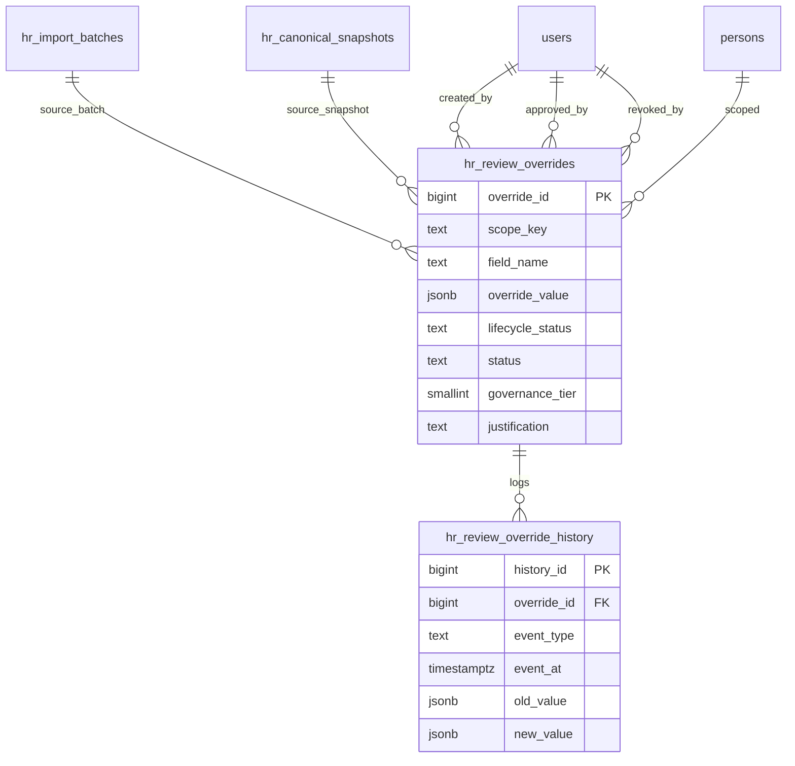
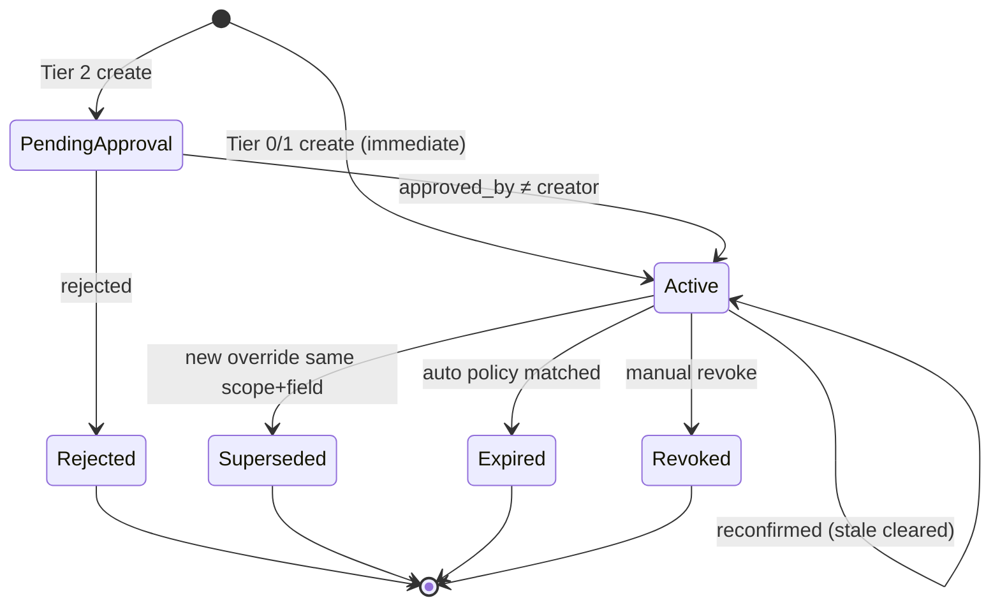

# ADR-043 Phase A.1 — Override Governance

## Статус

**Proposed** (design only; дополнение к [ADR-043 Phase A](./ADR-043-phase-a-personnel-lifecycle.md))

## Дата

2026-06-20

## Связанные документы

| ADR | Связь |
|-----|-------|
| [ADR-043 Phase A — Personnel Lifecycle](./ADR-043-phase-a-personnel-lifecycle.md) | `hr_review_overrides`, Effective Value, persistence policies |
| [ADR-043 Phase B1 — DB Schema Design](./ADR-043-phase-b1-schema-design.md) | DDL, constraints, migration B2 |
| [ADR-033 — Personnel Governance Model](./ADR-033-personnel-governance-model.md) | HR-администратор как владелец кадровых данных; append-only history |
| [ADR-035 — HR Transfer Approval](./ADR-035-hr-transfer-approval-and-event-voiding.md) | образец lifecycle workflow (REQUESTED → APPROVED → VOIDED) |
| [ADR-040 — Canonical HR Snapshot & Monthly Diff](./ADR-040-canonical-hr-snapshot-monthly-diff.md) | batch review, `_canonical_correction_fields`, CONFLICT |
| [ADR-037 — Employee Documents Registry](./ADR-037-employee-documents-registry.md) | normalized records: education, certificates, training |

> **Scope:** жизненный цикл review overrides, audit trail, сравнение «простая модель» vs «полный workflow». Код, миграции, API и UI **не создаются**.

---

## Context

ADR-043 Phase A вводит persistent-слой **`hr_review_overrides`** — коррекции, независимые от import batch, участвующие в Effective Canonical при monthly diff.

Phase A описывает **что** хранить и **когда** override снимается, но не формализует:

- кто и на каком основании принял решение;
- нужно ли отдельное утверждение до вступления override в силу;
- как восстановить полную историю изменения (особенно ИИН, специальности, категории, образования, сертификатов, обучения);
- когда override считается **устаревшим** с точки зрения governance, а не только diff-engine.

Phase A.1 закрывает этот gap.

---

## Problem Statement

| Gap | Риск |
|-----|------|
| Override без provenance | Невозможно ответить «почему в реестре другой ИИН» |
| Нет разделения «создал» vs «утвердил» | Один оператор меняет identity без контроля |
| История только через `status` на текущей строке | При supersede теряется цепочка значений |
| «Устаревший» = только auto-expire | Нет governance-expiry (документ истёк, категория снята) |
| Batch promotion = implicit approve | Не зафиксировано, кто подтвердил override при promotion |

---

## Governance Questions — Answers

### 1. Кто создал override?

| Поле | Источник |
|------|----------|
| `created_by_user_id` | Пользователь, сохранивший коррекцию в Review UI или Overrides UI |
| `created_by_role` | Denormalized snapshot роли на момент создания (audit; optional) |

**Правило:** `created_by_user_id` **никогда не меняется** после INSERT. Последующие правки — новая запись override (supersede) или event в history.

**Кто может создавать:** HR-администратор с access `hr_import` ≥ MANAGER (ADR-033). Sysadmin **не** создаёт HR canonical overrides.

### 2. Когда создан?

| Поле | Семантика |
|------|-----------|
| `created_at` | TIMESTAMPTZ первого persist в `hr_review_overrides` |

**Два момента времени (важно различать):**

| Moment | Storage | Meaning |
|--------|---------|---------|
| **Draft save** | Batch-scoped `review_override` / row edit timestamp | Работа в сессии review; может не попасть в persistent layer |
| **Persist** | `hr_review_overrides.created_at` | Override стал частью Effective Canonical layer |

Persistent override создаётся при:

1. явном «Save override» в Review UI; **или**
2. promotion batch → snapshot (materialize corrections from batch); **или**
3. ручном создании в Overrides registry.

### 3. На основании чего создан?

Provenance bundle — **обязательный минимум** для Tier 1+ полей:

| Field | Column / artifact | Description |
|-------|-------------------|-------------|
| Import context | `source_batch_id` FK | Batch, в котором обнаружено расхождение |
| Row context | `source_row_id` / `source_normalized_record_id` | Конкретная строка staging |
| Snapshot baseline | `source_snapshot_id` FK | Active snapshot на момент diff |
| Diff evidence | `basis_diff` JSONB | `{ field, canonical_value, incoming_value, diff_status }` |
| Operator rationale | `justification` TEXT | Свободный текст; **required** Tier 1+ |
| External evidence | `evidence_url` TEXT NULL | Ссылка на скан приказа, выписку, письмо кадровиков |
| Creation channel | `creation_channel` TEXT | `review_ui` \| `promotion_materialize` \| `override_registry` \| `identity_correction` |

```json
{
  "field": "iin",
  "canonical_value": "123456789012",
  "incoming_value": "123456789011",
  "diff_status": "CONFLICT",
  "canonical_entry_id": 8842,
  "canonical_hash": "a1b2…"
}
```

**Правило integrity:** override без `source_batch_id` допустим только для `creation_channel = override_registry` (ручная коррекция вне импорта) — тогда `justification` **обязателен** всегда.

### 4. Кто утвердил?

Зависит от **governance tier** поля (см. § Recommendation). Три режима:

| Mode | `approved_by_user_id` | Когда заполняется |
|------|----------------------|-------------------|
| **Implicit** (Tier 0) | = `created_by_user_id` OR `promoted_by` snapshot | При persist / promotion |
| **Self-attest** (Tier 1) | = `created_by_user_id`; `approved_at = created_at` | При persist; justification required |
| **Explicit approval** (Tier 2) | Отдельный HR user ≠ creator | После action Approve Override |

| Поле | Notes |
|------|-------|
| `approved_by_user_id` | NULL пока `lifecycle_status = pending_approval` |
| `approved_at` | TIMESTAMPTZ вступления в `active` |
| `approval_comment` | TEXT NULL — комментарий утверждающего |

**Promotion batch как collective approve:** при materialize overrides на promotion snapshot:

```text
approved_by_user_id = hr_canonical_snapshots.promoted_by
approved_at         = hr_canonical_snapshots.promoted_at
```

для всех overrides, materialized из этого batch (если не Tier 2 pending).

### 5. Кто отменил?

| Action | Fields | Actor |
|--------|--------|-------|
| **Revoke** (ручная отмена) | `revoked_by_user_id`, `revoked_at`, `revoke_reason` | HR-администратор MANAGER+ |
| **Supersede** (замена новым override) | history event; old row `superseded_by_override_id` | Creator нового override |
| **Expire** (auto) | history event; `expired_at`, `expire_reason` | System (diff engine / policy job) |
| **Reject** (Tier 2 only) | `rejected_by_user_id`, `rejected_at` | Approver |

**Revoke ≠ DELETE.** Строка остаётся; `status → revoked`; Effective Value перестаёт учитывать override.

**Void after approve (Tier 2):** допускается `revoked_by_user_id` с обязательным `revoke_reason` и записью в history — аналог ADR-035 VOIDED.

### 6. Когда override считается устаревшим?

Два независимых понятия:

#### A. Technical expiry (diff layer — из ADR-043 Phase A)

| Condition | Result |
|-----------|--------|
| `persistence_policy = until_incoming_matches` и incoming == override | `status → expired` |
| Assignment closed | assignment-scoped overrides → `expired` |
| Superseded by newer override | `status → superseded` |

#### B. Governance stale (Phase A.1)

Override **остаётся active** для diff, но помечается **`stale_flag = true`** для operator attention:

| Stale reason | Typical fields | Detection |
|--------------|----------------|-----------|
| `document_expired` | certificates, training | `expiry_date` in override_value < today |
| `category_lapsed` | category | external rule / manual review cycle |
| `no_reconfirmation` | IIN, identity | `active` longer than `max_age_days` without reconfirm |
| `source_system_corrected` | any | incoming matched but override kept (manual_only_revoke) — informational |
| `superseded_snapshot` | any | canonical snapshot re-activated to older version |

| Field | Type | Notes |
|-------|------|-------|
| `stale_flag` | BOOLEAN DEFAULT FALSE | Does **not** remove from Effective Value |
| `stale_reason` | TEXT NULL | |
| `stale_since` | TIMESTAMPTZ NULL | |
| `last_reconfirmed_at` | TIMESTAMPTZ NULL | Operator acknowledged still valid |
| `last_reconfirmed_by_user_id` | BIGINT NULL | |

**Правило:** governance stale **не** auto-revokes override (кроме явной policy Tier 0 training docs — optional Phase C). HR must reconfirm or revoke.

#### Summary: «устаревший» vs «снятый»

| Term | `status` | В Effective Value? | UI |
|------|----------|-------------------|-----|
| **Active, fresh** | `active` | Да | Green / normal |
| **Active, stale** | `active`, `stale_flag=true` | Да | Amber «требует переподтверждения» |
| **Expired** | `expired` | Нет | History only |
| **Revoked** | `revoked` | Нет | History only |
| **Superseded** | `superseded` | Нет | History chain |

---

## Data Model

### Evolved `hr_review_overrides`

Phase A columns **сохраняются**. Phase A.1 **добавляет** governance fields:

| Column | Type | Notes |
|--------|------|-------|
| `created_by_user_id` | BIGINT NOT NULL FK → users | Renaming alias of Phase A `created_by` |
| `created_at` | TIMESTAMPTZ NOT NULL | |
| `justification` | TEXT NULL | Required Tier 1+; required always for `override_registry` channel |
| `evidence_url` | TEXT NULL | Optional Tier 1; encouraged Tier 2 |
| `basis_diff` | JSONB NULL | Provenance snapshot (§3) |
| `creation_channel` | TEXT NOT NULL | |
| `lifecycle_status` | TEXT NOT NULL | See state machine § |
| `approved_by_user_id` | BIGINT NULL FK → users | |
| `approved_at` | TIMESTAMPTZ NULL | |
| `approval_comment` | TEXT NULL | |
| `rejected_by_user_id` | BIGINT NULL FK → users | Tier 2 only |
| `rejected_at` | TIMESTAMPTZ NULL | |
| `reject_reason` | TEXT NULL | |
| `revoked_by_user_id` | BIGINT NULL FK → users | |
| `revoked_at` | TIMESTAMPTZ NULL | |
| `revoke_reason` | TEXT NULL | Required on manual revoke |
| `expired_at` | TIMESTAMPTZ NULL | System expiry |
| `expire_reason` | TEXT NULL | `incoming_matched` \| `assignment_closed` \| … |
| `governance_tier` | SMALLINT NOT NULL | 0 \| 1 \| 2 — frozen at creation |
| `stale_flag` | BOOLEAN NOT NULL DEFAULT FALSE | |
| `stale_reason` | TEXT NULL | |
| `stale_since` | TIMESTAMPTZ NULL | |
| `last_reconfirmed_at` | TIMESTAMPTZ NULL | |
| `last_reconfirmed_by_user_id` | BIGINT NULL FK → users | |

**`status` vs `lifecycle_status`:**

| Column | Purpose |
|--------|---------|
| `lifecycle_status` | Workflow: `draft` \| `pending_approval` \| `active` \| `rejected` |
| `status` | Terminal/effective: `active` \| `superseded` \| `expired` \| `revoked` |

Mapping:

```text
Effective override ≡ lifecycle_status = 'active' AND status = 'active'
```

Draft lives in batch staging only — **не** в `hr_review_overrides` (avoid orphan rows).

### Override History — `hr_review_override_history`

**Append-only.** Физический DELETE запрещён (ADR-033).

| Column | Type | Notes |
|--------|------|-------|
| `history_id` | BIGINT PK | |
| `override_id` | BIGINT NOT NULL FK → hr_review_overrides | |
| `event_type` | TEXT NOT NULL | See catalog § |
| `event_at` | TIMESTAMPTZ NOT NULL DEFAULT now() | |
| `actor_user_id` | BIGINT NULL FK → users | NULL = system |
| `field_name` | TEXT NOT NULL | |
| `old_value` | JSONB NULL | Value before event |
| `new_value` | JSONB NULL | Value after event |
| `justification` | TEXT NULL | |
| `evidence_url` | TEXT NULL | |
| `basis_diff` | JSONB NULL | |
| `source_batch_id` | BIGINT NULL FK | |
| `source_snapshot_id` | BIGINT NULL FK | |
| `metadata` | JSONB NULL | `{ expire_reason, stale_reason, superseded_by_override_id, … }` |

**Event catalog:**

| `event_type` | Trigger |
|--------------|---------|
| `CREATED` | First persist |
| `VALUE_CHANGED` | Superseding override with different value |
| `SUBMITTED_FOR_APPROVAL` | Tier 2: draft → pending |
| `APPROVED` | Explicit or promotion approve |
| `REJECTED` | Tier 2 reject |
| `RECONFIRMED` | Operator cleared stale_flag |
| `MARKED_STALE` | Governance job / manual |
| `EXPIRED` | Auto-expire policy |
| `REVOKED` | Manual revoke |
| `SUPERSEDED` | Replaced by new override_id |
| `SCOPE_MIGRATED` | Person merge / match_key change |

**Recovery guarantee:**

```text
For any (scope_key, field_name, point_in_time T):
  replay history events where event_at <= T order by event_at, history_id
  → reconstructor yields effective override value at T
```

Snapshot entries (`hr_canonical_snapshots`) остаются независимым point-in-time proof; history — fine-grained override trail **между** snapshots.



---

## Lifecycle State Machine



**Tier 2 pending:** override **не** участвует в Effective Value до `APPROVED`. Diff continues using prior effective (canonical or previous active override). UI shows «pending identity correction».

---

## Field Governance Tiers

| Tier | Fields | Create flow | Approval | Justification | Evidence | History |
|------|--------|-------------|----------|---------------|----------|---------|
| **0** | `note_raw`, display-only corrections | Immediate active | Implicit (= creator) | Optional | No | Standard |
| **1** | **Специальность**, **категория**, **образование**, **сертификаты**, **обучение**; `position_raw`, `department` | Immediate active | Self-attest | **Required** | Recommended | **Full** |
| **2** | **ИИН**, `birth_date`, `full_name` (identity) | → `pending_approval` | **Explicit** second user | **Required** | **Required** for IIN | **Full + immutable chain** |

### Tier 1 — normalized record fields (detail)

| record_kind | field examples | Stale detection |
|-------------|----------------|-----------------|
| `medical_specialty` | `medical_specialty_id`, title | Manual review every 36 mo (config) |
| `category` | category code, title | `expiry_date` if present |
| `education` | degree, institution, document_number | Rare stale |
| `certificate` | title, document_number, `expiry_date` | `document_expired` |
| `training` | title, hours, `issue_date` | Optional refresh policy |

### Tier 2 — identity correction rules

1. Creator **≠** approver (different `user_id`).
2. `evidence_url` or attached document reference **mandatory** for IIN.
3. On approve: emit `IDENTITY_CHANGED` personnel event (ADR-043).
4. Optional: `person_identity_history` row (Phase C).
5. Revoke Tier 2 override: requires `revoke_reason` ≥ 20 chars; history `REVOKED`.

---

## Architecture Options

### Option A — Simple Model (single-phase)

**Description:** Override active immediately when operator saves in Review. Audit via append-only history. Approval = batch promotion or self-attest.

```text
Review save → hr_review_overrides (active) → history CREATED
Promotion   → approved_by = promoted_by (batch-level)
Revoke      → status revoked + history REVOKED
```

| Pros | Cons |
|------|------|
| Минимальная friction для HR monthly workflow | Нет segregation of duties для ИИН |
| Совместим с ADR-040 review UX | «Кто утвердил» размыто для полей Tier 1 |
| Быстрая реализация Phase B | Compliance risk на identity |

**Подходит если:** один HR-администратор на организацию; identity errors редки; audit trail достаточен post-factum.

### Option B — Full Override Workflow

**Description:** Каждый override проходит REQUESTED → APPROVED → (optional VOID). Ни один override не active без второго пользователя.

```text
Review save → pending_approval → approve → active → history
```

| Pros | Cons |
|------|------|
| Строгий контроль всех corrections | ~500–2000 overrides/year → approval fatigue |
| Чёткое «кто утвердил» | Blocks monthly import on pending queue |
| Segregation of duties | Два HR online для каждого поля training |

**Подходит если:** крупная организация, несколько HR, compliance audit ISO/SOX.

### Option C — Tiered Hybrid (рекомендуется)

**Description:** Combine A + B by field tier.

| Tier | Model |
|------|-------|
| 0 | Simple — immediate active |
| 1 | Simple + mandatory justification + full history + stale reconfirm |
| 2 | Full workflow — pending → explicit approve |

Promotion batch:

- Materializes Tier 0/1 overrides as **active** with `approved_by = promoted_by`.
- Materializes Tier 2 only if already **approved**; otherwise blocks promotion with checklist.

| Pros | Cons |
|------|------|
| 95% corrections — zero extra clicks | Two models to explain in runbook |
| Identity protected | Tier 2 pending blocks promotion (intentional) |
| Full history for audit-sensitive fields | Tier boundaries need maintenance |
| Aligns ADR-033 (HR owns data) + ADR-035 pattern | Approver availability for IIN |

---

## Recommendation

### Принять **Option C — Tiered Hybrid**

1. **`hr_review_overrides`** — current-state row with governance columns (§ Data Model).
2. **`hr_review_override_history`** — append-only; **every** create/change/approve/revoke/expiry/stale event.
3. **Immediate active** для Tier 0/1; **pending_approval** для Tier 2 identity.
4. **Justification required** для Tier 1+ (специальность, категория, образование, сертификаты, обучение, identity).
5. **Promotion gate:** batch cannot promote if Tier 2 overrides in same batch are unresolved pending.
6. **Stale ≠ expired:** stale flags operator review; only revoke/expire removes from Effective Value.
7. **Recovery:** history replay + canonical snapshots = complete audit for any field at any date.

### Mapping to six questions (quick reference)

| # | Question | Answer (Hybrid) |
|---|----------|-----------------|
| 1 | Кто создал? | `created_by_user_id` |
| 2 | Когда? | `created_at` |
| 3 | На основании чего? | `source_batch_id` + `basis_diff` + `justification` + optional `evidence_url` |
| 4 | Кто утвердил? | Tier 0/1: `promoted_by` or self; Tier 2: `approved_by_user_id ≠ created_by_user_id` |
| 5 | Кто отменил? | `revoked_by_user_id` + `revoke_reason`; or system expire |
| 6 | Когда устарел? | `expired_at` (technical) or `stale_since` (governance) — см. §6 |

### HR Operations UI additions (functional)

| Screen | Functions |
|--------|-----------|
| Override detail | Show creator, approver, justification, evidence link, history timeline |
| Pending approvals (Tier 2) | Queue for HR head; approve/reject |
| Stale overrides dashboard | Filter `stale_flag=true`; bulk reconfirm |
| History replay | Select date → effective override value reconstructor (read-only) |
| Promotion blocker | List unresolved Tier 2 pending before snapshot promote |

---

## Risks

| Risk | Mitigation |
|------|------------|
| Tier 2 blocks monthly close | Escalation notify; acting approver delegate (Phase C) |
| History table growth | ~3–5 events/override × 2K overrides ≈ 10K rows — negligible |
| Creator = approver bypass | DB constraint Tier 2: `approved_by_user_id <> created_by_user_id` |
| evidence_url link rot | Store `evidence_ref` to document registry (ADR-037) Phase C |
| Stale ignored | Report in monthly HR ops review; not auto-revoke by default |

---

## Implementation Phases (future — not A.1 scope)

| Phase | Deliverable |
|-------|-------------|
| B1.1 | DDL: governance columns + `hr_review_override_history` |
| B2.1 | Override service: tier rules, history writer |
| B2.2 | Promotion gate for Tier 2 pending |
| B3.1 | Stale detection job (cert/training expiry) |
| B5.1 | Overrides UI: history timeline, pending queue |

---

## Out of Scope

- Code, migrations, API, UI components
- Changes to `employee_import_profile_overrides` (operational contour)
- Digital signature / qualified e-sign

---

## Success Criteria (Phase A.1)

1. ✅ Шесть governance-вопросов answered with concrete fields.
2. ✅ `hr_review_overrides` governance columns specified.
3. ✅ Append-only `hr_review_override_history` with recovery guarantee.
4. ✅ Tier rules for IIN, specialty, category, education, certificates, training.
5. ✅ Simple vs Full vs Hybrid compared; **Tiered Hybrid** recommended.
6. ✅ Stale vs expired distinction defined.
