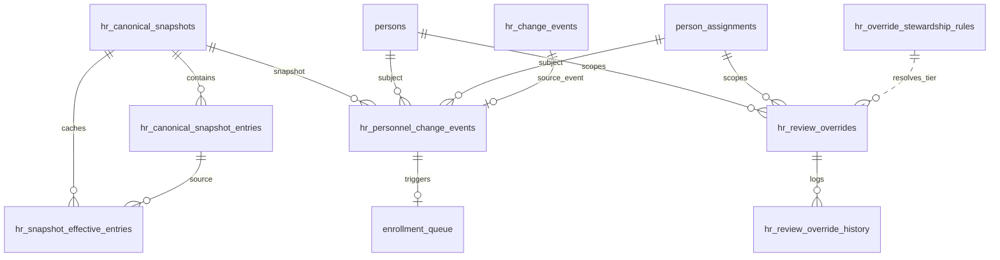

# ADR-043 Phase B1 — DB Schema Design for Personnel Lifecycle

## Статус

**Implemented** (Phase B2 migration `x6y7z8a9b0c1` — see [B2 Migration Note](./ADR-043-phase-b2-migration-note.md))

## Дата

2026-06-20

## Связанные документы

| ADR | Связь |
|-----|-------|
| [ADR-043 Phase A — Personnel Lifecycle](./ADR-043-phase-a-personnel-lifecycle.md) | Effective Canonical, diff events, hybrid snapshots |
| [ADR-043 Phase A.1 — Override Governance](./ADR-043-phase-a1-override-governance.md) | tiers, history, stale vs expired |
| [ADR-042 Phase B1 — DB Schema Design](./ADR-042-phase-b1-schema-design.md) | `persons`, `person_assignments`, `enrollment_queue` |
| [ADR-040 — Canonical HR Snapshot & Monthly Diff](./ADR-040-canonical-hr-snapshot-monthly-diff.md) | snapshots, diff columns, `hr_change_events` |
| [ADR-041 — Dual Personnel Registry Model](./ADR-041-dual-personnel-registry-model.md) | два контура; не ломать operational |
| [ADR-038/039 — HR Import](./ADR-038-employee-identity-hr-import-architecture.md) | staging, normalized records |

## Принятые решения (наследуются из Phase A / A.1)

| # | Решение |
|---|---------|
| 1 | Effective Canonical = Approved Snapshot + **Active** Review Overrides |
| 2 | Monthly snapshots = **Hybrid**: full `hr_canonical_snapshots` + derived assignment-centric events |
| 3 | Overrides persistent, scope-based, independent from batch |
| 4 | Override governance = **Tiered Hybrid** (0 / 1 / 2) |
| 5 | `expired` ≠ `stale`: expired не участвует в Effective Value; stale остаётся active |
| 6 | Assignment-centric events → `enrollment_queue` (ADR-042) |
| 7 | `hr_change_events` (ADR-040) **сохраняется**; не удалять, не мигрировать |

---

## Existing Schema Audit

### Таблицы из запроса — фактическое состояние

| Table (requested) | Actual in DB | Status |
|-------------------|--------------|--------|
| `hr_import_batches` | ✅ exists | Core staging lifecycle |
| `hr_import_rows` | ✅ exists | + diff columns (ADR-040 B) |
| `hr_import_normalized_records` | ✅ exists | + diff + `review_override_json` (ADR-039 3F.3) |
| `hr_import_snapshots` | ❌ **не существует** | Legacy naming; use **`hr_canonical_snapshots`** |
| `hr_import_snapshot_entries` | ❌ **не существует** | Use **`hr_canonical_snapshot_entries`** |
| `hr_change_events` | ✅ exists | ADR-040 Phase F; entry-level journal |
| `persons` | ✅ exists | ADR-042 B2.1 |
| `person_assignments` | ✅ exists | ADR-042 B2.1 |
| `enrollment_queue` | ✅ exists | FK → `hr_change_events.change_event_id` |
| `enrollment_history` | ✅ exists | Append-only enrollment audit |

### Дополнительные таблицы, релевантные ADR-043

| Table | Role | Reuse for B1 |
|-------|------|--------------|
| `hr_canonical_snapshots` | Versioned approved snapshot | **Baseline** for Effective Canonical |
| `hr_canonical_snapshot_entries` | Materialized entries + `payload` JSONB | Canonical Value source; `_canonical_correction_fields` in payload |
| `hr_import_diff_removals` | REMOVED rows per batch | Unchanged; diff layer |
| `employee_import_profile_overrides` | Operational employee profile | **Separate contour** (ADR-041); not migrated to `hr_review_overrides` |
| `hr_import_rows.profile_override` | Batch-scoped roster profile | Staging only; backfill source |
| `access_grants` / `access_roles` | Sysadmin access (ADR-042) | Orthogonal; not primary stewardship model |

### Что переиспользовать без изменений

| Artifact | Reason |
|----------|--------|
| `hr_canonical_snapshots` / `entries` | Active snapshot = canonical layer |
| `hr_import_batches` / `rows` / `normalized_records` | Staging + diff_status pipeline |
| `hr_change_events` | HR export, existing UI, enrollment FK |
| `persons` / `person_assignments` | Assignment-centric target for person sync |
| `enrollment_queue` / `enrollment_history` | Extend with new FK only |
| `match_key` on persons / snapshot entries | Stable join for overrides and events |
| `assignment_key` on person_assignments | Dedup within person |

### Что нельзя ломать

| Constraint | Impact if broken |
|------------|------------------|
| `uq_hr_canonical_snapshots_active_source_type` | Only one active snapshot |
| `uq_hcs_entries_snapshot_match_key` | Diff index integrity |
| `uq_hr_change_events_snapshot_pair_dedup` | Existing change event materialization |
| `enrollment_queue.change_event_id` FK | Running enrollment detector |
| `uq_eq_idempotency_active` | Duplicate queue prevention |
| `employee_import_profile_overrides` | Operational Карта2 / sync package |
| `_canonical_correction_fields` in snapshot payload | ADR-040 CONFLICT detection until backfill complete |

### Legacy / batch-scoped override fields (backfill sources)

| Location | Column | Scope | B1 action |
|----------|--------|-------|-----------|
| `hr_import_normalized_records` | `review_override_json`, `review_override_updated_by/at` | Batch record | Backfill → `hr_review_overrides` on B2.3 |
| `hr_import_rows` | `profile_override` (via education profile staging) | Batch row | Backfill roster corrections |
| `hr_canonical_snapshot_entries.payload` | `_canonical_correction_fields[]` | Materialized at promotion | Backfill active snapshot corrections |
| `employee_import_profile_overrides` | `profile_override` | Operational employee | **Do not migrate** |

### FK graph available for new tables

```text
users(user_id)
  ← hr_import_batches.imported_by
  ← hr_canonical_snapshots.promoted_by
  ← enrollment_queue.resolved_by_user_id
  ← (new) hr_review_overrides.created_by_user_id, approved_by, revoked_by

hr_import_batches(batch_id)
  ← hr_canonical_snapshots.source_batch_id
  ← hr_import_rows.batch_id
  ← (new) hr_review_overrides.source_batch_id

hr_canonical_snapshots(snapshot_id)
  ← hr_canonical_snapshot_entries.snapshot_id
  ← hr_change_events.prior/new_snapshot_id
  ← persons.canonical_snapshot_id
  ← (new) hr_review_overrides.source_snapshot_id
  ← (new) hr_personnel_change_events.snapshot_id / previous_snapshot_id
  ← (new) hr_snapshot_effective_entries.snapshot_id

persons(person_id)
  ← person_assignments.person_id
  ← enrollment_queue.person_id
  ← (new) hr_review_overrides.scope_id (when scope_type=PERSON)
  ← (new) hr_personnel_change_events.person_id

person_assignments(assignment_id)
  ← enrollment_queue.assignment_id
  ← (new) hr_review_overrides.scope_id (when scope_type=ASSIGNMENT)
  ← (new) hr_personnel_change_events.assignment_id

hr_canonical_snapshot_entries(entry_id)
  ← hr_change_events.prior/new_entry_id
  ← enrollment_queue.canonical_entry_id
  ← person_assignments.canonical_entry_id

hr_change_events(change_event_id)
  ← enrollment_queue.change_event_id
  ← (new) hr_personnel_change_events.source_event_id (optional link)

hr_review_overrides(override_id)
  ← hr_review_override_history.override_id
  ← hr_snapshot_effective_entries.override_ids (JSONB array)
```

### Gaps to close in B2 (not in DB yet)

| Planned (Phase A) | B1 design |
|-------------------|-----------|
| `hr_source_files` | Include in B2.1 DDL (provenance for batches) |
| `hr_review_overrides` | **New** |
| `hr_review_override_history` | **New** |
| `hr_personnel_change_events` | **New** |
| `hr_snapshot_effective_entries` | **New** (active snapshot cache only) |
| `hr_override_stewardship_rules` | **New** |
| `enrollment_queue.personnel_event_id` | **ALTER** in B2.1 |

---

## Proposed Tables

### Naming conventions (inherit ADR-042 B1)

| Rule | Value |
|------|-------|
| Schema | `public` |
| PK | `{entity}_id BIGINT GENERATED ALWAYS AS IDENTITY` |
| Timestamps | `TIMESTAMPTZ NOT NULL DEFAULT now()` |
| Enums | `TEXT` + `CHECK` (no Postgres ENUM) |
| JSONB | Values, payloads, metadata, `basis_diff` |
| Keys | `person_key` = `persons.match_key`; `assignment_key` = `person_assignments.assignment_key` |

---

### 1. `hr_source_files` (B2.1 — provenance)

| Column | Type | Notes |
|--------|------|-------|
| `source_file_id` | BIGINT PK | |
| `content_sha256` | TEXT NOT NULL | Dedup |
| `original_filename` | TEXT NOT NULL | |
| `report_month` | DATE NOT NULL | First day of month |
| `source_system` | TEXT NOT NULL DEFAULT `'HR_CONTROL_LIST'` | |
| `byte_size` | BIGINT NOT NULL | |
| `storage_ref` | TEXT NOT NULL | Object path |
| `uploaded_by_user_id` | BIGINT NOT NULL FK → users | |
| `uploaded_at` | TIMESTAMPTZ NOT NULL | |

**Alter:** `hr_import_batches ADD source_file_id BIGINT NULL FK`.

---

### 2. `hr_review_overrides`

Persistent manual corrections; **draft** lives in batch staging only — **not** in this table.

| Column | Type | Null | Notes |
|--------|------|------|-------|
| `override_id` | BIGINT PK | | |
| `scope_type` | TEXT | NOT NULL | See § Enum Values |
| `scope_id` | BIGINT | NULL | Resolved FK id (person_id, assignment_id, normalized_record_id) |
| `scope_key` | TEXT | NOT NULL | Stable logical key for uniqueness |
| `person_key` | TEXT | NULL | Denormalized `persons.match_key` |
| `assignment_key` | TEXT | NULL | Denormalized when assignment-scoped |
| `person_id` | BIGINT FK → persons | NULL | Query index |
| `assignment_id` | BIGINT FK → person_assignments | NULL | Query index |
| `normalized_record_id` | BIGINT FK → hr_import_normalized_records | NULL | Provenance; SET NULL on delete |
| `record_kind` | TEXT | NULL | training \| certificate \| … |
| `field_path` | TEXT | NOT NULL | Dot-path; see § field_path format |
| `canonical_value` | JSONB | NULL | Snapshot value at creation |
| `override_value` | JSONB | NOT NULL | Corrected value |
| `tier` | SMALLINT | NOT NULL | 0 \| 1 \| 2 |
| `owner_domain` | TEXT | NOT NULL | From stewardship rules |
| `status` | TEXT | NOT NULL | Workflow + terminal; see § |
| `stale_flag` | BOOLEAN | NOT NULL DEFAULT FALSE | Governance stale (A.1) |
| `stale_reason` | TEXT | NULL | |
| `stale_since` | TIMESTAMPTZ | NULL | |
| `last_reconfirmed_at` | TIMESTAMPTZ | NULL | |
| `last_reconfirmed_by_user_id` | BIGINT FK → users | NULL | |
| `expired_at` | TIMESTAMPTZ | NULL | Technical expiry |
| `expire_reason` | TEXT | NULL | `incoming_matched` \| `assignment_closed` \| … |
| `persistence_policy` | TEXT | NOT NULL | `until_incoming_matches` \| `manual_only_revoke` |
| `created_by_user_id` | BIGINT | NOT NULL FK → users | |
| `created_at` | TIMESTAMPTZ | NOT NULL | |
| `creation_channel` | TEXT | NOT NULL | `review_ui` \| `promotion_materialize` \| `override_registry` \| `backfill` |
| `justification` | TEXT | NULL | Required tier ≥ 1 (app layer + CHECK) |
| `evidence_url` | TEXT | NULL | Required tier 2 IIN (app layer + validation query) |
| `source_batch_id` | BIGINT FK → hr_import_batches | NULL | ON DELETE SET NULL |
| `source_row_id` | BIGINT FK → hr_import_rows | NULL | |
| `source_normalized_record_id` | BIGINT FK → hr_import_normalized_records | NULL | |
| `source_snapshot_id` | BIGINT FK → hr_canonical_snapshots | NULL | |
| `basis_diff` | JSONB | NULL | `{ field_path, canonical, incoming, diff_status }` |
| `approved_by_user_id` | BIGINT FK → users | NULL | Tier 2 explicit; else promoter |
| `approved_at` | TIMESTAMPTZ | NULL | |
| `approval_comment` | TEXT | NULL | |
| `rejected_by_user_id` | BIGINT FK → users | NULL | |
| `rejected_at` | TIMESTAMPTZ | NULL | |
| `reject_reason` | TEXT | NULL | |
| `revoked_by_user_id` | BIGINT FK → users | NULL | |
| `revoked_at` | TIMESTAMPTZ | NULL | |
| `revoke_reason` | TEXT | NULL | Required on manual revoke (app) |
| `superseded_by_override_id` | BIGINT FK self | NULL | |
| `superseded_at` | TIMESTAMPTZ | NULL | |
| `metadata` | JSONB | NOT NULL DEFAULT `'{}'` | Extensibility |

**Not stored:** `effective_value` — computed at read: `coalesce(override_value if status active/pending rules, canonical_value)`.

#### `scope_key` format

| scope_type | scope_key pattern |
|------------|-------------------|
| `PERSON` | `person:{person_id}` or `match:{match_key}` before person resolved |
| `ASSIGNMENT` | `assignment:{assignment_id}` or `person:{person_key}|assign:{assignment_key}` |
| `ROSTER_ENTRY` | `match:{match_key}|roster` |
| `TRAINING` | `norm:{match_key}|training|{source_record_key}` |
| `CERTIFICATE` | `norm:{match_key}|certificate|{source_record_key}` |
| `CATEGORY` | `norm:{match_key}|category|{source_record_key}` |
| `EDUCATION` | `norm:{match_key}|education|{source_record_key}` |
| `DOCUMENT` | `norm:{match_key}|document|{source_record_key}` |

#### `field_path` format

Dot-notation, stable across diff/hash:

```text
identity.iin
identity.full_name
identity.birth_date
roster.org_unit_id
roster.position_id
roster.position_raw
roster.rate
roster.department
training.title
training.hours
training.issue_date
training.expiry_date
certificate.title
certificate.document_number
certificate.expiry_date
category.code
category.title
education.degree
education.institution
education.document_number
specialty.medical_specialty_id
```

**Rule:** one override row = one `field_path` leaf value (scalar or small JSON object for composite fields like `{org_unit_id, department}` only when treated as atomic correction).

#### `evidence_url` validation

| Layer | Feasibility |
|-------|-------------|
| DB CHECK | Only `length(trim(evidence_url)) > 0` when tier=2 and field_path=`identity.iin` — **optional** weak CHECK |
| App / validation SQL | HTTPS URL pattern OR internal `document://{employee_document_id}` OR `storage://{ref}` |
| Phase C | FK to `employee_documents` via `metadata.evidence_document_id` |

DB cannot fully validate URL reachability; **validation query** in § Validation Plan.

---

### 3. `hr_review_override_history`

Append-only; **no UPDATE/DELETE** (enforce via app + optional trigger).

| Column | Type | Notes |
|--------|------|-------|
| `history_id` | BIGINT PK | |
| `override_id` | BIGINT NOT NULL FK → hr_review_overrides ON DELETE RESTRICT | |
| `event_type` | TEXT NOT NULL | See § Enum Values |
| `actor_user_id` | BIGINT NULL FK → users | NULL = system |
| `happened_at` | TIMESTAMPTZ NOT NULL DEFAULT now() | |
| `from_status` | TEXT | NULL | Prior status |
| `to_status` | TEXT | NULL | New status |
| `field_path` | TEXT NOT NULL | |
| `old_value` | JSONB | NULL | |
| `new_value` | JSONB | NULL | |
| `reason` | TEXT | NULL | Justification / revoke / expire reason |
| `evidence_url` | TEXT | NULL | Snapshot at event time |
| `basis_diff` | JSONB | NULL | |
| `source_batch_id` | BIGINT NULL FK | |
| `source_snapshot_id` | BIGINT NULL FK | |
| `metadata` | JSONB NOT NULL DEFAULT `'{}'` | `{ stale_reason, superseded_by_override_id, … }` |

**Recovery:** replay `happened_at ASC, history_id ASC` for `(scope_key, field_path)` → Effective Value @ T.

Every mutating action on `hr_review_overrides` **must** insert exactly one history row in same transaction.

---

### 4. `hr_personnel_change_events`

Assignment-centric journal; **supplements** `hr_change_events`.

| Column | Type | Notes |
|--------|------|-------|
| `personnel_event_id` | BIGINT PK | |
| `source_event_id` | BIGINT NULL FK → hr_change_events ON DELETE SET NULL | Optional link to ADR-040 row |
| `previous_snapshot_id` | BIGINT NOT NULL FK → hr_canonical_snapshots | |
| `snapshot_id` | BIGINT NOT NULL FK → hr_canonical_snapshots | New snapshot (N+1) |
| `person_id` | BIGINT NULL FK → persons | |
| `assignment_id` | BIGINT NULL FK → person_assignments | |
| `person_key` | TEXT NOT NULL | |
| `assignment_key` | TEXT | NULL | NULL for person-level events |
| `event_type` | TEXT NOT NULL | See § |
| `field_path` | TEXT | NULL | NULL for aggregate events (NEW_PERSON) |
| `old_value` | JSONB | NULL | Canonical layer |
| `new_value` | JSONB | NULL | |
| `effective_old_value` | JSONB | NULL | After overrides @ prior snapshot |
| `effective_new_value` | JSONB | NULL | After overrides @ new snapshot |
| `event_hash` | TEXT NOT NULL | Idempotency key; sha256 hex |
| `status` | TEXT NOT NULL DEFAULT `'detected'` | See § |
| `detected_at` | TIMESTAMPTZ NOT NULL | = new snapshot promoted_at |
| `resolved_at` | TIMESTAMPTZ | NULL | |
| `resolved_by_user_id` | BIGINT NULL FK → users | |
| `metadata` | JSONB NOT NULL DEFAULT `'{}'` | `{ field_diffs, enrollment_queue_id, … }` |

#### `event_hash` computation (B2 finalized)

```text
event_hash = sha256(
  previous_snapshot_id | snapshot_id | person_key |
  coalesce(assignment_key,'') | event_type |
  coalesce(field_path,'') |
  stable_json(effective_old_value) | stable_json(effective_new_value)
)
```

#### Effective cache invalidation (B2)

| Column | Purpose |
|--------|---------|
| `override_ids` | JSON array of active override_id applied |
| `override_version_hash` | Hash of override ids + updated_at stamps |
| `payload_hash` | sha256(effective_payload) |
| `computed_at` | Last rebuild timestamp |

Cache stale when any active override for scope has `updated_at > computed_at`.

#### Enrollment integration

**Alter `enrollment_queue`:**

```text
ADD personnel_event_id BIGINT NULL
  FK → hr_personnel_change_events(personnel_event_id) ON DELETE SET NULL
```

Keep `change_event_id` for backward compatibility during transition.

| personnel event_type | Auto-enqueue? | enrollment `reason` |
|---------------------|---------------|---------------------|
| `NEW_PERSON` | Yes (if primary assignment) | `NEW_ASSIGNMENT` |
| `NEW_ASSIGNMENT` | Yes | `NEW_ASSIGNMENT` |
| `CLOSED_ASSIGNMENT` | Yes if `employee_assignment_links` active | `REMOVED_ASSIGNMENT` |
| `TERMINATED_PERSON` | Yes if person enrolled | `REMOVED_ASSIGNMENT` |
| `TRANSFER` | Yes if enrolled | `CHANGED_ASSIGNMENT` |
| `POSITION_CHANGED` | Yes if enrolled | `CHANGED_ASSIGNMENT` |
| `RATE_CHANGED` | Optional (config) | `CHANGED_ASSIGNMENT` |
| `DEPARTMENT_CHANGED` | Alias → TRANSFER | `CHANGED_ASSIGNMENT` |
| `FIELD_CHANGED` | No (HR analytics only) | — |
| `OVERRIDE_APPLIED` | No | — |
| `OVERRIDE_EXPIRED` | No | — |

Idempotency key extension:

```text
idempotency_key = 'pe:{personnel_event_id}|{reason}|{assignment_id|person_id}'
```

---

### 5. `hr_snapshot_effective_entries` (active snapshot cache)

Materialized **Effective Canonical** rows for **active snapshot only**.

| Column | Type | Notes |
|--------|------|-------|
| `effective_entry_id` | BIGINT PK | |
| `snapshot_id` | BIGINT NOT NULL FK → hr_canonical_snapshots | |
| `canonical_entry_id` | BIGINT NOT NULL FK → hr_canonical_snapshot_entries | |
| `scope_type` | TEXT NOT NULL | Mirrors entry record_kind / roster |
| `scope_key` | TEXT NOT NULL | Same as override scope_key |
| `person_key` | TEXT | NULL | |
| `assignment_key` | TEXT | NULL | |
| `match_key` | TEXT NOT NULL | From canonical entry |
| `record_kind` | TEXT NOT NULL | |
| `effective_payload` | JSONB NOT NULL | merge(snapshot.payload, active overrides) |
| `payload_hash` | TEXT NOT NULL | sha256 for diff short-circuit |
| `override_ids` | JSONB NOT NULL DEFAULT `'[]'` | Array of override_id applied |
| `computed_at` | TIMESTAMPTZ NOT NULL | |
| `compute_version` | INTEGER NOT NULL DEFAULT 1 | Bump when merge algorithm changes |

**Scope:** one row per `(snapshot_id, match_key)` for active snapshot (~9K rows), not 36 months × history.

---

### 6. `hr_override_stewardship_rules`

| Column | Type | Notes |
|--------|------|-------|
| `rule_id` | BIGINT PK | |
| `field_path_pattern` | TEXT NOT NULL | SQL LIKE or prefix: `identity.%`, `training.%` |
| `scope_type` | TEXT | NULL | NULL = any |
| `owner_domain` | TEXT NOT NULL | HR \| QUALITY \| … |
| `required_tier` | SMALLINT NOT NULL DEFAULT 1 | |
| `requires_evidence` | BOOLEAN NOT NULL DEFAULT FALSE | |
| `requires_second_approval` | BOOLEAN NOT NULL DEFAULT FALSE | Tier 2 |
| `persistence_policy_default` | TEXT NOT NULL | |
| `priority` | SMALLINT NOT NULL DEFAULT 100 | Lower = higher priority |
| `active_flag` | BOOLEAN NOT NULL DEFAULT TRUE | |
| `created_at` | TIMESTAMPTZ NOT NULL | |
| `updated_at` | TIMESTAMPTZ NOT NULL | |

---

## Constraints

### `hr_review_overrides`

```sql
-- Status enum
CHECK (status IN (
  'pending_approval', 'active', 'rejected',
  'expired', 'revoked', 'superseded'
))

-- Tier
CHECK (tier IN (0, 1, 2))

-- Scope type
CHECK (scope_type IN (
  'PERSON', 'ASSIGNMENT', 'ROSTER_ENTRY',
  'TRAINING', 'CERTIFICATE', 'CATEGORY', 'EDUCATION', 'DOCUMENT'
))

-- Owner domain
CHECK (owner_domain IN (
  'HR', 'QUALITY', 'TRAINING_CENTER', 'MEDICAL_ADMIN', 'SYSTEM'
))

-- field_path non-empty
CHECK (length(trim(field_path)) > 0)

-- scope_key non-empty
CHECK (length(trim(scope_key)) > 0)

-- Tier 2 approval segregation (when active)
CHECK (
  tier <> 2
  OR status <> 'active'
  OR approved_by_user_id IS NULL
  OR approved_by_user_id <> created_by_user_id
)

-- Tier 2 pending cannot be "effective" without approval
CHECK (
  status <> 'pending_approval' OR approved_at IS NULL
)

-- Active effective override must be approved (tier 2)
CHECK (
  tier <> 2
  OR status NOT IN ('active')
  OR (approved_by_user_id IS NOT NULL AND approved_at IS NOT NULL)
)

-- Revoked pair
CHECK (
  (status = 'revoked' AND revoked_at IS NOT NULL)
  OR (status <> 'revoked' AND revoked_at IS NULL)
)

-- Superseded pair
CHECK (
  (status = 'superseded' AND superseded_by_override_id IS NOT NULL)
  OR (status <> 'superseded')
)

-- Stale pair
CHECK (NOT stale_flag OR stale_reason IS NOT NULL)

-- Justification for tier >= 1 when active/pending
CHECK (
  tier = 0
  OR status IN ('expired', 'revoked', 'superseded', 'rejected')
  OR (justification IS NOT NULL AND length(trim(justification)) >= 10)
)
```

### Partial unique indexes (critical)

```sql
-- One active effective override per scope + field
CREATE UNIQUE INDEX uq_hro_active_scope_field
  ON hr_review_overrides (scope_key, field_path)
  WHERE status = 'active';

-- One pending replacement at a time (may reference active via supersedes_override_id)
CREATE UNIQUE INDEX uq_hro_pending_scope_field
  ON hr_review_overrides (scope_key, field_path)
  WHERE status = 'pending_approval';
```

> **B2 clarification:** `active` и `pending_approval` — **отдельные** partial uniques. Pending override не участвует в Effective Value до approve. `supersedes_override_id` указывает на active override, который будет superseded при approve pending.

#### `scope_key` format (B2 finalized)

| scope_type | Pattern |
|------------|---------|
| `PERSON` | `PERSON:{person_key}` |
| `ASSIGNMENT` | `ASSIGNMENT:{assignment_key}` |
| `DOCUMENT` | `DOCUMENT:{person_key}:{doc_key}` |
| `TRAINING` | `TRAINING:{person_key}:{training_key}` |
| `CERTIFICATE` | `CERTIFICATE:{person_key}:{certificate_key}` |
| `CATEGORY` | `CATEGORY:{person_key}:{category_key}` |

Enforced by `chk_hro_scope_key_format` CHECK + stewardship seed.

#### `supersedes_override_id`

| Field | Purpose |
|-------|---------|
| `supersedes_override_id` | Pending/active replacement targets prior active override |
| `superseded_by_override_id` | Set on old row when new override supersedes |

```sql
-- One active effective override per scope + field (see partial uniques above)

### `hr_review_override_history`

```sql
CHECK (event_type IN (
  'CREATED', 'VALUE_CHANGED', 'APPROVED', 'REJECTED',
  'RECONFIRMED', 'MARKED_STALE', 'EXPIRED', 'REVOKED',
  'SUPERSEDED', 'SCOPE_MIGRATED'
))
```

No UPDATE/DELETE policies documented; **implemented as trigger** `trg_hroh_append_only` (PostgreSQL RULE DO INSTEAD NOTHING rejected — breaks FK checks on `users` delete).

### `hr_personnel_change_events`

```sql
CHECK (event_type IN (
  'NEW_PERSON', 'TERMINATED_PERSON', 'NEW_ASSIGNMENT', 'CLOSED_ASSIGNMENT',
  'TRANSFER', 'POSITION_CHANGED', 'DEPARTMENT_CHANGED', 'RATE_CHANGED',
  'FIELD_CHANGED', 'OVERRIDE_APPLIED', 'OVERRIDE_EXPIRED'
))

CHECK (status IN (
  'detected', 'acknowledged', 'enrolled', 'ignored', 'superseded'
))

CHECK (length(trim(event_hash)) = 64)
CHECK (length(trim(person_key)) > 0)
CHECK (snapshot_id <> previous_snapshot_id)

-- Unique idempotency
UNIQUE (event_hash)
```

### `hr_snapshot_effective_entries`

```sql
UNIQUE (snapshot_id, match_key)
CHECK (length(trim(payload_hash)) > 0)
```

---

## Indexes

### `hr_review_overrides`

| Index | Columns | Notes |
|-------|---------|-------|
| `uq_hro_active_scope_field` | `(scope_key, field_path)` partial | See above |
| `ix_hro_person_id_active` | `(person_id)` WHERE status IN ('active','pending_approval') | |
| `ix_hro_person_key` | `(person_key)` | |
| `ix_hro_status_tier` | `(status, tier, created_at DESC)` | Pending queue |
| `ix_hro_stale` | `(stale_flag, stale_since)` WHERE stale_flag | |
| `ix_hro_source_batch` | `(source_batch_id)` | |
| `ix_hro_owner_domain` | `(owner_domain, status)` | Stewardship reports |

### `hr_review_override_history`

| Index | Columns |
|-------|---------|
| `ix_hroh_override_id` | `(override_id, happened_at DESC)` |
| `ix_hroh_scope_replay` | `(override_id, happened_at ASC, history_id ASC)` |
| `ix_hroh_event_type` | `(event_type, happened_at DESC)` |

### `hr_personnel_change_events`

| Index | Columns |
|-------|---------|
| `uq_hpe_event_hash` | `(event_hash)` UNIQUE |
| `ix_hpe_snapshot` | `(snapshot_id, detected_at DESC)` |
| `ix_hpe_person` | `(person_id, detected_at DESC)` |
| `ix_hpe_person_key` | `(person_key, detected_at DESC)` |
| `ix_hpe_assignment` | `(assignment_id)` partial |
| `ix_hpe_type_status` | `(event_type, status, detected_at DESC)` |
| `ix_hpe_source_event` | `(source_event_id)` partial |

### `hr_snapshot_effective_entries`

| Index | Columns |
|-------|---------|
| `uq_hsee_snapshot_match` | `(snapshot_id, match_key)` UNIQUE |
| `ix_hsee_payload_hash` | `(snapshot_id, payload_hash)` |
| `ix_hsee_person_key` | `(person_key)` |

### `hr_override_stewardship_rules`

| Index | Columns |
|-------|---------|
| `ix_hosr_lookup` | `(active_flag, scope_type, priority)` |

---

## Enum Values

### `hr_review_overrides.status`

| Value | Effective in diff? | Meaning |
|-------|-------------------|---------|
| `pending_approval` | **No** (Tier 2) | Awaiting second HR approver |
| `active` | **Yes** | Participates in Effective Value |
| `rejected` | No | Tier 2 rejected |
| `expired` | No | Auto policy matched incoming |
| `revoked` | No | Manual revoke |
| `superseded` | No | Replaced by newer override_id |

> **`draft`** — только batch staging (`review_override_json`, row edits). Не персистируется в `hr_review_overrides`.

### `hr_review_overrides.tier`

| Tier | Approval | Justification | Evidence |
|------|----------|---------------|----------|
| 0 | Implicit | Optional | No |
| 1 | Self-attest | Required (≥10 chars) | Recommended |
| 2 | Second user | Required | Required for `identity.iin` |

### `hr_personnel_change_events.status`

| Value | Meaning |
|-------|---------|
| `detected` | Materialized by person sync job |
| `acknowledged` | HR viewed; no enrollment action |
| `enrolled` | Linked enrollment applied |
| `ignored` | Explicitly dismissed |
| `superseded` | Re-materialized for same snapshot pair |

---

## Effective Snapshot Strategy

### Options evaluated

| Option | Description | 1700 × 36 mo | Diff perf | Complexity |
|--------|-------------|--------------|-----------|------------|
| **A. Compute on read** | Merge snapshot + overrides per diff row | No extra storage | 2–8 s + 10–20% override load | Low storage, repeated CPU |
| **B. Full materialize all snapshots** | Effective entries for every historical snapshot | ~330K rows × merge | Fast diff | High storage + stale on override change |
| **C. Hybrid cache (recommended)** | Materialize **active snapshot only**; invalidate on override change | ~9K rows | Fast steady-state diff | Medium |

### Recommendation: **Option C — Hybrid cache**

1. **`hr_snapshot_effective_entries`** holds merged payload for **active** `snapshot_id` only.
2. **Rebuild triggers:**
   - snapshot promotion (new active);
   - any override INSERT/UPDATE affecting `status → active|expired|revoked`;
   - override approve/revoke/supersede;
   - bulk backfill completion.
3. **Monthly diff** compares incoming batch against `hr_snapshot_effective_entries` (or falls back to live merge if cache miss / `compute_version` mismatch).
4. **Historical snapshots:** compute on read for audit UI only (rare); no persistent effective table.
5. **`effective_value`** on override row: **never stored**; use `override_value` when active, else `canonical_value`.

### Stale override recalculation

| Event | Cache action |
|-------|--------------|
| Override → `active` | Recompute affected `match_key` rows in cache |
| Override → `expired`/`revoked` | Recompute; payload reverts toward canonical |
| `stale_flag` set | **No** cache change (still active in effective) |
| `RECONFIRMED` | Metadata only |

---

## Stewardship Strategy

### Options

| Option | Pros | Cons |
|--------|------|------|
| **A. `owner_domain` enum only on override** | Simple | No field-level rules; sprawl |
| **B. `hr_override_stewardship_rules` table** | Configurable tiers/evidence by field pattern | Seed + maintenance |
| **C. `access_grants` only** | Reuses ADR-042 | Wrong abstraction; no tier/evidence |

### Recommendation: **B + denormalized `owner_domain` on override**

1. **`hr_override_stewardship_rules`** — source of truth for tier, evidence, second approval, default persistence policy.
2. On override CREATE: resolve rule by `(field_path, scope_type)` highest priority match → copy `owner_domain`, `tier`, policies onto row.
3. **`access_grants`** — controls **who may approve** per `owner_domain` (Phase B4 app layer); not stored in rules table.
4. Seed rules (B2.2) — see Migration Plan.

### Seed rules (minimal)

| field_path_pattern | scope_type | owner_domain | tier | requires_evidence | requires_second_approval |
|--------------------|------------|--------------|------|-------------------|--------------------------|
| `identity.iin` | PERSON | HR | 2 | true | true |
| `identity.%` | PERSON | HR | 2 | false | true |
| `roster.%` | ASSIGNMENT | HR | 1 | false | false |
| `specialty.%` | NULL | MEDICAL_ADMIN | 1 | false | false |
| `category.%` | CATEGORY | QUALITY | 1 | false | false |
| `education.%` | EDUCATION | HR | 1 | false | false |
| `certificate.%` | CERTIFICATE | TRAINING_CENTER | 1 | true | false |
| `training.%` | TRAINING | TRAINING_CENTER | 1 | false | false |
| `%` (fallback) | NULL | HR | 0 | false | false |

---

## Migration Plan

### Phase B2 breakdown (design only — not implemented)

| Step | ID | Deliverable |
|------|-----|-------------|
| DDL | **B2.1** | Create 6 new tables; ALTER `hr_import_batches`, `enrollment_queue` |
| Seed | **B2.2** | Insert `hr_override_stewardship_rules` seed rows |
| Backfill | **B2.3** | Optional migration from legacy override data |
| Validate | **B2.4** | Run validation SQL (read-only checks) |
| Tests | **B2.5** | pytest schema + backfill + constraint tests |

### B2.1 — DDL only (order)

```text
1. hr_source_files
2. ALTER hr_import_batches ADD source_file_id
3. hr_override_stewardship_rules
4. hr_review_overrides
5. hr_review_override_history
6. hr_personnel_change_events
7. hr_snapshot_effective_entries
8. ALTER enrollment_queue ADD personnel_event_id
9. COMMENT ON TABLE …
```

**Downgrade order:** reverse; drop new FK from enrollment_queue first.

### B2.2 — Seed stewardship rules

- Insert ~10 rules from § Stewardship seed table.
- `priority` 10 (identity) → 1000 (fallback).
- Idempotent: `INSERT … ON CONFLICT DO NOTHING` on unique `(field_path_pattern, scope_type)` if added.

### B2.3 — Backfill sources (optional, idempotent)

| Source | Strategy |
|--------|----------|
| `hr_canonical_snapshot_entries.payload._canonical_correction_fields` | For **active snapshot** entries; create `hr_review_overrides` with `creation_channel=backfill`, `tier` from rules |
| `hr_import_normalized_records.review_override_json` | Latest approved record per `source_record_key`; link `source_normalized_record_id` |
| `hr_import_rows` profile corrections | Roster fields only; skip if override already exists for scope_key+field_path |
| Skip | `employee_import_profile_overrides` (operational) |

Backfill marks `approved_by_user_id = promoted_by` from snapshot; `approved_at = promoted_at`.

### B2.4 — Validation SQL

Run after B2.3; failures → report, not auto-fix (except duplicate cleanup script).

### B2.5 — Tests (scope)

| Test | Assert |
|------|--------|
| Schema exists | All tables, indexes, CHECK constraints |
| Unique active override | Second INSERT conflicts |
| Tier 2 creator=approver | CHECK violation |
| History append | UPDATE override → history row count +1 |
| event_hash idempotency | Re-materialize same pair → no duplicate |
| Backfill idempotent | Second run → 0 new rows |
| Effective cache | Override active → payload_hash changes |

---

## Validation Plan

Future SQL checks (B2.4 / periodic job):

### Overrides

```sql
-- 1. Active duplicate overrides (should return 0 rows)
SELECT scope_key, field_path, COUNT(*)
FROM hr_review_overrides
WHERE status IN ('active', 'pending_approval')
GROUP BY scope_key, field_path
HAVING COUNT(*) > 1;

-- 2. Tier 2 active without approval
SELECT override_id FROM hr_review_overrides
WHERE tier = 2 AND status = 'active'
  AND (approved_by_user_id IS NULL OR approved_at IS NULL);

-- 3. Tier 2 active with creator = approver
SELECT override_id FROM hr_review_overrides
WHERE tier = 2 AND status = 'active'
  AND approved_by_user_id = created_by_user_id;

-- 4. Tier 2 IIN without evidence
SELECT override_id FROM hr_review_overrides
WHERE tier = 2 AND status IN ('active', 'pending_approval')
  AND field_path = 'identity.iin'
  AND (evidence_url IS NULL OR length(trim(evidence_url)) = 0);

-- 5. Tier 1+ without justification
SELECT override_id FROM hr_review_overrides
WHERE tier >= 1 AND status IN ('active', 'pending_approval')
  AND (justification IS NULL OR length(trim(justification)) < 10);

-- 6. Stale overrides older than threshold (e.g. 365 days)
SELECT override_id, stale_since FROM hr_review_overrides
WHERE stale_flag = TRUE
  AND stale_since < now() - interval '365 days';

-- 7. Revoked without reason
SELECT override_id FROM hr_review_overrides
WHERE status = 'revoked'
  AND (revoke_reason IS NULL OR length(trim(revoke_reason)) < 10);
```

### Override history

```sql
-- 8. Active override without CREATED history
SELECT o.override_id
FROM hr_review_overrides o
LEFT JOIN hr_review_override_history h
  ON h.override_id = o.override_id AND h.event_type = 'CREATED'
WHERE h.history_id IS NULL;

-- 9. Status transition without history (sample: active without any history row)
SELECT o.override_id, o.status
FROM hr_review_overrides o
WHERE NOT EXISTS (
  SELECT 1 FROM hr_review_override_history h WHERE h.override_id = o.override_id
);
```

### Personnel events

```sql
-- 10. Events without event_hash
SELECT personnel_event_id FROM hr_personnel_change_events
WHERE event_hash IS NULL OR length(trim(event_hash)) = 0;

-- 11. Duplicate event_hash
SELECT event_hash, COUNT(*) FROM hr_personnel_change_events
GROUP BY event_hash HAVING COUNT(*) > 1;

-- 12. Enrollment-trigger events not queued (after detector enabled)
SELECT pe.personnel_event_id, pe.event_type
FROM hr_personnel_change_events pe
WHERE pe.event_type IN (
  'NEW_PERSON', 'NEW_ASSIGNMENT', 'CLOSED_ASSIGNMENT',
  'TERMINATED_PERSON', 'TRANSFER', 'POSITION_CHANGED'
)
AND pe.status = 'detected'
AND pe.detected_at < now() - interval '1 day'
AND NOT EXISTS (
  SELECT 1 FROM enrollment_queue eq
  WHERE eq.personnel_event_id = pe.personnel_event_id
     OR (eq.change_event_id = pe.source_event_id AND eq.queue_status IN ('PENDING','APPROVED'))
);
```

### Effective cache

```sql
-- 13. Active snapshot missing effective entries
SELECT s.snapshot_id
FROM hr_canonical_snapshots s
WHERE s.status = 'active'
  AND NOT EXISTS (
    SELECT 1 FROM hr_snapshot_effective_entries e
    WHERE e.snapshot_id = s.snapshot_id
  );

-- 14. Effective cache outdated (computed before latest override on scope)
SELECT e.effective_entry_id
FROM hr_snapshot_effective_entries e
JOIN hr_canonical_snapshot_entries c ON c.entry_id = e.canonical_entry_id
JOIN hr_review_overrides o
  ON o.scope_key = e.scope_key
 AND o.status = 'active'
 AND o.updated_at > e.computed_at
WHERE e.snapshot_id = (SELECT snapshot_id FROM hr_canonical_snapshots WHERE status = 'active' LIMIT 1);

-- 15. payload_hash mismatch (recompute check — offline job)
-- Compare sha256(effective_payload) to payload_hash column
```

---

## Risks

| # | Risk | Mitigation |
|---|------|------------|
| R1 | Dual event tables (`hr_change_events` + personnel) | Keep both; link `source_event_id`; migrate detector gradually |
| R2 | Backfill duplicates from batch + snapshot | Idempotent scope_key+field_path; validation query #1 |
| R3 | Effective cache drift | Rebuild job; validation #14; `compute_version` |
| R4 | Tier 2 blocks promotion | Explicit pending queue UI (A.1); validation #2 |
| R5 | `scope_id` NULL for unresolved persons | Allow `scope_key` with `match:` prefix until person sync |
| R6 | History table growth | ~5 events/override × 2K ≈ 10K rows — negligible |
| R7 | Breaking `enrollment_queue.change_event_id` | Add `personnel_event_id` nullable; dual-write in B4 |
| R8 | field_path drift vs hash | Central registry in stewardship rules; version prefix in hash if needed |

---

## Recommendation

### Summary

| Area | Decision |
|------|----------|
| New tables | `hr_source_files`, `hr_review_overrides`, `hr_review_override_history`, `hr_personnel_change_events`, `hr_snapshot_effective_entries`, `hr_override_stewardship_rules` |
| Alter existing | `hr_import_batches.source_file_id`, `enrollment_queue.personnel_event_id` |
| Do not drop | `hr_change_events`, batch-scoped override columns (deprecate after backfill) |
| Effective value | **Compute on read**; cache in `hr_snapshot_effective_entries` for **active snapshot only** |
| Stewardship | **Rules table** + denormalized `owner_domain` on override |
| Uniqueness | Partial unique on `(scope_key, field_path)` for active/pending |
| Draft | Staging only — not in `hr_review_overrides.status` |
| Migration | B2.1 → B2.2 → B2.3 (optional backfill) → B2.4 → B2.5 |

### Entity diagram (new tables)



### Success criteria (Phase B1)

1. ✅ Existing schema audited; legacy names clarified (`hr_canonical_*` not `hr_import_snapshots`).
2. ✅ Six new tables + two ALTERs specified with columns and FKs.
3. ✅ Constraints and partial unique indexes for active overrides.
4. ✅ Enum values for status, tier, scope_type, event types documented.
5. ✅ Effective snapshot strategy: **Hybrid cache** recommended.
6. ✅ Stewardship: **rules table** recommended.
7. ✅ B2.1–B2.5 migration plan outlined.
8. ✅ Validation SQL catalog for post-migration checks.

---

## Out of Scope (Phase B1)

- Alembic revision files
- Python services (`override_service`, person sync, detector)
- FastAPI routes
- React HR Operations UI
- Trigger implementation for history (documented as requirement only)
