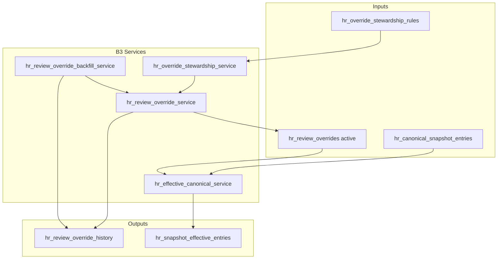

# ADR-043 Phase B3 — Override Runtime Services & Effective Canonical Engine

## Статус

**Implemented** (2026-06-20)

## Связанные документы

| ADR | Связь |
|-----|-------|
| [ADR-043 Phase A](./ADR-043-phase-a-personnel-lifecycle.md) | Effective Canonical architecture |
| [ADR-043 Phase A.1](./ADR-043-phase-a1-override-governance.md) | Tier governance, history events |
| [ADR-043 Phase B1](./ADR-043-phase-b1-schema-design.md) | Schema design |
| [ADR-043 Phase B2](./ADR-043-phase-b2-migration-note.md) | DDL, stewardship seed |

---

## Цель B3

Начать использовать persistent override-модель в **runtime** без API/UI:

- lifecycle-сервис overrides;
- Effective Canonical resolver;
- effective cache refresh;
- backfill legacy corrections;
- unit/integration tests.

**Не входит:** API, UI, production deploy, полный enrollment workflow.

---

## Runtime Architecture



### Service modules

| Module | Responsibility |
|--------|----------------|
| `app/services/hr_override_stewardship_service.py` | Resolve stewardship rule by `(field_path, scope_type)`; validate tier, owner_domain, evidence, justification |
| `app/services/hr_review_override_service.py` | Override lifecycle + append-only history |
| `app/services/hr_effective_canonical_service.py` | Effective resolver + cache refresh |
| `app/services/hr_review_override_backfill_service.py` | Legacy → persistent overrides (dry-run / execute) |

---

## Override Lifecycle (`hr_review_override_service`)

### Operations

| Function | Description |
|----------|-------------|
| `create_override()` | Insert override + `CREATED` history |
| `approve_override()` | `pending_approval` → `active` (Tier 2); `APPROVED` history |
| `reject_override()` | `pending_approval` → `rejected` |
| `revoke_override()` | `active` → `revoked` |
| `expire_override()` | `active` → `expired` (system) |
| `mark_stale()` | `active` + `stale_flag=true`; still in Effective Value |
| `reconfirm_override()` | Clear stale; `RECONFIRMED` history |
| `supersede_override()` | Create replacement; supersede prior active on immediate active or on approve |

### Tier behaviour

| Tier | Initial status | Justification | Second approver |
|------|----------------|---------------|-----------------|
| 0 | `active` | Optional | No (= creator) |
| 1 | `active` | Required (≥10 chars) | No (= creator) |
| 2 | `pending_approval` | Required | Yes (≠ creator) |

All tier/owner/evidence decisions come from **`hr_override_stewardship_rules`** — no hardcoded field rules in services.

### Status transitions

```text
(create)           → active | pending_approval
pending_approval   → active | rejected
active             → revoked | expired | superseded
```

Terminal: `rejected`, `expired`, `revoked`, `superseded`.

### History lifecycle

Every mutation inserts exactly one row into `hr_review_override_history` in the **same transaction**:

| Event | Trigger |
|-------|---------|
| `CREATED` | `create_override` |
| `APPROVED` | `approve_override` |
| `REJECTED` | `reject_override` |
| `REVOKED` | `revoke_override` |
| `EXPIRED` | `expire_override` |
| `MARKED_STALE` | `mark_stale` |
| `RECONFIRMED` | `reconfirm_override` |
| `SUPERSEDED` | supersede on create/approve |

History table remains append-only (DB trigger from B2).

---

## Effective Canonical Resolver

### `resolve_effective_person()`

Algorithm:

1. Load **active snapshot** entry from `hr_canonical_snapshot_entries` by `person_key` (= roster `match_key`).
2. Collect **active** overrides for scope keys:
   - `PERSON:{person_key}`
   - `ASSIGNMENT:{assignment_key}` (optional)
3. Apply overrides via dot-path → flat payload key mapping (`identity.iin` → `iin`).
4. Track applied fields in `effective_payload._override_fields`.
5. Return `canonical_payload`, `effective_payload`, `applied_override_ids`.

**Does not read historical snapshots** — only the requested/active snapshot.

### Scope support

| Scope | Usage |
|-------|-------|
| `PERSON` | Identity fields on roster entry |
| `ASSIGNMENT` | Roster assignment fields when `assignment_key` provided |
| Document scopes | Via `resolve_effective_entry()` for normalized records (`TRAINING`, `CERTIFICATE`, …) |

---

## Effective Cache Refresh

Functions in `hr_effective_canonical_service`:

| Function | Scope |
|----------|-------|
| `refresh_person_effective_entry()` | Single roster `match_key` |
| `refresh_assignment_effective_entry()` | Roster + assignment overrides |
| `refresh_snapshot_effective_entries()` | Full active snapshot rebuild |

### Updated columns (`hr_snapshot_effective_entries`)

- `effective_payload`
- `override_ids`
- `override_version_hash` — sha256 of `{override_id}:{updated_at}` tuples
- `payload_hash` — sha256 via canonical hash normalizer
- `computed_at`

### Idempotency

Upsert on `(snapshot_id, match_key)`; repeated refresh with unchanged inputs yields identical `payload_hash` and `override_version_hash`.

`stale_flag` changes do **not** alter effective payload (override still active).

---

## Stewardship Enforcement

`resolve_stewardship_rule(conn, field_path, scope_type)`:

```sql
SELECT … FROM hr_override_stewardship_rules
WHERE active_flag = TRUE
  AND (scope_type IS NULL OR scope_type = :scope_type)
  AND :field_path LIKE field_path_pattern ESCAPE '\'
ORDER BY priority ASC
LIMIT 1
```

On create, service copies from rule:

- `required_tier` → `tier`
- `owner_domain`
- `persistence_policy_default` → `persistence_policy`
- Validates `requires_evidence`, `requires_second_approval`

---

## Backfill Strategy

Module: `hr_review_override_backfill_service`

### Sources

| Source | Target |
|--------|--------|
| `hr_canonical_snapshot_entries.payload._canonical_correction_fields` | Active snapshot overrides |
| `hr_import_normalized_records.review_override_json` | Latest approved per `(source_record_key, record_kind)` |

**Skipped:** `employee_import_profile_overrides` (operational contour, ADR-041).

### Modes

| Mode | Function | Behaviour |
|------|----------|-----------|
| Preview | `preview_backfill()` | Report planned creates/skips |
| Dry-run | `execute_backfill(dry_run=True)` | No mutations |
| Execute | `execute_backfill(dry_run=False)` | Insert overrides + `CREATED` history |

### Idempotency

Skip when active/pending override exists for `(scope_key, field_path)`. Second execute → `created_count = 0`.

Metadata: `backfill_key`, `backfill_source` on override row.

---

## Tests

`tests/test_adr043_phase_b3_runtime_services.py`:

- stewardship resolution
- tier / evidence / second-approver validation
- create, approve, supersede, stale/reconfirm, revoke
- history events
- effective resolver + cache idempotency
- backfill dry-run / execute / duplicate protection

Regression: ADR-039–042 test suites unchanged (no modifications to legacy paths).

---

## Next Steps (B4+)

- Wire monthly diff to read `hr_snapshot_effective_entries`
- API endpoints for override registry
- Promotion pipeline → persist overrides on batch promote
- Personnel event materialization from effective snapshot pairs
