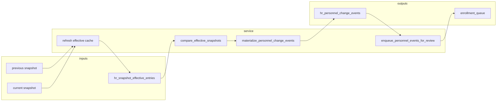

# ADR-043 Phase C1 — Effective Monthly Diff & Personnel Event Engine

## Статус

**Implemented** (2026-06-20)

## Связанные документы

| ADR | Связь |
|-----|-------|
| [ADR-043 Phase B3](./ADR-043-phase-b3-runtime-services.md) | Effective Canonical resolver + cache |
| [ADR-043 Phase A](./ADR-043-phase-a-personnel-lifecycle.md) | Assignment-centric events, enrollment matrix |
| [ADR-040](./ADR-040-canonical-hr-snapshot-monthly-diff.md) | Legacy batch diff + `hr_change_events` |
| [ADR-042](./ADR-042-phase-b3-service-layer.md) | `enrollment_queue` detector |

---

## Why move diff to Effective Canonical

ADR-040 monthly diff compares incoming batch rows against **raw** `hr_canonical_snapshot_entries.payload`.

ADR-043 introduces **persistent overrides** (`hr_review_overrides`) that participate in operational truth but are not always reflected in raw snapshot payload alone.

**Effective Canonical** = approved snapshot entry + active overrides, materialized in `hr_snapshot_effective_entries`.

C1 compares **effective** rows across snapshot pairs so personnel events reflect what operators and enrollment actually see — including override corrections.

Legacy paths are **unchanged**:

- `hr_import_monthly_diff_service` — batch vs active snapshot (ADR-040)
- `hr_snapshot_comparison_service` — roster-level `hr_change_events`

---

## Service architecture

**Module:** `app/services/hr_effective_monthly_diff_service.py`



### Main entry point

```python
run_effective_monthly_diff(
    conn,
    previous_snapshot_id=...,
    snapshot_id=...,
    dry_run=True,      # preview report only
    enqueue=False,     # create enrollment_queue rows (execute mode)
    refresh_cache=True # rebuild hr_snapshot_effective_entries for both snapshots
)
```

Returns `EffectiveMonthlyDiffReport` as dict (see § Report DTO).

---

## Effective diff algorithm

1. **Refresh cache** for `previous_snapshot_id` and `snapshot_id` via `refresh_snapshot_effective_entries`.
2. Load roster rows from `hr_snapshot_effective_entries` (`record_kind = roster`).
3. Compare by `person_key` (= roster `match_key`):

| Set operation | Events |
|---------------|--------|
| new \ prior persons | `NEW_PERSON`, `NEW_ASSIGNMENT` |
| prior \ new persons | `TERMINATED_PERSON`, `CLOSED_ASSIGNMENT` |
| matched person, assignment_key changed | `CLOSED_ASSIGNMENT` + `NEW_ASSIGNMENT` |
| matched person, same assignment_key | org+position → `TRANSFER`; org only → `DEPARTMENT_CHANGED`; position only → `POSITION_CHANGED`; rate only → `RATE_CHANGED` |
| identity / note field diffs | `FIELD_CHANGED` |
| `_override_fields` added/removed | `OVERRIDE_APPLIED` / `OVERRIDE_EXPIRED` |

**Assignment key** (derived from effective roster payload):

```text
{person_key}|{org_unit_id|department}|{position_raw}|primary  (lowercased)
```

Canonical layer values (`old_value` / `new_value`) come from `hr_canonical_snapshot_entries`; effective values from effective cache payloads.

---

## Personnel event hash & idempotency

```text
event_hash = sha256(
  previous_snapshot_id | snapshot_id | person_key |
  coalesce(assignment_key,'') | event_type |
  coalesce(field_path,'') |
  stable_json(effective_old_value) | stable_json(effective_new_value)
)
```

- Stored in `hr_personnel_change_events.event_hash` (UNIQUE).
- Materialization: `INSERT … ON CONFLICT (event_hash) DO NOTHING`.
- Re-run of same snapshot pair → `events_created = 0`, `events_existing > 0`.

Optional bridge: `source_event_id` → matching `hr_change_events.change_event_id` when legacy event exists for same snapshot pair + match_key.

Default status: `detected`.

---

## Personnel event taxonomy

| Event | Enrollment auto-enqueue? |
|-------|-------------------------|
| `NEW_PERSON` | Yes → `NEW_ASSIGNMENT` |
| `NEW_ASSIGNMENT` | Yes |
| `TRANSFER` | Yes → `CHANGED_ASSIGNMENT` |
| `DEPARTMENT_CHANGED` | Yes → `CHANGED_ASSIGNMENT` |
| `POSITION_CHANGED` | Yes → `CHANGED_ASSIGNMENT` |
| `TERMINATED_PERSON` | No (manual policy) |
| `CLOSED_ASSIGNMENT` | No |
| `RATE_CHANGED` | No |
| `FIELD_CHANGED` | No (except future policy) |
| `FIELD_CHANGED` on `note.*` / `display.*` | No |
| `OVERRIDE_APPLIED` | No |
| `OVERRIDE_EXPIRED` | No |

---

## Enrollment queue integration

**Function:** `enqueue_personnel_events_for_review(conn, personnel_event_ids, dry_run=...)`

- Sets `enrollment_queue.personnel_event_id`.
- Idempotency key: `pe:{personnel_event_id}|{reason}|{person_id|assignment_id}`.
- Skips duplicate if same `idempotency_key` or `personnel_event_id` already queued.
- Does **not** modify ADR-042 `detect_enrollment_candidates` (still reads `hr_change_events`).

---

## Dry-run / execute flow

| Mode | Personnel events | Enrollment |
|------|------------------|------------|
| `dry_run=True` | Report only; counts existing hashes | Preview count if `enqueue=True` |
| `dry_run=False` | Insert new events | Insert queue rows if `enqueue=True` |
| Second execute | Idempotent (no duplicates) | Idempotent (existing queue hit) |

### Report fields

`previous_snapshot_id`, `snapshot_id`, `effective_entries_compared`, `persons_new`, `persons_terminated`, `assignments_new`, `assignments_closed`, `transfers`, `field_changes`, `override_events`, `events_created`, `events_existing`, `enrollment_items_created`, `enrollment_items_existing`, `warnings`, `planned_events`.

---

## Risks & limitations

| Risk | Mitigation / note |
|------|-------------------|
| Assignment key derived from roster payload, not `person_assignments` table | Person sync job (future) will align keys |
| Effective cache for non-active snapshots | C1 explicitly refreshes both snapshots before diff |
| Dual journals (`hr_change_events` + personnel events) | Bridge via `source_event_id`; legacy export unchanged |
| `person_id` / `assignment_id` may be NULL | Resolved when persons/assignments exist; events still keyed by `person_key` |
| Full person sync not implemented | Events are materialized; enrollment may queue without resolved IDs |

---

## Tests

`tests/test_adr043_phase_c1_effective_monthly_diff.py` — event detection, idempotency, enrollment rules, legacy `hr_change_events` smoke test.

Regression: ADR-039–043 suites unchanged except new C1 tests.

---

## Next steps (C2+)

- Wire promotion pipeline to call `run_effective_monthly_diff` after snapshot supersession
- Upgrade `detect_enrollment_candidates` to prefer `personnel_event_id`
- Person/assignment sync from effective snapshot
- Monthly batch diff reads effective cache baseline (ADR-040 integration)
