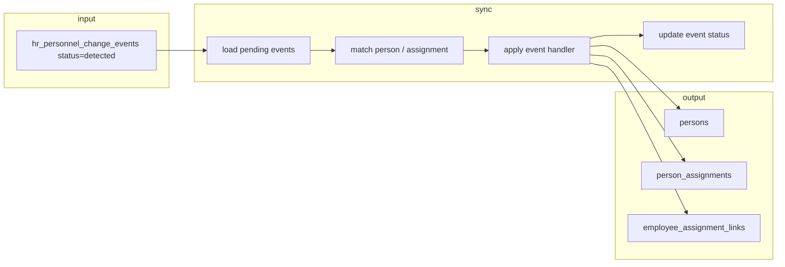

# ADR-043 Phase C2 — Person & Assignment Sync Engine

## Статус

**Implemented** (2026-06-20)

## Связанные документы

| ADR | Связь |
|-----|-------|
| [ADR-043 Phase C1](./ADR-043-phase-c1-effective-monthly-diff.md) | Materializes `hr_personnel_change_events` |
| [ADR-042 Phase B1](./ADR-042-phase-b1-schema-design.md) | `persons`, `person_assignments`, `employee_assignment_links` |
| [ADR-041](./ADR-041-dual-personnel-registry-model.md) | Dual registry — HR canonical vs operational employees |
| [ADR-048 — Person Ownership and Identity Creation Policy](./ADR-048-person-ownership-identity-creation-policy.md) | ownership Person; enrollment Create-or-Link; C2 vs enrollment boundary (append-only note §Cross-reference) |

---

## Цель

Phase C2 применяет события `hr_personnel_change_events` (созданные C1) к кадровой основе ADR-041/042:

- `persons`
- `person_assignments`
- `employee_assignment_links` (только при существующем employee)
- статусы personnel events

**Не входит в C2:** UI, REST API, production deploy, изменение `hr_change_events`, удаление данных, автоматическое создание employees.

---

## Service architecture

**Module:** `app/services/hr_person_assignment_sync_service.py`



### Entry point

```python
sync_personnel_events(
    dry_run=True,           # preview only — no DB writes
    event_ids=None,         # optional filter
    snapshot_id=None,       # optional filter
    event_types=None,       # optional filter
    actor_user_id=None,     # audit actor; defaults to first active user
    conn=None,              # optional existing transaction
)
```

Returns `PersonAssignmentSyncReport` as dict:

| Field | Meaning |
|-------|---------|
| `events_seen` | Loaded `detected` events matching filters |
| `events_applied` | Successfully applied (including idempotent no-op) |
| `events_skipped` | Non-mutating (override, note/display FIELD_CHANGED) |
| `persons_created` / `persons_updated` | Person mutations |
| `assignments_created` / `assignments_updated` / `assignments_closed` | Assignment mutations |
| `links_created` / `links_updated` | `employee_assignment_links` when employee exists |
| `warnings` / `errors` | Non-fatal issues / per-event failures |
| `dry_run` | Whether execute mode was disabled |

---

## Identity & matching rules

### Person

| Priority | Key | Notes |
|----------|-----|-------|
| 1 | `person_key` → `persons.match_key` | Primary match |
| 2 | `iin` (12 digits) | Fallback when `person_key` miss |
| — | No fuzzy matching | C2 scope |

### Assignment

| Priority | Key | Notes |
|----------|-----|-------|
| 1 | `assignment_key` from event | C1 format: `{person_key}\|{org}\|{position_raw}\|primary` |
| 2 | `canonical_entry_id` from event metadata | FK lookup |
| 3 | `(person_id, assignment_key)` | Case-insensitive |
| — | No destructive merge | Existing rows updated or closed, never deleted |

All writes record provenance in event `metadata.sync` with `personnel_event_id`.

---

## Event handling matrix

| Event type | Person | Assignment | Employee link | Event status |
|------------|--------|--------------|---------------|--------------|
| `NEW_PERSON` | Create if missing | — | — | `acknowledged` |
| `NEW_ASSIGNMENT` | Ensure person exists | Create if missing | Link if employee exists | `enrolled` if link touched, else `acknowledged` |
| `CLOSED_ASSIGNMENT` | — | Close (`lifecycle_status=closed`, `end_date`) | — | `acknowledged` |
| `TERMINATED_PERSON` | Set `inactive` | Close all active | — | `acknowledged` |
| `TRANSFER` | Ensure person | **Close old + create new** | Link if employee exists | `enrolled` if link touched |
| `DEPARTMENT_CHANGED` | — | Update `org_unit_id` in place | Link if employee exists | `enrolled` if link touched |
| `POSITION_CHANGED` | — | Update `position_id` in place | Link if employee exists | `enrolled` if link touched |
| `RATE_CHANGED` | — | Update `rate` in place | Link if employee exists | `enrolled` if link touched |
| `FIELD_CHANGED` | Whitelist only | Whitelist only | Link if applicable | `acknowledged` / skipped |
| `OVERRIDE_APPLIED` | No mutation | No mutation | — | `acknowledged` (audit only) |
| `OVERRIDE_EXPIRED` | No mutation | No mutation | — | `acknowledged` (audit only) |

### FIELD_CHANGED whitelist

**Applied:**

- `identity.full_name`, `identity.iin`, `identity.birth_date`
- `roster.department`, `roster.org_unit_id`, `roster.position_raw`, `roster.rate`

**Ignored (non-mutating):**

- `note.*`, `display.*`, and any path outside the whitelist

### TRANSFER strategy

When both org and position change (C1 emits `TRANSFER`):

1. Resolve person.
2. Find active assignment by **old** `assignment_key` (from `effective_old_value`).
3. Close old assignment.
4. Create new assignment with **new** `assignment_key` and `source=transfer`.

In-place update is **not** used for `TRANSFER` because C1 assignment keys embed org + position.

### OVERRIDE events

`OVERRIDE_APPLIED` / `OVERRIDE_EXPIRED` do not mutate `persons` or `person_assignments`. Effective payload changes are expected to appear as separate `FIELD_CHANGED` events from C1. Sync marks override events `acknowledged` with `metadata.sync.non_mutating=true`.

---

## Employee link strategy

| Condition | Behavior |
|-----------|----------|
| `employees.person_id` exists for person | Create or reactivate `employee_assignment_links` for the affected assignment |
| No employee | Skip link; event stays queued for enrollment workflow |
| No employee shell | **Never** auto-created |
| `enrollment_queue` | **Never** bypassed — sync does not call `apply_enrollment` |

Link writes set `enrolled_by_user_id` from `actor_user_id`. `enrollment_queue_id` remains `NULL` (sync is not enrollment approval).

---

## Status transitions

B2 schema statuses: `detected`, `acknowledged`, `enrolled`, `ignored`, `superseded`.

| Outcome | New status |
|---------|------------|
| Success, no employee link | `acknowledged` |
| Success, employee link created/updated | `enrolled` |
| Non-mutating (override, note field) | `acknowledged` |
| Failure | Remains `detected` + `metadata.sync.last_error` |

> **Note:** Schema has no `applied` status. C2 uses `acknowledged` for applied-but-not-enrolled events and `enrolled` when an operational link was synchronized.

Only `detected` events are loaded. Re-run after success is safe: acknowledged events are skipped.

---

## Idempotency

| Scenario | Behavior |
|----------|----------|
| Re-run after success | Event already `acknowledged`/`enrolled` → not loaded |
| `NEW_PERSON`, person exists | No duplicate; event marked applied |
| `NEW_ASSIGNMENT`, active assignment exists | No duplicate |
| Failed event | Stays `detected`; retry after fixing prerequisites |
| `dry_run=True` | Full planning; zero mutations; events stay `detected` |

---

## Org / position resolution

When creating or updating assignments:

1. `org_unit_id` from effective payload if present.
2. Else `department` → `lookup_recoding()` (department recoding table).
3. Else first active `org_units` row (with warning in logs).

Position:

1. `position_id` from payload if present.
2. Else `position_raw` → lookup/create via `_get_or_create_position_id`.

---

## Limitations (C2)

- No fuzzy person matching.
- No automatic employee creation.
- No enrollment queue auto-apply.
- `assignment_key` uses C1 formula (diff layer), not ADR-042 DB backfill formula — matching relies on event `assignment_key` + `canonical_entry_id`.
- `REMOVED_ASSIGNMENT` enrollment apply remains unsupported (ADR-042 B4).
- Requires PostgreSQL with ADR-043 B2 migration applied.

---

## Integration point (future)

Recommended pipeline after monthly snapshot promotion:

```
run_effective_monthly_diff(dry_run=False, enqueue=True)
    → sync_personnel_events(dry_run=False)
    → enrollment_detector (existing queue items)
```

C2 does not invoke C1 automatically; callers orchestrate the sequence.

---

## Cross-reference (append-only, ADR-048)

C2 остаётся **canonical CREATE authority** для Person + assignments. Operational **Create-or-Link** Person Shell и установка `employees.person_id` — отдельный домен enrollment ([ADR-048](./ADR-048-person-ownership-identity-creation-policy.md)). C2 **не** устанавливает `employees.person_id`; ограничения C2 (§Limitations) **не изменяются**.
