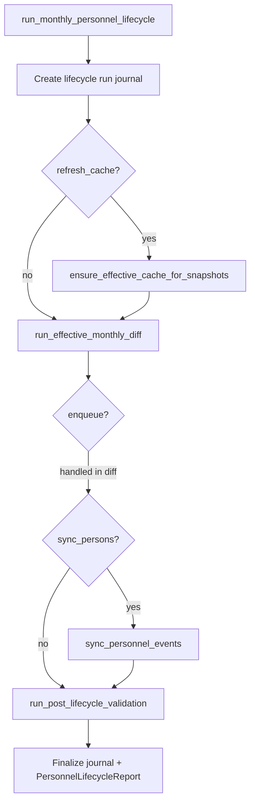

# ADR-043 Phase C3 — Lifecycle Orchestrator

## Статус

**Implemented** (2026-06-20)

## Связанные документы

| ADR | Связь |
|-----|-------|
| [ADR-043 Phase C1](./ADR-043-phase-c1-effective-monthly-diff.md) | Effective monthly diff |
| [ADR-043 Phase C2](./ADR-043-phase-c2-person-assignment-sync.md) | Person & assignment sync |
| [ADR-043 Phase B3](./ADR-043-phase-b3-runtime-services.md) | Effective cache refresh |
| [ADR-042](./ADR-042-phase-b3-service-layer.md) | Enrollment queue |

---

## Цель

Phase C3 объединяет B3/C1/C2 в **единую точку входа** для месячного кадрового цикла:

```
Approved Snapshot
  → Active Review Overrides
  → Effective Snapshot Entries      (Stage 1)
  → Personnel Change Events         (Stage 2)
  → Enrollment Queue                (Stage 3, optional)
  → Persons / Assignments / Links   (Stage 4, optional)
  → Validation + Report             (Stage 5)
```

**Не входит:** UI, REST API, deploy, cron, scheduler.

---

## Service architecture

**Module:** `app/services/hr_personnel_lifecycle_service.py`



### Entry point

```python
run_monthly_personnel_lifecycle(
    previous_snapshot_id=...,
    snapshot_id=...,
    dry_run=True,        # preview — no personnel/enrollment/sync writes
    refresh_cache=True,  # Stage 1 effective cache rebuild
    enqueue=False,       # Stage 3 enrollment queue (via C1)
    sync_persons=False,  # Stage 4 person/assignment sync (via C2)
    actor_user_id=None,
    conn=None,           # optional transaction
)
```

**No business logic duplication** — orchestrator delegates to:

| Stage | Service | Function |
|-------|---------|----------|
| 1 | `hr_effective_canonical_service` | `refresh_snapshot_effective_entries` (via `ensure_effective_cache_for_snapshots`) |
| 2–3 | `hr_effective_monthly_diff_service` | `run_effective_monthly_diff` |
| 4 | `hr_person_assignment_sync_service` | `sync_personnel_events_tx` |
| 5 | `hr_personnel_lifecycle_service` | `run_post_lifecycle_validation` |

---

## Lifecycle run journal

**Table:** `hr_personnel_lifecycle_runs`  
**Migration:** `alembic/versions/y7z8a9b0c1d2_adr043_phase_c3_lifecycle_runs_schema.py`

| Column | Purpose |
|--------|---------|
| `run_id` | PK |
| `previous_snapshot_id`, `snapshot_id` | Snapshot pair (must differ) |
| `status` | `running`, `completed`, `failed`, `cancelled` |
| `started_at`, `completed_at` | Timing |
| `actor_user_id` | Who triggered the run |
| `dry_run`, `refresh_cache`, `enqueue`, `sync_persons` | Run flags |
| Counters | `events_created`, `enrollment_created`, `persons_created`, etc. |
| `summary` | Full `PersonnelLifecycleReport` JSON |

Every run (dry-run and execute) creates a journal row when the table exists.

---

## PersonnelLifecycleReport

| Section | Content |
|---------|---------|
| `effective_cache` | Stage 1 refresh counts or `skipped` |
| `monthly_diff` | Full C1 `EffectiveMonthlyDiffReport` |
| `personnel_events` | `events_created`, `events_existing`, `planned_count` |
| `enrollment` | `created`, `existing`, `enabled` |
| `person_sync` | Full C2 sync report or `skipped` |
| `validation` | Post-run checks (see below) |
| `warnings` | Aggregated pipeline + validation warnings |
| `errors` | Stage failures only (not validation data-quality errors) |
| `duration_ms` | Wall-clock duration |
| `run_status` | `completed` / `failed` |
| `run_id` | Journal FK |

Same DTO shape for `dry_run=True` and `dry_run=False`.

---

## Rerun semantics (idempotency)

Safe rerun of the same `(previous_snapshot_id, snapshot_id)` pair:

| Layer | Idempotency mechanism |
|-------|----------------------|
| Effective cache | `ON CONFLICT DO UPDATE` per `(snapshot_id, match_key)` |
| Personnel events | `event_hash` UNIQUE + `ON CONFLICT DO NOTHING` |
| Enrollment queue | `idempotency_key` + `personnel_event_id` dedup |
| Persons | `match_key` / `iin` lookup before insert |
| Assignments | `assignment_key` + `canonical_entry_id` lookup |
| Person sync | Only `detected` events processed; applied events skipped |

**Expected rerun behavior:**

- `events_created = 0`, `events_existing > 0`
- `enrollment_created = 0`, `enrollment_existing > 0` (if `enqueue=True`)
- `persons_created = 0`, `assignments_created = 0` (if `sync_persons=True`)
- New journal row per orchestrator invocation (audit trail)

---

## Post-run validation

`run_post_lifecycle_validation()` checks:

| Code | Severity | Description |
|------|----------|-------------|
| `duplicate_active_overrides` | error | Multiple active overrides per `(scope_key, field_path)` |
| `duplicate_active_assignments` | error | Multiple active rows per `(person_id, assignment_key)` |
| `persons_without_active_assignment` | warning | Active persons with no active assignment |
| `active_assignment_without_person` | error | Orphan active assignments |
| `personnel_events_stuck_detected` | warning | Events still `detected` for snapshot pair |
| `outdated_effective_cache` | warning | Roster canonical count > effective cache count |

Validation results appear in `report.validation`. Data-quality errors do **not** fail the run unless a pipeline stage threw an exception.

---

## Failure handling

| Failure | Journal status | Event state |
|---------|----------------|-------------|
| Stage exception (diff, sync) | `failed` | Partial writes rolled back if caller uses single transaction |
| Person sync per-event error | `failed` if any sync errors | Event stays `detected` (C2) |
| Validation data issues | `completed` | Informational only |

On failure, `summary` includes `failure.stage` and `failure.error`.

---

## Limitations (C3)

- No UI / admin API exposure (deferred to C4).
- No cron / scheduler integration.
- No automatic snapshot pair discovery — caller supplies IDs.
- Journal requires C3 migration (`alembic upgrade head`).
- `cancelled` status reserved; not used in C3 runtime.
- Validation is heuristic, not blocking, except pipeline stage errors.

---

## Recommended usage

```python
# Preview full cycle
report = run_monthly_personnel_lifecycle(
    previous_snapshot_id=prior_id,
    snapshot_id=new_id,
    dry_run=True,
    refresh_cache=True,
    enqueue=True,
    sync_persons=True,
)

# Execute after HR approval
report = run_monthly_personnel_lifecycle(
    previous_snapshot_id=prior_id,
    snapshot_id=new_id,
    dry_run=False,
    refresh_cache=True,
    enqueue=True,
    sync_persons=True,
    actor_user_id=executor_user_id,
)
```

Next phase **C4**: HR/SysAdmin API + Operational UI on top of this lifecycle engine.
