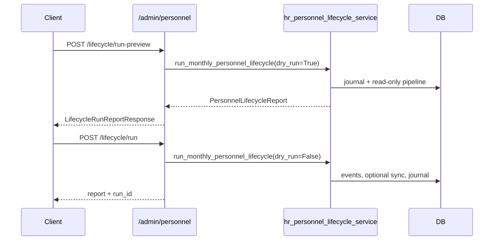

# ADR-043 Phase C4.1 — Personnel Lifecycle API

## Статус

**Implemented** (2026-06-20)

## Связанные документы

| ADR | Связь |
|-----|-------|
| [ADR-043 Phase C3](./ADR-043-phase-c3-lifecycle-orchestrator.md) | Lifecycle orchestrator |
| [ADR-043 Phase B3](./ADR-043-phase-b3-runtime-services.md) | Override + effective canonical services |
| [ADR-042 Phase B4](./ADR-042-phase-b4-admin-api.md) | Admin API patterns |
| [ADR-042 Phase B5](./ADR-042-phase-b5-auth-policy.md) | Access grants + guard modes |

---

## Цель

Phase C4.1 exposes the **ready C1/C2/C3 backend** through a secure REST API layer.

**In scope:** lifecycle runs, personnel events (read), overrides, effective person, validation.

**Out of scope:** UI, deploy, new lifecycle algorithms, business-logic changes in C1/C2/C3.

---

## API surface

**Router:** `app/api/personnel_admin_router.py`  
**Prefix:** `/admin/personnel`  
**Schemas:** `app/api/personnel_admin_schemas.py`  
**Read queries:** `app/services/personnel_admin_query_service.py`

### Lifecycle runs

| Method | Path | Description |
|--------|------|-------------|
| GET | `/admin/personnel/lifecycle/runs` | List runs (filters: snapshot pair, status; pagination) |
| GET | `/admin/personnel/lifecycle/runs/{run_id}` | Run detail + `summary` JSON |
| POST | `/admin/personnel/lifecycle/run-preview` | `dry_run=True` via `run_monthly_personnel_lifecycle()` |
| POST | `/admin/personnel/lifecycle/run` | `dry_run=False` execute |
| GET | `/admin/personnel/lifecycle/validation` | Post-run validation (`run_post_lifecycle_validation`) |

**Request body (`LifecycleRunRequest`):**

```json
{
  "previous_snapshot_id": 100,
  "snapshot_id": 101,
  "refresh_cache": true,
  "enqueue": false,
  "sync_persons": false
}
```

**Response:** `LifecycleRunReportResponse` (full `PersonnelLifecycleReport` from C3).

### Personnel events (read-only)

| Method | Path | Description |
|--------|------|-------------|
| GET | `/admin/personnel/events` | List with filters + pagination |
| GET | `/admin/personnel/events/{event_id}` | Event detail |

**Filters:** `snapshot_id`, `event_type`, `status`, `person_key`, `assignment_key`, `date_from`, `date_to`, `sort_by`, `sort_dir`.

### Overrides

| Method | Path | Service delegate |
|--------|------|------------------|
| GET | `/admin/personnel/overrides` | `personnel_admin_query_service.list_overrides` |
| GET | `/admin/personnel/overrides/{override_id}` | `get_override` |
| POST | `/admin/personnel/overrides` | `create_override_tx` |
| POST | `/admin/personnel/overrides/{override_id}/approve` | `approve_override_tx` |
| POST | `/admin/personnel/overrides/{override_id}/reject` | `reject_override_tx` |
| POST | `/admin/personnel/overrides/{override_id}/revoke` | `revoke_override_tx` |
| POST | `/admin/personnel/overrides/{override_id}/reconfirm` | `reconfirm_override_tx` |

No override business logic in controllers.

### Effective canonical

| Method | Path | Service delegate |
|--------|------|------------------|
| GET | `/admin/personnel/effective-person` | `resolve_effective_person_tx` |

**Query:** `person_key` (required), `assignment_key`, `snapshot_id`.

**Response:** `EffectivePersonResponse` — canonical payload, effective payload, `applied_override_ids`.

### Validation

| Method | Path | Service delegate |
|--------|------|------------------|
| GET | `/admin/personnel/lifecycle/validation` | `run_post_lifecycle_validation` |

**Query:** `previous_snapshot_id`, `snapshot_id`.

---

## Permissions (ADR-042 integration)

**Guard module:** `app/security/personnel_admin_guard.py`

| Endpoint group | Dependency | Who can access |
|----------------|------------|----------------|
| Read + lifecycle run + create/revoke/reconfirm | `require_personnel_admin_api` | Full admin (`evaluate_admin_access`) **or** `HR_ENROLLMENT_MANAGER` grant |
| Override approve/reject | `require_hr_governance_api` | Full admin **or** `HR_ENROLLMENT_MANAGER` |
| Tier 2 approve/reject | + `_ensure_tier2_governance` | Same as governance when `tier >= 2` |

Uses existing `access_grants` / `access_roles` — no new security model.

**Permission codes** (extended in `admin_permissions.py`):

- `PERSONNEL_READ_PERMISSIONS`: `SYSADMIN_CABINET`, `ACCESS_ADMIN`, `HR_ENROLLMENT_MANAGER`
- `HR_GOVERNANCE_PERMISSIONS`: same set for Tier-2 governance actions

Emergency fallback (`is_privileged`, role_id=2) still works via `evaluate_admin_access`.

---

## Response models

| Schema | Use |
|--------|-----|
| `LifecycleRunSummary` / `LifecycleRunDetail` | Journal list/detail |
| `LifecycleRunReportResponse` | Preview + execute |
| `PersonnelEventSummary` / `PersonnelEventDetail` | Events API |
| `OverrideSummary` / `OverrideDetail` | Overrides API |
| `EffectivePersonResponse` | Effective canonical |
| `ValidationResponse` | Validation checks |

Raw DB rows are not returned without schema mapping.

---

## Workflow



---

## Security considerations

1. All routes require authentication (`get_current_user`).
2. Personnel routes use grant-aware guard, not only env allowlist.
3. Tier-2 override actions require HR governance permission explicitly.
4. Revoke reason minimum 10 characters (service rule surfaced as HTTP 400).
5. No enrollment auto-apply or employee shell creation in this API layer.
6. Validation endpoint is read-only diagnostics; does not mutate data.

---

## Registration

```python
# app/main.py
from app.api.personnel_admin_router import router as personnel_admin_router
app.include_router(personnel_admin_router)
```

---

## Tests

`tests/test_adr043_phase_c4_1_lifecycle_api.py` — permission checks, preview vs execute, events pagination, override workflow, effective person, validation, partial pipeline flags.

---

## Limitations (C4.1)

- No UI (deferred to C4.2).
- No cron/scheduler triggers.
- Lifecycle run list reads journal only; no new orchestration logic.
- `cancelled` run status reserved, not exposed via API action.
- Effective person requires roster entry in active (or specified) snapshot.

---

## Next phase

**ADR-043 Phase C4.2** — Personnel Lifecycle UI (HR + SysAdmin panels on this API).
