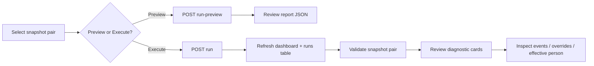

# ADR-043 Phase C4.2 — Personnel Lifecycle UI

## Статус

**Implemented** (2026-06-20)

## Связанные документы

| ADR | Связь |
|-----|-------|
| [ADR-043 Phase C4.1](./ADR-043-phase-c4-1-lifecycle-api.md) | Personnel Lifecycle REST API |
| [ADR-043 Phase C3](./ADR-043-phase-c3-lifecycle-orchestrator.md) | Lifecycle orchestrator |
| [ADR-042 Phase C1](./ADR-042-phase-c1-sysadmin-cabinet-ui.md) | SysAdmin Cabinet shell |

---

## Цель

Phase C4.2 delivers the **first operational HR/SysAdmin UI** for ADR-043 on top of the C4.1 API.

**In scope:** navigation, lifecycle dashboard, run panel, runs/events/overrides tables, detail drawers, effective person viewer, validation panel, permission-aware UX, UI tests.

**Out of scope:** new backend algorithms, lifecycle services, production deploy, charts/BI, exports, bulk actions, separate HR cockpit.

---

## Navigation

| Route | Location |
|-------|----------|
| `/admin/system/personnel-lifecycle` | Inside ADR-042 SysAdmin Cabinet area |

**Sidebar:** item «Personnel Lifecycle» in admin shell (when permitted).

**Breadcrumb:** link back to `/admin/system` from personnel lifecycle header.

**SysAdmin cabinet:** cross-link «Personnel Lifecycle →» on main cabinet page.

---

## Permissions

Exposed on `GET /auth/me`:

| Flag | Meaning |
|------|---------|
| `has_personnel_admin` | ADMIN (`evaluate_admin_access`) **or** active `HR_ENROLLMENT_MANAGER` grant |
| `has_hr_governance` | Same set — required for override approve/reject (incl. Tier 2) |

**Nav visibility:** `canSeePersonnelLifecycleNav(me)` — privileged operator **or** `has_personnel_admin`.

**Route guard:** `isForbiddenAdminRoute("/admin/system/personnel-lifecycle", me)` when nav not allowed.

**Override actions (UI):**

| Action | Shown when |
|--------|------------|
| Approve / Reject | `has_hr_governance` and status `pending_approval` |
| Revoke | status `active` |
| Reconfirm | status `active` and `stale_flag` |

Backend guards remain authoritative (`require_personnel_admin_api`, `require_hr_governance_api`).

---

## Screens

### Overview tab

1. **Lifecycle Dashboard** — last run metrics (status, timestamps, duration, counters).
2. **Monthly Lifecycle Run Panel** — snapshot pair, flags (`refresh_cache`, `enqueue`, `sync_persons`), Preview / Execute, structured report (effective cache, monthly diff, person sync, validation, warnings, errors).
3. **Validation Panel** — snapshot pair → diagnostic cards.
4. **Effective Person Viewer** — `person_key` (+ optional assignment/snapshot) → canonical/effective JSON.

### Lifecycle Runs tab

Paginated table + detail drawer (`summary` JSON).

### Personnel Events tab

Server-side filters: snapshot, event_type, status, person_key, assignment_key, date range. Row click → read-only detail drawer (old/new/effective values, metadata).

### Overrides tab

Queue with filters (status, field_path server-side; tier, owner_domain client-side on current page). Detail drawer with approve/reject/revoke/reconfirm when permitted.

---

## API usage (C4.1 only)

| UI area | Endpoints |
|---------|-----------|
| Dashboard / Runs | `GET /admin/personnel/lifecycle/runs`, `GET .../runs/{id}` |
| Run panel | `POST .../run-preview`, `POST .../run` |
| Events | `GET /admin/personnel/events`, `GET .../events/{id}` |
| Overrides | `GET/POST /admin/personnel/overrides`, action POSTs |
| Effective person | `GET /admin/personnel/effective-person` |
| Validation | `GET /admin/personnel/lifecycle/validation` |

Client: `corpsite-ui/app/admin/system/_lib/personnelLifecycleApi.client.ts`

---

## Workflow



Typical HR pilot flow:

1. Run **Preview** for a new snapshot pair.
2. Review warnings/errors and validation cards.
3. **Execute** when acceptable.
4. Triage **Personnel Events** and **Overrides** queues.
5. Spot-check **Effective Person** for disputed records.

---

## UX conventions

Follows ADR-042 SysAdmin Cabinet patterns:

- Client-side tabs (no full-page reloads)
- Loading / empty / error states
- Pagination on list endpoints
- Server-side filtering where API supports it
- `JsonViewer` for structured payloads (not raw dumps)
- `ConfirmDialog` before destructive execute/revoke

---

## Tests

| File | Coverage |
|------|----------|
| `lib/adminNav.test.ts` | HR vs admin route permissions |
| `_lib/personnelLifecycleLabels.test.ts` | Label/helpers |
| `_lib/personnelLifecycleApi.client.test.ts` | API client wiring |
| `_components/personnel-lifecycle/PersonnelLifecycle.integration.test.tsx` | Preview/execute, events filter, override approve, effective person, validation cards |

Existing ADR-042 cabinet tests (`adminSystemLabels.test.ts`, `adminSystemApi.client.test.ts`) unchanged.

---

## Limitations (C4.2)

- No charts, exports, or bulk actions.
- Override list `created_by` shown in detail drawer only (summary API has no creator field).
- `tier` / `owner_domain` override filters are client-side on the current page (C4.1 list API filters: status, field_path, scope, keys).
- HR-only users see personnel lifecycle without full admin sidebar (same pattern as env-privileged sysadmin-only layout).
- No scheduler/cron triggers from UI.

---

## File map

```
corpsite-ui/app/admin/system/
├── personnel-lifecycle/
│   ├── page.tsx
│   └── _components/PersonnelLifecyclePageClient.tsx
├── _components/personnel-lifecycle/
│   ├── PersonnelLifecycleClient.tsx
│   ├── LifecycleDashboard.tsx
│   ├── LifecycleRunPanel.tsx
│   ├── LifecycleRunsTable.tsx
│   ├── PersonnelEventsPanel.tsx
│   ├── PersonnelEventDrawer.tsx
│   ├── OverridesPanel.tsx
│   ├── OverrideDetailDrawer.tsx
│   ├── EffectivePersonViewer.tsx
│   └── ValidationPanel.tsx
└── _lib/
    ├── personnelLifecycleApi.client.ts
    └── personnelLifecycleLabels.ts
```

---

## Acceptance (C4.2)

- [x] Personnel Lifecycle section in SysAdmin Cabinet
- [x] Lifecycle run panel (preview + execute)
- [x] Lifecycle runs table
- [x] Personnel events table + drawer
- [x] Overrides queue + workflow actions
- [x] Effective person viewer
- [x] Validation panel
- [x] C4.1 API only (UI data layer)
- [x] UI tests
- [x] ADR-042 cabinet preserved

After C4.2, ADR-043 is functionally complete and ready for HR pilot operations.
