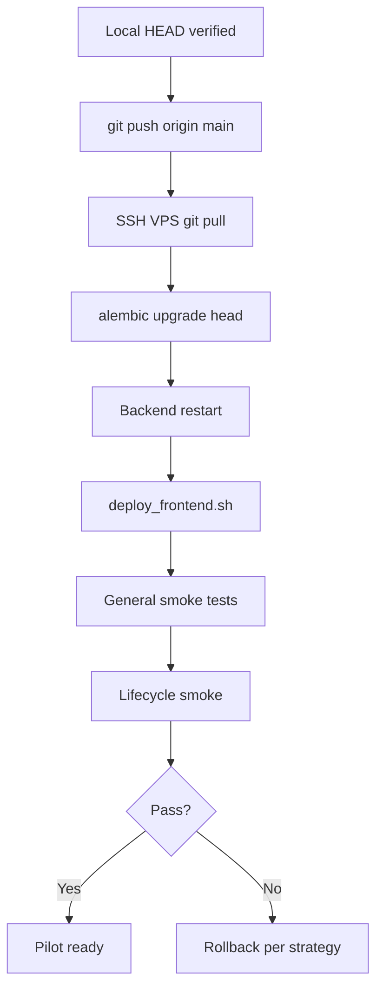

# ADR-043 Phase P1 — Production Deployment Plan

## Статус

**Prepared** (2026-06-20) — plan and commands only; **deploy not executed**.

## Scope

Rollout ADR-043 B2 → C4.2 on VPS (`mmc.004.kz`) on top of existing ADR-042 production baseline.

**Out of scope:** automatic deploy, new migrations, new subsystems, ADR-044.

---

## Prerequisites

| # | Gate | Owner |
|---|------|-------|
| 1 | P1 Gap Audit reviewed | Tech lead |
| 2 | All ADR-043 changes **committed** to `main` (or pilot branch) | Dev |
| 3 | Local pytest + vitest green | Dev |
| 4 | DB backup on VPS (< 24h) | Ops |
| 5 | `.env` backup on VPS | Ops |
| 6 | Maintenance window agreed with HR (lifecycle execute = write) | HR + Ops |
| 7 | Rollback contact identified | Ops |

---

## Deployment flow



---

## Step 1 — Local HEAD verification

**Goal:** ensure working tree matches intended release.

```bash
cd /path/to/corpsite

# Must be clean after commit
git status

# Expected: includes ADR-043 migrations x6y7z8a9b0c1, y7z8a9b0c1d2
alembic heads
# → y7z8a9b0c1d2 (head)

# Backend
python -m pytest tests/test_adr043_phase_b2_schema.py \
  tests/test_adr043_phase_b3_runtime_services.py \
  tests/test_adr043_phase_c1_effective_monthly_diff.py \
  tests/test_adr043_phase_c2_person_assignment_sync.py \
  tests/test_adr043_phase_c3_lifecycle_orchestrator.py \
  tests/test_adr043_phase_c4_1_lifecycle_api.py -q

# Frontend
cd corpsite-ui
npm test -- --run app/admin/system lib/adminNav
cd ..
```

**Do not push** if any test fails.

---

## Step 2 — git push

```bash
git push origin main
# Or pilot branch:
# git push -u origin adr043-pilot-rollout
```

Record pushed SHA: `________________`

---

## Step 3 — VPS pull

```bash
ssh ubuntu@mmc.004.kz   # adjust user/host

cd /opt/projects/corpsite/app

# Backup first (Step 3a)
pg_dump "$DATABASE_URL" -Fc -f "/var/backups/corpsite/pre-adr043-$(date +%Y%m%d-%H%M).dump"
cp .env "/var/backups/corpsite/env-pre-adr043-$(date +%Y%m%d-%H%M).bak"

# Pull
git fetch origin
git checkout main          # or pilot branch
git pull origin main

git log -1 --oneline        # must match pushed SHA
```

---

## Step 4 — alembic upgrade head

```bash
cd /opt/projects/corpsite/app

# Confirm DATABASE_URL points to production DB
grep DATABASE_URL .env

# Current revision BEFORE upgrade
alembic current

# Expected before: w5x6y7z8a9b0 (if ADR-042 already deployed)
# Target after:     y7z8a9b0c1d2

alembic upgrade head

alembic current
alembic heads    # single head y7z8a9b0c1d2
```

### Post-migration validation

```bash
psql "$DATABASE_URL" -f docs/adr/ADR-043-phase-b2-validation.sql
# Empty result sets on violation queries = OK

# Spot-check new tables
psql "$DATABASE_URL" -c "\dt hr_*"
psql "$DATABASE_URL" -c "SELECT COUNT(*) FROM hr_override_stewardship_rules;"
```

---

## Step 5 — Backend restart

Adjust service name to your systemd unit (example):

```bash
sudo systemctl restart corpsite-backend
sudo systemctl status corpsite-backend --no-pager

curl -sS http://127.0.0.1:8000/health
# → {"status":"ok"}
```

If dependencies changed:

```bash
source .venv/bin/activate   # if used
pip install -r requirements.txt
sudo systemctl restart corpsite-backend
```

---

## Step 6 — Frontend rebuild

```bash
cd /opt/projects/corpsite/app
sudo ./scripts/deploy_frontend.sh
sudo systemctl status corpsite-frontend --no-pager
```

See `docs/deploy/frontend.md` for troubleshooting missing `.next` build.

---

## Step 7 — General smoke tests

From operator workstation or VPS:

```bash
# Health
curl -sS https://mmc.004.kz/api/health

# Auth (replace credentials)
TOKEN=$(curl -sS -X POST https://mmc.004.kz/api/auth/login \
  -H 'Content-Type: application/json' \
  -d '{"login":"admin","password":"***"}' | jq -r .access_token)

# ADR-042 admin (regression)
curl -sS -o /dev/null -w "%{http_code}\n" \
  -H "Authorization: Bearer $TOKEN" \
  https://mmc.004.kz/api/admin/users

curl -sS -o /dev/null -w "%{http_code}\n" \
  -H "Authorization: Bearer $TOKEN" \
  https://mmc.004.kz/api/admin/access/roles

# Auth/me flags
curl -sS -H "Authorization: Bearer $TOKEN" \
  https://mmc.004.kz/api/auth/me | jq '{user_id, is_privileged, has_personnel_admin, has_hr_governance}'
```

### UI smoke (manual)

| URL | Expected |
|-----|----------|
| `/admin/system` | 5 tabs load (ADR-042 regression) |
| `/admin/system/personnel-lifecycle` | 4 tabs: Обзор, Runs, Events, Overrides |
| `/directory/personnel` | HTML loads; API JSON via `/api/directory/...` |

PowerShell helper (local → remote API):

```powershell
powershell -ExecutionPolicy Bypass -File .\scripts\smoke_check.ps1 `
  -BaseUrl "https://mmc.004.kz/api" `
  -Login "admin" `
  -Password "***"
```

---

## Step 8 — Lifecycle smoke

**Use June snapshot IDs from pilot data** (replace `PREV` / `CURR`).

### 8.1 Read-only API

```bash
curl -sS -H "Authorization: Bearer $TOKEN" \
  "https://mmc.004.kz/api/admin/personnel/lifecycle/runs?limit=5" | jq .

curl -sS -H "Authorization: Bearer $TOKEN" \
  "https://mmc.004.kz/api/admin/personnel/events?limit=5" | jq .

curl -sS -H "Authorization: Bearer $TOKEN" \
  "https://mmc.004.kz/api/admin/personnel/overrides?limit=5" | jq .
```

### 8.2 Preview (dry run — safe)

```bash
curl -sS -X POST -H "Authorization: Bearer $TOKEN" \
  -H "Content-Type: application/json" \
  https://mmc.004.kz/api/admin/personnel/lifecycle/run-preview \
  -d '{
    "previous_snapshot_id": PREV,
    "snapshot_id": CURR,
    "refresh_cache": true,
    "enqueue": false,
    "sync_persons": false
  }' | jq '{run_status, duration_ms, warnings, errors}'
```

### 8.3 Validation

```bash
curl -sS -H "Authorization: Bearer $TOKEN" \
  "https://mmc.004.kz/api/admin/personnel/lifecycle/validation?previous_snapshot_id=PREV&snapshot_id=CURR" \
  | jq '{warnings_count, errors_count, checks: [.checks[] | {code, severity, count}]}'
```

### 8.4 Execute (production write — HR approval required)

Only after preview + validation OK:

```bash
curl -sS -X POST -H "Authorization: Bearer $TOKEN" \
  -H "Content-Type: application/json" \
  https://mmc.004.kz/api/admin/personnel/lifecycle/run \
  -d '{
    "previous_snapshot_id": PREV,
    "snapshot_id": CURR,
    "refresh_cache": true,
    "enqueue": true,
    "sync_persons": true
  }' | jq '{run_id, run_status, person_sync, enrollment, validation}'
```

Or via UI: `/admin/system/personnel-lifecycle` → Preview → Execute.

---

## Rollback strategy

### Level 1 — Frontend only (UI regression)

```bash
cd /opt/projects/corpsite/app
git checkout <previous-sha>
sudo ./scripts/deploy_frontend.sh
```

Backend unchanged; ADR-043 API may still be live.

### Level 2 — Backend code rollback (no schema change)

```bash
git checkout <previous-sha>
sudo systemctl restart corpsite-backend
```

**Warning:** if migrations already applied, old code may error on new tables — prefer Level 3 only if code incompatible.

### Level 3 — Full rollback including schema

```bash
# Stop writes
sudo systemctl stop corpsite-backend

# Restore DB from pre-deploy dump
pg_restore -d corpsite --clean --if-exists /var/backups/corpsite/pre-adr043-YYYYMMDD-HHMM.dump

# Checkout previous code
git checkout w5x6y7z8a9b0   # or tag pre-adr043

# Alembic downgrade (alternative to pg_restore if dump unavailable)
alembic downgrade w5x6y7z8a9b0

sudo systemctl start corpsite-backend
sudo ./scripts/deploy_frontend.sh
```

### Rollback decision matrix

| Symptom | Action |
|---------|--------|
| UI broken, API OK | Level 1 |
| API 500 on `/admin/personnel/*` only | Fix forward or Level 2 |
| Migration corruption / data integrity | Level 3 (pg_restore) |
| Wrong lifecycle execute | Stop; assess personnel events; restore if within 1h |

---

## Post-deploy sign-off

| Check | Pass | Sign-off |
|-------|------|----------|
| `alembic current` = `y7z8a9b0c1d2` | ☐ | |
| B2 validation SQL clean | ☐ | |
| `/admin/system` regression | ☐ | |
| `/admin/system/personnel-lifecycle` loads | ☐ | |
| Lifecycle preview OK on June pair | ☐ | |
| HR granted `HR_ENROLLMENT_MANAGER` | ☐ | |
| Pilot checklist handed to HR | ☐ | |

---

## Related documents

- [P1 Production Gap Audit](./ADR-043-phase-p1-production-gap-audit.md)
- [P1 Pilot Checklist](./ADR-043-phase-p1-pilot-checklist.md)
- [README_DEPLOY.md](../../README_DEPLOY.md)
- [Frontend deploy](../../docs/deploy/frontend.md)
