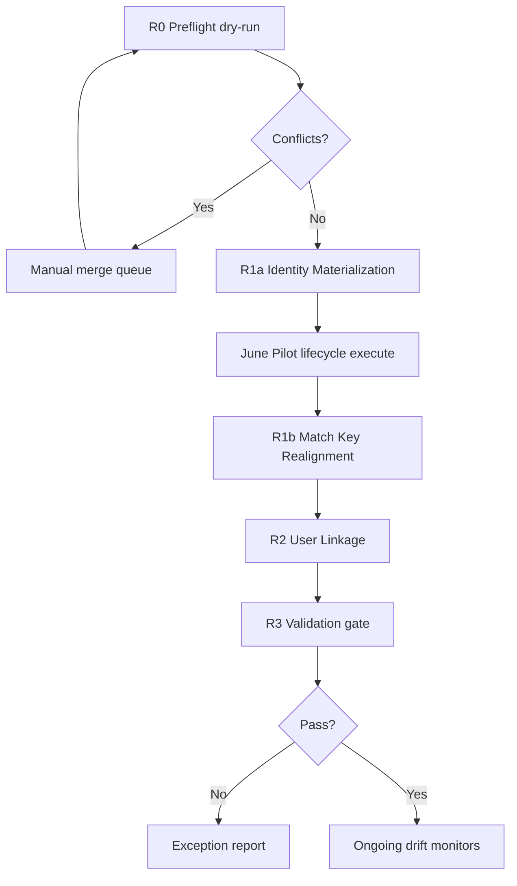

# ADR-044 — Identity Reconciliation

## Статус

**Accepted (Ratified)** — 2026-06-20

Architectural decision only. Implementation (reconciliation service, batch executor, UI) — отдельные deliverables ADR-044 B1–B5.  
Ratification основана на [Impact Analysis — match_key](./ADR-044-impact-analysis-match-key.md) и revision review canonical operational identity key.

## Связанные документы

| ADR | Связь |
|-----|-------|
| [ADR-040](./ADR-040-canonical-hr-snapshot-monthly-diff.md) | `compute_roster_match_key` — источник canonical `person_key` |
| [ADR-042 Phase A](./ADR-042-phase-a-personnel-access-enrollment-architecture.md) | Person as identity anchor; enrollment bridge |
| [ADR-042 Phase B2 Migration Plan](./ADR-042-phase-b2-migration-plan.md) | B2.3 backfill scope (EI-only IIN) |
| [ADR-043 Phase A1 Override Governance](./ADR-043-phase-a1-override-governance.md) | `identity.iin` stewardship; `SCOPE_MIGRATED` |
| [ADR-043 Phase C2 Person Assignment Sync](./ADR-043-phase-c2-person-assignment-sync.md) | Ongoing person/assignment sync |
| [ADR-043 Phase P1 Pilot Checklist](./ADR-043-phase-p1-pilot-checklist.md) | June Pilot acceptance criteria |
| [ADR-044 Impact Analysis](./ADR-044-impact-analysis-match-key.md) | Usage map; namespace gap; R1b strategy |
| June Pilot Identity Chain Audit (2026-06-20) | Trigger: persons.iin NULL, users.employee_id NULL |

---

## Context

June Pilot выявил системный разрыв identity chain:

| Gap | Scale (local pilot DB) | Root cause |
|-----|------------------------|------------|
| `persons.iin IS NULL` при IIN в canonical | 67/87 persons; 64 с canonical IIN | B2.3 backfill читает только `employee_identities` |
| `persons.match_key` namespace ≠ canonical `person_key` | `name:` 67 vs canonical `emp:` 77 | B2.3 использует `iin:`/`name:`, не ADR-040 algorithm |
| `users.employee_id IS NULL` | 273/273 active users | Column added без data backfill; enrollment не связывает users |

Operational chain (person → assignment → employee → link) **работает**.  
Identity materialization (IIN на person, canonical-aligned match_key, user на employee) — **не завершена**.

ADR-044 закрывает gap **без изменения** enrollment/lifecycle business logic, через явную reconciliation policy и **поэтапное** исполнение R1a → R1b → R2.

---

## Architectural decisions (ratified)

### Identity map

```text
Canonical HR Identity     →  person_key = compute_roster_match_key (emp: → iin: → name:|dob:)
Operational Identity      →  persons.iin (natural attribute) + persons.match_key (bridge key ≡ person_key)
Internal Entity Identity  →  person_id, employee_id, user_id (surrogate PKs; не cross-contour keys)
```

### Canonical Operational Identity Key

**Определение:** operational bridge key между HR canonical и `persons` — это **canonical `person_key`** по ADR-040, материализованный в `persons.match_key`.

**Не** единый namespace `iin:*` для всех persons.  
**Не** `person_id` как cross-contour key.

| Ситуация | Целевой `persons.match_key` |
|----------|----------------------------|
| Person ↔ Employee связан; canonical roster key = `emp:{id}` | `emp:{employee_id}` |
| Employee нет; IIN известен | `iin:{12}` |
| IIN неизвестен | `name:…` / `name:|dob:` — флаг `IDENTITY_INCOMPLETE` |

Стратегия **`name:* → iin:*` для всех persons отклонена** — не выравнивает с canonical `emp:` rows (77 на pilot) и не чинит C1 `_resolve_person_ids`.

---

## Decision summary

| Domain | Source of truth (to-be) | Reconciliation phase |
|--------|-------------------------|----------------------|
| **Person IIN** | Effective canonical (`identity.iin`) + fallback chain §1.2 | **R1a** |
| **Person match_key** | Canonical-aligned `person_key` (§ Architectural decisions) | **R1b** (deferred) |
| **User ↔ Employee** | `users.employee_id` | **R2** (deferred) |
| **Employee IIN (legacy)** | `employee_identities` — mirror, not primary | R1a upsert |

### Core invariants

```text
NEVER: INSERT INTO persons for reconciliation (only UPDATE + employee_identities INSERT)

IF persons.iin IS NOT NULL:
  length(persons.iin) = 12
  NO other active person with same iin (uq_persons_iin_active)

IF persons.match_key realigned (R1b):
  persons.match_key MUST equal canonical person_key for that person
  Override scope_keys MUST migrate atomically (SCOPE_MIGRATED)

IF persons.iin IS NULL after R1a:
  Person flagged IDENTITY_INCOMPLETE — documented exception only
```

---

## Execution phases



---

### R0 — Preflight (dry-run)

| | |
|--|--|
| **Цель** | Read-only отчёт: IIN collisions, namespace gap (P5), duplicate persons, override scopes to migrate, user link candidates |
| **Риск** | **NONE** (no writes) |
| **Rollback** | N/A |
| **Validation** | Report generated; HR review of exception queue |
| **June Pilot dependency** | **Recommended** before R1a; not blocking import/snapshot phases |

---

### R1a — Identity Materialization

| | |
|--|--|
| **Цель** | Materialize natural person identity: заполнить `persons.iin` из canonical fallback chain; upsert `employee_identities` для linked employees. **`persons.match_key` не менять.** |
| **Writes** | `UPDATE persons SET iin`; `INSERT employee_identities` (if missing) |
| **Input** | `persons.iin IS NULL` AND `person_status IN ('active','inactive')` |
| **Algorithm** | Resolve `employee_id` → IIN via §1.2 → pre-check `CONFLICT_DUPLICATE_IIN` → UPDATE iin → upsert EI → audit `PERSON_IIN_RECONCILED` |
| **Expected (pilot)** | До 64 persons gain IIN |
| **Риск** | **LOW** |
| **Risk details** | Wrong IIN from bad canonical (Low/Critical → 12-digit validation); duplicate IIN across persons (Medium/Critical → abort person, merge queue) |
| **Rollback** | L1: restore `persons.iin` from pre-R1a CSV per audit log; L2: `pg_restore` pre-R1a snapshot |
| **Validation criteria** | V1a: `persons.iin NULL` with resolvable canonical IIN = 0 (or documented exceptions); V1b: duplicate active IIN = 0; V1c: idempotent re-run = 0 changes; V1d: `employee_identities` IIN present for linked employees where canonical IIN exists |
| **June Pilot dependency** | **Mandatory gate** for full June Pilot (Phases 5–9 of P1 checklist). Enables C2 `_find_person` IIN fallback for `emp:` events on legacy `name:` persons. Without R1a: person sync on existing cohort unreliable; identity validation / integrity audit fail. |

**Explicitly out of R1a scope:** `persons.match_key` change; override scope migration; `users.employee_id`.

---

### R1b — Match Key Realignment

| | |
|--|--|
| **Цель** | Align `persons.match_key` with canonical `person_key` (hybrid S4). Fix namespace gap between ADR-042 persons and ADR-043 lifecycle/overrides. |
| **Writes** | `UPDATE persons.match_key`; migrate `hr_review_overrides.scope_key` / `person_key`; append `SCOPE_MIGRATED` history |
| **Target key rule** | IF employee linked AND canonical uses `emp:{id}` → `emp:{employee_id}`; ELIF IIN resolved AND no uq conflict → `iin:{12}`; ELSE keep `name:*`, log DEFERRED |
| **Expected (pilot)** | ~67 `name:` persons with employee → `emp:{id}`; 20 existing `iin:` unchanged |
| **Риск** | **MEDIUM** (HIGH if blind `iin:*` only) |
| **Risk details** | Override scope orphan (High); `uq_persons_match_key_active` collision (Critical); C1 still broken until complete (Medium — partial R1b worse than none) |
| **Rollback** | Transactional per person; L1: restore match_key + override scopes from pre-R1b export; override history immutable — forward-fix via second migration |
| **Validation criteria** | V2a: namespace gap P5 count = 0 for linked employees; V2b: active overrides resolve under new `PERSON:{person_key}`; V2c: C1 `_resolve_person_ids` returns person_id for sample `emp:` keys; V2d: no duplicate active match_key; V2e: B2 validation §6 empty |
| **June Pilot dependency** | **Not mandatory before June Pilot.** Defer to post-pilot track. Accept during pilot: C1 events may have `person_id` NULL; override scopes on `PERSON:name:…` may not apply to `emp:` canonical rows; UI filters by `emp:` miss legacy events; C2 continues via IIN fallback (requires R1a). New persons created by C2 receive canonical key from event — not affected. |

**Preconditions for R1b:** R1a complete; R0 P3/P4/P5 pass; override scope migration tooling ready; maintenance window; lifecycle execute paused during batch.

**Rejected R1b strategy:** blind `name:* → iin:*` for all persons.

---

### R2 — User Linkage

| | |
|--|--|
| **Цель** | Materialize auth contour: `users.employee_id` for operational login binding and EMPLOYEE-target grants |
| **Writes** | `UPDATE users SET employee_id` (high-confidence only); medium-confidence → review queue |
| **Algorithm** | Priority chain §2.2; no auto-link on ambiguity |
| **Expected (pilot)** | Legacy login pattern users (e.g. `*_{employee_id}`) link with medium confidence → HR review |
| **Риск** | **MEDIUM** (wrong user-employee link → access leak) |
| **Risk details** | Ambiguous name match (Medium/High); false positive login pattern (Low/Medium) |
| **Rollback** | `UPDATE users SET employee_id = NULL` from audit mapping per user |
| **Validation criteria** | V3a: orphan `users.employee_id` = 0; V3b: no two active users on same employee_id; V3c: high-confidence resolvable unlinked = 0; V3d: medium-confidence items in review queue, not auto-applied |
| **June Pilot dependency** | **Not mandatory for HR lifecycle pilot.** Required for **EMPLOYEE-target access grants** and auth audit completeness. Enrollment apply unchanged. Can run parallel or after June Pilot sign-off. |

---

### R3 — Validation gate (post-R2)

| Check | Pass criteria | Phase |
|-------|---------------|-------|
| Resolvable canonical IIN without `persons.iin` | 0 exceptions | R1a |
| Duplicate active IIN | 0 | R1a |
| Namespace gap (linked employee, key ≠ canonical) | 0 | R1b |
| Override scope orphan | 0 active | R1b |
| High-confidence user links unlinked | 0 | R2 |
| Orphan `users.employee_id` | 0 | R2 |

---

## 1. Source of truth for IIN

### 1.1. Primary truth (canonical HR contour)

```text
hr_canonical_snapshot_entries.iin
        ↓
hr_snapshot_effective_entries.effective_payload.iin   (ADR-043)
        ↓
persons.iin                                           (R1a)
```

### 1.2. Fallback chain (reconciliation read order)

| Priority | Source | Condition |
|----------|--------|-----------|
| 1 | Active override `identity.iin` | ADR-043 stewardship |
| 2 | `hr_snapshot_effective_entries.effective_payload.iin` | Active snapshot cache |
| 3 | `hr_canonical_snapshot_entries.iin` | Latest entry for employee_id or match_key |
| 4 | `employee_identities.identity_value` (IIN, valid_to IS NULL) | Legacy operational |
| 5 | `hr_change_events.iin` | Last resort |
| — | **NULL** | All empty or conflicting → IDENTITY_INCOMPLETE |

### 1.3. What is NOT source of truth

| Source | Role after ADR-044 |
|--------|-------------------|
| `persons.match_key` | Bridge key aligned with canonical `person_key` (R1b); not IIN authority |
| `employees.full_name` | Display snapshot |
| B2.3 migration output | Historical; corrected by R1a/R1b |

### 1.4. Invariants (post-R1b)

```text
IF employee linked AND canonical roster key = emp:{id}:
  persons.match_key SHOULD BE emp:{employee_id}

ELIF persons.iin IS NOT NULL AND canonical has no emp: key for this person:
  persons.match_key SHOULD BE iin:{persons.iin}

IF persons.iin IS NULL:
  persons.match_key MAY remain name:*
  Person = IDENTITY_INCOMPLETE
```

---

## 2. Source of truth for user ↔ employee

### 2.1. Primary truth

```text
users.employee_id  →  employees.employee_id  →  employees.person_id  →  persons
```

### 2.2. Link resolution priority (R2 backfill)

| Priority | Match rule | Confidence |
|----------|------------|------------|
| 1 | Existing `users.employee_id` | Certain |
| 2 | `employee_assignment_links` + single active employee per person | High → auto |
| 3 | `employees.person_id` + unique user same normalized `full_name` | Medium → review queue |
| 4 | Login pattern `*_{employee_id}` | Medium → review queue |
| 5 | Canonical `employee_id` + name match | Medium → review queue |
| — | Ambiguous | No auto-link |

**Ratified:** medium-confidence links **require HR review** — no auto-apply in R2 v1.

### 2.3. Ongoing policy

| Event | Policy |
|-------|--------|
| `POST /directory/users` | Require `employee_id` for new HR operational users |
| Enrollment apply | Does not set `users.employee_id` |
| Admin manual link | Allowed with audit `USER_EMPLOYEE_LINKED` |

---

## 3. June Pilot gates (ratified)

| Pilot scope | R1a required? | R1b required? | R2 required? |
|-------------|---------------|---------------|--------------|
| Phases 1–4: Import, review, snapshot promotion | No | No | No |
| Phases 5–6: Lifecycle execute + person sync (existing cohort) | **Yes** | No | No |
| Phase 7–9: Enrollment, UI, sign-off | R1a yes; R1b/R2 optional with documented limitations | Deferred | Deferred |
| EMPLOYEE-target access grants demo | No | No | **Yes** |
| Override on `PERSON:emp:` for legacy persons | No | **Yes** (or accept orphan) | No |
| C1 `person_id` populated on all events | No | **Yes** (or accept NULL + manual) | No |

### Full June Pilot definition

**Full June Pilot** (P1 checklist Phases 1–9) = HR contour end-to-end including lifecycle execute on May→June snapshot pair.

**Minimum gate:** R0 dry-run + **R1a on production pilot DB** before Phase 5 execute.

**R1b and R2:** explicitly **post-pilot** or parallel non-blocking tracks with signed limitation register.

---

## 4. Ongoing sync (post-reconciliation)

| Layer | Responsibility |
|-------|----------------|
| ADR-043 C1 diff | Emit `FIELD_CHANGED identity.iin` |
| ADR-043 C2 sync | Apply IIN to `persons.iin`; new persons get canonical `match_key` from event |
| ADR-044 drift scan (B5) | Weekly canonical IIN vs persons.iin; report-only |
| User create API | Require `employee_id` for HR accounts |

---

## 5. Impact on ADR-042 / ADR-043

| Component | R1a | R1b | R2 |
|-----------|-----|-----|-----|
| C2 person sync | IIN fallback unblocked | Primary match_key lookup fixed | — |
| C1 diff person_id resolution | Partial (IIN not used in C1) | Full for aligned keys | — |
| Override governance | — | Scope migration required | — |
| Enrollment detector | Improved IIN context | match_key alignment | — |
| Access resolver EMPLOYEE grants | — | — | Enabled |
| Lifecycle orchestrator | No change | No change | No change |

**Future code (out of ADR-044 v1):** extend C1 `_resolve_person_ids` with IIN/employee_id fallback — reduces R1b hard dependency.

---

## 6. Out of scope

- Automated person merge
- Changes to enrollment business rules
- Changes to lifecycle orchestrator stages
- DDL / schema changes
- Rewrite of historical `hr_personnel_change_events.person_key`

---

## 7. Deliverables (implementation track)

| Phase | Deliverable |
|-------|-------------|
| ADR-044 B1 | Reconciliation service + R0 dry-run report API |
| ADR-044 B2 | R1a batch executor + audit |
| ADR-044 B3 | R1b batch executor + override scope migration |
| ADR-044 B4 | R2 user link + review queue UI |
| ADR-044 B5 | Validation SQL + Identity health panel + drift cron |

---

## 8. Ratification review

### Open questions — resolved

| # | Question | Decision |
|---|----------|----------|
| 1 | R1b in v1 or defer? | **Defer R1b until after June Pilot** (or parallel with limitations register) |
| 2 | Medium-confidence user links? | **HR review queue only** — no auto-apply |
| 3 | Block lifecycle if `persons.iin IS NULL`? | **Warn only** during pilot; enforce optional in R4 |
| 4 | Blind `name:* → iin:*`? | **Rejected** — use canonical-aligned hybrid (R1b) |

### Recommendation

**Approve with limitations**

| Approve | Limitations (accepted during June Pilot) |
|---------|-------------------------------------------|
| ADR-044 architectural model and phased execution | C1 events may carry `person_id` NULL until R1b |
| R1a as mandatory pre-execute gate | Override scopes on legacy `PERSON:name:…` may not apply to canonical `emp:` rows |
| R1b deferred post-pilot | UI person_key filters inconsistent for legacy cohort |
| R2 deferred; medium links → HR review | EMPLOYEE-target grants demo blocked until R2 |
| Hybrid R1b strategy (not blind iin:*) | Namespace gap metric tracked in R0/R3 reports |

### Execution order (ratified)

1. **R0** dry-run on pilot DB (local + production read-only)
2. **R1a** on production — **before** June Pilot Phase 5 execute
3. June Pilot Phases 1–9 with documented limitations
4. **R1b** — controlled window after pilot sign-off (or hotfix if override blocking)
5. **R2** — high-confidence auto + medium review queue
6. **R3** validation gate → enable drift monitors

---

## Appendix A — Case study (Әбітаев, person_id=115)

| Field | Before | After R1a | After R1b | After R2 |
|-------|--------|-----------|-----------|----------|
| `persons.iin` | NULL | `800115300290` | same | same |
| `persons.match_key` | `name:әбітаев…` | **unchanged** | **`emp:26`** | same |
| `employee_identities` | empty | IIN inserted | same | same |
| C2 `_find_person('emp:26')` | miss → IIN fallback after R1a | **hit via fallback** | **direct hit** | same |
| C1 `person_id` on events | NULL | NULL | **115** | same |
| `users.employee_id` (user 38) | NULL | NULL | NULL | `26` (review queue if medium) |

---

## Appendix B — ADR numbering

| ADR | Scope |
|-----|-------|
| ADR-042 | Personnel access & enrollment platform |
| ADR-043 | Personnel lifecycle orchestration |
| **ADR-044** | Identity reconciliation & materialization |
| ADR-044 Impact Analysis | match_key usage map; supports ratification |
