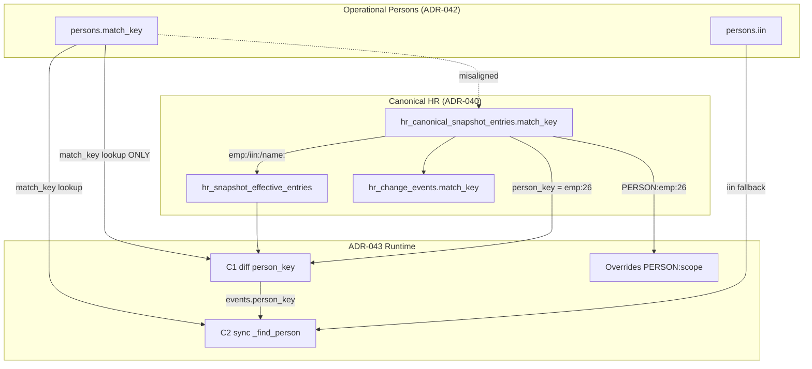

# ADR-044 Impact Analysis — `persons.match_key` Usage Map & `name:*` → `iin:*` Migration Risk

## Статус

**Analysis** (2026-06-20) — no code, no data changes.

## Related

- [ADR-044 Identity Reconciliation](./ADR-044-identity-reconciliation.md)
- June Pilot Identity Chain Audit (2026-06-20)

---

## Executive summary

`persons.match_key` участвует в **6 functional zones** (DB, sync, diff, enrollment, overrides, UI).  
Миграция `name:*` → `iin:*` **не выравнивает** persons с canonical namespace `emp:{employee_id}` (77 roster entries на pilot DB).

| Finding | Impact |
|---------|--------|
| Persons namespace | `name:` 67, `iin:` 20 — **нет `emp:`** |
| Canonical roster namespace | `emp:` 77, `iin:` 2004, `name:` 58 |
| **Cross-namespace gap** | Lifecycle/diff keys = `emp:26`; person 115 = `name:әбітаев...` |
| R1a (`persons.iin` only) | Enables C2 `_find_person` **IIN fallback** without match_key change |
| R1b (`name:` → `iin:`) | Helps only canonical rows keyed by `iin:`; **not** `emp:` rows |
| **Recommended R1b alt** | For linked employees: `match_key = 'emp:' \|\| employee_id` (canonical alignment) |

**Overall migration risk:** **HIGH** if R1b = blind `iin:*` only; **MEDIUM** if split strategy (iin vs emp).

---

## 1. Namespace reality (pilot DB)

```sql
-- persons.match_key
 iin:   20
 name:  67

-- hr_canonical_snapshot_entries (record_kind=roster)
 emp:   77
 iin:  2004
 name:   58
```

**Case Әбітаев (person 115):**

| Store | Key |
|-------|-----|
| `persons.match_key` | `name:әбітаев ерхан сайлаубекұлы` |
| `hr_canonical_snapshot_entries.match_key` | `emp:26` |
| `hr_canonical_snapshot_entries.iin` | `800115300290` |

Canonical key algorithm (`compute_roster_match_key`):

```175:187:app/services/hr_canonical_snapshot_service.py
def compute_roster_match_key(...):
    if employee_id is not None:
        return f"emp:{int(employee_id)}"
    iin_digits = _digits_only(iin)
    if len(iin_digits) == 12:
        return f"iin:{iin_digits}"
```

B2.3 backfill algorithm (persons):

```75:80:alembic/versions/v4w5x6y7z8a9_adr042_phase_b2_3_backfill.py
                    CASE
                        WHEN iin.iin IS NOT NULL THEN 'iin:' || iin.iin
                        ELSE 'name:' || lower(regexp_replace(trim(e.full_name), '\\s+', ' ', 'g'))
                    END AS match_key,
```

**Root architectural tension:** canonical and persons use **different key strategies** for the same human when `employee_id` is bound but `employee_identities` is empty.

---

## 2. Full usage map

Legend: **R** = read, **W** = write, **K** = key/join, **D** = display only  
Risk for `name:` → `iin:` migration: **L** Low, **M** Medium, **H** High, **C** Critical

### Zone A — Database constraints

| Location | Usage | R/W | Risk | Notes |
|----------|-------|-----|------|-------|
| `uq_persons_match_key_active` | UNIQUE on `match_key` WHERE active/inactive | K | **C** | Target `iin:{x}` must not exist on another person |
| `uq_persons_iin_active` | UNIQUE on `iin` WHERE active | K | **C** | Must set `iin` before or with key change |
| `chk_persons_match_key_nonempty` | NOT NULL trim | W | L | — |
| `ix_persons_iin` | Index on `iin` | R | L | — |
| B2 validation §6 | duplicate `match_key` report | R | M | Post-migration must be empty |

### Zone B — ADR-042 B2.3 backfill (historical writer)

| File | Usage | Risk | Notes |
|------|-------|------|-------|
| `v4w5x6y7z8a9_adr042_phase_b2_3_backfill.py` | INSERT persons with `iin:` or `name:` key | — | Already ran; 67 `name:` rows |
| Employee link step | JOIN persons ON `p.iin = src.iin` then `p.match_key = src.match_key` | — | Name-based persons linked via match_key, not IIN |

**Migration impact:** B2.3 not re-run; in-place UPDATE only.

### Zone C — ADR-043 C2 Person Assignment Sync (runtime writer/reader)

| File / function | Usage | R/W | Risk | Break if key changes? |
|-----------------|-------|-----|------|------------------------|
| `_find_person()` | `WHERE match_key = :person_key` then fallback `WHERE iin = :iin` | R | **M** | **emp:** events miss unless IIN fallback or key aligned |
| `_create_person()` | INSERT `match_key = person_key` from event | W | M | New persons get canonical key from event payload |
| `_update_person_fields()` | Updates `iin`, not `match_key` | W | L | — |
| `_load_effective_payload()` | `hr_snapshot_effective_entries` by `person_key` | R | **H** | Cache keyed by canonical `person_key` (`emp:`) |
| All `_handle_*` handlers | Pass `event["person_key"]` to `_find_person` | R | **H** | See namespace gap |

```200:236:app/services/hr_person_assignment_sync_service.py
def _find_person(..., person_key, iin=None):
    ... WHERE match_key = :match_key ...
    if iin and len(str(iin)) == 12:
        ... WHERE iin = :iin ...   -- FALLBACK only in C2
```

**Migration impact:**
- R1a (iin fill): **unblocks C2** via IIN fallback for `emp:` events
- R1b (`name:` → `iin:`): **does not fix** `emp:` event lookup if IIN fallback fails
- R1b alt (`name:` → `emp:{id}`): **fixes C2 primary lookup** for bound employees

### Zone D — ADR-043 C1 Effective Monthly Diff (runtime reader)

| File / function | Usage | R/W | Risk | Break? |
|-----------------|-------|-----|------|--------|
| `_load_effective_roster_entries()` | Index by effective `match_key` (canonical) | R | **H** | Keys are `emp:`/`iin:` — not persons keys |
| `compare_effective_snapshots()` | Loop `person_key` ∈ effective keys | R | **H** | Events emitted with `person_key = emp:26` |
| `_resolve_person_ids()` | `persons WHERE match_key = :person_key` **ONLY** | R | **C** | **No IIN fallback** — `person_id` NULL on events |
| `compute_assignment_key()` | Embeds `person_key` in assignment_key | W | **M** | Changing person key changes assignment_key for new events |

```284:300:app/services/hr_effective_monthly_diff_service.py
def _resolve_person_ids(conn, person_key):
    ... WHERE match_key = :match_key ...   -- NO iin fallback
```

**Migration impact:** Highest-risk zone. `name:` → `iin:` **does not** fix `_resolve_person_ids` for `emp:`-keyed canonical rows.  
**Requires:** `emp:` alignment OR extend `_resolve_person_ids` with employee_id / iin fallback (future code — out of scope here).

### Zone E — ADR-043 Effective Canonical & Overrides

| File / function | Usage | R/W | Risk | Notes |
|-----------------|-------|-----|------|-------|
| `_person_scope_key()` | `PERSON:{person_key}` | K | **H** | Overrides scoped to canonical person_key |
| `_scope_keys_for_entry()` | Override lookup by scope | R | **H** | `PERSON:emp:26` ≠ `PERSON:name:...` |
| `refresh_snapshot_effective_entries()` | Stores `person_key`, `match_key` in cache | W | M | Cache mirrors canonical |
| `resolve_effective_person(person_key=...)` | Loads canonical entry **by match_key** | R | **H** | Admin UI must pass `emp:26` or `iin:...` |
| `hr_review_overrides.scope_key` | `PERSON:{person_key}` | R/W | **H** | Must migrate on key change |
| `hr_review_overrides.person_key` | Denormalized copy | R/W | M | Update with scope migration |
| `hr_review_override_history` | `SCOPE_MIGRATED` event | W | M | Required audit per ADR-043 A1 |

**Migration impact:** Any `persons.match_key` change **without** override scope migration → overrides stop applying.

### Zone F — ADR-043 Personnel Events (immutable journal)

| Table / field | Usage | R/W | Risk | Notes |
|---------------|-------|-----|------|-------|
| `hr_personnel_change_events.person_key` | Stored at detection time | W (once) | **M** | Historical events keep old key; OK |
| `hr_personnel_change_events` indexes | Filter/list by `person_key` | R | M | UI filter by `emp:26` won't find old `name:` events |
| `hr_snapshot_effective_entries.person_key` | Denormalized | W | L | Refreshed on cache rebuild |

**Migration impact:** Do **not** rewrite historical events. Accept dual keys in event history during transition.

### Zone G — ADR-042 Enrollment Detector

| File / function | Usage | Risk | Notes |
|-----------------|-------|------|-------|
| `_resolve_person_assignment_for_event()` | `persons WHERE match_key = event.match_key` | **H** | Uses `hr_change_events.match_key` (canonical format) |
| `detect_enrollment_candidates()` | Passes `match_key` in candidate payload | M | Display / downstream enqueue |

**Migration impact:** Aligning persons to `emp:` or ensuring events resolve via `employee_id` path (lines 59–77) reduces dependency on match_key equality.

### Zone H — Access & Admin Reference

| File | Usage | Risk | Notes |
|------|-------|------|-------|
| `access_resolver_service._fetch_person_context()` | SELECT `match_key` for display | L | Uses `person_id` for resolution |
| `admin_reference_service.search_targets(PERSON)` | Search/display `match_key` | L | Subtitle only |
| `personnel_admin_query_service` | Filter events/overrides by `person_key` param | M | Operator must know canonical key |

### Zone I — HR Import / ADR-040 (canonical contour)

| Component | Usage | Risk | Notes |
|-----------|-------|------|-------|
| `hr_canonical_snapshot_entries.match_key` | Primary diff join key | — | **Not mutated** by ADR-044 |
| `hr_change_events.match_key` | Event identity | — | Canonical namespace |
| `hr_canonical_snapshot_service.compute_roster_match_key` | Produces `emp:`/`iin:`/`name:` | — | Source of truth for HR keys |
| Export services | Display match_key columns | L | No join to persons |

**Migration impact:** ADR-044 reconciles **persons → align with canonical**, not the reverse.

### Zone J — UI

| Component | Usage | Risk | Notes |
|-----------|-------|------|-------|
| `EffectivePersonViewer.tsx` | User enters `person_key` manually | **M** | Must use `emp:26` for bound roster — not obvious |
| `PersonnelEventsPanel` | Filter/display `person_key` | L | — |
| `HrChangeEventDrawer` | Display `match_key` | L | HR import UI |
| `adminSystemApi` / labels | Display only | L | — |

---

## 3. Dependency graph



**Critical edge:** C1 `_resolve_person_ids` reads **only** `persons.match_key`, while event `person_key` follows **canonical** namespace.

---

## 4. Migration strategies compared

### Strategy S1 — R1a only: fill `persons.iin`, keep `match_key`

| Aspect | Assessment |
|--------|------------|
| Risk | **LOW** |
| Fixes | IIN materialization; C2 IIN fallback; duplicate-IIN checks |
| Does not fix | C1 `person_id` on events; override scope; UI key confusion |
| Recommended | **Yes — first production step** |

### Strategy S2 — R1b: `name:*` → `iin:*`

| Aspect | Assessment |
|--------|------------|
| Risk | **HIGH** alone |
| Fixes | Aligns with canonical rows keyed by `iin:`; B2 validation identity |
| Does not fix | **77 `emp:` canonical rows** — case Әбітаев stays misaligned |
| Collision risk | **CRITICAL** if another person already has `iin:{same}` |
| Override impact | **HIGH** — all `PERSON:name:...` scopes must migrate |

### Strategy S3 — R1b alt: `name:*` → `emp:{employee_id}` when employee linked

| Aspect | Assessment |
|--------|------------|
| Risk | **MEDIUM** |
| Fixes | C1 `_resolve_person_ids`; C2 primary lookup; override scope aligns with canonical |
| Preconditions | Single employee per person; no existing person with same `emp:` key |
| Case Әбітаев | `name:...` → `emp:26` — **matches canonical** |
| Recommended | **Yes — for persons with `employees.person_id` set** |

### Strategy S4 — R1b hybrid (recommended in ADR-044 v2)

```text
IF employees.person_id linked AND canonical uses emp:{id}:
    persons.match_key := 'emp:' || employee_id
ELIF resolved IIN present AND no uq conflict:
    persons.match_key := 'iin:' || iin
ELSE:
    keep name:* ; flag IDENTITY_INCOMPLETE
```

| Person bucket (pilot) | Action |
|-----------------------|--------|
| 67 `name:` with employee + canonical `emp:` | → `emp:{id}` (preferred) or iin + service fallback |
| 20 `iin:` | No change |
| Conflicts | Manual merge queue |

---

## 5. Risk matrix: `name:*` → `iin:*` specifically

| # | Risk | Likelihood | Severity | Mitigation |
|---|------|------------|----------|------------|
| R1 | Unique violation on `iin:` key | Medium | Critical | Pre-flight duplicate IIN query; abort batch |
| R2 | Unique violation on `iin` column | Medium | Critical | Set iin before key; same transaction |
| R3 | Override scope orphan `PERSON:name:...` | High | High | Atomic scope migration + `SCOPE_MIGRATED` |
| R4 | C1 still broken for `emp:` canonical | **Certain** | High | Prefer S3/S4 over blind S2 |
| R5 | Historical personnel events keyed old | Certain | Low | Accept; document filter behavior |
| R6 | `assignment_key` drift | Low | Medium | assignment_key embeds person_key; old assignments unchanged |
| R7 | EffectivePersonViewer wrong key | Medium | Medium | Document; later UI search by IIN/name |
| R8 | Concurrent lifecycle execute | Low | Medium | Maintenance window |
| R9 | Wrong IIN from canonical | Low | Critical | 12-digit validation; tier-2 override for identity.iin |

### Risk score (blind `name:` → `iin:`)

| Dimension | Score (1–5) |
|-----------|-------------|
| Data integrity | **5** |
| ADR-043 runtime compatibility | **4** |
| Override governance | **4** |
| Operational complexity | **3** |
| Rollback ease | **2** |
| **Overall** | **HIGH — do not use blind S2 alone** |

### Risk score (hybrid S4)

| Dimension | Score (1–5) |
|-----------|-------------|
| Data integrity | **3** |
| ADR-043 runtime compatibility | **2** |
| Override governance | **3** |
| Operational complexity | **3** |
| Rollback ease | **3** |
| **Overall** | **MEDIUM — acceptable with pre-flight + audit** |

---

## 6. Pre-flight checks (mandatory before any match_key write)

```sql
-- P1: IIN collision across persons
SELECT iin, count(*) FROM persons
WHERE iin IS NOT NULL AND person_status = 'active'
GROUP BY iin HAVING count(*) > 1;

-- P2: Target iin: key occupation
SELECT p.iin, p.person_id, p.match_key
FROM persons p
WHERE p.iin IS NOT NULL AND p.person_status IN ('active','inactive')
  AND EXISTS (
    SELECT 1 FROM persons other
    WHERE other.match_key = 'iin:' || p.iin
      AND other.person_id <> p.person_id
      AND other.person_status IN ('active','inactive')
  );

-- P3: emp: key occupation (for S3)
SELECT e.employee_id, count(DISTINCT p.person_id)
FROM employees e
JOIN persons p ON p.person_id = e.person_id
WHERE p.match_key LIKE 'name:%'
GROUP BY e.employee_id
HAVING count(DISTINCT p.person_id) > 1;

-- P4: Override scopes requiring migration
SELECT count(*) FROM hr_review_overrides
WHERE scope_key LIKE 'PERSON:name:%' AND status = 'active';

-- P5: Canonical vs persons namespace gap
SELECT count(*)
FROM persons p
JOIN employees e ON e.person_id = p.person_id
JOIN hr_canonical_snapshot_entries c ON c.employee_id = e.employee_id AND c.record_kind = 'roster'
WHERE p.match_key NOT IN (c.match_key, 'iin:' || c.iin)
  AND c.iin IS NOT NULL;
```

---

## 7. Safe execution order (per person, single transaction)

```text
1. LOCK person row (FOR UPDATE)
2. Resolve IIN (ADR-044 fallback chain) → abort if conflict
3. UPDATE persons SET iin = :iin WHERE person_id = :id   (if NULL)
4. Migrate hr_review_overrides scope_key / person_key (if any)
5. Compute new_match_key:
     emp:  IF employee linked AND canonical emp: AND NOT EXISTS (other person with that key)
     iin: ELIF IIN AND NOT EXISTS (other person with iin: key)
     else: KEEP name: ; log DEFERRED
6. UPDATE persons SET match_key = :new_key
7. INSERT override history SCOPE_MIGRATED (if step 4)
8. INSERT identity_reconciliation_audit
9. COMMIT
```

**Never:** INSERT new person; never DELETE person.

---

## 8. Impact on ADR-042 / ADR-043 (summary)

| System | Impact of match_key migration |
|--------|------------------------------|
| **ADR-042 B2.3** | Corrects historical output; backfill SQL unchanged |
| **ADR-042 enrollment** | Detector person lookup improves if keys align with `hr_change_events` |
| **ADR-043 C1** | `_resolve_person_ids` works when persons.match_key = canonical person_key |
| **ADR-043 C2** | Primary lookup works; IIN fallback becomes safety net not primary path |
| **ADR-043 overrides** | Requires scope migration in same transaction |
| **ADR-043 lifecycle UI** | Operators can use `emp:` keys consistently |

---

## 9. Recommendations

1. **Do not** execute blind `name:*` → `iin:*` for all 67 persons.
2. **Do** execute R1a (`persons.iin` fill) first — low risk, enables C2 fallback.
3. **Do** adopt **hybrid S4** for R1b:
   - Linked employees → `emp:{employee_id}` (canonical alignment)
   - Unlinked with IIN → `iin:{12}`
   - Else → keep `name:*`, flag incomplete
4. **Always** migrate override `scope_key` atomically with `match_key`.
5. **Extend** ADR-044 B1 reconciliation report with namespace gap metric (P5 query).
6. **Future code** (separate ADR): add `_resolve_person_ids` IIN/employee fallback in C1 — reduces dependence on match_key equality.

---

## 10. Case study closure (Әбітаев)

| Step | Field | Value after S1+R1b(S4) |
|------|-------|-------------------------|
| R1a | `persons.iin` | `800115300290` |
| R1b | `persons.match_key` | **`emp:26`** (not `iin:800115300290`) |
| Overrides | `scope_key` | `PERSON:emp:26` |
| C1 events | `person_id` on new events | Resolved via `_resolve_person_ids` |
| C2 sync | `_find_person('emp:26')` | Direct hit |

Blind `iin:800115300290` would **not** match canonical `emp:26` in C1 — hybrid strategy required.
