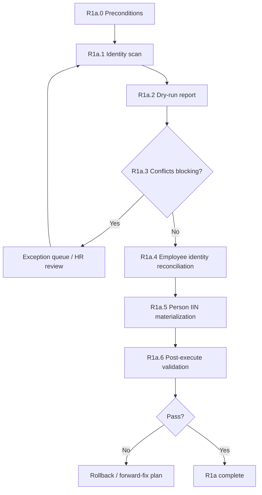

# ADR-044 Phase R1a — Identity Materialization Implementation Blueprint

## Статус

**Blueprint** (2026-06-20) — technical plan only.  
No production code, no migrations, no data writes in this document.

## Связанные документы

| Document | Role |
|----------|------|
| [ADR-044 Identity Reconciliation](./ADR-044-identity-reconciliation.md) | Ratified architecture; R1a scope |
| [ADR-044 Impact Analysis](./ADR-044-impact-analysis-match-key.md) | Namespace gap; C2 IIN fallback |
| [ADR-040](./ADR-040-canonical-hr-snapshot-monthly-diff.md) | Canonical IIN on snapshot entries |
| [ADR-043 Phase B3](./ADR-043-phase-b3-runtime-services.md) | Effective canonical cache |
| [ADR-042 B2 Validation](./ADR-042-phase-b2-validation.sql) | Baseline integrity checks |
| [ADR-043 P1 Pilot Checklist](./ADR-043-phase-p1-pilot-checklist.md) | June Pilot gates |

---

## 1. Scope R1a

### 1.1. In scope

Materialize **natural person identity** from HR canonical into operational registry:

| Target | Action |
|--------|--------|
| `persons.iin` | UPDATE where NULL and resolvable |
| `employee_identities` | INSERT IIN row where missing for linked employee |
| Audit / report | Dry-run + execute journal |

### 1.2. Explicitly out of scope

| Target | R1a policy |
|--------|------------|
| `persons.match_key` | **READ only — MUST NOT change** |
| `persons.full_name`, `birth_date`, `person_status` | **READ only — no UPDATE** |
| `users.employee_id` | **READ only — deferred to R2** |
| `hr_review_overrides` | **READ only** (priority source for IIN resolution) |
| `hr_canonical_*`, effective cache | **READ only** |
| Person merge / INSERT persons | **Forbidden** |
| Override scope migration | **Deferred to R1b** |

### 1.3. Table participation matrix

| Table | Read | Update | Validate only | Notes |
|-------|:----:|:------:|:-------------:|-------|
| `persons` | ✓ | ✓ (`iin`, `updated_at`) | ✓ | Input filter: `iin IS NULL`, status active/inactive |
| `employee_identities` | ✓ | — (INSERT only) | ✓ | Mirror sync; reuse `_insert_employee_identity` semantics |
| `employees` | ✓ | — | ✓ | Resolve `employee_id` via `person_id`; orphan checks |
| `hr_canonical_snapshots` | ✓ | — | ✓ | Locate **active** snapshot (`status = 'active'`) |
| `hr_canonical_snapshot_entries` | ✓ | — | ✓ | Roster `iin`, `employee_id`, `match_key`; fallback source P3 |
| `hr_snapshot_effective_entries` | ✓ | — | ✓ | `effective_payload->>'iin'` / JSON path; primary source P2 |
| `hr_review_overrides` | ✓ | — | ✓ | Active `identity.iin` override; highest priority P1 |
| `hr_change_events` | ✓ | — | ✓ | Last-resort IIN P5 |
| `users` | ✓ | — | — | Actor for `created_by` / audit only |
| `person_assignments` | ✓ | — | ✓ | Orphan / integrity context |
| `employee_assignment_links` | ✓ | — | ✓ | Link integrity pre-checks |
| `security_audit_log` | — | ✓ (INSERT) | ✓ | Event `PERSON_IIN_RECONCILED` (requires event_type extension) |
| `identity_reconciliation_runs` | ✓ | ✓ (INSERT) | — | **Proposed** run journal (ADR-044 B2 DDL) |
| `identity_reconciliation_items` | ✓ | ✓ (INSERT) | — | **Proposed** per-person line items |

**Corrected list:** добавлены `hr_canonical_snapshots`, `hr_review_overrides`, `hr_change_events`, `users`, audit tables.  
**Не участвуют в R1a writes:** `users`, `hr_personnel_change_events`, `enrollment_queue`, override tables.

---

## 2. Source of truth

### 2.1. Authority chain (ratified)

```text
P1  hr_review_overrides          field_path = 'identity.iin', status = 'active'
         ↓ (if absent)
P2  hr_snapshot_effective_entries   active snapshot, roster row, effective_payload.iin
         ↓ (if absent)
P3  hr_canonical_snapshot_entries    latest roster entry for employee_id OR match_key
         ↓ (if absent)
P4  employee_identities              IIN, valid_to IS NULL, 12 digits
         ↓ (if absent)
P5  hr_change_events                 latest iin column for employee_id / match_key
         ↓ (if absent or conflicting)
    NULL → IDENTITY_INCOMPLETE (skip write, report)
```

**Authoritative for R1a materialization:** **P1 → P2** on active canonical snapshot.  
P3–P5 — fallback for persons without effective cache row or override.

### 2.2. Normalization rules

```text
iin_digits = regexp_replace(raw, '[^0-9]', '', 'g')
VALID iff length(iin_digits) = 12 AND iin_digits ~ '^[0-9]{12}$'
STORE as iin_digits (matches chk_persons_iin_format)
```

### 2.3. Non-overwrite rules

| Condition | Action |
|-----------|--------|
| `persons.iin IS NOT NULL` | **Skip** person update; validate consistency with resolved IIN |
| `persons.iin IS NOT NULL` ≠ resolved IIN | **CONFLICT_EXISTING_IIN** — skip; manual review |
| Resolved IIN already on **another** active person | **CONFLICT_DUPLICATE_IIN** — skip; merge queue |
| `employee_identities` active IIN exists **≠** resolved IIN | **CONFLICT_EI_MISMATCH** — skip person **and** EI write |
| `employee_identities` active IIN exists **=** resolved IIN | No INSERT; person update still allowed if `persons.iin` NULL |
| No linked `employees` row | Materialize `persons.iin` only; skip EI step |
| Multiple conflicting sources same priority | **CONFLICT_AMBIGUOUS_SOURCE** — skip |

**Never overwrite** canonical, override, effective cache, match_key, or existing non-null IIN without human approval.

### 2.4. Employee ↔ person resolution

```text
person_id → employees.person_id (0..N; prefer single operational_status IN draft/active/suspended)
         → canonical entry via hr_canonical_snapshot_entries.employee_id
         → effective entry via match_key = 'emp:' || employee_id OR iin match
```

For roster-bound pilot cohort, primary join: `employees.employee_id` = canonical `employee_id`.

---

## 3. R1a execution flow

### Overview



### R1a.0 — Preconditions

| Step | Action |
|------|--------|
| 0.1 | Confirm active canonical snapshot exists (`hr_canonical_snapshots.status = 'active'`) |
| 0.2 | Confirm effective cache populated for active snapshot (or trigger refresh read path) |
| 0.3 | Export pre-R1a snapshot: `persons(person_id, iin, match_key)` + `employee_identities` CSV |
| 0.4 | Pause lifecycle **execute** (recommended, not mandatory for dry-run) |
| 0.5 | Record `run_id`, operator, environment, git revision |

**Gate:** abort if no active snapshot (cannot resolve P2/P3 reliably).

### R1a.1 — Identity scan

Build candidate set:

```text
CANDIDATES = persons WHERE iin IS NULL AND person_status IN ('active', 'inactive')
```

Per candidate `person_id`:

1. Resolve linked `employee_id`(s).
2. Resolve IIN via chain §2.1 (record `source_priority`, raw value).
3. Classify outcome: `APPLY`, `SKIP_INCOMPLETE`, `SKIP_CONFLICT_*`, `SKIP_ALREADY_FILLED`.
4. Persist scan row to `identity_reconciliation_items` (status=`planned`, dry_run=true).

**Output:** candidate count, classified buckets, sample rows for HR review.

### R1a.2 — Dry-run report

Generate human-readable report (API JSON + optional CSV):

| Section | Content |
|---------|---------|
| Summary | totals by outcome class |
| Apply preview | person_id, employee_id, resolved_iin, source, match_key (unchanged) |
| Conflicts | duplicate IIN, EI mismatch, ambiguous source |
| Incomplete | no resolvable IIN |
| Employee identity gaps | linked employee, canonical IIN, no EI row → will INSERT on execute |
| Metrics baseline | §6 KPIs |

**Gate:** HR sign-off on exception list before execute (pilot requirement).

### R1a.3 — Conflict detection (blocking pre-flight)

Run validation gates §4.  
If **blocking** checks fail → **do not execute** until merge queue cleared or exceptions documented.

Non-blocking conflicts → items marked `deferred` in report; execute proceeds for `APPLY` subset only.

### R1a.4 — Employee identity reconciliation

**Order:** execute **before or with** person IIN update in same person transaction.

For each `APPLY` candidate with linked `employee_id`:

```text
IF active EI row exists with same IIN → no-op
ELIF active EI row exists with different IIN → CONFLICT_EI_MISMATCH (abort this person)
ELIF no active EI row AND resolved IIN not used by another employee EI → INSERT employee_identities
ELIF resolved IIN used by another employee EI → CONFLICT_EI_GLOBAL (abort this person)
```

Reuse insert semantics from `hr_import_roster_promotion_service._insert_employee_identity` (skip if exists; `is_primary=TRUE`; `created_by=actor`).

### R1a.5 — Person IIN materialization

Per person transaction:

```text
1. SELECT persons FOR UPDATE WHERE person_id = :id AND iin IS NULL
2. Re-validate conflict checks (race-safe)
3. UPDATE persons SET iin = :iin, updated_at = now() WHERE person_id = :id
4. INSERT employee_identities (step R1a.4) if applicable
5. INSERT identity_reconciliation_items (status=applied)
6. INSERT security_audit_log PERSON_IIN_RECONCILED
7. COMMIT
```

**Idempotency:** second run → `iin IS NOT NULL` → skip with `SKIP_ALREADY_FILLED`; zero writes.

**Batch policy:** sequential per-person transactions (pilot ≤100 persons); optional batch size 10 with SAVEPOINT per person.

### R1a.6 — Post-execute validation

Run §4 post-execute gates + §6 metrics.  
Compare against dry-run expected counts.  
Mismatch → halt sign-off; use rollback §5.

---

## 4. Validation gates

Legend: **BLOCK** = stops execute; **WARN** = report only; **POST** = after execute only.

### Pre-execute (blocking)

| ID | Check | Severity | Blocks? |
|----|-------|----------|---------|
| G1 | Duplicate active IIN across persons (existing data) | CRITICAL | **BLOCK** |
| G2 | Candidate would create duplicate active IIN | CRITICAL | **BLOCK** that person |
| G3 | Invalid IIN format in resolved values | CRITICAL | **BLOCK** that person |
| G4 | Multiple persons same canonical IIN (merge needed) | CRITICAL | **BLOCK** batch |
| G5 | No active canonical snapshot | CRITICAL | **BLOCK** |
| G6 | `persons.iin` NOT NULL ≠ resolved IIN (consistency) | HIGH | **BLOCK** that person |

**G1 SQL:**

```sql
SELECT p.iin, COUNT(*) AS cnt, array_agg(p.person_id) AS person_ids
FROM public.persons p
WHERE p.iin IS NOT NULL AND p.person_status = 'active'
GROUP BY p.iin
HAVING COUNT(*) > 1;
```

**G2 SQL (dry-run simulation):**

```sql
-- Persons that would receive IIN already held by another active person
SELECT target.person_id, resolved.iin, holder.person_id AS holder_person_id
FROM (/* dry-run resolved_iin per person_id */) resolved
JOIN public.persons target ON target.person_id = resolved.person_id
JOIN public.persons holder
  ON holder.iin = resolved.iin
 AND holder.person_status = 'active'
 AND holder.person_id <> target.person_id
WHERE target.iin IS NULL;
```

**G4 SQL:**

```sql
SELECT c.iin, COUNT(DISTINCT p.person_id) AS person_count
FROM public.persons p
JOIN public.employees e ON e.person_id = p.person_id
JOIN public.hr_canonical_snapshot_entries c
  ON c.employee_id = e.employee_id AND c.record_kind = 'roster'
WHERE p.iin IS NULL
  AND c.iin IS NOT NULL
  AND p.person_status = 'active'
GROUP BY c.iin
HAVING COUNT(DISTINCT p.person_id) > 1;
```

### Pre-execute (non-blocking / WARN)

| ID | Check | Severity | Blocks? |
|----|-------|----------|---------|
| G7 | Orphan employees (`person_id IS NULL`, not terminated) | MEDIUM | WARN |
| G8 | Persons with employee link but no canonical roster row | LOW | WARN |
| G9 | EI mismatch (existing EI ≠ canonical) | HIGH | BLOCK that person only |
| G10 | Unresolved canonical IIN (IDENTITY_INCOMPLETE count) | INFO | WARN — expected ≤23 on pilot |

**G7:** reuse ADR-042 B2 validation §1.

### Post-execute (sign-off)

| ID | Check | Severity | Blocks sign-off? |
|----|-------|----------|------------------|
| V1a | Resolvable canonical IIN without `persons.iin` | HIGH | **YES** (except documented exceptions) |
| V1b | Duplicate active IIN | CRITICAL | **YES** |
| V1c | Idempotent re-run diff = 0 writes | MEDIUM | **YES** |
| V1d | Linked employee + canonical IIN → EI row exists | HIGH | **YES** |
| V1e | `match_key` unchanged vs pre-R1a export | CRITICAL | **YES** |
| V1f | ADR-042 B2 §5 duplicate IIN | CRITICAL | **YES** |

**V1a SQL:**

```sql
SELECT p.person_id, p.full_name, p.match_key, c.iin AS canonical_iin
FROM public.persons p
JOIN public.employees e ON e.person_id = p.person_id
JOIN public.hr_canonical_snapshot_entries c
  ON c.employee_id = e.employee_id AND c.record_kind = 'roster'
JOIN public.hr_canonical_snapshots s
  ON s.snapshot_id = c.snapshot_id AND s.status = 'active'
WHERE p.person_status IN ('active', 'inactive')
  AND p.iin IS NULL
  AND length(regexp_replace(c.iin, '[^0-9]', '', 'g')) = 12;
```

**V1e SQL:**

```sql
SELECT p.person_id, p.match_key AS current_key, b.match_key AS before_key
FROM public.persons p
JOIN r1a_pre_export b ON b.person_id = p.person_id
WHERE p.match_key IS DISTINCT FROM b.match_key;
```

---

## 5. Rollback strategy

### 5.1. Is snapshot export required?

**Yes — mandatory before execute.**

| Export | Scope | Purpose |
|--------|-------|---------|
| CSV `r1a_pre_persons.csv` | `person_id`, `iin`, `match_key`, `updated_at` | L1 rollback |
| CSV `r1a_pre_ei.csv` | `identity_id`, `employee_id`, `identity_value`, `valid_to` | L1 EI rollback (INSERT-only undo) |
| Optional `pg_dump -t persons -t employee_identities` | Full row backup | L2 |

### 5.2. Is audit table required?

**Yes — proposed for ADR-044 B2 implementation.**

| Table | Fields (minimal) |
|-------|------------------|
| `identity_reconciliation_runs` | `run_id`, `phase='R1a'`, `dry_run`, `started_at`, `finished_at`, `status`, `operator_user_id`, `metrics_jsonb` |
| `identity_reconciliation_items` | `item_id`, `run_id`, `person_id`, `employee_id`, `action`, `resolved_iin`, `source_priority`, `before_iin`, `after_iin`, `ei_action`, `status`, `error_code` |

Enables per-person rollback without full DB restore.  
Supplement with `security_audit_log` entries (`PERSON_IIN_RECONCILED`).

### 5.3. Is transaction rollback sufficient?

**Partially.**

| Scope | Transaction rollback |
|-------|---------------------|
| Single person failure mid-batch | **Yes** — per-person transaction isolates |
| Full R1a execute undo | **No** — need L1 CSV restore or L2 pg_restore |
| `employee_identities` INSERT | **No auto-undo** — must DELETE by audit `identity_id` list |

**Recommended execute pattern:** one transaction per person; failed person rolls back alone; successful persons retained.

### 5.4. Rollback levels

| Level | Trigger | Action |
|-------|---------|--------|
| **L0** | Dry-run only | No rollback needed |
| **L1** | Partial bad applies | `UPDATE persons SET iin = before_iin FROM r1a_pre_export`; `DELETE FROM employee_identities WHERE identity_id IN (...)` from audit |
| **L2** | Widespread corruption | `pg_restore` pre-R1a snapshot |
| **L3** | Forward-fix | Re-run idempotent reconciliation after fix (preferred over L2 for small drift) |

### 5.5. Reconciliation log

Dedicated journal (**required** for production execute):

- Every attempted person → `identity_reconciliation_items`
- Run summary → `identity_reconciliation_runs`
- Security audit → `security_audit_log` (extend allowed event types in B3)

---

## 6. Metrics (KPI)

Baseline from **June pilot DB** (local, 2026-06-20 audit).  
Post-R1a targets assume no new merge conflicts discovered in G4.

| KPI | Formula | Baseline (pilot) | Target post-R1a |
|-----|---------|------------------|-----------------|
| **M1 — persons.iin coverage** | `active/inactive persons with iin NOT NULL` / `total active/inactive persons` | 20/87 ≈ **23%** | ≥ **74%** (64/87); stretch **100%** minus documented incomplete |
| **M2 — resolvable gap** | count persons: canonical IIN resolvable (V1a query) AND `persons.iin IS NULL` | **64** (est.) | **0** (or ≤ documented exceptions) |
| **M3 — employee_identities coverage** | linked employees with canonical IIN AND active EI row / linked employees with canonical IIN | TBD scan (~33 gap per HR import audit) | **100%** for apply cohort |
| **M4 — duplicate active IIN** | ADR-042 B2 §5 count | **0** (required) | **0** |
| **M5 — unresolved identity count** | persons IDENTITY_INCOMPLETE after R1a | **67** NULL iin (all candidates) | **≤ 23** (87−64); persons without canonical IIN |
| **M6 — match_key drift** | persons where match_key changed vs pre-export | **0** | **0** |
| **M7 — apply success rate** | `items status=applied` / `items status=planned` (apply class) | n/a | **100%** of non-conflict candidates |
| **M8 — idempotent re-run writes** | write count on second execute | n/a | **0** |

### Reporting dashboard (B1 deliverable)

```text
R1a Report
  candidates: 67
  applied: N
  skipped_incomplete: I
  skipped_conflict: C
  ei_inserted: E
  M1 coverage: XX%
  exceptions: [...]
```

---

## 7. Test strategy

### 7.1. Unit tests

| Test | Assert |
|------|--------|
| `normalize_iin` | strips non-digits; rejects ≠12 digits |
| `resolve_iin_priority` | P1 override beats P2 effective beats P3 canonical |
| `resolve_iin_conflict` | existing person IIN ≠ resolved → skip |
| `resolve_iin_duplicate` | target IIN on other active person → skip |
| `classify_candidate` | NULL chain → INCOMPLETE |
| `ei_insert_decision` | missing EI → INSERT; mismatch → CONFLICT |

No DB required; pure functions in `identity_reconciliation_service` (proposed module).

### 7.2. Integration tests

| Test | Setup | Assert |
|------|-------|--------|
| `test_r1a_dry_run_no_writes` | seed person iin NULL + canonical row | zero DB mutations |
| `test_r1a_apply_person_iin` | single candidate | `persons.iin` set; `match_key` unchanged |
| `test_r1a_apply_inserts_ei` | employee linked, no EI | `employee_identities` row created |
| `test_r1a_skips_ei_mismatch` | EI with wrong IIN | no person update |
| `test_r1a_idempotent` | double execute | second run 0 updates |
| `test_r1a_respects_existing_iin` | person already has iin | skip |

Use isolated transaction + rollback pattern from existing ADR-043 tests.

### 7.3. Reconciliation tests

| Test | Assert |
|------|--------|
| Full pilot cohort dry-run | report counts match SQL spot-checks |
| G4 blocking | synthetic duplicate canonical IIN → execute aborted |
| Audit trail | every apply → reconciliation_item + audit log row |
| Rollback L1 | restore CSV → state equals pre-export |

### 7.4. Regression tests

| Area | Verify unchanged |
|------|------------------|
| C2 `_find_person` | still resolves by match_key; IIN fallback after R1a |
| ADR-042 B2 validation §5–§6 | no new duplicates |
| Access resolver | still uses `person_id` |
| Enrollment detector | no change in behavior |
| Override scopes | unchanged keys (R1b deferred) |

Run full ADR-042 + ADR-043 test suites on CI after B2 implementation.

### 7.5. Case study — Әбітаев Ерхан Сайлаубекұлы

| Field | Before R1a | After R1a (expected) |
|-------|------------|----------------------|
| `person_id` | 115 | 115 (unchanged) |
| `employees.employee_id` | 26 | 26 |
| `persons.match_key` | `name:әбітаев ерхан сайлаубекұлы` | **unchanged** |
| `persons.iin` | NULL | **`800115300290`** |
| `employee_identities` | empty | **IIN row for employee 26** |
| Person count for IIN | — | **exactly 1** active person |
| C2 `_find_person('emp:26', iin=...)` | miss primary; fallback after R1a | **fallback hit via iin** |

**Test proof checklist:**

1. Dry-run classifies person 115 as `APPLY`; source P2 or P3.  
2. Execute: single person transaction; no second person with same IIN.  
3. Post: `SELECT match_key FROM persons WHERE person_id=115` equals pre-export value.  
4. Post: `SELECT iin FROM persons WHERE person_id=115` = `'800115300290'`.  
5. Post: `COUNT(*) FROM persons WHERE iin='800115300290' AND person_status='active'` = 1.  
6. Post: EI exists for `employee_id=26`.  
7. Re-run execute: 0 writes for person 115.

---

## 8. June Pilot impact

### 8.1. Unblocked after R1a (Phases 5–9)

| Scenario | Mechanism |
|----------|-----------|
| Lifecycle execute + C2 person sync on **existing cohort** | C2 `_find_person`: primary `match_key` miss → **IIN fallback** works once `persons.iin` filled |
| `FIELD_CHANGED identity.iin` apply | Baseline IIN on person; sync updates consistent |
| Identity validation / integrity audit | M1/M2 KPIs pass; resolvable gap closed |
| Duplicate-IIN safety | `uq_persons_iin_active` enforceable |
| June Pilot Phase 5 gate | **R1a on production** satisfied |

### 8.2. Limitations until R1b

| Limitation | Workaround during pilot |
|------------|-------------------------|
| C1 `_resolve_person_ids` → `person_id` NULL on events | Manual linking; accept NULL in event list |
| `persons.match_key` ≠ canonical `emp:{id}` | C2 uses IIN fallback; document operator confusion |
| Overrides `PERSON:name:…` ≠ `PERSON:emp:26` | Effective override may not apply to canonical row; HR aware |
| Personnel Events filter by `emp:26` misses legacy events | Filter by IIN or person_id |
| Namespace gap metric P5 > 0 | Track in limitation register |

### 8.3. Limitations until R2

| Limitation | Impact |
|------------|--------|
| `users.employee_id` NULL | EMPLOYEE-target access grants demo blocked |
| Auth audit incomplete user↔employee chain | Sysadmin tab shows unlinked users |
| Login binding not materialized | No change to JWT auth itself |

### 8.4. Pilot gate summary

| Gate | Requirement |
|------|-------------|
| Phase 1–4 (import → snapshot) | R1a **not** required |
| Phase 5–6 (lifecycle + sync) | R1a **required** on target DB |
| Phase 7–9 sign-off | R1a **required**; R1b/R2 optional with limitation register |
| EMPLOYEE grants demo | R2 required |

---

## 9. Implementation deliverables (post-blueprint)

| Deliverable | Content |
|-------------|---------|
| **ADR-044 B1** | `identity_reconciliation_service.py` — scan, resolve, dry-run report API |
| **ADR-044 B2** | R1a batch executor CLI/admin endpoint; DDL for reconciliation tables |
| **ADR-044 B2 SQL** | `docs/adr/ADR-044-phase-r1a-validation.sql` — gates G1–G10, V1a–V1f |
| **ADR-042 B3 extension** | `PERSON_IIN_RECONCILED` in security audit allowed types |
| **Runbook** | Operator steps: R0 → dry-run → HR sign-off → execute → V1 |

### Suggested module layout (no code yet)

```text
app/services/identity_reconciliation_service.py
  scan_r1a_candidates(conn, *, snapshot_id=None) -> ScanReport
  run_r1a_reconciliation(conn, *, dry_run=True, actor_user_id) -> R1aReport
  _resolve_iin_for_person(conn, person_id, ...) -> ResolvedIin | Conflict

app/api/identity_reconciliation_router.py   (optional B1)
tests/test_adr044_phase_r1a_identity_materialization.py
```

---

## 10. Blueprint approval checklist

| # | Criterion | Status |
|---|-----------|--------|
| 1 | Scope: iin + EI only; match_key/users untouched | ☐ |
| 2 | Source chain P1→P5 ratified | ☐ |
| 3 | Execution flow R1a.0–R1a.6 accepted | ☐ |
| 4 | Blocking gates G1–G6 + post V1a–V1f accepted | ☐ |
| 5 | Rollback: CSV + audit table + per-person TX | ☐ |
| 6 | KPI baselines/targets agreed with HR | ☐ |
| 7 | Test plan includes Әбітаев case | ☐ |
| 8 | June Pilot gate: R1a before Phase 5 | ☐ |

**Upon approval:** proceed to ADR-044 B1/B2 implementation.

---

## Appendix — Proposed file index

| File | Purpose |
|------|---------|
| `docs/adr/ADR-044-phase-r1a-implementation-blueprint.md` | This document |
| `docs/adr/ADR-044-phase-r1a-validation.sql` | To be created in B2 |
| `docs/runbooks/identity-reconciliation-r1a.md` | To be created in B2 |
