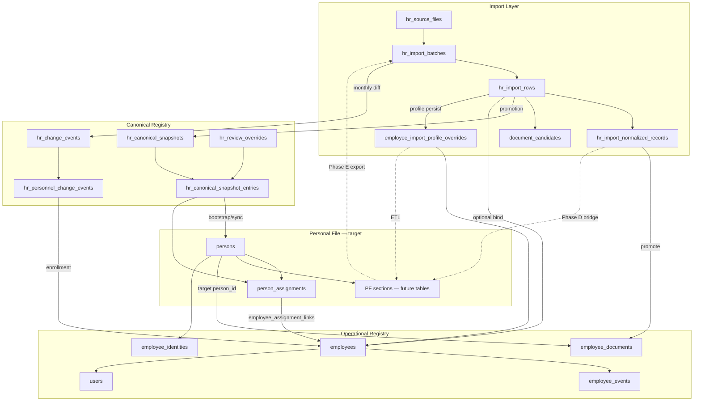

# ADR-047 Appendix — Four-Layer Model & Form Analysis

**Status:** Investigation / Read-only  
**Date:** 2026-06-23  
**Parent:** [ADR-047 — Personnel Personal File Architecture](./ADR-047-personnel-personal-file-architecture.md)  
**Related:** ADR-038, ADR-039, ADR-040, ADR-041, ADR-042, ADR-043, ADR-045

---

## 1. SQL inventory (read-only)

### Script

[`ADR-047-sql-inventory.sql`](./ADR-047-sql-inventory.sql) — только `SELECT`, без DDL/DML.

Запуск:

```bash
psql "$DATABASE_URL" -f docs/adr/ADR-047-sql-inventory.sql
```

### Результат локального прогона (2026-06-23)

Локальный PostgreSQL (`127.0.0.1:5432`) **недоступен** — connection refused. Числа ниже — **ориентиры из ADR и пилота**, не фактические COUNT с production.

| Metric | Reference (docs / pilot) | Source |
|--------|--------------------------|--------|
| `hr_import_rows` (full roster) | ~1076–3000+ | ADR-038 Phase 0 file; ADR-041 |
| `employees` (operational) | ~33 | ADR-041 pilot |
| `persons` | backfill from canonical | ADR-042 B2.3 |
| normalized records per batch | order of thousands (fragments) | ADR-039 |
| `employee_documents` | low tens (enrolled subset) | pilot scale |

**Действие:** выполнить SQL на pilot/production DB и вставить фактические числа в Status Log ADR-047.

---

## 2. Анализ формы личного листка

### 2.1. Три разных документа (не путать)

| Документ | Нормативная база | Роль в Corpsite |
|----------|------------------|-----------------|
| **Личный листок по учету кадров** | Методические рекомендации по личным делам госслужащих РК (Приложение № 2); рекомендуется и для негосударственных организаций | **Target Personal File** — эталон разделов ADR-047 |
| **Дополнение к личному листку** | Приложение № 1 (изменения после приёма: должность, награды, взыскания) | Модель **append-only updates** + HR Events |
| **Контрольный список (Excel)** | Внутренний отчёт медорганизации; `HR_CONTROL_LIST` | **Import Layer** — то, что Corpsite импортирует сегодня |
| **Личная карточка Т-2** | Приказ МО РК № 28 (воинский учёт) | **Out of scope** Phase A; отдельный контур |

**Ключевой вывод:** контрольный листок ≠ личный листок. Контрольный список — **ежемесячный аналитический срез** (~20 колонок, см. parser). Личный листок — **многостраничная анкета** (~16+ блоков). Corpsite импортирует control list, но UI import review **имитирует часть** личного листка через `ImportProfile`.

### 2.2. Официальный личный листок (Приложение № 2) — разделы

| № | Раздел официальной формы | Corpsite control list | Corpsite storage today |
|---|--------------------------|----------------------|------------------------|
| — | Фото 4×6 | ❌ | MISSING |
| 1 | Фамилия, имя, отчество | ✅ `full_name` | `persons`, import `basic` |
| 2 | Прежние ФИО | ❌ | MISSING |
| 3 | Пол | ✅ `sex` | import JSONB only |
| 4 | Дата рождения | ✅ `birth_date` | `persons`, import |
| 5 | Место рождения | ❌ | MISSING |
| 6 | Национальность | ✅ `nationality` | import JSONB only |
| 7 | Гражданство | ⚠️ merged with nationality in parser | import JSONB only |
| 8 | Образование (таблица: ВУЗ, годы, специальность, квалификация, № диплома) | ✅ partial | import `education_records`, normalized `education` |
| 9 | Иностранные языки | ❌ | MISSING |
| 10 | Учёная степень, учёное звание | ✅ partial | import `degrees`, `degree_raw` |
| 11 | Научные труды и изобретения | ❌ | MISSING |
| 12 | Трудовая деятельность (полная биография) | ⚠️ `experience_raw` text | import JSONB; `person_assignments` partial |
| 13 | Близкие родственники | ❌ | MISSING |
| 14 | Государственные и иные награды | ✅ partial | import `award_records` |
| 15 | Воинская обязанность, звание | ❌ | MISSING (Т-2 — отдельно) |
| 16 | Домашний адрес и телефон | ⚠️ phone only | import `phone_raw`; `contacts.phone` |

### 2.3. Дополнение к личному листку (Приложение № 1)

| Блок | Смысл | Corpsite analog |
|------|-------|-----------------|
| I. Данные о работе после заполнения | Назначения, переводы, увольнения с решениями | `employee_events`, `person_assignments`, `hr_personnel_change_events` |
| II.1 Награждения после приёма | Append-only награды | import `award_records` (no post-hire journal) |
| II.2 Дисциплинарные взыскания | Append-only взыскания | MISSING (ADR-036 designed) |

### 2.4. Контрольный список (`import_hr_control_list.py`) — колонки doctors layout

| Колонка Excel | Поле parser | PF section mapping |
|---------------|-------------|-------------------|
| C | full_name | Общие сведения |
| D | birth_date | Общие сведения |
| E | iin | Общие сведения |
| F | sex | Общие сведения |
| G | nationality | Общие / гражданство |
| H | education_raw | Образование |
| I | diploma_specialty_raw | Образование / специальность |
| J | position_raw | Карьера (snapshot) |
| K | qualification_raw | Квалификация |
| L | experience_raw | Стаж / трудовая |
| M | education_training_raw | ПК + postgrad fragments |
| N | certification_raw | Сертификаты + категории |
| O | degree_raw | Учёные степени |
| P | awards_raw | Награды |
| Q | note_raw | Примечание |
| R | phone_raw | Контакты |

**Coverage control list vs official form:** control list покрывает **~45%** блоков личного листка (рабочие/медицинские поля), но **не** семью, адрес, фото, языки, воинский учёт, полную трудовую биографию.

### 2.5. Implication for ADR-047

Personal File Phase B должен:

1. Принять **официальную форму** (Приложение № 2 + № 1) как **section catalog superset**.
2. Принять **control list** как **subset export/import** format (не как полную PF schema).
3. Явно пометить MISSING sections (родственники, адрес, фото, языки, воинский учёт) как Phase C+ или out-of-scope.

---

## 3. Четыре слоя кадровой архитектуры

### 3.1. Обзор

```text
                    ┌─────────────────────────────────────┐
                    │         IMPORT LAYER                │
                    │  Excel → batches → rows → normalized│
                    │  (ephemeral + review + diff input)  │
                    └──────────────┬──────────────────────┘
                                   │ promote / diff / override
                                   ▼
┌──────────────────────────────────────────────────────────────────┐
│                    CANONICAL REGISTRY                             │
│  hr_canonical_snapshots + entries + hr_change_events              │
│  Effective = snapshot + hr_review_overrides (ADR-043)             │
│  Scope: FULL ORGANIZATION ROSTER                                  │
└──────────────┬───────────────────────────────┬───────────────────┘
               │ person/assignment sync         │ optional binding
               ▼                                ▼
┌──────────────────────────────┐   ┌─────────────────────────────┐
│      PERSONAL FILE (target)   │   │   OPERATIONAL REGISTRY       │
│  person_id anchor             │   │   employees + events + docs  │
│  typed PF sections          │◄──┤   Corpsite tasks / Telegram    │
│  survives rehire            │   │   ~pilot subset                │
└──────────────────────────────┘   └─────────────────────────────┘
```

### 3.2. Import Layer

**Назначение:** ingest внешнего control list; human-in-the-loop review; input для diff и bootstrap.

| Table / artifact | Role |
|------------------|------|
| `hr_source_files` | Binary fingerprint + storage ref uploaded Excel |
| `hr_import_batches` | Batch lifecycle (UPLOADED → APPLIED) |
| `hr_import_rows` | Parsed row: `raw_payload`, `normalized_payload`, optional `profile_override` |
| `hr_import_document_candidates` | Pre-normalization document fragments |
| `hr_import_normalized_records` | Typed fragments: training, certificate, category, education |
| `employee_import_profile_overrides` | Persisted import profile per **employee** (proto-PF) |

**Identity anchor:** `row_id`, `batch_id`, optional `employee_id` — **не** `person_id` на большинстве таблиц.

**UI:** `/directory/personnel/import/*`, `ImportProfileCardSections`, normalized review.

**Lifecycle:** batch-scoped; данные **перезаписываются** новым import того же месяца (diff/conflict policy ADR-040).

**Relation to PF:** **feeder**, not permanent store. Phase D Import Bridge → apply to Personal File.

### 3.3. Canonical Registry

**Назначение:** approved **full-roster** HR truth for analytics, monthly diff, export Excel.

| Table | Role |
|-------|------|
| `hr_canonical_snapshots` | Versioned promoted snapshot (one active per source_type) |
| `hr_canonical_snapshot_entries` | Materialized entry: `match_key`, `payload` JSONB, optional `employee_id` |
| `hr_change_events` | Roster-level diff journal (NEW/CHANGED/REMOVED) |
| `hr_review_overrides` | Persistent field corrections (Effective Canonical, ADR-043) |
| `hr_review_override_history` | Override audit |
| `hr_personnel_change_events` | Assignment-centric lifecycle events from diff |
| `persons`, `person_assignments` | Identity / employment episodes (ADR-042 sync target) |

**Identity anchor:** `match_key` (`iin:{12}` | `name:{norm}|dob:{iso}`), optional `person_id` on overrides/events.

**UI:** HR change events, monthly diff panels, `CanonicalSnapshotExportButton`.

**Relation to PF:** Canonical = **organization-wide roster projection**. Personal File = **person-centric dossier**. Overlap: roster row payload ⊂ PF general + snapshot employment. PF **strict superset** per person.

**Export today:** canonical snapshot → Excel (not official personal file layout).

### 3.4. Personal File (target — ADR-047)

**Назначение:** permanent person-centric HR dossier; source for future control sheet **export**; survives termination/rehire.

**Logical sections** (from official form + control list):

- General (identity, photo, contacts)
- Education + postgrad
- Professional documents (certs, categories, specialties)
- Career / employment history
- Awards, degrees, disciplinary (Appendix 1 pattern)
- Document attachments

**Physical storage today:** **does not exist as one layer**. Fragmented across import JSONB, overrides, normalized records, `employee_documents`.

**Identity anchor (target):** `person_id`.

**UI (target):** Person card in «Персонал» (read-only tabs); mutations in «Кадровые процессы».

**Relation to other layers:**

| From | To PF | Mechanism |
|------|-------|-----------|
| Import Layer | PF | Import Bridge: normalized record / profile → person section |
| Canonical | PF | Bootstrap Person + reconcile; not auto-sync on every diff |
| Operational | PF | Employment events + promoted docs link back via `person_id` |
| PF | Canonical | Export subset for roster analytics (future) |
| PF | Control list Excel | Phase E export generator |

### 3.5. Operational Registry

**Назначение:** Corpsite runtime — tasks, Telegram, RBAC, working contacts, KPI.

| Table | Role |
|-------|------|
| `employees` | Operational shell: org, position, rate, dates, `operational_status` |
| `employee_events` | Append-only employment journal |
| `employee_identities` | IIN → employee |
| `employee_documents` | Production document registry (employee-scoped) |
| `users.employee_id` | Account linkage (ADR-044) |
| `employee_assignment_links` | Person assignment ↔ employee |
| `enrollment_queue` / `enrollment_history` | Person → operational enrollment |

**Identity anchor:** `employee_id`; optional `person_id` FK (nullable).

**UI:** `/directory/staff`, `EmployeeDrawer`, `EmployeeProfessionalProfile`, personnel journal.

**Scale:** intentional subset (~pilot 33 vs full roster 3000+).

**Relation to PF:** Operational employee = **one active episode** of Person in Corpsite. PF retains full history when employee row closes.

---

## 4. Связи между слоями



### 4.1. Binding matrix

| Link | Cardinality | Required? | Mechanism |
|------|-------------|-----------|-----------|
| Import row → Employee | N:0..1 | Optional | `hr_import_rows.employee_id`, auto_bind IIN/FIO |
| Normalized record → Employee | N:0..1 | Optional for staging | `hr_import_normalized_records.employee_id` |
| Normalized record → Document | N:0..1 | For promotion | `promoted_document_id` |
| Canonical entry → Employee | N:0..1 | Optional | `hr_canonical_snapshot_entries.employee_id` |
| Employee → Person | N:0..1 | Target: required on enrollment | `employees.person_id` |
| Person → Assignments | 1:N | Canonical employment | `person_assignments.person_id` |
| Assignment → Employee | N:M via links | Enrollment subset | `employee_assignment_links` |
| Person → Personal File sections | 1:N | **Target** | future `person_*` tables |
| User → Employee | 1:0..1 | Operational | `users.employee_id` |

### 4.2. Data flow directions

| Direction | Current | Target (ADR-047) |
|-----------|---------|------------------|
| Import → Canonical | ✅ promotion | retain |
| Import → Operational | ✅ enroll wizard | retain |
| Import → Personal File | ❌ | Phase D bridge |
| Personal File → Export control list | ❌ | Phase E |
| Canonical → Personal File | partial (person sync) | bootstrap + reconcile |
| Personal File → Operational | via enrollment | explicit, not automatic |
| Operational → Personal File | partial (documents, events) | re-key to `person_id` |

---

## 5. Coverage Matrix Addendum (detailed)

Статусы: `FULLY_COVERED` | `PARTIALLY_COVERED` | `IMPORT_ONLY` | `MISSING`

### Общие сведения

| Раздел | Есть? | Где хранится | Статус |
|--------|-------|--------------|--------|
| ФИО | ✅ | `persons.full_name`, `employees.full_name`, import `basic.full_name` | PARTIALLY_COVERED |
| ИИН | ✅ | `persons.iin`, `employee_identities`, import `basic.iin` | PARTIALLY_COVERED |
| Дата рождения | ✅ | `persons.birth_date`, import `basic.birth_date` | PARTIALLY_COVERED |
| Пол | ✅ | import `basic.sex` | IMPORT_ONLY |
| Гражданство | ⚠️ | import `basic.nationality` (shared col) | IMPORT_ONLY |
| Национальность | ⚠️ | import `basic.nationality` | IMPORT_ONLY |
| Семейное положение | ❌ | — | MISSING |
| Адрес | ❌ | — | MISSING |
| Телефон | ⚠️ | import `phone_raw`, `contacts.phone`, `users.phone` | PARTIALLY_COVERED |
| Email | ❌ | — (users: google_login only) | MISSING |
| Фото | ❌ | — | MISSING |

### Образование

| Раздел | Есть? | Где хранится | Статус |
|--------|-------|--------------|--------|
| Базовое образование | ✅ | import `education_records`, normalized `education`, `employee_documents` | PARTIALLY_COVERED |
| Учебное заведение | ✅ | `education_records[].institution` | PARTIALLY_COVERED |
| Специальность | ✅ | `education_records[].specialty`, `diploma_specialty_raw` | PARTIALLY_COVERED |
| Квалификация | ⚠️ | import `qualification_raw`, `basic.qualification_raw` | IMPORT_ONLY |
| Год окончания | ✅ | `education_records[].completed_at` | PARTIALLY_COVERED |
| Несколько образований | ✅ | array `education_records[]` | PARTIALLY_COVERED |

### Постдипломная подготовка

| Раздел | Есть? | Где хранится | Статус |
|--------|-------|--------------|--------|
| Интернатура | ✅ | import `education.internship[]` | IMPORT_ONLY |
| Резидентура | ✅ | import `education.residency[]` | IMPORT_ONLY |
| Магистратура | ✅ | import `education.masters[]` | IMPORT_ONLY |
| Докторантура | ⚠️ | import `education.phd[]`, `degree_raw` overlap | IMPORT_ONLY |

### Профессиональные документы

| Раздел | Есть? | Где хранится | Статус |
|--------|-------|--------------|--------|
| Сертификаты | ✅ | import, normalized, `employee_documents` | PARTIALLY_COVERED |
| Категории | ✅ | import, normalized | PARTIALLY_COVERED |
| Специальности | ✅ | `medical_specialties`, doc FK | PARTIALLY_COVERED |
| Сроки действия | ✅ | `valid_until`, computed expiry | PARTIALLY_COVERED |
| История изменений | ⚠️ | `lifecycle_status=SUPERSEDED`, override history | PARTIALLY_COVERED |

### Карьера

| Раздел | Есть? | Где хранится | Статус |
|--------|-------|--------------|--------|
| Приём | ✅ | `employee_events` HIRE / ENROLLED_FROM_IMPORT | PARTIALLY_COVERED |
| Переводы | ✅ | TRANSFER, `person_assignments` | PARTIALLY_COVERED |
| Назначения | ✅ | `person_assignments`, employees snapshot | PARTIALLY_COVERED |
| Увольнения | ✅ | TERMINATION, assignment closed | PARTIALLY_COVERED |
| Повторный приём | ⚠️ | new employee row; REHIRE not in DB CHECK | PARTIALLY_COVERED |
| История должностей | ⚠️ | `employee_events`, assignments | PARTIALLY_COVERED |
| История подразделений | ⚠️ | same | PARTIALLY_COVERED |

### Дополнительные сведения

| Раздел | Есть? | Где хранится | Статус |
|--------|-------|--------------|--------|
| Награды | ✅ | import `award_records[]` | IMPORT_ONLY |
| Учёные степени | ✅ | import `degrees.records[]` | IMPORT_ONLY |
| Учёные звания | ❌ | — | MISSING |
| Дисциплинарные взыскания | ❌ | ADR-036 only | MISSING |
| Поощрения | ❌ | ADR-036 BONUS only | MISSING |

### Документы / файлы

| Раздел | Есть? | Где хранится | Статус |
|--------|-------|--------------|--------|
| Сканы документов | ⚠️ | `employee_documents.file_url`, candidates URLs | PARTIALLY_COVERED |
| Фото сотрудника | ❌ | — | MISSING |
| Вложения | ⚠️ | `hr_source_files`, candidates `storage_path` | IMPORT_ONLY |
| Файловое хранилище | ⚠️ | batch storage only | PARTIALLY_COVERED |

**Totals:** FULLY_COVERED **0** | PARTIALLY_COVERED **22** | IMPORT_ONLY **12** | MISSING **8**

---

## 6. Personal File readiness (migration estimate)

### Ready without data migration (reuse infrastructure)

- Reference catalogs (`document_types`, `medical_specialties`)
- `employee_events` journal + UI
- `employee_documents` CRUD (for enrolled employees)
- Import review UI (`ImportProfileCardSections`)
- Override/provenance patterns (`hr_review_overrides`)
- `persons` / `person_assignments` schema

### Requires data migration (ETL)

| Source | Est. volume | Target |
|--------|-------------|--------|
| `hr_import_rows` + `profile_override` | full roster rows | `person_*` sections |
| `employee_import_profile_overrides` | enrolled subset | person-scoped PF |
| `hr_import_normalized_records` | high (fragments) | typed section rows |
| `employee_documents` | low–medium | add `person_id` |
| `hr_canonical_snapshot_entries.payload` | full roster | bootstrap Person |

### Requires new tables / subsystems

- `files` + photo
- `person_education`, `person_awards`, `person_degrees`, etc.
- `person_general_details` (address, marital, birth place)
- `hr_orders` (optional Phase 2)
- disciplinary / rewards tables

---

## 7. TOP-10 Phase B entities (proposal)

| # | Entity | Purpose |
|---|--------|---------|
| 1 | `files` | Photos, scans, attachments metadata |
| 2 | `person_general_details` | sex, citizenship, nationality, address, marital, birth_place |
| 3 | `person_education` | Typed education + postgrad rows |
| 4 | `person_professional_documents` | Certs, categories at person scope (or `employee_documents.person_id`) |
| 5 | `person_awards` | Awards (Appendix 1 / section 14) |
| 6 | `person_academic_degrees` | Degrees + academic titles |
| 7 | `person_employment_history` | Unified career timeline (view on assignments + events) |
| 8 | `person_file_audit` | Cross-section change log + provenance |
| 9 | `hr_orders` | Formal order entity (number, date, file) |
| 10 | `person_relatives` | Family block (official form §13) — Phase C+ |

---

## 8. A vs B — final assessment

**ADR-047 = B (новый person-centric домен) + substantial ETL from existing layers.**

| Criterion | Refactor (A) | New domain (B) |
|-----------|--------------|----------------|
| Aggregate root | Would reuse one existing table | New logical `Personal File` on `person_id` |
| FULLY_COVERED sections | Would expect ≥1 | **0** today |
| Data location | Single schema to rename | 5+ fragmented stores |
| Import pipeline | Becomes primary | Becomes **feeder** |
| Canonical registry | Replaced | **Coexists** (roster analytics) |
| Operational registry | Replaced | **Coexists** (Corpsite runtime) |

**Argument:** Corpsite already has four distinct layers (Import, Canonical, Operational, proto-PF in JSONB). ADR-047 **formalizes Personal File as fifth logical layer** anchored on `person_id`, connects existing layers via bridges, and does **not** refactor them away.

---

## Status Log

| Date | Change |
|------|--------|
| 2026-06-23 | Initial appendix: form analysis, four-layer model, SQL script (DB not run locally) |
