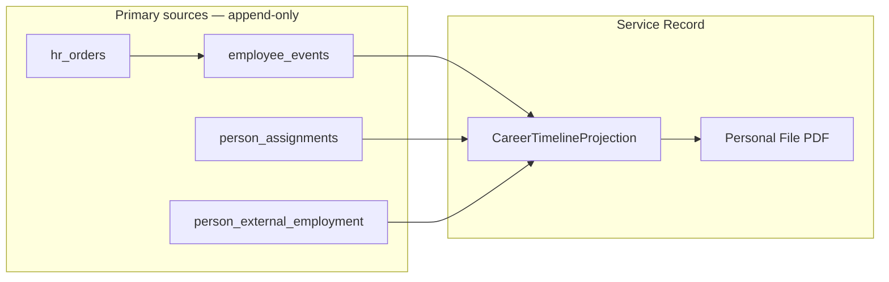

# ADR-047 Appendix — Service Record & Personal File PDF Export

**Status:** Investigation / Read-only  
**Date:** 2026-06-23  
**Parent:** [ADR-047 — Personnel Personal File Architecture](./ADR-047-personnel-personal-file-architecture.md)  
**Related:** [ADR-047 Appendix — Four-Layer Model](./ADR-047-appendix-four-layer-model.md), ADR-032, ADR-036, ADR-042, ADR-043, ADR-045

---

## 1. Service Record Audit

### 1.1. Источники данных (фактическое состояние)

| Source | Table / field | Scope | Career fields | Provenance |
|--------|---------------|-------|---------------|------------|
| Operational journal | `employee_events` | `employee_id` | event_type, effective_date, from/to org/position/rate, `order_ref`, `comment`, `metadata`, `event_class`, `lifecycle_status` | Manual HR actions, terminate, transfer (ADR-032/036) |
| Canonical employment episodes | `person_assignments` | `person_id` | org_unit_id, position_id, rate, start_date, end_date, lifecycle_status, employment_type, assignment_key | Canonical sync (ADR-043 C2), enrollment |
| Canonical diff events | `hr_personnel_change_events` | `person_id` (optional), `person_key` | event_type, field_path, old/new JSONB, detected_at, status | Monthly diff (ADR-043 C1) |
| Operational snapshot | `employees` | `employee_id`, optional `person_id` | current org, position, rate, date_from, date_to, operational_status | Snapshot «сейчас» |
| Identity | `persons` | `person_id` | iin, full_name, birth_date — **no career** | ADR-042 |
| Roster text | `hr_import_rows.normalized_payload.experience_raw` | row / batch | free-text трудовая биография | Import only |
| Canonical roster | `hr_canonical_snapshot_entries.payload` | match_key | position_raw, department, rate, experience_raw (snapshot) | ADR-040 promotion |
| Orders (designed) | `hr_orders` | — | **TABLE DOES NOT EXIST** | ADR-036 Phase 1b |
| Order link | `employee_events.order_ref` | per event | TEXT only, often NULL | Transitional ADR-036 |

**Критично:** `employee_events` **не имеет** `person_id`. Связь с Person только через `employees.person_id`.

### 1.2. Покрытие типов кадровых событий

| Event type | Source today | Can reconstruct? | Notes |
|------------|--------------|------------------|-------|
| **Приём (HIRE)** | `employee_events` (HIRE) | ⚠️ Partial | Создание employee не всегда пишет HIRE; enroll-from-import → `EMPLOYEE_ENROLLED_FROM_IMPORT` (PERSONNEL, not HIRE) |
| **Перевод (org change)** | `employee_events` TRANSFER; `hr_personnel_change_events` TRANSFER / DEPARTMENT_CHANGED | ⚠️ Partial | Operational vs canonical diff — разные контуры |
| **Смена должности** | POSITION_CHANGE; personnel POSITION_CHANGED | ⚠️ Partial | UI: transfer drawer + events API |
| **Смена подразделения** | TRANSFER (required org change); DEPARTMENT_CHANGED in personnel events | ⚠️ Partial | Same-unit position change ≠ transfer |
| **Смена ставки** | RATE_CHANGE; personnel RATE_CHANGED | ⚠️ Partial | |
| **Увольнение** | TERMINATION + employees.date_to; personnel TERMINATED_PERSON / CLOSED_ASSIGNMENT | ⚠️ Partial | Terminate often **order_ref=NULL** |
| **Повторный приём** | New `employees` row + optional new HIRE; REHIRE in registry **not in DB CHECK** | ❌ Weak | No unified rehire semantics |
| **Исправление** | CORRECTION | ✅ | Audit, not always shown in service record |
| **Enrollment from import** | EMPLOYEE_ENROLLED_FROM_IMPORT | ⚠️ | Operational audit, not formal hire order |

### 1.3. `employee_events` — implemented types (DB CHECK)

From Alembic migrations (head chain):

`HIRE`, `TRANSFER`, `CORRECTION`, `TERMINATION`, `POSITION_CHANGE`, `RATE_CHANGE`, `EMPLOYEE_ENROLLED_FROM_IMPORT`

Registry (`hr_event_registry.py`) additionally defines **REHIRE**, leave types, BONUS, disciplinary — **not in DB**, not creatable via UI.

**API exposure:** `list_employee_events` filters to first 6 types (excludes ENROLLED_FROM_IMPORT from filter list but rows exist in DB).

**Fields per event:**

```text
event_id, employee_id, event_type, event_class, lifecycle_status,
effective_date,
from_org_unit_id, from_position_id, from_rate,
to_org_unit_id, to_position_id, to_rate,
order_ref (TEXT), comment, metadata (JSONB),
created_by, created_at
```

**Voiding:** `lifecycle_status IN ('APPROVED', 'VOIDED')` — ADR-035; voided events must be excluded from service record projection.

### 1.4. `person_assignments` — employment episodes

```text
assignment_id, person_id, org_unit_id, position_id, rate,
start_date, end_date, lifecycle_status (active|closed|voided),
employment_type, active_flag, assignment_key, source,
canonical_snapshot_id, canonical_entry_id
```

**Strengths:** person-scoped; supports multiple episodes; closed assignments = history.

**Gaps:**

- No `order_ref` / order FK on assignment row
- Populated primarily from **canonical monthly diff**, not every operational `employee_event`
- Operational transfer may update `employees` + `employee_events` **before** canonical sync updates assignments
- `end_date` may be incomplete on active assignments

### 1.5. `hr_personnel_change_events` — diff journal

Event types: `NEW_PERSON`, `TERMINATED_PERSON`, `NEW_ASSIGNMENT`, `CLOSED_ASSIGNMENT`, `TRANSFER`, `POSITION_CHANGED`, `DEPARTMENT_CHANGED`, `RATE_CHANGED`, `FIELD_CHANGED`, `OVERRIDE_*`.

**Strengths:** `person_id`, `assignment_id`, structured old/new values.

**Gaps:**

- **detected_at** ≠ **effective_date** (monthly import detection time)
- Tied to **snapshot pair** (previous_snapshot_id → snapshot_id)
- Status workflow: detected → acknowledged → enrolled
- Not a substitute for legal service record (no order, no HR officer signature chain)
- Admin API lists by `person_key`, not primary PF UI

### 1.6. `order_ref` / orders

| Capability | Status |
|------------|--------|
| `employee_events.order_ref` | ✅ column exists |
| Populated on transfer/position/rate | ⚠️ optional in forms |
| Populated on terminate | ❌ code passes `order_ref=None` |
| `hr_orders` table | ❌ not implemented (ADR-036 Phase 1b) |
| Order date, signatory, file | ❌ |

### 1.7. Можно ли **сейчас** построить непрерывную карьерную историю по `person_id`?

**Ответ: частично — только при выполнении условий. Полная непрерывность — нет.**

| Scenario | Feasible? | How |
|----------|-----------|-----|
| Person with one linked employee, all changes via events | ⚠️ Mostly | JOIN `employees` ON `person_id` → `employee_events` ORDER BY effective_date |
| Person with multiple employees (rehire) | ⚠️ Fragmented | Must UNION events across all `employees` for `person_id`; no native API |
| Person in canonical only (no employee) | ⚠️ Assignments only | `person_assignments` + `hr_personnel_change_events`; no operational events |
| Person with only import row (no person yet) | ❌ | `experience_raw` text only |
| Pre-Corpsite career (other employers) | ❌ | Only if typed into `experience_raw` import text |
| Single chronological timeline merging all sources | ❌ | Three parallel timelines without merge rules |

**Blockers for continuous timeline:**

1. No `person_id` on `employee_events`
2. No merge service / API «Career timeline by person»
3. `person_assignments` and `employee_events` can **diverge**
4. `hr_personnel_change_events` use different time semantics (detected_at)
5. HIRE vs ENROLLED_FROM_IMPORT inconsistency
6. REHIRE not implemented
7. Missing orders (legal basis)

---

## 2. Service Record Model (draft for ADR-047)

### 2.1. Definition

**Послужной список (Service Record)** — хронологическое представление кадровых назначений и изменений занятости человека в организации (и опционально внешний стаж), с основанием и приказом.

Official form reference: личный листок §12 «Трудовая деятельность» + Дополнение §I «Данные о работе после заполнения листка».

### 2.2. Minimal entry structure

| Field | Required | Description |
|-------|----------|-------------|
| `entry_date` | ✅ | Effective date of change (not system created_at) |
| `event_type` | ✅ | HIRE, TRANSFER, POSITION_CHANGE, RATE_CHANGE, TERMINATION, REHIRE, ASSIGNMENT_START, ASSIGNMENT_END, EXTERNAL_EMPLOYMENT, … |
| `org_unit_id` / display name | ✅* | *After event; for TERMINATION may be from_* only |
| `position_id` / display name | ✅* | |
| `rate` | ⚠️ | When applicable |
| `basis` | ⚠️ | Text: «приказ», «трудовой договор», «import reconciliation» |
| `order_ref` | ⚠️ | Number or formatted order display |
| `order_id` | ⚠️ | FK → `hr_orders` (Phase 1b) |
| `comment` | ❌ | Free text |
| `source_system` | ✅ | `employee_event`, `person_assignment`, `personnel_change_event`, `manual_external`, `import_text` |
| `source_id` | ✅ | FK to source row for provenance |
| `lifecycle_status` | ✅ | Include APPROVED only; exclude VOIDED |

### 2.3. Primary vs computed storage

| Data | Primary (write once) | Computed (projection) |
|------|----------------------|------------------------|
| Event type, effective date | `employee_events` INSERT | — |
| Org / position / rate after event | `employee_events.to_*` | Current row display names from directory |
| Employment episode boundaries | `person_assignments` start/end | Overlap detection |
| Order number/date/file | **`hr_orders`** (future primary) | Display string in timeline |
| Service record sorted list | — | **Projection** from events + assignments |
| External/pre-hire employment | `person_external_employment` (future) or import text | Parsed segments optional |
| Full «трудовая деятельность» narrative | — | PDF section may render table + narrative |

**Principle:** не дублировать mutable snapshot в отдельной таблице; append-only sources remain SoT.

### 2.4. Recommended section in Personal File UI

```text
Personal File
  ├── General
  ├── Education
  ├── Professional documents
  ├── Service Record (Послужной список)   ← this appendix
  │     ├── Timeline view (table)
  │     └── Source filter: org-only | include external
  └── ...
```

---

## 3. Personal File PDF — architectural analysis

### 3.1. Scope

Design only. **No PDF library, template, or endpoint exists** in Corpsite today.

Existing export: `export_canonical_snapshot_xlsx` — roster Excel, not personal PDF.

### 3.2. PDF sections vs data sources

| PDF section | Official form ref | Source today | Source after ADR-047 |
|-------------|-------------------|--------------|----------------------|
| **Фото** | Листок (4×6) | MISSING | `persons.photo_file_id` → `files` |
| **Общие сведения** | §1–7 | `persons` partial; import `basic` | `persons` + `person_general_details` |
| **Образование** | §8 | import JSONB; normalized; `employee_documents` | `person_education[]` |
| **Специализации** | diploma specialty | import; `medical_specialties` on docs | `person_education.specialty` + doc FK |
| **Сертификаты** | certs in portfolio | import; `employee_documents` | `person_professional_documents` |
| **Категории** | qual category | import; normalized category | `person_qualification_categories` |
| **Трудовая деятельность** | §12 (full biography) | `experience_raw` text | Structured external employment + narrative merge |
| **Послужной список** | Appendix 1 §I | `employee_events` per employee; `person_assignments` | **Service Record projection** by `person_id` |
| **Награды** | §14 | import `award_records` | `person_awards` |
| **Учёные степени/звания** | §10 | import `degrees` | `person_academic_degrees` |
| **Вложения (optional)** | copies in dossier | `file_url` text | `files` + appendix list |
| **Подпись / дата формирования** | footer | — | generated metadata |

### 3.3. PDF generation architecture (proposal)

```text
GET /directory/personnel/persons/{person_id}/personal-file/pdf
  → PersonalFileAggregateService.load(person_id)
  → PdfTemplateRenderer.render(template=PF_OFFICIAL_v1, data=aggregate)
  → application/pdf stream
```

| Layer | Responsibility |
|-------|----------------|
| **Aggregate service** | Load all PF sections by person_id; resolve display names (org, position) |
| **Template** | HTML/CSS → PDF (WeasyPrint / Playwright / external report service) — **decision deferred** |
| **Versioning** | `template_version` in PDF footer for audit |
| **RBAC** | ADR-042 HR access; employee self-service optional future |
| **Storage** | Generate on demand; optional archive to `files` with checksum |

**Non-goals Phase 1 PDF:** digital signature, EDMS integration, batch print all staff.

### 3.4. Template strategy

| Option | Pros | Cons |
|--------|------|------|
| HTML template → PDF | Matches official layout; easy iterate | Server deps (WeasyPrint) |
| Fillable PDF (AcroForm) | Pixel-perfect government form | Hard to maintain |
| DOCX mail merge | HR familiar | Two-step, not web-native |

**Recommendation:** HTML template aligned with Методрекомендации Приложение № 2 layout; PDF as render target.

---

## 4. Export Strategy

### A. Control Sheet Export (Excel)

| Aspect | Definition |
|--------|------------|
| **Purpose** | Operational control, monthly reconciliation, HR analytics, management reporting |
| **Audience** | HR analysts, chief physician, stat reporting |
| **Primary source** | **Canonical Registry** (Effective Canonical = snapshot + overrides) |
| **Secondary source** | Personal File subsets where promoted to canonical |
| **Scope** | **Full organization roster** (~1000–3000+ rows) |
| **Grain** | One row per roster entry / assignment slice (control list layout) |
| **Format** | **Excel** (.xlsx) — **implemented** (`export_canonical_snapshot_xlsx`) |
| **Direction** | Personal File → canonical subset → control sheet (target); today: import → canonical → export |
| **Update cadence** | Monthly (import cycle) |
| **PII** | Full IIN in privileged HR context (ADR-040) |

**Columns (typical):** FIO, IIN, DOB, sex, department, position, education, training, certs, categories, rate, experience — mirrors `import_hr_control_list.py` doctors layout.

### B. Personal File Export (PDF)

| Aspect | Definition |
|--------|------------|
| **Purpose** | Official personnel dossier document; archive; employee copy; print for personal file folder |
| **Audience** | HR file clerk, employee, labor inspection, accreditation |
| **Primary source** | **Personal File** (person-centric aggregate) |
| **Scope** | **One person** per document |
| **Grain** | Multi-section narrative + tables (official form) |
| **Format** | **PDF** — **not implemented** |
| **Direction** | PF → PDF (one-way export) |
| **Update cadence** | On demand + after material PF changes |
| **PII** | Full identity; stricter access log |

### Comparison matrix

| Dimension | Control Sheet (Excel) | Personal File (PDF) |
|-----------|----------------------|---------------------|
| Unit | Organization | Individual |
| Primary layer | Canonical Registry | Personal File |
| Operational registry | Optional binding column | Employment episodes + events |
| Import layer | Input feed | Bootstrap only |
| Time horizon | Snapshot month | Full history |
| Legal status | Internal report | Dossier document |
| Implementation | ✅ Exists | ❌ Planned |
| Service record | Row snapshot (position now) | Full timeline section |

**Critical distinction:** Control sheet answers «**who is where now** (org-wide)»; Personal File PDF answers «**who is this person over time**».

---

## 5. ADR-047 Update Proposal (do not edit main ADR yet)

### Proposed new sections for ADR-047 main document

#### § Service Record

- Definition and relationship to official form §12 + Appendix 1
- Projection model (not primary mutable table)
- Merge rules: employee_events > person_assignments for operational org; personnel_change_events for canonical reconciliation audit
- VOIDED event exclusion
- External employment handling

#### § Career Timeline

- API sketch: `GET /persons/{id}/career-timeline`
- Response: ordered entries with provenance
- UI: tab in Person card (Персонал read-only)
- Multi-employee rehire aggregation via `person_id`

#### § Personal File PDF Export

- Endpoint, RBAC, template version
- Section catalog mapped to aggregate service
- On-demand generation; optional archived copy in `files`

#### § Export Strategy

- Dual export model (this appendix §4)
- Control sheet remains canonical/roster Excel
- PF PDF never replaces monthly import; import validates PF

---

## 6. Key Question — Architectural Conclusion

### A. Separate `service_record` table (mutable)

| Pros | Cons |
|------|------|
| Simple HR mental model | **Third copy** of career data alongside events and assignments |
| Easy PDF query | Drift from SoT; sync nightmares |
| Manual rows for external jobs | Violates ADR-033 append-only spirit if edited in place |

### B. HR Events + Assignments + Orders → Service Record as projection ✅ **Recommended**

| Pros | Cons |
|------|------|
| Aligns with ADR-032/033/036 (events → snapshot) | Requires merge logic across sources |
| Single write path for org career | person_assignments vs employee_events divergence must be reconciled |
| `person_assignments` already models episodes | External employment needs extension table |
| ADR-036 `hr_orders` plugs in as order SoT | Not implementable until orders Phase 1b |

### Decision

**B — projection / materialized view**, with these refinements:

1. **Operational service record (in-org):** projected from `employee_events` (APPROVED, EMPLOYMENT class) joined via `employees.person_id`, enriched with order display from `hr_orders` when available.

2. **Canonical employment episodes:** `person_assignments` provide person-scoped **episode boundaries**; use for gap detection and pre-enrollment history from canonical sync — **not** as duplicate event log.

3. **External / pre-hire employment:** separate **`person_external_employment`** (or PF section table) for rows **not** originating from Corpsite events — import `experience_raw` migrates here as structured or narrative blocks.

4. **Optional cache:** `person_service_record_cache` (JSONB snapshot + `generated_at`) only for PDF performance — **invalidate on event insert**, not authoritative.

5. **Do not** store service record as editable primary table; HR edits happen via **«Оформить»** → new `employee_events` row (ADR-036).



---

## 7. Immediate gaps for Service Record + PDF

| # | Gap | Priority |
|---|-----|----------|
| 1 | `employee_events.person_id` or unified timeline API | High |
| 2 | `hr_orders` + `order_id` on events | High |
| 3 | REHIRE event type in DB + UI | Medium |
| 4 | HIRE on employee create / enroll consistency | Medium |
| 5 | Merge rules events ↔ assignments | High |
| 6 | `person_external_employment` for §12 | Medium |
| 7 | PDF template + renderer choice | Medium |
| 8 | Person card UI with Service Record tab | High |

---

## 8. HR Orders gap (ADR-036 / ADR-047 Phase B)

| Item | Status today |
|------|--------------|
| Table `hr_orders` | **Not implemented** (ADR-036 Phase 1b design only) |
| `employee_events.order_id` FK | **Not implemented** |
| `employee_events.order_ref` | TEXT column exists; often NULL (e.g. terminate path) |
| Order date, signatory, file attachment | **Not available** |

**Interim behaviour (until Phase B decision):**

- Service Record and Personal File PDF display **основание** as `order_ref` + `comment` from `employee_events`.
- Canonical / diff events do not carry legal order metadata.
- Full «Приказ № … от …» block in PDF requires `hr_orders` + ADR-036 Phase 1b implementation.
- Diagnostic SQL: [`ADR-047-person-service-record-timeline.sql`](./ADR-047-person-service-record-timeline.sql) includes `hr_orders` existence check.

**Phase B action:** joint decision ADR-036 (orders) + ADR-047 (PF PDF Service Record section) before migrations.

---

## Status Log

| Date | Change |
|------|--------|
| 2026-06-23 | Initial appendix: service record audit, PDF design, export strategy, projection decision |
| 2026-06-23 | §8 HR Orders gap note; link to timeline SQL |
