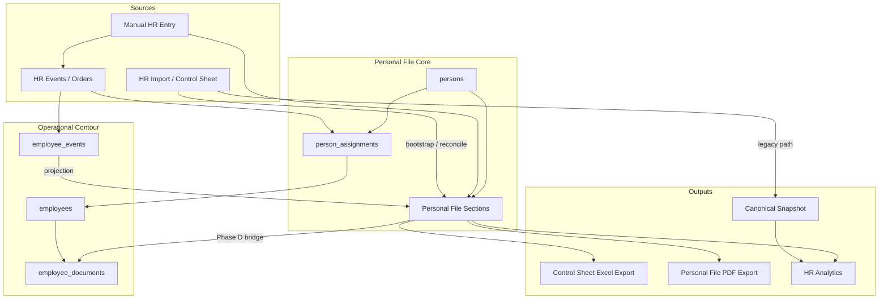

# ADR-047 — Personnel Personal File Architecture

**Status:** Proposed / Investigation  
**Date:** 2026-06-23  
**Related:** ADR-038, ADR-039, ADR-040, ADR-041, ADR-042, ADR-043, ADR-044, ADR-045, ADR-046, ADR-036, ADR-037, [ADR-048](./ADR-048-person-ownership-identity-creation-policy.md)

### Investigation artifacts (appendices)

| Document | Purpose |
|----------|---------|
| [ADR-047-sql-inventory.sql](./ADR-047-sql-inventory.sql) | Read-only volume counts across PF-related tables |
| [ADR-047-appendix-four-layer-model.md](./ADR-047-appendix-four-layer-model.md) | Import / Canonical / Personal File / Operational layers |
| [ADR-047-appendix-service-record-and-pdf-export.md](./ADR-047-appendix-service-record-and-pdf-export.md) | Service Record projection, PDF export, dual export strategy |
| [ADR-047-person-service-record-timeline.sql](./ADR-047-person-service-record-timeline.sql) | Read-only unified career timeline by `person_id` |

---

## Context

Текущий кадровый контур Corpsite построен вокруг **HR import** и **контрольного листка** (ежемесячный срез `HR_CONTROL_LIST`). Цепочка ADR-038 → ADR-039 → ADR-040 работает:

```text
Excel (контрольный листок)
  → hr_import_batches / hr_import_rows
  → normalization (hr_import_normalized_records)
  → optional binding → employees
  → promotion → employee_documents / canonical snapshot
  → employee_events (enrollment / transfer)
```

Это даёт сильный **import-first** контур для аналитики и сверки, но контрольный листок — не первичный кадровый источник. Он отражает состояние на дату отчёта, а не полноценную кадровую систему.

Параллельно ADR-042 ввёл **Person** и **person_assignments** как identity / assignment anchor, ADR-043 — lifecycle overrides и assignment-centric events, ADR-045 разделил UI «Персонал» (read-only) и «Кадровые процессы» (operational HR).

В UI «Кадровые процессы → Проверка записей» уже видны элементы будущего личного листка (обучение, образование, сертификаты, категории, декларации, награды), но они живут как **import staging / normalized records**, а не как структурированная персональная кадровая история человека.

### Целевая модель

```text
Person
  → Personal File (кадровое досье)
  → Employment episodes (person_assignments + operational employees)
  → HR Events / Orders (employee_events + personnel events)
  → Reports / Exports
  → Control Sheet (экспорт, не первичный источник)
```

---

## Problem

1. **Источник истины инвертирован:** данные идут Import → Employee, а не Person → Events → Reports.
2. **Нет сущности Personal File:** разделы личного листка размазаны по JSONB (`hr_import_rows.normalized_payload`, `profile_override`), staging (`hr_import_normalized_records`), operational registry (`employee_documents`) и canonical snapshot.
3. **Person и Employee не объединены в UI:** `persons` существует в БД, но карточка сотрудника (`EmployeeDrawer`) работает только с `employees`.
4. **Идентичность фрагментирована:** `employee_identities` привязан к `employee_id`, не к `person_id`; пол/национальность/фото не имеют канонического хранилища.
5. **Документы employee-scoped:** `employee_documents` привязан к operational `employees`, не к Person; при увольнении и повторном приёме история не следует за человеком автоматически.
6. **Нет export-first контрольного листка:** canonical snapshot export (ADR-040) генерирует Excel из **HR Canonical Registry**, а не из персонального досье; import остаётся dominant path.
7. **Кадровые события не покрывают personal file changes:** ADR-036 проектирует расширенную таксономию, но добавление образования/сертификата не журналируется как кадровое событие с provenance.

---

## Decision (Proposed)

### D1. Personal File — центральная доменная сущность (design target)

**Personal File** — логическое кадровое досье, привязанное к `person_id`, состоящее из typed sections. Физически это не обязательно одна таблица; допустима композиция section tables + provenance layer.

**Person** — постоянная идентичность; не удаляется при увольнении.  
**Employee** — operational shell для Corpsite (задачи, Telegram, доступ); может закрываться.  
**person_assignments** — канонические employment episodes (ADR-042).  
**Personal File** — персональная кадровая история, переживающая смену operational employee.

### D2. Два экспорта — разное назначение (не смешивать)

| Export | Формат | Источник | Назначение | Статус |
|--------|--------|----------|------------|--------|
| **Control Sheet Export** | **Excel** (.xlsx) | Canonical Registry (+ PF subset) | Операционный контроль, ежемесячная сверка, org-wide отчётность | ✅ `export_canonical_snapshot_xlsx` |
| **Personal File Export** | **PDF** | Personal File (person-centric aggregate) | Кадровое дело, архив, печать, выгрузка в личное дело сотрудника | ❌ Phase E (target) |

Control Sheet отвечает на вопрос «**кто где сейчас** (вся организация)». Personal File PDF — «**кто этот человек во времени** (один person)».

### D2b. Import — legacy/bootstrap (не source of truth)

| Направление | Роль |
|-------------|------|
| **Import** (retain) | Первичное наполнение, ежемесячная сверка, обнаружение расхождений |

Существующий import pipeline (ADR-038–040, ADR-043) **не ломается**. Normalized records и canonical snapshot сохраняются.

### D3. Размещение в UI (ADR-045)

| Режим | Раздел | Действия |
|-------|--------|----------|
| Просмотр карточки Person / Personal File | **Персонал** (`/directory/staff`) | Read-only tabs |
| Изменение, утверждение, приказ, import-bridge | **Кадровые процессы** (`/directory/personnel/*`) | HR operational |

### D4. Provenance обязателен для каждого изменения Personal File

Каждое изменение section record должно нести:

- `changed_by`, `changed_at`
- `basis` (приказ, документ, import, manual correction)
- `source` (`import`, `manual`, `enrollment`, `event`)
- optional link: `employee_event_id`, `source_normalized_record_id`, `source_batch_id`, `order_ref`

Переиспользовать паттерны `hr_review_overrides` (ADR-043) и provenance columns на `employee_documents` (ADR-039).

### D6. Service Record / Послужной список — обязательный раздел Personal File

**Послужной список** — обязательная секция Personal File (официальная форма: личный листок §12 + Дополнение §I).

**Service Record — projection, не mutable SoT.** Отдельная редактируемая таблица `service_record` **не** вводится. Хронология строится как **read-model / view** над append-only источниками:

| Primary source | Role in projection |
|--------------|-------------------|
| `employee_events` | Operational in-org career events (via `employees.person_id`) |
| `person_assignments` | Person-scoped employment episodes (start/end boundaries) |
| `hr_personnel_change_events` | Canonical diff audit (reconciliation, not legal SoT alone) |
| `hr_orders` (future, ADR-036 Phase 1b) | Order number, date, signatory, file |
| `person_external_employment` (future) | Pre-hire / external employers |

Изменения карьеры в организации — только через кадровые события (ADR-036 «Оформить»), не через правку projection.

Диагностика / Phase A: [`ADR-047-person-service-record-timeline.sql`](./ADR-047-person-service-record-timeline.sql).

### D7. Personal File PDF Export — целевой персональный экспорт

**Personal File PDF** — целевой официальный экспорт одного сотрудника (person), distinct from Control Sheet Excel.

- Endpoint (draft): `GET /directory/personnel/persons/{person_id}/personal-file/pdf`
- Секции: общие сведения, образование, сертификаты, категории, **послужной список**, награды, степени, фото (после `files`)
- Renderer: HTML template → PDF (implementation Phase E)
- RBAC: ADR-042 HR access; read-only в «Персонал»

### D8. HR Orders gap (interim)

`hr_orders` **не реализован** (ADR-036 Phase 1b). До внедрения orders:

- основание кадрового события отображается как `employee_events.order_ref` (TEXT) + `comment`;
- полноценный блок «Приказ» в PDF и Service Record — **degraded mode**;
- Phase B должен принять решение по `hr_orders` совместно с ADR-036 (см. [Service Record appendix §6](./ADR-047-appendix-service-record-and-pdf-export.md)).

### D5. Non-goals (Phase A–E)

- Не реализовывать сразу все разделы официального личного листка.
- Не ломать ADR-039 import и normalized records pipeline.
- Не удалять `hr_import_normalized_records` и canonical snapshot.
- Не делать массовую миграцию без отдельного этапа и runbook.
- Не вводить отдельный физический «архив» — archive = `person_status` + closed assignments + read-only personal file mode.

---

## Existing Schema Audit (2026-06-23)

### Запрошенные таблицы — фактическое состояние

| Table | Exists | Migration / ADR | Role today |
|-------|--------|-----------------|------------|
| `persons` | ✅ | `u3v4w5x6y7z8` / ADR-042 | Identity anchor: `iin`, `full_name`, `birth_date`, `match_key`, `person_status` |
| `employees` | ✅ | baseline + ADR-042 ext | Operational shell: org, position, rate, dates, `person_id` (nullable FK) |
| `person_assignments` | ✅ | ADR-042 | Canonical employment episodes |
| `employee_assignment_links` | ✅ | ADR-042 | Assignment ↔ operational employee |
| `employee_events` | ✅ | ADR-032, ADR-036 1A, ADR-039 3I | Append-only employment journal |
| `employee_identities` | ✅ | ADR-038 | IIN → `employee_id` (not `person_id`) |
| `employee_documents` | ✅ | ADR-037 | Production document registry |
| `hr_import_normalized_records` | ✅ | ADR-039 3B | Staging: training, certificate, category, education |
| `hr_import_rows` | ✅ | ADR-038 | Parsed rows + JSONB profile |
| `hr_import_batches` | ✅ | ADR-038 | Batch lifecycle |
| `files` / generic attachments | ❌ | — | **Missing** |
| `professional_documents` | ⚠️ demo | ADR-034 local demo | `certificate_types`, `employee_certificates` — **not production SoT** |

### Дополнительные релевантные таблицы

| Table | Role | Relevance to Personal File |
|-------|------|----------------------------|
| `employee_import_profile_overrides` | JSONB profile per `employee_id` | **Proto personal file** (import-derived); not person-scoped |
| `hr_import_document_candidates` | Pre-normalization document fragments | Staging; promotes to normalized records / employee_documents |
| `hr_canonical_snapshots` / `hr_canonical_snapshot_entries` | Approved HR registry snapshot | Full-roster export source (ADR-040) |
| `hr_change_events` | Monthly diff journal (roster-level) | Registry changes, not personal file sections |
| `hr_personnel_change_events` | Assignment-centric lifecycle (ADR-043) | Partial HR events at person/assignment level |
| `hr_review_overrides` | Persistent field overrides | Provenance / governance pattern to reuse |
| `hr_source_files` | Uploaded control sheet binaries | Import file storage (`storage_ref`), not person photos |
| `training_hour_requirements` | NMO hour norms | Analytics on `employee_documents` |
| `document_types`, `medical_specialties` | Reference data | Classifiers for documents / specialties |
| `enrollment_queue`, `enrollment_history` | ADR-042 enrollment | Person → operational bridge |
| `identity_reconciliation_items` | ADR-044 | Person dedup / linkage |
| Legacy `employees_import_stage`, `employees_import` | Old flat import | Deprecated path |

### `employee_events` — текущая таксономия

Implemented types (Alembic): `HIRE`, `TRANSFER`, `CORRECTION`, `TERMINATION`, `POSITION_CHANGE`, `RATE_CHANGE`, `EMPLOYEE_ENROLLED_FROM_IMPORT`.

Columns: `event_class`, `lifecycle_status`, `metadata`, `order_ref` (text), org/position/rate from/to.

ADR-036 target types (leave, rewards, disciplinary, REHIRE, document_registry events) — **designed, not fully implemented**.

### `hr_import_normalized_records` — record kinds

`record_kind IN ('training', 'certificate', 'category', 'education')` with review/promotion workflow to `employee_documents`.

---

## Personal File Sections — Coverage Matrix

Сопоставление с типовыми разделами личного листка учёта кадров (РК / медорганизация) и текущим состоянием Corpsite.

| Personal File section | Covered today | Primary storage | Gap |
|----------------------|---------------|-----------------|-----|
| **1. Общие сведения** (ФИО, ИИН, дата рождения, пол, национальность) | Partial | `persons` (ФИО, ИИН, DOB); import `profile.basic` JSONB | `gender`/`sex`, `nationality` only in import JSONB; no Person UI |
| **2. Фото** | ❌ | — | No `files` table, no `photo_file_id` on persons |
| **3. Документы** (удостоверение, паспорт, трудовая) | Partial | `employee_documents` (professional focus); `file_url` text | Not person-scoped; no identity documents taxonomy |
| **4. Образование** | Partial | normalized `education`; `employee_documents` (`EDUCATION_*`); import profile | No dedicated `person_education` table; data split across staging |
| **5. Повышение квалификации / обучение** | Partial | normalized `training`; `employee_documents`; import profile | Staging-first; hours via ADR-037/039 analytics |
| **6. Сертификаты / аккредитация** | Partial | normalized `certificate`; `employee_documents` | Same split; promotion requires `employee_id` |
| **7. Квалификационные категории** | Partial | normalized `category`; import profile | No structured person-level category history |
| **8. Специальности** | Partial | `medical_specialties` on `employee_documents` | Not on Person; not historical |
| **9. Трудовая деятельность / стаж** | Partial | import `experience_raw`; calculated from education in UI | No structured work history table |
| **9b. Послужной список (Service Record)** | Partial | Projection over `employee_events` + `person_assignments` | No unified timeline API/UI; see timeline SQL |
| **10. Назначения и переводы** | Partial | `person_assignments`; `employee_events` | Two parallel models; UI shows employee snapshot only |
| **11. Отпуска** | ❌ (designed) | ADR-036 `ANNUAL_LEAVE`, etc. | Not in schema |
| **12. Взыскания / поощрения** | ❌ (designed) | ADR-036 PERSONNEL events | Not in schema |
| **13. Декларации** | Partial | `hr_import_rows` classification `DECLARATION_*` | Staging-only |
| **14. Медицинские допуски** | ❌ | — | Missing |
| **15. История приказов** | Partial | `employee_events.order_ref` (text) | No `hr_orders` entity; no file attachment |
| **16. Учёная степень** | Partial | import profile `degrees` JSONB | Not structured |
| **17. Награды** | Partial | import profile `award_records` JSONB | Not structured |
| **18. Archive / rehire** | Partial | `person_status`, `employees.operational_status`, assignment `lifecycle_status` | No unified archive filter on Person; history fragmented |

### Coverage summary

| Category | Count |
|----------|-------|
| Fully covered as first-class Personal File section | 0 |
| Partially covered (staging / import / employee-scoped) | 13 |
| Designed in ADR but not implemented | 2 |
| Missing | 3 |

---

## Missing Entities (Gap List)

| # | Entity / capability | Priority | Notes |
|---|---------------------|----------|-------|
| 1 | **`files` / attachments store** | High | `file_id`, `storage_path`, checksum, mime; `persons.photo_file_id` |
| 2 | **`person_file_sections` registry** (metadata) | Medium | Section catalog, ordering, visibility, archive mode |
| 3 | **Structured education records** (`person_education`) | High | Migrate from import JSONB + normalized `education` |
| 4 | **Structured certificate records** (person-scoped or file-scoped) | High | Today: `employee_documents` + staging |
| 5 | **Category history** (`person_qualification_categories`) | Medium | Today: normalized + JSONB |
| 6 | **Employment episodes as Personal File view** | Medium | Unify `person_assignments` display; link to `employee_events` |
| 7 | **Person-centric UI card** | High | Tabs; not tied to operational employee only |
| 8 | **Archive status model** | Medium | Filters: active / terminated / archived / all on Person |
| 9 | **Export control sheet from Personal File** | High | Today: canonical snapshot export only |
| 10 | **Import → Personal File bridge** | High | Apply normalized record to person section, not just promote to employee_documents |
| 11 | **`person_id` on `employee_identities`** or person-level identities | Medium | ADR-044 reconciliation exists; anchor should be Person |
| 12 | **HR orders entity (`hr_orders`)** | **High** (blocks PDF order section) | Not implemented; interim `order_ref` TEXT only — see §D8 |
| 13 | **Leave / disciplinary sections** | Low | ADR-036 Phase 2+ |
| 14 | **Medical clearance** | Low | New section type |

---

## UI Audit (2026-06-23)

### Персонал (`/directory/staff`) — ADR-045

| Element | Path / component | Personal File relevance |
|---------|------------------|-------------------------|
| Staff list | `staff/page.tsx` → `EmployeesPageClient` | Operational employees only; no Person |
| Employee card | `EmployeeDrawer` (`readOnly=true`) | Org, position, rate, dates, status |
| Professional summary | `EmployeeProfessionalProfile` | `employee_documents` + training hours — **partial** PK/сертификаты |
| Missing | — | No IIN/DOB/sex; no photo; no education tabs; no person history across rehire |

### Кадровые процессы (`/directory/personnel/*`)

| Element | Path | Personal File relevance |
|---------|------|-------------------------|
| Sub-nav | `PersonnelSubNav` | Journal, Documents, HR change events, Import |
| Import upload | `import/upload` | Control sheet upload |
| Normalized review | `import/review` | **Rich proto-PF**: training, cert, category, education per record |
| Import profile card | `ImportProfileCardSections` | Sections: basic, education, training, category, certificates, degrees, awards, experience |
| Education profiles | import batch review (`mode=personnel`) | Aggregated education portfolio per row |
| Employee import card | `employees/[id]/import-card` | Per-employee import profile view |
| Document registry | `documents/page` | CRUD `employee_documents` (HR-only) |
| HR journal | `journal/page` | `employee_events` timeline |
| HR change events | `hr-change-events` | Monthly registry diff |
| Canonical export | `CanonicalSnapshotExportButton` | Excel from **canonical snapshot**, not Personal File |
| Enrollment wizard | `ImportEnrollEmployeeWizard` | Creates operational employee from import |

### Key UI observation

**Personal File UI already exists in fragmented form** inside import review (`ImportProfileCardSections`, normalized record drawer). It is batch/import-scoped, not person-scoped, and does not surface in «Персонал».

```text
┌─────────────────────────────────────────────────────────────┐
│ Today                                                       │
├──────────────────────────┬──────────────────────────────────┤
│ Персонал (staff)         │ Employee operational snapshot    │
│                          │ + employee_documents summary     │
├──────────────────────────┼──────────────────────────────────┤
│ Кадровые процессы        │ Import profile (JSONB / staging) │
│                          │ Normalized records review        │
│                          │ employee_documents CRUD          │
│                          │ employee_events journal          │
└──────────────────────────┴──────────────────────────────────┘

┌─────────────────────────────────────────────────────────────┐
│ Target (ADR-047)                                            │
├──────────────────────────┬──────────────────────────────────┤
│ Персонал                 │ Person card → Personal File tabs │
│                          │ (read-only)                      │
├──────────────────────────┼──────────────────────────────────┤
│ Кадровые процессы        │ Edit / approve / orders / import │
│                          │ bridge → apply to Personal File  │
└──────────────────────────┴──────────────────────────────────┘
```

---

## Relationship to Existing ADRs

| ADR | Relationship to ADR-047 |
|-----|------------------------|
| **ADR-038** HR Import | Remains bootstrap/reconciliation; feeds Import Bridge (Phase D) |
| **ADR-039** Normalization | Normalized records become candidates for Personal File sections |
| **ADR-040** Canonical Snapshot | Export path evolves: snapshot ⊂ Personal File aggregate export |
| **ADR-041** Dual Registry | Personal File lives primarily in **HR Canonical** contour; operational Employee optional |
| **ADR-042** Person / Assignments | Person = anchor; assignments = employment episodes in Personal File |
| **ADR-043** Lifecycle / Overrides | Override + provenance patterns reuse for Personal File corrections |
| **ADR-044** User Linkage | Person ↔ Employee ↔ User linkage required for unified card |
| **ADR-045** UI Split | View in Персонал; mutate in Кадровые процессы |
| **ADR-046** Positions | Allowed positions needed for correct assignment sections |
| **ADR-036** HR Events | Employment + personnel events journal; extend for PF change events |
| **ADR-037** Documents | `employee_documents` evolves to person-file document sections or links via person_id |

---

## Proposed Domain Model (Target)

### Person

```text
person_id, iin, full_name, birth_date, gender, photo_file_id,
person_status (active | inactive | merged), match_key,
created_at, updated_at
```

Reuse existing `persons` table; add columns in future migration phase.

### Employee (unchanged role)

Operational contour shell. Closes on termination; Person persists.

### Personal File (logical)

Composition of section records keyed by `person_id`. Initial physical model options (Phase B decision):

| Option | Pros | Cons |
|--------|------|------|
| **A. Section tables** (`person_education`, `person_certificates`, …) | Typed queries, FK integrity | More migrations |
| **B. `person_file_entries` JSONB** + `section_code` | Fast MVP | Weak typing |
| **C. Hybrid** (typed for core sections + JSONB for rare) | Balanced | Complexity |

**Recommendation:** Option C — typed tables for education, certificates, categories, documents; reuse `person_assignments` for employment; JSONB only for notes/legacy import fragments during migration.

### Files

```sql
-- DESIGN ONLY
CREATE TABLE public.files (
    file_id         BIGINT GENERATED ALWAYS AS IDENTITY PRIMARY KEY,
    storage_path    TEXT NOT NULL,
    original_name   TEXT NOT NULL,
    mime_type       TEXT NULL,
    byte_size       BIGINT NULL,
    checksum_sha256 TEXT NULL,
    uploaded_by     BIGINT NULL REFERENCES public.users(user_id),
    uploaded_at     TIMESTAMPTZ NOT NULL DEFAULT now()
);
-- persons.photo_file_id → files.file_id
```

Distinct from `hr_source_files` (import batch binaries).

### HR Events / Orders

Extend `employee_events` (ADR-036) and/or `hr_personnel_change_events` (ADR-043) with personal-file event types:

- `EDUCATION_ADDED`, `CERTIFICATE_ADDED`, `CATEGORY_CHANGED`, `DOCUMENT_RENEWED`, `PERSONAL_FILE_ARCHIVED`, `PERSONAL_FILE_RESTORED`

Each links to section record id in `metadata`.

---

## Phased Roadmap

### Phase A — Investigation (this ADR)

- [x] Audit existing tables and UI
- [ ] Obtain official **форма личного листка учёта кадров** (РК / организация)
- [ ] Enumerate mandatory sections vs matrix above
- [ ] Finalize missing entity list and Option A/B/C for Phase B

### Phase B — Data Model

Draft migrations (separate ADR or Phase B doc):

- `files`
- `persons.gender`, `persons.photo_file_id`
- `person_education`, `person_certificates`, `person_qualification_categories`
- `person_file_documents` (identity / HR papers) or extend `employee_documents` with `person_id`
- `person_file_section_audit` or extend override/history tables

### Phase C — UI Prototype

- Person card with tabs (Персонал, read-only)
- Sections: photo, general, education, certificates, employment history, events
- Link from staff list: Person view when `person_id` known; fallback Employee view

### Phase D — Import Bridge

- Normalized record review: action **«Применить в личный листок»** in addition to «Promote to employee_documents»
- Map `record_kind` → person section table
- Idempotent via `source_record_key` + `person_id`

### Phase E — Export

- **Personal File PDF** (primary deliverable): aggregate by `person_id` → official-form PDF
- **Control Sheet Excel** (retain): canonical / PF-derived roster export for org-wide reconciliation
- Reconciliation mode: PF export vs last import diff
- Service Record section in PDF rendered from career timeline projection (§D6)

---

## Architecture Diagram



---

## Open Questions

1. **Official form mapping:** какие разделы личного листка обязательны по локальному регламенту организации?
2. **Person vs Employee documents:** мигрировать `employee_documents` на `person_id` или dual-key (`person_id` + optional `employee_id`)?
3. **Canonical snapshot relationship:** snapshot становится materialized view Personal File или остаётся parallel export для full roster?
4. **Gender / PII:** хранить на Person; политика маскирования для non-HR roles (ADR-042 access)?
5. **Rehire:** новый `employees` row + link same `person_id` — автоматический merge Personal File sections?

---

## Consequences

### Positive

- Единый person-centric source of truth для кадрового досье
- Import становится безопасным bootstrap, не architectural constraint
- Rehire сохраняет историю без ручного merge
- UI «Проверка записей» получает целевой downstream (Personal File), не тупик в staging

### Negative / Risks

- Дублирование данных на переходный период (staging + personal file + employee_documents)
- Migration effort from JSONB import profiles
- Dual registry (ADR-041) усложняется третьим logical layer (Personal File)
- Risk of scope creep — необходимо жёсткое phased delivery

### Neutral

- Existing APIs и import pipeline продолжают работать during transition
- `employee_documents` остаётся valid for operational analytics until bridge complete

---

## References (code)

| Area | Location |
|------|----------|
| Person schema | `alembic/versions/u3v4w5x6y7z8_adr042_phase_b2_1_schema.py` |
| Normalized records | `alembic/versions/n7a8b9c0d1e2_adr039_phase_3b_training_normalization_schema.py` |
| Import profile UI | `corpsite-ui/app/directory/personnel/_components/ImportProfileCardSections.tsx` |
| Employee card | `corpsite-ui/app/directory/employees/_components/EmployeeDrawer.tsx` |
| Document registry | `corpsite-ui/app/directory/personnel/_components/ProfessionalDocumentsPageClient.tsx` |
| Canonical export | `app/services/hr_canonical_snapshot_service.py` |
| Lifecycle overrides | `alembic/versions/x6y7z8a9b0c1_adr043_phase_b2_personnel_lifecycle_schema.py` |
| Service Record timeline SQL | `docs/adr/ADR-047-person-service-record-timeline.sql` |
| HR event registry | `app/services/hr_event_registry.py` |

---

## Status Log

| Date | Change |
|------|--------|
| 2026-06-23 | Initial audit draft — Proposed / Investigation |
| 2026-06-23 | Cross-links, Service Record projection (D6), PDF export (D7), dual export (D2), hr_orders gap (D8), timeline SQL |
| 2026-06-25 | Cross-reference [ADR-048](./ADR-048-person-ownership-identity-creation-policy.md) — Person ownership; Shell bootstrap enables `person_id` anchor for PF (append-only) |

---

## Cross-reference (append-only, ADR-048)

Personal File anchored on `person_id` (D1). Политика ownership Person, Golden Rule (no DELETE) и enrollment Person Shell — [ADR-048](./ADR-048-person-ownership-identity-creation-policy.md). ADR-047 target model **не изменяется**; ADR-048 закрывает operational gap materialization Person до PF bootstrap.
