# ADR-048 — Person Ownership and Identity Creation Policy

## Статус

**Accepted (Ratified)** — 2026-06-25

Architectural decision only. Implementation — см. roadmap §10 (R1–R8); код и миграции не входят в scope этого ADR.

**Scope ADR-048:** ownership Person, правила создания, Person Shell при enrollment.  
**Out of scope:** детальная модель lifecycle-состояний Person → отдельный ADR (§11).

## Связанные документы

| ADR / Doc | Связь |
|-----------|-------|
| [ADR-038](./ADR-038-employee-identity-hr-import-architecture.md) | `employee_identities`, HR import staging, IIN match engine |
| [ADR-041](./ADR-041-dual-personnel-registry-model.md) | Dual registry; optional binding; explicit HR decisions |
| [ADR-042 Phase A](./ADR-042-phase-a-personnel-access-enrollment-architecture.md) | Person = identity anchor; Assignment = enrollment unit; Employee = operational shell |
| [ADR-042 B1/B2](./ADR-042-phase-b1-schema-design.md) | `persons`, `employees.person_id`, `source` enum |
| [ADR-043 C1/C2/C3](./ADR-043-phase-c2-person-assignment-sync.md) | Canonical diff → personnel events → person/assignment sync |
| [ADR-044](./ADR-044-identity-reconciliation.md) | Identity materialization, reconciliation invariants, user linkage chain |
| [ADR-045](./ADR-045-personnel-hr-processes-split.md) | Phase 3I operational enroll from import |
| [ADR-047](./ADR-047-personnel-personal-file-architecture.md) | Personal File anchored on `person_id`; Person survives rehire |
| [ADR-047 Four-Layer Model](./ADR-047-appendix-four-layer-model.md) | Import / Canonical / Personal File / Operational layers |
| [OPS-026](../ops/OPS-026-contacts-telegram-audit.md) | Operational contact contour; trigger for this study |

---

## 1. Проблема

После завершения OPS-026 operational-контур (HR import → employee → user → contact) **работает**, но выявлен системный архитектурный разрыв:

| Сущность | Состояние при operational-first enrollment |
|----------|---------------------------------------------|
| `employees` | Создан (Phase 3I wizard) |
| `employee_identities` | IIN записан |
| `users` | Создан вручную |
| `contacts` | Создан (OPS-026 backfill) |
| **`persons`** | **Не создан** |
| **`employees.person_id`** | **NULL** |
| **`contacts.person_id`** | **NULL** |

**Production-кейс:** Нурbekov Бахдат Байтлевич — `employee_id=44`, `user_id=17`, contact существует, `person_id` везде NULL.

**Симптомы:**

- Страница «Контакты» показывает «ID персоны = —».
- Нет связи с canonical Person и Personal File (ADR-047).
- Кадровый контур не может выступать master identity для человека.
- ADR-044 G7 (orphan employees без `person_id`) остаётся актуальным.

**Суть:** это не баг OPS-026 и не incomplete contact backfill. Это **незавершённая политика ownership Person и правил создания identity** — кто, когда и на каком основании имеет право материализовать Person и связать operational entities.

---

## 2. Контекст

### 2.1. Триггер

OPS-026 закрыл последнее звено operational workflow (contact). При проверке production выяснилось, что identity anchor (`persons`) **никогда не материализуется** на пути HR import Phase 3I, хотя ADR-042 проектировал Person как центральную бизнес-сущность.

### 2.2. Принцип-основание (ratified in this ADR)

> **Person — бизнес-сущность (человек), а не техническая запись.**

Person представляет **физическое лицо** как постоянную идентичность. Она переживает увольнение, повторный приём, смену operational employee и закрытие user account.

**Целевая иерархия сущностей:**

```text
Person (человек — постоянная идентичность)
   │
   ├── Personal File (кадровое досье — ADR-047)
   │      ├── Education, Certificates, Orders, Transfers, Employment history
   │
   ├── Assignments (person_assignments — canonical employment episodes)
   │
   └── Employee (operational shell; 0..N за историю, max 1 active)
          │
          ├── User (0..N; optional)
          │
          └── Contact (operational projection; derived via Employee — §7.6)

Operational identity chain:  Person → Employee → Contact
```

**Contact не является identity anchor** и **не владеет данными человека** (см. §7.6). Contact — operational directory projection, **derived via Employee** (не прямой child Person и не самостоятельный владелец identity). Создание contact без Person — допустимый transitional state, но **не целевое steady-state** для enrolled сотрудника с известным IIN.

Полная модель ownership — §7.5. Enrollment создаёт только **Person Shell** (§7.4), не полноценную кадровую запись.

### 2.3. Что уже утверждено в смежных ADR

| Тема | ADR | Статус |
|------|-----|--------|
| Два кадровых контура (HR canonical ≠ operational) | ADR-041 | Accepted |
| Person = identity anchor; Assignment = enrollment unit | ADR-042 A/B1 | Implemented (schema) |
| `employees` = operational shell, не замена Person | ADR-042 | Ratified |
| Person sync из canonical diff (C2) | ADR-043 C2 | Implemented |
| Reconciliation: UPDATE persons, never INSERT | ADR-044 R1a | Accepted |
| IIN primary truth chain (canonical → persons) | ADR-044 §1 | Accepted |
| Personal File anchored on `person_id` | ADR-047 | Proposed |
| Phase 3I explicit enroll from import | ADR-045 | Accepted |
| `persons.source IN ('canonical','manual','migration','enrollment')` | ADR-042 B1 | Implemented |

### 2.4. Что осталось не определено (gap)

| Вопрос | Статус до ADR-048 |
|--------|-------------------|
| Кто **имеет право создавать** Person? | Неявно: только C2 sync + migration; enrollment не включён |
| **Момент рождения** Person при operational-first path | Не определён |
| **Master-record** для natural identity | Размыто между canonical, employee, persons |
| Связь Person ↔ Employee при HR import enroll | Не реализована (только enrollment queue apply ставит `person_id`) |
| Может ли explicit enrollment **создавать** Person? | Противоречие между schema (`source='enrollment'`) и runtime (INSERT только в C2) |
| Contact без Person — exception или norm? | Не формализовано |

---

## 3. Текущая архитектура (as-is)

### 3.1. Два параллельных enrollment path

```mermaid
flowchart TB
    subgraph canonical_first ["Path A — Canonical-first (designed)"]
        CS[Canonical snapshot / diff]
        C1[C1 personnel events]
        C2[C2 sync_personnel_events]
        P1[CREATE persons source=canonical]
        EQ[Enrollment queue]
        AE[apply_enrollment]
        E1[CREATE employee WITH person_id]
        CS --> C1 --> C2 --> P1
        P1 --> EQ --> AE --> E1
    end

    subgraph operational_first ["Path B — Operational-first (production HR import 3I)"]
        HI[HR import normalized record]
        EN[enroll_employee_from_normalized_record]
        E2[CREATE employee person_id=NULL]
        EI[INSERT employee_identities IIN]
        OC[ensure_operational_contact]
        U[create_user manual]
        HI --> EN --> E2 --> EI --> OC --> U
    end
```



**Path A** соответствует ADR-042 design intent.  
**Path B** — фактический production path для точечного добавления сотрудника (ADR-045 Phase 3I). Person **не создаётся**, `employees.person_id` **не ставится**.

### 3.2. Текущие writers `public.persons`

| Writer | `source` | Trigger | Ставит `employees.person_id`? |
|--------|----------|---------|--------------------------------|
| Alembic B2.3 backfill | `migration` | One-time migration | Да (migration) |
| `hr_person_assignment_sync_service._create_person` | `canonical` | C2 lifecycle (`NEW_PERSON`, etc.) | **Нет** |
| `identity_reconciliation_service` | — | R1a batch | **Нет** (UPDATE only) |
| `enrollment_service._create_employee_for_assignment` | — | Enrollment queue apply | **Да** (при create employee) |
| HR import Phase 3I | — | Explicit enroll wizard | **Нет Person, No person_id** |

### 3.3. Текущие consumers `employees.person_id`

| Consumer | Последствие NULL |
|----------|------------------|
| `operational_contact_service` | `contacts.person_id = NULL` |
| `contacts_routes` task-contour | Person ID не отображается |
| `access_resolver_service` | Identity chain обрывается на employee |
| `assignment_reconciliation_service` | Drift detection недоступен |
| `identity_reconciliation_service` G7 | Orphan employee flagged |
| ADR-047 service record / Personal File | История не агрегируется по person |

### 3.4. Сравнение целевой модели (§2.2) с реализацией

| Целевая модель | As-is |
|----------------|-------|
| Person — корень identity | Person часто отсутствует при operational enroll |
| Employee — занятость | Employee создаётся первым (inverted) |
| User — доступ к Employee | OK |
| Contact — производная | OK, но без person_id |
| Personal File → Person | Заблокировано без person_id |
| IIN → Person | IIN только в `employee_identities`, не в `persons` |

**Вывод:** реализация **инвертировала порядок** относительно ADR-042/047 — Employee создаётся без Person, хотя архитектура проектировала Person как prerequisite identity anchor.

---

## 4. Рассмотренные варианты

### Вариант A — Person создаётся исключительно canonical lifecycle

**Formulation:** Единственный runtime writer Person — C2 sync (`hr_person_assignment_sync_service`) на основании `hr_personnel_change_events`. Enrollment (включая Phase 3I) **никогда не создаёт** Person. Operational employee получает `person_id` только когда:

1. Admin запускает personnel lifecycle с `sync_persons=True`, **и**
2. Canonical diff содержит roster row для этого IIN, **и**
3. HR проходит enrollment queue apply (canonical-first path).

Operational-first enroll **обязан** дождаться canonical materialization.

### Вариант B — Explicit enrollment: Create-or-Link Person Shell (IIN-gated)

**Formulation:** Помимо C2, **explicit HR enrollment decision** (enrollment queue apply, Phase 3I wizard execute) является **Create-or-Link authority** для operational identity:

- Valid 12-digit IIN в `employee_identities`;
- Active Person с этим IIN **не существует** → **CREATE** Canonical Person Shell (§7.4) — **не** полноценную кадровую запись (`source='enrollment'`, `match_key='iin:{iin}'`, logical `lifecycle_state=SHELL`);
- Ровно один active Person с IIN → **LINK** — USE existing Person, set `employees.person_id` (canonical-first path);
- Два и более Person с IIN → **no auto-link**, reconciliation event;
- **Без IIN → no Person** (не создавать по ФИО);
- Reconciliation (ADR-044) остаётся владельцем merge/conflict resolution;
- `contacts.person_id` прокидывается через существующий `ensure_operational_contact_for_employee`.

### Вариант C (отклонён) — Employee как master identity

**Formulation:** `employees` + `employee_identities` — primary identity; Person опционален / deprecated.

**Отклонён:** противоречит ADR-042, ADR-047, ADR-044 ratified chain; блокирует Personal File, assignment-centric model, rehire history.

### Вариант D (отклонён) — Person по ФИО при отсутствии IIN

**Formulation:** Fallback create Person by normalized name when IIN missing.

**Отклонён:** ADR-044 явно отклонил blind `name:*` identity; риск дублей однофамильцев; не соответствует IIN-first policy ADR-038.

---

## 5. Плюсы и минусы

### Вариант A — Canonical lifecycle only

| Плюсы | Минусы |
|-------|--------|
| Единственный writer → простая mental model | Operational-first path ** structurally broken** без обязательного lifecycle |
| Нет риска divergent Person records | Production enroll (3I) не создаёт Person **by design** → G7 orphans persist |
| Полное согласование с C2 provenance | HR operator must run lifecycle **before** operational contour complete |
| Чистое разделение canonical vs operational | Personal File (ADR-047) недоступен до async lifecycle |
| Reconciliation scope остаётся узким | Нурbekov-case **не решается** без manual lifecycle + queue |
| | Два explicit HR actions вместо одного (enroll + lifecycle) |
| | `persons.source='enrollment'` в schema — dead letter |

**Риски A:**

| Risk | Severity |
|------|----------|
| Permanent orphan employees in operational registry | **High** |
| Operator confusion: «сотрудник есть, персоны нет» | **High** |
| Personal File blocked for majority of 3I enrollments | **High** |
| C2 never sets `employees.person_id` → link never forms even after Person created | **Medium** |
| ADR-042 Phase A statement «Person создаётся при enrollment» becomes false | **Medium** |

### Variant B — Enrollment + Canonical dual creation authority

| Плюсы | Минусы |
|-------|--------|
| Завершает identity chain в одной explicit HR transaction | Два creation paths → нужна формальная policy (этот ADR) |
| Согласуется с `source='enrollment'` в schema | Potential race: C2 и enrollment одновременно (mitigated by `uq_persons_iin_active`) |
| IIN-gated → no name-only duplicates | Требует discipline: no Person without IIN |
| Idempotent: re-run safe if person_id already set | Operational team must understand canonical vs enrollment Person |
| Unblocks Personal File, contacts.person_id, G7 | |
| Phase 3I остаётся single explicit action | |
| ADR-042 «Person at enrollment» becomes true | |
| Contact architecture unchanged (propagation only) | |

**Риски B:**

| Risk | Severity | Mitigation |
|------|----------|------------|
| Duplicate Person if C2 and enrollment race | Low | DB unique index on active IIN; lookup-before-insert |
| Ambiguous IIN (2+ persons) | Medium | No auto-link; reconciliation queue (ADR-044 pattern) |
| Person without assignment (enrollment shell only) | Medium | Acceptable: identity ≠ assignment; C2 may add assignments later |
| Divergent full_name (employee vs canonical) | Low | Enrollment copies employee name; C2 FIELD_CHANGED reconciles |
| Perceived conflict with ADR-044 «never INSERT persons» | Low | ADR-044 scope = reconciliation batch only; explicit enrollment excluded |
| Perceived conflict with ADR-042 D3 | Low | D3 = no auto **employee** from bulk import; not «no Person at explicit enroll» |

---

## 6. Риски (общие)

| Risk | A | B | Notes |
|------|---|---|-------|
| Identity fragmentation | ●●● | ● | B closes gap at enroll time |
| Duplicate Person records | ● | ●● | Both: DB constraints + IIN lookup |
| Orphan employees (G7) | ●●● | ● | B resolves at enroll |
| Personal File unavailable | ●●● | ● | ADR-047 depends on person_id |
| Reconciliation scope creep | ● | ●● | B needs clear boundary vs ADR-044 |
| Operator workflow complexity | ●● | ● | A requires extra lifecycle step |
| Rehire / merge edge cases | ●● | ●● | Both need ADR-044 merge policy |
| Future archive / service record gaps | ●●● | ● | person_id required for person-centric history |

---

## 7. Рекомендуемое решение

### Ratified policy: **Variant B — Dual Authority with IIN Gate**

Person lifecycle ownership **разделён по доменам ответственности**, не по «единственному writer»:

```text
┌─────────────────────────────────────────────────────────────────┐
│                    PERSON OWNERSHIP MODEL                        │
├─────────────────────────────────────────────────────────────────┤
│ Authority 1: Canonical Identity Materialization (ADR-043 C2)    │
│   Creates: Person + person_assignments                          │
│   Trigger: hr_personnel_change_events (NEW_PERSON, etc.)        │
│   source = 'canonical'                                          │
│   Scope: assignment-centric HR truth                            │
├─────────────────────────────────────────────────────────────────┤
│ Authority 2: Operational Enrollment Identity (Create-or-Link)     │
│   CREATE: Canonical Person Shell ONLY if Person missing (§7.4)  │
│           — NOT full HR dossier, NOT assignments by default     │
│   LINK:   If Person exists (by IIN) → set employees.person_id │
│   Trigger: explicit HR enrollment decision                      │
│     - enrollment queue apply (often LINK on canonical-first)    │
│     - Phase 3I enroll-employee execute (often CREATE)           │
│   source = 'enrollment' (created_source) on CREATE only           │
│   logical lifecycle_state = SHELL on CREATE (policy; see §11)   │
│   Precondition: valid IIN in employee_identities                │
│   Also: propagates person_id to contacts via Employee             │
├─────────────────────────────────────────────────────────────────┤
│ Authority 3: Identity Reconciliation (ADR-044)                │
│   Creates: NEVER                                                │
│   Owns: IIN backfill (UPDATE), merge, conflict resolution,      │
│         ambiguous IIN queue, match_key realignment (R1b)        │
├─────────────────────────────────────────────────────────────────┤
│ Authority 4: Manual correction (future / exceptional)           │
│   source = 'manual'                                             │
│   HR admin only; audit required                                 │
└─────────────────────────────────────────────────────────────────┘
```

### 7.1. Ответы на ключевые вопросы

#### Кто имеет право создавать Person?

**Два runtime CREATE authority** (plus migration/manual exceptional):

1. **Canonical lifecycle (C2)** — Person + assignments из HR diff.
2. **Explicit operational enrollment** — Canonical Person Shell (§7.4) при valid IIN **только если Person отсутствует**.

**Create-or-Link (Authority 2):** enrollment также **связывает** Employee с уже существующим Person (by IIN) без CREATE — типично для canonical-first / enrollment queue apply.

**Reconciliation не создаёт.** Bulk HR import upload **не создаёт**.

#### Откуда начинается Person? Момент рождения identity?

Person **не рождается** на этапах:

- Excel upload;
- import staging (`hr_import_rows`);
- normalized records review;
- auto-bind import row.

Person **материализуется** при первом **identity materialization event**:

| Event | Path | `source` |
|-------|------|----------|
| C2 applies `NEW_PERSON` / assignment event | Canonical-first | `canonical` |
| HR executes Phase 3I enroll-employee | Operational-first | `enrollment` (CREATE Shell) |
| HR applies enrollment queue | Bridge | LINK to existing Person, or CREATE if missing |
| Migration backfill | Legacy | `migration` |

**Identity birth criterion:** запись в `public.persons` с valid identity key (`iin:{12}` preferred; canonical `person_key` in C2 path).

#### Master-record: что является source of truth?

**Layered truth model** (не single table):

| Domain | Master-record | Notes |
|--------|---------------|-------|
| Natural identity (IIN, birth_date, canonical FIO) | **Effective Canonical HR / Canonical Registry** → materialized in `persons` | ADR-044 §1; long-term SoT |
| Person as business entity (human) | **`persons`** | Surrogate `person_id` — internal PK |
| Organization roster (who works where, full org) | **Canonical Registry** | ADR-041 |
| Operational employment snapshot (Corpsite now) | **`employees`** + `employee_events` | At most **one active** Employee per Person (ADR-042 §2.3) |
| Access / authentication | **`users`** | Optional; linked via `employee_id` (ADR-044 R2) |
| Directory / Telegram | **`contacts`** | Derivative via Employee; not master |
| Personal dossier (education, certs, orders) | **Personal File** (target, ADR-047) | Aggregated by `person_id` |

**Bootstrap vs long-term SoT (enrollment path):** при CREATE Shell enrollment **может** использовать `employee_identities` (и поля Employee) как **bootstrap source**. Долгосрочным источником истины для natural identity attributes остаётся **Effective Canonical HR / Canonical Registry** (ADR-044 §1). Если bootstrap и canonical расходятся, конфликт разрешается через **reconciliation / C2**, а **не** через overwrite со стороны enrollment (§7.4).

**Person — master aggregate root для человека.** Employee — master для operational snapshot. Canonical — master для org-wide roster. Это **не contradiction**, а layered architecture (ADR-047 four-layer model).

#### Relationship: Person / Employee / User / Contact

| Entity | Creates | May exist without |
|--------|---------|-------------------|
| **Person** | C2 or explicit enrollment (IIN-gated) | Employee, User, Contact, Assignment |
| **Employee** | HR enroll (3I), enrollment apply, manual emergency | User, Contact; **should not** persist without Person after enroll (target invariant) |
| **User** | Admin manual | Person directly (via employee link) |
| **Contact** | `ensure_operational_contact_for_employee` | Person (transitional); target: always linked when employee.person_id set; **не владеет данными** (§7.6) |
| **person_assignments** | C2 sync, enrollment apply | Employee (canonical-only assignments valid per ADR-042) |

**Creation order (target steady-state):**

```text
Operational-first:  IIN known → Person Shell → Employee → Contact → User (optional)
Canonical-first:    Person (+ assignment) → Enrollment apply → Employee → Contact → User
```

**Contact всегда последний** в identity chain (derivative). **Employee не владеет Person** (§7.5).

### 7.4. Canonical Person Shell (enrollment scope)

Explicit operational enrollment **не создаёт полноценную кадровую запись** (Personal File, assignments, orders, education и т.д.).

Enrollment создаёт **только минимальный Canonical Person Shell** — identity anchor для глобальной идентичности человека **до** поступления полной кадровой информации из canonical lifecycle, import bridge или ручного наполнения Personal File (ADR-047).

#### Минимальный состав Person Shell (normative example)

| Field (logical) | Purpose | Mapping to current schema (ADR-042 B1) |
|-----------------|---------|----------------------------------------|
| `person_id` | Surrogate PK | `persons.person_id` (generated) |
| `iin` | Primary identity key | `persons.iin` (12 digits, required for Shell CREATE) |
| `surname` | Фамилия | `persons.last_name` (if available; else derived from `full_name`) |
| `name` | Имя | `persons.first_name` |
| `patronymic` | Отчество | `persons.middle_name` |
| `birth_date` | If known | `persons.birth_date` (nullable) |
| `created_source` | Provenance | `persons.source = 'enrollment'` |
| `lifecycle_state` | Logical state | **`SHELL`** — policy concept; **not** a DB column in ADR-048 (see §11) |

**Also required for identity resolution (existing schema):**

- `full_name` — `persons.full_name` NOT NULL (composed or copied from employee at enroll time);
- `match_key` — `iin:{iin}` for enrollment path;
- `person_status` — `'active'` at creation (physical DB field; distinct from logical `lifecycle_state`).

#### Explicitly NOT created by enrollment Shell

| Not in Shell scope | Owner / path |
|--------------------|--------------|
| `person_assignments` | C2 canonical lifecycle (ADR-043) |
| Personal File sections | ADR-047 bootstrap / import bridge |
| Education, certificates, orders | Personal File / canonical promotion |
| Full canonical roster projection | Canonical Registry (ADR-041) |
| Employment history (complete) | `person_assignments` + service record projection |

**Shell → fuller Person:** C2 sync, canonical diff, Personal File bootstrap, and reconciliation **enrich** the same `person_id` row over time. Enrollment Shell is **identity bootstrap**, not HR dossier completion.

#### Bootstrap source vs long-term source of truth

| Phase | Source | Role |
|-------|--------|------|
| Shell CREATE (enrollment) | `employee_identities.IIN`, Employee `full_name` (and optional FIO fields) | **Bootstrap** — минимальная materialization для operational link |
| Steady-state natural identity | Effective Canonical HR → `persons` | **Long-term SoT** (ADR-044 §1) |

**Conflict policy:** если данные enrollment bootstrap и canonical registry **расходятся** (IIN уже on Person, FIO drift, и т.д.), enrollment **не перезаписывает** canonical-aligned attributes. Разрешение — через **reconciliation (ADR-044)** и **C2 FIELD_CHANGED** (ADR-043), не через enrollment-side overwrite.

### 7.5. Person Ownership — корневая бизнес-сущность

**Person является корневой бизнес-сущностью (человек).** Все прочие сущности существуют **относительно Person**, а не наоборот.

```text
Person (корень — постоянная идентичность человека)
├── Personal File (кадровое досье — ADR-047)
│   ├── Education
│   ├── Certificates
│   ├── Orders
│   ├── Transfers
│   └── Employment History (projection)
├── Assignments (person_assignments — canonical employment episodes)
└── Employee (0..N за lifetime; max 1 active — ADR-042 §2.3, uq_employees_person_active)
    ├── User (0..N access accounts; optional)
    └── Contact (derived via Employee — operational projection, §7.6)
```

**Operational chain (не ownership tree):** `Person → Employee → Contact`.

**Ownership rules:**

| Rule | Statement |
|------|-----------|
| **O-1** | Person **не принадлежит** Employee. Employee **принадлежит** Person (via `employees.person_id`). |
| **O-2** | Employee **не владеет** Person и **не может** быть master identity. |
| **O-3** | User **не владеет** Person; User привязан к operational access через Employee. |
| **O-4** | Personal File **агрегируется** по `person_id`; переживает закрытие Employee. |
| **O-5** | Assignments описывают **занятость** Person; enrollment unit остаётся Assignment (ADR-042), но Shell может существовать **без** assignment. |
| **O-6** | Rehire: новый Employee shell → **тот же** Person (by IIN). |
| **O-7** | Person может иметь **несколько** Employee за историю (rehire), но **не более одного active** Employee одновременно (ADR-042 Phase A §2.3; `uq_employees_person_active`). |

**Согласование с ADR-047:** target four-layer model ставит Personal File layer на `person_id` anchor. ADR-048 фиксирует, что operational enrollment **начинает** эту цепочку через Shell, не заменяя Personal File layer.

**Согласование с ADR-042:** «Employee = operational shell» — **подчинённая** сущность; ADR-042 intent сохранён и усилён.

### 7.6. Contact — operational projection

**Contact представляет собой исключительно operational projection** (directory / Telegram / task contour). Contact:

- **не является** identity anchor;
- **не владеет** данными человека (ФИО, IIN, кадровая история);
- **не является** master-record для Person или Employee;
- **может** существовать transiently без `person_id` (OPS-026 transitional state);
- **допускает** автоматическое пересоздание / refresh из Employee (`ensure_operational_contact_for_employee`) без потери master identity — Person и Employee остаются source для propagation;
- **не должен** использоваться как основание для создания Person или Employee.

**Data flow (one direction):**

```text
Person → Employee → Contact
         (person_id propagation via ensure_operational_contact)
```

Contact mutations (phone, Telegram) **не обратно-синхронизируют** Person identity fields. Telegram IDs **не меняются** политикой ADR-048 (OPS-026 scope preserved).

### 7.7. Golden Rule — Person never deleted

> **Person никогда не удаляется физически.**

| Допустимо | Недопустимо |
|-----------|-------------|
| `person_status = 'inactive'` | `DELETE FROM persons` |
| Logical archived state (future ADR) | Physical row removal in production |
| `person_status = 'merged'` + `merged_into_person_id` | Cascade delete of Person as cleanup |

**Причина:** необходимо сохранять **непрерывную историю личности** независимо от увольнений, повторных приёмов, закрытия Employee и деактивации User. Personal File (ADR-047), service record, reconciliation audit и кадровый архив опираются на стабильный `person_id`.

**Merge:** поглощение дубликатов — через reconciliation/admin policy (ADR-044); исходная запись переводится в `merged`, не удаляется.

**Implementation note (non-normative):** migration downgrade scripts may DELETE migration-scoped rows; this is tooling exception, not production policy.

### 7.8. Invariants (normative)

```text
INV-1: Person represents one human; Golden Rule (§7.7) — never physically deleted;
       may become inactive, archived (future), or merged.

INV-2: Person CREATE requires valid 12-digit IIN OR canonical C2 event with IIN in payload.
       Name-only Person CREATE is forbidden outside migration legacy.

INV-3: At most one active Person per IIN (uq_persons_iin_active).

INV-4: After successful operational enrollment with IIN, employees.person_id MUST NOT be NULL.
       (Target invariant — requires implementation deliverable.)

INV-5: contacts.person_id SHOULD equal employees.person_id for operational contacts
       after ensure_operational_contact refresh.

INV-6: Reconciliation (ADR-044) MUST NOT INSERT INTO persons.

INV-7: Ambiguous IIN (2+ active persons) → no automatic employee.person_id assignment;
       reconciliation event required.

INV-8: Merge of duplicate persons is owned by reconciliation/admin policy, not enrollment.

INV-9: HR import upload / staging MUST NOT create Person.

INV-10: Bulk backfill of person linkage MUST require explicit per-target filter (OPS-026.4a pattern).

INV-11: Enrollment Person CREATE produces Shell only (§7.4); MUST NOT imply full HR dossier or assignment creation.

INV-12: Employee MUST NOT be treated as owner of Person (§7.5 O-1, O-2).

INV-13: Contact MUST NOT be treated as owner of person identity data (§7.6).

INV-14: Enrollment bootstrap (employee_identities) MUST NOT overwrite canonical-aligned
       natural identity on conflict; reconciliation / C2 resolves drift (§7.4).
```

### 7.9. Clarification: ADR-042 D3

ADR-042 D3 states: **«Enrollment as explicit bridge (no auto-create from HR import)»**.

**Interpretation ratified by ADR-048:**

- **Forbidden:** automatic Employee creation from bulk import upload or roster promotion without HR review.
- **Allowed:** Person materialization at **explicit** enrollment execute (Phase 3I wizard confirmation, enrollment queue apply) — this **is** the bridge ADR-042 designed, not a violation of D3.

D3 protects against **implicit** mass operationalization. ADR-048 protects against **missing** identity at explicit operationalization.

---

## 8. Последствия

### 8.1. Совместимость с ADR-042

| Aspect | Impact |
|--------|--------|
| Person as identity anchor | **Strengthened** — Person materialized at enroll |
| Assignment as enrollment unit | **Unchanged** — enrollment may create Person shell without assignment |
| Employee as operational shell | **Strengthened** — person_id populated |
| Dual registry (ADR-041) | **Unchanged** — canonical still optional for analytics |
| `persons.source='enrollment'` | **Activated** — no longer dead schema value |

**ADR-042 Phase A §1.2** already states: *«Operational Person создаётся/обновляется при enrollment»*. ADR-048 **восстанавливает** этот intent в runtime.

### 8.2. Совместимость с ADR-043

| Aspect | Impact |
|--------|--------|
| C2 person sync | **Unchanged** — remains canonical assignment writer |
| C2 `_find_person` IIN fallback | **Benefits** — finds enrollment-created Person |
| C2 `_maybe_sync_employee_link` | **Benefits** — works once `employees.person_id` set by enrollment |
| person_assignments | Enrollment Person shell may exist **without** assignment until C2/lifecycle |
| C1 `_resolve_person_ids` | **Orthogonal** — R1b match_key alignment still needed |

**Conceptual:** C2 owns **assignment history**; enrollment owns **operational identity bridge**. Different concerns, same Person row.

### 8.3. Совместимость с ADR-044

| Aspect | Impact |
|--------|--------|
| R1a «never INSERT persons» | **Not violated** — applies to reconciliation batch only |
| G7 orphan employees | **Reduced** as enrollment populates person_id |
| G4 duplicate IIN | **Relevant** — enrollment must implement same ambiguous-IIN gate |
| Ratified chain users→employees→person_id→persons | **Completed** for operational-first path |
| R1b match_key realignment | **Still needed** — enrollment uses `iin:{iin}`; R1b may later align to `emp:{id}` |
| R2 user linkage | **Orthogonal** |

**New reconciliation event types (conceptual):** `AMBIGUOUS_IIN_AT_ENROLLMENT`, `IDENTITY_INCOMPLETE_NO_IIN` — report-only or queue, no auto-fix.

### 8.4. Влияние на downstream processes (informational)

*Этот подраздел — контекст последствий Variant B, не normative policy ADR-048.*

| Process | Effect under Variant B |
|---------|------------------------|
| **Reconciliation** | Narrower orphan set; ambiguous IIN cases routed to existing reconciliation patterns |
| **HR synchronization** | C2 continues; enrollment Person shell linked when canonical catches up |
| **Employee linkage** | `employees.person_id` populated at enroll; C2 links assignments |
| **Assignment history** | Still from `person_assignments` (C2); enrollment shell doesn't replace |
| **Personal File (ADR-047)** | **Unblocked** — person_id available for section tables |
| **Service record / PDF** | JOIN via `employees.person_id` works |
| **Кадровый архив** | Person persists; employee may close; history follows person |
| **Увольнение** | Employee deactivated; Person inactive optionally via C2 TERMINATED_PERSON; PF retained |
| **Повторный приём** | Same Person (by IIN); new Employee shell; PF continuous |
| **Merge дублей** | Reconciliation/admin only; enrollment never auto-merges |
| **Восстановление сотрудника** | Re-enroll links to existing Person by IIN |
| **Документы** | Future `person_id` on `employee_documents` re-key (ADR-047 Phase B) |
| **Contacts / Telegram** | No architecture change; person_id propagated |

### 8.5. Schema migrations

**ADR-048 requires no schema migrations** for core policy:

- `persons.source` already includes `'enrollment'`
- `employees.person_id` FK exists
- `uq_persons_iin_active` exists
- `contacts.person_id` exists (soft link)

**Optional future (implementation phase, not ADR-048):**

- Security audit event types extension
- Reconciliation item action types for enrollment ambiguity
- CHECK or partial index enforcing INV-4 (post-implementation hardening) — **deferred**

---

## 9. Изменения и дополнения существующих ADR

| ADR | Action |
|-----|--------|
| **ADR-048** (this) | **Accepted (Ratified)** — Person ownership policy |
| **ADR-042 Phase A** | **Done (append-only)** — Cross-reference §; D3 clarified via ADR-048 §7.9 |
| **ADR-042 B1** | **No change** — `source='enrollment'` normative per ADR-048 |
| **ADR-043 C2** | **Done (append-only)** — Cross-reference §; C2 vs enrollment boundary |
| **ADR-044** | **Done (append-only)** — Cross-reference §; reconciliation scope vs enrollment CREATE |
| **ADR-045 Phase 3I** | **No change in ADR-045** — target state described in ADR-048 §10 R1 |
| **ADR-047** | **Done (append-only)** — Cross-reference §; PF bootstrap via Person Shell |
| **ADR-041** | **Done (append-only)** — Cross-reference §; dual registry preserved |

---

## 10. Roadmap реализации (без кода)

Implementation is **explicitly out of scope** for ADR-048. Upon acceptance, deliverables:

| Phase | Deliverable | Description |
|-------|-------------|-------------|
| **R1 — Policy implementation** | Enrollment identity linkage | IIN-gated Person **Shell** create/link at Phase 3I execute and enrollment queue apply; sets `employees.person_id`; refreshes contact |
| **R2 — Targeted backfill** | Ops script (OPS-026.5 pattern) | Per-employee/user filter required for `--apply`; same linkage logic as R1 |
| **R3 — Audit & gates** | Security audit events | `PERSON_ENROLLMENT_LINKED`, `IDENTITY_INCOMPLETE`, `AMBIGUOUS_IIN` |
| **R4 — Tests** | Unit + integration | IIN gate, ambiguous IIN, idempotency, no name-only create |
| **R5 — Reconciliation integration** | Ambiguous IIN queue | Reuse ADR-044 journal patterns; no new merge logic in enrollment |
| **R6 — Optional retroactive** | `create_user` hook | If employee.person_id NULL and IIN present → linkage (Phase 2, lower priority) |
| **R7 — Documentation** | Runbook | Operator guide: when Person appears, what to do if IIN missing |
| **R8 — ADR-047 unblock** | Personal File Phase A | Person card can assume person_id on enrolled employees |

**Non-goals (explicit):**

- Mass backfill without filter
- Person create by name only
- Changes to contacts schema or Telegram IDs
- C2 refactor
- R1b/R2 implementation
- Personal File section tables

**Acceptance criteria for R1:**

1. Phase 3I enroll with IIN → Person **Shell** row exists (`source='enrollment'`), `employees.person_id` set, `contacts.person_id` set after contact refresh; no assignment/PF implied.
2. Re-run idempotent.
3. Enroll without IIN → no Person; audit `IDENTITY_INCOMPLETE`.
4. Two persons same IIN → no link; reconciliation flagged.
5. Existing Person same IIN → link, no duplicate.
6. ADR-044 R1a behavior unchanged.

---

## 11. Future Work — Person Lifecycle (out of scope)

ADR-048 **намеренно не определяет** полную модель жизненного цикла Person.

Примеры состояний, **отложенных** в отдельный ADR (tentative, not ratified):

```text
SHELL → ACTIVE → INACTIVE → ARCHIVED → MERGED
```

| Topic | ADR-048 defines | Separate ADR (future) |
|-------|-----------------|----------------------|
| Who may CREATE Person | ✓ | — |
| Person Shell vs full dossier | ✓ | — |
| Ownership hierarchy | ✓ | — |
| Golden Rule (no DELETE) | ✓ | — |
| Logical `lifecycle_state` enum | Concept only (`SHELL` at enroll) | Full state machine, transitions, guards |
| `person_status` vs `lifecycle_state` mapping | Not defined | Normative mapping |
| ARCHIVED semantics | Mentioned | Retention, UI, export rules |
| MERGED workflow UI | Referenced (ADR-044) | Operator runbook |
| Shell → ACTIVE promotion criteria | Not defined | e.g. first assignment synced, PF bootstrap |

**Rationale:** смешение ownership policy и lifecycle state machine в одном ADR усложняет review и блокирует принятие core decision (Variant B). Implementation roadmap (§10) **не изменяется** — lifecycle ADR may extend R-phases later.

---

## 12. Проверка согласованности с ADR-041 — ADR-047

Review R3: формулировки ADR-048 сверены со смежными ADR. **Принятые решения (Variant B) не изменены.**

| ADR | Key alignment | Potential tension | Resolution in ADR-048 |
|-----|---------------|-------------------|------------------------|
| **ADR-041** | Dual registry; optional binding; explicit HR decisions | D2: import не auto-creates Employee | Shell at **explicit** enroll — не bulk import; dual registry preserved |
| **ADR-042** | Person = identity anchor; Employee = shell; Assignment = enroll unit; max 1 active Employee per Person | D3 «no auto-create from import» | Clarified §7.9: D3 = no auto **Employee**; Shell at explicit enroll restores Phase A intent; O-7 |
| **ADR-043 C2** | C2 creates Person + assignments from canonical events | C2 does not set `employees.person_id` | Unchanged; enrollment Create-or-Link separate authority; Shell may exist before C2 assignments |
| **ADR-044** | Reconciliation never INSERT persons; IIN chain; merge policy | «Never INSERT» blanket reading | Scoped to reconciliation batch (INV-6); enrollment Shell excluded; bootstrap conflict INV-14 |
| **ADR-047** | Person permanent; PF on `person_id`; Employee may close | Import-first history today | Shell enables `person_id` anchor for PF bootstrap; PF enrichment deferred to ADR-047 phases |

**No contradictions found** requiring change of ratified Variant B decision.

**Terminology harmonization (documentation only):**

| ADR-048 term | Existing ADR / schema term |
|-----------------|----------------------------|
| `created_source = ENROLLMENT` | `persons.source = 'enrollment'` |
| `lifecycle_state = SHELL` | Logical policy state; future ADR; ≠ `person_status` today |
| `surname` / `name` / `patronymic` | `last_name` / `first_name` / `middle_name` (+ `full_name` required) |
| Golden Rule | Consistent with ADR-047 D1 «Person не удаляется при увольнении» + schema `merged` |
| Create-or-Link (Authority 2) | CREATE Shell if missing; LINK if Person exists by IIN |

---

## Appendix A — Entity model vs ADR-047 four layers

```text
Import Layer          → feeds data;         identity: row_id (NOT person)
Canonical Layer       → org roster truth; identity: person_key / iin
Personal File Layer   → person dossier;     identity: person_id  ← Person is root
Operational Layer     → Corpsite runtime;   identity: employee_id (+ person_id FK)

Contact lives in Operational Layer as derivative projection of Employee (§7.6).
Person lives above Operational as permanent human identity (§7.5).
Enrollment creates Person Shell only (§7.4); Golden Rule §7.7.
```

## Appendix B — Nurbekov case resolution path (reference)

Under Variant B policy (implementation R1 + R2):

1. Targeted backfill: `employee_id=44` → find/create Person by IIN → set `employees.person_id`.
2. Refresh contact: propagate `contacts.person_id`.
3. UI «Контакты» shows Person ID.
4. Personal File bootstrap becomes possible (ADR-047).

---

## Decision log

| Date | Decision |
|------|----------|
| 2026-06-25 | ADR-048 proposed: Variant B ratified; Person = business entity; dual creation authority; IIN gate; reconciliation excluded from CREATE |
| 2026-06-25 | ADR-048 R2: Canonical Person Shell; Person Ownership §7.5; Contact projection §7.6; Golden Rule §7.7; lifecycle deferred §11; consistency review §12 |
| 2026-06-25 | ADR-048 R3: Employee cardinality O-7; Contact chain unified; bootstrap SoT §7.4; Create-or-Link Authority 2; §10–§12 reordered; editorial fixes |
| 2026-06-25 | **Accepted (Ratified)** — cross-references appended to ADR-041, ADR-042, ADR-043, ADR-044, ADR-047 |
