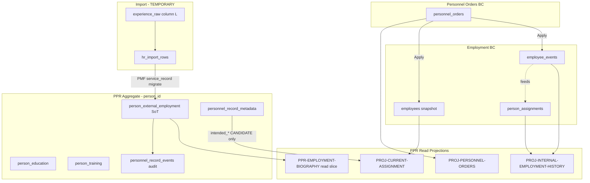

# ADR-056 — Employment Biography in PPR

## Status

**Proposed** — 2026-07-16 (rev. 0.2)

| Field | Value |
|-------|-------|
| Work Package | EPIC-4 (first section: Employment Biography) |
| Requested identifier | ADR-055 *(недоступен: [ADR-055](./ADR-055-operational-role-architecture.md) — Operational Role Architecture)* |
| Parent | [ADR-054](./ADR-054-personnel-personal-record-aggregate-model.md); [ARCH-002](../architecture/ARCH-002-personnel-personal-record-architecture.md) |
| Related | [WP-PR-002](../architecture/WP-PR-002-aggregate-boundary-specification.md); [WP-PR-003](../architecture/WP-PR-003-section-catalog-and-completeness-model.md); [ADR-047](./ADR-047-personnel-personal-file-architecture.md); [ADR-047-appendix-service-record-and-pdf-export](./ADR-047-appendix-service-record-and-pdf-export.md); [ADR-PMF-001](./ADR-PMF-001-personnel-migration-framework.md); [ADR-054-NOTE](./ADR-054-NOTE-intended-employment-lifecycle.md) |
| Runtime effect | **None** — no migrations, tables, or code in this ADR |
| Applicant → Employee | **Unchanged** — Hire flow, envelope lifecycle, `intended_*` semantics per ADR-054-NOTE |

---

## 1. Problem Statement

### 1.1. Симптомы

Исследование раздела «Трудовая деятельность» в канонической личной карточке PPR (2026-07-16) выявило системное несоответствие **названия вкладки** и **содержания**:

| Наблюдение | Факт |
|------------|------|
| Вкладка «Трудовая деятельность» у сотрудника | Рендерит `EmployeeOperationalAssignmentSection` — **текущее операционное назначение** (`GET /directory/employees/{id}`), не биографию |
| У заявителя (`hr_relationship_context = CANDIDATE`) | Секция **не монтируется**; пункт навигации ведёт в пустой якорь `#assignment` |
| PPR Query API | Не содержит employment biography slice; `SUPPORTED_SECTION_CODES` = только `PPR-EDUCATION`, `PPR-TRAINING` |
| Предыдущие места работы | Отсутствуют в typed `person_*` storage; import хранит сводный стаж в `experience_raw` (колонка L контрольного листка) |
| Ошибочный workaround | Размещение предыдущих мест в `person_training` с `source_field=pre_mmc_employment` — **отменено** как архитектурно неверное |

### 1.2. Нормативный разрыв

Официальная форма личного листка (§12 «Трудовая деятельность» + дополнение §I) требует **хронологической биографии** (организация, должность, периоды, основания). Текущая реализация покрывает лишь **срез «кто где сейчас»** в operational registry.

### 1.3. Цель ADR

Зафиксировать архитектуру **хранения и отображения трудовой биографии человека** в рамках PPR так, чтобы:

1. Разделить четыре независимых кадровых понятия (см. §4).
2. Ввести typed person-owned секцию для **предыдущей / внешней** трудовой деятельности.
3. Сохранить internal career и operational placement как **projection / OUT** bounded contexts.
4. Не затрагивать завершённый Applicant → Employee flow.
5. Стать базой для EPIC-4 и последующих WP-PR-013…019.

---

## 2. Existing Architecture

### 2.1. PPR aggregate (ADR-054 Variant B)

```text
Person (aggregate root, person_id)
  ├── personnel_record_metadata (envelope: lifecycle, hr_relationship_context, intended_*)
  ├── person_education          (PPR-EDUCATION — implemented)
  ├── person_training           (PPR-TRAINING — implemented)
  ├── personnel_record_events   (AUDIT — provenance journal)
  └── [missing] employment biography section
```

Composite read (`PprCompositeReadOrchestrator`) собирает `general`, `education`, `training`, `intended_employment` (только CANDIDATE), `events`. Employment biography **не участвует**.

### 2.2. Employment bounded context (OUT of PPR aggregate)

| Artifact | Role today |
|----------|------------|
| `employees` | Operational placement snapshot (org_unit, position, rate, status) |
| `person_assignments` | Person-scoped employment episodes (canonical sync, enrollment, transfer) |
| `employee_events` | Append-only employment journal (HIRE, TRANSFER, TERMINATION, …) |
| `personnel_orders` | Legal personnel acts; Apply создаёт/обновляет Employment |

### 2.3. Import / staging (TEMPORARY)

| Artifact | Employment-related content |
|----------|---------------------------|
| `hr_import_rows.normalized_payload.experience_raw` | Сводный стаж (текст: «22 года 3 мес») — **не структурированные эпизоды** |
| `ImportProfileCardSections` | Блок «Стаж» = расчёт от даты окончания образования; `experience_raw` не выводится как биография |
| PMF domain `service_record` (planned) | Target `person_work_history` в ADR-PMF-001 — **требует пересмотра** (см. §5) |

### 2.4. UI личной карточки (каноническая)

`PprPersonalCardPageClient` — секции:

- Общие сведения, Образование, Обучение — PPR read path ✓
- Предполагаемое трудоустройство — только CANDIDATE ✓
- **Трудовая деятельность** — фактически `PROJ-CURRENT-ASSIGNMENT`, только EMPLOYED с `employee_id` ✗
- Кадровые приказы — `personnel_orders` list, только EMPLOYED ✓
- История изменений — `personnel_record_events` summary ✓

---

## 3. Domain Analysis

### 3.1. Четыре независимых понятия

#### 3.1.1. Предыдущая трудовая деятельность человека (до / вне ММЦ)

| Aspect | Definition |
|--------|------------|
| **Смысл** | Места работы у **других** работодателей; периоды до первого приёма в ММЦ; внешнее совместительство **до** поступления; attestation «стаж отсутствует» |
| **SoT** | **`person_external_employment`** (PPR IN section `PPR-EMPLOYMENT-BIOGRAPHY`) |
| **Projection** | PPR composite read slice; PPR print PDF §12 (external block); control list export fragment (после promotion) |
| **Aggregate owner** | **Personnel Personal Record** (person_id) |
| **Lifecycle** | Append / update / void / supersede per row (`lifecycle_status`); **переживает** Hire, Rehire, Termination; не удаляется при смене `hr_relationship_context` |

**Не включает:** работу в ММЦ после приёма (это internal history).

#### 3.1.2. Внутренняя кадровая история работы в ММЦ

| Aspect | Definition |
|--------|------------|
| **Смысл** | Послужной список: приём, переводы, смена должности/ставки, увольнение, повторный приём |
| **SoT** | **`employee_events`** (append-only journal) + **`person_assignments`** (episode boundaries) + **`personnel_orders`** (legal basis, when linked) |
| **Projection** | **`PROJ-INTERNAL-EMPLOYMENT-HISTORY`** — read-only timeline; Service Record (ADR-047 appendix) |
| **Aggregate owner** | **Employment** bounded context (не PPR mutable section) |
| **Lifecycle** | Event-sourced: новые события append; VOIDED excluded from projection; rehire = new employee row + new events, same `person_id` |

#### 3.1.3. Текущее кадровое назначение

| Aspect | Definition |
|--------|------------|
| **Смысл** | Где человек работает **сейчас** в ММЦ: подразделение, должность, ставка, статус зачисления в Operational Directory |
| **SoT** | **`employees`** (operational snapshot) синхронизируется с последним approved employment event / assignment |
| **Projection** | **`PROJ-CURRENT-ASSIGNMENT`** — `EmployeeOperationalAssignmentSection` |
| **Aggregate owner** | **Employment** bounded context |
| **Lifecycle** | Меняется через Orders Apply, Transfer, Termination, enrollment wizard — **не** через PPR section edit |

#### 3.1.4. Кадровые приказы

| Aspect | Definition |
|--------|------------|
| **Смысл** | Юридически значимые акты: HIRE, TRANSFER, TERMINATION, совмещение, … |
| **SoT** | **`personnel_orders`** (+ items, lifecycle audit) |
| **Projection** | **`PROJ-PERSONNEL-ORDERS`** — список приказов в карточке; order display string в internal history timeline |
| **Aggregate owner** | **Personnel Orders** bounded context |
| **Lifecycle** | Draft → approval → Apply; Apply порождает `employee_events` / обновляет `employees`; PPR **читает**, не хранит приказы |

### 3.2. Связь с «Предполагаемое трудоустройство»

`intended_*` на `personnel_record_metadata` (ADR-054-NOTE) — **планирование до приказа**, не биография и не assignment. После Apply — historical only, не SoT. **Не смешивать** с `PPR-EMPLOYMENT-BIOGRAPHY`.

---

## 4. Alternatives Considered

### 4.1. Сравнительный анализ имён (naming comparison)

Три кандидата фигурируют в разных слоях документации. Ниже — явное сопоставление по **роли**, **границе aggregate**, **рискам** и **пригодности** как physical table для PPR-EMPLOYMENT-BIOGRAPHY.

| Критерий | `person_external_employment` | `person_employment_history` | `person_work_history` |
|----------|------------------------------|----------------------------|----------------------|
| **Первичный источник в документации** | WP-PR-002 §5, WP-PR-003 §3.1 (`PPR-EMPLOYMENT-BIOGRAPHY`) | ADR-047 four-layer §7 (#7 unified career timeline) | ADR-PMF-001 §5.1 (`service_record` domain seed) |
| **Семантика** | Эпизоды у **внешних** работодателей; периоды **до / вне** ММЦ | **Объединённая** карьера человека (external + internal) | «Послужной список» / колонка L (`experience_raw`); смешение biography и service record |
| **Aggregate classification** | **IN** — person-owned PPR section SoT | **PROJECTION / VIEW** — read model name | **Не определён** — задуман как target table, но пересекается с projection |
| **Включает работу в ММЦ?** | **Нет** (invariant EB-1) | **Да** — by design | Неявно да (PMF `service_record` ≠ только external) |
| **Rehire** | Rows на `person_id`; без fork Person | Timeline агрегирует все `employees` | Не специфицирован; риск дублирования при rehire |
| **Совместительство** | `employment_type` на **внешнем** эпизоде | Смешивает external part-time и internal `person_assignments` | Не различает контуры |
| **Конфликт с `person_assignments`** | Нет — разные таблицы, разные BC | Дублирует episode boundaries | Дублирует и events, и assignments |
| **Конфликт с `employee_events`** | Нет — internal остаётся event-sourced | **Да** — второй write path для internal rows | **Да** — service record vs append-only journal |
| **Миграция `experience_raw`** | Прямой target (`NARRATIVE_SUMMARY` / `EPISODE`) | Неясно: narrative — external или «весь стаж»? | Исторически задуман в PMF; семантика колонки L = сводный стаж, не episodes |
| **Расширяемость** | Typed rows + `record_kind`; evidence FK later | Лучше как API/projection layer поверх двух SoT | Плохая — имя слишком generic («work» = всё) |
| **Риск путаницы в UI** | Низкий — «external» однозначно | Высокий — HR не отличит editable от projection | Высокий — «history» звучит как послужной список |
| **Вердикт** | ✅ **Physical table** | ❌ **Только projection / read API name** | ❌ **Deprecated** как table; align PMF to `person_external_employment` |

**Вывод сравнения:**

1. **`person_external_employment`** — единственное имя, которое однозначно маркирует **внешний** контур и уже закреплено в PPR catalog.
2. **`person_employment_history`** — сохраняется для **unified career timeline** (например `GET /persons/{id}/employment-history` — merged read), **не** для storage.
3. **`person_work_history`** — **не создавать**; в ADR-PMF-001 seed заменить target на `person_external_employment` при реализации WP-PR-018.

Дополнительный кандидат `person_prior_employment` (§4.1 rev. 0.1) отклонён: семантически точен, но не согласован с WP-PR-003 и не покрывает внешнее совместительство **после** формального поступления, если такие данные вносятся ретроспективно.

### 4.2. Хранить всю биографию (включая ММЦ) в одной person_* таблице

| Pros | Cons |
|------|------|
| Один UI-запрос | Дублирование `employee_events`; нарушение AB-8 (internal history = projection); drift при Transfer |
| Проще ментальная модель «все работы в одном месте» | Два write path (PPR edit vs Orders) для internal rows |

**Rejected.** Internal ММЦ career остаётся event-sourced; PPR только **читает projection**.

### 4.3. Продолжать использовать `experience_raw` / Import Profile как permanent SoT

**Rejected.** Import — TEMPORARY bootstrap (WP-PR-002); не переживает read-switch; не поддерживает typed completeness / evidence.

### 4.4. Использовать `person_training` для employment episodes

**Rejected** (уже отменено). Training section — профессиональное обучение, не трудовые эпизоды.

---

## 5. Decision

### D1. Section code and storage

| Item | Value |
|------|-------|
| **Section code** | `PPR-EMPLOYMENT-BIOGRAPHY` |
| **Display name (RU)** | Трудовая биография (до поступления в ММЦ) — внутри вкладки «Трудовая деятельность» |
| **Storage table** | **`person_external_employment`** |
| **Cardinality** | 0..N per `person_id` |
| **Aggregate classification** | **IN** (person-owned PPR section SoT) |

### D2. PMF `service_record` domain retargeting

PMF plugin `service_record` (колонка L, `experience_raw`) **перенацеливается** на запись в `person_external_employment`, а не в `person_work_history`.

- Unparseable `experience_raw` → row с `record_kind = NARRATIVE_SUMMARY`.
- Structured episodes (future parser / manual entry) → `record_kind = EPISODE`.

Имя `person_work_history` в ADR-PMF-001 seed **deprecated** в пользу `person_external_employment` (documentation alignment, без retroactive rename в этом ADR).

### D3. Internal history naming

| Name | Role |
|------|------|
| `PROJ-INTERNAL-EMPLOYMENT-HISTORY` | Projection code (WP-PR-003) |
| Service Record / Послужной список | UI label для internal timeline |
| `person_employment_history` | **Зарезервировано** как имя **read API / view**, не physical table |

### D4. Current assignment placement (UI)

`PROJ-CURRENT-ASSIGNMENT` **не является** содержимым «Трудовая биография» и **не возвращается** как отдельная top-level вкладка (см. canonical card, WP-UI-PPR-CARD).

**Решение:** «Текущее назначение» — **вложенный подблок** внутри вкладки «Трудовая деятельность» → раздел «Работа в ММЦ», **не** самостоятельный пункт навигации.

| Вариант | Оценка |
|---------|--------|
| **Вложенный подблок** (принято) | Соответствует официальной форме (§12 + §I в одном разделе листка); меньше top-level tabs; заявитель видит только external block без пустого assignment |
| **Отдельная top-level вкладка «Текущее назначение»** | Отклонено — уже сознательно убрана из canonical PPR; смешивает operational contour с dossier; дублирует staff/employees контур |
| **Вынести в «Персонал» / Employee drawer** | Отклонено для PPR card — assignment остаётся **читаемым** в личной карточке, но не подменяет biography |

Якорь: `#employment-current` внутри `#employment` (см. §10).

### D5. External biography immutability (person-identity)

Записи `person_external_employment` привязаны к **`person_id`**, не к `employee_id`. Смена кадрового статуса **не изменяет** и **не пересоздаёт** внешнюю биографию.

| Событие | Поведение external biography |
|---------|------------------------------|
| Materialize PPR (CANDIDATE) | Rows создаются / мигрируют на `person_id` |
| Apply HIRE | Rows **сохраняются**; `hr_relationship_context` меняется; **нет** copy-on-hire |
| Rehire (тот же `person_id`) | Rows **сохраняются**; **нет** duplicate rows из-за нового `employees` |
| Termination | Rows **сохраняются** |
| Person merge (survivor) | Rows переносятся на survivor per merge policy (EPIC-10); void на merged-away |
| Попытка записать internal ММЦ episode | **Запрещено** (EB-1) |

**Редактирование после Hire:** допускается **только** через PPR section commands (supersede / void + replace) с audit в `personnel_record_events` — **не** через Orders, **не** через assignment correction. Содержание external rows **не выводится** из `employee_events`.

### D6. Applicant → Employee flow

**Без изменений.** Hire создаёт `employees` + events; `hr_relationship_context`: CANDIDATE → EMPLOYED; `person_external_employment` rows **не копируются и не дублируются**.

---

## 6. Aggregate Boundaries

```text
┌──────────────────────────────────────────────────────────────────────┐
│         PERSONNEL PERSONAL RECORD (aggregate, person_id)              │
│                                                                       │
│  IN SoT:                                                              │
│    person_external_employment  ← PPR-EMPLOYMENT-BIOGRAPHY (NEW)      │
│    person_education, person_training, …                               │
│                                                                       │
│  AUDIT: personnel_record_events                                       │
│  ENVELOPE: personnel_record_metadata (intended_* = planning only)     │
└───────────────────────────────┬──────────────────────────────────────┘
                                │ person_id (read-only link)
        ┌───────────────────────┼───────────────────────┐
        ▼                       ▼                       ▼
   TEMPORARY              EMPLOYMENT BC            PERSONNEL ORDERS BC
   hr_import_rows         employees                 personnel_orders
   experience_raw         person_assignments        (legal acts)
   PMF service_record       employee_events
        │                       │
        │ migrate               │ project
        ▼                       ▼
   person_external_employment   PROJ-INTERNAL-EMPLOYMENT-HISTORY
                               PROJ-CURRENT-ASSIGNMENT
                               PROJ-PERSONNEL-ORDERS
```

**Invariant EB-1:** Ни одна internal ММЦ запись **не записывается** в `person_external_employment`.

**Invariant EB-2:** Редактирование internal career — **только** через Personnel Orders / employment correction APIs, не через PPR section commands.

**Invariant EB-3:** `person_external_employment` переживает Rehire на том же `person_id` без копирования в новый Person.

**Invariant EB-4 (immutability of identity binding):** Внешняя биография **никогда не переносится** на другой `person_id` при Hire/Rehire; **не клонируется** при создании `employees`; **не дублируется** при повторном приёме того же человека.

**Invariant EB-5 (immutability of contour):** Записи external biography **не обновляются** из `employee_events`, `person_assignments`, `personnel_orders` Apply или enrollment wizard. Обратная синхронизация internal → external **запрещена**.

**Invariant EB-6 (mutation model):** Исправления — только **supersede** или **void** prior row + новая row; in-place overwrite без audit **запрещён** (как `person_education` / `person_training`).

**Invariant EB-7 (lifecycle independence):** `lifecycle_status` external rows **не зависит** от `hr_relationship_context`, `employees.is_active` или operational enrollment status.

### 6.1. External biography immutability — summary rule

> **Правило EB-SUM:** Внешняя трудовая биография — **постоянный person-owned слой**. Она переживает Hire, Rehire и Termination на том же `person_id`, не копируется, не порождается заново из Employment BC и не смешивается с internal career. Единственный write path — PPR section commands (+ PMF migration); единственный read SoT — `person_external_employment`.

---

## 7. Source of Truth

| Data domain | Primary SoT | Transitional input | PPR role |
|-------------|-------------|-------------------|----------|
| **Предыдущая / внешняя работа** | `person_external_employment` | `hr_import_rows.experience_raw`; manual HR entry | **IN SoT** |
| **Сводный стаж (текст)** | Narrative row in `person_external_employment` OR derived display | `experience_raw` until migrated | Promoted on PMF commit |
| **Работа в ММЦ (история)** | `employee_events` + `person_assignments` | Canonical snapshot sync | **Projection only** |
| **Текущее назначение** | `employees` (+ active assignment) | `intended_*` until HIRE Apply only | **Projection only** |
| **Кадровые приказы** | `personnel_orders` | — | **Projection only** (list in card) |
| **Предполагаемое трудоустройство** | `personnel_record_metadata.intended_*` | — | Envelope field; **не** biography |

### 7.1. Архитектурная схема потоков данных



---

## 8. Data Provenance

Происхождение записей фиксируется в полях `source_system`, `source_id`, `provenance` (JSONB) и в audit journal `personnel_record_events`. Ниже — **канонический перечень источников** для `person_external_employment`.

### 8.1. Источники записей external biography

| `source_system` | Origin | Typical `source_id` | Когда создаётся | Permanent? |
|-----------------|--------|---------------------|-----------------|------------|
| **`manual`** | Ручной ввод HR в PPR UI / command API | `command_id` или NULL | CANDIDATE или EMPLOYED; до/после Hire | ✅ SoT row |
| **`import_row`** | Прямой promotion из `hr_import_rows` (без PMF run) | `row_id` | Legacy / ops one-off | ✅ после promotion |
| **`pmf_migration`** | PMF `service_record` plugin commit | `run_id` + `item_id` | Migration wizard / batch | ✅ после commit |
| **`integration`** | Внешняя система (будущее) | external correlation id | API / ETL | ✅ после ingest |
| **`supersede`** | Замена prior row (не отдельный source_system — marker в `provenance`) | prior `employment_id` | HR correction | ✅ new row; prior → `superseded` |
| **`attestation`** | HR attestation «стаж отсутствует» | NULL или form ref | First hire checklist | ✅ `ATTESTATION_NONE` |

### 8.2. Источники, которые **не** являются SoT (только feeder)

| Source | Role | After migration |
|--------|------|-----------------|
| `hr_import_rows.normalized_payload.experience_raw` | Staging text (колонка L) | Read-only archive; PPR reads `person_external_employment` |
| `ImportProfileCardSections` calculated experience from education | UI-derived hint | **Не** пишется в external biography (OQ-EB-5) |
| `hr_canonical_snapshot_entries.payload.experience_raw` | Canonical roster snapshot | Export / reconciliation only |
| `employee_import_profile_overrides` | Transitional employee-scoped JSONB | Deprecated path |

### 8.3. Provenance payload (conceptual JSONB)

Минимальные ключи для audit и reconciliation:

```json
{
  "source_field": "experience_raw",
  "batch_id": 148,
  "row_id": 9538,
  "import_filename": "control_list_2026-03.xlsx",
  "parser_version": null,
  "migration_domain": "service_record",
  "actor_id": "user:42",
  "captured_at": "2026-07-16T10:00:00Z",
  "supersedes_employment_id": null
}
```

### 8.4. Provenance для internal projections (read-only, не в `person_external_employment`)

| Projection | Primary provenance chain |
|------------|-------------------------|
| `PROJ-INTERNAL-EMPLOYMENT-HISTORY` | `employee_events.source` → `personnel_orders.order_id` → Apply actor |
| `PROJ-CURRENT-ASSIGNMENT` | Last APPROVED employment event → `employees` snapshot sync |
| `PROJ-PERSONNEL-ORDERS` | `personnel_orders` lifecycle audit |

### 8.5. Audit trail

Все мутации external biography → `personnel_record_events` с `section_code = PPR-EMPLOYMENT-BIOGRAPHY`, `record_table_name = person_external_employment`. Import staging mutations **не** пишутся в PPR events до PMF commit.

---

## 9. Projection Strategy

### 9.1. `PROJ-INTERNAL-EMPLOYMENT-HISTORY` (Послужной список)

| Aspect | Design |
|--------|--------|
| **Sources** | `employee_events` (APPROVED, EMPLOYMENT class) joined via `employees.person_id`; enrich with `personnel_orders` display when `order_id` available |
| **Episode boundaries** | `person_assignments` for gap detection and canonical reconciliation |
| **Exclusions** | VOIDED events; import-only staging |
| **Write path** | **None** from PPR UI — только Orders / employment services |
| **Multi-employee rehire** | Aggregate by `person_id` across all `employees` rows for person |
| **Reference** | ADR-047 appendix §2–§6; `ADR-047-person-service-record-timeline.sql` |

### 9.2. `PROJ-CURRENT-ASSIGNMENT`

Unchanged source (`employees` + directory joins). **Label fix:** UI «Текущее назначение». **Placement:** nested under «Работа в ММЦ» (D4), not top-level nav.

### 9.3. `PROJ-PERSONNEL-ORDERS`

Unchanged — separate top-level tab «Кадровые приказы».

### 9.4. PPR composite read extension (future)

`PprCompositeReadOrchestrator` gains:

- `employment_biography` slice from `person_external_employment` (authoritative IN section)
- Optional `internal_employment_history` preview (delegated projection reader — not in aggregate write path)

---

## 10. UI Strategy

### 10.1. Принцип: название вкладки = содержание

Вкладка **«Трудовая деятельность»** должна отражать **биографию труда человека**, а не только operational snapshot.

### 10.2. Структура карточки (принятая)

```text
Личная карточка по учёту кадров
├── Общие сведения
├── Образование
├── Обучение и повышение квалификации
├── Предполагаемое трудоустройство          ← только CANDIDATE (без изменений)
├── Трудовая деятельность                   ← ПЕРЕРАБОТАТЬ
│   ├── [1] До поступления в ММЦ            ← PPR-EMPLOYMENT-BIOGRAPHY (person_external_employment)
│   │       таблица эпизодов + narrative summary row
│   └── [2] Работа в ММЦ                    ← только EMPLOYED (projections)
│       ├── Текущее назначение              ← PROJ-CURRENT-ASSIGNMENT (бывш. ошибочный контент вкладки)
│       └── Послужной список                ← PROJ-INTERNAL-EMPLOYMENT-HISTORY (read-only timeline)
├── Кадровые приказы                        ← только EMPLOYED; без изменений по SoT
└── История изменений
```

### 10.3. «Текущее назначение»: вложенный блок, не отдельная вкладка

Архитектурное решение **D4** (rev. 0.2):

| Вопрос | Решение |
|--------|---------|
| Оставить «Текущее назначение» внутри «Трудовая деятельность»? | **Да** — как подблок «Работа в ММЦ» → «Текущее назначение» |
| Выделить в самостоятельную top-level вкладку? | **Нет** — отклонено (canonical PPR уже убрал отдельную вкладку) |
| Показывать заявителю? | **Нет** — блок скрыт до EMPLOYED |
| Чем отличается от biography? | Projection из Employment BC; правки через Orders/enrollment, не PPR section edit |

Обоснование: официальный листок объединяет биографию и послужной список в одном разделе; operational «где сейчас» логически предшествует хронологии внутри ММЦ; отдельная вкладка вновь создаст путаницу, которую устранял canonical card refactor.

### 10.4. Поведение по lifecycle

| `hr_relationship_context` | «Трудовая деятельность» content |
|---------------------------|----------------------------------|
| **CANDIDATE** | Только блок **[1] До поступления в ММЦ**; блок **[2]** скрыт; empty state + manual add + import migration CTA |
| **EMPLOYED** | **[1]** read/edit per policy + **[2]** projections |
| **Former** (future) | **[1]** preserved + **[2]** full history including terminated episodes |

### 10.5. Навигация

- `PprCardSectionNav`: показывать «Трудовая деятельность» для **всех** materialized PPR (включая CANDIDATE).
- Убрать пустой якорь: секция `#assignment` → `#employment` с подякорями `#employment-prior`, `#employment-internal`, `#employment-current`, `#employment-service-record`.
- **Не** добавлять в `PPR_CARD_SECTIONS` отдельный id `current_assignment` — только подякорь внутри `employment`.

### 10.6. Заявитель

Баннер «Заявитель» и «Предполагаемое трудоустройство» — без изменений. Биография до ММЦ **доступна до Hire** — это ключевое отличие от assignment/orders.

---

## 11. Migration Strategy

### 11.1. Принципы

| Principle | Rule |
|-----------|------|
| **No dual SoT** | После PMF commit для person — `person_external_employment` authoritative; `experience_raw` — staging only |
| **Idempotent** | PMF commit keys: `(person_id, source_system, source_id, record_kind)` |
| **Non-destructive** | Import rows не удаляются; migration audit в `personnel_migration_items` |
| **Applicant-safe** | Migration по `person_id` без требования `employee_id` |

### 11.2. Mapping `experience_raw` → `person_external_employment`

| Source shape | Target row |
|--------------|------------|
| Non-empty `experience_raw` text (типичный случай: «22 года 3 мес») | `record_kind = NARRATIVE_SUMMARY`; `notes` = full text; `employer_name` NULL |
| Future structured parser output | `record_kind = EPISODE`; typed fields populated |
| Empty + education-based calc only | **Не мигрировать** автоматически; UI calc остаётся в Import Profile до отдельного policy decision |
| Attestation «нет стажа» | `record_kind = ATTESTATION_NONE`; policy `EMPLOYMENT_BIO_FIRST_HIRE` (WP-PR-003) |

### 11.3. PMF `service_record` plugin flow

```text
hr_import_rows.experience_raw
  → MigrationCandidate(source_field=experience_raw)
  → map_candidate_to_draft → PersonnelDraftRecord[]
  → validate_draft
  → write_records → INSERT person_external_employment
  → personnel_record_events (audit)
```

### 11.4. Read-switch

После WP-PR-016 (Query API): PPR card reads `employment_biography` from composite API; Import Profile `experience_raw` display — **transitional** until row-level migration complete.

### 11.5. Explicit non-goals migration

- **Не** парсить `experience_raw` в internal `employee_events`.
- **Не** создавать `employees` / assignments из biography rows.
- **Не** копировать biography при Hire.

---

## 12. Data Model (design only)

### 12.1. Table: `person_external_employment` (proposed)

**Grain:** one employment episode OR narrative summary OR attestation per row.

| Field | Type (conceptual) | Required | Notes |
|-------|-------------------|----------|-------|
| `employment_id` | BIGINT PK | ✅ | Surrogate |
| `person_id` | BIGINT FK → persons | ✅ | Aggregate owner |
| `record_kind` | ENUM | ✅ | `EPISODE`, `NARRATIVE_SUMMARY`, `ATTESTATION_NONE` |
| `employer_name` | TEXT | ⚠️ | Required for `EPISODE`; NULL for narrative/attestation |
| `department_name` | TEXT | ❌ | Подразделение у внешнего работодателя |
| `position_title` | TEXT | ⚠️ | Required for `EPISODE` |
| `employment_type` | ENUM | ❌ | `primary`, `part_time`, `contract`, `internship`, `other` — внешний контур |
| `started_at` | DATE | ⚠️ | Required for `EPISODE` when known |
| `ended_at` | DATE | ❌ | NULL = «по настоящее время» на момент записи |
| `termination_reason` | TEXT | ❌ | |
| `document_reference` | TEXT | ❌ | Трудовая книжка, справка, договор |
| `source_system` | ENUM | ✅ | `manual`, `import_row`, `pmf_migration`, `integration` |
| `source_id` | TEXT | ❌ | `row_id`, migration run id, external ref |
| `provenance` | JSONB | ❌ | Batch id, actor, import filename, parser version |
| `verification_status` | ENUM | ✅ | `pending`, `verified`, `disputed` — default `pending` |
| `lifecycle_status` | ENUM | ✅ | `active`, `superseded`, `voided` — PMF/PPR standard |
| `notes` | TEXT | ❌ | Free text; primary storage for `NARRATIVE_SUMMARY` |
| `employee_context_id` | BIGINT NULL | ❌ | Optional audit: which employee period HR used when capturing |
| `metadata` | JSONB | ❌ | Extension |
| `created_at`, `updated_at` | TIMESTAMPTZ | ✅ | Optimistic concurrency (interim) |

**Constraints (conceptual):**

- `EPISODE` requires `employer_name` + (`started_at` OR `notes` explaining missing dates).
- `ended_at >= started_at` when both present.
- No `is_internal` column — **все rows implicitly external**; internal work forbidden (EB-1).

### 12.2. Section commands (future, WP-PR-015)

Mirror `person_education` / `person_training` pattern:

- `AddExternalEmploymentRecord`
- `UpdateExternalEmploymentRecord`
- `VoidExternalEmploymentRecord`
- `SupersedeExternalEmploymentRecord`

Events → `personnel_record_events` with `section_code = PPR-EMPLOYMENT-BIOGRAPHY`.

---

## 13. Applicant → Employee Behavior

### 13.1. На Apply HIRE (без изменений flow)

| Artifact | Behavior |
|----------|----------|
| `person_id` | **Тот же** — новый Person не создаётся |
| PPR envelope | **Тот же** — новый PPR не создаётся; `hr_relationship_context` → EMPLOYED |
| `person_external_employment` | **Все rows сохраняются**; read-only в UI по policy (или HR-edit с audit) |
| `intended_*` | Historical only (ADR-054-NOTE); не копируется в biography |
| Internal history | **Пусто до Apply**; первый episode появляется из HIRE event / assignment |
| Current assignment | Создаётся `employees` + `employee_events` + `person_assignments` из order payload |

### 13.2. Rehire (тот же person_id)

- External biography: **без копирования**, rows накоплены с первого кандидатского этапа.
- Internal history: **append** новых events; projection объединяет все `employees` для `person_id`.
- **Запрещено:** duplicate `person_external_employment` rows on rehire; fork Person; shadow PPR.

### 13.3. Совместительство

- **Внешнее** совместительство до ММЦ → `person_external_employment.employment_type = part_time`.
- **Внутреннее** совместительство в ММЦ → `person_assignments.employment_type` + `employee_events`; **не** в `person_external_employment`.

---

## 14. Roadmap

Декомпозиция EPIC-4 для Employment Biography. Нумерация WP-PR-013+ следует за [WP-PR-012](../architecture/WP-PR-012-ppr-implementation-roadmap.md).

| Phase | ID | Goal | Delivers | Depends on |
|-------|-----|------|----------|------------|
| 1 | **WP-PR-013** | Employment Biography Schema | Migration `person_external_employment`; enums; domain models; architecture guard tests | R1–R5 (PPR write path) |
| 2 | **WP-PR-014** | Section Repositories | `SectionReadRepository` / write repo for `PPR-EMPLOYMENT-BIOGRAPHY`; contract tests | WP-PR-013 |
| 3 | **WP-PR-015** | Application Layer | Section commands/handlers; envelope gate; `personnel_record_events` | WP-PR-014, R5 |
| 4 | **WP-PR-016** | Query API | `employment_biography` in `PprCompositeReadResponse`; mappers | WP-PR-015, R6–R7 |
| 5 | **WP-PR-017** | PPR UI | `PprCardEmploymentBiographySection`; restructure «Трудовая деятельность»; applicant visibility | WP-PR-016 |
| 6 | **WP-PR-018** | Import / PMF Migration | Retarget `service_record` plugin; `experience_raw` → narrative rows; wizard entry | WP-PR-015, PMF-7 |
| 7 | **WP-PR-019** | Service Record Projection | `PROJ-INTERNAL-EMPLOYMENT-HISTORY` reader; timeline in card block «Послужной список» | WP-PR-017, ADR-047 timeline SQL |
| 8 | **WP-PR-020** (optional) | Completeness policy | `PPR-EMPLOYMENT-BIOGRAPHY` rules in evaluation engine (WP-PR-006) | WP-PR-018 |

**Parallel constraint:** WP-PR-017 UI block «Послужной список» может ship с placeholder until WP-PR-019.

---

## 15. Consequences

### Positive

- Соответствие официальной форме §12 для external biography.
- Заявители получают содержательную вкладку до Hire.
- Чёткая граница PPR IN vs Employment OUT — меньше drift.
- EPIC-4 первый typed section с clear SoT и migration path.
- Rehire-safe person-centric history.

### Negative / costs

- Новая таблица + полный vertical slice (schema → UI).
- PMF `service_record` plugin и ADR-PMF-001 table seed требуют documentation update.
- `experience_raw` не даёт structured episodes — narrative-first migration.
- Два блока в одной вкладке усложняют UI; компенсируется подзаголовками.

### Risks

| Risk | Mitigation |
|------|------------|
| HR путает external vs internal rows | UI partition + invariant EB-1; training |
| Dual display import + PPR | Read-switch; hide `experience_raw` after migration |
| Projection lag after Hire | Event-driven refresh; read-after-write on orders apply |
| Parser over-engineering | Phase 1: NARRATIVE_SUMMARY only; EPISODE manual entry |

---

## 16. Open Questions

| ID | Question | Default if unresolved |
|----|----------|----------------------|
| OQ-EB-1 | Обязательность biography для CANDIDATE readiness | CONDITIONAL per WP-PR-003; attestation allowed |
| OQ-EB-2 | Может ли HR edit external rows после EMPLOYED | Yes with audit + supersede pattern (EB-6) |
| OQ-EB-3 | Парсер `experience_raw` → EPISODE rows | Defer post WP-PR-018; narrative sufficient Phase 1 |
| OQ-EB-4 | Evidence linkage (`person_documents` FK) | Optional Phase 2 |
| OQ-EB-5 | Показывать ли calculated experience from education в PPR | No — остаётся Import Profile only; не смешивать с biography SoT |
| OQ-EB-6 | «Текущее назначение» — отдельная вкладка vs nested | **Closed (rev. 0.2):** nested under «Работа в ММЦ» (D4); не top-level |
| OQ-EB-7 | Отдельная top-level вкладка «Послужной список» vs nested | **Nested** under «Работа в ММЦ» |
| OQ-EB-8 | `employee_context_id` on external rows — mandatory on post-hire edit | Optional audit field |

---

## 17. Compliance Checklist (review)

- [ ] Согласовано с WP-PR-002 aggregate boundaries (AB-7, AB-8)
- [ ] Согласовано с WP-PR-003 section catalog (`PPR-EMPLOYMENT-BIOGRAPHY`)
- [ ] Не меняет ADR-054-NOTE / Hire flow
- [ ] PMF alignment plan для `service_record`
- [ ] UI naming audit пройден (D4: current assignment nested)
- [ ] Data Provenance catalog согласован с PMF commit keys
- [ ] Immutability invariants EB-4…EB-7 приняты
- [ ] EPIC-4 roadmap entry добавлен в ARCH-002-IMPLEMENTATION-ROADMAP (при принятии ADR)

---

## Appendix A — Investigation artifacts (2026-07-16)

Исследование, на котором основан ADR:

- Вкладка `assignment` в `PprPersonalCardPageClient.tsx` → `EmployeeOperationalAssignmentSection`
- PPR orchestrator без employment section
- DB: только `person_education`, `person_training`, `person_assignments` among person_* employment-related tables
- 1024 import rows with `experience_raw`; applicants 204/206 без biography data
- `pre_mmc_employment` в кодовой базе отсутствует

---

## Appendix B — Files reviewed (read-only)

### Frontend
- `corpsite-ui/app/directory/personnel/_components/PprPersonalCardPageClient.tsx`
- `corpsite-ui/app/directory/personnel/_components/EmployeeOperationalAssignmentSection.tsx`
- `corpsite-ui/app/directory/personnel/_components/PprCardSectionNav.tsx`
- `corpsite-ui/lib/pprCardSections.ts`
- `corpsite-ui/app/directory/personnel/_lib/pprQueryApi.client.ts`
- `corpsite-ui/app/directory/personnel/_components/ImportProfileCardSections.tsx`
- `corpsite-ui/app/directory/personnel/_lib/importProfileEditor.ts`

### Backend PPR
- `app/ppr/read/orchestrator.py`
- `app/ppr/read/section_aggregation.py`
- `app/ppr/domain/section_models.py`
- `app/api/ppr_router.py`
- `app/api/ppr_schemas.py`
- `app/services/ppr_candidate_service.py`

### Architecture / ADR
- `docs/architecture/WP-PR-002-aggregate-boundary-specification.md`
- `docs/architecture/WP-PR-003-section-catalog-and-completeness-model.md`
- `docs/architecture/WP-PR-012-ppr-implementation-roadmap.md`
- `docs/adr/ADR-047-personnel-personal-file-architecture.md`
- `docs/adr/ADR-047-appendix-service-record-and-pdf-export.md`
- `docs/adr/ADR-054-personnel-personal-record-aggregate-model.md`
- `docs/adr/ADR-054-NOTE-intended-employment-lifecycle.md`
- `docs/adr/ADR-PMF-001-personnel-migration-framework.md`

### Schema reference
- `alembic/versions/u3v4w5x6y7z8_adr042_phase_b2_1_schema.py` (`person_assignments`)
- `alembic/versions/q1r2s3t4u5w6_pmf_1_personnel_migration_schema.py`
- `scripts/import_hr_control_list.py`

---

## Appendix C — Implementation boundary statement

**Подтверждение:** при подготовке и редакции rev. 0.2 настоящего ADR **не изменялись** код приложения, схема БД, миграции Alembic, frontend, backend, Applicant Flow, Hire Flow. **Commit и push не выполнялись.**

---

## Revision history

| Rev | Date | Changes |
|-----|------|---------|
| 0.1 | 2026-07-16 | Initial proposed ADR |
| 0.2 | 2026-07-16 | §4.1 comparative naming matrix; §6.1 + EB-4…EB-7 immutability; §8 Data Provenance; §10.3 D4 current assignment placement; section renumber |

---

*End of ADR-056*
