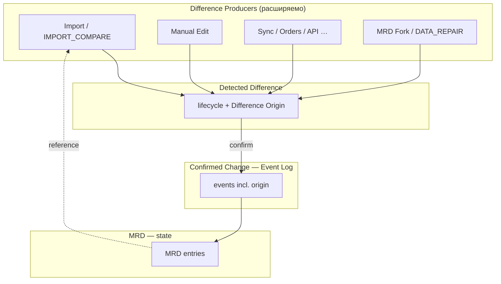
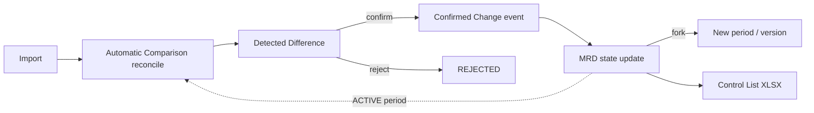
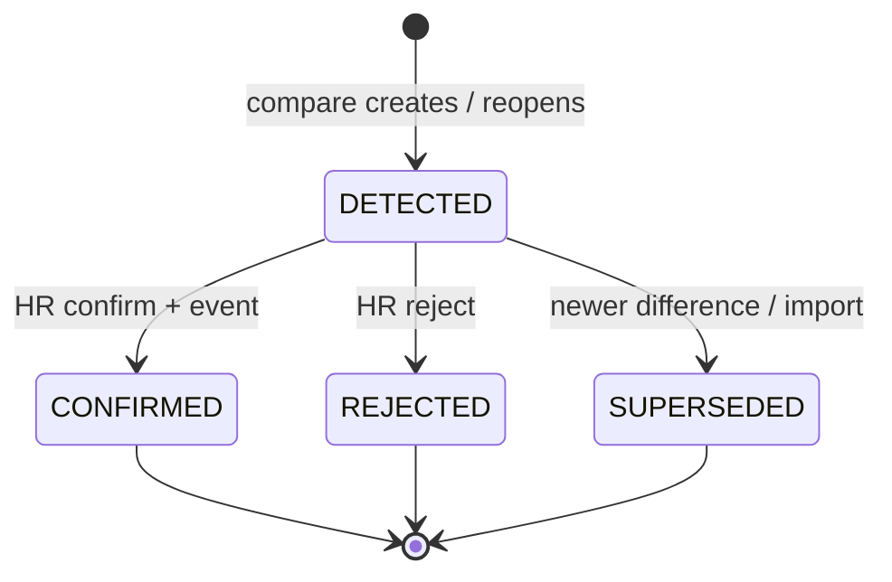

# ADR-058 — Monthly Reference Dataset (Месячный эталонный набор данных)

## Status

**Accepted** (2026-07-19, редакция v4)

| Field | Value |
|-------|-------|
| Supersedes | [ADR-045](./ADR-045-baseline-publication-origin.md) (концепция «публикации импорта») |
| Amends workflow | [ADR-040](./ADR-040-canonical-hr-snapshot-monthly-diff.md) (цель сравнения и момент фиксации эталона) |
| Related | [ADR-038](./ADR-038-employee-identity-hr-import-architecture.md), [ADR-038-data-sync-and-hr-import-persistence.md](./ADR-038-data-sync-and-hr-import-persistence.md), [Control List Interchange](../architecture/ADR-057-control-list-interchange-architecture.md) |
| Assessment | [ADR-058 Architecture Assessment](../../docs-work/ADR-058-monthly-reference-architecture-assessment.md) |

---

## Terminology

| Контекст | Термин |
|----------|--------|
| **Код** (таблицы, API, типы, сервисы, enum) | **MRD**, **Detected Difference**, **Confirmed Change**, **Difference Origin** |
| **ADR, документация, постановки задач, UI для кадровика** | **Месячный эталонный набор данных**, **обнаруженное различие**, **подтверждённое изменение**, **происхождение различия** |

Примеры:

- код: `DifferenceOrigin.IMPORT_COMPARE`, `difference_origin_code`, `origin_context`;
- документ: «различие с происхождением IMPORT_COMPARE обнаружено при сравнении импорта с Месячным эталонным набором данных».

Legacy-имена (`Baseline`, `Publish Baseline`, `hr_control_list_baselines`) сохраняются в as-is коде до refactor WP; в новой документации не используются.

---

## Context

Текущая реализация (ADR-040 → ADR-045) выросла из модели **Canonical Snapshot / Baseline**, где:

1. Импорт проходит ручной review строк.
2. Batch переводится в `APPLY_PENDING` через **Complete Import Review**.
3. Кадровик выполняет **Publish Baseline** — весь состав импорта материализуется как эталон периода.
4. Следующие импорты сравниваются с **Effective Baseline**.

Эта модель смешивает временный импорт, процесс принятия решений и авторитетное состояние данных. Кадровик вынужден работать со **строками импорта**, хотя предмет работы — **различия** относительно уже подтверждённого состояния.

---

## Decision

Полностью пересмотреть модель. **Главный бизнес-объект — Месячный эталонный набор данных (MRD)**, а не Import и не Baseline-as-publication.

### D0 — Три ключевые сущности и цепочка обработки

Ядро модели — **три явно разделённых сущности**:

| Сущность | Роль | Характер данных |
|----------|------|-----------------|
| **MRD** | Текущее **подтверждённое состояние** кадровых данных периода | Mutable state (entries ACTIVE версии) |
| **Detected Difference** | Различие, **ожидающее или прошедшее** обработку кадровиком | Persistent business entity + lifecycle |
| **Confirmed Change** | **Неизменяемый журнал** подтверждений (Event Log) | Append-only audit events |

```text
[Difference Producer]          ← Import, manual edit, sync, orders, API, …
  → Detected Difference        ← lifecycle + Difference Origin
  → HR: confirm / reject
  → Confirmed Change (event)
  → MRD state update
```

**Import и Automatic Comparison** — **один из** producers различий (origin `IMPORT_COMPARE`), но **не единственный**. Архитектура Detected Difference **не привязана** к import pipeline; любая подсистема может создавать различия через общий контракт producer → difference.

| Вспомогательная сущность | Назначение | Хранение |
|--------------------------|------------|----------|
| **Import** | Временный источник данных файла; **один из** producers `IMPORT_COMPARE` | Staging (`hr_import_*`) |
| **Difference Producer** | Любой компонент, материализующий Detected Difference | Код сервисов; origin в difference |
| **Automatic Comparison** | Producer-класс: import vs ACTIVE MRD + reconcile | `hr_comparison_runs` |

**MRD не дублирует** историю различий и подтверждений — только актуальное подтверждённое состояние. Detected Difference хранит процесс обработки. Confirmed Change — неизменяемый аудит.

### D1 — Импорт: временный источник

**Import Batch** — временная рабочая область. Импорт:

- **не утверждается**;
- **не публикуется**;
- **не становится** Месячным эталонным набором данных;
- может загружаться **многократно** для анализа.

После загрузки и нормализации система **автоматически** запускает Automatic Comparison — producer с origin **`IMPORT_COMPARE`**. Кадровик **не анализирует импорт вручную** и **не работает непосредственно со строками импорта** — только со **списком Detected Differences**, в том числе из других источников (см. D3 — Difference Origin).

**Import не является единственным источником различий.** В будущем различия могут поступать из кадровых приказов, интеграций, API, сервисов синхронизации, ручных правок и иных подсистем — **без изменения модели** Detected Difference (меняется только producer и `difference_origin_code`).

**Следствия:**

- UI review строк импорта (roster/normalized) **не является** primary HR workflow в целевой модели; заменяется экраном «Обнаруженные различия».
- Статус batch отражает техническую готовность (parsed, compared, errors) — не «готовность к публикации».
- Удаление batch не затрагивает MRD.

### D2 — MRD: главный объект и только подтверждённое состояние

**MRD** — авторитетный набор кадровых данных контрольного списка за календарный отчётный месяц.

Идентификация в документации:

```text
Месячный эталонный набор данных MM.YYYY vN
Примеры:
  06.2026 v1
  06.2026 v2
  07.2026 v1
```

MRD — **единственный SoT** HR Canonical Registry (ADR-040 / ADR-041). Состав entries — только **подтверждённые** roster- и normalized-сведения (effective payload после merge overrides).

### D3 — Detected Difference: самостоятельная бизнес-сущность

**Detected Difference** — **самостоятельная persistent business entity**, а не временный результат скрипта сравнения и не denormalized cache на строке import.

#### Automatic Comparison и reconcile

**Automatic Comparison** выполняется системой без участия кадровика:

1. Определить `ACTIVE(period)` для `report_period` импорта (см. D7).
2. Вычислить candidate-различия: import vs MRD entries (match keys, canonical hash — ADR-040).
3. **Reconcile** с уже существующими Detected Differences периода — **не создавать новый набор «с нуля»** при каждом прогоне.

Правила reconcile (ориентир):

| Существующее различие | Действие compare-run |
|----------------------|----------------------|
| `DETECTED`, candidate совпадает | Оставить; обновить ссылку на последний import run |
| `DETECTED`, candidate изменился (другое `new_value`) | Пометить старое **`SUPERSEDED`**; создать новое `DETECTED` со ссылкой `supersedes_difference_id` |
| `CONFIRMED` / `REJECTED` | **Не пересоздавать**; candidate для того же logical key не попадает в очередь HR |
| Candidate новый, нет открытого `DETECTED` | Создать новое `DETECTED` |
| Candidate исчез (import больше не содержит отличия) | Открытое `DETECTED` → **`SUPERSEDED`** или auto-close по политике |

Stable logical key (код): `report_period` + `mrd_id` + `entity_scope` + `attribute` (+ `record_kind` при необходимости).

Каждое различие описывается на уровне **конкретного атрибута** (должность, подразделение, категория, обучение, ставка, увольнение и т.д.).

#### Жизненный цикл Detected Difference

```text
DETECTED → CONFIRMED
         → REJECTED
         → SUPERSEDED
```

| Status | Описание |
|--------|----------|
| **`DETECTED`** | Обнаружено; ожидает решения HR; видно в рабочей очереди |
| **`CONFIRMED`** | HR подтвердил; терминальный для очереди; связан с Confirmed Change event |
| **`REJECTED`** | HR отклонил; MRD не менялся; терминальный |
| **`SUPERSEDED`** | Заменено более поздним различием (новый import / новый candidate); сохраняется для истории |

Переходы `CONFIRMED` / `REJECTED` **необратимы**. Повторная обработка того же logical key после reject — только через **новое** `DETECTED` (если compare снова обнаружит отличие).

Эффекты lifecycle:

- сохраняются решения кадровика;
- не теряется история обработки;
- не создаются повторно уже обработанные различия;
- видна цепочка «какое различие заменено каким» (`supersedes_difference_id`).

#### Бизнес-типы различий

Помимо lifecycle status, каждое Detected Difference имеет **бизнес-тип** (не путать со status):

| Бизнес-тип | Условие | Пример |
|------------|---------|--------|
| **`NEVER_CONFIRMED`** | Сведения **ещё ни разу не подтверждались** и **отсутствуют** в подтверждённом состоянии MRD | Новый сотрудник в файле; новая категория, которой нет в MRD |
| **`PERIOD_CHANGED`** | Сведения **уже были подтверждены** в MRD, но **изменились** в течение текущего календарного месяца относительно текущего ACTIVE MRD | Подтверждённая должность «Медсестра» → в новом import «Старшая медсестра» |

Mapping (ориентир):

| ADR-040 status | Типичный бизнес-тип |
|----------------|---------------------|
| `NEW` | `NEVER_CONFIRMED` |
| `CHANGED` (атрибут есть в MRD) | `PERIOD_CHANGED` |
| `REMOVED` | `PERIOD_CHANGED` (если запись была в MRD) или отдельная политика |
| `CONFLICT` | Любой; требует решения до confirm |
| `UNCHANGED` | Не попадает в рабочий список HR |

`UNCHANGED` **не материализуется** как Detected Difference и **не показывается** кадровику (review-by-exception).

Техническая классификация ADR-040 (`NEW`, `CHANGED`, `REMOVED`, `CONFLICT`) сохраняется как поле `technical_diff_class` на Detected Difference.

#### Difference Origin (происхождение различия)

**Difference Origin** — **бизнес-атрибут** Detected Difference, фиксирующий **из какого источника** возникло различие. Используется для:

- **аудита** — трассировка «кто/что породило изменение»;
- **анализа** — статистика по каналам поступления расхождений;
- **маршрутизации обработки** — правила очереди, приоритет, фильтры UI, RBAC по origin (Phase 2+).

Каждое Detected Difference **обязательно** содержит:

| Field (код) | Description |
|-------------|-------------|
| `difference_origin_code` | Код из расширяемого справочника |
| `origin_context` | JSON: source-specific ссылки (batch_id, order_id, user_id, fork_event_id, …) |

**Справочник источников — расширяемый.** Перечень **не фиксируется жёстко** в архитектуре; добавление нового origin **не требует** изменения схемы Detected Difference (регистрация кода в справочнике + producer).

Примеры origin (illustrative, не исчерпывающий список):

| Code | Описание | Типичный producer |
|------|----------|-------------------|
| **`IMPORT_COMPARE`** | Различие при сравнении import vs MRD | Automatic Comparison после загрузки Excel |
| **`MANUAL_EDIT`** | Расхождение после ручного изменения оператором | HR UI / admin correction service |
| **`SYSTEM_RECALC`** | Появилось после автоматического пересчёта | Batch job, hash/canonical field migration |
| **`MRD_FORK`** | Связано с fork новой версии или периода | fork-version / fork-period orchestrator |
| **`DATA_REPAIR`** | Создано при исправлении данных | Migration / repair script |

Будущие origin (out of scope Phase 1, **архитектурно допустимы**):

- `PERSONNEL_ORDER` — кадровый приказ;
- `SYNC_INTEGRATION` — внешняя синхронизация;
- `EXTERNAL_API` — входящий API;
- `PPR_UPDATE` — изменение в PPR aggregate.

**Difference Producer contract** (концептуально):

```text
producer.create_difference(
  report_period, mrd_id, logical_key, attribute,
  old_value, new_value, business_type,
  difference_origin_code, origin_context
) → Detected Difference [DETECTED]
```

Reconcile при `IMPORT_COMPARE` **не меняет** `difference_origin_code` существующего open difference; при SUPERSEDED новое различие получает origin **того producer**, который его создал.

Origin **копируется** (denormalize) в Confirmed Change event для неизменяемого аудита.

### D4 — Confirmed Change: Event Log и подтверждение атрибута

Кадровик работает **только** с очередью Detected Differences в статусе **`DETECTED`**.

**Подтверждение** выполняется на уровне **одного Detected Difference** (= один атрибут одной сущности):

```text
Detected Difference [DETECTED]: employee X, attribute «position», PERIOD_CHANGED
  → HR: confirm
  → Confirmed Change (append-only event)
  → Detected Difference → CONFIRMED
  → MRD entry: position обновлена в ACTIVE(period)
```

| HR action | Detected Difference | Confirmed Change | MRD |
|-----------|---------------------|------------------|-----|
| **Confirm** | → `CONFIRMED` | **Создаётся** immutable event | Entry **обновляется** |
| **Reject** | → `REJECTED` | Event **не создаётся** | **Без изменений** |

**Confirmed Change — событие (Event Log), не состояние.** Записи **append-only**, **не изменяются** и **не удаляются** после создания.

Минимальный состав события:

| Field | Description |
|-------|-------------|
| `confirmed_change_id` | Surrogate PK event |
| `detected_difference_id` | Difference ID |
| `report_period` | Период |
| `mrd_id` | ACTIVE MRD version на момент confirm |
| `entity_scope` | Субъект (сотрудник / запись) |
| `attribute` | Подтверждённый атрибут |
| `old_value` | Значение в MRD до confirm |
| `new_value` | Подтверждённое значение |
| `confirmed_by` | Пользователь |
| `confirmed_at` | Дата/время (UTC) |
| `basis` | Основание (optional): комментарий, ссылка на документ, код решения |
| `difference_origin_code` | Denormalized из Detected Difference |
| `origin_context` | Denormalized snapshot контекста источника |
| `source_batch_id` | Optional: import batch из `origin_context` |

**Порядок операций (transaction):**

1. Validate Detected Difference = `DETECTED`.
2. Insert **Confirmed Change** event.
3. Update Detected Difference → `CONFIRMED`.
4. Apply **MRD entry** mutation (derived effect of event).

**После confirm номер версии MRD не увеличивается.**

Reject фиксируется **только** на Detected Difference (`rejected_by`, `rejected_at`, optional `basis`) — отдельный reject-event **не обязателен** в v1; при необходимости — follow-up WP.

### D5 — Версионность: новая точка отсчёта

**Версия MRD (`vN`) — это новая точка отсчёта**, а не очередное сохранение или автоматический результат confirm.

| Правило | Описание |
|---------|----------|
| Накопление confirm | Внутри `vN` допускается **длительное** накопление подтверждений без смены номера версии |
| Новая версия | `vN+1` создаётся **только явным решением** HR — формальный срез, реорганизация, закрытие работы с `vN` |
| Содержимое vN+1 | Копия **подтверждённого** состояния MRD `vN` (fork in-place), **не** import batch |

Статусы версии:

| Status | Описание |
|--------|----------|
| **`ACTIVE`** | Единственная редактируемая версия **данного периода**; принимает confirm |
| **`CLOSED`** | Неизменяема; история и источник для fork |

### D6 — Fork: новый период и новая версия

#### Новая версия (тот же период)

```text
06.2026 v1 (ACTIVE) → HR: «Создать v2 как точку отсчёта»
  → 06.2026 v1 (CLOSED)
  → 06.2026 v2 (ACTIVE), копия подтверждённого состояния v1
```

#### Новый период

Новый календарный месяц **не начинается с пустого набора**. Fork создаёт `MM.YYYY v1` из **любой выбранной** версии **любого** предыдущего периода — **не обязательно** из последней:

```text
Выбрано: 06.2026 v1 (CLOSED)   — не v2
  → «Создать Месячный эталонный набор данных 07.2026 v1»
  → 07.2026 v1 (ACTIVE)
```

После fork новый период развивается **независимо**. Импорты июля сравниваются только с `ACTIVE(07.2026)`.

Wizard fork: HR выбирает source period + source version; default — рекомендация, не принуждение.

### D7 — Active Pointer: отдельно для каждого периода

**ACTIVE** — не глобальный указатель, а **отдельный для каждого `report_period`**:

```text
ACTIVE(06.2026) → 06.2026 v2
ACTIVE(07.2026) → 07.2026 v1
```

Инвариант: **не более одной** версии со статусом `ACTIVE` на период.

Automatic Comparison для import с `report_period = 07.2026` использует `ACTIVE(07.2026)`. Если ACTIVE для периода ещё не создан — import инициирует wizard fork (D6); сравнение с чужим периодом **только для preview**, confirm требует MRD целевого периода.

Resolver (код): `resolve_active_mrd(report_period)`.

### D8 — Контрольный список: производный документ

**Контрольный список (Excel)** формируется **из выбранной версии MRD** (export projection). Импортированный Excel **не является** эталоном.

**Переходный период:** допускается bootstrap первого MRD из import-файла до реализации auto-export; маркируется как «инициализация из файла».

### D9 — Замена Publish Baseline

Механизм **Publish Baseline** (материализация эталона из import batch) **не переносится** в целевую модель.

**Замена:**

| As-is | To-be |
|-------|-------|
| Publish Baseline from batch | Операции **создания новой версии** Месячного эталонного набора данных |
| Publish как завершение review import | Операция **создания нового периода** (fork из выбранной версии) |
| Confirm через publish всего batch | **Confirm** отдельных Detected Differences → немедленное обновление ACTIVE MRD |

Сопутствующие as-is элементы (`APPLY_PENDING` как «готов к публикации», Publish Gate) **переопределяются** — см. Assessment.

---

## Target Model

### Три сущности + происхождение



### Pipeline





**Типовые сценарии:**

```text
A. Import → auto compare
   Upload 07.2026 → compare vs ACTIVE(07.2026) → список различий → HR confirm атрибутов → MRD обновлён, v1 без изменений

B. NEVER_CONFIRMED
   Новый сотрудник в import → NEVER_CONFIRMED → confirm ФИО+должность → запись появляется в MRD

C. PERIOD_CHANGED
   Должность была подтверждена ранее → новый import → PERIOD_CHANGED → confirm → MRD обновлён

D. Новая точка отсчёта
   Накоплены confirm в 06.2026 v1 → HR создаёт 06.2026 v2 → v1 CLOSED, v2 ACTIVE

E. Новый период из выбранной версии
   HR выбирает 06.2026 v1 (не v2) → fork → 07.2026 v1 ACTIVE

F. Reconcile без дубликатов
   Import #2 → compare reconcile → существующее CONFIRMED не пересоздаётся; открытое DETECTED при смене candidate → SUPERSEDED + новое DETECTED

G. Supersession chain
   DETECTED (должность A→B) → новый import (A→C) → первое SUPERSEDED, второе DETECTED с supersedes_difference_id

H. Multi-origin queue
   Очередь HR содержит DETECTED из IMPORT_COMPARE и MANUAL_EDIT; фильтр по difference_origin_code
```

---

## Data Model (conceptual)

> DDL — в implementation WP. Имена — для кода (MRD).

| Concept | Purpose |
|---------|---------|
| `hr_monthly_references` | Версия MRD: `report_period`, `version`, `status`, `forked_from_reference_id` |
| `hr_monthly_reference_entries` | **State:** подтверждённое состояние (mutable только в ACTIVE версии периода) |
| `hr_difference_origin_types` | **Расширяемый справочник** origin: `origin_code`, `label`, `description`, `is_active` |
| `hr_detected_differences` | **Process:** `lifecycle_status`, `business_type`, `difference_origin_code` FK→справочник, `origin_context` JSONB, `attribute`, `old_value`, `new_value`, `technical_diff_class`, `supersedes_difference_id`, `logical_key` |
| `hr_confirmed_changes` | **Event Log:** append-only; includes denormalized `difference_origin_code`, `origin_context` |
| `hr_comparison_runs` | Метаданные прогона IMPORT_COMPARE (batch, mrd_id, run_at) |
| `hr_reference_version_events` | Журнал fork / close / activate |
| `hr_import_batches` | Staging import (producer input для `IMPORT_COMPARE`) |

**Compatibility:** `hr_control_list_baselines` → migration path в MRD; views до cutover.

---

## API Surface (target)

| Method | Path | Purpose |
|--------|------|---------|
| GET | `/personnel/monthly-references` | Список версий MRD по периодам |
| GET | `/personnel/monthly-references/{id}` | Детали версии |
| POST | `/personnel/monthly-references/fork-period` | Создание нового периода из выбранной версии |
| POST | `/personnel/monthly-references/fork-version` | Новая версия — точка отсчёта |
| POST | `/personnel/monthly-references/{id}/close` | Закрыть версию |
| GET | `/personnel/differences` | Очередь Detected Differences; filter `lifecycle_status`, `difference_origin_code` |
| GET | `/personnel/difference-origin-types` | Справочник Difference Origin (read) |
| GET | `/personnel/differences/{id}` | Детали различия + supersession chain |
| POST | `/personnel/differences/{id}/confirm` | Confirm → Confirmed Change event + MRD update |
| POST | `/personnel/differences/{id}/reject` | Reject → lifecycle REJECTED |
| GET | `/personnel/confirmed-changes` | Журнал Confirmed Change events (read-only) |
| POST | `/personnel/import/batches/{id}/compare` | Automatic Comparison + reconcile |
| GET | `/personnel/monthly-references/{id}/export.xlsx` | Контрольный список из MRD |

**Deprecated после cutover:** `POST /personnel/baselines/publish` — заменяется fork-version / fork-period.

---

## Relationship to ADR-040 / ADR-045

| ADR-040 элемент | Статус |
|-----------------|--------|
| Match keys, `canonical_hash`, field sets | **Сохранить** |
| `diff_status` enum | **Сохранить** как техническая классификация |
| Diff engine | **Adapt** → Automatic Comparison + **reconcile** existing Detected Differences |
| Review UI по строкам import | **Replace** → UI Detected Differences |
| Promotion from batch | **Replace** → confirm + fork operations |

| ADR-045 элемент | Статус |
|-----------------|--------|
| Baseline tables | **Adapt** → MRD |
| Publish from batch | **Replace** → fork-version / fork-period |
| Effective baseline | **Adapt** → `resolve_active_mrd(period)` |
| PublicationOrigin | **Adapt** → provenance confirm / version events |

---

## Governance & UX Principles

1. **Primary screen = очередь `DETECTED`**, не строки import.
2. **Шапка workspace:** «Текущий Месячный эталонный набор данных: 07.2026 v1 (ACTIVE)».
3. **Confirm → Confirmed Change event → MRD update** — event неизменяем; state обновляется как следствие.
4. **Бизнес-тип, lifecycle, origin** видны HR: NEVER_CONFIRMED / PERIOD_CHANGED; DETECTED / SUPERSEDED; IMPORT_COMPARE / …
5. **Фильтр и маршрутизация** по `difference_origin_code` без смены модели.
6. **Повторный compare не дублирует** обработанные различия.
7. **Новая версия / новый период** — отдельные явные операции с выбором source version.

---

## Success Criteria

1. Import → compare **reconcile** → Detected Differences с lifecycle; HR не открывает roster review.
2. Confirm → **Confirmed Change event** записан; MRD обновлён; версия **не** изменилась.
3. Повторный import **не пересоздаёт** CONFIRMED/REJECTED различия.
4. Новый candidate **SUPERSEDED** старое DETECTED с сохранением chain.
5. NEVER_CONFIRMED и PERIOD_CHANGED отображаются раздельно.
6. Fork 07.2026 из **06.2026 v1** — явный выбор source version.
7. `ACTIVE(06.2026)` и `ACTIVE(07.2026)` — независимые указатели.
8. Publish Baseline заменён fork-version / fork-period.
9. Detected Difference из **двух origin** (IMPORT_COMPARE + MANUAL_EDIT) в одной очереди; origin в Confirmed Change event.

---

## Implementation Gate

Рефакторинг кода и миграции — **только после** утверждения настоящей редакции ADR и Assessment.

Work packages:

1. WP-MRD-001 — Schema: MRD + Detected Difference (lifecycle, Difference Origin) + origin types registry + Confirmed Change event log
2. WP-MRD-002 — Automatic Comparison reconcile + confirm/reject transaction
3. WP-MRD-003 — Fork period / fork version + ACTIVE per period
4. WP-MRD-004 — UI: Detected Differences workspace; замена Publish на fork ops
5. WP-MRD-005 — Control list export from MRD
6. WP-MRD-006 — Deprecate publish endpoints; retire import-row primary review

---

## History

| Date | Change |
|------|--------|
| 2026-07-19 | Initial proposal |
| 2026-07-19 | **Accepted v2** — pipeline, NEVER_CONFIRMED / PERIOD_CHANGED, ACTIVE per period, fork, замена Publish |
| 2026-07-19 | **Accepted v3** — Detected Difference lifecycle + reconcile; Confirmed Change as Event Log; три сущности MRD / Difference / Event |
| 2026-07-19 | **Accepted v4** — Difference Origin: расширяемый справочник; Import — один из producers; producer contract |
