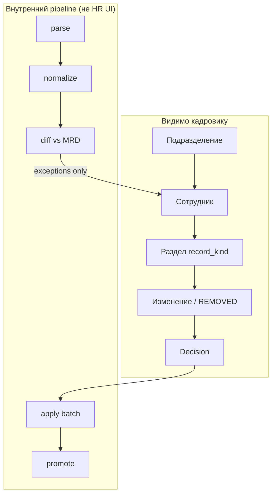
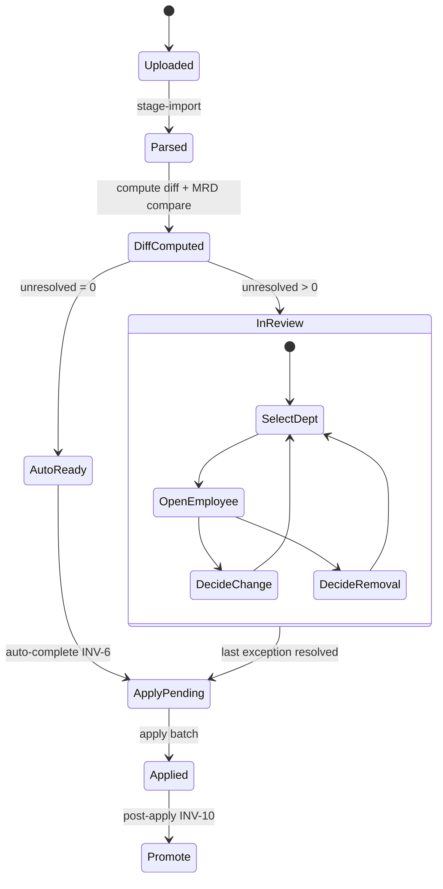

# ADR-059 — Employee-Centric Import Review & Review-by-Exception

## Статус

**Accepted** (2026-07-20)

| Phase | Scope | Status |
|-------|-------|--------|
| **0** | Согласование ADR | ✅ |
| **1** | Gate fix + auto-complete | ⬜ |
| **2** | Employee-centric read model + batch context | ⬜ |
| **3** | Primary UI на `ImportHrReviewPageClient` | ⬜ |
| **4** | Decision actions (confirm/reject/correct, REMOVED) | ⬜ |
| **5** | Cleanup дублирующих статусов и diff pipeline | ⬜ |
| **6** | Отдельный lifecycle initial baseline | ⬜ |

## Дата

2026-07-20

## Связанные документы

- [ADR-038 — Employee Identity & HR Import Architecture](./ADR-038-employee-identity-hr-import-architecture.md) — batch lifecycle, staging
- [ADR-039 Phase 3B — Training Normalization Schema](./ADR-039-Phase-3B-schema.md) — `hr_import_normalized_records`
- [ADR-040 — Canonical HR Snapshot & Monthly Diff](./ADR-040-canonical-hr-snapshot-monthly-diff.md) — `diff_status`, review-by-exception (UI layer)
- [ADR-041 — Dual Personnel Registry Model](./ADR-041-dual-personnel-registry-model.md) — canonical vs operational registry
- [ADR-045 — Personnel HR Processes Split](./ADR-045-personnel-hr-processes-split.md) — HR review UX
- [ADR-058 — Monthly Reference Dataset (MRD)](./ADR-058-monthly-reference-dataset-architecture.md) — Detected Difference, Confirmed Change, employee-centric read model

---

## Context

После ADR-040 и ADR-058 в системе одновременно существуют три параллельных контура:

1. **Diff layer** (`diff_status`) — computed факт «что изменилось vs эталон».
2. **Normalized review layer** (`normalized.review_status = pending`) — stored workflow на каждой staging-записи.
3. **MRD HR review layer** (`hr_detected_differences.lifecycle_status`) — employee-centric read model и field-level decisions.

Default Import Review UI (`PersonnelImportNormalizedRecordsReviewPageClient`) строит процесс вокруг **normalized-записей**, тогда как `ImportHrReviewPageClient` (`?mode=hr`) уже реализует **employee-centric** навигацию, но не является primary route и не подключён к complete-review gate.

**Симптом:** monthly import с тысячами `UNCHANGED` normalized-записей блокирует Complete Import Review из‑за `COUNT(pending normalized)`, хотя diff-summary сообщает «изменений нет».

**Корневая причина:** Import Review смешан с **staging pipeline** (ETL: parse → normalize), а не выделен как **HR-процесс** принятия решений по исключениям относительно MRD.

---

## Problem

1. Import Review — процесс обработки staging (normalized), а не работа кадровика.
2. Объект review в gate и default UI — **normalized-запись**, а не **сотрудник**.
3. `UNCHANGED` создаёт work items (`pending`) и блокирует завершение review.
4. Три параллельных контура статусов (diff, normalized.review_status, difference.lifecycle_status) дублируют друг друга.
5. Complete-review gate не учитывает unresolved MRD differences.
6. Promotion lifecycle смешан с review gate через `approved/pending`.
7. Review зависит от внутренней ETL-реализации; смена staging-модели ломает HR-процесс.

---

## Decision

Зафиксировать **employee-centric Import Review** с **review-by-exception** как единственный основной процесс monthly import.

**Import Review — процесс работы кадровика, а не процесс обработки staging (normalized) записей.**

---

## Invariants

| # | Invariant |
|---|-----------|
| **INV-1** | Объект review — **сотрудник** (в контексте подразделения и отчётного периода), не normalized-запись. |
| **INV-2** | Normalized-записи — внутренний технический слой `parse → normalize → diff → apply`; **невидимы** кадровику в основном процессе. |
| **INV-3** | Основной процесс monthly import — **review-by-exception**: HR работает только с исключениями относительно MRD/эталона. |
| **INV-4** | Ручного решения требуют только `CHANGED`, `CONFLICT`, `REMOVED` и **отдельные случаи** `NEW` (см. §Политика NEW). |
| **INV-5** | `UNCHANGED` **не создают** work items и **не блокируют** завершение review. |
| **INV-6** | Если необработанных исключений, pending removals и parse errors нет — batch **автоматически** переходит в `APPLY_PENDING` **без** массового approve staging-записей. |
| **INV-7** | Основной экран: `ImportHrReviewPageClient`, иерархия **Подразделение → Сотрудник → Раздел → Изменения**. |
| **INV-8** | Единица **навигации** — сотрудник; единица **решения и audit** — отдельное изменение (атрибут / REMOVED entry). |
| **INV-9** | Initial baseline (`mode=initial`) — **отдельный процесс**; не наследует правила monthly review-by-exception. |
| **INV-10** | Promotion — **post-apply lifecycle**; не управляет review gate и не является условием Complete Import Review. |
| **INV-11** | **Review не зависит от ETL.** Если завтра `normalized_records` исчезнут или изменится способ импорта, процесс работы кадровика **не должен измениться**. |
| **INV-12** | **Diff / Review / Workflow — три отдельных source of truth.** Ответственности не пересекаются (см. §Три слоя ответственности). |

### INV-11 — Review не зависит от ETL

Import Review — процесс предметной области (HR), а не артеfact staging pipeline.

| Допустимо | Недопустимо |
|-----------|-------------|
| Read model строится из Detected Difference, removal decisions, employee scope | Gate или UI читают `hr_import_normalized_records.review_status` |
| Normalized используется **внутри** producer/comparison engine | Кадровик видит «N normalized pending» как work queue |
| Apply/promotion пишет в staging **после** review | Review блокируется количеством staging-строк |
| Смена ETL (другая таблица, stream import, без normalized) | Переписывание HR UX и gate |

**Тест на соответствие:** если удалить таблицу `hr_import_normalized_records`, monthly Import Review для кадровика **продолжает работать** через Detected Difference + employee tree; меняется только apply/promotion pipeline, не HR-процесс.

### INV-12 — Три source of truth

| Слой | Единственный вопрос | Source of truth |
|------|---------------------|-----------------|
| **Diff** | «Что изменилось?» | `diff_status`, `field_diffs`, `technical_diff_class`, Detected Difference (fact projection) |
| **Review** | «Какое решение принял кадровик?» | `difference.lifecycle_status`, removal decision, Confirmed Change (audit) |
| **Workflow** | «Можно ли применять импорт?» | `batch.status`, computed `ready`, blockers |

---

## Три слоя ответственности

### Матрица ответственности

| Вопрос | Source of truth | Хранится | Кто пишет | Кто читает (HR) |
|--------|-----------------|----------|-----------|-----------------|
| **Что изменилось?** | `diff_status`, `field_diffs`, `technical_diff_class`, Detected Difference | computed + MRD projection | diff engine, comparison/reconcile | UI (read-only badges) |
| **Какое решение принял кадровик?** | `difference.lifecycle_status`, removal decision, Confirmed Change | stored | HR actions (confirm/reject/correct) | UI (actions), audit |
| **Можно ли применять импорт?** | `batch.status`, computed `ready`, blockers | stored (status) + computed (ready) | system (auto-complete, apply) | progress strip, admin |

```mermaid
flowchart LR
  subgraph diff ["Diff — «что изменилось?»"]
    DS["diff_status / technical_diff_class"]
    FD["field_diffs"]
    DD["Detected Difference"]
  end

  subgraph review ["Review — «какое решение?»"]
    LC["difference.lifecycle_status"]
    RD["removal decision"]
    CC["Confirmed Change"]
  end

  subgraph workflow ["Workflow — «можно ли apply?»"]
    BS["batch.status"]
    BL["blockers / ready"]
    AC["auto-complete"]
  end

  diff -->|"исключения → work queue"| review
  review -->|"все resolved"| workflow
  diff -.->|"не пишет решения"| review
  review -.->|"не классифицирует diff"| diff
  workflow -.->|"не хранит HR decisions"| review
```



### Запрещённые пересечения (anti-patterns)

| Anti-pattern | Нарушает | Почему плохо |
|--------------|----------|--------------|
| `normalized.review_status = pending` как gate blocker | INV-11, INV-12 | Workflow зависит от ETL |
| `approved` на normalized = HR decision | INV-12 Review ← staging | Два decision store |
| `diff_status = CONFLICT` → auto `REJECTED` | INV-12 Review ← Diff | Diff подменяет решение кадровика |
| `review_complete` banner из diff, gate из pending | INV-12 | Противоречие текущей реализации |
| Promotion `promoted` блокирует complete review | INV-10, INV-12 | Promotion ≠ review |
| UI показывает UNCHANGED как work item | INV-3, INV-5 | ETL leak в HR process |
| Dual-write HR decision в `review_status` и `lifecycle_status` | INV-12 | Нет единого SSoT для Review |

### Правило классификации новых полей

Любое новое поле или статус должно быть классифицировано **ровно в одном** слое:

```text
NEW_FIELD → Diff | Review | Workflow | ETL-internal (не видно HR)
```

Если поле не укладывается в один слой — модель спроектирована неверно. Code review **обязан** проверять классификацию.

---

## Non-goals (explicit)

Следующее **не является** допустимым решением, даже временно:

| Non-goal | Причина |
|----------|---------|
| **Mass / auto approve normalized-записей** | Подменяет review-by-exception mass-операцией над ETL; нарушает INV-5, INV-6 |
| **Gate через `COUNT(pending normalized)`** | Workflow зависит от ETL; нарушает INV-11, INV-12 |
| **Dual-write HR decisions** (`review_status` + `lifecycle_status`) | Два SSoT для Review; нарушает INV-12 |
| **Flat normalized table как primary monthly review UI** | Staging-centric UX; нарушает INV-1, INV-2, INV-7 |

---

## Политика NEW (monthly import)

`NEW` попадает в work queue HR **только** если выполняется **хотя бы одно** условие:

| ID | Условие | Источник |
|----|---------|----------|
| **N1** | `employee_id IS NULL` | roster row или normalized carrier |
| **N2** | binding confidence ниже порога match engine | match engine |
| **N3** | explicit business flag `requires_manual_review = true` | policy / admin |

**Не попадает в work queue:** `NEW` с resolved `employee_id`, confidence ≥ threshold, без business flag → implicit pass.

**Initial baseline:** все `NEW` считаются исключениями (отдельный процесс, §Initial Baseline).

---

## Complete-review gate

### Blockers (monthly review)

```text
BLOCKER_ERROR_ROWS              — parse errors > 0
BLOCKER_PENDING_REMOVED         — hr_import_diff_removals без decision
BLOCKER_UNRESOLVED_EXCEPTIONS   — detected differences в DETECTED
                                  + eligible NEW без решения
                                  + CHANGED/CONFLICT без решения
```

### Убрать из gate

```text
BLOCKER_PENDING_NORMALIZED      — COUNT(review_status = 'pending')  ← NON-GOAL
```

### Auto-complete (INV-6)

```text
IF batch.status = IN_REVIEW
AND error_rows = 0
AND pending_removals = 0
AND unresolved_exceptions = 0
THEN batch.status → APPLY_PENDING
     + audit HR_IMPORT_REVIEW_COMPLETED
     + auto_completed = true
```

Триггеры: после `compute_batch_monthly_diff`, после MRD reconcile, после field decision, после REMOVED decision.

**Не является auto-complete:** mass PATCH `approved` на normalized-записях.

---

## Судьба компонентов

### Flat normalized table

| Было | Станет |
|------|--------|
| Default Import Review UI | **Admin/diagnostic view** |
| Primary monthly review | **Employee-centric** (`ImportHrReviewPageClient`) |

`PersonnelImportNormalizedRecordsReviewPageClient` сохраняется для диагностики parse/normalize и post-apply promotion; **не** entry point monthly HR review.

### `normalized.review_status`

| Значение | Роль после ADR-059 |
|----------|-------------------|
| `pending` | **Deprecated для review gate.** Не work item. |
| `approved` / `rejected` | **Deprecated как HR decision store.** SSoT → `difference.lifecycle_status`. |
| `promoted` / `superseded` | **Сохранить** для post-apply promotion lifecycle. |
| Phase 5 (финал) | См. §Phase 5 — terminal state колонки |

Employee review status (`NO_CHANGES` | `PENDING` | `PARTIAL` | `REVIEWED`) — **computed**, не stored.

---

## Target Architecture

### Границы ответственности



| Слой | Сущности | HR mutable? |
|------|----------|-------------|
| **Fact (Diff)** | `diff_status`, `field_diffs`, Detected Difference | нет |
| **Decision (Review)** | `lifecycle_status`, removal decision | да |
| **Workflow** | `batch.status`, `ready` | system |
| **Promotion** | `promoted_document_id`, `promoted/superseded` | post-apply |
| **ETL-internal** | normalized records | internal only |

### Single decision store (Review layer)

HR-решения monthly import хранятся **только** в:

1. `hr_detected_differences.lifecycle_status` — `DETECTED → CONFIRMED | REJECTED`
2. `hr_import_diff_removals.decision` — `restore | confirm_removal`

---

## Target UX

### Primary screen

**Route (target):** `/directory/personnel/import/review?batch={id}`

**Каркас:** `ImportHrReviewPageClient` + batch progress strip + section grouping.

```text
Период / Batch #N
├─ Progress: unresolved | pending removals | errors | ready
├─ Filters: Группа → Подразделение* → Поиск → Статус сотрудника
├─ Summary cards
└─ Employee list
     └─ [expand] Сотрудник
          ├─ Раздел: Кадровые данные (roster)
          ├─ Раздел: Обучение / Образование / …
          └─ Изменение: CHANGED | CONFLICT | NEW* | REMOVED
               [эталон | контрольный список | корректировка]
               [confirm | reject]
```

### Empty states

| Состояние | UX |
|-----------|-----|
| Подразделение не выбрано | «Выберите подразделение» |
| Нет исключений в отделении | «Расхождений не обнаружено» |
| Batch без исключений | «Review завершён автоматически» + `APPLY_PENDING` |

---

## Target Workflow



### Exception resolution rules

| Class | Resolution unit | Individual mandatory? |
|-------|-----------------|----------------------|
| `UNCHANGED` | — | — |
| `CHANGED` | field / attribute | per field |
| `CONFLICT` | field / attribute | **yes** |
| `REMOVED` | removal entry | **yes** |
| `NEW`* | record scope | if in work queue (N1/N2/N3) |

---

## Initial Baseline (отдельный процесс)

**Route:** `/directory/personnel/import/review?mode=initial`

| Aspect | Monthly review | Initial baseline |
|--------|----------------|------------------|
| Эталон | ACTIVE MRD exists | MRD создаётся |
| Review model | review-by-exception | completeness + binding + MRD formation |
| NEW policy | N1/N2/N3 only | all NEW in queue |
| Gate | unresolved exceptions | baseline-specific gate (Phase 6) |
| UI | `ImportHrReviewPageClient` patterns | `ImportInitialBaselinePageClient` |

**INV-9:** initial baseline gate **не наследует** monthly auto-complete rules и **не читает** `COUNT(pending normalized)`.

---

## Migration Plan

| Step | Action | Phase |
|------|--------|-------|
| M1 | Gate: `unresolved_exceptions` вместо `pending normalized` | 1 |
| M2 | Auto-complete после diff compute при exceptions = 0 | 1 |
| M3 | hr-review API: `batch_id`, section grouping | 2 |
| M4 | Router: default → employee-centric | 3 |
| M5 | Wire confirm/reject/correct + REMOVED | 4 |
| M6 | Stop mass `pending` on populate for UNCHANGED | 5 |
| M7 | Deprecate `approved/rejected` on normalized | 5 |
| M8 | Consolidate diff → MRD pipeline | 5 |
| M9 | Terminal state колонки: rename → `promotion_status` или DROP (см. Phase 5) | 5 |
| M10 | Initial baseline separate gate | 6 |

### Rollback

| Phase | Rollback |
|-------|----------|
| 1 | Revert gate logic (isolated service change) |
| 2–3 | Feature flag → legacy routes |
| 4 | Read-only UI; MRD workspace for decisions |
| 5 | Gate independent of column since Phase 1 |

---

## Implementation Phases

### Phase 1 — Gate fix + auto-complete

Backend only. Replace `BLOCKER_PENDING_NORMALIZED` with `BLOCKER_UNRESOLVED_EXCEPTIONS`. Auto-complete after diff compute. Tests: UNCHANGED-only batch → `APPLY_PENDING`.

**Risk:** low | **Dependency:** none

### Phase 2 — Employee-centric read model + batch context

Extend hr-review API: `batch_id`, section grouping, roster diff, batch progress endpoint.

**Risk:** medium | **Dependency:** Phase 1

### Phase 3 — Primary UI migration

Default route → `ImportHrReviewPageClient`. Section grouping. REMOVED in tree. Flat table → admin route.

**Risk:** medium | **Dependency:** Phase 2

### Phase 4 — Decision actions

Wire confirm/reject/correct, REMOVED decisions, auto-complete re-trigger, Confirmed Change audit.

**Risk:** medium | **Dependency:** Phase 3

### Phase 5 — Status model + pipeline cleanup

Deprecate normalized `review_status` for gate. Single diff pipeline. После завершения миграции и удаления всех зависимостей review колонка должна перейти в **одно из двух terminal states** (других устойчивых состояний нет):

1. **Rename** `review_status` → `promotion_status` — если колонка остаётся для promotion lifecycle (`promoted` / `superseded`). Переименование **обязательно** (отдельная migration-задача в рамках Phase 5); оставлять имя `review_status` для non-review semantics **запрещено** — постоянный источник путаницы.
2. **DROP column** — если после миграции promotion state хранится иначе и колонка больше не нужна.

**Risk:** higher | **Dependency:** Phase 4

### Phase 6 — Initial baseline lifecycle

Separate gate, navigation guards, documentation.

**Risk:** low | **Dependency:** Phase 1

---

## Risks & Mitigations

| Risk | Mitigation |
|------|------------|
| Operator UX change | Phase 3 rollout + help; legacy flag |
| NEW implicit pass misses bad data | N1/N2/N3 policy; auto-complete audit |
| MRD/diff desync | Phase 5 single pipeline |
| Promotion regression | INV-10 decoupling |
| Initial/monthly mix | INV-9 + Phase 6 |
| ETL refactor breaks HR | INV-11 acceptance tests (AC-9) |
| Status layer creep | INV-12 + field classification rule |

---

## Acceptance Criteria

### Global (post Phase 4)

| ID | Criterion |
|----|-----------|
| **AC-1** | Batch с 5000 UNCHANGED, 0 exceptions → auto `APPLY_PENDING`, 0 HR work items |
| **AC-2** | HR видит только сотрудников с unresolved exceptions |
| **AC-3** | Навигация: Подразделение → Сотрудник → Раздел → Изменение |
| **AC-4** | CONFLICT требует индивидуального решения по полю |
| **AC-5** | Gate не использует `COUNT(pending normalized)` |
| **AC-6** | HR decisions только в `difference.lifecycle_status` + removal decisions |
| **AC-7** | Promotion не блокирует и не управляет review gate |
| **AC-8** | Initial baseline не наследует monthly auto-complete |

### Architectural (INV-11, INV-12)

| ID | Criterion |
|----|-----------|
| **AC-9** | Gate и primary UI работают при недоступности normalized staging (mock/flag) — только через Detected Difference |
| **AC-10** | Нет кода, где `review_status`, `diff_status` и `batch.status` используются как взаимозаменяемые decision markers |
| **AC-11** | Code review checklist: каждое новое поле классифицировано в Diff / Review / Workflow / ETL-internal |

### Per phase

| Phase | Acceptance |
|-------|------------|
| **1** | UNCHANGED-only batch: `ready=true`, auto `APPLY_PENDING`; pending normalized ignored |
| **2** | API: employee tree + sections + batch progress |
| **3** | Default route employee-centric; flat table admin-only |
| **4** | Decisions persist lifecycle; auto-complete on last resolution |
| **5** | No mass pending on UNCHANGED; single diff pipeline; колонка в terminal state: `promotion_status` или DROP (не `review_status`) |
| **6** | `mode=initial` separate gate |

---

## Summary

ADR-059 переводит Import Review из **staging-centric** модели в **employee-centric review-by-exception**:

- объект review — **сотрудник**; normalized — ETL-internal;
- `UNCHANGED` не создают work items; zero exceptions → auto `APPLY_PENDING`;
- три SSoT: **Diff / Review / Workflow** — без пересечений (INV-12);
- review не зависит от ETL (INV-11);
- primary UI — `ImportHrReviewPageClient`;
- initial baseline и promotion — отдельные lifecycle;
- mass approve, pending gate, dual-write, flat table as primary — **explicit non-goals**.
