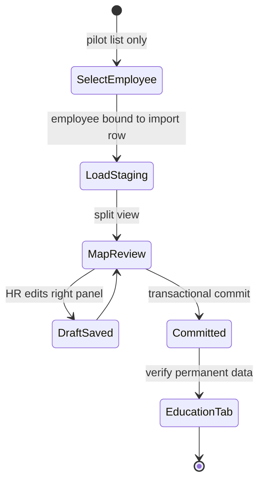
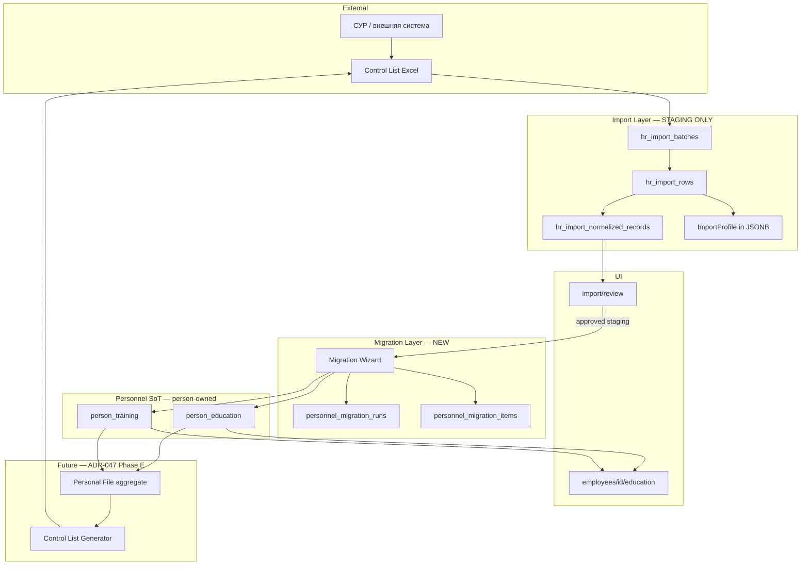

# ADR-EDU-001 — Employee Education: Migration-First Architecture

## Статус

**Ratified** — 2026-07-08

Education Domain Plugin — первая ratified-реализация [ADR-PMF-001](./ADR-PMF-001-personnel-migration-framework.md). Следующий WP: **PMF-1 schema**.

## Дата

2026-07-08 (ratified)

## Роль в архитектуре

Этот документ — **первая domain-реализация** [Personnel Migration Framework (ADR-PMF-001)](./ADR-PMF-001-personnel-migration-framework.md), не самостоятельная архитектура миграции.

Общие компоненты (Candidate, Review, Wizard, Commit, Audit, Provenance, Reconciliation, Personnel Record Events) определены в ADR-PMF-001 §3–§4. Ratification decisions: ADR-PMF-001 [§13](./ADR-PMF-001-personnel-migration-framework.md#13-ratification-decisions).

### Согласование с ADR-PMF-001 (ratified)

| Topic | ADR-EDU-001 binding |
|-------|---------------------|
| Permanent storage | `person_education`, `person_training` |
| Tab route | `/directory/personnel/employees/{employee_id}/education` → resolve `person_id` |
| Migration Wizard | Writes `person_*`; entry via `employee_id` |
| Commit | Blocked without `employees.person_id` |
| Events | `personnel_record_events` (`EDUCATION_*`) |
| Import Layer | Staging / provenance only after commit |
| Control list | Output via `serialize_control_list(person_id)` — not SoT |

## Связанные документы

| Document | Relationship |
|----------|--------------|
| [ADR-PMF-001 — Personnel Migration Framework](./ADR-PMF-001-personnel-migration-framework.md) | **Parent framework** (**Ratified**) |
| [ADR-047 — Personnel Personal File Architecture](./ADR-047-personnel-personal-file-architecture.md) | Parent target model; Phase D/E bridge |
| [ADR-047 Appendix — Four-Layer Model](./ADR-047-appendix-four-layer-model.md) | Import vs PF layer separation |
| [ADR-047 Appendix — Service Record & PDF Export](./ADR-047-appendix-service-record-and-pdf-export.md) | Control list as derived export |
| [ADR-038 — HR Import Architecture](./ADR-038-employee-identity-hr-import-architecture.md) | Import staging contour |
| [ADR-039 Phase 3B](./ADR-039-Phase-3B-schema.md) | Normalized records schema |
| [ADR-037 — Employee Documents Registry](./ADR-037-employee-documents-registry.md) | Document-centric registry (adjacent, not replacement) |
| [ADR-041 — Dual Personnel Registry](./ADR-041-dual-personnel-registry-model.md) | Operational vs HR canonical contours |
| [ADR-043 Phase A1](./ADR-043-phase-a1-override-governance.md) | Override tiers for education |
| [ADR-045 — Персонал / Кадровые процессы](./ADR-045-personnel-hr-processes-split.md) | UI contour placement |
| [ADR-048 — Person Ownership](./ADR-048-person-ownership-identity-creation-policy.md) | `person_id` linkage constraints |

---

## 1. Контекст и причина пересмотра

### 1.1. Исходная концепция MVP (отклонена)

Первый вариант WP-EDU-001 предлагал вкладку «Образование» как **view layer** над существующими структурами Import Layer:

```text
Control List → Import → ImportProfile / normalized records → Education View (read-only)
```

Это давало бы быстрый UI, но **закрепляло инверсию источника истины**: кадровые данные продолжали бы жить в staging (`ImportProfile`, `employee_import_profile_overrides`, `hr_import_normalized_records`), а вкладка «Образование» оставалась бы зависимой от import-контура.

### 1.2. Целевая бизнес-модель

Контрольный список — **производный кадровый отчёт**, а не первичный источник данных.

Кадровая служба вручную дорабатывает выгрузку из внешней системы (СУР Минздрава), потому что внешний модуль не удовлетворяет требованиям. Corpsite должен:

1. Принять control list **один раз** как bootstrap-источник (ETL input).
2. Перенести данные в **постоянные кадровые сущности** через контролируемую миграцию.
3. Вести образование в **кадровой карточке сотрудника** независимо от Import Layer.
4. В перспективе **генерировать** control list из кадровых данных (не наоборот).

### 1.3. Новая целевая цепочка

```text
Control List
    ↓  (ETL input, monthly)
Import Layer          ← staging only
    ↓  (controlled migration, pilot 1–2 employees)
Migration Wizard
    ↓
Employee Education    ← permanent personnel entities
    ↓
Employee Personal File
    ↓  (future)
Control List Generator
```

---

## 2. Сравнение концепций

| Аспект | Отклонённый MVP (view layer) | Новая модель (migration-first) |
|--------|------------------------------|--------------------------------|
| **Источник истины для вкладки** | `ImportProfile`, normalized records | `person_education`, `person_training` |
| **Import Layer после миграции** | Продолжает обслуживать UI | Только staging / provenance / reconciliation |
| **Review modal** | Место правки + отображения | Только проверка staging; правка — в Migration Wizard |
| **Пилот** | 2 сотрудника, read-only view | 2 сотрудника, полный цикл Import → Migration → Education tab |
| **Обратный экспорт control list** | Через canonical snapshot (import-derived) | Через Employee Education → PF → Generator |
| **Согласование с ADR-047** | Частичное (proto-PF в import) | Прямое (Phase D bridge реализован как Migration Wizard) |
| **Масштабирование** | View над 3000+ rows | Контролируемая миграция → массовый rollout отдельным WP |
| **Зависимость runtime от batch** | Да | Нет (после commit миграции) |

---

## 3. Архитектурные принципы

### P1. Import Layer — исключительно staging ETL

Import Layer используется **только** для:

- загрузки control list;
- парсинга и нормализации;
- сопоставления с сотрудником (`employee_id` bind);
- human-in-the-loop review staging-записей;
- хранения provenance (batch, row, source_field, source_text);
- monthly diff / reconciliation input (ADR-040).

После commit миграции кадровая система **не читает** `ImportProfile` для отображения или редактирования образования.

### P2. Вкладка «Образование» — только кадровые сущности

Маршрут вкладки (предложение):

```text
/directory/personnel/employees/{employee_id}/education
```

Источник данных: `person_education` + `person_training` (owner: `person_id`; UI entry: `employee_id`).

Если у сотрудника нет мигрированных записей — вкладка показывает **пустое состояние с CTA** «Запустить миграцию из контрольного списка», а не fallback на ImportProfile.

### P3. Migration Wizard — единственная точка переноса import → personnel

Review (`/directory/personnel/import/review`) остаётся инструментом **проверки staging**.

Перенос в кадровые таблицы выполняется **только** через Migration Wizard.

### P4. Контролируемая миграция

- Пилот: **1–2 сотрудника** (рекомендация: эксперты ОВЭиПД из operational контура — `QM_HOSP`, `QM_AMB`).
- Массовая миграция — отдельный WP после успешного пилота.
- Каждая миграция — транзакционный commit с audit trail.

### P5. Provenance сохраняется навсегда

Каждая кадровая запись хранит полный след происхождения (см. §6), даже после отсоединения от Import Layer.

### P6. Control list — output, не input (долгосрочно)

После наполнения кадровых сущностей генератор control list проецирует:

| PF / Personnel section | Control list column |
|------------------------|---------------------|
| `person_education` (basic) | H `education_raw` |
| `person_education` (specialty) | I `diploma_specialty_raw` |
| `person_training` | M `education_training_raw` |
| `person_education` (qualification) | K `qualification_raw` |

---

## 4. Место Migration Wizard в Personnel Domain

### 4.1. Контур и навигация

Migration Wizard живёт в **«Кадровые процессы»** (ADR-045), не в «Персонал» и не в Position Cabinet `/education`.

```text
/directory/personnel/
  ├── import/                    ← staging ETL (существующий)
  │     └── review               ← проверка normalized records (существующий)
  ├── migration/               ← NEW: controlled personnel data migration
  │     ├── education            ← Migration Wizard (образование + ПК)
  │     └── (future)
  │           ├── service-record ← послужной список
  │           ├── certificates   ← сертификаты / категории
  │           └── awards         ← награды
  └── employees/{id}/
        ├── import-card          ← legacy HR contour (замораживается после миграции)
        └── education            ← NEW: permanent education tab
```

### 4.2. Роли и доступ

| Действие | RBAC |
|----------|------|
| Просмотр staging в Review | `has_personnel_admin` / HR import admin (как сейчас) |
| Запуск Migration Wizard | `has_personnel_admin` |
| Commit миграции | `has_personnel_admin` |
| Просмотр вкладки Education (read) | HR + managers per ADR-042 visibility (будущее) |
| Ручная правка после миграции | `has_personnel_admin` |

### 4.3. Разделение Review vs Migration Wizard

| | Import Review (существующий) | Migration Wizard (новый) |
|--|------------------------------|--------------------------|
| **Назначение** | Проверить корректность парсинга staging | Перенести проверенные данные в кадровые таблицы |
| **Объект** | `hr_import_normalized_records` | `person_education`, `person_training` |
| **Редактирование** | `review_status`, `review_override` на staging | Маппинг полей staging → personnel (commit) |
| **Результат** | Approved staging record | Permanent personnel record + migration audit |
| **Повторный запуск** | При новом monthly import | Только reconciliation mode (diff, не перезапись) |

### 4.4. UI Migration Wizard (split view)

```text
┌──────────────────────────────────────────────────────────────────────────┐
│  Migration Wizard — Образование                                          │
│  Сотрудник: [Сейтказина Г.Т.]  Batch: [июнь 2026]  Status: DRAFT       │
├──────────────────────────────┬───────────────────────────────────────────┤
│  СЛЕВА: Import Source        │  СПРАВА: Personnel Record (draft)        │
│                              │                                           │
│  source_field: education_raw │  institution_type: [вуз ▼]               │
│  source_text: (raw)          │  institution_name: [Алматинский ...]      │
│  parse_method: regex         │  specialty: [Лечебное дело]              │
│  confidence: 0.82            │  qualification: [врач]                   │
│  normalized record #1234     │  completed_at: [2010]                    │
│  review_status: approved     │  diploma_number: [—]                     │
│                              │  verification_status: [pending ▼]        │
│  [Принять →] [Пропустить]    │  [Сохранить черновик] [Commit миграции]  │
└──────────────────────────────┴───────────────────────────────────────────┘
```

**Workflow states:**



---

## 5. Поток данных: Import → Migration → Employee Education

### 5.1. Полная диаграмма



### 5.2. Пошаговый поток (пилот)

| Шаг | Действие | Actor | Артефакт |
|-----|----------|-------|----------|
| 1 | Upload control list | HR operator | `hr_import_batches` |
| 2 | Parse + normalize | System | `hr_import_rows`, `hr_import_normalized_records` |
| 3 | Bind employee (IIN/FIO) | HR / auto | `hr_import_rows.employee_id` |
| 4 | Review staging records | HR operator | `review_status=approved` |
| 5 | Open Migration Wizard for pilot employee | HR operator | `personnel_migration_runs` (draft) |
| 6 | Map import → personnel fields (split view) | HR operator | draft `person_education` / `person_training` |
| 7 | Commit migration | HR operator | permanent rows + `migrated_at` |
| 8 | Verify Education tab | HR operator | UI reads personnel tables only |
| 9 | (Future) Generate control list fragment | System | columns H/I/M from personnel |

### 5.3. Правила commit

1. **Идемпотентность:** повторный commit того же `source_normalized_record_id` → upsert или skip (по `source_record_key`).
2. **Транзакционность:** commit миграции = одна DB transaction (run + items + education/training rows).
3. **Staging freeze:** после commit staging record получает `review_status=migrated` (новый терминальный статус).
4. **No silent overwrite:** monthly re-import не перезаписывает personnel records автоматически; только reconciliation diff.

---

## 6. Постоянные кадровые сущности

### 6.1. Target ownership (ADR-PMF-001 §13.1)

Постоянные таблицы — **`person_education`** и **`person_training`**. Owner: `person_id`. Operational context: `employee_context_id`.

| Слой | Таблица | Anchor |
|------|---------|--------|
| Personal File (SoT) | `person_education`, `person_training` | `person_id` |
| UI / Wizard entry | via `employees.employee_id` | resolves → `person_id` |
| Control list export | column projection | by `person_id` |

**Пилот:** Commit требует `employees.person_id NOT NULL`. Wizard и tab остаются employee-routed.

### 6.2. Таблица `person_education`

```sql
-- DESIGN ONLY — PMF-1 schema (ratified naming)
CREATE TABLE public.person_education (
    education_id          BIGINT GENERATED ALWAYS AS IDENTITY PRIMARY KEY,
    person_id             BIGINT NOT NULL REFERENCES public.persons(person_id),
    employee_context_id   BIGINT NULL REFERENCES public.employees(employee_id),

    education_level       TEXT NOT NULL
        CHECK (education_level IN ('basic', 'internship', 'residency', 'masters', 'phd')),
    institution_type      TEXT NOT NULL DEFAULT 'other'
        CHECK (institution_type IN ('university', 'college', 'other')),

    institution_name      TEXT NOT NULL,
    specialty_text        TEXT NULL,
    qualification_text    TEXT NULL,
    completed_at          DATE NULL,
    diploma_issued_at     DATE NULL,
    diploma_number        TEXT NULL,
    medical_specialty_id  BIGINT NULL REFERENCES public.medical_specialties(medical_specialty_id),

    verification_status   TEXT NOT NULL DEFAULT 'pending'
        CHECK (verification_status IN ('pending', 'verified', 'rejected')),
    lifecycle_status      TEXT NOT NULL DEFAULT 'active'
        CHECK (lifecycle_status IN ('active', 'superseded', 'voided', 'draft')),
    source_origin         TEXT NOT NULL DEFAULT 'import'
        CHECK (source_origin IN ('import', 'manual', 'reconciliation')),

    -- Provenance (PMF mixin — ADR-PMF-001 §4.6)
    import_batch_id       BIGINT NULL REFERENCES public.hr_import_batches(batch_id),
    import_row_id         BIGINT NULL REFERENCES public.hr_import_rows(row_id),
    source_kind           TEXT NULL,
    source_id             BIGINT NULL,
    source_field          TEXT NULL,
    source_text           TEXT NULL,
    source_record_key     TEXT NULL,
    parse_method          TEXT NULL,
    confidence            NUMERIC(5,4) NULL,
    migration_run_id      BIGINT NULL,
    migration_item_id     BIGINT NULL,
    migrated_at           TIMESTAMPTZ NULL,
    migrated_by           BIGINT NULL REFERENCES public.users(user_id),

    voided_at             TIMESTAMPTZ NULL,
    voided_by             BIGINT NULL REFERENCES public.users(user_id),
    void_reason           TEXT NULL,

    created_by            BIGINT NULL REFERENCES public.users(user_id),
    created_at            TIMESTAMPTZ NOT NULL DEFAULT now(),
    updated_by            BIGINT NULL REFERENCES public.users(user_id),
    updated_at            TIMESTAMPTZ NOT NULL DEFAULT now()
);
```

**Индексы:**

```text
ix_person_education_person_active
  ON (person_id, lifecycle_status) WHERE lifecycle_status = 'active'

uq_person_education_source_key
  ON (person_id, source_record_key) WHERE source_record_key IS NOT NULL
```

### 6.3. Таблица `person_training`

```sql
-- DESIGN ONLY
CREATE TABLE public.person_training (
    training_id           BIGINT GENERATED ALWAYS AS IDENTITY PRIMARY KEY,
    person_id             BIGINT NOT NULL REFERENCES public.persons(person_id),
    employee_context_id   BIGINT NULL REFERENCES public.employees(employee_id),

    training_kind         TEXT NOT NULL DEFAULT 'course'
        CHECK (training_kind IN (
            'course', 'qualification_upgrade', 'seminar',
            'workshop', 'conference', 'certificate_program', 'nmo'
        )),

    title                 TEXT NOT NULL,
    organization          TEXT NULL,
    hours                 NUMERIC(6,2) NULL,
    started_at            DATE NULL,
    completed_at          DATE NULL,
    issued_at             DATE NULL,
    certificate_number    TEXT NULL,
    document_id           BIGINT NULL REFERENCES public.employee_documents(document_id),

    verification_status   TEXT NOT NULL DEFAULT 'pending'
        CHECK (verification_status IN ('pending', 'verified', 'rejected')),
    lifecycle_status      TEXT NOT NULL DEFAULT 'active'
        CHECK (lifecycle_status IN ('active', 'superseded', 'voided', 'draft')),
    source_origin         TEXT NOT NULL DEFAULT 'import'
        CHECK (source_origin IN ('import', 'manual', 'reconciliation')),

    -- Provenance (same mixin)
    import_batch_id       BIGINT NULL,
    import_row_id         BIGINT NULL,
    source_kind           TEXT NULL,
    source_id             BIGINT NULL,
    source_field          TEXT NULL,
    source_text           TEXT NULL,
    source_record_key     TEXT NULL,
    parse_method          TEXT NULL,
    confidence            NUMERIC(5,4) NULL,
    migration_run_id      BIGINT NULL,
    migration_item_id     BIGINT NULL,
    migrated_at           TIMESTAMPTZ NULL,
    migrated_by           BIGINT NULL REFERENCES public.users(user_id),

    voided_at, voided_by, void_reason,
    created_by, created_at, updated_by, updated_at
);
```

### 6.4. PMF audit + record events

Таблицы `personnel_migration_runs`, `personnel_migration_items` — shared PMF (ADR-PMF-001 §4.5).

Бизнес-журнал: `personnel_record_events` с типами `EDUCATION_MIGRATED`, `EDUCATION_VERIFIED`, `EDUCATION_SUPERSEDED`, `EDUCATION_VOIDED` (ADR-PMF-001 §4.8).

`personnel_migration_events` **не создаётся**.

### 6.5. Граница с `employee_documents` (ADR-037)

| Контур | Назначение | Примеры |
|--------|------------|---------|
| `person_education` | Структурированное формальное образование | ВУЗ, интернатура, ординатура |
| `person_training` | ПК, курсы, семинары, часы | Циклы ПК, НМО, мастер-классы |
| `employee_documents` | Юридически значимые документы с типом, сроком, специальностью | Сертификат специалиста, аккредитация, категория |

**Правило:** Migration Wizard для education **не заменяет** реестр документов. Сертификаты и категории из col N — отдельный Migration Wizard (`/migration/certificates`, будущий WP).

`person_training.document_id` — опциональная ссылка на скан в реестре документов.

### 6.6. Маппинг полей: staging → personnel

#### Education (record_kind = `education`)

| Staging / ImportProfile | `person_education` |
|-------------------------|----------------------|
| `institution` / `organization` | `institution_name` |
| `record_type` (basic/internship/…) | `education_level` |
| (inferred from text) | `institution_type` (university/college/other) |
| `specialty` | `specialty_text` |
| `basic.qualification_raw` | `qualification_text` |
| `completed_at` / `issue_date` | `completed_at` |
| `document_number` | `diploma_number` |
| `source_field`, `source_text` | same |
| `parse_method`, `confidence` | same |
| `normalized_record_id` | `source_normalized_record_id` |

#### Training (record_kind = `training`)

| Staging / ImportProfile | `person_training` |
|-------------------------|---------------------|
| `title` | `title` |
| `organization` / `provider` | `organization` |
| `hours` | `hours` |
| `started_at` | `started_at` |
| `completed_at` / `end_date` | `completed_at` |
| `issue_date` | `issued_at` |
| `document_number` | `certificate_number` |

---

## 7. Согласование с ADR-047 и долгосрочной архитектурой

### 7.1. Четыре слоя (пересмотренные роли)

| Слой | Роль после ADR-EDU-001 |
|------|------------------------|
| **Import Layer** | ETL staging; monthly input; provenance archive |
| **Personnel Entities** (`person_education`, `person_training`) | **Source of truth** (person-owned) |
| **Personal File** | Person-centric aggregate; superset per `person_id` |
| **Canonical Registry** | Org-wide roster projection для analytics |
| **Control List Generator** | **Output** из Personnel + PF |

### 7.2. Эволюция к Personal File

```text
Phase 1 (WP-EDU-001 / PMF-4):
  person_education / person_training
  anchor: person_id (required at commit)
  UI entry: employee_id → resolve person_id
  events: personnel_record_events (EDUCATION_*)

Phase 2 (PMF-10):
  Person card PF UI; cross-rehire history

Phase 3 (PMF-9):
  Control List Generator — columns H/I/K/M from person_*
```

### 7.3. Послужной список (будущий модуль)

Аналогичная схема:

```text
experience_raw (import) → Migration Wizard (/migration/service-record)
  → person_work_history
  → Personal File §12
  → control list col L
```

`person_work_history` проектируется по тому же PMF-шаблону.

### 7.4. Control List Generator (целевой контракт)

```text
generate_control_list_fragment(person_id | employee_id, columns: [H,I,K,L,M]):
  education_basic    ← person_education WHERE education_level='basic'
  diploma_specialty  ← aggregate specialty_text
  qualification      ← aggregate qualification_text
  training           ← person_training → text serialization
  experience         ← person_work_history (future)
```

Import Layer **не участвует** в генерации.

---

## 8. Переиспользование существующих сервисов

### 8.1. Переиспользовать (без изменения контракта runtime)

| Service / module | Роль в новой архитектуре |
|------------------|--------------------------|
| `scripts/import_hr_control_list.py` | Column mapping Excel → normalized_payload |
| `hr_import_document_parser.py` | Парсинг `education_raw`, `education_training_raw` → фрагменты |
| `hr_import_profile_service.py` | **Только** как mapper staging → migration draft (не runtime source) |
| `hr_import_normalized_record_service.py` | Review queue; source for Migration Wizard |
| `hr_import_employee_binding_service.py` | Bind `employee_id` перед миграцией |
| `hr_import_row_review_service.py` | Row-level review (batch context) |
| `employee_import_profile_override_service.py` | Legacy; read-only после миграции |
| `resolve_directory_employee_id()` | Поиск employee при миграции |
| Provenance pattern from `hr_import_promotion_service.py` | Шаблон для `migrated_at` / `source_*` columns |
| `medical_specialties` / `document_types` catalogs | FK targets для specialty resolution |

### 8.2. Новые сервисы (WP-EDU-001)

| Service | Responsibility |
|---------|----------------|
| `person_education_service.py` | CRUD `person_education`; list for tab (by person_id) |
| `person_training_service.py` | CRUD `person_training`; list for tab |
| `education_migration_plugin.py` | PMF domain plugin (draft + commit + void) |

### 8.3. API (design)

| Method | Route | Purpose |
|--------|-------|---------|
| GET | `/directory/personnel/employees/{id}/education` | Tab: resolve person_id from employee; return person_* records |
| PATCH | `/directory/personnel/employees/{id}/education/{education_id}` | Manual edit; emits `EDUCATION_*` via personnel_record_events |
| GET | `/directory/personnel/migration/education` | Wizard entry; list pilot-ready employees |
| GET | `/directory/personnel/migration/education/{employee_id}/draft` | Load staging + draft mapping |
| POST | `/directory/personnel/migration/education/{employee_id}/commit` | Transactional migration commit |
| GET | `/directory/personnel/migration/education/runs/{run_id}` | Audit trail |

### 8.4. UI components

| Component | Status |
|-----------|--------|
| `PersonnelImportNormalizedRecordsReviewPageClient` | Keep; add CTA «→ Миграция» для approved + bound records |
| `ImportNormalizedRecordDrawer` | Keep; remove implicit «this is the employee record» framing |
| `ImportProfileCardSections` (education block) | Deprecate for migrated employees; show banner «Данные перенесены → Education tab» |
| `EmployeeEducationPageClient` | **New** |
| `PersonnelEducationMigrationWizardClient` | **New** |

---

## 9. Судьба Import Layer после миграции

### 9.1. Остаётся staging-инфраструктурой

| Artifact | После миграции |
|----------|----------------|
| `hr_import_batches` / `hr_import_rows` | Monthly ETL; reconciliation |
| `hr_import_normalized_records` | Review + migration source; `review_status=migrated` |
| `hr_import_document_candidates` | Pre-normalization audit |
| `ImportProfile` (JSONB) | **Не используется** для UI/editing migrated employees |
| `employee_import_profile_overrides` | Frozen для migrated; legacy path для non-migrated |
| `hr_import_promotion_service` → `employee_documents` | Legacy path; параллельно с migration, не для education tab |
| Monthly diff (ADR-040) | Reconciliation: staging diff vs personnel records |

### 9.2. Что НЕ делает Import Layer после пилота

- Не является source of truth для вкладки «Образование».
- Не перезаписывает `person_education` / `person_training` при новом monthly upload.
- Не отображается в кадровой карточке как рабочие данные (только provenance link).

### 9.3. Reconciliation при новом monthly import

```text
New control list upload
  → parse + normalize (staging)
  → diff vs person_education/training (NOT vs ImportProfile)
  → Migration Wizard opens in RECONCILIATION mode:
      - NEW: предложить добавить
      - CHANGED: показать diff, HR решает
      - REMOVED: пометить, не удалять silently
```

---

## 10. Поэтапный план реализации (без нарушения существующей функциональности)

### Phase 0 — Architecture

- [x] ADR-PMF-001 ratified
- [x] ADR-EDU-001 ratified (this document)
- [x] Ratification decisions §13 ADR-PMF-001 applied

### Phase 1 — Schema (PMF-1)

- [ ] `person_education`, `person_training`
- [ ] `personnel_migration_runs`, `personnel_migration_items`, `personnel_record_events`
- [ ] `review_status=migrated` on staging
- **Non-breaking:** additive only

### Phase 2 — Education Plugin + Commit (PMF-2..4)

- [ ] Education migration plugin; void/supersede rollback
- [ ] `person_id` precondition at commit
- [ ] `EDUCATION_*` record events

### Phase 3 — Migration Wizard UI

- [ ] `/directory/personnel/migration/education`
- [ ] Split view (source ← → target)
- [ ] CTA from import/review for approved records
- **Non-breaking:** wizard additive; review modal работает как прежде

### Phase 4 — Education tab

- [ ] `/directory/personnel/employees/{id}/education`
- [ ] Два этажа: базовое / дополнительное
- [ ] Provenance panel per record
- [ ] Verification status badges
- **Non-breaking:** import-card HR contour остаётся для non-migrated

### Phase 5 — Pilot

- [ ] Bind 2 экспертов ОВЭиПД к import rows
- [ ] Full cycle: Import → Review → Migration → Education tab
- [ ] Pilot runbook (по образцу ADR-043 P1)
- [ ] HR feedback → gap register (diploma_number, institution_type, etc.)

### Phase 6 — Deprecation path

- [ ] Migrated employees: import-card education block → read-only redirect
- [ ] Feature flag `personnel.education.migration_required`
- [ ] Documentation update: ImportProfile = staging only

### Phase 7 — PF UI (PMF-10)

- [ ] Person-centric education view across rehire
- [ ] ADR-048 person link policy for auto-create (deferred)

### Phase 8 — Control List Generator (отдельный WP)

- [ ] Column projection H/I/K/M from personnel tables
- [ ] Reconciliation mode vs canonical snapshot

---

## 11. Риски и митигация

| Риск | Вероятность | Митигация |
|------|-------------|-----------|
| Пилотные сотрудники без import row bind | Medium | `repair bindings` + manual bind before wizard |
| Дублирование с `employee_documents` promotion path | Medium | Чёткая граница §6.5; migration ≠ promote |
| `person_id` NULL at commit | High (pilot) | Block commit; require Person link before migration |
| Monthly import перезаписывает personnel | High if ignored | Reconciliation-only policy §9.3 |
| Два параллельных UI (import-card + education tab) | Medium | Deprecation banner Phase 6 |
| Массовая миграция 3000+ rows | Out of scope | Pilot first; batch migration = separate WP |

---

## 12. Критерии приёмки

### Architecture phase (ratified — PMF-0)

- [x] ADR-PMF-001 + ADR-EDU-001 ratified
- [x] Target tables: `person_education`, `person_training`
- [x] Event model: `personnel_record_events`; no `personnel_migration_events`
- [x] Rollback: void/supersede documented

### Implementation phase (WP-EDU-001 / PMF-1..5 — pending)

1. **Пилот:** 2 эксперта ОВЭиПД прошли полный цикл Import → Migration → Education tab.
2. **Source of truth:** Education tab читает **только** `person_education` / `person_training` (via `employees.person_id`).
3. **Provenance:** каждая запись содержит PMF provenance mixin + `person_id`.
4. **Events:** `personnel_record_events` с `EDUCATION_*`.
5. **Rollback:** void model; no physical DELETE.
6. **Import independence:** после commit миграции ImportProfile не меняет person records.
7. **Non-breaking:** legacy import paths для non-migrated сотрудников.

---

## 13. Deferred decisions (post-pilot)

Перенесено из open questions; закрыто в [ADR-PMF-001 §12](./ADR-PMF-001-personnel-migration-framework.md#12-deferred-decisions-post-pilot):

1. Auto-create Person on migration commit (ADR-048) — post-pilot.
2. Reconciliation vs canonical promotion blocking — post-pilot.
3. Массовая миграция: per-domain vs per-employee bundle — WP-MASS-MIGRATION.

---

## 14. Решение (ratified)

**Принять** Education Domain Plugin в составе PMF:

1. Target tables: **`person_education`**, **`person_training`** (person-owned).
2. UI entry: `employee_id`; commit requires `person_id`.
3. Events: **`personnel_record_events`** (`EDUCATION_MIGRATED`, `EDUCATION_VERIFIED`, `EDUCATION_SUPERSEDED`, `EDUCATION_VOIDED`).
4. Rollback: void/supersede per ADR-PMF-001 §13.3.
5. PMF audit: `personnel_migration_runs/items` only for technical trail.
6. Import Layer — staging/provenance only; Control List — derived output.

**Отклонить:** view-layer MVP (ImportProfile as Education tab source); `employee_education` / `employee_training` as permanent storage.

---

## Status Log

| Date | Event |
|------|-------|
| 2026-07-08 | ADR-EDU-001 drafted; supersedes WP-EDU-001 view-layer concept |
| 2026-07-08 | Aligned with ADR-PMF-001 §13: `person_*` tables, `personnel_record_events`, void rollback |
| 2026-07-08 | **Ratified** with ADR-PMF-001 as first PMF domain plugin; next WP: PMF-1 schema |
