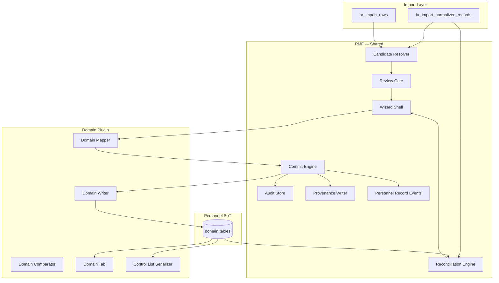
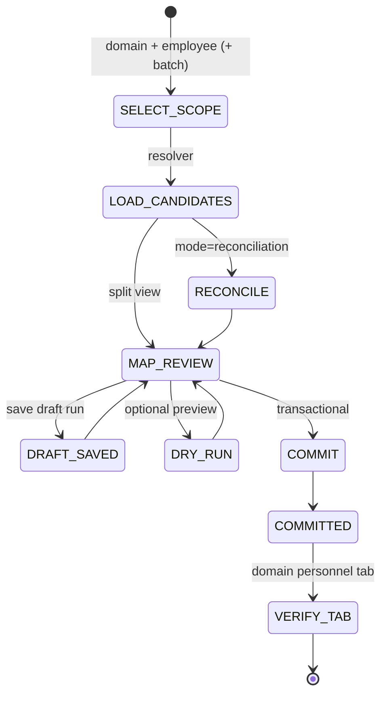

# ADR-PMF-001 — Personnel Migration Framework (PMF)

## Статус

**Ratified** — 2026-07-08

Архитектурная фаза завершена. Следующий WP: **PMF-1 schema** (Alembic revision).

**Ratified together with:** [ADR-EDU-001 — Employee Education (first domain plugin)](./ADR-EDU-001-employee-education-migration-architecture.md)

### Ratification summary

| Decision | Resolution |
|----------|------------|
| Target ownership | `person_*` tables; `person_id` owner |
| Pilot entrypoint | `employee_id` (Wizard, tab route) |
| Commit precondition | **Blocked** without `employees.person_id` |
| Business event journal | `personnel_record_events` |
| `personnel_migration_events` | **Not created** |
| Rollback | `voided` / `superseded`; no physical DELETE |
| Framework vs plugin | PMF = framework; Education = first plugin (ADR-EDU-001) |
| Import Layer | Staging / provenance only after migration |
| Control list | Output (Phase PMF-9), not source of truth |

Полная фиксация: [§13 Ratification Decisions](#13-ratification-decisions). Deferred: [§12](#12-deferred-decisions-post-pilot).

## Дата

2026-07-08 (ratified)

## Связанные документы

| Document | Relationship |
|----------|--------------|
| [ADR-EDU-001 — Employee Education Migration](./ADR-EDU-001-employee-education-migration-architecture.md) | **Первая domain-реализация** PMF (**Ratified**) |
| [ADR-047 — Personnel Personal File](./ADR-047-personnel-personal-file-architecture.md) | Целевой aggregate; Phase D bridge = PMF |
| [ADR-047 Appendix — Four-Layer Model](./ADR-047-appendix-four-layer-model.md) | Import Layer = staging only |
| [ADR-038 — HR Import](./ADR-038-employee-identity-hr-import-architecture.md) | Staging input |
| [ADR-039 Phase 3B](./ADR-039-Phase-3B-schema.md) | Normalized records как candidate source |
| [ADR-040 — Canonical Snapshot / Monthly Diff](./ADR-040-canonical-hr-snapshot-monthly-diff.md) | Reconciliation input pattern |
| [ADR-043 Phase A1](./ADR-043-phase-a1-override-governance.md) | Override tiers; provenance governance |
| [ADR-044 — Identity Reconciliation](./ADR-044-identity-reconciliation.md) | Reference pattern: runs + items + dry-run/commit |
| [ADR-045 — Персонал / Кадровые процессы](./ADR-045-personnel-hr-processes-split.md) | UI contour |
| [ADR-036 — HR Events](./ADR-036-hr-events-unified-model.md) | Employment events only; not PF education history |

---

## 1. Назначение

**Personnel Migration Framework (PMF)** — единая архитектура переноса данных из Import Layer (staging ETL) в **постоянные кадровые сущности** Personnel Domain.

PMF решает системную проблему ADR-047: контрольный список и import staging **не должны** оставаться source of truth. Миграция — обязательный, контролируемый, аудируемый этап между ETL и кадровой карточкой.

**Модуль «Образование» (ADR-EDU-001)** — не исключение, а **первая domain-plugin реализация** PMF.

```text
                    ┌─────────────────────────────────────┐
                    │   Personnel Migration Framework     │
                    │   (shared engine + contracts)       │
                    └──────────────┬──────────────────────┘
                                   │ implements
          ┌────────────────────────┼────────────────────────┐
          ▼                        ▼                        ▼
   Education Plugin        Service Record Plugin     Certificates Plugin
   (WP-EDU-001, first)     (future WP-SR-001)        (future WP-CERT-001)
```

---

## 2. Целевая цепочка (все домены)

```text
Control List / External HR Export
        ↓  ETL input (monthly)
Import Layer                    ← STAGING ONLY
        ↓
  ┌─────┴─────┐
  │  Review   │  ← проверка staging (существующий контур)
  └─────┬─────┘
        ↓ approved candidates
  ┌─────┴─────────┐
  │ Migration Wizard │  ← PMF: единственная точка commit
  └─────┬───────────┘
        ↓
Personnel Entities              ← SOURCE OF TRUTH (per domain)
        ↓
Personal File (aggregate)       ← person-centric view
        ↓
Control List Generator        ← OUTPUT (derived report)
```

**Инвариант PMF:** после `commit` runtime UI и отчёты **не читают** ImportProfile / staging JSONB для данного домена и сотрудника.

---

## 3. Компоненты PMF

### 3.1. Обзор компонентов

| # | Компонент | Роль | Слой |
|---|-----------|------|------|
| 1 | **Candidate** | Единица данных, готовая к миграции | Staging → Wizard input |
| 2 | **Review** | Human gate на staging | Pre-migration |
| 3 | **Migration Wizard** | Split-view mapping + draft | Migration UI |
| 4 | **Commit** | Транзакционная запись в personnel | Migration engine |
| 5 | **Audit** | Run / item trail | Governance |
| 6 | **Provenance** | Неизменяемый след происхождения | На каждой personnel record |
| 7 | **Reconciliation** | Diff staging vs personnel при re-import | Monthly cycle |
| 8 | **Personnel Record Events** | Бизнес-журнал изменений PF-записей | PF history / observability |



---

## 4. Детализация компонентов

### 4.1. Candidate (кандидат миграции)

**Определение:** нормализованная единица staging-данных, привязанная к operational `employee_id` (точка входа Wizard), прошедшая Review, предлагаемая для переноса в **person-owned** personnel tables.

**Общий контракт (framework):**

```python
# DESIGN ONLY — conceptual interface
@dataclass
class MigrationCandidate:
    candidate_id: str              # stable key within run scope
    domain_code: str               # e.g. "education", "service_record"
    employee_id: int
    import_batch_id: int
    import_row_id: int

    # Staging reference (one or more)
    source_kind: str               # "normalized_record" | "import_row_field" | "import_profile_fragment"
    source_id: int | None          # normalized_record_id when applicable
    source_field: str | None       # education_raw, experience_raw, ...
    source_text: str
    source_record_key: str | None

    # Parsed payload (domain-agnostic envelope)
    parsed_payload: dict           # staging fields as-is
    parse_method: str | None
    confidence: float | None

    # Review state (from Review gate)
    review_status: str             # pending | approved | rejected | migrated
    review_override: dict | None

    # Binding
    employee_binding_status: str   # bound | unbound | ambiguous
```

**Источники кандидатов (по типу staging):**

| source_kind | Типичный источник | Домены |
|-------------|-------------------|--------|
| `normalized_record` | `hr_import_normalized_records` | education, training, certificates, categories |
| `import_row_field` | `hr_import_rows.normalized_payload.{field}` | service_record (`experience_raw`), general_info |
| `import_profile_fragment` | `ImportProfile.{section}[]` | education (legacy path), awards, degrees |

**Общие правила Candidate Resolver (framework):**

1. `employee_id` обязателен для входа в Wizard (bind через `hr_import_employee_binding_service`).
2. `review_status IN ('approved')` — prerequisite для bootstrap migration.
3. `review_status = 'migrated'` — терминальный; повторный commit только через reconciliation.
4. Candidate ID стабилен: `domain:source_kind:source_id` или hash `source_record_key`.

**Domain-specific:** какие `record_kind`, `source_field`, фрагменты профиля считаются кандидатами.

---

### 4.2. Review (проверка staging)

**Определение:** human-in-the-loop gate **до** миграции. Проверяет корректность парсинга и привязки, **не** создаёт кадровые записи.

**Общее (framework):**

| Аспект | Контракт |
|--------|----------|
| UI entry | `/directory/personnel/import/review` (существующий) + domain filters |
| Операции | `approve`, `reject`, `override` (staging only), `bind employee` |
| Статусы | `pending` → `approved` \| `rejected` → (после commit) `migrated` |
| Выход | Approved candidates доступны Wizard |

**Не входит в Review (явно запрещено PMF):**

- запись в `person_education`, `person_work_history` и др.;
- редактирование personnel records;
- замена Migration Wizard.

**Domain-specific:**

| Домен | Staging object | Override fields |
|-------|----------------|-----------------|
| education | `record_kind=education` | title, provider, issue_date, document_number |
| training | `record_kind=training` | title, provider, hours, dates |
| certificates | `record_kind=certificate,category` | specialty, dates, document_number |
| service_record | `experience_raw` text | (AI extraction draft — row review) |
| awards | `award_records[]` | title, date |

**CTA из Review (framework):** кнопка «→ Миграция» ведёт в `/directory/personnel/migration/{domain_code}?employee_id=&candidate_id=`.

---

### 4.3. Migration Wizard (оболочка миграции)

**Определение:** специализированный workflow UI для маппинга staging → personnel draft → commit.

**Общая оболочка (framework):**

```text
/directory/personnel/migration/
  ├── index                    ← domain picker + pilot dashboard
  ├── {domain_code}/           ← domain wizard entry
  │     ├── candidates         ← list ready employees
  │     └── {employee_id}      ← split-view session
  └── runs/{run_id}            ← audit detail
```

**Общий state machine:**



**Общий UI layout (shell):**

| Зона | Содержание (shared) |
|------|---------------------|
| Header | employee, batch, domain, run status, mode (bootstrap \| reconciliation) |
| Left panel | Candidate source: source_text, provenance meta, review status |
| Right panel | **Domain form** — целевые поля personnel record |
| Footer | Accept / Skip / Save draft / Dry-run / Commit |
| Side rail | Migration history (runs for this employee+domain) |

**Domain-specific:** поля правой панели, валидаторы, multi-record layout (education = несколько записей; service_record = timeline entries).

**Режимы Wizard (framework):**

| Mode | Когда | Поведение |
|------|-------|-----------|
| `bootstrap` | Первая миграция сотрудника/домена | Все approved candidates |
| `reconciliation` | Новый monthly import | Diff: NEW / CHANGED / REMOVED; no silent overwrite |
| `manual` | Нет staging source | Пустая правая панель; `source_origin=manual` |
| `pilot` | Ограниченный rollout | Allowlist guard на `employee_id` |

---

### 4.4. Commit (движок фиксации)

**Определение:** единственная точка записи из staging в personnel tables.

**Общий Commit Engine (framework):**

```text
commit_migration(run_id, actor_id):
  1. validate run status = draft
  2. validate pilot guard (if enabled)
  3. resolve person_id for employee scope (see §13.4)
  4. for each draft item:
       a. domain_writer.upsert(personnel_record)   # person_* table
       b. provenance_writer.attach(record, candidate)
       c. audit_writer.record_item(run, action)
       d. staging_marker.mark_migrated(candidate)
       e. personnel_record_events.emit(domain event)  # business journal
  5. finalize run → committed
  6. COMMIT TRANSACTION

rollback_migration(run_id, actor_id, void_reason):
  1. validate run status = committed
  2. for each item where action IN (created, updated):
       a. domain_writer.void_record(target)         # lifecycle_status=voided
       b. audit_writer.record_item(run, action=voided)
       c. personnel_record_events.emit(…_VOIDED)
  3. staging_marker.unmark_migrated (where safe)
  4. finalize run → rolled_back
  5. COMMIT TRANSACTION — no physical DELETE
```

**Общие правила:**

| Правило | Описание |
|---------|----------|
| **Транзакционность** | run + items + personnel rows + staging markers + record events — одна TX |
| **Идемпотентность** | `(person_id, domain, source_record_key)` → upsert или skip |
| **No silent overwrite** | reconciliation требует explicit HR action per diff |
| **Supersede** | при замене: `lifecycle_status=superseded` на старой записи |
| **Void** | rollback и отмена: `lifecycle_status=voided`; provenance сохраняется |
| **No DELETE** | физическое удаление кадровых записей запрещено |
| **Rollback** | компенсирующее void-действие (см. §13.3, Personnel Orders pattern) |

**Domain-specific:** `DomainWriter` — INSERT/UPDATE в целевые таблицы; бизнес-валидация полей.

---

### 4.5. Audit (аудит миграции)

**Определение:** неизменяемый след каждого migration run.

**Общие таблицы (framework):**

```sql
-- DESIGN ONLY — generalized from ADR-EDU-001 §6.4

CREATE TABLE public.personnel_migration_runs (
    migration_run_id    BIGINT GENERATED ALWAYS AS IDENTITY PRIMARY KEY,
    domain_code         TEXT NOT NULL,          -- FK → personnel_migration_domains
    employee_id         BIGINT NOT NULL REFERENCES public.employees(employee_id),
    import_batch_id     BIGINT NULL REFERENCES public.hr_import_batches(batch_id),
    run_mode            TEXT NOT NULL DEFAULT 'bootstrap'
        CHECK (run_mode IN ('bootstrap', 'reconciliation', 'manual', 'pilot')),
    status              TEXT NOT NULL DEFAULT 'draft'
        CHECK (status IN ('draft', 'committed', 'rolled_back', 'failed')),
    item_stats          JSONB NOT NULL DEFAULT '{}',  -- {created:2, skipped:1, ...}
    error_message       TEXT NULL,
    committed_at        TIMESTAMPTZ NULL,
    committed_by        BIGINT NULL REFERENCES public.users(user_id),
    created_by          BIGINT NULL REFERENCES public.users(user_id),
    created_at          TIMESTAMPTZ NOT NULL DEFAULT now()
);

CREATE TABLE public.personnel_migration_items (
    migration_item_id   BIGINT GENERATED ALWAYS AS IDENTITY PRIMARY KEY,
    migration_run_id    BIGINT NOT NULL REFERENCES public.personnel_migration_runs(migration_run_id),
    candidate_id        TEXT NOT NULL,          -- stable candidate key
    source_kind         TEXT NOT NULL,
    source_id           BIGINT NULL,
    source_field        TEXT NULL,
    target_table        TEXT NOT NULL,
    target_record_id    BIGINT NOT NULL,
    action              TEXT NOT NULL
        CHECK (action IN ('created', 'updated', 'skipped', 'superseded', 'rejected', 'voided')),
    item_status         TEXT NOT NULL DEFAULT 'active'
        CHECK (item_status IN ('active', 'rolled_back', 'voided')),
    diff_snapshot       JSONB NULL,             -- reconciliation: before/after
    created_at          TIMESTAMPTZ NOT NULL DEFAULT now()
);
```

**Аналог в кодовой базе:** `identity_reconciliation_runs` / `identity_reconciliation_items` (ADR-044) — тот же паттерн run → items → outcome.

**Общие API:**

| Method | Route |
|--------|-------|
| GET | `/directory/personnel/migration/runs?domain=&employee_id=` |
| GET | `/directory/personnel/migration/runs/{run_id}` |
| POST | `/directory/personnel/migration/{domain}/runs/{run_id}/rollback` |

**Domain-specific:** содержимое `item_stats`, интерпретация `diff_snapshot`.

---

### 4.6. Provenance (происхождение)

**Определение:** обязательный набор полей на **каждой** personnel record, независимо от домена.

**Общий контракт Provenance (framework mixin):**

```text
# Обязательные при source_origin = 'import' | 'reconciliation'
import_batch_id           BIGINT NULL
import_row_id             BIGINT NULL
source_kind               TEXT NULL
source_id                 BIGINT NULL
source_field              TEXT NULL
source_text               TEXT NULL
source_record_key         TEXT NULL
parse_method              TEXT NULL
confidence                NUMERIC(5,4) NULL
migrated_at               TIMESTAMPTZ NULL
migrated_by               BIGINT NULL
migration_run_id          BIGINT NULL
migration_item_id         BIGINT NULL

# Governance (на всех записях)
source_origin             TEXT NOT NULL  -- import | manual | reconciliation
verification_status       TEXT NOT NULL  -- pending | verified | rejected
lifecycle_status          TEXT NOT NULL  -- active | superseded | voided | draft
created_by, created_at, updated_by, updated_at
voided_at, voided_by, void_reason          -- при lifecycle_status=voided
```

**Общий Provenance Writer:** вызывается Commit Engine; не дублируется в domain writers.

**Общий Provenance Reader (UI):** компонент `PersonnelProvenancePanel` — переиспользуется во всех domain tabs.

**Domain-specific:** только `source_field` enum и формат `source_text`; семантика не меняется.

---

### 4.7. Reconciliation (сверка при re-import)

**Определение:** сравнение нового staging-слоя с уже мигрированными personnel records. Замена ADR-040 monthly diff **на уровне домена** (не замена canonical diff целиком).

**Общий Reconciliation Engine:**

```text
reconcile(domain, employee_id, new_batch_id) → ReconciliationReport:
  for each candidate in new staging:
    match = domain_comparator.find_personnel_match(candidate)
    if not match:     outcome = NEW
    elif changed:      outcome = CHANGED (field_diffs)
    else:              outcome = UNCHANGED
  for each active personnel record without staging match:
    outcome = REMOVED_CANDIDATE  # never auto-delete
```

**Общие правила:**

| Правило | Описание |
|---------|----------|
| Personnel SoT | Diff всегда «staging vs personnel», не «staging vs ImportProfile» |
| REMOVED | HR решает: supersede, keep, или investigate |
| CHANGED | Wizard reconciliation mode; explicit accept |
| Canonical diff (ADR-040) | Остаётся для org-wide roster; PMF reconciliation — per-employee/per-domain |

**Domain-specific:** `DomainComparator` — какие поля сравнивать, fuzzy match для text fields.

---

### 4.8. Personnel Record Events (бизнес-журнал PF)

**Определение:** единый журнал **бизнес-значимых** изменений person-owned кадровых записей. Отделён от технического PMF audit и от employment events.

#### Три уровня истории (не дублировать)

| Уровень | Таблица | Назначение | Аудитория |
|---------|---------|------------|-----------|
| **Technical** | `personnel_migration_runs` / `items` | Как именно выполнялась миграция (ETL bridge) | DevOps, HR audit, rollback |
| **Business (PF)** | `personnel_record_events` | Что изменилось в кадровом досье человека | HR, PF history, compliance |
| **Employment** | `employee_events` | Приём, перевод, увольнение (snapshot) | Operational journal |
| **Canonical diff** | `hr_personnel_change_events` | Monthly roster diff | HR analytics |

**Решение:** отдельная таблица `personnel_migration_events` **не создаётся**. PMF пишет только в `personnel_migration_*` (technical) + `personnel_record_events` (business).

**Не использовать:**

- `employee_events` — семантика employment snapshot + rollback `employees`; образование не должно откатывать должность.
- `hr_personnel_change_events` — привязан к snapshot pair; только canonical diff, не PF CRUD.

#### Таблица `personnel_record_events`

```sql
-- DESIGN ONLY — PMF-1 schema
CREATE TABLE public.personnel_record_events (
    record_event_id       BIGINT GENERATED ALWAYS AS IDENTITY PRIMARY KEY,

    -- Ownership anchor (person-first)
    person_id             BIGINT NOT NULL REFERENCES public.persons(person_id),
    employee_context_id   BIGINT NULL REFERENCES public.employees(employee_id),
    -- operational context: через какого employee открыт Wizard; не owner

    domain_code           TEXT NOT NULL,
    event_type            TEXT NOT NULL,
    -- education: EDUCATION_MIGRATED | EDUCATION_VERIFIED | EDUCATION_SUPERSEDED | EDUCATION_VOIDED
    -- framework: PERSONNEL_RECORD_CREATED | PERSONNEL_RECORD_UPDATED | …

    target_table          TEXT NOT NULL,
    target_record_id      BIGINT NOT NULL,

    -- Link to technical audit (optional)
    migration_run_id      BIGINT NULL
        REFERENCES public.personnel_migration_runs(migration_run_id),
    migration_item_id     BIGINT NULL
        REFERENCES public.personnel_migration_items(migration_item_id),

    effective_at          TIMESTAMPTZ NOT NULL DEFAULT now(),
    actor_id              BIGINT NULL REFERENCES public.users(user_id),
    metadata              JSONB NOT NULL DEFAULT '{}',

    -- Void chain (ADR-035 / Personnel Orders pattern)
    lifecycle_status      TEXT NOT NULL DEFAULT 'active'
        CHECK (lifecycle_status IN ('active', 'voided')),
    voided_at             TIMESTAMPTZ NULL,
    voided_by             BIGINT NULL REFERENCES public.users(user_id),
    void_reason           TEXT NULL,

    created_at            TIMESTAMPTZ NOT NULL DEFAULT now()
);
```

#### Event taxonomy (education domain — ratified)

| event_type | Триггер | metadata (пример) |
|------------|---------|-------------------|
| `EDUCATION_MIGRATED` | PMF commit создал/обновил `person_education` / `person_training` | `source_record_key`, `migration_run_id` |
| `EDUCATION_VERIFIED` | `verification_status` → `verified` | `verified_by`, `previous_status` |
| `EDUCATION_SUPERSEDED` | reconciliation/manual replace | `superseded_record_id`, `new_record_id` |
| `EDUCATION_VOIDED` | rollback run или explicit void | `void_reason`, `migration_run_id` |

#### Framework-level event types (все домены)

| event_type | Когда |
|------------|-------|
| `PERSONNEL_RECORD_CREATED` | manual / non-domain-specific create |
| `PERSONNEL_RECORD_UPDATED` | post-migration manual edit |
| `PERSONNEL_RECORD_SUPERSEDED` | generic supersede |
| `PERSONNEL_RECORD_VOIDED` | generic void |
| `RECONCILIATION_DETECTED` | monthly diff обнаружил расхождение |

Domain plugins **могут** эмитить domain-specific типы (`EDUCATION_*`) вместо generic — предпочтительно для читаемости HR journal.

#### Emit rules

1. Каждый успешный PMF commit item → минимум один `EDUCATION_MIGRATED` (или domain analog).
2. Rollback → `EDUCATION_VOIDED` per voided record + `migration_item.action=voided`.
3. Verification change → отдельное событие, не смешивать с migration commit.
4. События **append-only**; исправление — void старого + новое событие (как ADR-035).

**Связь с ADR-047:** `personnel_record_events` = реализация PF change journal (§ EDUCATION_ADDED и др. из ADR-047 → конкретные `EDUCATION_*` типы).

---

## 5. Domain Plugin Contract

Каждый кадровый домен реализует **plugin** с фиксированным интерфейсом. Framework не знает бизнес-полей — только вызывает plugin methods.

### 5.1. Реестр доменов

```sql
-- DESIGN ONLY
CREATE TABLE public.personnel_migration_domains (
    domain_code           TEXT PRIMARY KEY,
    display_name          TEXT NOT NULL,
    description           TEXT NULL,
    target_tables         TEXT[] NOT NULL,
    staging_sources       TEXT[] NOT NULL,    -- normalized_record, import_row_field, ...
    wizard_route          TEXT NOT NULL,        -- /migration/education
    tab_route             TEXT NOT NULL,        -- /employees/{id}/education
    pf_section_code       TEXT NULL,            -- ADR-047 section catalog
    control_list_columns  TEXT[] NULL,          -- e.g. ['H','I','M']
    status                TEXT NOT NULL DEFAULT 'planned'
        CHECK (status IN ('planned', 'pilot', 'active', 'deprecated')),
    pilot_employee_ids    TEXT[] NULL,
    sort_order            INT NOT NULL DEFAULT 0
);
```

**Начальный seed:**

| domain_code | display_name | target_tables | control_list_columns | status |
|-------------|--------------|---------------|----------------------|--------|
| `education` | Образование | `person_education`, `person_training` | H, I, K, M | **pilot** |
| `service_record` | Послужной список | `person_work_history` | L | planned |
| `certificates` | Сертификаты и категории | `person_certificates`, `person_qualification_categories` | N | planned |
| `awards` | Награды | `person_awards` | P | planned |
| `degrees` | Учёные степени | `person_degrees` | O | planned |
| `general_info` | Общие сведения | `person_identity_details`* | C–G | planned |

\* таблицы — design TBD; plugin contract одинаков.

### 5.2. Plugin interface (conceptual)

```python
# DESIGN ONLY
class PersonnelMigrationDomainPlugin(Protocol):
    domain_code: str

    # Candidate
    def resolve_candidates(
        self, conn, *, employee_id: int, batch_id: int | None
    ) -> list[MigrationCandidate]: ...

    # Mapping
    def map_candidate_to_draft(
        self, candidate: MigrationCandidate
    ) -> list[PersonnelDraftRecord]: ...

    def validate_draft(
        self, drafts: list[PersonnelDraftRecord]
    ) -> list[ValidationIssue]: ...

    # Commit
    def write_records(
        self, conn, *, drafts, run_id, actor_id
    ) -> list[WriteOutcome]: ...

    # Reconciliation
    def compare(
        self, candidate: MigrationCandidate, personnel_record
    ) -> ComparisonResult: ...

    # Read (domain tab) — resolves person via employee
    def list_personnel_records(
        self, conn, *, employee_id: int
    ) -> DomainTabPayload: ...

    # Export (control list fragment) — by person_id
    def serialize_control_list(
        self, conn, *, person_id: int, employee_context_id: int | None
    ) -> dict[str, str]: ...
```

### 5.3. Shared vs Domain-specific — сводная матрица

| Capability | **Shared (PMF)** | **Domain-specific (Plugin)** |
|------------|------------------|------------------------------|
| Candidate envelope | ✅ | |
| Candidate discovery rules | | ✅ record_kind, source_field, profile section |
| Review UI shell | ✅ | ✅ field overrides |
| Review approve/reject | ✅ | |
| Wizard route shell | ✅ | ✅ route suffix |
| Wizard split layout | ✅ | |
| Wizard right-panel fields | | ✅ |
| Draft save / load | ✅ | |
| Commit transaction | ✅ | |
| Idempotency key | ✅ contract | ✅ key composition |
| Domain writer | | ✅ |
| Audit runs / items | ✅ | ✅ target_table, stats |
| Provenance columns | ✅ mixin | |
| Provenance panel UI | ✅ | |
| Reconciliation engine | ✅ | ✅ comparator |
| Migration events envelope | ✅ `personnel_record_events` | ✅ domain event types |
| Personnel tab shell | ✅ | ✅ content sections |
| Post-migration CRUD API | ✅ guard | ✅ payload schema |
| Control list generator orchestration | ✅ | ✅ column serializers |
| PF section projection | ✅ bridge | ✅ section mapping |
| Pilot allowlist | ✅ guard | ✅ per-domain list |
| RBAC | ✅ | |

---

## 6. Education как первая реализация PMF

ADR-EDU-001 описывает domain plugin `education`. Соответствие компонентам PMF:

| PMF Component | Education implementation |
|---------------|--------------------------|
| **Candidate** | `record_kind IN ('education','training')` + `education_records[]` fallback |
| **Review** | Существующий `/import/review` + drawer |
| **Wizard** | `/directory/personnel/migration/education/{employee_id}` |
| **Commit** | Write `person_education` + `person_training` |
| **Audit** | `personnel_migration_runs` с `domain_code='education'` |
| **Provenance** | Columns per §4.6 |
| **Reconciliation** | Compare staging vs `person_education` / `person_training` |
| **Record Events** | `EDUCATION_MIGRATED`, `EDUCATION_VERIFIED`, `EDUCATION_SUPERSEDED`, `EDUCATION_VOIDED` |
| **Personnel Tab** | `/employees/{id}/education` (reads by `employees.person_id`) |
| **Control List** | Serialize H, I, K, M |

```text
PMF Framework (build first — minimal)
  ├── personnel_migration_domains seed
  ├── personnel_migration_runs / items (generalized)
  ├── Commit Engine (skeleton)
  ├── Provenance Writer
  ├── Migration Wizard Shell (empty plugin slot)
  └── Education Plugin (WP-EDU-001 — first fill)
```

**Порядок реализации:** сначала PMF skeleton (runs, commit, provenance, wizard shell), затем education plugin — **не** наоборот.

---

## 7. Потоки данных по режимам

### 7.1. Bootstrap (пилот)

```text
1. Import batch applied
2. Review: approve candidates
3. Wizard bootstrap mode: map all approved
4. Commit → personnel tables
5. Events emitted
6. Education tab shows personnel only
```

### 7.2. Reconciliation (monthly re-import)

```text
1. New batch imported
2. Reconciliation Engine: diff per domain per employee
3. Wizard reconciliation mode: CHANGED / NEW / REMOVED
4. HR commits selected changes
5. Personnel updated; staging marked migrated
6. Events + audit trail
```

### 7.3. Manual entry (без staging)

```text
1. Wizard manual mode
2. HR creates record (source_origin=manual)
3. Commit with migration_run mode=manual
4. Event PERSONNEL_RECORD_CREATED
```

---

## 8. Место PMF в Personnel Domain

```text
/directory/personnel/
  ├── import/                 # ETL staging (ADR-038)
  │     └── review/           # PMF Review gate
  ├── migration/              # PMF Wizard + Audit
  │     ├── index
  │     ├── education/        # plugin 1
  │     ├── service-record/   # plugin 2 (future)
  │     └── runs/
  └── employees/{id}/
        ├── education/        # plugin 1 tab
        ├── service-record/   # plugin 2 tab (future)
        └── import-card/      # legacy; frozen per domain after migration
```

**Связь с ADR-045:**

| Контур | PMF role |
|--------|----------|
| Кадровые процессы | Migration Wizard, Review, Audit |
| Персонал (read-only) | Domain tabs (future visibility) |
| Position Cabinet | Не PMF; PC `/education` — employee self-view поверх personnel SoT |

---

## 9. Переиспользование существующего кода

| Существующий модуль | Роль в PMF |
|---------------------|------------|
| `hr_import_normalized_record_service` | Candidate source; staging markers |
| `hr_import_employee_binding_service` | Precondition: employee bind |
| `hr_import_document_parser` | Candidate parsing (domain plugins call) |
| `hr_import_profile_service` | Fallback candidate resolver |
| `hr_import_promotion_service` | **Legacy parallel path**; не PMF commit |
| `identity_reconciliation_service` | **Pattern reference** for runs/items/commit |
| `hr_canonical_snapshot_service` | Org-wide diff (orthogonal to PMF per-domain reconciliation) |
| `hr_review_overrides` (ADR-043) | Pattern for post-migration manual overrides |

**Deprecated для runtime (после domain migration):**

- `ImportProfile` as UI source for migrated domains
- `employee_import_profile_overrides` for migrated domains
- Promotion → `employee_documents` as education path (certificates domain отдельно)

---

## 10. Согласование с ADR-047

| ADR-047 concept | PMF mapping |
|-----------------|-------------|
| Phase D — Import Bridge | PMF Commit Engine |
| `person_education`, `person_training`, `person_work_history` | **Primary target tables** (ratified §13.1) |
| Personal File tabs | Domain tabs via `employees.person_id` → person records |
| Control list export (Phase E) | `serialize_control_list()` per plugin, by `person_id` |
| Service Record | `service_record` domain plugin → `person_work_history` |
| Four layers | Import = staging; PMF = bridge; `person_*` = SoT; Canonical/CL = output |
| PF change events | `personnel_record_events` (`EDUCATION_*`, …) |

---

## 11. Решение (ratified 2026-07-08)

**Ratified.** Personnel Migration Framework принят как единая архитектура миграции кадровых данных.

1. Восемь компонентов: Candidate, Review, Migration Wizard, Commit, Audit, Provenance, Reconciliation, Personnel Record Events.
2. Domain Plugin Contract; target tables — **`person_*`** (person-owned).
3. Education — первая plugin-реализация (ADR-EDU-001).
4. Import Layer — staging only; PMF Commit — единственная точка переноса.
5. Два журнала: technical (`personnel_migration_*`) + business (`personnel_record_events`).
6. Rollback — void/supersede, без DELETE (Personnel Orders pattern).

**Следующий WP:** PMF-1 schema.

---

## 12. Deferred decisions (post-pilot)

| # | Topic | Когда решать |
|---|-------|--------------|
| 1 | Reconciliation vs canonical promotion blocking | После PMF-6 pilot feedback |
| 2 | Массовая миграция: per-domain vs per-employee bundle | WP-MASS-MIGRATION |
| 3 | Auto-create Person on migration commit (ADR-048) | После пилота 2 экспертов |

---

## 13. Ratification Decisions

### 13.1. Target ownership model — `person_*` (ratified)

**Решение:** постоянные кадровые таблицы именуются и владеют данными на уровне **`person_id`**:

| Domain | Target tables |
|--------|---------------|
| education | `person_education`, `person_training` |
| service_record | `person_work_history` |
| certificates | `person_certificates`, `person_qualification_categories` |
| awards | `person_awards` |
| degrees | `person_degrees` |

**Почему `person_*`, а не `employee_*`:**

| Критерий | `person_*` | `employee_*` |
|----------|------------|--------------|
| Переприём / новый `employees` row | История сохраняется | Теряется без re-key |
| ADR-047 Personal File anchor | `person_id` — прямое соответствие | Требует projection layer |
| Position Cabinet `/education` | Employee-owned = Person-owned | Путаница assignment vs person |
| Control list export | Агрегация по человеку | Привязка к operational episode |
| Семантика владения | Диплом принадлежит человеку | Диплом «принадлежит» ставке |

**`employee_*` отклонён** как target storage. `employee_id` остаётся **operational context**, не owner.

#### Обязательные поля ownership (все `person_*` tables)

```text
person_id               BIGINT NOT NULL  -- owner
employee_context_id     BIGINT NULL      -- кто инициировал миграцию / UI entry point
```

#### Согласование с ADR-047

- PMF Phase D (Import Bridge) пишет напрямую в `person_education` — не «Phase 2 projection».
- Personal File aggregate = `persons` + `person_*` sections + `personnel_record_events`.
- `employee_documents` остаёт adjacent contour (ADR-037); certificates plugin может ссылаться на documents.

#### Согласование с ADR-048

- **Owner anchor:** `person_id` на всех `person_*` records.
- **Пилот:** Wizard входит по `employee_id`; Commit Engine **требует** resolvable `person_id`.
- **Transitional policy (pilot):** если `employees.person_id IS NULL` — Commit блокируется с actionable error «Связать Person» (link/create flow); **не** писать в orphan `employee_*` tables.
- **Post-pilot:** рассмотреть controlled Person creation channel `source='migration'` (deferred §13).

---

### 13.2. Event model — `personnel_record_events` (ratified)

**Решение:**

| Concern | Table | Создавать? |
|---------|-------|------------|
| PMF technical audit | `personnel_migration_runs`, `personnel_migration_items` | ✅ Да |
| PF business history | `personnel_record_events` | ✅ Да |
| Separate migration events | `personnel_migration_events` | ❌ **Нет** |
| Employment history | `employee_events` | ❌ Не расширять для education |
| Canonical diff | `hr_personnel_change_events` | ❌ Не использовать для PMF |

**Связь таблиц:**

```text
personnel_migration_runs
  └── personnel_migration_items
         └── (optional FK) personnel_record_events.migration_run_id / migration_item_id

person_education
  └── personnel_record_events.target_record_id
```

**Education event types (ratified):** `EDUCATION_MIGRATED`, `EDUCATION_VERIFIED`, `EDUCATION_SUPERSEDED`, `EDUCATION_VOIDED`.

**Правило единого источника истории PF:** UI «История изменений» в domain tab читает **только** `personnel_record_events` (фильтр `person_id` + `domain_code`), не migration items.

---

### 13.3. Rollback / supersede model (ratified)

**Решение:** soft lifecycle на personnel records + compensating void. Физический DELETE запрещён.

#### Lifecycle states (person_* records)

| lifecycle_status | Смысл | Видимость в UI |
|------------------|-------|----------------|
| `draft` | Черновик Wizard до commit (опционально) | Только Wizard |
| `active` | Действующая запись | Domain tab |
| `superseded` | Заменена новой версией (reconciliation) | История / audit |
| `voided` | Отменена (rollback / explicit void) | История / audit |

`verification_status` (отдельно): `pending` | `verified` | `rejected` — не смешивать с lifecycle.

#### Rollback migration commit

```text
POST /migration/{domain}/runs/{run_id}/rollback
  void_reason: required (как Personnel Orders)

Per migration_item WHERE action IN (created, updated):
  1. person_* record → lifecycle_status = voided, voided_at/by/reason
  2. migration_item.item_status = voided, action note in diff_snapshot
  3. personnel_record_events → EDUCATION_VOIDED (lifecycle_status=active)
  4. staging review_status: migrated → approved (re-eligible) OR stays migrated per policy

run.status → rolled_back
```

#### Согласование с Personnel Orders MVP (WP-PO-004D)

| Pattern | Personnel Orders | PMF |
|---------|------------------|-----|
| No physical delete | ✅ order/item void | ✅ person_* void |
| void_reason required | ✅ | ✅ |
| Cascade void | ✅ employee_events rollback | ✅ person_* void only (no employees snapshot) |
| Void chain guard | ✅ newer APPROVED events block | N/A for education records |
| Append-only event log | order status history | `personnel_record_events` void + new event |

**Отличие от Orders:** PMF rollback **не откатывает** `employees` snapshot — только person-owned records.

#### Supersede (reconciliation)

При замене записи: старая → `superseded`, новая → `active`; event `EDUCATION_SUPERSEDED` с `metadata.superseded_record_id`.

---

### 13.4. Transitional bridge — employee_id entry, person_id ownership (ratified)

Пилот и текущий UI остаются **employee_id-based** для навигации; данные — **person_id-owned**.

```text
┌─────────────────────────────────────────────────────────────────┐
│  UI Entry: /employees/{employee_id}/education                     │
│  Wizard Entry: /migration/education/{employee_id}                 │
└────────────────────────────┬────────────────────────────────────┘
                             │ resolve
                             ▼
              employees.person_id ──required──► persons
                             │
                             ▼
              person_education.person_id = persons.person_id
              person_education.employee_context_id = employee_id
```

| Этап | Поведение |
|------|-----------|
| **Candidate resolution** | По `employee_id` + import bind |
| **Wizard session** | Header показывает employee; commit target — person |
| **Commit precondition** | `employees.person_id NOT NULL` (pilot: manual link before commit) |
| **Domain tab read** | `SELECT … FROM person_education WHERE person_id = employees.person_id` |
| **Rehire** | Новый `employee_id` → тот же `person_id` → те же education records |
| **Position Cabinet** | `/education` reads person records for `users.employee_id → person_id` |

**Пилот (2 эксперта ОВЭиПД):** HR обеспечивает `person_id` link до commit (через enrollment/C2 sync/manual). Migration не создаёт orphan records.

---

### 13.5. Impact на ADR-EDU-001 (ratified)

| ADR-EDU-001 element | Ratified change |
|---------------------|-----------------|
| Target tables | `person_education`, `person_training` (replaces rejected `employee_*` naming) |
| Owner FK | `person_id NOT NULL`, `employee_context_id NULL` |
| Events | `personnel_record_events` с `EDUCATION_*` types |
| Rollback | void model §13.3 |
| PMF-1 schema | Использовать финальные имена таблиц |
| Education tab | Read by `person_id`; entry by `employee_id` |
| Open Q §13 ADR-EDU-001 | Закрыты решениями §13 |

ADR-EDU-001 остаётся **Education Domain Plugin Spec**; storage naming обновляется согласно §13.1.

---

## 14. Поэтапный план внедрения PMF (rev. 2)

| Phase | Scope | Key deliverables | Breaking? |
|-------|-------|------------------|-----------|
| **PMF-0** | Ratification | ADR-PMF-001 §13 + ADR-EDU-001 ratified | No — **done** |
| **PMF-1** | Schema | `personnel_migration_domains`, `personnel_migration_runs/items`, **`personnel_record_events`**, **`person_education`**, **`person_training`**; `review_status=migrated` on staging | No (additive) |
| **PMF-2** | Commit Engine | TX commit; **void/supersede** rollback; Provenance Writer; `person_id` resolver; Record Event emitter | No |
| **PMF-3** | Wizard Shell | Domain-agnostic split view; person_id precondition UI | No |
| **PMF-4** | Education Plugin | Writes **`person_education/training`**; `EDUCATION_*` events | No |
| **PMF-5** | Pilot | 2 эксперта; `person_id` linked; bootstrap Import→Migration→Tab | No |
| **PMF-6** | Reconciliation | Staging vs `person_*` diff; reconciliation wizard mode | No |
| **PMF-7** | Service Record Plugin | `person_work_history` | No |
| **PMF-8** | Certificates Plugin | `person_certificates`, `person_qualification_categories` | No |
| **PMF-9** | Control List Generator | Multi-domain; serialize by `person_id` | No |
| **PMF-10** | PF UI | Person card tabs; cross-employment history view | No |

**PMF-1 schema checklist:**

- [ ] `person_education` + `person_training` (not `employee_*`)
- [ ] `personnel_record_events` (not `personnel_migration_events`)
- [ ] Provenance + lifecycle columns on `person_*`
- [ ] `personnel_migration_items.item_status` + action `voided`
- [ ] Domain seed: `education` → `person_education`, `person_training`

**Принцип non-breaking:** feature flag `personnel.migration.{domain_code}.enabled`; legacy import paths до commit.

---

## Status Log

| Date | Event |
|------|-------|
| 2026-07-08 | ADR-PMF-001 drafted; supersedes education-only migration framing |
| 2026-07-08 | Rev. 2: Ratification Decisions §13; `person_*` target; `personnel_record_events`; void rollback |
| 2026-07-08 | **Ratified** with ADR-EDU-001; PMF-0 complete; next WP: PMF-1 schema |
