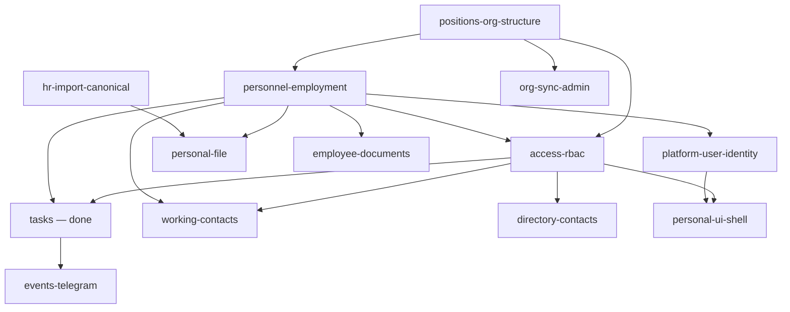

# ARCH-001 — Assessment Program (Position Cabinet Compatibility)

## Document metadata

| Field | Value |
|-------|-------|
| Status | **Draft — Architecture Review** |
| Date | 2026-07-03 |
| Baseline | [ARCH-001 v0.5 — Position Cabinet Architecture](./ARCH-001-position-permission-model.md) |
| Governance | [ARCHITECTURE_GOVERNANCE](./ARCHITECTURE_GOVERNANCE.md) (baseline changes only via architecture session; assessments do **not** amend baseline) |
| Purpose | Centralized queue and rules for subsystem compatibility assessments |

---

## 1. Why this document exists

Individual subsystem assessments must **not** be chosen ad hoc by implementers or agents.  
This program defines:

1. **Inventory** — what counts as a subsystem in Corpsite relative to ARCH-001.
2. **Priority order** — which subsystem to assess next and why.
3. **Standard template** — mandatory structure for every `ARCH-001-<subsystem>-assessment.md`.
4. **Status tracker** — what is done, in progress, or blocked.

The first completed assessment ([Tasks](./ARCH-001-task-subsystem-assessment.md)) was executed as an explicit pilot. **All subsequent assessments follow the queue below**, unless the architecture session reorders it.

---

## 2. Program rules (constraints)

Assessments are **read-only architecture analysis**.

| Allowed | Forbidden |
|---------|-----------|
| Read code, schema, ADRs, ops docs | Change ARCH-001 |
| Produce `docs/architecture/ARCH-001-<subsystem>-assessment.md` | Change ARCHITECTURE_GOVERNANCE |
| Recommend ADR amendments (Required / Recommended / Optional) | Write or refactor code |
| Propose migration roadmap (no implementation) | Change DB schema or migrations |
| List user-centric dependencies | Change API contracts |

**Interpretation principle:** do not improve or replace ARCH-001. Verify whether the existing subsystem **fits** the baseline; report gaps only.

---

## 3. Standard assessment template

Every subsystem document **must** contain these sections (same headings):

| § | Section | Content |
|---|---------|---------|
| 1 | **Executive Summary** | Short verdict; is ARCH-001 sufficient for this subsystem? |
| 2 | **AS-IS** | Current implementation, entities, routing, dependencies |
| 3 | **TO-BE** | Expected shape under ARCH-001 (no baseline changes) |
| 4 | **Ownership Analysis** | Owner per key object among: Position Cabinet, Position, Employment, Person, Platform User, Organization |
| 5 | **Lifecycle Analysis** | Create, change, termination, leave, acting, vacancy, position liquidation |
| 6 | **Access Analysis** | What grants access (Cabinet / Person / Employment / Platform User); all user-centric couplings |
| 7 | **Gap Analysis** | All mismatches vs ARCH-001 |
| 8 | **Required ADR Changes** | Split into **Required** / **Recommended** / **Optional** |
| 9 | **Migration Roadmap** | Phased plan; no implementation |
| 10 | **Risks** | Architectural risks of deferral or migration |

File naming: `docs/architecture/ARCH-001-<subsystem>-assessment.md`  
`<subsystem>` — lowercase kebab-case English slug from the queue table (column **Slug**).

---

## 4. Subsystem inventory

Subsystems are grouped by **architectural layer** (aligned with ARCH-001 §2.1 and ADR-047 four-layer model).

### 4.1. Layer A — Organization & access foundation

| Slug | Subsystem (RU) | Scope (as-is) | ARCH-001 relevance |
|------|----------------|---------------|-------------------|
| `positions-org-structure` | Должности и оргструктура | `positions`, `org_units`, ADR-046, directory positions/org routes | Position ↔ Cabinet 1:1; org-unique Position |
| `personnel-employment` | Персонал и занятия должности | `employees`, `person_assignments`, enrollment, transfer, HR events, `EmployeeDrawer` | Employment opens Cabinet access; acting overlay |
| `access-rbac` | Доступ и RBAC | `users.role_id`, `access_grants`, `/auth/me`, directory RBAC, admin guard, personnel visibility | Permission Template inside Cabinet; effective permissions via Cabinet |
| `platform-user-identity` | Platform User и идентичность | User create, Person↔User linkage, OPS-028, ADR-048, ADR-044 | Auth only; no operational ownership |

### 4.2. Layer B — Operational (Position Cabinet–bound)

| Slug | Subsystem (RU) | Scope (as-is) | ARCH-001 relevance |
|------|----------------|---------------|-------------------|
| `tasks` | Задачи | `tasks`, FSM, ad hoc, task list UX | **Done** — executor/owner Cabinet |
| `events-telegram` | События и Telegram | `task_events`, deliveries, `tg_bindings`, bot internal API | Cabinet → occupant → Platform User delivery |
| `working-contacts` | Рабочие контакты | `working_contacts_routes`, `users.unit_id`, `employees` | Operational directory; likely Cabinet/org scoped |
| `directory-contacts` | Контакты (directory) | `contacts_routes`, task contour predicates | Org/person contact models vs Cabinet |

### 4.3. Layer C — UI shell

| Slug | Subsystem (RU) | Scope (as-is) | ARCH-001 relevance |
|------|----------------|---------------|-------------------|
| `personal-ui-shell` | Личный кабинет (UI) | ADR-007 matrix, post-login navigation, profile | UI aggregation of accessible Cabinets vs confusion with Position Cabinet |

### 4.4. Layer D — HR truth (explicit ARCH-001 exceptions)

| Slug | Subsystem (RU) | Scope (as-is) | ARCH-001 relevance |
|------|----------------|---------------|-------------------|
| `personal-file` | Личное дело | ADR-047, person-centric dossier | **Person-bound by design** (ARCH-001 §4.5) — validate exception |
| `hr-import-canonical` | HR Import и Canonical Registry | Import batches, snapshots, monthly diff | HR truth; not Cabinet-owned; sync boundaries |
| `employee-documents` | Профессиональные / кадровые документы | `employee_documents`, certificates registry | Person vs employee vs Cabinet documents split |

### 4.5. Layer E — Platform operations (lower coupling)

| Slug | Subsystem (RU) | Scope (as-is) | ARCH-001 relevance |
|------|----------------|---------------|-------------------|
| `org-sync-admin` | Org sync и системное администрирование | Data sync ADR-014, admin system panels, reference data | Indirect; admin may manage Cabinet config |

### 4.6. Explicitly out of queue (covered elsewhere or non-domain)

| Item | Reason |
|------|--------|
| Regular Tasks scheduler / catch-up | Covered by `tasks` assessment (same ownership model) |
| Regular Task Runs journal | Observability of task generator; follow-up in ADR-020 amendment |
| JWT / transport (ADR-013) | Not domain-dependent per ARCH-001 §14.4 |
| Unified org filter | Cross-cutting concern; assessed inside each operational subsystem |
| KPI / dashboards (future) | Not implemented as standalone subsystem |

---

## 5. Prioritization criteria

Order is determined by:

1. **Dependency** — subsystems that define Position, Employment, or Access must precede consumers (Tasks already assessed; foundation still required before migration).
2. **ARCH-001 §14.1 ADR impact** — high-priority ADR intersections first.
3. **Blast radius** — user-centric coupling breadth (role_id, user_id as operational keys).
4. **Migration critical path** — what blocks Phase 1 (Cabinet entity + access resolver) design.

---

## 6. Assessment queue (authoritative order)

```text
Tier 0 — Completed
  [x] tasks                    (pilot; explicit request 2026-07-03)

Tier 1 — Foundation (blocks Cabinet implementation design)
  [x] 1. positions-org-structure
  [x] 2. personnel-employment
  [x] 3. access-rbac
  [x] 4. platform-user-identity

Tier 2 — Operational consumers
  [ ] 5. events-telegram
  [ ] 6. working-contacts
  [ ] 7. directory-contacts

Tier 3 — UI & HR exceptions
  [ ] 8. personal-ui-shell
  [ ] 9. personal-file
  [ ] 10. hr-import-canonical
  [ ] 11. employee-documents

Tier 4 — Platform
  [ ] 12. org-sync-admin
```

### 6.1. Dependency graph



### 6.2. Rationale per queue item

| # | Slug | Why this order |
|---|------|----------------|
| 1 | `positions-org-structure` | Cabinet is 1:1 with **org-unique Position** (ARCH-001 §3.3, §6). As-is `public.positions` catalog must be assessed before Employment or RBAC can bind to Cabinet. |
| 2 | `personnel-employment` | **Занятие должности** opens Cabinet access (ARCH-001 §3.2, §9). Enrollment, transfer, acting (ADR-036) are the HR→ops bridge. |
| 3 | `access-rbac` | Effective permissions = union of accessible Cabinets (ARCH-001 §3.6, §10). Replaces `users.role_id` as operational center. |
| 4 | `platform-user-identity` | Confirms auth-only boundary before UI and notifications assessments. |
| 5 | `events-telegram` | Task assessment covered task events; this assesses **delivery infrastructure** holistically (bot, bindings, non-task future). |
| 6 | `working-contacts` | High visibility operational read model; tightly coupled to `users.unit_id` + `employees`. |
| 7 | `directory-contacts` | Contact contour and task-related predicates; org/person vs cabinet. |
| 8 | `personal-ui-shell` | Resolves ADR-007 «личный кабинет» vs Position Cabinet terminology and post-login UX. |
| 9 | `personal-file` | Validates ARCH-001 §4.5 **Person exception**; must not drift toward Cabinet ownership. |
| 10 | `hr-import-canonical` | Full-roster HR truth; boundaries with Person and operational registry. |
| 11 | `employee-documents` | Split: personal vs professional vs **Cabinet function documents** (ARCH-001 §4.4). |
| 12 | `org-sync-admin` | Lowest coupling; reference data and sync rarely own operational objects. |

---

## 7. Status tracker

| Slug | Document | Status | Date | Verdict (summary) |
|------|----------|--------|------|-------------------|
| `tasks` | [ARCH-001-task-subsystem-assessment.md](./ARCH-001-task-subsystem-assessment.md) | **Complete** | 2026-07-03 | ARCH-001 sufficient; cabinet re-binding required; ADR-049 + ADR-023/020/024 amendments |
| `positions-org-structure` | [ARCH-001-positions-org-structure-assessment.md](./ARCH-001-positions-org-structure-assessment.md) | **Complete** | 2026-07-03 | ARCH-001 sufficient; org-unique Position + Cabinet not implemented; ADR-050 required |
| `personnel-employment` | [ARCH-001-personnel-employment-assessment.md](./ARCH-001-personnel-employment-assessment.md) | **Complete** | 2026-07-03 | ARCH-001 sufficient; Person/assignments partial; Employee-centric runtime; blocked on ADR-050 for Cabinet access |
| `access-rbac` | [ARCH-001-access-rbac-assessment.md](./ARCH-001-access-rbac-assessment.md) | **Complete** | 2026-07-03 | ARCH-001 sufficient; user-centric RBAC (`users.role_id`) not cabinet-compatible; blocked on ADR-050/051; ADR-023/042 B5/E1 amendments |
| `platform-user-identity` | [ARCH-001-platform-user-identity-assessment.md](./ARCH-001-platform-user-identity-assessment.md) | **Complete** | 2026-07-03 | ARCH-001 sufficient; User can stay auth-only; Person link indirect/incomplete; role_id/unit_id on User are transitional |
| `events-telegram` | — | Pending | — | — |
| `working-contacts` | — | Pending | — | — |
| `directory-contacts` | — | Pending | — | — |
| `personal-ui-shell` | — | Pending | — | — |
| `personal-file` | — | Pending | — | — |
| `hr-import-canonical` | — | Pending | — | — |
| `employee-documents` | — | Pending | — | — |
| `org-sync-admin` | — | Pending | — | — |

**Next assessment (default):** `events-telegram` (queue #5).

To start an assessment: use slug from this queue only; update status tracker row when document is complete.

---

## 8. Exit criteria (whole program)

The ARCH-001 assessment program is **complete** when:

1. Every queued subsystem has a published assessment document.
2. Each document answers all ten template sections.
3. Cross-cutting ADRs are consolidated into a **master amendment backlog** (architecture session output — not part of individual assessments).
4. Architecture session confirms: **ARCH-001 sufficient for Corpsite operational contour** or lists explicit baseline gaps (rare; would require ARCH-001 revision via governance, not via code).

---

## 9. After assessments — expected outputs (not part of this program)

Assessments inform but do **not** replace:

| Output | Owner |
|--------|-------|
| ARCH-001 → ARCHITECTURE_GOVERNANCE promotion | Architecture session |
| ADR-049 (Tasks transition) and sibling ADRs per subsystem | ADR authors |
| [ADR-050](../adr/ADR-050-organization-position-cabinet-model.md), [ADR-051](../adr/ADR-051-cabinet-access-resolution.md) | **Authored (Proposed)** — Position/Cabinet model and access resolver contract |
| Master migration sequencing across subsystems | [Implementation roadmap](./ARCH-001-implementation-roadmap.md) |
| [Foundation consolidation review](./ARCH-001-foundation-consolidation-review.md) | Architecture review (corpus consistency) |
| [Implementation roadmap](./ARCH-001-implementation-roadmap.md) | Phased sequencing post-approval (Phases 0–8) |
| [IMPLEMENTATION_PLAN.md](./IMPLEMENTATION_PLAN.md) | Engineering execution packages per roadmap phase |

---

## 10. How to run the next assessment task

Use this prompt pattern (subsystem **must** match queue):

```text
Architecture Assessment — Subsystem: <name>
Slug: <slug from queue>
Baseline: ARCH-001 v0.5
Program: docs/architecture/ARCH-001-assessment-program.md
Deliverable: docs/architecture/ARCH-001-<slug>-assessment.md
Follow standard template §1–§10.
No code, DB, API, or baseline changes.
```

---

## Document history

| Date | Version | Change |
|------|---------|--------|
| 2026-07-03 | 1.0 | Initial assessment program; queue after completed Tasks pilot |
