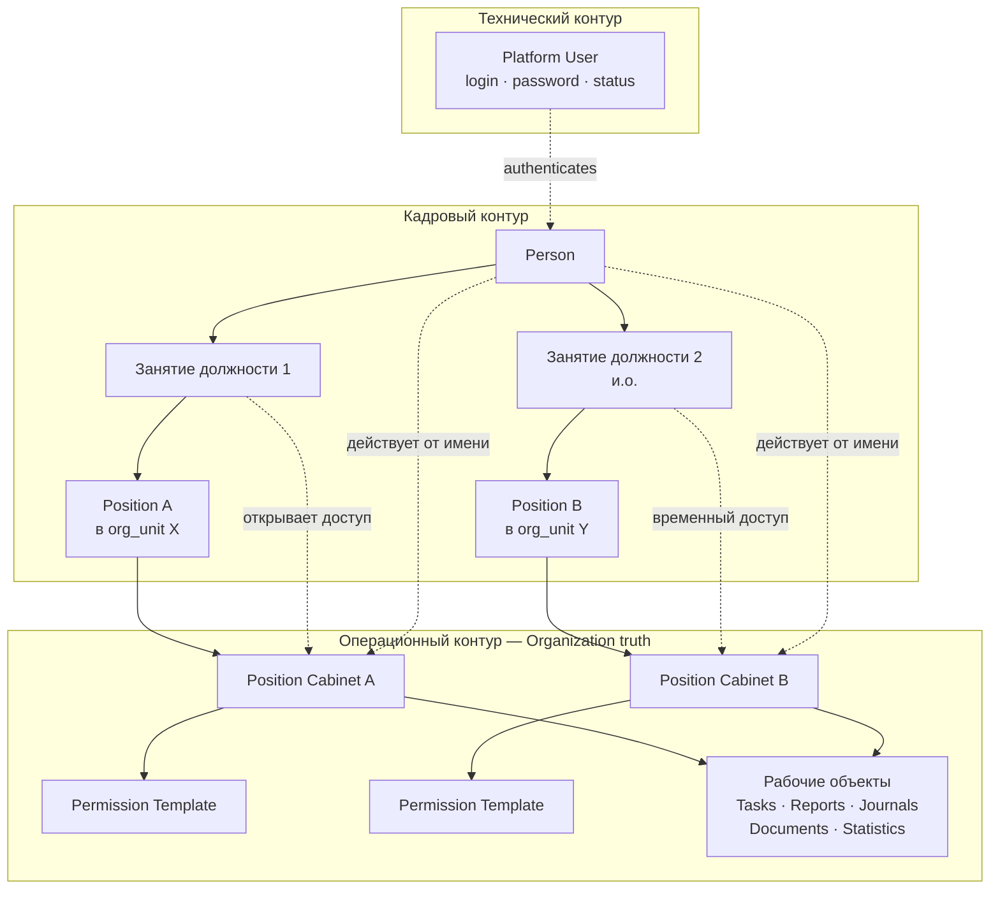
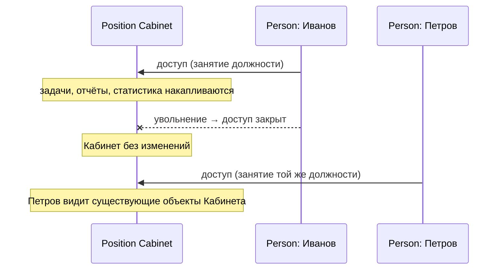
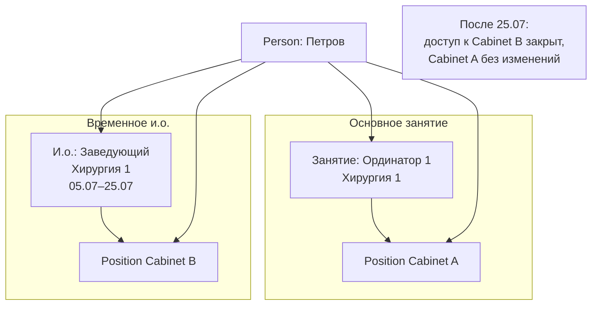

# ARCH-001 — Position Cabinet Architecture

## Статус

**Draft (Architecture Review)** — 2026-07-03

Документ фиксирует **целевую предметную модель** Corpsite до пересмотра ADR.  
После утверждения baseline-принципы переносятся в [ARCHITECTURE_GOVERNANCE.md](./ARCHITECTURE_GOVERNANCE.md).  
На данном этапе **код, схема БД, API и существующие ADR не изменяются**.

| Ограничение | Применяется |
|-------------|-------------|
| Изменения кода | ✗ |
| Изменения БД | ✗ |
| Изменения API | ✗ |
| Изменения ADR | ✗ |
| Предложения по реализации | ✗ (только предметная модель) |

### Архитектурные принципы (сводка)

> **Position** — уникальная организационная позиция (штатная единица) в структуре организации. Отдельная сущность Slot **не требуется**, если штатная структура ведётся на этом уровне детализации.

> **Кабинет должности** — цифровое представление Position в Corpsite; **долгоживущая** сущность: создаётся вместе с Position, **жизненный цикл Cabinet = жизненный цикл Position** (§4.2).

> Человек лишь **временно получает доступ** к Кабинету на период **занятия** соответствующей Position. Поведение процессов при **вакантном** Cabinet — **Business Policy** (§4.7.2), не архитектура.

---

## 1. Причины пересмотра архитектуры

### 1.1. Смешение кадровой и функциональной семантики

В текущей реализации Corpsite три различных понятия часто выражены одной сущностью `public.roles` (Platform Role / Task Role):

| Понятие | Пример | Ожидаемая природа |
|---------|--------|-------------------|
| Кадровая должность | «Заместитель по диспансеру и внутренней экспертизе» | HR-факт, штатное расписание |
| Функциональная роль в системе | `QM_HEAD`, `DEP_OUTPATIENT_AUDIT` | Набор прав и маршрутов задач |
| Учётная запись | `qm_head@corp.local`, `kozgambaeva.lt` | Аутентификация конкретного человека |

Pilot-seed (`db/init/020_seed_roles_users_employees.sql`) закрепил антипаттерн: `employees.employee_id = roles.code`, login = `lower(role_code)@corp.local`. Это допустимо для pilot, но **не отражает production-реальность**, где человек, должность и права — независимые измерения.

### 1.2. User-centric RBAC

Текущая модель строится вокруг **Platform User** и `users.role_id`:

- задачи маршрутизируются по `executor_role_id` (ADR-023);
- видимость и approve rules привязаны к пользователю и его роли;
- при смене сотрудника на должности требуется **перенос** задач, отчётов и прав между людьми.

Это противоречит организационной природе медицинского учреждения: **должность** существует независимо от того, кто её занимает; рабочие объекты принадлежат **функции в структуре**, а не конкретному login.

### 1.3. Один Platform User — одна «роль»

Сегодня `users.role_id` хранит **единственный** Platform Role. Это не покрывает:

- совместительство (два кадровых занятия должности одновременно);
- временное исполнение обязанностей (и.о.) без смены штатной должности;
- одновременный доступ к **двум Кабинетам должности** (основной + и.о.);
- смену сотрудника на той же должности без миграции операционных данных.

### 1.4. Расхождение ADR и операционной практики

| Документ | Зафиксированный принцип | Фактическое состояние |
|----------|-------------------------|----------------------|
| [ADR-031](../adr/ADR-031-directory-personnel-contacts-contract.md) | Roles и Positions — разные сущности | UI «Роль Corpsite» путается с кадровой должностью |
| [ADR-042 Phase A](../adr/ADR-042-phase-a-personnel-access-enrollment-architecture.md) | Управляем assignments, не employees | `employees` — одна строка = одна должность |
| [OPS-028](../ops/OPS-028-platform-user-login-policy.md) | Login принадлежит Person/User, не роли | Legacy pilot-логины по коду роли |
| [OPS-029](../ops/OPS-029-user-create-form-ux-role-source.md) | Platform Role ≠ кадровая должность | Нет модели операционного контейнера должности |
| [ADR-036](../adr/ADR-036-hr-events-unified-model.md) | ACTING_ASSIGNMENT — overlay без смены snapshot | Нет overlay доступа к Кабинету должности |

### 1.5. Зачем нужен пересмотр сейчас

1. **HR-контур** описывает Person и Employment, но **операционные объекты** (задачи, отчёты) не привязаны к должности как к устойчивому контейнеру.
2. **RBAC задач** (ADR-023) маршрутизирует по роли пользователя, а не по Кабинету должности.
3. **Access Registry** (ADR-042) не выражает единый «рабочий контекст» должности.
4. Операторы уже сталкиваются с кейсами смены сотрудника и и.о., которые as-is решаются только ручной миграцией или сменой `role_id`.

---

## 2. Описание предметной области

Corpsite моделирует **не пользователей**, а **организационную структуру медицинской организации**.

Центральной бизнес-сущностью становится **организационная должность** — через её цифровое представление, **Кабинет должности (Position Cabinet)**.

Corpsite — система управления организацией и организационными процессами (задачи, кадровый контур, доступ). Она **не** является системой расчёта зарплаты или кадрового делопроизводства, но **отражает** актуальное кадровое состояние и **управляет** операционной деятельностью **должностей** в структуре организации.

### 2.1. Organization-centric архитектура

```text
┌─────────────────────────────────────────────────────────────────────┐
│  КАДРОВЫЙ КОНТУР (HR truth)                                        │
│  Person → Занятие должности (Employment) → Position                │
└─────────────────────────────────────────────────────────────────────┘
                              │
                              │  период занятия открывает доступ
                              ▼
┌─────────────────────────────────────────────────────────────────────┐
│  ОПЕРАЦИОННЫЙ КОНТУР (Organization truth)                          │
│  Position Cabinet — задачи, отчёты, журналы, документы, права       │
└─────────────────────────────────────────────────────────────────────┘
                              ▲
                              │  authentication only
┌─────────────────────────────────────────────────────────────────────┐
│  ТЕХНИЧЕСКИЙ КОНТУР                                                │
│  Platform User — login, password, account status                    │
└─────────────────────────────────────────────────────────────────────┘
```

**Ключевой принцип:** рабочие процессы и функциональные возможности определяются **не учётной записью**, а **Кабинетом соответствующей должности**. Platform User — исключительно техническая точка входа.

### 2.2. Границы ответственности

| Вопрос | Контур | Владелец данных |
|--------|--------|-----------------|
| Кто этот человек? | HR | HR / Canonical Registry |
| Занимает ли он должность и в какой период? | HR | HR-администратор |
| Какой Кабинет должности существует в системе? | Platform (org) | Организация / конфигурация Corpsite |
| Есть ли у человека учётная запись? | Platform (auth) | Системный администратор |
| К каким Кабинетам у него доступ? | Platform | Политика занятия должности + и.о. |
| Где живут задачи и отчёты? | Platform (ops) | **Position Cabinet** |

### 2.3. Отличие от «личного кабинета» (ADR-007)

В ADR-006/007 термин **«личный кабинет»** описывает **UI-контур входа пользователя** (экраны исполнителя / руководителя). Это **не** то же самое, что **Кабинет должности**:

| Понятие | Смысл |
|---------|-------|
| **Личный кабинет** (ADR-007) | Точка входа Platform User: «что я вижу после login» |
| **Кабинет должности** (ARCH-001) | Операционный контейнер организационной должности: задачи, отчёты, права |

Platform User после login **получает представление** одного или нескольких Кабинетов должности, к которым у него есть доступ на текущий период.

---

## 3. Главные сущности

### 3.1. Person

**Person** — каноническая идентичность физического лица.

| Аспект | Описание |
|--------|----------|
| Назначение | Стабильный якорь: ИИН, ФИО, дата рождения, match_key |
| Не является | Employee, User, должностью, Кабинетом должности |
| Источник | HR Canonical Registry; operational Person создаётся при enrollment |
| Связи | 1 Person → N Занятий должности; 0..1 Platform User (через operational bridge) |

Person отвечает на вопрос: **«Кто этот человек как физическое лицо?»**

### 3.2. Занятие должности (Employment)

**Занятие должности** — факт, что Person **занимает** определённую **Position** в течение заданного периода времени.

| Аспект | Описание |
|--------|----------|
| Назначение | Фиксирует: Person + Position + тип занятости + ставка + `[start_date, end_date]` |
| Кардинальность | 1 Person → N Занятий должности (одновременно активных допускается несколько) |
| Жизненный цикл | Период, active_flag; история append-only |
| Эффект в системе | На период занятия Person **получает доступ** к соответствующему Position Cabinet |
| Не означает владение | Person **не владеет** Кабинетом; доступ прекращается при окончании занятия |

Занятие должности отвечает на вопрос: **«Кто, где и на какой должности работает (или работал) в этот период?»**

> **Терминология:** используется **«занятие должности»**, а не «назначение» — чтобы не смешивать с task assignment (маршрутизация задач) и HR-термином assignment в ADR-042 (`person_assignments`). Концептуально **Занятие должности = Employment = person_assignment** (ADR-042).  
> **Доступ к Position Cabinet** в целевой модели открывается **Занитием должности** (primary) или overlay **и.о.** (ACTING, ADR-036). Отдельная сущность «Permission Assignment» на Platform User **не входит** в целевую архитектуру — права наследуются через доступ к Кабинету (§3.5, §7).

### 3.3. Position

**Position** — **уникальная организационная позиция** (штатная единица) в структуре организации.

| Аспект | Описание |
|--------|----------|
| Назначение | Конкретная единица штатного расписания: «Ординатор 2, Хирургия 1», «Госпитальный эксперт ОВЭиПД», «Заместитель по диспансеру…» |
| Природа | HR-факт; идентифицирует **одну** позицию в org structure (включая подразделение и различимость однотипных единиц в одном отделении) |
| Не является | Platform Role, Permission Template, Кабинетом, учётной записью, Person |
| Связи | N Занятий должности → 1 Position; **1 Position → 1 Position Cabinet** (создаются и существуют совместно) |

Position отвечает на вопрос: **«Какая именно штатная единица существует в организационной структуре?»**

> **Решение по идентичности (Slot не требуется):** если организация ведёт штатную структуру так, что каждая занимаемая позиция уже **уникальна** («Ординатор 1» и «Ординатор 2» в одном отделении — **две разные** Position), отдельная сущность **Slot** в архитектуре Corpsite **не вводится**. Position **уже** несёт эту уникальность.  
> As-is справочник `public.positions` может содержать обобщённые наименования без org context — это **технический долг**, не целевая семантика Position (см. ADR-046, нормализация каталога).

### 3.4. Position Cabinet (Кабинет должности)

**Position Cabinet** — цифровое представление **организационной должности** (штатной единицы) в Corpsite.

| Аспект | Описание |
|--------|----------|
| Назначение | Операционный контейнер: задачи, отчёты, журналы, документы, статистика, права |
| Владелец | **Организационная должность** (штатная единица), **не** Person и **не** Platform User |
| Жизненный цикл | **Долгоживущая** сущность: создаётся вместе с Position, существует на всём жизненном цикле должности (§4.2) |
| Доступ | Person получает доступ **только на период** соответствующего Занятия должности (или и.о.) |
| Центральность | **Главная операционная сущность** Corpsite |
| Связь с Position | **1 Position ↔ 1 Position Cabinet** — без промежуточных сущностей |

Position Cabinet отвечает на вопрос: **«Где живёт операционная деятельность этой должности в Corpsite?»**

### 3.5. Permission Template

**Permission Template** — именованный **шаблон прав**, являющийся **составной частью** Position Cabinet (не самостоятельным центром архитектуры).

| Аспект | Описание |
|--------|----------|
| Назначение | Определяет набор Permissions для функционирования Кабинета |
| Расположение | **Внутри** Position Cabinet, а не «напрямую на User» |
| Природа | Конфигурация платформы |
| Примеры кодов | `QM_HOSP`, `QM_AMB`, `QM_HEAD`, `HR_ENROLLMENT_MANAGER` |

> В as-is ближайший аналог — `public.roles`. В to-be Permission Template **принадлежит Кабинету**, а Person получает права **через доступ к Кабинету**, а не через прямое назначение template на login.

### 3.6. Permissions

**Permissions** — атомарные или составные права, входящие в Permission Template Кабинета.

| Уровень | Примеры |
|---------|---------|
| Модуль | `personnel`, `tasks`, `hr_import` |
| Действие | `tasks.report`, `tasks.approve`, `employees.transfer` |
| Видимость | `personnel.visibility.dept`, `personnel.visibility.org` |
| Маршрутизация | `executor:cabinet`, `approver:initiator` |

Effective Permissions Person = **объединение** Permissions всех Position Cabinet, к которым у него есть **активный доступ** на текущий момент.

### 3.7. Platform User

**Platform User** — долгоживущая учётная запись **аутентификации**.

| Аспект | Описание |
|--------|----------|
| Назначение | **Только:** login, password, account status, authentication |
| Не определяет | Рабочие процессы, права, задачи, отчёты |
| Не владеет | Кабинетами, задачами, документами должности |
| Связи | 1 Platform User ↔ 0..1 Person; доступ к N Position Cabinet **через** активные Занятия должности |

Platform User отвечает на вопрос: **«Под каким логином этот человек входит в Corpsite?»**

---

## 4. Кабинет должности (Position Cabinet)

### 4.1. Определение

> **Кабинет должности (Position Cabinet)** — цифровое представление организационной должности в информационной системе Corpsite.

Кабинет должности:

- **принадлежит** должности (штатной единице в org structure);
- **не принадлежит** человеку;
- **существует** независимо от того, занята должность или нет;
- **сохраняется** при увольнении сотрудника;
- **становится доступным** человеку только на период занятия соответствующей должности (или временного и.о.).

### 4.2. Принцип долговечности

> **Кабинет должности является долгоживущей сущностью.** Он создаётся **вместе с** организационной должностью (Position), существует **независимо** от того, занята должность или вакантна, и **сохраняет** своё состояние, историю и рабочие процессы на протяжении **всего жизненного цикла** должности.

| Аспект | Поведение |
|--------|-----------|
| Создание | Position Cabinet появляется **одновременно** с вводом Position в штатную структуру |
| Вакансия | Cabinet **не исчезает**; задачи, отчёты, статистика **остаются** |
| Смена Person | Cabinet **не пересоздаётся**; меняется только доступ |
| Увольнение | Cabinet **сохраняется**; накопленная операционная история **не мигрирует** |
| Ликвидация должности | Cabinet завершает жизненный цикл **вместе с** Position (кадровое событие упразднения штатной единицы) |

**Архитектурные правила жизненного цикла:**

1. Position Cabinet **существует**, пока существует соответствующая Position.
2. Position Cabinet **создаётся вместе** с Position.
3. Position Cabinet **не исчезает** при увольнении, отпуске, смене Person или **временной вакансии**.
4. Position Cabinet **завершается только** при упразднении соответствующей штатной единицы / Position.

**Инвариант жизненного цикла:**

> **Жизненный цикл Position Cabinet полностью определяется жизненным циклом соответствующей Position.**

Долговечность Cabinet — архитектурная предпосылка **organization-centric** модели: операционные данные принадлежат **должности**, а не сменяемым носителям.

### 4.3. Принцип владения

> **Кабинет принадлежит организационной должности (Position), а не человеку.**

Человек получает доступ к Кабинету **исключительно** на период:

- **основного** Занятия должности (primary employment), или
- **временного исполнения обязанностей** (acting / и.о.).

При прекращении занятия доступ **автоматически закрывается**.  
Кабинет, его задачи, отчёты, статистика и конфигурация **остаются** в системе.

### 4.4. Состав Кабинета должности

Position Cabinet — **не только права**. Permission Template и Permissions — **одна из составляющих**.

Кабинет должности может включать:

| Компонент | Описание |
|-----------|----------|
| **Задачи** | Adhoc tasks, привязанные к Кабинету |
| **Регулярные задачи** | Regular tasks, catch-up, периодическая отчётность |
| **Журналы** | Операционные журналы подразделения / функции |
| **Отчёты** | Submitted reports, история согласований |
| **Документы** | Регламенты, шаблоны, документы функции (не личное дело) |
| **Показатели** | KPI, контрольные точки |
| **Статистика** | Агрегаты по деятельности должности |
| **Аналитические панели** | Dashboards функции |
| **Уведомления** | Профиль доставки событий Кабинета |
| **Permission Template** | Шаблон прав, определяющий допустимые действия |
| *Будущие модули* | Любые функциональные разделы, привязанные к должности |

### 4.5. Архитектурный инвариант

> **Все операционные объекты Corpsite должны связываться прежде всего с Кабинетом должности, а не непосредственно с Person или Platform User, если это допускается предметной областью.**

**Означает:**

- задача «принадлежит» Кабинету исполнителя, а не login;
- отчёт сохраняется в контексте Кабинета;
- статистика должности **не сбрасывается** при смене сотрудника;
- audit фиксирует **кто** (Person) выполнил действие **от имени какого** Кабинета.

**Оговорки (допустимые исключения):**

| Объект | Привязка | Причина |
|--------|----------|---------|
| Личное дело сотрудника (ADR-047) | Person | Персональные HR-документы не belong to position cabinet |
| Auth session, login history | Platform User | Технический контур |
| Кадровые события (`employee_events`) | Person / Employment | HR truth |
| Initiator-specific approve (ADR-023) | Person (initiator) | Управленческое решение конкретного постановщика — уточняется при пересмотре ADR-023 |

### 4.6. Смена сотрудника на должности

```text
Иванов
   │
   ▼
занимает должность «Ординатор 2, Хирургия 1»
   │
   ▼
получает доступ к Position Cabinet «Ординатор 2 / Хирургия 1»
   │
   ▼
уволен → доступ закрыт
   │
   ▼
Position Cabinet СОХРАНЯЕТСЯ
(задачи, отчёты, статистика, журналы — без изменений)
   │
   ▼
Петров
   │
   ▼
занимает ту же должность «Ординатор 2, Хирургия 1»
   │
   ▼
автоматически получает доступ к СУЩЕСТВУЮЩЕМУ Position Cabinet
```

**Никакой миграции** задач, отчётов, статистики или полномочий **не требуется** — меняется только Person, имеющий доступ к неизменному Кабинету.

### 4.7. Вакантный Position Cabinet

#### 4.7.1. Архитектура (зафиксировано)

Временная **вакансия** должности (нет активного Занятия должности) **не влияет** на существование Position Cabinet:

| Событие | Position Cabinet |
|---------|------------------|
| Увольнение последнего занимающего | **Сохраняется** |
| Отпуск / больничный (должность формально занята) | **Сохраняется**; доступ Person может быть ограничен политикой |
| Временная вакансия (нет Person) | **Сохраняется**; состояние, история, рабочие объекты **не удаляются** |
| Смена Person | **Тот же** Cabinet |
| Упразднение Position | Cabinet **завершается** вместе с Position |

Вакантный Cabinet — **нормальное архитектурное состояние**, а не исключение и **не** open question. Отсутствие Person с доступом **не означает** отсутствие Cabinet.

#### 4.7.2. Business Policy / Process Policy (не архитектура)

Поведение **операционных процессов** при вакантном Cabinet (regular tasks, уведомления, эскалации) **не определяется** ARCH-001. Это **бизнес-политика / процессная политика** организации, настраиваемая отдельно (в т.ч. при пересмотре ADR-020, ADR-023).

Архитектура **допускает** разные политики без изменения модели Position Cabinet:

| Политика | Описание |
|----------|----------|
| **Приостановка regular tasks** | Catch-up не создаёт новые задачи, пока должность вакантна |
| **Эскалация руководителю** | Задачи / уведомления перенаправляются в Cabinet вышестоящей должности |
| **Временное занятие (и.о.)** | ACTING overlay открывает доступ к вакантному Cabinet исполняющему (ADR-036) |
| **Политика по типу должности** | Разные правила для клинических, административных, руководящих Position |

> **Разделение ответственности:** ARCH-001 фиксирует, **что** Cabinet существует и сохраняет данные; **как** организация обрабатывает вакансию — решение процессной политики, не архитектурный пробел.

### 4.8. Концептуальная модель (organization-centric)

Corpsite моделирует **организационную структуру**, а не набор пользователей.

```text
                    Person
                      │
              Занятие должности
                      │
                   Position  ◄── уникальная штатная единица
                      │
              Position Cabinet  ◄── 1:1, создаётся вместе, долгоживущий
                 /         \
                /           \
   Permission Template    Рабочие объекты
           │                    │
      Permissions          Tasks, Regular Tasks,
                           Reports, Dashboards,
                           Statistics, Journals,
                           Documents, Notifications
```

Platform User подключается **сбоку** — только для authentication; все рабочие контексты — через Position Cabinet.

---

## 5. Архитектурные диаграммы

### 5.1. Полная модель



### 5.2. Смена сотрудника (без миграции)



### 5.3. Временное исполнение обязанностей — два Кабинета



### 5.4. Разделение as-is и to-be

| As-is (текущая реализация) | To-be (целевая модель ARCH-001) |
|----------------------------|----------------------------------|
| `public.positions` — **глобальный справочник** наименований; org-uniqueness не гарантирован (технический долг, ADR-046) | **Position** — **уникальная штатная единица** в org structure (§3.3, §6) |
| `person_assignments` / snapshot на `employees` | **Занятие должности (Employment)** |
| — | **Position Cabinet** — 1:1 с Position; центральная ops-сущность |
| `public.roles` + `users.role_id` | **Permission Template** — компонент Cabinet |
| `tasks` привязаны к user / role | **Tasks** и прочие ops-объекты привязаны к **Position Cabinet** |
| `public.users` — auth + role + косвенно «рабочий контекст» | **Platform User** — только authentication |

---

## 6. Определение Position

**Position** — **уникальная штатная единица** организационной структуры. Каждая Position однозначно идентифицирует одну позицию штатного расписания (включая подразделение и различие однотипных единиц, например «Ординатор 1» vs «Ординатор 2»).

### 6.1. Position и Position Cabinet

| Position | Position Cabinet |
|----------|------------------|
| Организационная штатная единица | Цифровое представление **той же** единицы в Corpsite |
| Создаётся при вводе в штатное расписание | **Создаётся одновременно** с Position |
| Жизненный цикл определяется кадровыми решениями | **Долгоживущий** — параллельный жизненный цикл (§4.2) |
| **1 Position → 1 Position Cabinet** | **1 Position Cabinet → 1 Position** |
| Не содержит задач | Содержит все рабочие объекты функции |

Отдельная сущность **Slot** не вводится: уникальность «Ординатор 2, Хирургия 1» **уже** выражена в Position, если так ведётся штатная структура организации.

### 6.2. Position ≠ Permission Template

Один Position Cabinet содержит **типовой** Permission Template, но кадровое имя должности и код template **не обязаны** совпадать (см. ADR-031, OPS-029).

---

## 7. Определение Permission Template

Permission Template — **компонент Position Cabinet**, определяющий допустимые Permissions.

Template **не назначается Person напрямую** в целевой модели: Person наследует Permissions **через доступ к Кабинету**, в котором template настроен.

При временном и.о. Person получает доступ ко **второму** Кабинету (со своим template), не заменяя доступ к основному.

---

## 8. Роль Platform User

Platform User — **исключительно техническая** сущность ([OPS-028](../ops/OPS-028-platform-user-login-policy.md)):

| Ответственность | ✓ / ✗ |
|-----------------|-------|
| login | ✓ |
| password | ✓ |
| account status (active / locked) | ✓ |
| authentication | ✓ |
| ownership задач | ✗ |
| ownership отчётов | ✗ |
| Permission Template | ✗ |
| Position Cabinet | ✗ |

После login система определяет **список доступных Position Cabinet** по активным Занятиям должности Person и показывает соответствующий **личный кабинет** (UI) как агрегированное представление.

---

## 9. Временное исполнение обязанностей

### 9.1. Доступ к дополнительному Кабинету

При временном исполнении обязанностей Person получает доступ к **дополнительному** Position Cabinet — Кабинету **замещаемой** должности.

**Пример:**

```text
Основное занятие:  Ординатор 1, Хирургия 1  →  Position Cabinet A
Временное и.о.:     Заведующий, Хирургия 1   →  Position Cabinet B
                   (05.07.2026 – 25.07.2026)
```

На период и.о. Person **одновременно** имеет доступ к Cabinet A и Cabinet B.  
После `valid_to` доступ к Cabinet B **автоматически прекращается**; Cabinet A **без изменений**.

### 9.2. Связь с ADR-036

Кадровый контур: событие `ACTING_ASSIGNMENT`, overlay **без** мутации штатного Занятия должности (ADR-036).

Операционный контур: **временный доступ** к Position Cabinet B; Permission Template B действует через Кабинет, не через смену `users.role_id`.

---

## 10. Одновременные активные доступы

Person **может иметь доступ к нескольким Position Cabinet** одновременно:

| Сценарий | Кабинеты |
|----------|----------|
| Совместительство | Cabinet A + Cabinet B (по двум Занятиям должности) |
| Основная должность + и.о. | Cabinet primary + Cabinet acting |
| Переключение UI | Person выбирает **активный контекст** Кабинета в личном кабинете |

Effective Permissions = union Permissions всех **доступных** Cabinet на текущий момент.

---

## 11. Реальные примеры

### 11.1. Козгамбаева Ляззат Таласпаевна

| Измерение | To-be |
|-----------|-------|
| Person | Козгамбаева Л.Т. |
| Занятие должности | Position «Зам. по диспансеру и внутренней экспертизе» (аппарат управления) |
| Position Cabinet | Cabinet зама по диспансеру — задачи, отчёты, статистика функции |
| Permission Template | `DEP_OUTPATIENT_AUDIT` — **внутри** Cabinet |
| Platform User | `kozgambaeva.lt` — только auth |

При смене Person на этой должности Cabinet **сохраняется**; меняется только доступ.

### 11.2. Масимов Акрамжан Бакримжанович

| Измерение | To-be |
|-----------|-------|
| Занятие должности | Position «Руководитель ОВЭиПД» |
| Position Cabinet | Cabinet руководителя ОВЭиПД — team tasks, approve/reject, аналитика |
| Permission Template | `QM_HEAD` внутри Cabinet |
| Platform User | `masimov.ab` (целевой login по OPS-028) |

Supervisor visibility — свойство **Cabinet** `QM_HEAD`, не login `masimov.ab`.

### 11.3. Макибаева

| Измерение | To-be |
|-----------|-------|
| Platform User | `makibaeva.as` — без изменения |
| Смена функции | Закрыто Занятие / доступ к Cabinet A; открыт доступ к Cabinet B |
| Кадровый контур | Занятие должности меняется **только** HR-операцией |

UI «Изменить роль Corpsite» as-is = смена Cabinet-доступа; to-be = явное управление Занятиями должности и доступом к Cabinet.

---

## 12. Кейс: амбулаторный эксперт временно исполняет обязанности госпитального эксперта

### 12.1. Участники и Кабинеты

| Person | Position (штатная) | Position Cabinet | Permission Template |
|--------|-------------------|------------------|---------------------|
| Акильтаева Б.С. | Амбулаторный эксперт ОВЭиПД | **Cabinet A** (amb) | `QM_AMB` |
| Сейтказина Г.Т. | Госпитальный эксперт ОВЭиПД | **Cabinet B** (hosp) | `QM_HOSP` |

### 12.2. Событие

Сейтказина — отпуск **05.07–25.07.2026**. Акильтаева — **и.о.** госпитального эксперта.

### 12.3. Кадровый контур

Занятие должности Акильтаевой (амбулаторный эксперт) **без изменений**.  
Overlay и.о. (ADR-036) открывает **временный доступ** к Cabinet B.

### 12.4. Операционный контур

```text
Person: Акильтаева
Platform User: akiltaeva.bs (без изменений)

Доступ к Cabinet A (основной):     бессрочно, через Занятие должности
Доступ к Cabinet B (и.о. hosp):    05.07 – 25.07, через ACTING overlay
```

На период 05.07–25.07 Акильтаева **работает в двух Кабинетах**:

- задачи amb — в Cabinet A;
- задачи hosp — в Cabinet B;
- отчёты каждого потока — в соответствующем Cabinet.

**После 25.07:** доступ к Cabinet B закрыт; Cabinet B **остаётся** у должности госпитального эксперта; при возвращении Сейтказиной она снова получает доступ к **тому же** Cabinet B.

---

## 13. Последствия для системы

### 13.1. Концептуальные

| Область | Последствие |
|---------|-------------|
| Парадигма | User-centric RBAC → **organization-centric** (Position Cabinet) |
| Терминология | «Platform Role» → Permission Template **внутри Cabinet** |
| Центр данных | Tasks, reports, stats → **Position Cabinet**, не User |
| HR vs Platform | Занятие должности открывает доступ; увольнение закрывает; Cabinet persist |

### 13.2. Задачи и RBAC

| Область | Последствие |
|---------|-------------|
| `executor_role_id` | Эволюция к `executor_cabinet` / cabinet-linked routing |
| Regular tasks catch-up | Генерация в Cabinet должности |
| Approve rules | Initiator (Person) + контекст Cabinet |
| Audit | `(person_id, cabinet_id, action, timestamp)` |

### 13.3. UI

| Экран | Концепция |
|-------|-----------|
| После login | Список доступных Position Cabinet |
| Рабочая область | Действия **в контексте выбранного** Cabinet |
| Employee drawer | Занятия должности + доступные Cabinet |
| Смена сотрудника | Нет «переноса задач» — новый Person получает доступ к тому же Cabinet |

### 13.4. Риски при отложенном пересмотре

1. Продолжающаяся привязка задач к user/role — **потеря истории** при кадровых изменениях.
2. И.о. через смену `role_id` — **утрата** основного контекста.
3. Путаница «личный кабинет» (UI) vs «кабинет должности» (ops).
4. As-is каталог `public.positions` без org-uniqueness — **расхождение** с целевой семантикой Position; нормализация при пересмотре ADR-046.

---

## 14. ADR, потенциально требующие пересмотра

После утверждения ARCH-001 следующие ADR и ops-документы **могут потребовать пересмотра или дополнения**. Список предварительный; финальный scope — на architecture session.

### 14.1. Высокий приоритет (прямое пересечение с Position Cabinet)

| ADR / документ | Причина |
|----------------|---------|
| [ADR-023](../adr/ADR-023-rbac-v2-lean-scope-and-approvals.md) | `executor_role_id`, visibility, approve — переход к cabinet-centric |
| [ADR-031](../adr/ADR-031-directory-personnel-contacts-contract.md) | Positions vs Roles → Position vs Position Cabinet |
| [ADR-032](../adr/ADR-032-employee-transfer-architecture.md) | Transfer без миграции ops-объектов; доступ к Cabinet через Занятие |
| [ADR-042 Phase A](../adr/ADR-042-phase-a-personnel-access-enrollment-architecture.md) | person_assignments → Занятие должности → Cabinet access |
| [ADR-042 Phase B1](../adr/ADR-042-phase-b1-schema-design.md) | Schema assignments, access grants — связь с Cabinet |
| [ADR-042 dep-admin role grants](../adr/ADR-042-dep-admin-role-grants.md) | `target_type=ROLE` → согласование с Permission Template в Cabinet |
| [ADR-042 Phase E1](../adr/ADR-042-phase-e1-visibility-scope.md) | Personnel visibility vs доступ через Position Cabinet |
| [ADR-007](../adr/ADR-007-MVP-matrix-personal-cabinets.md) | «Личный кабинет» (UI) vs Position Cabinet — развести термины |
| [OPS-029](../ops/OPS-029-user-create-form-ux-role-source.md) | User create → auth; доступ к Cabinet через HR / Занятие |

### 14.2. Средний приоритет (кадровые события, lifecycle, identity)

| ADR / документ | Причина |
|----------------|---------|
| [ADR-033](../adr/ADR-033-personnel-governance-model.md) | Кадровые vs технические полномочия; владелец доступа к Cabinet |
| [ADR-036](../adr/ADR-036-hr-events-unified-model.md) | ACTING_ASSIGNMENT → временный доступ к Cabinet |
| [ADR-041](../adr/ADR-041-dual-personnel-registry-model.md) | Canonical vs operational — где живёт связь Position ↔ Cabinet |
| [ADR-045](../adr/ADR-045-personnel-hr-processes-split.md) | HR processes vs platform access / Cabinet administration |
| [ADR-046](../adr/ADR-046-org-unit-allowed-positions.md) | Position как уникальная штатная единица; нормализация as-is каталога |
| [ADR-048](../adr/ADR-048-person-ownership-identity-creation-policy.md) | Person → Platform User; login vs доступ к Cabinet |

### 14.3. Нижний приоритет (зависимые контуры)

| ADR / документ | Причина |
|----------------|---------|
| [ADR-010](../adr/ADR-010-regular-tasks-hierarchy.md) | Task hierarchy — routing через Cabinet |
| [ADR-020](../adr/ADR-020-regular-tasks-contract-v1.md) | Regular tasks → Cabinet; process policy при вакансии (§4.7.2) |
| [ADR-021](../adr/ADR-021-task-actions-passport.md) | can_* rules в контексте Cabinet |
| [ADR-042 Phase B5](../adr/ADR-042-phase-b5-auth-policy.md) | `/auth/me` claims — effective permissions через Cabinet |
| [ADR-044](../adr/ADR-044-identity-reconciliation.md) | User linkage — Person ↔ Platform User |
| [OPS-028](../ops/OPS-028-platform-user-login-policy.md) | Platform User = auth only — подтверждение |

### 14.4. Не требуют пересмотра по данной теме (на текущий момент)

| ADR | Комментарий |
|-----|-------------|
| ADR-013 (JWT) | Transport; не зависит от domain model |
| ADR-014 (Data sync) | Org structure sync |
| ADR-022 (Events delivery) | Delivery queue |
| ADR-038 (HR import) | Import pipeline; косвенная связь через Employment |
| ADR-047 (Personal file) | Document registry; Person-bound (§4.5) |

---

## 15. Архитектурный review

### 15.0. Закрытые решения

#### Position = штатная единица; Slot не требуется

**Решение:** Position — **уникальная организационная позиция** (штатная единица). Если штатная структура организации уже различает «Ординатор 1» и «Ординатор 2» в одном подразделении как **разные** позиции, это **две Position**, а не одна Position + Slot. Дополнительная сущность Slot в архитектуре Corpsite **не вводится**.

**Следствие:** Position Cabinet имеет **строгое соответствие 1:1** с Position и создаётся вместе с ней.

#### Долговечность Position Cabinet

**Решение:** см. **§4.2 Принцип долговечности** и **инвариант жизненного цикла** — Cabinet долгоживущий; жизненный цикл определяется только жизненным циклом Position.

#### Вакантный Position Cabinet — Business Policy, не Open Question

**Решение:** вакантный Cabinet — **архитектурно зафиксированное** состояние (§4.7.1). Поведение regular tasks, уведомлений и эскалаций при вакансии — **Business Policy / Process Policy** (§4.7.2), **не** архитектурный open question.

#### Согласованность с ADR-042 terminology

**Решение:** **Занятие должности** = Employment = `person_assignments` в ADR-042; термин «назначение» **не используется** для этой сущности, чтобы не путать с task assignment.

### 15.1. Открытые вопросы (до утверждения)

Следующие пункты требуют решения на architecture session и пересмотра ADR. **Вакантный Cabinet к ним не относится** (§4.7, §15.0).

#### Initiator-centric approve (ADR-023)

**Вопрос:** approve привязан к `initiator_user_id` (Person), а не к Cabinet.

**Риск:** частичное противоречие organization-centric модели.

**Рекомендация:** initiator остаётся Person; исполнение и ownership задачи — Cabinet. Явно зафиксировать в ADR-023 revision.

#### Permission Template: в Cabinet vs legacy grants

**Вопрос:** как coexist `access_grants` (ADR-042) и template внутри Cabinet?

**Рекомендация:** grants — overlay для исключений; baseline permissions — из Cabinet template.

---

## Связанные документы

| Документ | Связь |
|----------|-------|
| [ADR-042 Phase A](../adr/ADR-042-phase-a-personnel-access-enrollment-architecture.md) | person_assignments → Занятие должности |
| [ADR-031](../adr/ADR-031-directory-personnel-contacts-contract.md) | Positions vs Roles |
| [ADR-007](../adr/ADR-007-MVP-matrix-personal-cabinets.md) | Личный кабинет (UI) vs Position Cabinet |
| [OPS-028](../ops/OPS-028-platform-user-login-policy.md) | Platform User = auth |
| [OPS-029](../ops/OPS-029-user-create-form-ux-role-source.md) | Role source |
| [ADR-036](../adr/ADR-036-hr-events-unified-model.md) | ACTING_ASSIGNMENT |
| [ADR-046](../adr/ADR-046-org-unit-allowed-positions.md) | Position как уникальная штатная единица |
| [ARCHITECTURE_GOVERNANCE](./ARCHITECTURE_GOVERNANCE.md) | Architecture Baseline после утверждения ARCH-001 |

---

## История документа

| Дата | Версия | Изменение |
|------|--------|-----------|
| 2026-07-03 | 0.1 | Первоначальный draft: Position–Permission model |
| 2026-07-03 | 0.2 | Position Cabinet: organization-centric architecture, Занятие должности, инвариант, review §15 |
| 2026-07-03 | 0.3 | Position = штатная единица (Slot не требуется); принцип долговечности Cabinet (§4.2) |
| 2026-07-03 | 0.4 | Вакантный Cabinet: архитектурные правила + инвариант жизненного цикла; process policy (§4.7.2) |
| 2026-07-03 | 0.5 | Ревизия терминов (Position vs `public.positions`, §3.2); полный ADR impact list (§14) |
