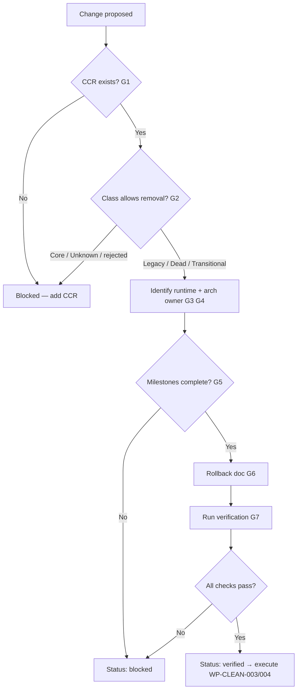

# CLEAN-GATE-001 — Cleanup Decision Gate

| Поле | Значение |
|------|----------|
| Статус | **Accepted** |
| Дата | 2026-07-07 |
| Программа | Personnel Domain Cleanup (WP-CLEAN-001…005) |
| Связанные документы | [WP-CLEAN-001](./WP-CLEAN-001-personnel-domain-assessment.md), [Cleanup Candidates Register §8](./WP-CLEAN-001-personnel-domain-assessment.md#8-cleanup-candidates-register) |
| Применимость | Любой runtime artifact (код, UI, API, schema, config) в домене Personnel и смежных контурах |

---

## 1. Purpose

CLEAN-GATE-001 defines **mandatory decision gates** that must pass before any runtime artifact may be:

- archived (quarantine, move, or mark in-tree for removal), or
- removed (delete source, drop schema, unregister route).

**No artifact may be archived or removed until every applicable gate has passed.**

Documentation-only work (WP-CLEAN-002) does **not** require these gates. Gates apply from **WP-CLEAN-003** onward.

Program invariants from WP-CLEAN-001 R2 remain in force: **Unknown > Dead**, **Transitional > Legacy**, **Register before remove**.

**Work package discipline:** one Cleanup WP = one logically complete candidate group. Do not merge adjacent packages (e.g. 005A + 005B) even when changes appear small — each WP must have its own G1–G7 evidence set and independent rollback (validated in WP-CLEAN-003A…D and WP-CLEAN-005A).

---

## 2. Gate definitions

### G1 — Register entry (CCR)

| Requirement | Evidence |
|-------------|----------|
| Artifact has a stable **Register ID** in Cleanup Candidates Register (§8 of WP-CLEAN-001) | CCR row exists; artifact name matches path/table/route |
| Recommended action and target WP are recorded | Column `Recommended action`, `WP` |

**Fail:** ad-hoc deletion without CCR row → **blocked**.

---

### G2 — Classification confirmed

| Requirement | Evidence |
|-------------|----------|
| Class is exactly one of: **Core**, **Transitional**, **Legacy**, **Dead**, **Unknown** | WP-CLEAN-001 inventory or updated assessment row |
| Class reviewed after last material code change | Date + reviewer in CCR notes or PR |
| **Core** and **rejected** CCR → removal forbidden | CCR status `rejected` |
| **Unknown** → removal forbidden until reclassified | CCR status remains `open` |

**Fail:** Core or Transitional mislabeled as Dead → **blocked** (see WP-CLEAN-001 §13 checklist).

---

### G3 — Runtime ownership identified

| Requirement | Evidence |
|-------------|----------|
| **Runtime owner** named (team role or module owner) | e.g. «HR import pipeline», «Directory CRUD», «Platform auth» |
| Active call sites documented | grep / OpenAPI / nav map / test imports |
| Reachability class recorded | active nav / direct URL / API-only / unused |

**Owner** = module that **writes or serves** the artifact in production, not merely reads it.

---

### G4 — Architecture ownership identified

| Requirement | Evidence |
|-------------|----------|
| **Architecture owner** named | ADR ID, ARCH-001 section, or ACCESS/PD domain |
| Target vs AS-IS documented | WP-CLEAN-001 dependency map or ADR |
| Duplicate / canonical owner identified if applicable | §4 Canonical Ownership (WP-CLEAN-001) |

---

### G5 — Removal prerequisite satisfied

| Requirement | Evidence |
|-------------|----------|
| Every **blocking milestone** for this CCR is **complete** or N/A | Examples below |
| For **Legacy** still in use: explicit **replacement** is live and authoritative | ADR or runbook sign-off |

**Common blocking milestones (personnel domain):**

| Milestone | Unblocks (examples) |
|-----------|---------------------|
| ADR-051 access resolver cutover | CCR-015, retirement of grant-only paths |
| ADR-050 Phase 3 Employment FK retarget | CCR-014 (`positions` catalog) |
| ADR-045 detail URL migration | CCR-010 |
| ADR-048 Person materialization | reduction of NULL `person_id` debt (not direct removal) |
| UI stops legacy API probe | CCR-008 (professional documents demo) |
| 30-day API access log zero | CCR-006 (legacy import routes) |
| DBA / ops audit | CCR-007 (`employees_import*` tables) |
| ADR-043 ops sign-off | CCR-018 (override backfill tool) |

**Fail:** milestone incomplete → CCR status **`blocked`**; gate G5 **not passed**.

---

### G6 — Rollback strategy documented

| Requirement | Evidence |
|-------------|----------|
| Rollback steps defined for removal change | PR description, ops runbook, or CCR appendix |
| Scope of rollback stated | code revert / migration down / route re-register |
| Data rollback addressed if schema dropped | backup restore or forward-fix migration |

**Minimum for Low-risk Dead orphans:** git revert commit SHA + redeploy.

**Minimum for schema/API:** Alembic down migration or restore-from-backup procedure (OPS).

---

### G7 — Verification checklist prepared and executed

| Requirement | Evidence |
|-------------|----------|
| CCR **Verification checklist** column complete | All items checked or N/A with reason |
| Tests identified | unit/integration/smoke listed |
| Post-removal smoke defined | e.g. `/directory/staff`, HR import upload, `/auth/me` |

**Status progression:** `open` → **`verified`** (G7 complete for intended action) → `frozen` → `archived` / `removed`.

WP-CLEAN-001 §13 (Dead classification checklist) is **subset of G7** for Dead class only.

---

## 3. Gate applicability matrix

| Action | G1 | G2 | G3 | G4 | G5 | G6 | G7 |
|--------|:--:|:--:|:--:|:--:|:--:|:--:|:--:|
| Deprecation marker only (WP-CLEAN-002) | ○ | ○ | ○ | ○ | — | — | — |
| Freeze (no new callers) | ● | ● | ● | ● | ○ | ○ | ○ |
| Archive / quarantine | ● | ● | ● | ● | ● | ● | ● |
| Remove source | ● | ● | ● | ● | ● | ● | ● |
| Drop DB schema | ● | ● | ● | ● | ● | ● | ● |

● = required & must pass  
○ = recommended  
— = not required

---

## 4. Decision workflow

---

## 5. Roles and approval

| Step | Approver |
|------|----------|
| CCR create / class change | Architecture reviewer or delegate |
| `verified` for Med-High risk (CCR-006…) | Architecture + ops |
| `removed` / schema drop | Architecture + DBA sign-off |
| ADR-gated milestones (G5) | Per owning ADR ratification |

---

## 6. References

| Document | Role |
|----------|------|
| [WP-CLEAN-001 R2](./WP-CLEAN-001-personnel-domain-assessment.md) | Inventory, CCR, invariants |
| [docs/deprecated/personnel/INDEX.md](../deprecated/personnel/INDEX.md) | Legacy deprecation markers (WP-CLEAN-002) |
| [hr-dual-personnel-registry runbook](../runbooks/hr-dual-personnel-registry.md) | Operational dual-registry guidance |

---

*Gate violations must be escalated before WP-CLEAN-003 execution. Documentation repairs do not bypass G1–G7 for removal.*
