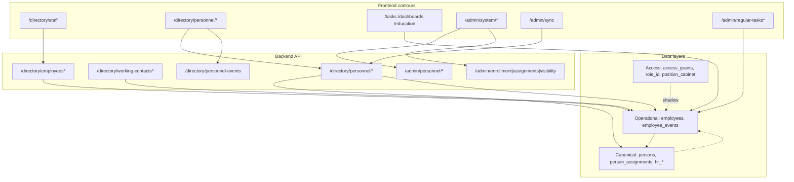
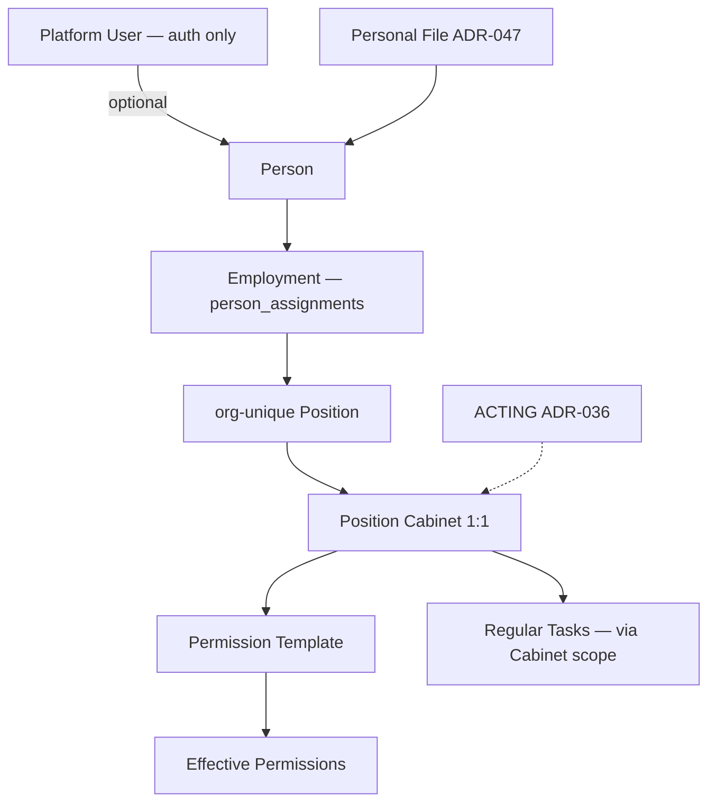
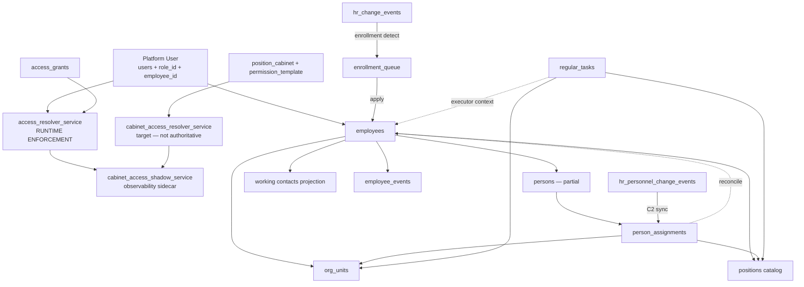

# WP-CLEAN-001 — Personnel Domain Legacy Cleanup Assessment

| Поле | Значение |
|------|----------|
| Статус | **Accepted** (comments resolved) |
| Ревизия | **R2** (2026-07-07) |
| Предыдущая ревизия | R1 — architecture review 2026-07-07 |
| Область | Personnel domain — inventory, dependency map, classification, cleanup register |
| Ограничение этапа | Код, БД, API, UI, архив **не изменяются** |
| Связанные документы | ARCH-001, ADR-031–045, ADR-050/051/053, ACCESS-001, WP-RT-002, [CLEAN-GATE-001](./CLEAN-GATE-001-cleanup-decision-gate.md) |
| Следующие WP | WP-CLEAN-003 Safe Removal, WP-CLEAN-004 Simplification |
| WP-CLEAN-002 | **Complete** (2026-07-07) — governance + deprecation markers |

### R2 — что изменилось относительно R1

| Область | Изменение |
|---------|-----------|
| Completeness | Добавлены Position Cabinet UI, Working Contacts, roles/department-groups, access resolvers (2), Platform Account, Regular Tasks adjacency, permission domain map, `app/api/directory.ts` |
| Classification | Missing runbook → **Gap/Unknown**; `hr_review_override_backfill` → **Transitional**; пересмотрены риски import path |
| Dependency diagrams | AS-IS: enforcement через `access_resolver_service`; shadow — sidecar |
| Invariants | Формализованы правила **Unknown > Dead**, **Transitional > Legacy** |
| Cleanup | Новый § **Cleanup Candidates Register**; WP-CLEAN-002 — только documentation markers, без переноса `.tsx` в `docs/archive/` |
| **WP-CLEAN-003A** | 2026-07-07 | CCR-001 removed; [post-removal report](./WP-CLEAN-003A-post-removal-report.md) |

---

## Cleanup Program Invariants

Инварианты программы WP-CLEAN-002…004. Нарушение любого из них блокирует removal.

| # | Invariant | Правило |
|---|-----------|---------|
| I1 | **Unknown > Dead** | При малейшей неопределённости (imports, ADR dependency, test coupling, ops script) классифицировать **Unknown**, не Dead. Dead — только после явной verification checklist (§13). |
| I2 | **Transitional > Legacy** | Арtefakt, участвующий в migration path (dual registry, shadow resolver, bridges), — **Transitional**, даже если выглядит устаревшим. Legacy — stable alternate path без migration owner. |
| I3 | **Core ≠ removable** | Core и runtime-authoritative Transitional **не** попадают в WP-CLEAN-003 без ADR/amendment. |
| I4 | **Documentation-only first** | WP-CLEAN-002 — markers, register updates, missing docs; **не** file deletion. |
| I5 | **No UI in docs archive** | Исходники UI/API не переносятся в `docs/archive/`. Quarantine: git tag, `_deprecated/` in-tree comment, или register entry. |
| I6 | **Register before remove** | Любой removal требует строки в **Cleanup Candidates Register** (§8) со статусом `verified`. |

---

## Executive Summary

Подсистема Personnel — **крупнейший и наиболее фрагментированный домен** Corpsite. Coexistence четырёх контуров:

1. **Target (ARCH-001):** Platform User → Person → Employment → org-unique Position → Position Cabinet → Permission Template.
2. **Operational v1 (~33 pilot):** `employees`, CRUD, «Персонал», user linkage.
3. **HR canonical (~3000+):** ADR-038 import, ADR-043 lifecycle, ADR-041 dual registry, sync.
4. **Transitional bridges:** enrollment, reconciliation, ADR-044 identity, ADR-051 shadow resolver.

**Вывод R2:** домен **не готов к удалению legacy-кода**. Подтверждённые Dead-артефакты — **узкий список** (2 UI orphans + 1 misplaced TS). Всё остальное — Core, Transitional, Legacy (still active), или Unknown/Gap.

**Статистика (R2, conservative):**

| Слой | Approx. | Core | Transitional | Legacy | Dead | Unknown/Gap |
|------|:-------:|:----:|:------------:|:------:|:----:|:-----------:|
| Frontend routes/pages | 40+ | 24 | 9 | 5 | 2 | 1 |
| Frontend components/lib | 150+ | 115 | 28 | 8 | 2 | 2+ |
| Backend routers | 14 | 11 | 1 | 1 | 0 | 1 |
| Backend services | 58+ | 34 | 20 | 4 | 0 | 2 |
| DB tables (personnel-related) | 45+ | 24 | 14 | 6 | 0 | 1 |
| Docs / governance | 90+ | 60 | 20 | 5 | 0 | 1 gap |

**Рекомендация:** WP-CLEAN-002 — **documentation + deprecation markers only**. WP-CLEAN-003 — только register entries со статусом `verified`. WP-CLEAN-004 — после ADR-050 Phase 3 и ADR-051 cutover.

---

## 1. Current Personnel Domain Map

### 1.1. Контуры (runtime)

### 1.2. Навигация (sidebar)

Источник: `corpsite-ui/components/AppShell.tsx`, `lib/personnelNav.ts`, `lib/positionCabinetNav.ts`.

| Nav item | Route | Guard | Class |
|----------|-------|-------|-------|
| **Персонал** | `/directory/staff` | E1 visibility / admin / HR | **Core** |
| **Кадровые процессы** | `/directory/personnel/journal` | `has_personnel_admin` / sysadmin | **Core** |
| **Контакты** | `/directory/contacts` | visibility / admin | **Core** (ADR-031) |
| **Роли доступа** | `/directory/roles` | admin | **Transitional** (access_grants UI) |
| **Задачи** | `/tasks` | authenticated + scope | **Core** (Position Cabinet contour) |
| **Шаблоны регулярных задач** | `/admin/regular-tasks` | admin | **Core** (adjacent) |
| **Кабинет системного администратора** | `/admin/system` | sysadmin | **Core** |
| **Жизненный цикл персонала** | `/admin/system/personnel-lifecycle` | sysadmin / HR enrollment | **Core** |
| **Операции привязки пользователей** | `/admin/system/personnel-identity/operations` | sysadmin / HR enrollment | **Transitional** (ADR-044) |
| **Синхронизация данных** | `/admin/sync` | admin | **Core** |
| **Должности** | `/directory/positions` | admin | **Legacy** (global catalog) |
| **Типы деятельности** | `/directory/department-groups` | admin | **Core** (org scope) |
| **Отделения** | `/directory/org-units` | admin | **Core** |

**Secondary / direct URL (не primary nav):**

| Route | Class | Reachability |
|-------|-------|--------------|
| `/directory/working-contacts` | **Core** | Direct URL; embedded in `/directory/contacts` API calls |
| `/directory` home | **Legacy** | Direct URL; duplicate employee list |
| `/directory/employees` | **Legacy** | Redirect → staff |
| `/directory/employees/[id]` | **Transitional** | In-app links from staff table |

**Shell components:** `OrgUnitsSidebarPanel` (**Core**, E1 visibility), `PositionCabinetNav` + `PositionCabinetSectionShell` (**Core**).

### 1.3. Admin system tabs (`/admin/system`)

| Tab | Backend prefix | Class |
|-----|----------------|-------|
| Enrollment | `/admin/enrollment/*` | **Transitional** |
| Assignments drift/reconcile | `/admin/assignments/*` | **Transitional** |
| Personnel visibility | `/admin/personnel/visibility/*` | **Core** |
| User linkage review | `/admin/personnel/identity/user-linkage/review/*` | **Transitional** |
| Users | `/admin/users/*` | **Core** |

Standalone pages (duplicate entry, same APIs): `personnel-lifecycle`, `personnel-identity/operations`.

---

## 2. Dependency Mapping

### 2.1. Intended architecture (ARCH-001 target)

> **Note:** Regular Tasks **today** bind to org/catalog (`owner_unit_id`, catalog `position_id`); cabinet-scoped binding — target only (WP-RT-002 adjacent).

### 2.2. Actual implementation (AS-IS) — R2 corrected

**R2 fix:** R1 incorrectly implied `access_grants → cabinet_access_resolver` as enforcement path. **Authoritative permission path:** `access_resolver_service` (+ `role_id`, grants). Shadow runs **inside** resolver when enabled (ADR-051 prep).

### 2.3. Hidden dependencies (R2)

| From | To | Effect |
|------|-----|--------|
| Employee transfer/terminate | Working contacts list | Projection updates (tests: `test_working_contacts_*`) |
| `/directory/contacts` | contacts + positions + working-contacts APIs | Aggregated read contour |
| User create (`EmployeeAccountSections`) | `employees` + `users` + org scope | Platform account linkage |
| Import enroll (Phase 3I) | `employees` without `person_id` | ADR-048 debt |
| `access_resolver_service` | `maybe_run_cabinet_access_shadow` | Log parity evidence |
| `hr_change_events` | `enrollment_detector_service` | Queue candidates |
| Regular tasks catch-up | org scope filters | Same org_units as personnel visibility |

---

## 3. Inventory

### 3.1. Frontend routes (extended R2)

| Route | Class | Reachability |
|-------|-------|--------------|
| `/directory/staff` | **Core** | Primary nav |
| `/directory/employees`, `/directory/employees/[id]` | **Legacy** / **Transitional** | Redirect / active detail links |
| `/directory/personnel/journal` | **Core** | Personnel Journal — `employee_events` via `/directory/personnel-events` |
| `/directory/personnel/hr-change-events` | **Core** | HR Change Events — `hr_change_events` |
| `/directory/personnel/documents` | **Core** | ADR-037; probes legacy demo availability |
| `/directory/personnel/import/*` | **Core** | HR import pipeline |
| `/directory/contacts` | **Core** | ADR-031 |
| `/directory/working-contacts` | **Core** | Direct URL + contacts integration |
| `/directory/roles` | **Transitional** | Access roles admin |
| `/directory/department-groups` | **Core** | Activity types / org scope |
| `/directory/positions` | **Legacy** | Global catalog |
| `/directory/org-units`, `/directory/org` | **Core** | Org tree |
| `/tasks`, `/dashboards`, `/education` | **Core** | Position Cabinet nav (`positionCabinetNav.ts`) |
| `/admin/regular-tasks`, `/admin/regular-tasks/catch-up` | **Core** | Adjacent; org-scoped |
| `/admin/system`, lifecycle, identity ops | **Core** / **Transitional** | Admin |
| `/admin/sync` | **Core** | HR sync |
| `/profile` | **Core** | Employee position display |
| `/directory` home | **Legacy** | Direct URL only |

### 3.2. Frontend orphans & misnamed (R2)

| Artifact | Class | Verification |
|----------|-------|--------------|
| `DirectorySidebar.tsx` | **Dead** | Zero component imports (name collision with `isDirectorySidebarNavItemActive` in `personnelNav.ts` only) |
| `directory/_lib/api.client.ts` | **Dead** | Zero importers |
| ~~`app/api/directory.ts`~~ | **Removed** (WP-CLEAN-003D) | Was Dead — misplaced TypeScript in Python `app/api/` tree; zero importers |
| `demoApi.client.ts` | **Transitional** | Active journal client — rename candidate only |
| `ProfessionalDocumentsPageClient` | **Transitional** | Core route + legacy availability probe |

### 3.3. Backend routers (extended R2)

| Router | File | Class |
|--------|------|-------|
| Employees | `employees_routes.py` | **Core** |
| Working contacts | `working_contacts_routes.py` | **Core** |
| Contacts | `contacts_routes.py` | **Core** |
| HR import / sync | `hr_import_routes.py`, `hr_sync_routes.py` | **Core** |
| Employee documents | `employee_documents_routes.py` | **Core** |
| Personnel events + demo docs | `personnel_demo_routes.py` | **Mixed** |
| Legacy bulk import | `import_routes.py` | **Legacy** |
| Personnel admin | `personnel_admin_router.py` | **Core** |
| Admin / Auth | `admin_router.py`, `auth.py` | **Core** |
| Telegram bind | `tg_bind.py` | **Core** (Platform Account) |

### 3.4. Access resolvers (R2 — split)

| Service | Role today | Class |
|---------|------------|-------|
| `access_resolver_service.py` | **Runtime enforcement** — `role_id` + `access_grants` + assignment subjects; invokes shadow | **Transitional** (authoritative until cutover) |
| `cabinet_access_resolver_service.py` | Target resolver — Employment → Cabinet → Template | **Transitional** (not enforcement) |
| `cabinet_access_shadow_service.py` | Compare legacy vs cabinet; log mismatches | **Transitional** |
| `access_grant_service.py` | Grant CRUD | **Transitional** |
| `platform_roles_catalog.py` | Role reference | **Core** |

### 3.5. Regular Tasks ↔ Personnel (adjacency)

| Link | Mechanism | Class |
|------|-----------|-------|
| Template ownership | `regular_tasks.owner_unit_id` → `org_units` | **Core** (org structure shared) |
| Executor | `executor_role_id` — role catalog, not Employee FK | **Core** |
| Catch-up filters | org scope, schedule_type — same admin shell | **Core** (adjacent) |
| Position Cabinet | **Not wired** — tasks use catalog position/org, not `position_cabinet_id` | **Gap** (ARCH-001 task assessment) |

Ref: WP-RT-002, `ARCH-001-task-subsystem-assessment.md`.

### 3.6. Platform Account (R2)

| Artifact | Class |
|----------|-------|
| `users`, `auth.py` (`/login`, `/me`) | **Core** |
| `users.employee_id` | **Transitional** (ADR-044 linkage) |
| `users.role_id` | **Transitional authoritative** — legacy mechanism, still primary for MVP matrix |
| `tg_bind.py` | **Core** |
| `user_linkage_*` services (5) | **Transitional** |
| User create UI (`EmployeeAccountSections`, `UserCreateDrawer`) | **Core** |

OPS-028/029: Platform Role ≠ кадровая должность.

### 3.7. Permission domains → runtime (R2)

Governance: ACCESS-001 §5, PERMISSION-DOMAIN-REGISTRY PD-5.x.

| Domain | Governance | Runtime guard / code | Class |
|--------|--------------|----------------------|-------|
| PD-5.1 Executive HR decision | ACCESS-001 | Partially — override workflow ADR-043 | **Transitional** |
| PD-5.2 HR processing (оформление) | ACCESS-001 | `HR_ENROLLMENT_MANAGER`, import routes | **Core** |
| PD-5.3 HR control / audit | ACCESS-001 | Lifecycle admin, audit logs | **Core** |
| PD-5.4 Boundary | ACCESS-001 | `personnel_admin_guard`, guard split ADR-045 | **Core** |
| E1 visibility read | ADR-042 E1 | `personnel_visibility_*`, `/auth/me` | **Core** |
| Sysadmin cabinet | ADR-042 | `SYSADMIN_CABINET`, `/admin/*` | **Core** |
| Cabinet permissions (target) | ADR-051 | Shadow only | **Transitional** |

### 3.8. Database, services, docs

Tables and service groups — as R1 §3.2–3.3 with R2 additions:

- **Working contacts:** derived read model from users + employees (no separate table in inventory; routes project joined data).
- **`hr_review_override_backfill_service.py`:** **Transitional** — ADR-043 B3; tested; no HTTP route; ops/migration tool.
- **`operational_contact_service.py`:** **Transitional** — enrollment side effect.

**Documentation gap:** ~~`docs/runbooks/hr-dual-personnel-registry.md` missing~~ **Restored** WP-CLEAN-002 (CCR-004). See [runbook](../runbooks/hr-dual-personnel-registry.md).

---

## 4. Canonical Ownership (R2)

| Concept | Owner (authoritative today) | Consumers | After migration |
|---------|----------------------------|-----------|-----------------|
| **Employee** | `employees` + `directory_service` | Staff UI, tasks, profile, documents FK | **Remains** operational shell |
| **Person** | `persons` (when linked) | Lifecycle, import, reconciliation | **Becomes** universal identity anchor |
| **Employment** | `person_assignments` (canonical, incomplete) | C2 sync, enrollment, future cabinet | **Sole** employment truth |
| **Position (catalog)** | `positions` | employees, RT, import | **Retire** after ADR-050 Ph.3 |
| **Position (org-unique)** | `org_unique_position` | Cabinet backfill | **Replaces** catalog semantics |
| **Position Cabinet** | `position_cabinet` (schema) | Shadow resolver | **Becomes** operational workspace owner |
| **Platform Account** | `users` + auth | All routes | **Permanent** auth-only |
| **Staff** | UI contour `/directory/staff` | Nav | **Remains** label, not entity |
| **Personnel Event (ops)** | `employee_events` | Journal, drawer | Maybe merge (ADR TBD) |
| **HR Change Event** | `hr_change_events` | HR change UI, enrollment detect | Maybe merge |
| **Personnel Change Event** | `hr_personnel_change_events` | Lifecycle admin | **Long-term Core** |
| **Working Contact** | `working_contacts_routes` projection | Contacts UI | **Unknown** — ADR-031 evolution |
| **Effective permissions** | `access_resolver_service` | All guards | **Retire** at ADR-051 cutover |
| **Target permissions** | `cabinet_access_resolver_service` | Shadow | **Becomes** owner |

---

## 5. Duplicate Analysis

(Sections 5.1–5.7 from R1 retained; R2 additions below.)

### 5.8. Terminology: Position Assignment

ARCH-001 reserves **Employment** (`person_assignments`) and avoids «position assignment» for tasks. Task routing uses **executor role** + org scope — separate from Employment.

### 5.9. Access: two resolvers

| | Legacy path | Target path |
|---|-------------|-------------|
| Service | `access_resolver_service` | `cabinet_access_resolver_service` |
| Inputs | `role_id`, grants, catalog position ids | Employment → Cabinet → Template |
| Enforced | **Yes** | **No** (shadow) |

---

## 6. Transitional State Register (R2 — high-risk modules)

Modules that are **neither Legacy nor Core** — highest cleanup danger if misclassified.

| Module | Why transitional | Misclassification risk |
|--------|------------------|------------------------|
| `access_resolver_service.py` | Live enforcement + shadow hook | Mistaken for Legacy |
| `access_grants` + `role_id` | Authoritative until ADR-051 | Mistaken for removable Legacy |
| `persons` / `person_assignments` | Canonical path incomplete | Mistaken for optional |
| `employee_assignment_links` | Dual-registry bridge | Hidden dependency |
| `identity_reconciliation_*`, `user_linkage_*` | Active admin mutations | High |
| `admin_guard.py` dual mode | legacy vs grants | Security |
| `enrollment_queue` + detector | HR → ops bridge | Workflow break |
| `ProfessionalDocumentsPageClient` + demo API | Core UI + Legacy backend | Partial removal breaks page |
| `/directory/employees/[id]` | Active on transitional URL | Bookmark / links |
| `employees` with NULL `person_id` | Data state, not Legacy | ADR-048 |
| `contacts` vs `employees` (ADR-031) | Parallel contours | Scope confusion |
| `hr_review_override_backfill_service` | Migration tool, tested | Mistaken for Dead |

---

## 7. Runtime Validation

| Artifact | Reachability | Class confirmation |
|----------|--------------|-------------------|
| Personnel Journal | **Active** — HR sub-nav | **Core** |
| HR Change Events | **Active** — HR sub-nav | **Core** |
| Working Contacts | **Active** — direct URL + contacts | **Core** |
| Position Cabinet routes | **Active** — primary nav `/tasks` | **Core** |
| `DirectorySidebar.tsx` | **Removed** (WP-CLEAN-003A) | — |
| `directory/_lib/api.client.ts` | **Removed** (WP-CLEAN-003B) | — |
| ~~`app/api/directory.ts`~~ | **Removed** (WP-CLEAN-003D) | — |
| `import_routes.py` | **API registered**, no UI, no tests | **Legacy**, risk elevated |
| `employees_import*` | Legacy service only | **Legacy**, audit required |
| `professional_documents*` | UI probe + tests | **Legacy**, not Dead |
| `hr_review_override_backfill` | Tests + ADR-043; no HTTP | **Transitional** ✓ |
| Missing runbook | ~~ADR links 404~~ restored | **Gap closed** (CCR-004 verified) |

---

## 8. Cleanup Candidates Register

**Authoritative register** for WP-CLEAN-003…004. Decision gates: [CLEAN-GATE-001](./CLEAN-GATE-001-cleanup-decision-gate.md). Deprecation markers: [docs/deprecated/personnel/INDEX.md](../deprecated/personnel/INDEX.md).

**Status values:** `open` → `verified` → `frozen` → `archived` → `removed` | `blocked` | `rejected`

**Last synchronized:** WP-CLEAN-002 (2026-07-07). Status changes only with evidence below.

| ID | Artifact | Class | Risk | Status | Blocking milestone | Target WP | Deprecation doc | Verification |
|----|----------|-------|------|--------|-------------------|-----------|-----------------|--------------|
| CCR-001 | ~~`DirectorySidebar.tsx`~~ | Dead | Low | **removed** | — | 003A | [CCR-001](../deprecated/personnel/CCR-001-directory-sidebar.md) | ✓ G7 complete (2026-07-07); rollback `0c678749` |
| CCR-002 | ~~`directory/_lib/api.client.ts`~~ | Dead | Low | **removed** | — | 003B | [CCR-002](../deprecated/personnel/CCR-002-directory-api-client.md) | ✓ G7 complete (2026-07-07); rollback `0c678749` |
| CCR-003 | ~~`app/api/directory.ts`~~ | Dead | Low | **removed** | — | 003D | [CCR-003](../deprecated/personnel/CCR-003-app-api-directory-ts.md) | ✓ G7 complete (2026-07-07); rollback `d1c31cd` |
| CCR-004 | Runbook `hr-dual-personnel-registry.md` | Gap | Medium | **verified** | — | — | [runbook](../runbooks/hr-dual-personnel-registry.md) | ✓ file restored ✓ ADR-040/041 links |
| CCR-005 | `/directory` home page | Legacy | Medium | open | traffic check | 004 | [CCR-005](../deprecated/personnel/CCR-005-directory-home.md) | ☐ traffic |
| CCR-006 | `import_routes.py` + CSV/XLSX | Legacy | Med-High | open | 30d access log zero | 003 | [CCR-006](../deprecated/personnel/CCR-006-legacy-bulk-import.md) | ☐ OpenAPI audit ☐ access log |
| CCR-007 | `employees_import*` tables | Legacy | Medium | open | CCR-006 + DBA audit | 003 | [CCR-007](../deprecated/personnel/CCR-007-employees-import-tables.md) | ☐ rows ☐ ETL |
| CCR-008 | `professional_documents*` demo | Legacy | Medium | open | UI probe removed | 003 | [CCR-008](../deprecated/personnel/CCR-008-professional-documents-demo.md) | ☐ UI ☐ tests |
| CCR-009 | `/directory/employees` redirect | Legacy | Low | blocked | bookmark policy | — | [CCR-009](../deprecated/personnel/CCR-009-employees-redirect.md) | ADR-045 |
| CCR-010 | `/directory/employees/[id]` | Transitional | High | blocked | ADR-045 URL migration | 004 | — | ADR-045 |
| CCR-011 | `employees` + CRUD | Core | Critical | rejected | ARCH-001 | — | — | permanent |
| CCR-012 | `employee_events` / Journal | Core | High | rejected | — | — | — | permanent |
| CCR-013 | `persons` / `person_assignments` | Transitional | High | rejected | dual registry | — | — | permanent |
| CCR-014 | `positions` catalog | Legacy | Critical | blocked | ADR-050 Phase 3 | 004 | [CCR-014](../deprecated/personnel/CCR-014-positions-catalog.md) | ARCH-001 Ph.3 |
| CCR-015 | `access_grants` + `role_id` | Transitional | Critical | blocked | ADR-051 cutover | 004 | — | shadow parity |
| CCR-016 | `cabinet_access_shadow_service` | Transitional | Medium | blocked | ADR-051 cutover | 004 | — | OPS-030 |
| CCR-017 | `demoApi.client.ts` rename | Transitional | Low | open | — | 004 | — | ☐ rename PR |
| CCR-018 | `hr_review_override_backfill` | Transitional | Low | blocked | ADR-043 ops sign-off | — | — | ✓ ADR-043 B3 |
| CCR-019 | `access_resolver_service` | Transitional | Critical | rejected | ADR-051 | — | — | enforcement |
| CCR-020 | `user_linkage_*` suite | Transitional | High | rejected | ADR-044 | — | — | permanent |

**WP-CLEAN-002 evidence:** CCR-004 runbook created; Legacy markers; CLEAN-GATE-001 published.

**WP-CLEAN-003A evidence (2026-07-07):** CCR-001 file deleted; build pass; G7 post-removal documented in [WP-CLEAN-003A report](./WP-CLEAN-003A-post-removal-report.md).

**WP-CLEAN-003B evidence (2026-07-07):** CCR-002 file deleted; build/test pass; lint baseline unchanged; G7 post-removal documented in [WP-CLEAN-003B report](./WP-CLEAN-003B-post-removal-report.md).

**WP-CLEAN-003C evidence (2026-07-07):** CCR-003 architecture audit — class Dead; see [WP-CLEAN-003C audit](./WP-CLEAN-003C-CCR003-audit.md).

**WP-CLEAN-003D evidence (2026-07-07):** CCR-003 file deleted; build/test pass; lint baseline unchanged; G7 post-removal documented in [WP-CLEAN-003D report](./WP-CLEAN-003D-post-removal-report.md).

---

## 9. Legacy Inventory (consolidated)

| # | Artifact | Layer | Class | Still needed? |
|---|----------|-------|-------|---------------|
| L1 | Legacy import path | Backend/DB | Legacy | API reachable — audit first |
| L2 | `professional_documents` demo | Backend/DB | Legacy | UI probe active |
| L3 | `departments` | DB | Legacy | Legacy import writes |
| L4 | `positions` catalog | DB | Legacy | **Yes — critical** |
| L5 | `/directory/employees` redirect | Frontend | Legacy | Bookmarks |
| L6 | `/directory` home | Frontend | Legacy | Direct URL |
| L7 | `users.role_id` | Auth | Transitional auth | **Yes** |
| L8 | `legacy_position_mapping` | DB | Legacy bridge | Until catalog retired |
| L9 | Orphans CCR-001…003 | Frontend/API | Dead | **All removed** (WP-CLEAN-003A/B/D) |

---

## 10. Risk Assessment

### 10.1. Cleanup risks (R2)

| Risk | L | I | Mitigation |
|------|:-:|:-:|------------|
| Classify transitional enforcement as Legacy | M | Critical | §6 Transitional Register; I2 |
| Delete import path used by scripts | M | High | CCR-006 access log |
| Remove demo docs before UI probe removed | L | Med | CCR-008 ordering |
| Treat missing runbook as deletable | L | Med | CCR-004 recreate |
| Move `.tsx` to docs archive | — | Process | I5 — forbidden |

### 10.2. Domain health (unchanged)

Dual registry drift, NULL `person_id`, three event streams, ACCESS-001 gate — active.

---

## 11. Recommended Cleanup Roadmap

### WP-CLEAN-001 R2 — complete

- [x] Architecture review comments incorporated
- [x] Cleanup Candidates Register (§8)
- [x] Program invariants (Unknown > Dead)
- [x] Extended inventory

### WP-CLEAN-002 — Legacy Deprecation Marking (**complete**, 2026-07-07)

- [x] [CLEAN-GATE-001](./CLEAN-GATE-001-cleanup-decision-gate.md) — decision gates G1–G7
- [x] Runbook restored: [hr-dual-personnel-registry.md](../runbooks/hr-dual-personnel-registry.md) (CCR-004)
- [x] Deprecation markers: [docs/deprecated/personnel/](../deprecated/personnel/INDEX.md)
- [x] CCR register synchronized (§8)
- [x] No runtime / source / archive changes

### WP-CLEAN-003A — CCR-001 removal (**complete**, 2026-07-07)

- [x] Removed `DirectorySidebar.tsx` only
- [x] Build / test / lint executed (see [report](./WP-CLEAN-003A-post-removal-report.md))
- [x] CCR-001 → **removed**; G7 post-removal complete

### WP-CLEAN-003B — CCR-002 removal (**complete**, 2026-07-07)

- [x] Removed `directory/_lib/api.client.ts` only
- [x] Preserved `dictionaries.config.ts` and `employees/_lib/api.client.ts`
- [x] Build / test / lint executed (see [report](./WP-CLEAN-003B-post-removal-report.md))
- [x] CCR-002 → **removed**; G7 post-removal complete

### WP-CLEAN-003C — CCR-003 audit (**complete**, 2026-07-07)

- [x] Architecture audit of `app/api/directory.ts` (see [report](./WP-CLEAN-003C-CCR003-audit.md))
- [x] CCR-003 reclassified Unknown → **Dead**

### WP-CLEAN-003D — CCR-003 removal (**complete**, 2026-07-07)

- [x] Removed `app/api/directory.ts` only
- [x] Preserved `employees/_lib/api.client.ts`, FastAPI routers, HTTP `/api/directory/` proxy docs
- [x] Build / test / lint executed (see [report](./WP-CLEAN-003D-post-removal-report.md))
- [x] CCR-003 → **removed**; G7 post-removal complete

### WP-CLEAN-004 — Simplification

Blocked on ADR-048, ADR-050 Ph.3, ADR-051, ADR-045 detail URL, event stream ADR.

---

## 12. Out of Scope

(Unchanged from R1 — employees removal, ADR-050/051 implementation, RT temporal model, ARCH-001 baseline changes, DB migrations in this WP.)

---

## 13. Dead Classification Verification Checklist

Required **before** assigning class **Dead** (I1):

| Check | Must be false for Dead |
|-------|------------------------|
| Runtime import / include | Any importer |
| Router registration | Registered route |
| Sidebar / nav href | Linked in AppShell |
| Test dependency | Test imports module |
| ADR / architecture reference | Normative link |
| OpenAPI exposure | Listed endpoint |
| Ops script / cron | External caller |
| Register entry | CCR status ≥ `verified` |

If any check is uncertain → **Unknown**. If migration path active → **Transitional**.

---

## 14. Appendix — Key file index (R2)

### Added in R2

| Path | Note |
|------|------|
| `app/directory/working_contacts_routes.py` | Working contacts |
| `app/services/access_resolver_service.py` | Runtime enforcement |
| `app/services/cabinet_access_resolver_service.py` | Target resolver |
| `app/services/cabinet_access_shadow_service.py` | Shadow |
| `app/services/hr_review_override_backfill_service.py` | Transitional migration |
| `app/services/operational_contact_service.py` | Enrollment |
| `app/tg_bind.py` | Platform account |
| ~~`app/api/directory.ts`~~ | **Removed** (WP-CLEAN-003D) |
| `corpsite-ui/lib/positionCabinetNav.ts` | Cabinet nav |
| `corpsite-ui/components/OrgUnitsSidebarPanel.tsx` | Visibility sidebar |
| `corpsite-ui/app/directory/working-contacts/` | Working contacts UI |

### Architecture cross-links

| Doc | Topic |
|-----|-------|
| WP-RT-002 | Regular tasks temporal (adjacent) |
| ARCH-001-task-subsystem-assessment | Tasks ↔ cabinet gap |
| ADR-045 | Staff vs HR processes |
| ADR-051 | Access resolver cutover |

---

### Governance (WP-CLEAN-002)

| Document | Purpose |
|----------|---------|
| [CLEAN-GATE-001](./CLEAN-GATE-001-cleanup-decision-gate.md) | Removal/archive decision gates |
| [deprecated/personnel/INDEX.md](../deprecated/personnel/INDEX.md) | Legacy deprecation markers |
| [runbooks/hr-dual-personnel-registry.md](../runbooks/hr-dual-personnel-registry.md) | Dual registry operator guide |

---

*Конец документа R2 (+ WP-CLEAN-002 sync). Код/схема/runtime не изменялись. WP-CLEAN-003 requires CLEAN-GATE-001 per CCR.*
