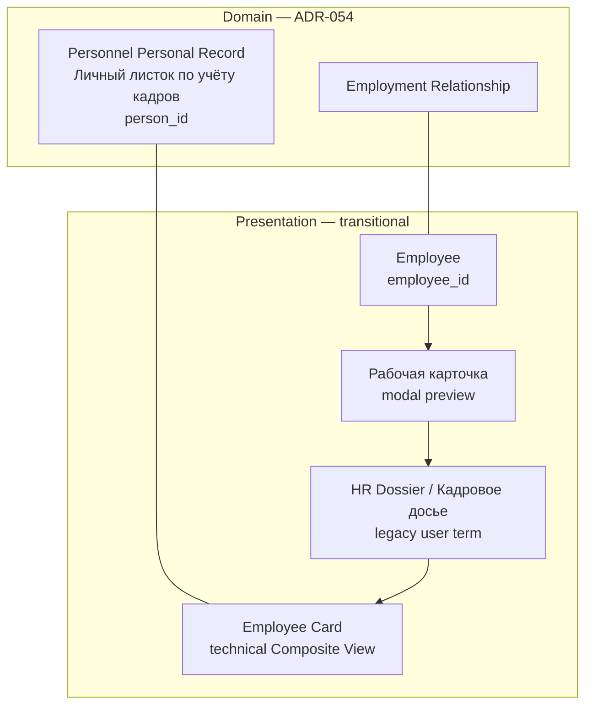
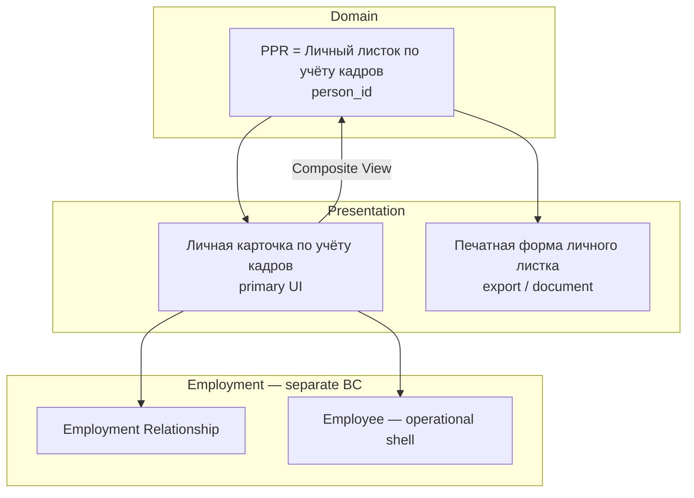
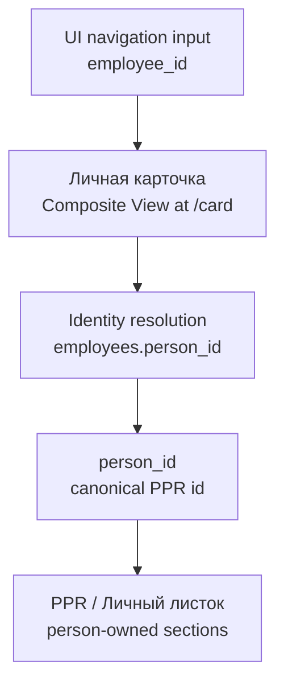
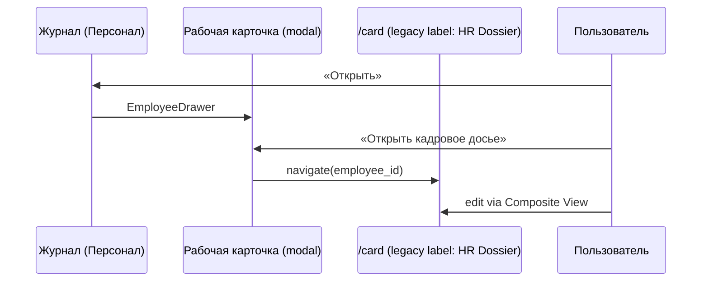
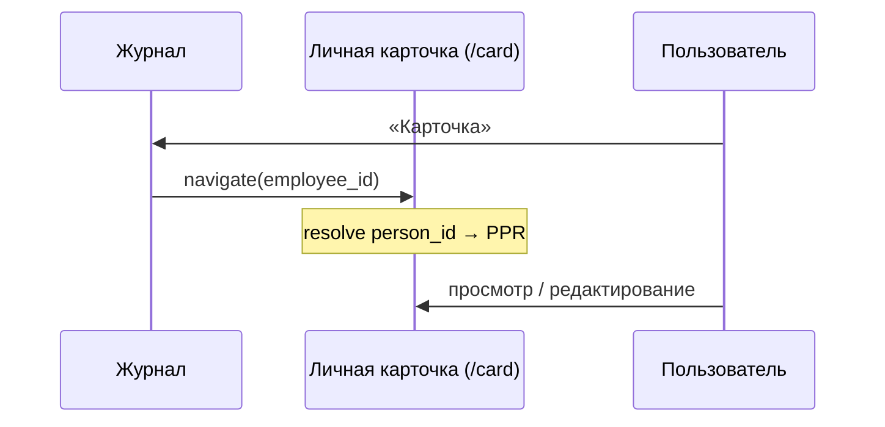
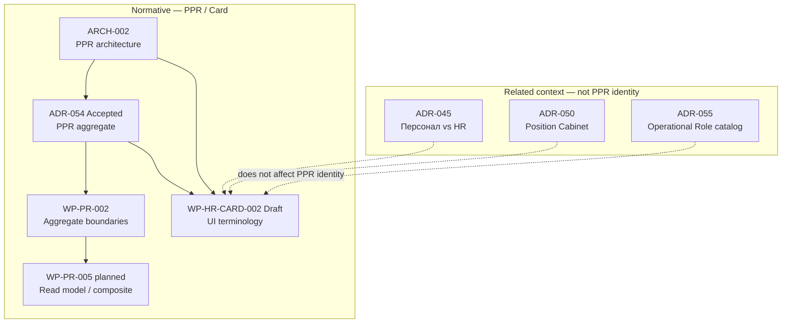

--------------------------------------------------

Document Status

Document:
WP-HR-CARD-002

Title:
Unified Personnel Record Card — User-Facing Consolidation

Type:
Architecture Work Package

Status:
Draft

Revision:
3

Date:
2026-07-15

Parent program:
WP-HR-CARD (Employee Card UX unification)

Depends on:
ARCH-002, ADR-054 (Accepted — normative priority), ADR-045, ADR-050

Related (context only):
ADR-055

Purpose:
Align user-facing terminology and navigation with the accepted PPR model (ADR-054).
Does not introduce new domain decisions or amend ADR-054.

Normative priority:
[ADR-054](../adr/ADR-054-personnel-personal-record-aggregate-model.md) (Accepted) takes precedence over this Draft document.
On any conflict, ADR-054 and ARCH-002 normative sections govern.

--------------------------------------------------

# WP-HR-CARD-002 — Unified Personnel Record Card

## Decision Summary

| Topic | Decision |
|-------|----------|
| **Domain object (unchanged)** | **Personnel Personal Record (PPR)** = **Личный листок по учёту кадров** — самостоятельный предметный объект кадрового контура ([ADR-054](../adr/ADR-054-personnel-personal-record-aggregate-model.md) §Business Object vs Persistence Model). |
| **Stable PPR identifier** | **`person_id`** — устойчивый идентификатор PPR (ADR-054 Phase 1 Person-root). **`employee_id` не является идентификатором PPR.** |
| **Primary UI representation** | **Личная карточка по учёту кадров** — основное пользовательское представление PPR (Composite View; не master-storage). |
| **Printed representation** | **Печатная форма личного листка** — производное document/export представление PPR; не domain object и не UI shell. |
| **HR Dossier** | **Legacy пользовательский термин** и существующая transitional implementation (projection, services, route `/card`). Данный WP **не предусматривает** удаление сервисов, API или маршрутов — только замену user-facing terminology. |
| **Employee Card** | **Technical/architecture term** (ARCH-002): Composite View implementation; converges under user label «Личная карточка». |
| **Рабочая карточка (modal)** | Transitional preview UI; постепенно исключается из HR-сценариев. |
| **Navigation rule (EMP-NAV-001)** | Элемент с известным `employee_id` → Личная карточка одним действием (transitional nav key); при невозможности — явная причина. |
| **Stage 1** | Реализовано (implementation evidence §6.1): журнал «Персонал» — кнопка «Карточка». |

**Scope of this document:** presentation layer and terminology only. **No amendment to ADR-054 or new domain aggregates.**

---

## Architectural Principle (PPR-REP-001)

The project **intentionally distinguishes**:

1. the **domain object** — Personnel Personal Record (Личный листок по учёту кадров);
2. its **primary interactive presentation** — Личная карточка по учёту кадров;
3. its **derived documentary representations** — printed forms, exports, snapshots (e.g. печатная форма личного листка, control output).

These are **different representations of the same кадровый объект** (one PPR, one `person_id` in Phase 1) and **must not be modelled as independent aggregates**.

| Representation | Layer | Aggregate? |
|----------------|-------|------------|
| Personnel Personal Record | Domain | **Yes** — the single PPR aggregate ([ADR-054](../adr/ADR-054-personnel-personal-record-aggregate-model.md)) |
| Личная карточка | UI / Composite View | **No** — projection and interaction shell (INV-5) |
| Печатная форма / export / snapshot | Document | **No** — derived read-only or export artifact |

**Corollaries:**

- Renaming UI labels or adding navigation **does not** create a second domain object.
- A printed form or monthly snapshot **derives from** PPR; it **does not own** master data.
- Legacy terms (HR Dossier, Employee Card) name **representations or modes**, not separate aggregates.
- Employment Relationship and Employee remain **adjacent bounded contexts**, not substitutes for PPR.

*PPR-REP-001 aligns with ADR-054 and ARCH-002; it codifies presentation-layer discipline for WP-HR-CARD and downstream UI work.*

---

## 1. Проблема текущей модели

### 1.1. Transitional presentation stack (as-is)

Пользователь видит цепочку UI-объектов, которые **маскируют** уже принятую domain-модель (PPR = Личный листок):



**As-is (упрощённо — пользовательский путь, не domain hierarchy):**

```text
Employee (employee_id)
  ↓
Рабочая карточка (modal)
  ↓
Кадровое досье / HR Dossier (legacy label)
  ↓
Employee Card (technical) → projects PPR + Employment
```

Domain-центр (**Личный листок / PPR**) в UI часто **не назван явно**; пользователь проходит лишние шаги.

### 1.2. Симптомы

| Симптом | Проявление | Причина |
|---------|------------|---------|
| **Дублирование presentation labels** | «Открыть», «Кадровое досье», «Карточка», «Сотрудник» | Несколько user-facing имён одного Composite View |
| **Лишний шаг навигации** | Журнал → modal → ссылка на `/card` | HR-сценарии через `EmployeeDrawer` вместо прямого входа |
| **Смешение domain и UI** | «Личный листок» иногда трактуется как бумажная форма | Нарушение ADR-054: PPR = Личный листок = domain object |
| **Путаница идентификаторов** | `employee_id` в URL воспринимается как ID листка | Transitional navigation; canonical ID — `person_id` (ADR-054) |
| **Когнитивная нагрузка** | Непонятно, «где настоящая карточка» | INV-5: UI не storage, но термины не разведены |

### 1.3. Триггер из Position Cabinet

При обнаружении ошибки в журнале «Персонал» пользователь проходит ≥3 действия до редактирования PPR-сведений. Целевой путь — **один клик в Личную карточку** (представление PPR).

---

## 2. Целевая модель

### 2.1. Три слоя представления (PPR-REP-001, ADR-054)

| Слой | Англ. | Русское название | Роль |
|------|-------|------------------|------|
| **Domain object** | Personnel Personal Record (PPR) | **Личный листок по учёту кадров** | Самостоятельный предметный объект; person-owned sections; **`person_id`** — устойчивый ID (ADR-054). |
| **UI representation** | Employee Card (technical) → user label | **Личная карточка по учёту кадров** | Основное интерактивное представление PPR + employment/operational projections; **не** source of truth (INV-5). |
| **Document / export representation** | Control Output / print view | **Печатная форма личного листка** | Производный вывод (PDF, печать, control list); **не** domain object и **не** главный UI shell. |



**Target (domain vs presentation):**

```text
Domain:     Personnel Personal Record = Личный листок (person_id)
UI:         Личная карточка по учёту кадров
Document:   Печатная форма личного листка
```

### 2.2. Target navigation stack


### 2.3. Что меняется и что нет

| Артефакт | Изменение в рамках WP-HR-CARD-002 |
|----------|-----------------------------------|
| **PPR aggregate / ADR-054** | **Без изменений** |
| **`person_id` semantics** | **Без изменений** |
| **Backend APIs, projection services** | **Без изменений** |
| **Route `/directory/personnel/employees/{id}/card`** | **Сохраняется** |
| **User-facing term «HR Dossier / Кадровое досье»** | Заменяется на «Личная карточка» (Stage 3) |
| **Implementation behind `/card`** | **Сохраняется** (transitional composite projection) |

### 2.4. Navigation identity

#### Canonical identity (domain)

| Identifier | Role |
|------------|------|
| **`person_id`** | Устойчивый идентификатор **Personnel Personal Record** (ADR-054: Person-root Phase 1). |
| **`employee_id`** | Идентификатор **Employee** (operational / employment shell). **Не** идентификатор PPR. |

#### Transitional navigation (presentation)

В текущей transitional UI deep links и журналы используют **`employee_id`** как ключ навигации к странице `/card`, потому что:

- журналы и списки historically employee-centric;
- HIRE apply и visibility scope оперируют Employee ([ADR-054](../adr/ADR-054-personnel-personal-record-aggregate-model.md) Existing Repository Facts);
- person-centric URL policy — отдельное решение (OQ-1).

**`employee_id` — transitional navigation key**, не canonical PPR identity.



Resolution path (logical, WP-PR-005 aligned):

```text
employee_id  →  resolve (Employee.person_id)  →  person_id  →  PPR
```

Until person-centric navigation is adopted, EMP-NAV-001 **may** key off `employee_id` in journals; documentation and future APIs must treat **`person_id`** as the stable PPR reference.

### 2.5. Разделы Личной карточки (target catalog)

Личная карточка — единая UI-точка входа; разделы — typed sections PPR и employment projections.

| Раздел | Статус | Слой |
|--------|--------|------|
| Общие сведения | Implemented (partial) | PPR projection |
| Назначения / текущее назначение | Implemented | Employment |
| Кадровые приказы | Implemented | Employment / Orders |
| Доступ | Implemented | Operational (Employee) |
| История изменений | Implemented | Events projection |
| Образование | Planned | PPR (`person_education`) |
| Повышение квалификации | Planned | PPR (`person_training`) |
| Воинский учёт | Future | PPR section catalog |
| Родственники | Future | PPR section catalog |
| Документы | Partial | Linked registry |
| Контакты | Future | Linked registry |
| **Печатная форма личного листка** | Future | **Document representation** — export/tab inside card |
| Прочие разделы PPR | Future | WP-PR-003 catalog |

---

## 3. Терминология

### 3.1. Normative three-layer glossary

| Термин | Слой | Определение (согласовано с ADR-054) |
|--------|------|-------------------------------------|
| **Personnel Personal Record (PPR)** | Domain | Предметный объект; рус.: **Личный листок по учёту кадров**. |
| **Личный листок по учёту кадров** | Domain | = PPR; **главный domain object** кадрового контура; не бумажная форма. |
| **person_id** | Domain ID | Устойчивый идентификатор PPR (Phase 1). |
| **Person** | Domain | Постоянная идентичность физлица; aggregate root Phase 1. |
| **Employee** | Employment / ops | Операционная оболочка; **`employee_id`** — ID Employee, не PPR. |
| **Employment Relationship** | Domain (adjacent BC) | Трудовые отношения, назначения, приказы — не хранилище биографии PPR. |
| **Личная карточка по учёту кадров** | UI | **Основное пользовательское представление PPR** (+ projections). |
| **Employee Card** | Architecture (technical) | Composite View implementation ([ARCH-002](./ARCH-002-personnel-personal-record-architecture.md)); user-facing name → Личная карточка. |
| **HR Dossier / Кадровое досье** | Legacy UI term + transitional impl | Historical user label for HR-oriented Composite View mode; **implementation retained**; terminology retired in UI (Stage 3). |
| **Рабочая карточка сотрудника** | UI (modal) | `EmployeeDrawer` — preview без обязательного перехода; не PPR editor. |
| **Печатная форма личного листка** | Document / export | Производное представление PPR для печати/PDF/control output; **≠** domain object. |

### 3.2. Сравнительная таблица (as-is → target)

| Термин | As-is | Target |
|--------|-------|--------|
| **Личный листок по учёту кадров** | Domain (PPR) — иногда ошибочно «бумажная форма» | **Domain object** (без изменения ADR-054) |
| **Личная карточка по учёту кадров** | Частично через «Кадровое досье» | **Primary UI** для работы с PPR |
| **Печатная форма личного листка** | Не выделена | **Document layer** внутри/из карточки |
| **HR Dossier** | User-facing label + `/card` impl | **Legacy term only**; impl **unchanged** |
| **Employee Card** | Dev/architecture name | **Technical**; не отдельный продукт для пользователя |
| **employee_id** | Ключ в URL и журналах | **Transitional nav key** → resolve → `person_id` |
| **person_id** | Backend / PMF | **Canonical PPR identifier** |

### 3.3. Обоснование «Личная карточка» (UI) vs «Личный листок» (domain)

1. **ADR-054:** Личный листок = PPR = **domain object** — термин **не** передаётся пользователю как название экрана, чтобы не смешивать предметную модель с UI chrome.
2. **Личная карточка** — привычный UI-объект для интерактивной работы с данными PPR.
3. **Печатная форма личного листка** — отдельный document layer; соответствует бумажной форме Т-2 и control output, **не** заменяет PPR.
4. **HR Dossier** снимается с UI как **legacy label**, не как удаление implementation.

### 3.4. Terminology mapping (implementation — Stage 3)

| Current constant / label | Target user-facing label |
|---------------------------|--------------------------|
| `HR_DOSSIER_TITLE` = «Кадровая карточка-досье» | «Личная карточка по учёту кадров» |
| `OPEN_HR_DOSSIER_CTA` | «Открыть личную карточку» |
| `HR_DOSSIER_JOURNAL_ACTION` = «Карточка» | «Карточка» (без изменения) |
| `WORKING_EMPLOYEE_CARD_TITLE` | «Рабочая карточка» (preview-only) |

*Код не меняется в рамках данного документа.*

### 3.5. HR Dossier — уточнение статуса

| Aspect | Status |
|--------|--------|
| **User-facing term «HR Dossier / Кадровое досье»** | **Deprecated** (Stage 3) — замена на «Личная карточка» |
| **Route `/card`** | **Retained** |
| **Composite projection / services** (`hr_import_employee_card_service`, etc.) | **Retained** — transitional implementation |
| **Employee Card (technical)** | **Retained** — architecture name for Composite View |
| **Removal of API / backend** | **Out of scope** — not proposed by this WP |

Формулировка «HR Dossier больше не существует» **не используется**: существует **legacy terminology** и **continuing implementation** под unified user label.

---

## 4. Навигация

### 4.1. As-is flow



### 4.2. Target flow



### 4.3. Stage 1 — implementation evidence

Журнал **Персонал** (`/directory/staff`, [ADR-045](../adr/ADR-045-personnel-hr-processes-split.md)).

| Кнопка | Поведение |
|--------|-----------|
| **Открыть** | `EmployeeDrawer` (preview) — legacy |
| **Карточка** | `buildEmployeeCardHref(employeeId)` → `/card` |

**Implementation evidence (Stage 1):**

| File | Role |
|------|------|
| `corpsite-ui/app/directory/employees/_components/EmployeesTable.tsx` | `showHrDossierLink`, `HrDossierJournalAction` (link / disabled) |
| `corpsite-ui/app/directory/employees/_components/EmployeesPageClient.tsx` | `showHrDossierLink={managementView && readOnly}` |
| `corpsite-ui/lib/employeeCardNav.ts` | `buildEmployeeCardHref()` — canonical path builder |
| `corpsite-ui/lib/personnelCardTerminology.ts` | Labels (legacy HR Dossier strings — Stage 3 rename) |
| `corpsite-ui/app/directory/staff/page.tsx` | Entry: read-only «Персонал» |
| `corpsite-ui/app/directory/employees/_components/EmployeesTable.test.tsx` | Unit tests |

Backend **не изменялся**.

При отсутствии `employee_id`: «Карточка» **disabled** + tooltip.

---

## 5. Единый UX-прinciple (draft)

> **EMP-NAV-001:** UI-элемент с известным **`employee_id`** (transitional nav key) **обязан** обеспечивать переход в **Личную карточку по учёту кадров** одним действием.
>
> При невозможности перехода интерфейс **обязан** явно объяснить причину (disabled + tooltip, message, empty state).
>
> Canonical PPR identity остаётся **`person_id`** (ADR-054); навигация через `employee_id` — transitional contract до person-centric URLs.

### 5.1. Implementation contract

- **Href builder:** `buildEmployeeCardHref()` — не дублировать path strings.
- **Section deep links:** `?section=` (history, access, assignment, …).
- **Terminology:** `personnelCardTerminology.ts` (Stage 3).

---

## 6. Влияние на компоненты

| Контур | Комponent | Target | Stage |
|--------|-----------|--------|-------|
| **Персонал** | `EmployeesTable` | Reference EMP-NAV-001 | **1 — Done** |
| Personnel Journal | `PersonnelJournalPageClient` | Explicit «Карточка» CTA | 2 |
| Personnel Orders | `PersonnelOrdersTable` | Per-employee card link | 2 |
| HR Change Events | `HrChangeEventsTable` | Table «Карточка» | 2 |
| Import | normalized review / drawers | «Карточка» when bound | 2 |
| Professional Documents | `ProfessionalDocumentsPageClient` | CTA unify | 2–3 |
| Org | `OrgPageClient` | «Карточка» + preview-only drawer | 2–4 |
| Admin | linkage / assignments | Card link (lower priority) | 2 |
| Card shell | `EmployeeImportCard2PageClient` | Title → «Личная карточка» | 3 |
| Terminology | `personnelCardTerminology.ts` | Retire HR Dossier **labels** | 3 |
| EmployeeDrawer | preview | HR: remove second hop | 4 |

---

## 7. План миграции


| Stage | Scope |
|-------|-------|
| **1 — Implemented** | `/directory/staff` — «Карточка» (§4.3) |
| **2** | EMP-NAV-001 во всех журналах с `employee_id` |
| **3** | Legacy HR Dossier **terminology** → «Личная карточка»; **impl retained** |
| **4** | Рабочая карточка — только preview contexts |

**Non-goals:** PPR boundary change; `/card` removal; backend/projection removal.

---

## 8. Связь с архитектурой

### 8.1. Document map (PPR / Employee Card chain)



**ADR-055 (Operational Role):** global position **catalog** taxonomy only. **Не влияет** на идентичность Personnel Personal Record, `person_id`, или Composite View карточки. Упоминается только как **Related / Position Cabinet context** (allowed positions, catalog vs org-unique Position).

### 8.2. Correspondence table

| Document | Relationship |
|----------|--------------|
| **[ADR-054](../adr/ADR-054-personnel-personal-record-aggregate-model.md)** | **Normative (Accepted).** PPR = Личный листок; `person_id`; Person-root. WP-HR-CARD-002 **subordinate**. |
| **[ARCH-002](./ARCH-002-personnel-personal-record-architecture.md)** | Master architecture; Employee Card = Composite View; HR Dossier = HR mode of Composite View. |
| **[WP-PR-002](./WP-PR-002-aggregate-boundary-specification.md)** | PPR section boundaries. |
| **[ADR-045](../adr/ADR-045-personnel-hr-processes-split.md)** | «Персонал» vs «Кадровые процессы»; Stage 1 route. |
| **[ADR-050](../adr/ADR-050-organization-position-cabinet-model.md)** | Position Cabinet — journal discovery context. |
| **[ADR-055](../adr/ADR-055-operational-role-architecture.md)** | **Related only.** Operational Role catalog; **no PPR identity impact.** |

### 8.3. Invariant (unchanged)

> **INV-5 (ARCH-002):** Личная карточка / Employee Card **не** становится source of truth — Composite View над PPR и Employment.

WP-HR-CARD-002 **не создаёт новый aggregate** и **не amend ADR-054**.

---

## 9. Open Questions

| ID | Question |
|----|----------|
| OQ-1 | Person-centric URL (`person_id` in path) vs retained `employee_id` nav |
| OQ-2 | Candidate без Employee: deep link policy (OAD-2) |
| OQ-3 | Shared `EmployeeCardNavAction` component |
| OQ-4 | «Карточка» vs «Открыть карточку» in narrow columns |
| OQ-5 | `import-card` route merge timeline |
| OQ-6 | Печатная форма: tab vs export-only |

---

## 10. Risks

| Risk | Mitigation |
|------|------------|
| Confusing Личный листок (domain) with печатная форма | Three-layer glossary §3.1 |
| Treating `employee_id` as PPR id | §2.4 Navigation identity |
| Accidental backend removal with terminology change | §3.5 explicit retention |
| Terminology churn | Stage 3 phased rename |

---

## 11. Backward Compatibility

| Artifact | Policy |
|----------|--------|
| `/directory/personnel/employees/{employeeId}/card` | **Retained** |
| HR Dossier projection / services | **Retained** |
| `buildEmployeeCardHref()` | **Stable** |
| `HR_DOSSIER_*` constants | Label deprecation Stage 3; aliases |
| ADR-054 | **Not amended** |

---

## 12. References

| Document | Path | Role |
|----------|------|------|
| ADR-054 | [ADR-054-personnel-personal-record-aggregate-model.md](../adr/ADR-054-personnel-personal-record-aggregate-model.md) | **Normative (Accepted)** |
| ARCH-002 | [ARCH-002-personnel-personal-record-architecture.md](./ARCH-002-personnel-personal-record-architecture.md) | Master architecture |
| WP-PR-002 | [WP-PR-002-aggregate-boundary-specification.md](./WP-PR-002-aggregate-boundary-specification.md) | Aggregate boundaries |
| ADR-045 | [ADR-045-personnel-hr-processes-split.md](../adr/ADR-045-personnel-hr-processes-split.md) | Personnel split |
| ADR-050 | [ADR-050-organization-position-cabinet-model.md](../adr/ADR-050-organization-position-cabinet-model.md) | Position Cabinet |
| ADR-055 | [ADR-055-operational-role-architecture.md](../adr/ADR-055-operational-role-architecture.md) | **Related context only** |
| Stage 1 evidence | §4.3 of this document | Implementation files |
| Frontend (as-is) | `corpsite-ui/lib/personnelCardTerminology.ts`, `employeeCardNav.ts` | Current labels / nav |

---

## Revision history

| Rev | Date | Changes |
|-----|------|---------|
| 1 | 2026-07-15 | Initial draft |
| 2 | 2026-07-15 | Terminology alignment with ADR-054: PPR = Личный листок (domain); Личная карточка (UI); печатная форма (document); person_id vs employee_id; HR Dossier legacy status; remove WP-HR-CARD-001 dependency; ADR-055 demoted to Related |
| 3 | 2026-07-15 | Added normative Architectural Principle PPR-REP-001 (representations ≠ independent aggregates) |
