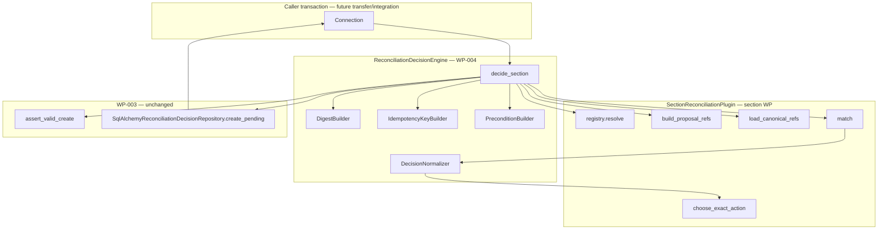

--------------------------------------------------

Document Status

Document:
WP-PPR-CARD-COORDINATION-004

Title:
Reconciliation Decision Engine — Application Layer Architecture

Type:
Architecture Work Package (application-layer design only)

Status:
Draft — Ready for Architecture Review (rev.3)

Revision:
3

Date:
2026-07-24

Depends on:
WP-PPR-CARD-COORDINATION-002 rev.3 (approved contract),
WP-PPR-CARD-COORDINATION-003 (commit `34598366fc36d14b5ae2f6b2874b4c77598a8b8c` — decision persistence foundation),
WP-PPR-CARD-COORDINATION-001 rev.6,
WP-PR-008, WP-PR-010,
WP-PPR-APPLICANT-001A

Purpose:
Описать минимальный application-layer **Decision Engine** (U1 Decide): match → normalize → evidence → persist pending decisions через WP-003 repository. Без executor, transfer wiring, PPR mutations, API/UI и изменений WP-003.

Out of scope:
Код, миграции, Alembic, REST/UI, executor/apply-gate, `transfer_service` wiring, PPR writes, section matcher implementations, commit/push, изменение утверждённого WP-003.

--------------------------------------------------

# WP-PPR-CARD-COORDINATION-004 — Reconciliation Decision Engine

## 1. Назначение и границы

### 1.1 Проблема

После WP-003 в репозитории есть durable store и fail-closed invariants для reconciliation decisions, но **нет application-layer engine**, который:

- принимает accepted intake proposals по collection-разделу;
- получает canonical candidates **только** через section plugin;
- детерминированно выбирает `ReconcileAction`;
- формирует полный execution intent (evidence, preconditions, digests, idempotency key);
- сохраняет `apply_status=pending` через `SqlAlchemyReconciliationDecisionRepository`.

Текущий transfer (`app/personnel_intake/application/transfer_service.py`) по-прежнему делает blind append через `PprSectionApplicationService.add_*` / `create_military_service` без reconciliation.

### 1.2 Роль WP-004

| WP-004 определяет | WP-004 не определяет |
|-------------------|----------------------|
| Интерфейс `ReconciliationDecisionEngine` (U1 Decide) | Live apply-gate и PPR command execution (executor WP) |
| Интерфейс `SectionReconciliationPlugin` (decide subset) | Конкретные matcher rules per section |
| Engine input/output DTO | REST routes / UI |
| Алгоритм decide + fail-closed ветки | Изменение `personnel_intake_transfers` / transfer status |
| Граница транзакции U1 | U2/U3 apply transactions |
| Правила batch identity, idempotency key, replay | Alembic / ORM (уже в WP-003) |
| Test matrix и acceptance checklist для engine | Section plugin implementations |

### 1.3 Связь со слоями (as-is → target)

```text
[review_service] accepted section payload
        ↓
[intake_section_utils.extract_section_payload]   ← today
        ↓
[ReconciliationDecisionEngine.decide_section]    ← WP-004 (this doc)
   ├─ plugin.build_proposal_refs + coverage validation   ← before U1 savepoint
   ├─ plugin.load_canonical_refs                         ← before U1 savepoint
   ├─ WITH conn.begin_nested()                           ← mandatory U1 savepoint (§9.2)
   │    ├─ digest_builder.verify_or_compute (all refs)
   │    ├─ plugin.match → DecisionNormalizer
   │    ├─ create_pending + replay validation
   │    └─ assemble DecideSectionResult
   └─ shared precondition + idempotency builders (inside savepoint)
        ↓
[pending decisions in personnel_intake_reconciliation_decisions]
        ↓
[Executor WP — future] apply-gate + PPR commands + terminal transitions
        ↓
[transfer_service orchestration — future integration WP]
```

**Жёсткое ограничение WP-004:** engine **не** вызывает `PprSectionApplicationService`, **не** меняет `personnel_applications.status`, **не** пишет в `personnel_intake_transfers`, **не** читает canonical SoT напрямую из `SectionReadRepository` — только через plugin.

### 1.4 Область разделов

Те же четыре collection `section_code`, что в WP-003 `SECTION_CODES`:

| Intake `section_code` | PPR section (read/write) | Текущий transfer anchor |
|-----------------------|--------------------------|-------------------------|
| `education` | `PPR-EDUCATION` / `person_education` | `transfer_service._run_section_commands` → `add_education` |
| `training` | `PPR-TRAINING` / `person_training` | `add_training` |
| `employment_biography` | `PPR-EMPLOYMENT-BIOGRAPHY` / `person_external_employment` | `add_external_employment` |
| `military` | `PPR-MILITARY` / `person_military_service` | `create_military_service` |

`relatives`, scalar sections (`personal`, `contacts`, `additional`) — **вне engine scope** (002 §1.4).

---

## 2. Исследование кодовой базы (read-only)

### 2.1 Personnel intake orchestration

| Path | Relevance for WP-004 |
|------|----------------------|
| `app/personnel_intake/application/review_service.py` | Gate: section must be `accepted`; `can_transfer`; draft payload source |
| `app/personnel_intake/application/transfer_service.py` | Future caller; today blind PPR writes in separate txns per command |
| `app/personnel_intake/application/intake_section_utils.py` | `extract_section_payload(section_code, draft)` — proposal list extraction (hardcoded per section) |
| `app/personnel_intake/application/intake_mapper.py` | Field normalization to PPR payloads; `intake_command_id()` pattern for transfer-level idempotency |
| `app/personnel_intake/domain/review_status.py` | Section codes for HR review (superset of reconciliation scope) |
| `app/personnel_intake/infrastructure/review_repository.py` | Section review + transfer audit rows |

**Transaction pattern today:** HR routes use caller-owned `engine.begin()` → `conn` passed to services. Transfer mixes same-conn SQL with **standalone** PPR command commits — reconciliation engine must assume **caller-owned `Connection`** like review/transfer services, aligned with future executor participating mode.

### 2.2 PPR canonical read (plugin responsibility, not engine)

| Path | Relevance |
|------|-----------|
| `app/ppr/domain/section_repositories.py` | `SectionReadRepository.load_active_records()` — expected backing for plugins |
| `app/ppr/infrastructure/section_repository.py` | SQL implementation; employment excludes pending revisions |
| `app/ppr/domain/section_handlers.py` | De-facto duplicate fingerprints (`_education_fingerprint`, etc.) — informative seed for section plugins |
| `app/ppr/read/query_service.py` | Card read facade — not used by decide engine |

Plugins **may** wrap `SectionReadRepository` internally; engine **must not** import it.

### 2.3 WP-003 foundation (commit `3459836`)

| Path | Role |
|------|------|
| `app/personnel_intake/domain/reconciliation/actions.py` | `ReconcileAction`, `ApplyStatus`, `REASON_CODES`, `MATCH_KIND_*`, evidence field list |
| `app/personnel_intake/domain/reconciliation/models.py` | `CreatePendingDecisionCommand`, `ReconcileDecisionRecord`, terminal/batch commands |
| `app/personnel_intake/domain/reconciliation/invariants.py` | `assert_valid_create`, evidence/action consistency, `compute_intent_fingerprint` |
| `app/personnel_intake/infrastructure/reconciliation_repository.py` | `create_pending`, `transition_to_terminal`, `finalize_batch_terminal` (savepoint) |
| `alembic/versions/q8r9s0t1u2v3_...` | `personnel_intake_reconciliation_decisions` |

**WP-004 reuse rule:** engine produces `CreatePendingDecisionCommand` validated by existing invariants; **не менять** WP-003 schema, repository API или domain invariants без отдельного WP.

### 2.4 Digest precedents

| Path | Notes |
|------|-------|
| `app/services/personnel_orders_editorial/fingerprint.py` | `canonical_json()` + SHA-256 — closest existing helper for `canon-json-v1` |
| WP-003 `compute_intent_fingerprint()` | SHA-256 over sorted compact JSON of full intent — conflict detection, distinct from idempotency key string |

**canon-json-v1** (OQ-005 closed): normative bytes in §3.3 — stricter than editorial fingerprint (JSON-native only); reconciliation uses **`digest.py` only**.

---

## 3. Архитектурные компоненты

### 3.1 Component diagram



### 3.2 Planned file layout (implementation WP — not created in WP-004)

| Path | Role |
|------|------|
| `app/personnel_intake/application/reconciliation/engine.py` | `ReconciliationDecisionEngine` |
| `app/personnel_intake/application/reconciliation/normalizer.py` | 002 §5.2 pure function |
| `app/personnel_intake/application/reconciliation/registry.py` | `section_code → plugin` |
| `app/personnel_intake/application/reconciliation/idempotency.py` | execution intent → `idempotency_key` |
| `app/personnel_intake/application/reconciliation/precondition.py` | `expected_canonical_precondition` tokens |
| `app/personnel_intake/domain/reconciliation/digest.py` | versioned canonical-JSON digest (`canon-json-v1`) |
| `app/personnel_intake/application/reconciliation/dto.py` | engine-specific input/output dataclasses |
| `app/personnel_intake/application/reconciliation/plugins/*.py` | section matchers (separate WPs) |

### 3.3 `canon-json-v1` — common digest algorithm (OQ-005 closed)

Normative specification for `DigestBuilder` (`digest_algorithm_version = "canon-json-v1"`).

#### 3.3.0 Supported digest versions (WP-004 scope)

WP-004 supports **`digest_algorithm_version="canon-json-v1"` only**.

```text
DigestBuilderRegistry.resolve(version: str) -> DigestBuilder
  IF version == "canon-json-v1":
    RETURN CanonJsonV1DigestBuilder
  RAISE UNSUPPORTED_DIGEST_ALGORITHM
```

Engine calls `DigestBuilderRegistry.resolve(command.digest_algorithm_version)` at the **start** of `decide_section` — **before** U1 savepoint, proposal/canonical ref enrichment, and any decision construction. Unknown version ⇒ fail-closed; zero decision rows.

Future digest algorithms are added by **registering** additional versioned builders in `digest.py` / registry; engine orchestration unchanged.

Default: `DecideSectionCommand.digest_algorithm_version = "canon-json-v1"`.

#### 3.3.1 Allowed value domain

Only **JSON-native** values are permitted in `normalized_content` (and in idempotency `intent_material`):

| Type | Rule |
|------|------|
| `object` | Mapping with **string keys only** (reject `int`/`tuple` keys with `INVALID_DIGEST_INPUT`) |
| `array` | `list` or `tuple`; elements normalized recursively; order preserved |
| `string` | Unicode `str` |
| `integer` | `int` only (**not** `bool`) |
| `number` | Finite `float` only — reject `NaN`, `±Infinity` |
| `boolean` | `bool` |
| `null` | Python `None` |

**Rejected with `INVALID_DIGEST_INPUT`:** non-string dict keys, `bool` mistaken as int is OK (bool is separate type), datetimes, decimals, bytes, custom objects, `default=str` coercion, any non-JSON-native scalar or container element.

#### 3.3.2 Canonical JSON serialization

| Rule | Requirement |
|------|-------------|
| Encoding | UTF-8 of canonical JSON string before SHA-256 |
| Key order | Lexicographic sort of **string** keys (`sort_keys=True`) |
| Key coercion | **None** — keys must already be `str` |
| Separators | Compact: `(",", ":")` |
| Unicode | `ensure_ascii=False` |
| Null omission | **`exclude_none=True`, applied recursively**: omit dict entries whose normalized value is `null`; nested dicts/lists processed depth-first |
| Output digest | SHA-256 hex lowercase (64 chars) |

```text
canonical_json(value) -> str          # validates JSON-native domain first
payload_digest(normalized_content) -> str
  SHA-256(UTF-8(canonical_json(normalized_content)))

verify_or_compute(normalized_content, claimed_payload_digest: str | None) -> str
  computed = payload_digest(normalized_content)    # non-empty 64-char hex
  IF claimed_payload_digest IS NOT NULL AND claimed_payload_digest != computed:
    RAISE PLUGIN_DIGEST_MISMATCH
  ASSERT computed is non-empty
  RETURN computed
```

**Editorial reference:** `app/services/personnel_orders_editorial/fingerprint.py` is informative only; `canon-json-v1` is **stricter** (no `default=str`, no key stringification). Golden vectors in tests (E20) are authoritative for reconciliation.

#### 3.3.3 Idempotency material serialization

`intent_material` is a **fixed-order JSON array** (**14 elements**) serialized with the **same** `canonical_json` rules, then hashed:

```text
intent_material = [
  "recon",
  application_id,                        # int
  section_code,                          # str
  proposal_index,                        # int
  action,                                # str
  digest_algorithm_version,              # str
  proposal_payload_digest,               # str (canon-json-v1 hex)
  target_canonical_record_id_or_none,    # int | null
  expected_canonical_precondition,       # str
  decision_source,                       # str ("system" in WP-004)
  override_token_or_none,                # str | null
  matcher_rule_id,                       # str
  matcher_version,                       # str
  policy_version,                        # str
]

idempotency_key = "recon:v1:" + payload_digest(intent_material)
```

The array is the root value passed to `canonical_json`. `correlation_id` is **excluded**.

---

## 4. Интерфейсы

### 4.1 `ReconciliationDecisionEngine`

```text
Protocol / class ReconciliationDecisionEngine

  decide_section(
    conn: Connection,
    command: DecideSectionCommand,
  ) -> DecideSectionResult
```

**Responsibilities:**

- Resolve section plugin; fail-closed if missing (before U1 savepoint).
- Build proposals, validate coverage, load canonical refs (before U1 savepoint).
- Open **`conn.begin_nested()`** then run digest enrichment, full proposal loop, `create_pending`, replay validation, and result assembly **inside** the savepoint (§9.2).
- Build and persist pending decisions via WP-003 repository.
- Never mutate PPR SoT; never change transfer/review status.
- Return per-decision and section-level replay flags plus **`decision_ids`** tuple for downstream executor.

**Non-responsibilities:** apply-gate, PPR commands, terminal transitions, HR API.

### 4.2 `SectionReconciliationPlugin` (decide subset)

Normative superset of 002 §10.1, **restricted to decide phase** in WP-004:

```text
Protocol SectionReconciliationPlugin

  section_code: SectionCode
  section_apply_mode: "per_record" | "all_or_nothing"
    # military plugin MUST default "all_or_nothing" (rev.2 — OQ-002 closed for engine scope)
  policy_version: str                    # section policy tag; part of execution intent
  matcher_rule_id: str                  # stable rule identifier for audit
  matcher_version: str                   # bump ⇒ new execution intent (no silent replay)

  build_proposal_refs(
    section_payload: mapping,            # opaque intake slice from caller
    digest_algorithm_version: str,
  ) -> tuple[ProposalRecordRef, ...]
    # Returns normalized_content, raw_payload, proposal_fingerprint, optional claimed_payload_digest.
    # Plugin leaves payload_digest null; optional claimed_payload_digest only (§5.2).

  load_canonical_refs(
    conn: Connection,
    person_id: int,
    digest_algorithm_version: str,
  ) -> tuple[CanonicalRecordRef, ...]
    # Returns normalized_content, record metadata, optional claimed_payload_digest.
    # Plugin leaves payload_digest null; optional claimed_payload_digest only (§5.2).

  match(
    proposal: ProposalRecordRef,         # proposal.payload_digest already engine-computed
    canonicals: tuple[CanonicalRecordRef, ...],
  ) -> MatchOutcome

  choose_exact_action(
    match: MatchOutcome,
    proposal: ProposalRecordRef,
    target: CanonicalRecordRef,
  ) -> "update_version" | "supersede"
    # system auto path only in WP-004; HR-chosen override action deferred (OQ-004 closed)

  # Removed from plugin surface (rev.2): normalize_content — normalization happens inside
  # build_proposal_refs / load_canonical_refs; digest is always common DigestBuilder.

  # Deferred to executor/integration WPs (NOT in plugin contract for WP-004 engine):
  # confirm_add_precondition(...)
  # to_ppr_command(decision) -> PprCommand | None
```

**Registry:**

```text
SectionReconciliationRegistry
  register(plugin: SectionReconciliationPlugin) -> None
  resolve(section_code: SectionCode) -> SectionReconciliationPlugin
  require(section_code: SectionCode) -> SectionReconciliationPlugin   # missing ⇒ ReconciliationValidationError INV-REC-008
```

### 4.3 `DecisionNormalizer` (common, not plugin)

Pure function — 002 §5.2, already normative in contract:

```text
normalize_match_outcome(
  match: MatchOutcome,
  *,
  section_code: SectionCode,
) -> tuple[ReconcileAction, DecisionReasonCode]
```

Returns **action + reason only**; never `ApplyStatus`, never `blocked` as action.

For `exact_one` + `high` + `semantically_equal=false`, engine calls `plugin.choose_exact_action` **after** normalizer confirms non-equal exact match is allowed.

---

## 5. DTO — вход engine

### 5.1 `DecideSectionCommand`

```text
DecideSectionCommand
  application_id: int
  person_id: int
  section_code: SectionCode
  section_payload: mapping              # accepted intake slice; opaque to engine
  decision_source: "system" | "hr"      # default "system"
  override_token: str | None            # required when decision_source=hr (WP-003 invariant)
  correlation_id: str | None            # audit trace only — §8.1; NOT U3 batch identity
  digest_algorithm_version: str         # WP-004: MUST be "canon-json-v1" (§3.3.0)
  policy_version_override: str | None   # optional; default = plugin.policy_version
```

**WP-004 decide path:** `decision_source` is **`system` only**. `digest_algorithm_version` other than `"canon-json-v1"` ⇒ `UNSUPPORTED_DIGEST_ALGORITHM` before U1 savepoint (§3.3.0). Fields `decision_source=hr` / `override_token` exist on WP-003 command for future HR override WP; engine in WP-004 implementation **must reject** non-system decide requests (OQ-004 closed).

**Caller obligations:**

- `section_payload` corresponds to **accepted** review section (integration WP validates).
- `person_id` matches application's person (repository re-validates on each `create_pending`).
- Engine validates **complete coverage**: every `proposal_index` 0..N-1 exactly once after `build_proposal_refs`.

**Explicitly absent from command:** `canonical_records` — engine loads via plugin only.

### 5.2 Shared ref types (002 §4.1 — engine uses unchanged)

```text
ProposalRecordRef
  proposal_index: int
  proposal_fingerprint: str             # opaque matcher helper; section-owned semantics
  normalized_content: mapping           # plugin-normalized JSON-native field set (§3.3.1)
  raw_payload: mapping                   # opaque intake element
  claimed_payload_digest: str | None = None
    # optional plugin self-check claim; NOT authoritative; verified by engine inside U1 savepoint
  payload_digest: str | None = None
    # null from plugin; engine sets non-empty authoritative digest inside U1 savepoint after verify_or_compute

CanonicalRecordRef
  record_id: int
  lifecycle_status: str
  row_version: str
  record_fingerprint: str
  normalized_content: mapping           # plugin-normalized JSON-native field set (§3.3.1)
  claimed_payload_digest: str | None = None
    # optional plugin self-check claim; NOT authoritative
  payload_digest: str | None = None
    # null from plugin; engine sets non-empty authoritative digest inside U1 savepoint after verify_or_compute
```

**Engine enrichment (inside U1 savepoint — §9.2, before match/persist; `digest_builder` from §3.3.0):**

```text
FOR each proposal ref:
  proposal.payload_digest = digest_builder.verify_or_compute(
    proposal.normalized_content,
    proposal.claimed_payload_digest,
  )
  ASSERT proposal.payload_digest is non-empty
FOR each canonical ref:
  canonical.payload_digest = digest_builder.verify_or_compute(
    canonical.normalized_content,
    canonical.claimed_payload_digest,
  )
  ASSERT canonical.payload_digest is non-empty
```

- Plugin **must not** pre-fill `payload_digest` (leave `null`).
- If `claimed_payload_digest` is `null`/absent → compute only.
- If present and ≠ computed → **`PLUGIN_DIGEST_MISMATCH`** (E21); U1 savepoint rollback.
- After enrichment, **`payload_digest`** is non-empty authoritative digest for evidence/idempotency.

### 5.3 `MatchOutcome` (002 §4.2)

Engine validates structural sanity before normalize:

- `match_kind` / `match_confidence` non-empty (also enforced at persist by WP-003 evidence invariants).
- `candidate_canonical_record_ids` all `int`; non-empty when `kind=ambiguous`.
- `matched_canonical_record_id` `int | null`.
- `semantically_equal` required when `kind=exact_one` and `confidence=high`.

Invalid plugin output → `ReconciliationValidationError` (fail-closed); **abort entire U1** (§7).

---

## 6. DTO — выход engine

### 6.1 `DecideSectionResult`

```text
DecideSectionResult
  application_id: int
  person_id: int
  section_code: SectionCode
  section_apply_mode: "per_record" | "all_or_nothing"   # from plugin
  correlation_id: str | None
  digest_algorithm_version: str
  policy_version: str
  decision_ids: tuple[int, ...]                        # non-empty; ordered by proposal_index — U3 input
  decisions: tuple[DecideDecisionOutcome, ...]         # same order as decision_ids
  summary: DecideSectionSummary
  batch_idempotent_replay: bool                         # true iff every outcome idempotent_replay
  result_status: "fresh" | "idempotent_replay" | "mixed"
    # failures are raised as exceptions — no "failed" result_status
```

```text
DecideDecisionOutcome
  decision: ReconcileDecisionRecord          # persisted snapshot; unchanged on terminal replay
  idempotent_replay: bool                   # from CreatePendingDecisionResult after replay rules §8.4
  proposal_index: int
  action: ReconcileAction
  reason_code: DecisionReasonCode
```

```text
DecideSectionSummary
  add: int                                  # counts by action (from decisions)
  update_version: int
  supersede: int
  keep_existing: int
  manual_review: int
  pending: int                              # count where apply_status == "pending" (actual, not len)
  applied: int                              # replayed terminal applied (informative)
  skipped_manual: int                      # replayed terminal skipped_manual (informative)
```

**`result_status` rules (rev.2):**

| Condition | `result_status` |
|-----------|-----------------|
| All outcomes fresh (`idempotent_replay=False`, all `apply_status=pending`) | `fresh` |
| All outcomes replay (`idempotent_replay=True`) | `idempotent_replay` |
| Mix of fresh and replay | `mixed` |

**Note:** `blocked` / `failed` terminal replay is **not** a successful decide outcome — see §8.4.

### 6.2 Mapping to 002 `ReconcileSectionResult`

Engine output is the decide-phase subset of 002 §4.7:

- `decisions` → outcomes; fresh decide yields `apply_status=pending`; terminal replay returns existing row unchanged (§8.4).
- `decision_ids` → exact executor/U3 batch membership (durable batch store — integration WP).
- `section_apply_mode` copied from plugin.
- Section `idempotent_replay` semantics → `result_status` + `batch_idempotent_replay` (§6.1).

---

## 7. Алгоритм `decide_section`

### 7.1 Pseudocode

```text
decide_section(conn, command):
  # --- Before U1 savepoint (no decision rows) ---
  digest_builder = DigestBuilderRegistry.resolve(command.digest_algorithm_version)  # §3.3.0
  plugin = registry.require(command.section_code)
  policy_version = command.policy_version_override or plugin.policy_version
  assert command.decision_source == "system"

  proposals = plugin.build_proposal_refs(command.section_payload, command.digest_algorithm_version)
  assert_complete_coverage(proposals)

  canonicals = plugin.load_canonical_refs(conn, command.person_id, command.digest_algorithm_version)

  repo = SqlAlchemyReconciliationDecisionRepository(conn)

  # --- U1 savepoint: all decision side effects ---
  WITH conn.begin_nested() AS u1_sp:
    FOR ref IN proposals:
      ref.payload_digest = digest_builder.verify_or_compute(
        ref.normalized_content, ref.claimed_payload_digest,
      )
    FOR ref IN canonicals:
      ref.payload_digest = digest_builder.verify_or_compute(
        ref.normalized_content, ref.claimed_payload_digest,
      )

    outcomes = []
    FOR proposal IN sort(proposals, key=proposal_index):
      match = plugin.match(proposal, canonicals)
      validate_match_outcome(match)
      ... derive action, reason, targets, evidence, idempotency_key (§3.3.3) ...
      result = repo.create_pending(create_cmd)

      IF result.idempotent_replay:
        assert_replay_allowed(result.decision)         # §8.4
      outcomes.append(DecideDecisionOutcome(...))

    decision_ids = tuple(o.decision.decision_id for o in outcomes)
    assert len(decision_ids) > 0
    RETURN DecideSectionResult(decision_ids=decision_ids, ...)

  # u1_sp releases on normal return; rolls back ALL side effects on ANY exception

ON ANY exception inside u1_sp:
  savepoint rollback ⇒ zero new decisions from this decide_section call,
  including after partial create_pending or failed digest verify,
  even if caller catches the exception

ON exception before u1_sp (plugin missing, coverage failure, UNSUPPORTED_DIGEST_ALGORITHM):
  no decision rows; savepoint never opened
```

### 7.2 Deterministic ordering

- Proposals processed in ascending `proposal_index`.
- `build_proposal_refs` **must** return stable ordering for same payload.
- Canonical list order does not affect action if matcher is deterministic (section plugin contract).

### 7.3 Target / precondition derivation (common)

| Action | `target_canonical_record_id` | `expected_row_version` | `expected_canonical_precondition` (opaque token) |
|--------|------------------------------|--------------------------|--------------------------------------------------|
| `add` | `null` | `null` | digest of sorted active canonical `payload_digest` set at decide time (`none-match:…`) |
| `keep_existing` | matched id | optional capture | equality digest / `keep:row_version:{rv}` per plugin+common builder |
| `update_version` | matched id | target.row_version | `row_version:{rv}` |
| `supersede` | matched id | target.row_version | `row_version:{rv}` |
| `manual_review` | `null` | `null` | `manual:{reason_code}` or plugin-specific token |

Exact string format — implementation detail of `precondition.py`; **must** enter idempotency key (002 §8.1).

### 7.4 Evidence assembly (common)

Engine builds full `DecisionEvidence` dict matching WP-003 `DECISION_EVIDENCE_REQUIRED_FIELDS` (002 §6.1):

- All keys present (values may be `null` where contract allows).
- `source = "intake_reconciliation"`.
- Cross-fields match `CreatePendingDecisionCommand` (enforced by WP-003 `assert_valid_decision_evidence`).
- `candidate_canonical_record_ids`, `matched_canonical_record_id`, `semantically_equal`, `match_kind`, `match_confidence` from `MatchOutcome`.
- `canonical_payload_digest_at_match` from matched canonical ref when applicable.
- `after_intent_digest` from common builder (for `keep_existing` equals canonical digest per 002 §6.2).
- `correlation_id` from command.
- `matcher_rule_id`, `matcher_version`, `policy_version`, `digest_algorithm_version` from plugin/command.

Action/evidence consistency (add/keep/update/supersede/manual rules) — **delegated to WP-003** `assert_action_evidence_consistency`; engine must construct evidence so persist succeeds.

### 7.5 Fail-closed branches

| Condition | Error | U1 effect |
|-----------|-------|-----------|
| Unregistered `section_code` | `UNKNOWN_SECTION_PLUGIN` / INV-REC-008 | Abort; zero inserts |
| Empty proposals when section non-empty | `INCOMPLETE_PROPOSAL_COVERAGE` | Abort |
| Gap/duplicate `proposal_index` | `INVALID_PROPOSAL_INDEX_SET` | Abort |
| Plugin `match` returns structurally invalid outcome | `INVALID_MATCH_OUTCOME` | Abort |
| Normalizer + `choose_exact_action` produce disallowed pair | `ILLEGAL_ACTION_REASON` | Abort |
| `assert_valid_create` failure (evidence/action/precondition) | `ReconciliationValidationError` | Abort |
| Application not found / person mismatch | `APPLICATION_*` (repository) | Abort |
| Same idempotency key, different intent fingerprint | `ReconciliationConflictError` | U1 savepoint rollback |
| Same idempotency key, different `correlation_id` (other intent fields equal) | `ReconciliationConflictError` — **not replay** (§8.1) | U1 savepoint rollback |
| Idempotent replay hits terminal `blocked`/`failed` | `REDECIDE_TERMINAL_REQUIRES_NEW_INTENT` | U1 savepoint rollback |
| Plugin `claimed_payload_digest` ≠ computed | `PLUGIN_DIGEST_MISMATCH` | U1 savepoint rollback (E21) |
| `normalized_content` non-JSON-native (NaN, bad keys, etc.) | `INVALID_DIGEST_INPUT` | U1 savepoint rollback (E20a–E20c) |
| Partial `create_pending` then later failure inside U1 | U1 nested savepoint rollback | **Zero** new decisions from this call (§9.2) |
| Caller catches exception without re-raising | U1 savepoint already rolled back | **Zero** new decisions from this call remain |

Engine **never** catches validation errors and continues with partial decisions.

---

## 8. Batch identity, idempotency, replay

### 8.1 Decide batch identity vs executor batch identity

One call `decide_section(command)` = **one U1 decide invocation** for `(application_id, section_code)`.

| Field | Role | Durable U3 batch identity? |
|-------|------|----------------------------|
| `(application_id, section_code, proposal_index)` | Logical proposal slot | Per-decision only |
| Per-decision `idempotency_key` | UNIQUE durable row key (002 §8.1) | No — one decision |
| **`decision_ids: tuple[int, ...]`** | Exact membership for executor/U3 | **Yes — normative executor input** |
| `correlation_id` | Audit trace copied into evidence | **No** — insufficient alone for U3 |
| Durable U3 batch record | Links `decision_ids` + apply attempt metadata | **Integration WP** — not WP-004 |

**Executor contract (downstream):** receives **`DecideSectionResult.decision_ids`** — non-empty tuple, ascending `proposal_index` order, one id per proposal. How/whether integration persists `(application_id, section_code, decide_attempt_id) → decision_ids` is **out of scope** for WP-004.

**`correlation_id` stability (audit / intent_fingerprint):**

- Copied into each decision's evidence → participates in WP-003 `intent_fingerprint`.
- **Not** a component of `idempotency_key` (002 §8.1).
- **Retry rule:** caller **must** reuse the same `correlation_id` when retrying the same logical decide attempt after transient failure **before** outer commit; changing `correlation_id` while other intent fields (including key components) stay the same yields **`ReconciliationConflictError`** on `create_pending` (same key, different fingerprint) — **not** idempotent replay.

### 8.2 Execution intent → `idempotency_key` (OQ-006 closed)

Normative format: **`recon:v1:` + SHA-256** over the fixed 14-element JSON array `intent_material` defined in **§3.3.3**, serialized with `canon-json-v1` rules.

`correlation_id` is **excluded** from `intent_material`.

### 8.3 `intent_fingerprint` (WP-003)

Repository computes via `compute_intent_fingerprint()` over full `CreatePendingDecisionCommand` including evidence (with `correlation_id`). Engine must populate command fields consistently.

**Conflict rule:** same `idempotency_key` + different `intent_fingerprint` ⇒ `ReconciliationConflictError` (includes `correlation_id`-only drift).

### 8.4 Replay rules (decide phase — rev.2)

```text
assert_replay_allowed(decision):
  IF decision.apply_status IN ("applied", "skipped_manual", "pending"):
    ALLOW — return existing row unchanged; idempotent_replay=True
  IF decision.apply_status IN ("blocked", "failed"):
    RAISE REDECIDE_TERMINAL_REQUIRES_NEW_INTENT — fail-closed; U1 savepoint rollback
```

| Scenario | Engine behavior |
|----------|-----------------|
| Same execution intent; existing `pending` | Replay; same `decision_id`; `idempotent_replay=True` |
| Same intent; existing terminal `applied` / `skipped_manual` | Replay; row unchanged; `idempotent_replay=True`; `result_status` may be `idempotent_replay` or `mixed` |
| Same intent; existing terminal `blocked` / `failed` | **`REDECIDE_TERMINAL_REQUIRES_NEW_INTENT`** — entire U1 rolled back; caller must supply **new** precondition/key fields (OQ-008 closed) |
| Same key, different intent (`correlation_id`, evidence, etc.) | `ReconciliationConflictError` |
| `matcher_version` / `policy_version` / `digest_algorithm_version` bump | New key → new decision; no silent replay |
| HR override action path | Out of WP-004 — separate WP (OQ-004 closed) |

**Section-level flags:**

- `batch_idempotent_replay = all(outcome.idempotent_replay for outcome in decisions)`
- `summary.pending = count(d.apply_status == "pending" for d in decisions)`

**Engine never sets `apply_status` to `replayed`** — response flag only (002 §4.4).

### 8.5 Matcher/policy version change vs identical logical outcome

Normative (002 §8.1): version bump ⇒ **new execution intent** even if matcher would yield the same action on the same data.

---

## 9. Границы транзакции U1

### 9.1 Caller-owned transaction

```text
with engine.begin() as conn:                    # existing HR/transfer pattern
    result = reconciliation_engine.decide_section(conn, command)
    # commit only if caller satisfied
```

Engine **does not** call `conn.commit()`.

### 9.2 Mandatory U1 nested savepoint (OQ-007 closed)

**Normative:** `decide_section` **always** opens `conn.begin_nested()` **before** digest enrichment. Everything that can create or rely on persisted decision state for this invocation runs **inside** the savepoint:

| Inside U1 savepoint | Outside U1 savepoint (read-only / setup) |
|---------------------|------------------------------------------|
| Digest enrichment of **all** proposal + canonical refs | Plugin resolution (`registry.require`) |
| Full proposal loop (`match` → persist) | `build_proposal_refs` |
| All `create_pending` calls | Coverage validation |
| Replay validation (`assert_replay_allowed`) | `load_canonical_refs` |
| `DecideSectionResult` assembly + return | `decision_source=system` guard |

```text
with conn.begin_nested():    # U1 savepoint — mandatory; opens BEFORE digest enrichment
    enrich all ref digests
    for each proposal: match → create_pending → replay check
    return DecideSectionResult
```

| Property | Requirement |
|----------|-------------|
| Scope | Digest enrichment + all proposals in one `decide_section` call |
| Success | Savepoint releases; inserts visible within caller transaction |
| Any exception inside savepoint | Rollback — **all** side effects from this call undone (digests not durable; inserts rolled back) |
| Caller catches exception | Savepoint already rolled back — partial decide **cannot** persist |
| Failure after k-th `create_pending` or during digest enrich | Proposals `<k` from **this call** not durable (E16) |
| Relation to WP-003 | Same pattern as `finalize_batch_terminal` savepoint |

**INV-REC-007:** all proposals succeed as one U1 unit, or **zero new decisions** from this call remain.

Engine **must not** rely on caller remembering to rollback outer transaction.

### 9.3 What U1 does not guarantee

- No cross-section atomicity (each `decide_section` independent).
- No coupling to transfer audit row.
- No PPR visibility — canonical snapshot is decide-time via plugin load inside same conn read view.
- No durable U3 batch persistence (integration WP).

### 9.4 Interaction with future executor (informative)

| Unit | Owner | Transaction |
|------|-------|-------------|
| U1 Decide | Engine (WP-004) | Caller conn + **mandatory** nested savepoint |
| U2 Apply record | Executor WP | Single txn: gate + PPR + terminal status |
| U3 Apply batch | Executor WP | 002 §7.3; input `decision_ids`; uses WP-003 `finalize_batch_terminal` |

Engine stops at pending (or returns terminal replay without mutation); executor owns apply transitions.

---

## 10. Section-specific vs common

### 10.1 Common (engine + shared modules)

| Concern | Owner |
|---------|-------|
| `DecisionNormalizer` | common `normalizer.py` |
| Evidence shape + WP-003 validation | domain invariants (existing) |
| `DigestBuilder` / `canon-json-v1` (§3.3) | common `digest.py` — sole owner of payload digests |
| `IdempotencyKeyBuilder` (`recon:v1:…`) | common `idempotency.py` |
| `PreconditionBuilder` | common `precondition.py` |
| Plugin registry | common `registry.py` |
| U1 orchestration | `engine.py` |
| Persist pending | WP-003 repository |

### 10.2 Section-specific (plugin WPs)

| Concern | Owner |
|---------|-------|
| `build_proposal_refs` / intake field mapping | plugin |
| `load_canonical_refs` (which PPR rows, filters) | plugin |
| `proposal_fingerprint` semantics | plugin |
| `match` / `MatchOutcome.detail` | plugin |
| `choose_exact_action` (update vs supersede policy) | plugin — **system auto path only** in WP-004 |
| `section_apply_mode` | plugin — **`military` MUST be `all_or_nothing`** (rev.2 default policy) |
| `policy_version`, `matcher_rule_id`, `matcher_version` | plugin |
| Education ambiguity HR Q3 (`HR_Q3_NO_AUTO_MERGE`) | plugin matcher/normalizer inputs |
| Employment blind-append predicates | plugin |
| Military cardinality (≤1 active) | plugin |

### 10.3 Informative matcher seeds (read-only code today)

| Section | Existing fingerprint anchor |
|---------|----------------------------|
| `education` | `section_handlers._education_fingerprint`, `domain/education_type.py` |
| `training` | `section_handlers._training_fingerprint` |
| `employment_biography` | no duplicate guard — highest reconciliation risk |
| `military` | single active guard in handler |

---

## 11. Test matrix (engine scope)

Extends 002 §11 rows applicable to **U1 decide**; executor rows deferred.

| ID | Case | Setup | Expect (decide engine) |
|----|------|-------|--------------------------|
| E01 | Confident new | plugin match `none`/`high` | `action=add`, `reason=MATCH_NONE_CONFIDENT`, pending persisted, full evidence |
| E02 | Low confidence | `none`/`low` | `manual_review`, `MATCH_CONFIDENCE_LOW`; no mutative action |
| E03 | Ambiguous | `ambiguous` | `manual_review`, `MATCH_AMBIGUOUS`; candidates in evidence |
| E04 | Exact keep | `exact_one`/`high`, `semantically_equal=true` | `keep_existing`, target+matched aligned |
| E05 | Exact update | non-equal exact, policy update | `update_version`, `expected_row_version` set |
| E06 | Exact supersede | non-equal exact, policy supersede | `supersede`, `expected_row_version` set |
| E07 | Stale target at decide | `stale_target` | `manual_review`, `MATCH_STALE_TARGET` |
| E08 | Missing plugin | unregistered section | fail-closed error; zero rows |
| E09 | Incomplete coverage | plugin returns gap in indices | fail-closed; zero rows |
| E10 | Idempotent re-decide (pending) | same intent twice | second `idempotent_replay=True`; same `decision_id`; `apply_status=pending` |
| E10a | Terminal replay allowed | prior `applied` or `skipped_manual` | existing row returned unchanged; `idempotent_replay=True` |
| E10b | Terminal replay forbidden | prior `blocked` or `failed`, same key | `REDECIDE_TERMINAL_REQUIRES_NEW_INTENT`; U1 savepoint rollback; zero new rows |
| E10c | Mixed fresh + replay | one proposal fresh, one replay terminal allowed | `result_status=mixed`; `summary.pending` counts actual pending only |
| E11 | Matcher version bump | same payload, bumped `matcher_version` | new `decision_id`, new key `recon:v1:…`, `idempotent_replay=False` |
| E12 | Policy version bump | same match, bumped `policy_version` | new decision |
| E13 | HR decide rejected | `decision_source=hr` in WP-004 engine | validation error before U1 (HR override WP deferred) |
| E14 | Person/application mismatch | wrong `person_id` | validation error; U1 not committed |
| E15 | Invalid evidence path | plugin emits inconsistent match/action | `assert_valid_create` rejects; U1 savepoint rollback |
| E16 | Partial failure rollback | failure during digest enrich or after k-th `create_pending` inside U1 | savepoint rollback; zero new rows from **this call**; survives caller catch |
| E17 | Education Q3 | ambiguous education | `manual_review`; reason `HR_Q3_NO_AUTO_MERGE` or `MATCH_AMBIGUOUS` per plugin |
| E18 | Military mode | military plugin | `section_apply_mode=all_or_nothing` mandatory |
| E19 | Digest algorithm version | (a) `canon-json-v1`; (b) unknown e.g. `canon-json-v2` | (a) accepted; normal path; (b) `UNSUPPORTED_DIGEST_ALGORITHM` before U1; zero decisions |
| E20 | canon-json-v1 golden vector | fixed JSON-native `normalized_content` | exact `canonical_json` bytes + SHA-256 hex match fixture |
| E20a | Non-finite float | `NaN` / `±Infinity` in content | `INVALID_DIGEST_INPUT`; U1 rollback if inside savepoint |
| E20b | Non-string dict keys | `{1: "x"}` or `{("a",): 1}` | `INVALID_DIGEST_INPUT` |
| E20c | Unsupported values | `datetime`, `Decimal`, `bytes`, arbitrary object | `INVALID_DIGEST_INPUT` |
| E21 | Plugin digest claim mismatch | `claimed_payload_digest` ≠ computed | `PLUGIN_DIGEST_MISMATCH`; U1 savepoint rollback; no persist |
| E21a | No plugin claim | `claimed_payload_digest=null` | digest computed; proceed |
| E22 | correlation_id conflict | same idempotency key components, different `correlation_id` | `ReconciliationConflictError`; not replay |
| E23 | decision_ids output | successful decide, N proposals | `len(decision_ids)==N`; ordered by proposal_index; non-empty |

**Suggested test files (implementation WP):**

| File | Covers |
|------|--------|
| `tests/personnel_intake/test_reconciliation_engine.py` | E01–E09, E15–E18, E23 |
| `tests/personnel_intake/test_reconciliation_engine_idempotency.py` | E10–E12, E10a–E10c, E19, E22 |
| `tests/personnel_intake/test_reconciliation_engine_u1_atomicity.py` | E16, caller-catch-still-rollback |
| `tests/personnel_intake/test_reconciliation_engine_replay_terminal.py` | E10b |
| `tests/personnel_intake/test_reconciliation_digest_canon_json_v1.py` | E20–E21a, E20a–E20c |
| Section plugin tests | E17+, section-specific (separate WPs) |

Contract tests T10–T11, T17 (apply/concurrency) — **executor WP**, not engine.

---

## 12. Acceptance checklist (architecture review)

- [ ] Engine interface limited to U1 Decide; no PPR/transfer side effects
- [ ] Canonical candidates only via `plugin.load_canonical_refs`
- [ ] `DecisionNormalizer` is common; plugins do not emit `ApplyStatus` or action `blocked`
- [ ] Full §6.1 evidence populated before `create_pending`
- [ ] `idempotency_key` format `recon:v1:<sha256>` over §3.3.3 `intent_material` array (excluding `correlation_id`)
- [ ] Matcher or policy version bump creates new intent (E11–E12)
- [ ] Terminal replay `applied`/`skipped_manual`/`pending` returns existing row unchanged (E10, E10a)
- [ ] Terminal replay `blocked`/`failed` raises `REDECIDE_TERMINAL_REQUIRES_NEW_INTENT` (E10b)
- [ ] `result_status` supports `mixed`; no `failed` result_status
- [ ] `summary.pending` derived from actual `apply_status`, not `len(decisions)`
- [ ] U1 savepoint opens **before** digest enrichment; enrichment + loop + replay + result inside (§9.2, E16)
- [ ] `claimed_payload_digest` optional on refs; authoritative `payload_digest` from DigestBuilder (§5.2, E21/E21a)
- [ ] `canon-json-v1` JSON-native only; recursive `exclude_none`; no `default=str` (§3.3, E20–E20c)
- [ ] `intent_material` = fixed 14-element JSON array (§3.3.3)
- [ ] `decision_ids` non-empty tuple exported; `correlation_id` not claimed as U3 batch identity
- [ ] WP-004 decide path `decision_source=system` only; HR override action deferred
- [ ] WP-003 repository and schema reused unchanged
- [ ] `section_apply_mode` surfaced for downstream executor
- [ ] Section-specific matcher/policy isolated in plugins (§10.2)
- [ ] Military plugin `section_apply_mode=all_or_nothing` mandatory
- [ ] Fail-closed on missing plugin (E08)

---

## 13. Open questions (for architecture review)

| ID | Status (rev.3) | Resolution |
|----|----------------|------------|
| **OQ-004-ENG** | **Closed** | WP-004 engine: **system auto path only** via `choose_exact_action`. HR override **action** deferred — current `DecideSectionCommand` has no override action field; separate HR override WP. |
| **OQ-005-ENG** | **Closed** | `canon-json-v1` normative spec §3.3.1–3.3.2 (JSON-native, recursive `exclude_none`); versioned `digest.py`. |
| **OQ-006-ENG** | **Closed** | `idempotency_key = "recon:v1:" + sha256_hex(intent_material)` §8.2. |
| **OQ-007-ENG** | **Closed** | Mandatory U1 `conn.begin_nested()` before digest enrichment §9.2. |
| **OQ-008-ENG** | **Closed** | Replay of terminal `blocked`/`failed` ⇒ `REDECIDE_TERMINAL_REQUIRES_NEW_INTENT`; new intent/precondition required §8.4. |
| **OQ-002** (from 002) | **Closed (engine scope)** | Military plugin **must** declare `section_apply_mode=all_or_nothing`. |
| **OQ-003** (from 002) | **Open** | Engine on all transfers vs re-app only — **integration WP**. |
| **OQ-INT-001** | **Open** | Durable storage/linkage of U3 batch `(application_id, section_code, attempt) → decision_ids` — **integration WP**. |
| **OQ-HR-001** | **Open** | HR override action command shape and decide entrypoint — **separate WP** (depends on OQ-004 closure). |

---

## 14. Non-goals (this WP)

| Non-goal | Rationale |
|----------|-----------|
| Executor / apply-gate | Separate WP |
| `transfer_service` wiring | Integration WP (OQ-003) |
| REST / UI | Out of scope |
| Section matcher implementations | Section plugin WPs A–D (002 §10.2) |
| HR override decide path | Separate WP (OQ-004 closed — out of WP-004 implementation) |
| Changes to WP-003 | Frozen at commit `3459836` |
| Alembic | Already delivered in WP-003 |
| `ppr_command_id` column | Deferred to executor/PPR integration |
| Commit / push | Excluded |

---

## 15. Traceability

| Source | Mapping |
|--------|---------|
| 002 rev.3 §3 pipeline | §1.3, §7 |
| 002 §4 DTOs | §5–§6 |
| 002 §5.2 normalizer | §4.3, §7 |
| 002 §6 evidence | §7.4 |
| 002 §7.1 U1 | §9 |
| 002 §8 idempotency | §8 |
| 002 §10.1 plugin | §4.2 |
| 002 §11 tests | §11 (engine subset) |
| WP-003 commit `3459836` | §2.3, §6.1, §12 |
| 001 HR Q3/Q7 | §10.2, E17, E01–E03 |
| `transfer_service.py` | §1.1, §2.1 (integration target) |
| `section_repository.py` | §2.2 (plugin internal) |
| `personnel_orders_editorial/fingerprint.py` | §3.3 (informative; canon-json-v1 is stricter) |

---

## 16. Review resolution

### 16.1 rev.1 → rev.2

| Review item | Change in rev.2 |
|-------------|-----------------|
| U1 atomicity optional | **Mandatory** `begin_nested()`; survives caller catch (§9.2, E16) |
| `correlation_id` as batch identity | Removed; **`decision_ids` tuple** for executor; durable batch store → integration WP (§8.1) |
| `correlation_id` vs idempotency key | Key excludes correlation; fingerprint includes evidence → conflict not replay (§8.1, E22) |
| Replay terminal `blocked`/`failed` | Fail-closed `REDECIDE_TERMINAL_REQUIRES_NEW_INTENT` (§8.4, E10b) |
| `summary.pending` always len | Count actual `apply_status=pending` (§6.1) |
| `result_status=failed` | Removed; failures are exceptions; added `mixed` (§6.1, E10c) |
| Plugin owns digest | **DigestBuilder** computes/verifies; `normalize_content` removed from plugin (§3.3, §5.2) |
| `canon-json-v1` bytes | Normative spec §3.3 |
| Idempotency key format | `recon:v1:<sha256>` (§8.2) |
| OQ-004–008, OQ-002 | Closed per §13 |
| Military mode | Mandatory `all_or_nothing` on plugin (§10.2) |

### 16.2 rev.2 → rev.3

| Review item | Change in rev.3 |
|-------------|-----------------|
| U1 savepoint scope | Opens **before** digest enrichment; enrichment + loop + replay + result **inside** (§7.1, §9.2, E16) |
| Digest verification | `claimed_payload_digest: str \| null` on refs; `verify_or_compute`; authoritative `payload_digest` (§5.2, E21/E21a) |
| `canon-json-v1` determinism | JSON-native only; recursive `exclude_none`; reject NaN/∞, non-string keys, unsupported types (§3.3.1–3.3.2, E20–E20c) |
| `intent_material` | Fixed 14-element JSON array, not abstract tuple (§3.3.3, §8.2) |

### 16.3 Review notes

WP-004 rev.3 aligns U1 pseudocode with §9.2, makes digest verification executable via optional plugin claims, and closes ambiguities in canonical JSON bytes. Open items remain integration/HR only (§13).
