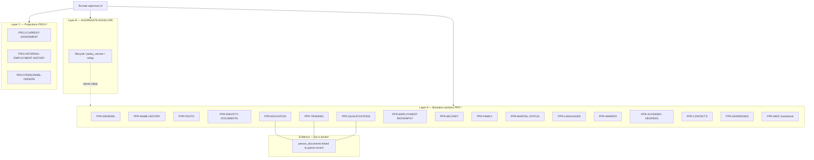
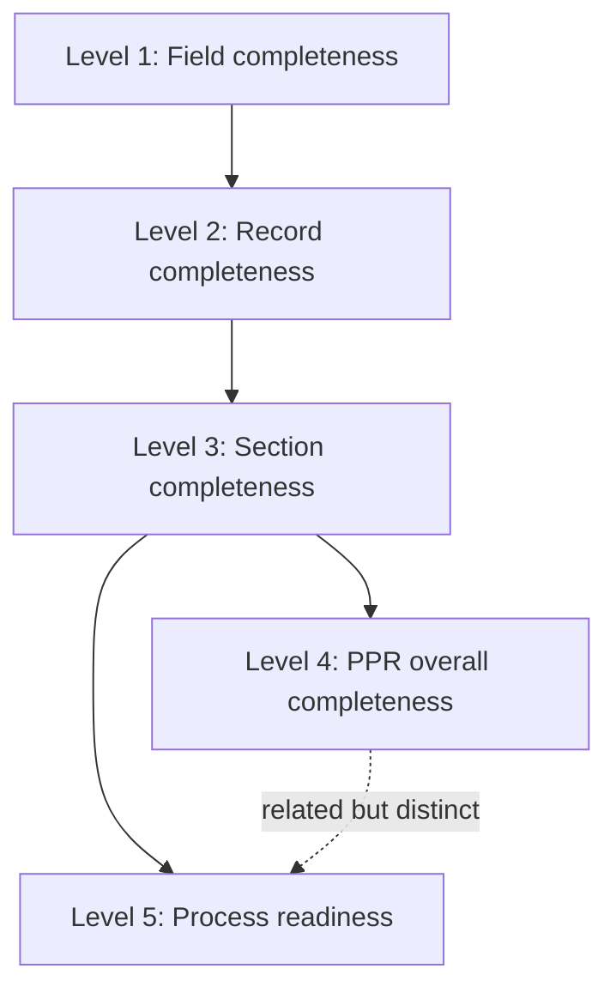
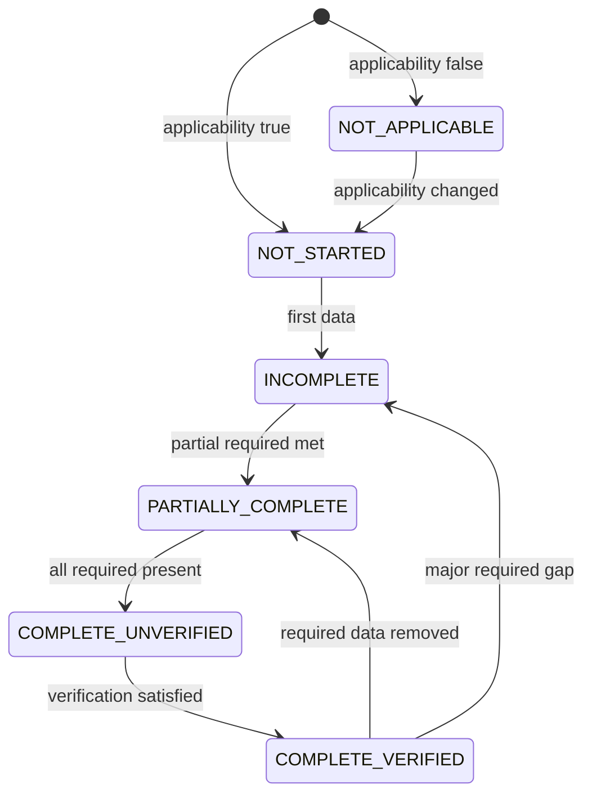
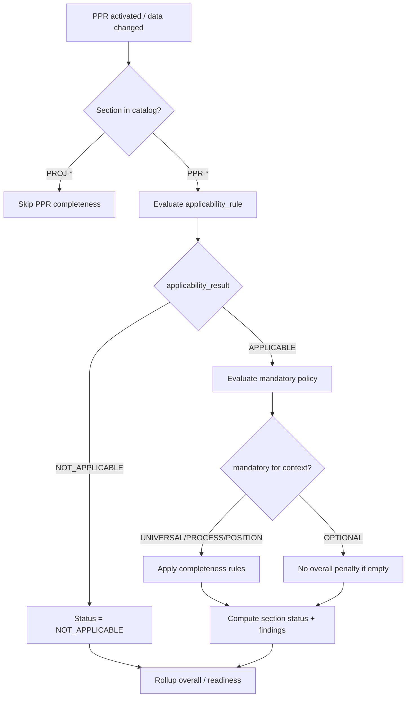
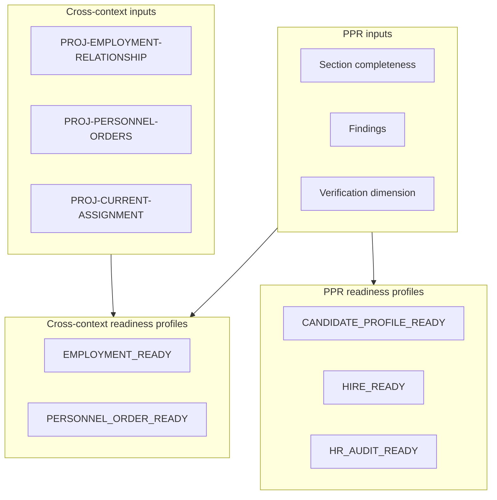
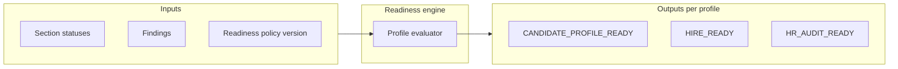
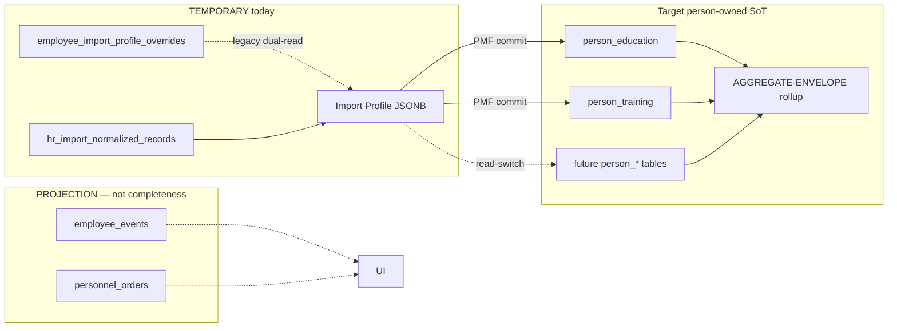

--------------------------------------------------

Document Status

Document:
WP-PR-003-section-catalog-and-completeness-model

Title:
Personnel Personal Record — Section Catalog & Completeness Model

Type:
Architecture Work Package

Status:
Draft — Ready for Review

Revision:
2

Date:
2026-07-15

Parent:
ADR-054 — Personnel Personal Record Aggregate Model

Depends on:
ARCH-002, WP-PR-002 (Completed), ADR-047, WP-HR-CARD-002 (Draft — presentation only)

Purpose:
Normative specification of PPR section catalog and multi-level completeness model
for subsequent implementation. No code, migrations, or API changes in this WP.

--------------------------------------------------

# WP-PR-003 — Section Catalog & Completeness Model

**Date:** 2026-07-15

---

## 1. Purpose and normative base

### 1.1 Purpose

Настоящий документ формально определяет:

- из каких **разделов** (sections) состоит Personnel Personal Record (PPR);
- какие разделы **обязательны** и при каких условиях;
- когда раздел считается **заполненным**;
- как рассчитывается **completeness** на нескольких уровнях;
- что означает **готовность PPR** для различных кадровых процессов.

Документ является нормативной спецификацией для WP-PR-004…006, EPIC-3 (PPR API), EPIC-4 (PMF expansion) и completeness UI (WP-PR-024).

**Out of scope:** DDL, REST paths, UI layout, seed data, изменения ADR-054 или WP-PR-002.

### 1.2 Mandatory references

| Document | Role |
|----------|------|
| [ARCH-002](./ARCH-002-personnel-personal-record-architecture.md) | Aggregate scope; INV-1…INV-9; section boundaries |
| [ADR-054](../adr/ADR-054-personnel-personal-record-aggregate-model.md) | Accepted: domain autonomy + Person-root Phase 1; `person_id` = PPR ID |
| [WP-PR-002](./WP-PR-002-aggregate-boundary-specification.md) | Boundary matrix; section catalog seed §6; AB-1…AB-16 |
| [WP-HR-CARD-002](./WP-HR-CARD-002-unified-personnel-record-card.md) | Presentation layer; PPR-REP-001 — UI ≠ aggregate |
| [ADR-047](../adr/ADR-047-personnel-personal-file-architecture.md) | Personal File sections; Service Record projection |
| [ADR-047 Four-Layer Model](../adr/ADR-047-appendix-four-layer-model.md) | Official form §2.2; import vs target |
| [ADR-PMF-001](../adr/ADR-PMF-001-personnel-migration-framework.md) | PMF commit; `verification_status` on section rows |
| [ADR-EDU-001](../adr/ADR-EDU-001-employee-education-migration-architecture.md) | Education person-owned SoT |

### 1.3 Architectural constraints (non-negotiable)

| Constraint | Source |
|------------|--------|
| PPR keyed by **`person_id`**; `employee_id` не владелец completeness | ADR-054, WP-PR-002 AB-2 |
| Employment Relationship, Personnel Orders, RBAC — **вне** aggregate completeness | WP-PR-002 AB-3…AB-5, AB-8 |
| UI / Employee Card — **projection**, не source of truth | INV-5, PPR-REP-001 |
| Empty ≠ NOT_APPLICABLE | This document §6 |
| Presence ≠ verification | This document §9 |
| Overall completeness ≠ process readiness | This document §8 |
| Процент — вторичная display-метрика | This document §11 |
| UI grouping ≠ domain ownership | This document §2.1 |
| Aggregate envelope ≠ business section | This document §2.0, §3.2 |
| Evidence documents ≠ independent section | This document §2.3 |

---

## 2. Catalog taxonomy

Каталог PPR состоит из **трёх явно разделённых слоёв**. Коды стабильны, нейтральны к UI label и пригодны для API, completeness engine, audit, import mapping и reporting.

### 2.0 Three-layer model

| Layer | Code prefix | Role | Section completeness? | In completeness denominator? |
|-------|-------------|------|----------------------|------------------------------|
| **A — Business sections** | `PPR-*` | Кадровое содержание личного листка | **Yes** (Level 3) | **Yes** (when applicable / mandatory per policy) |
| **B — Aggregate envelope** | `AGGREGATE-ENVELOPE` | Lifecycle, rollup, policy_version, activation | **No** | **No** |
| **C — Related projections** | `PROJ-*` | Employment, orders, RBAC и др. | **No** | **No** |

**AGGREGATE-ENVELOPE** (planned storage: `personnel_record_metadata`) — технический объект внутри aggregate boundary (WP-PR-002 §5.1):

- хранит lifecycle, activation, `policy_version`, completeness rollup;
- **не** является пользовательским разделом личного листка;
- **не** имеет собственного section completeness;
- **не** участвует в completeness denominator.

### 2.1 Architectural principle: UI grouping ≠ domain ownership

Личная карточка может **группировать** поля и вкладки для удобства кадровика (например, «Персональные сведения» как UI-блок). Это **не определяет** domain ownership.

| UI grouping (illustrative) | Domain ownership |
|----------------------------|------------------|
| Вкладка «Персональные данные» | `PPR-GENERAL` + отдельные `PPR-PHOTO`, `PPR-NAME-HISTORY`, `PPR-MARITAL-STATUS` |
| Блок «Образование» | `PPR-EDUCATION` + linked evidence documents |
| Блок «Документы» (composite) | `PPR-IDENTITY-DOCUMENTS` + evidence links on other sections |

Completeness engine оперирует **`section_code`**, не UI label.

### 2.2 Group A — Identity / General (`PPR-GENERAL`)

**Только scalar identity attributes** — собственные атрибуты идентичности:

- ФИО (текущее);
- ИИН;
- дата рождения;
- место рождения;
- гражданство, национальность;
- пол.

**Explicitly NOT in PPR-GENERAL** (отдельные business sections):

| Section | Why separate |
|---------|--------------|
| `PPR-PHOTO` | Отдельный media record + file linkage |
| `PPR-NAME-HISTORY` | 0..N append-only history |
| `PPR-MARITAL-STATUS` | Отдельный lifecycle attribute |

**Owner key:** `person_id`. Часть полей — columns на `persons` (ROOT); дополнительные scalar cadre fields — future columns или envelope-adjacent storage, **не** смешиваются с photo/name/marital sections.

### 2.3 Group B — Identity documents (`PPR-IDENTITY-DOCUMENTS`)

Business section для **документов, удостоверяющих личность**:

- удостоверение личности, паспорт;
- документы о смене ФИО (как identity evidence);
- сроки действия, provenance.

**Note:** employment/order documents — **OUT** (Personnel Orders BC).

### 2.3a Evidence documents (NOT a business section)

Подтверждающие документы (дипломы, сертификаты, категории) — **evidence** для parent section records, **не** самостоятельный кадровый раздел.

| Parent section | Evidence role |
|----------------|---------------|
| `PPR-EDUCATION` | Diploma scan, transcript |
| `PPR-TRAINING` | Certificate of completion |
| `PPR-QUALIFICATIONS` | Category certificate |
| `PPR-ACADEMIC-DEGREES` | Degree confirmation |

**Architectural rules:**

- Evidence хранится через `source_document_id` / `person_documents` linkage на **parent record**;
- Completeness evidence оценивается **внутри parent section** (verification dimension §5, §9);
- **Double counting запрещён** — evidence не создаёт отдельный section completeness и не добавляется в denominator вторично;
- Отсутствие evidence может снижать verification level, но **не** создаёт отдельный «раздел документов» в rollup.

Legacy `employee_documents` (mixed) → reclassify to identity vs evidence-on-parent (WP-PR-002 §5).

### 2.4 Group C — Education (`PPR-EDUCATION`)

- базовое и послевузовское образование;
- учебные заведения, специальность, квалификация;
- дипломы, годы обучения;
- подтверждающие документы.

### 2.5 Group D — Training / Qualification (`PPR-TRAINING`, `PPR-QUALIFICATIONS`)

- повышение квалификации, переподготовка, курсы;
- профессиональные категории, сертификаты;
- сроки действия категорий/сертификатов.

### 2.6 Group E — Employment biography (`PPR-EMPLOYMENT-BIOGRAPHY`)

**Person-owned historical biography** — предыдущие места работы, должности, периоды, основания.

**Critical boundary (WP-PR-002 AB-7, AB-8):**

- **IN PPR:** prior / external employment (`person_external_employment` target);
- **OUT / PROJECTION:** текущее назначение, internal in-org career (`employee_events`, `person_assignments`).

Operational Employment Relationship **не входит** в aggregate completeness.

### 2.7 Group F — Military records (`PPR-MILITARY`)

- воинский учёт, категория, звание, ВУС, статус;
- применимость по полу, возрасту, гражданству — **TBD** (Open Question §17).

### 2.8 Group G — Family / Relatives (`PPR-FAMILY`, `PPR-MARITAL-STATUS`)

- супруг(а), дети, родители, иные близкие родственники;
- ФИО, родство, дата рождения;
- место работы/учёбы — **TBD** по нормативным требованиям ММЦ.

### 2.9 Group H — Languages (`PPR-LANGUAGES`)

- владение языками, уровень, подтверждение;
- язык делопроизводства — optional metadata on `PPR-GENERAL` or dedicated field.

### 2.10 Group I — Awards / Academic / transitional misc (`PPR-AWARDS`, `PPR-ACADEMIC-DEGREES`, `PPR-MISC`)

- награды;
- учёные степени и звания;
- профессиональные членства, публикации — **TBD** scope (отдельный `section_code` при стабилизации).

**PPR-MISC — transitional only (D-13):**

- **Запрещено** использовать `PPR-MISC` как постоянное хранилище нового кадрового содержания или «JSON-корзину»;
- любые **устойчивые** кадровые данные оформляются **отдельным `section_code`** и typed storage;
- `PPR-MISC` допустим только для legacy import bootstrap (`notes_raw`) до выделения typed section;
- completeness по `PPR-MISC` **не** блокирует readiness profiles.

### 2.11 Group J — Person-owned contacts and addresses (`PPR-CONTACTS`, `PPR-ADDRESSES`)

**Boundary (WP-PR-002, ADR-054):**

| Data | Classification | Storage |
|------|----------------|---------|
| **Person-owned cadre contacts** (для личного листка) | **IN PPR** — `PPR-CONTACTS` | `person_contacts` (target) |
| **Operational contact directory** | **OUT** — `contacts` table | Operational contour; optional `person_id` link only |
| **Person-owned cadre addresses** (прописка, проживание) | **IN PPR** — `PPR-ADDRESSES` | `person_addresses` (target) |
| **Operational / delivery addresses** | **OUT** | Not PPR completeness scope |

Completeness engine оценивает **только** `PPR-CONTACTS` / `PPR-ADDRESSES`. Наличие operational `contacts` **не** засчитывается как заполнение PPR section.

### 2.12 Layer B — Aggregate envelope (`AGGREGATE-ENVELOPE`)

Planned storage: `personnel_record_metadata`. Содержимое:

- lifecycle state (Candidate / Employee / Former Employee);
- activation timestamp;
- overall completeness rollup (computed snapshot);
- `policy_version`;
- aggregate-level provenance summary.

**Classification:** IN aggregate boundary; **не** business section; **не** aggregate root (WP-PR-002 §5.1).

### 2.13 Layer C — Related projections (explicitly OUT of aggregate)

| Projection code | Content | BC |
|-----------------|---------|-----|
| `PROJ-CURRENT-ASSIGNMENT` | Текущая должность, подразделение, ставка | Employment |
| `PROJ-EMPLOYMENT-RELATIONSHIP` | Operational employment state | Employment |
| `PROJ-PERSONNEL-ORDERS` | Кадровые приказы | Personnel Orders |
| `PROJ-INTERNAL-EMPLOYMENT-HISTORY` | In-org career timeline | Employment (projection) |
| `PROJ-PLATFORM-ROLE` | RBAC / operational roles | Security |
| `PROJ-POSITION-CABINET` | Задачи, статистика должности | ARCH-001 |
| `PROJ-USER-ACCOUNT` | Учётная запись | Security |
| `PROJ-ORG-VISIBILITY` | Организационная видимость | Personnel Visibility |

**Completeness rule:** findings `EMPLOYMENT_PROJECTION_UNAVAILABLE` — **INFO/WARNING**; не влияют на PPR overall completeness denominator.

### 2.14 Catalog structure diagram



---

## 3. Section catalog matrix

**Legend — aggregate status:** IN | REFERENCE | PROJECTION | DERIVED | TEMPORARY | AUDIT | ROOT (Person only)

**Legend — mandatory policy:** UNIVERSAL | LIFECYCLE | PROCESS | POSITION | CONDITIONAL | OPTIONAL | NOT_APPLICABLE

**Legend — existing implementation:**

| Code | Meaning |
|------|---------|
| `PERSON_TABLE` | `persons` columns |
| `PMF_TABLE` | person-owned committed table |
| `IMPORT_JSON` | Import Profile / overrides JSONB |
| `IMPORT_NORM` | `hr_import_normalized_records` |
| `EMP_DOC` | `employee_documents` (employee-scoped) |
| `NONE` | Not implemented |
| `PROJECTION` | Read-only composite |

### 3.1 Business section catalog (Layer A — `PPR-*`)

**Count:** 17 business sections. Mandatory policy column values — **architectural placeholders**; конкретные HR-правила — **policy TBD** (§7.0).

| section_code | RU название | EN name | domain classification | aggregate status | cardinality | owner key | canonical source | existing implementation | planned storage | mandatory policy (arch.) | applicability rule | completeness rule | validation rule | provenance / evidence | sensitivity class | retention notes | lifecycle notes | dependencies | future WP |
|--------------|-------------|---------|----------------------|------------------|-------------|-----------|------------------|---------------------------|-----------------|--------------------------|--------------------|--------------------|-----------------|----------------------|-------------------|-----------------|-----------------|--------------|-----------|
| **PPR-GENERAL** | Персональные сведения | General identity (scalar only) | identity | IN (partial on ROOT) | 0..1 | person_id | `persons` | PERSON_TABLE + IMPORT_JSON `basic` | `persons` columns | UNIVERSAL * | Always when PPR activated | Scalar fields per policy **TBD** | IIN format; birth_date ≤ today | entered/imported | RESTRICTED — PII | Permanent | Survives rehire | AGGREGATE-ENVELOPE activation | WP-PR-010, EPIC-10 |
| **PPR-NAME-HISTORY** | Прежние ФИО | Previous names | identity | IN | 0..N | person_id | person_name_history | NONE | person_name_history | CONDITIONAL * | If name change declared | Records per policy **TBD** | date order | identity doc evidence optional | RESTRICTED | Permanent | Append-only | PPR-IDENTITY-DOCUMENTS | EPIC-4 |
| **PPR-PHOTO** | Фотография | Photo | identity | IN | 0..1 | person_id | person_photo | NONE | person_photo + file ref | OPTIONAL | policy TBD | Present or waived **TBD** | image format | uploaded | RESTRICTED | Replaceable | Current pointer | — | EPIC-4 |
| **PPR-IDENTITY-DOCUMENTS** | Документы, удостоверяющие личность | Identity documents | documents | IN | 0..N | person_id | person_documents (identity kind) | EMP_DOC + IMPORT_NORM | person_documents | PROCESS * | policy TBD | Records + expiry per policy **TBD** | expiry rules | verified against scan | RESTRICTED | Legal hold | Per-document | PPR-GENERAL | EPIC-4, WP-PR-070 |
| **PPR-CONTACTS** | Кадровые контакты | Cadre contact information | contact | IN | 0..N | person_id | person_contacts | IMPORT_JSON `phone_raw`; `contacts` is **OUT** | person_contacts | CONDITIONAL * | Person-owned cadre only | Per policy **TBD** | phone/email format | entered/imported | INTERNAL | Updateable | Active preferred | — | EPIC-4 |
| **PPR-ADDRESSES** | Кадровые адреса | Cadre addresses | contact | IN | 0..N | person_id | person_addresses | NONE | person_addresses | CONDITIONAL * | policy TBD | Per policy **TBD** | structured address | entered/imported | RESTRICTED | History optional | Current + history | — | EPIC-4 |
| **PPR-EDUCATION** | Образование | Education | education | IN | 0..N | person_id | person_education | PMF_TABLE + IMPORT_JSON | person_education | UNIVERSAL / POSITION * | policy TBD | Records per policy **TBD**; evidence via linked docs | institution; dates | PMF/import; evidence on row | INTERNAL | Permanent | lifecycle_status per row | evidence linkage | EPIC-4 |
| **PPR-TRAINING** | Обучение | Training | training | IN | 0..N | person_id | person_training | PMF_TABLE + IMPORT_JSON | person_training | OPTIONAL / POSITION * | policy TBD | 0..N if optional | hours; dates; expiry | verification_status; evidence | INTERNAL | Permanent | lifecycle_status | PPR-QUALIFICATIONS | EPIC-4 |
| **PPR-QUALIFICATIONS** | Квалификация / категория | Qualifications | qualification | IN | 0..N | person_id | person_qualifications | IMPORT_JSON `category_records` | person_qualifications | POSITION * | policy TBD | When POSITION rule fires **TBD** | expiry; category code | import + evidence | INTERNAL | Until superseded | Active/expired | evidence linkage | EPIC-4 |
| **PPR-ACADEMIC-DEGREES** | Учёные степени и звания | Academic degrees | academic | IN | 0..N | person_id | person_academic_degrees | IMPORT_JSON `degrees` | person_academic_degrees | OPTIONAL | If claimed | 0..N | degree type enum | import/manual; evidence | INTERNAL | Permanent | Append-only | evidence linkage | EPIC-4 |
| **PPR-EMPLOYMENT-BIOGRAPHY** | Трудовая биография (external) | Prior employment | employment_history | IN | 0..N | person_id | person_external_employment | IMPORT_JSON `experience_raw` | person_external_employment | CONDITIONAL * | First hire attestation **TBD** | Episodes or attestation **TBD** | date order | import/manual | INTERNAL | Permanent | Per episode | — | EPIC-4 |
| **PPR-MILITARY** | Воинский учёт | Military registration | military | IN | 0..1 | person_id | person_military_service | NONE | person_military_service | CONDITIONAL * | legal TBD | Fill or NOT_APPLICABLE | applicability engine | document optional | RESTRICTED | Permanent | Re-evaluate on change | PPR-GENERAL inputs | EPIC-4; OQ-3 |
| **PPR-MARITAL-STATUS** | Семейное положение | Marital status | family | IN | 0..1 | person_id | person_marital_status | NONE | person_marital_status | CONDITIONAL * | policy TBD | enum when mandatory **TBD** | enum | self-declaration / HR | RESTRICTED | Point-in-time | Update on change | PPR-FAMILY | EPIC-4 |
| **PPR-FAMILY** | Родственники | Relatives | family | IN | 0..N | person_id | person_relatives | NONE | person_relatives | CONDITIONAL * | scope TBD OQ-4 | Records per applicability | relationship enum | entered/imported | RESTRICTED | Permanent | Per relative | PPR-MARITAL-STATUS | EPIC-4 |
| **PPR-LANGUAGES** | Иностранные языки | Languages | languages | IN | 0..N | person_id | person_languages | NONE | person_languages | OPTIONAL | per form TBD | 0..N allowed | proficiency | self / certificate | INTERNAL | Permanent | — | — | EPIC-4 |
| **PPR-AWARDS** | Награды | Awards | awards | IN | 0..N | person_id | person_awards | IMPORT_JSON `award_records` | person_awards | OPTIONAL | always applicable | 0..N allowed | award date | import/manual | INTERNAL | Permanent | Append-only | — | EPIC-4 |
| **PPR-MISC** | Legacy misc (transitional) | Transitional misc | extension | IN | 0..N | person_id | **deprecated** — use typed section | IMPORT_JSON `notes_raw` | **do not expand** | OPTIONAL | legacy import only | **Not in readiness denominator** | — | manual | INTERNAL | Migrate out | — | — | EPIC-4 |

\* **mandatory policy (arch.)** — architectural classification only; конкретные обязательные наборы — **HR policy TBD** (§7.0, OQ-1, OQ-2).

### 3.2 Aggregate envelope catalog (Layer B)

| envelope_code | RU название | EN name | aggregate status | cardinality | owner key | planned storage | section completeness? | in denominator? | contents |
|---------------|-------------|---------|------------------|-------------|-----------|-----------------|----------------------|-------------------|----------|
| **AGGREGATE-ENVELOPE** | Конверт агрегата | Aggregate envelope | IN (envelope) | 1..1 | person_id | personnel_record_metadata | **No** | **No** | lifecycle, activation, policy_version, rollup snapshot, aggregate provenance summary |

### 3.3 Projection catalog (Layer C — excluded from PPR completeness)

| section_code | RU название | EN name | aggregate status | owner key | canonical source | existing implementation | participates in PPR completeness |
|--------------|-------------|---------|------------------|-----------|------------------|---------------------------|----------------------------------|
| **PROJ-CURRENT-ASSIGNMENT** | Текущее назначение | Current assignment | PROJECTION | employee_id → person_id | employees, person_assignments | employees snapshot | **No** |
| **PROJ-INTERNAL-EMPLOYMENT-HISTORY** | Послужной список (внутренний) | Internal service record | PROJECTION | person_id | employee_events, orders | ADR-047 timeline SQL | **No** |
| **PROJ-PERSONNEL-ORDERS** | Кадровые приказы | Personnel orders | OUT | employee_id | personnel_orders | Implemented | **No** |
| **PROJ-EMPLOYMENT-RELATIONSHIP** | Трудовые отношения | Employment relationship | OUT | person_id | person_assignments | Partial | **No** |
| **PROJ-PLATFORM-ROLE** | Роли платформы | Platform roles | OUT | user/employee | RBAC | Implemented | **No** |
| **PROJ-POSITION-CABINET** | Кабинет должности | Position cabinet | OUT | position_id | ARCH-001 | Implemented | **No** |
| **PROJ-USER-ACCOUNT** | Учётная запись | User account | OUT | user_id | users | Implemented | **No** |
| **PROJ-ORG-VISIBILITY** | Организационная видимость | Org visibility | OUT | employee_id | visibility resolver | Implemented | **No** |

### 3.4 Staging / temporary artifacts (not section SoT)

| Artifact | Maps to sections | Status | Notes |
|----------|------------------|--------|-------|
| Import Profile `basic`, `education_records`, … | Multiple PPR-* | TEMPORARY | Bootstrap until read-switch |
| `employee_import_profile_overrides` | Portfolio JSONB | TEMPORARY | Employee-scoped legacy |
| `hr_import_normalized_records` | Typed fragments | TEMPORARY | Pre-PMF |
| PMF runs/items | Migration audit | TEMPORARY | Write gateway only |
| `personnel_record_events` | All IN sections | AUDIT | Provenance journal; not content SoT |

---

## 4. Completeness hierarchy

Completeness **не сводится** к проценту заполненных полей. Модель — **многоуровневая**, воспроизводимая, с policy version.



### 4.1 Level 1 — Field completeness

| Aspect | Definition |
|--------|------------|
| **Inputs** | Section schema; field mandatory flags; applicability result; current field values |
| **Status** | Per field: `EMPTY` \| `FILLED` \| `NOT_APPLICABLE` \| `INVALID` |
| **Computation** | Rule engine evaluates each field path against section schema and policy |
| **Mandatory** | Field-level flags from policy (not hardcoded in UI) |
| **Applicability** | Fields in non-applicable sections → `NOT_APPLICABLE` |
| **Findings** | `REQUIRED_FIELD_MISSING`, format violations → INFO/WARNING/BLOCKING per policy |

### 4.2 Level 2 — Record completeness

| Aspect | Definition |
|--------|------------|
| **Inputs** | Field completeness for one row (education row, relative row, …) |
| **Status** | Uses section completeness enum (§5) at record grain |
| **Computation** | Aggregate field findings; require linked document if policy says so |
| **Mandatory** | Record type rules (e.g. basic education record) |
| **Findings** | `RECORD_UNVERIFIED`, `DOCUMENT_EXPIRED`, `DATE_RANGE_INVALID`, `DUPLICATE_RECORD` |

### 4.3 Level 3 — Section completeness

| Aspect | Definition |
|--------|------------|
| **Inputs** | All active records in section; applicability; verification states |
| **Status** | Section completeness enum (§5) |
| **Computation** | See §3.1 completeness_rule column; NOT_APPLICABLE sections excluded from penalty |
| **Mandatory** | Section mandatory policy (§7) |
| **Findings** | Section-scoped; include `SECTION_NOT_APPLICABLE` when evaluated |

### 4.4 Level 4 — PPR overall completeness

| Aspect | Definition |
|--------|------------|
| **Inputs** | All applicable section statuses; open findings; verification rollup |
| **Status** | Rollup enum + `policy_version` |
| **Computation** | See §11; **no single percentage as primary** |
| **Output** | `status`, `section_summary[]`, `blocking_findings[]`, `warnings[]`, `policy_version` |
| **Display** | Optional secondary `completion_ratio` for UX only |

### 4.5 Level 5 — Process readiness

| Aspect | Definition |
|--------|------------|
| **Inputs** | PPR section completeness + **cross-context inputs** (§8.4) + process profile |
| **Status** | Per profile: **`ReadinessStatus`** — `NOT_READY` \| `READY_WITH_WARNINGS` \| `READY` \| `BLOCKED` |
| **Computation** | Profile-specific required sections/fields; **BLOCKED only at this level** |
| **Note** | PPR may be `PARTIALLY_COMPLETE` overall but `READY` for CANDIDATE_PROFILE_READY |

**Separation:** `CompletenessStatus` (Levels 2–4) **не** использует `BLOCKED`. `BLOCKED` — только `ReadinessStatus` (Level 5), когда policy profile так определяет.

---

## 5. Completeness and quality dimensions

Completeness и quality/review — **разные измерения**. Enum completeness **не является ordinal scale** («выше/ниже»); переходы описывают наполненность, не качество.

### 5.1 CompletenessStatus (Levels 2–4)

Normative enum **`CompletenessStatus`** — record, section, overall rollup.

| Status | Semantics | Assignment conditions | Allowed transitions |
|--------|-----------|----------------------|---------------------|
| **NOT_APPLICABLE** | Section/field does not apply | Applicability rule → false | → NOT_STARTED if applicability changes |
| **NOT_STARTED** | Applicable; no data | Zero active records; no attestation | → INCOMPLETE, PARTIALLY_COMPLETE, COMPLETE_* |
| **INCOMPLETE** | Missing required elements | Required fields/records absent per policy | → PARTIALLY_COMPLETE, COMPLETE_* |
| **PARTIALLY_COMPLETE** | Partial required set met | Some mandatory items missing | → COMPLETE_UNVERIFIED |
| **COMPLETE_UNVERIFIED** | Required set present; verification not satisfied | Data present; verification dimension ≠ verified | → COMPLETE_VERIFIED |
| **COMPLETE_VERIFIED** | Required set + verification satisfied | Per verification policy **TBD** | → lower states if data changes |

**Explicitly NOT in CompletenessStatus:**

| Excluded value | Where it belongs |
|----------------|------------------|
| **BLOCKED** | `ReadinessStatus` (Level 5) only — §5.3 |
| **REQUIRES_REVIEW** | `ReviewStatus` (quality dimension) — §5.2 |

**Principle:** status always accompanied by `findings[]`; enum alone **не** объясняет причину.

### 5.2 ReviewStatus (quality dimension — orthogonal)

**Review / quality — не «больше» и не «меньше» completeness.** Это отдельное измерение.

| ReviewStatus | Semantics | Typical triggers |
|--------------|-----------|------------------|
| **OK** | No review flag | Clean data |
| **NEEDS_REVIEW** | HR must inspect | Import conflict, low confidence, pending override |
| **CONFLICT** | Mutually inconsistent sources | SOURCE_CONFLICT finding |
| **REJECTED** | HR rejected record | Verification rejected |

Section may be `COMPLETE_UNVERIFIED` **and** `NEEDS_REVIEW` simultaneously — это **не противоречие**.

**Mapping (Phase 1):** `person_education.verification_status = needs_attention` → ReviewStatus `NEEDS_REVIEW`; completeness remains driven by field/record rules separately.

### 5.3 ReadinessStatus (Level 5 only)

| ReadinessStatus | Semantics |
|-----------------|-----------|
| **NOT_READY** | Profile requirements not met |
| **READY_WITH_WARNINGS** | Profile met; non-blocking findings open |
| **READY** | Profile satisfied |
| **BLOCKED** | **Process blocked** — BLOCKING finding affects **this profile** per policy |

**Rule:** BLOCKING finding **не** автоматически делает section `BLOCKED`. It may set **specific readiness profiles** to `BLOCKED` when policy defines that mapping.

### 5.4 OPTIONAL sections and overall completeness (D-14)

| Question | Rule |
|----------|------|
| OPTIONAL in overall **status** denominator? | **No** — empty OPTIONAL does **not** downgrade overall completeness status |
| OPTIONAL in **coverage** metric? | **Yes (informational)** — may appear in `completion_ratio` as optional coverage, separately labeled |
| OPTIONAL in **readiness**? | Only when **process profile explicitly lists** the section |
| Empty OPTIONAL | Valid state: section `NOT_STARTED` or `COMPLETE_*` with zero records; **no penalty** to overall |

### 5.5 Status transition diagram (section completeness only)



ReviewStatus transitions — **independent** parallel state (not shown).

---

## 6. Applicability model

Раздел может быть необязательным потому что **неприменим**, а не потому что **пуст**.

### 6.1 Applicability evaluation contract

| Field | Type | Description |
|-------|------|-------------|
| `applicability_rule_code` | string | Stable rule id (e.g. `MILITARY_KZ_CITIZEN_MALE_18_50`) |
| `section_code` | string | Target section |
| `applicability_result` | enum | `APPLICABLE` \| `NOT_APPLICABLE` \| `UNKNOWN` |
| `reason` | string / message_key | Human-readable explanation |
| `evaluated_at` | datetime | Evaluation timestamp |
| `evaluated_by` | string | `system` \| actor_id |
| `rule_version` | string | Policy version for reproducibility |

### 6.2 Example rules (illustrative — legal validation TBD)

| applicability_rule_code | Section | Condition sketch | Result |
|-------------------------|---------|------------------|--------|
| `MILITARY_DEFAULT` | PPR-MILITARY | Sex, age, citizenship per **TBD** legal | APPLICABLE or NOT_APPLICABLE |
| `FAMILY_FORM_REQUIRED` | PPR-FAMILY | Lifecycle = Employee AND org policy **TBD** | APPLICABLE |
| `TRAINING_CANDIDATE` | PPR-TRAINING | Lifecycle = Candidate | NOT_APPLICABLE or OPTIONAL |
| `EMPLOYMENT_BIO_FIRST_HIRE` | PPR-EMPLOYMENT-BIOGRAPHY | Attestation «нет стажа» allowed | APPLICABLE with empty allowed |
| `QUALIFICATION_MEDICAL_POSITION` | PPR-QUALIFICATIONS | Position profession code in set **TBD** | APPLICABLE |

**Rule:** организационные правила **не зашиваются** в `section_code`; только в policy rules keyed by `applicability_rule_code`.

### 6.3 Applicability + mandatory evaluation flow



---

## 7. Mandatory policy

### 7.0 Architectural contract vs HR policy (critical)

| Layer | What this WP defines | What requires separate HR/legal approval |
|-------|---------------------|------------------------------------------|
| **Architectural contract** | Policy types; evaluation flow; separation completeness/readiness; OPTIONAL rules; evidence model | — |
| **HR policy content** | — | Which sections mandatory for ММЦ; required fields per profile; verification authority |

**Illustrative examples** in §7.2, §8.2 marked **(illustrative — policy TBD)**. They **не** утверждают обязательность образования, документов, контактов или адресов для ММЦ.

### 7.1 Policy types (architectural)

| Policy type | Meaning | Example |
|-------------|---------|---------|
| **UNIVERSAL** | Required for any activated PPR when applicable | PPR-GENERAL core identity |
| **LIFECYCLE** | Required when lifecycle state matches | Candidate minimum set |
| **PROCESS** | Required for specific readiness profile *(illustrative)* | e.g. HIRE_READY may list identity documents — **policy TBD** |
| **POSITION / PROFESSION** | Required when position/profession rule fires | PPR-QUALIFICATIONS for physicians **TBD** |
| **CONDITIONAL** | Required when applicability + condition | PPR-MILITARY when applicable |
| **OPTIONAL** | May be empty without overall penalty | PPR-LANGUAGES — §5.4 |
| **NOT_APPLICABLE** | Section excluded | After applicability false |

### 7.2 Illustrative scenarios (policy TBD — not approved)

| Scenario | Overall PPR (illustrative) | Profile (illustrative) |
|----------|---------------------------|------------------------|
| Candidate; GENERAL complete; EDUCATION empty | PARTIALLY_COMPLETE | CANDIDATE_PROFILE_READY may be READY **if policy excludes EDUCATION** |
| Employee; QUALIFICATIONS expired | PARTIALLY_COMPLETE | Cross-context profile may be BLOCKED **if policy requires valid category** |
| Military NOT_APPLICABLE | Not penalized in denominator | Excluded from profile requirements |

---

## 8. Process readiness model

Readiness profiles — **data-driven** (future storage); не hardcoded в UI.

### 8.0 PPR readiness vs cross-context readiness (D-15)

| Class | Scope | Inputs | Examples |
|-------|-------|--------|----------|
| **PPR readiness** | Personnel Personal Record data only | Layer A section completeness + findings + verification | CANDIDATE_PROFILE_READY, HIRE_READY, HR_AUDIT_READY, PERSONAL_RECORD_EXPORT_READY |
| **Cross-context readiness** | PPR + other bounded contexts | PPR inputs **plus** Employment / Orders / operational projections | EMPLOYMENT_READY, PERSONNEL_ORDER_READY |

**Rule:** PPR completeness — **один из inputs**, не единственный. Cross-context profiles **must declare** non-PPR inputs explicitly.



### 8.1 Readiness profile catalog

| profile_code | Class | RU название | Purpose | Owner | Versioning |
|--------------|-------|-------------|---------|-------|------------|
| **CANDIDATE_PROFILE_READY** | PPR | Готовность анкеты кандидата | Intake / pre-HIRE collection | HR intake policy **TBD** | `policy_version` |
| **HIRE_READY** | PPR | Готовность к приёму | Minimum PPR dossier before HIRE | HR + legal **TBD** | Same |
| **EMPLOYMENT_READY** | **Cross-context** | Готовность активации Employment | Post-HIRE activation | HR **TBD** | Same |
| **PERSONNEL_ORDER_READY** | **Cross-context** | Готовность к выпуску приказа | Order issuance | HR **TBD** | Same |
| **HR_AUDIT_READY** | PPR | Готовность к кадровой проверке | Audit / inspection | HR compliance **TBD** | Same |
| **PERSONAL_RECORD_EXPORT_READY** | PPR | Готовность к экспорту листка | PDF / print export | HR **TBD** | Same |

### 8.2 Readiness profile matrix (illustrative — policy TBD)

> **Not approved HR policy.** Tables below demonstrate **profile structure only**.

| profile_code | mandatory PPR sections (illustrative) | cross-context inputs (if any) | verification (illustrative) | may BLOCK profile when |
|--------------|--------------------------------------|------------------------------|----------------------------|------------------------|
| **CANDIDATE_PROFILE_READY** | PPR-GENERAL * | none | none Phase 1 * | BLOCKING finding on listed sections * |
| **HIRE_READY** | PPR-GENERAL, PPR-IDENTITY-DOCUMENTS, PPR-EDUCATION * | none | per policy TBD * | BLOCKING finding per profile policy * |
| **EMPLOYMENT_READY** | inherits HIRE_READY * + PPR-QUALIFICATIONS if POSITION rule * | PROJ-EMPLOYMENT-RELATIONSHIP active * | category not expired * | DOCUMENT_EXPIRED; missing Employment projection * |
| **PERSONNEL_ORDER_READY** | per order type TBD * | PROJ-PERSONNEL-ORDERS state * | per order TBD * | order-specific BLOCKING * |
| **HR_AUDIT_READY** | all applicable UNIVERSAL + LIFECYCLE * | none | COMPLETE_VERIFIED on critical * | INCOMPLETE on mandatory * |
| **PERSONAL_RECORD_EXPORT_READY** | template-specific PPR sections * | none | snapshot timestamp | missing template sections * |

\* **policy TBD** — requires HR/legal validation (OQ-1, OQ-2).

### 8.3 Process readiness evaluation



---

## 9. Verification and provenance

### 9.1 Data quality states (orthogonal to completeness)

| State | Meaning |
|-------|---------|
| **entered** | Manual HR entry |
| **imported** | From import pipeline / PMF |
| **normalized** | Parsed from raw text with confidence |
| **confirmed_by_employee** | Self-service attestation **TBD** |
| **reviewed_by_HR** | HR reviewed, not necessarily document-verified |
| **verified_against_document** | Linked confirming document |
| **derived** | Computed from other authoritative source |

**Example:** diploma entered manually without scan → completeness `COMPLETE_UNVERIFIED`; ReviewStatus may be `NEEDS_REVIEW`; verification dimension separate.

**Alignment:** `person_education.verification_status` maps to **verification/review dimensions**, not to CompletenessStatus ordinal rank.

### 9.2 Provenance contract (architectural — no DDL)

Minimum fields per section record or aggregate envelope:

| Field | Description |
|-------|-------------|
| `source_type` | entered \| imported \| normalized \| derived \| manual_correction |
| `source_id` | Batch id, run id, or external ref |
| `source_document_id` | Link to person_documents (evidence on parent record) |
| `entered_by` | Actor |
| `entered_at` | Timestamp |
| `reviewed_by` | HR reviewer |
| `reviewed_at` | Timestamp |
| `verified_by` | Verifier |
| `verified_at` | Timestamp |
| `verification_method` | document_scan \| original_seen \| electronic_registry **TBD** |
| `confidence` | 0..1 for normalized imports |
| `last_changed_at` | Last mutation |

**Aggregate events:** `personnel_record_events` — AUDIT trail (WP-PR-002 AB-12); complements but does not replace provenance columns.

---

## 10. Findings model

Completeness must explain **what** is missing or wrong.

**Severity enum (normative):** `INFO` \| `WARNING` \| `BLOCKING` only. Findings **do not** use CompletenessStatus or ReviewStatus as severity values.

| Severity | Affects CompletenessStatus? | Affects ReadinessStatus? |
|----------|----------------------------|--------------------------|
| **INFO** | No direct change | No |
| **WARNING** | No mandatory downgrade | May → READY_WITH_WARNINGS |
| **BLOCKING** | May prevent COMPLETE_* on affected section | May → **BLOCKED** for profiles **listed in policy** |

### 10.1 Finding contract

| Field | Type | Description |
|-------|------|-------------|
| `finding_code` | string | Stable code |
| `section_code` | string | PPR-* section |
| `field_path` | string | JSON path or column |
| `severity` | enum | INFO \| WARNING \| BLOCKING |
| `message_key` | string | i18n key |
| `status` | enum | OPEN \| RESOLVED \| WAIVED **TBD** |
| `detected_at` | datetime | Detection time |
| `resolved_at` | datetime | Nullable |
| `source` | string | rule engine \| import \| manual |
| `process_profile` | string | Optional profile scope |

### 10.2 Finding codes (minimum catalog)

| finding_code | Severity default | Description |
|--------------|------------------|-------------|
| `REQUIRED_FIELD_MISSING` | BLOCKING | Mandatory field empty |
| `DOCUMENT_EXPIRED` | BLOCKING or WARNING | Linked document past expiry |
| `RECORD_UNVERIFIED` | WARNING | Data present; not verified |
| `DATE_RANGE_INVALID` | BLOCKING | end < start |
| `DUPLICATE_RECORD` | WARNING | Potential duplicate rows |
| `SOURCE_CONFLICT` | WARNING | Import vs committed mismatch; triggers ReviewStatus NEEDS_REVIEW |
| `PERSON_LINK_MISSING` | BLOCKING | employee without resolvable person_id |
| `SECTION_NOT_APPLICABLE` | INFO | Applicability evaluated false |
| `EMPLOYMENT_PROJECTION_UNAVAILABLE` | INFO | Projection missing; not PPR gap |
| `POLICY_VERSION_MISMATCH` | WARNING | Stale evaluation |
| `MERGE_RECONCILIATION_REQUIRED` | BLOCKING | Post-merge duplicate sections |

---

## 11. Overall completeness

### 11.1 Rollup rules

1. **NOT_APPLICABLE** sections **не снижают** completeness denominator.
2. **OPTIONAL** sections **не снижают** overall completeness status when empty (§5.4).
3. **AGGREGATE-ENVELOPE** **не** входит в denominator.
4. **BLOCKING finding** affects **ReadinessStatus** per profile policy — **not** a global rule «any BLOCKING → overall BLOCKED».
5. **Primary output** — not percentage:

```json
{
  "person_id": 12345,
  "policy_version": "ppr-completeness-2026-07-15",
  "overall_status": "PARTIALLY_COMPLETE",
  "completion_ratio": 0.62,
  "completion_ratio_scope": "mandatory_applicable_sections_only",
  "review_summary": {},
  "section_summary": [],
  "readiness_profiles": {},
  "blocking_findings": [],
  "warnings": [],
  "evaluated_at": "2026-07-15T12:00:00Z"
}
```

6. `completion_ratio` — **secondary**; scope = mandatory applicable sections only; optional coverage reported separately.
7. **Verified vs unverified** — separate flags in section_summary; overall may cap at COMPLETE_UNVERIFIED until verify policy satisfied **TBD**.
8. Result **reproducible** given same inputs + `policy_version`.
9. Employment projections **excluded** from PPR overall denominator.

### 11.2 Overall status derivation (normative sketch)

| Condition | overall_status |
|-----------|----------------|
| All applicable mandatory sections NOT_STARTED | NOT_STARTED |
| Any applicable mandatory section INCOMPLETE | INCOMPLETE or PARTIALLY_COMPLETE |
| All applicable mandatory sections ≥ COMPLETE_UNVERIFIED | COMPLETE_UNVERIFIED |
| All applicable mandatory + verify policy satisfied **TBD** | COMPLETE_VERIFIED |

**Not derived here:** `ReadinessStatus.BLOCKED` — evaluated per profile (§8). Open ReviewStatus flags **do not** automatically change CompletenessStatus.

---

## 12. Lifecycle interaction

Completeness **не изменяет** lifecycle автоматически — только отдельная domain command / rule (OAD-2).

| Lifecycle state | Completeness behavior |
|-----------------|----------------------|
| **Candidate** | CANDIDATE_PROFILE_READY, HIRE_READY profiles active; reduced mandatory set |
| **Draft / Collecting** | Metadata activation; sections editable; completeness informational |
| **Active Employee** | Full applicable catalog; POSITION rules may activate |
| **Former Employee** | Readiness profiles for rehire; PPR completeness preserved |
| **Archived** | Evaluation read-only; export profile may still apply |
| **Merged Person** | Survivor inherits completeness; reconciliation required (§13) |

Lifecycle changes **which readiness profiles** are evaluated, not the aggregate identifier.

---

## 13. Person merge and identity

| Rule | Specification |
|------|---------------|
| Completeness keyed by **`person_id`** | ADR-054 Phase 1 |
| **`employee_id` not owner** | Completeness survives employee closure |
| **Rehire** | Same PPR completeness state; no new profile |
| **Person merge** | Survivor `person_id` retains PPR; duplicate sections → reconciliation |
| **Findings & provenance** | Merged from both; `MERGE_RECONCILIATION_REQUIRED` until resolved |
| **Events** | `personnel_record_events` remain on survivor person_id after merge redirect **TBD** implementation |


---

## 14. UI projection (Личная карточка)

Per [WP-HR-CARD-002](./WP-HR-CARD-002-unified-personnel-record-card.md) and PPR-REP-001 — UI displays completeness; **does not own** it.

### 14.1 Minimum presentation elements

| Element | Source |
|---------|--------|
| Overall PPR status badge | Level 4 rollup |
| Per-section status chips | Level 3 section_summary |
| Blocking findings list | findings WHERE severity=BLOCKING |
| Warnings list | findings WHERE severity=WARNING |
| CTA to incomplete section | section_code → nav anchor |
| Readiness profile badges | Level 5; separate from overall |
| Verified / unverified indicator | verification dimension on section_summary |
| Review / quality flag | ReviewStatus — separate from completeness badge |
| Data source label | provenance.source_type |
| Last review date | provenance.reviewed_at / verified_at |

### 14.2 UI constraints

- Completeness UI **reads** from completeness service keyed by `person_id` (resolved from `employee_id` in transitional nav).
- Editing section data routes to PMF / PPR API — **not** to composite view state.
- Projection sections (PROJ-*) may show separate employment readiness — **not** mixed into PPR overall badge without labeling.

---

## 15. Repository inventory

Read-only audit (2026-07-15). UI components are **not** evidence of domain boundary.

### 15.1 Section → source mapping

| section_code / envelope | current source | target source | migration issue | owner WP |
|-------------------------|----------------|---------------|-----------------|----------|
| **AGGREGATE-ENVELOPE** | NONE | personnel_record_metadata | Greenfield envelope; not a business section | WP-PR-004 |
| PPR-GENERAL | `persons.iin`, `full_name`; IMPORT_JSON `basic` | `persons` columns | sex/nationality/birthplace import-only | EPIC-10, WP-PR-010 |
| PPR-NAME-HISTORY | NONE | person_name_history | Greenfield | EPIC-4 |
| PPR-PHOTO | NONE | person_photo | Greenfield | EPIC-4 |
| PPR-IDENTITY-DOCUMENTS | `employee_documents` (identity subset) | person_documents (identity kind) | Reclassify from mixed EMP_DOC | EPIC-4, WP-PR-070 |
| evidence docs | `employee_documents` (professional subset) | person_documents linked to parent record | **Not a section** — evidence on PPR-EDUCATION etc. | EPIC-4 |
| PPR-EDUCATION | `person_education` (PMF); IMPORT_JSON | person_education | Dual-read until read-switch | EPIC-4, EPIC-6 |
| PPR-TRAINING | `person_training`; IMPORT_JSON | person_training | PMF domain not fully enabled | EPIC-4 |
| PPR-QUALIFICATIONS | IMPORT_JSON `category_records` | person_qualifications | Parser only | EPIC-4 |
| PPR-ACADEMIC-DEGREES | IMPORT_JSON `degrees` | person_academic_degrees | Parser only | EPIC-4 |
| PPR-EMPLOYMENT-BIOGRAPHY | IMPORT_JSON `experience_raw` | person_external_employment | Unstructured | EPIC-4 |
| PPR-MILITARY | NONE | person_military_service | Greenfield | EPIC-4 |
| PPR-FAMILY | NONE | person_relatives | Greenfield | EPIC-4 |
| PPR-MARITAL-STATUS | NONE | person_marital_status | Greenfield | EPIC-4 |
| PPR-LANGUAGES | NONE | person_languages | Greenfield | EPIC-4 |
| PPR-AWARDS | IMPORT_JSON `award_records` | person_awards | Import only | EPIC-4 |
| PPR-CONTACTS | IMPORT_JSON `phone_raw`; **`contacts` = OUT** | person_contacts | Split from operational contacts | EPIC-4 |
| PPR-ADDRESSES | NONE | person_addresses | Greenfield | EPIC-4 |
| PPR-MISC | IMPORT_JSON `notes_raw` | **migrate to typed sections** | Transitional only; do not expand | EPIC-4 |
| PROJ-INTERNAL-EMPLOYMENT-HISTORY | `employee_events`, `person_assignments` | projection only | Not editable PPR section | ADR-047 |
| PROJ-* (other) | employees, orders, RBAC | projection / OUT | Never in PPR completeness | WP-PR-005 |

### 15.2 Implementation evidence (repository)

| Artifact | Path | Role for completeness |
|----------|------|----------------------|
| `person_education` | `app/db/models/personnel_migration.py` | Row-level `verification_status`, `lifecycle_status` — ready for section completeness |
| `person_training` | same | Same pattern |
| `personnel_record_events` | same | AUDIT; feeds provenance display |
| `personnel_record_metadata` | **Not implemented** | Target for rollup storage |
| `employee_import_profile_overrides` | ADR-038 migration | TEMPORARY; employee-scoped — not completeness SoT |
| `hr_import_normalized_records` | ADR-039 | TEMPORARY staging |
| `build_import_profile()` | `app/services/hr_import_profile_service.py` | ~45% form; not authoritative |
| `ImportProfileCardSections.tsx` | `corpsite-ui/...` | UI editor — not domain boundary |
| `employee_identities` | `app/db/models/employee_identity.py` | OUT; IIN bridge EPIC-10 |
| PMF commit | `personnel_migration_commit_service.py` | Write path; requires person_id |

### 15.3 Current sources → target diagram



---

## 16. Decision summary

| # | Decision |
|---|----------|
| **D-1** | Business section catalog uses stable **`section_code`** (`PPR-*`), neutral to UI labels |
| **D-2** | Completeness belongs to **PPR**, keyed by **`person_id`** |
| **D-3** | Completeness computed **per business section** and **per readiness profile** independently |
| **D-4** | **Empty** and **NOT_APPLICABLE** are distinct states |
| **D-5** | **Presence** (completeness) and **verification/review** are distinct dimensions |
| **D-6** | Overall **percentage is secondary**; status + findings are primary |
| **D-7** | **Process readiness ≠ overall completeness** |
| **D-8** | **Findings** are mandatory; severity = INFO \| WARNING \| BLOCKING only |
| **D-9** | Completeness **policy** carries **`policy_version`** for reproducibility |
| **D-10** | **UI is not source of truth** (PPR-REP-001, INV-5) |
| **D-11** | **Employment projections** excluded from aggregate completeness |
| **D-12** | **Rehire does not create** new PPR completeness state |
| **D-13** | **`AGGREGATE-ENVELOPE`** is not a business section; no section completeness; not in denominator |
| **D-14** | **OPTIONAL** sections: empty allowed; no overall status penalty; coverage metric separate |
| **D-15** | **PPR readiness** vs **cross-context readiness** are distinct profile classes |
| **D-16** | **Evidence documents** are linked to parent sections — not an independent section; no double counting |
| **D-17** | **`PPR-MISC`** is transitional only — stable content requires new `section_code` |
| **D-18** | **`PPR-GENERAL`** = scalar identity only; Photo / Name History / Marital Status are separate sections |
| **D-19** | **UI grouping ≠ domain ownership** |
| **D-20** | **BLOCKED** applies to **ReadinessStatus** (Level 5), not CompletenessStatus |

---

## 17. Open questions

Items requiring **HR / legal validation** — not decided in this WP:

| ID | Question |
|----|----------|
| OQ-1 | Exact mandatory section set for **ММЦ** official personal record form |
| OQ-2 | Normative bases and local acts governing completeness |
| OQ-3 | **Military** applicability rules (citizenship, sex, age, Т-2 relation) |
| OQ-4 | **Relatives** scope — which relations mandatory on form |
| OQ-5 | **Professional requirements** by position/profession code |
| OQ-6 | Who may transition section to **COMPLETE_VERIFIED** |
| OQ-7 | Re-verification interval and automatic expiry of verification |
| OQ-8 | **Completeness policy storage** — DB table vs config service |
| OQ-9 | Manual **overrides** / waivers with audit trail |
| OQ-10 | Audit and **appeal workflow** for disputed findings |
| OQ-11 | **Multilingual** fields RU/KK in completeness messages and data |
| OQ-12 | **Sensitive data** visibility in completeness findings (family, military) |
| OQ-13 | **Candidate self-service** input and its verification level |
| OQ-14 | **HR policy tables** — binding mandatory sections/fields per profile (content for §7, §8) |
| OQ-15 | **Evidence document** requirements per section when verification policy **TBD** |

---

## 18. Risks

| Risk | Impact | Mitigation |
|------|--------|------------|
| **False precision of percentage** | Hides critical gaps | D-6; BLOCKING findings always visible |
| **Over-mandatory policy** | Blocks hire/intake | Separate readiness profiles; OPTIONAL default where legal allows |
| **PPR / Employment conflation** | Wrong ownership | PROJ-* excluded; AB-3, AB-8 |
| **Legacy employee-scoped data** | Completeness on wrong key | person_id resolver; EPIC-10 |
| **Verification without evidence** | False COMPLETE_VERIFIED | ReviewStatus + verification dimension |
| **Double counting evidence** | Inflated completeness | D-16 evidence-on-parent model |
| **PPR-MISC as JSON bucket** | Untyped data creep | D-17; migrate to typed sections |
| **BLOCKED on completeness enum** | Conflates process block with data gap | D-20; ReadinessStatus only |
| **Policy drift** | Non-reproducible evaluations | policy_version; change control |
| **Regulatory change** | Outdated rules | Externalized applicability rules |
| **Sensitive family/military data** | Over-exposure in findings | OQ-12; field-level sensitivity class |
| **Import conflicts** | SOURCE_CONFLICT findings | Reconciliation WP-PR-073 |
| **Person merge conflicts** | Duplicate sections | MERGE_RECONCILIATION_REQUIRED |
| **Scope creep to universal form engine** | Delay delivery | Phase 1: catalog + policy for committed sections first |

---

## 19. Consistency checklist (pre-review)

| Check | Result |
|-------|--------|
| ADR-054 Person-root; person_id = PPR ID | ✅ |
| WP-PR-002 boundary; Employment OUT | ✅ |
| No Employment inside PPR aggregate completeness | ✅ |
| No employee_id as PPR completeness owner | ✅ |
| Completeness ≠ process readiness | ✅ |
| Empty ≠ NOT_APPLICABLE | ✅ |
| Complete ≠ verified; review ≠ completeness ordinal | ✅ |
| AGGREGATE-ENVELOPE ≠ business section | ✅ |
| Evidence ≠ independent section | ✅ |
| BLOCKED only on ReadinessStatus | ✅ |
| PPR-REP-001 — UI not aggregate | ✅ |
| Mermaid diagrams valid | ✅ |
| No unapproved HR policy presented as normative | ✅ |

---

## 20. Related documents

| Document | Relation |
|----------|----------|
| [WP-PR-002](./WP-PR-002-aggregate-boundary-specification.md) | Parent boundary; section seed §6 |
| [ADR-054](../adr/ADR-054-personnel-personal-record-aggregate-model.md) | Accepted aggregate model |
| [ARCH-002-IMPLEMENTATION-ROADMAP](./ARCH-002-IMPLEMENTATION-ROADMAP.md) | WP-PR-003 scope; EPIC-3/4 |
| [WP-HR-CARD-002](./WP-HR-CARD-002-unified-personnel-record-card.md) | UI projection §14 |
| [ADR-047](../adr/ADR-047-personnel-personal-file-architecture.md) | Form sections; Service Record projection |

### Downstream work packages unlocked

| WP | Dependency from WP-PR-003 |
|----|---------------------------|
| WP-PR-004 | AGGREGATE-ENVELOPE; activation linkage |
| WP-PR-005 | Completeness in composite read contract |
| WP-PR-006 | Findings → personnel_record_events alignment |
| WP-PR-024 | Section completeness UI |
| EPIC-3 | Person-scoped PPR API + completeness endpoint |
| EPIC-4 | PMF domains per section catalog |

---

## Document History

| Revision | Date | Change |
|----------|------|--------|
| 1 | 2026-07-15 | Initial section catalog & completeness model; Draft — Ready for Review |
| 2 | 2026-07-15 | Consistency pass: three-layer taxonomy; AGGREGATE-ENVELOPE; evidence model; completeness/review/readiness separation; policy TBD marking; 17 business sections |
