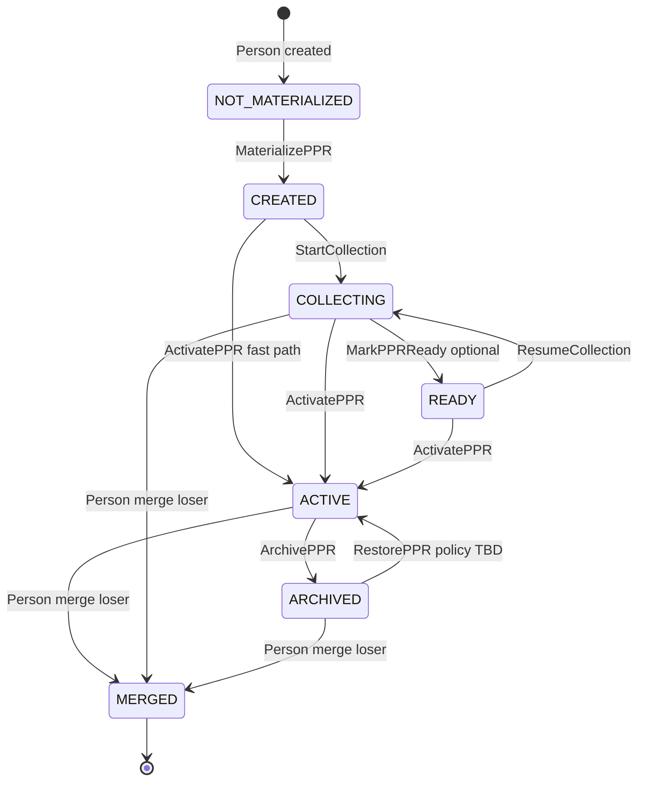
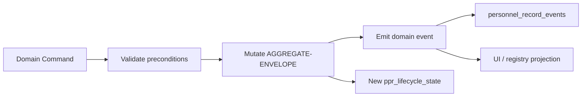
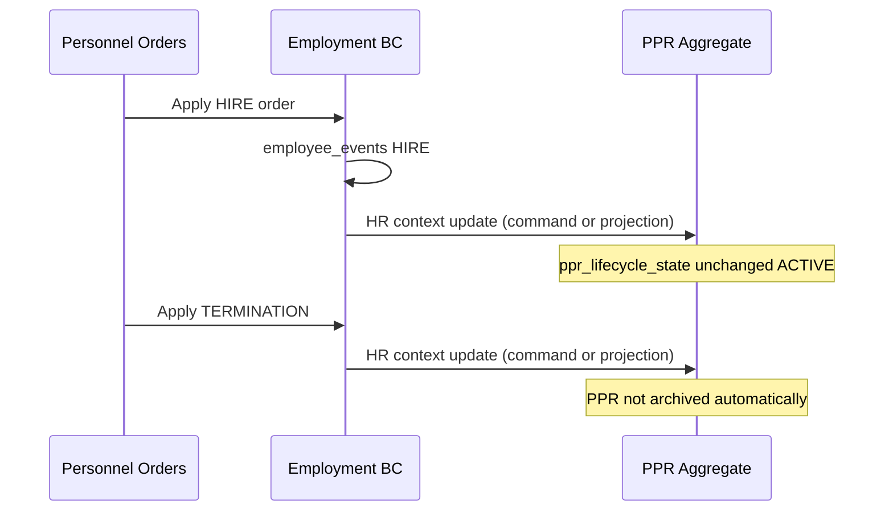
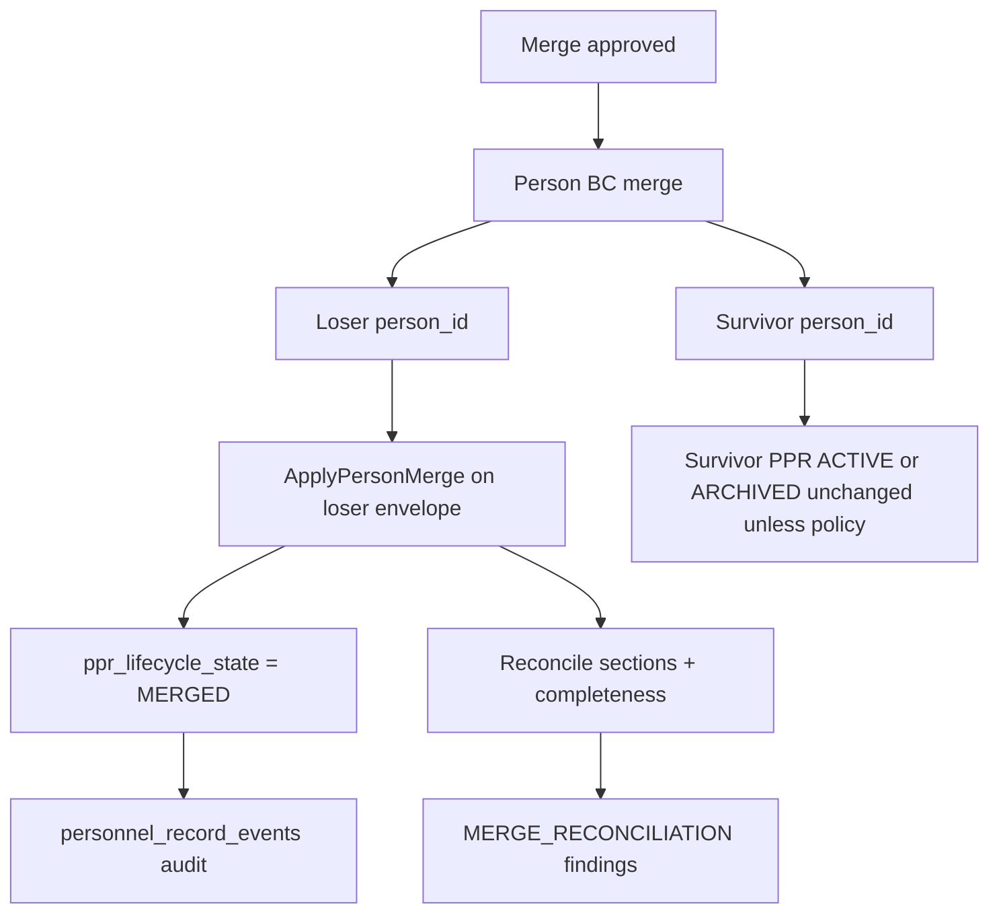

--------------------------------------------------

Document Status

Document:
WP-PR-004-ppr-lifecycle-and-state-machine

Title:
Personnel Personal Record — Lifecycle & State Machine

Type:
Architecture Work Package

Status:
Draft — Ready for Review

Revision:
2

Date:
2026-07-15

Parent:
ADR-054 — Personnel Personal Record Aggregate Model

Depends on:
ARCH-002, WP-PR-002 (Completed), WP-PR-003 (Draft — Ready for Review), WP-HR-CARD-002 (Draft)

Purpose:
Normative specification of PPR aggregate lifecycle and state machine.
No code, migrations, or API changes in this WP.

Note:
Roadmap item «Person ↔ PPR linkage» is satisfied by ADR-054 (`person_id` = PPR ID).
This WP addresses **aggregate lifecycle** (OAD-2 representation on AGGREGATE-ENVELOPE).

--------------------------------------------------

# WP-PR-004 — Personnel Personal Record Lifecycle & State Machine

**Date:** 2026-07-15

---

## 1. Purpose and references

### 1.1 Purpose

Настоящий документ формально определяет **жизненный цикл** Personnel Personal Record (PPR) как domain aggregate:

- что означает создание, развитие, активное использование, завершение, архивирование, объединение Person и восстановление PPR;
- каталог состояний, команды, domain events и invariants;
- взаимодействие с completeness (WP-PR-003), Employment, Personnel Orders, Import и Person merge.

**Out of scope:** DDL, REST paths, UI layout, workflow engine implementation, изменения ADR-054 / WP-PR-002 / WP-PR-003.

### 1.2 Mandatory references

| Document | Role |
|----------|------|
| [ARCH-002](./ARCH-002-personnel-personal-record-architecture.md) | Target lifecycle CANDIDATE→EMPLOYEE→FORMER_EMPLOYEE; INV-1…INV-9 |
| [ADR-054](../adr/ADR-054-personnel-personal-record-aggregate-model.md) | Person-root; `person_id` = PPR ID; envelope metadata |
| [WP-PR-002](./WP-PR-002-aggregate-boundary-specification.md) | AB-1…AB-16; aggregate events §9; Candidate on envelope (OAD-2) |
| [WP-PR-003](./WP-PR-003-section-catalog-and-completeness-model.md) | Completeness ≠ lifecycle auto; AGGREGATE-ENVELOPE; readiness profiles |
| [WP-HR-CARD-002](./WP-HR-CARD-002-unified-personnel-record-card.md) | UI projection; PPR-REP-001 |
| [ADR-048](../adr/ADR-048-person-ownership-identity-creation-policy.md) | Person materialization |
| [ADR-PMF-001](../adr/ADR-PMF-001-personnel-migration-framework.md) | PMF commit path |

### 1.3 Architectural constraints (non-negotiable)

| Constraint | Source |
|------------|--------|
| PPR lifecycle keyed by **`person_id`** | ADR-054, WP-PR-002 AB-2 |
| **One Person → one PPR** on entire lifecycle | INV-2, AB-1 |
| **Rehire does not create new PPR** | INV-3, ADR-054 B-3 |
| **Employment lifecycle ≠ PPR lifecycle** | WP-PR-002 AB-3, AB-8 |
| **Completeness does not auto-change lifecycle** | WP-PR-003 §12 |
| **Orders do not directly mutate PPR lifecycle** | INV-9; commands only |
| **UI is not source of truth** | INV-5, PPR-REP-001 |
| Lifecycle state on **`AGGREGATE-ENVELOPE`** | WP-PR-003 §2.12, §3.2 |

---

## 2. Lifecycle goals

### 2.1 What PPR lifecycle means

**PPR lifecycle** — управляемая последовательность состояний **кадрового агрегата** (Person-root + AGGREGATE-ENVELOPE + person-owned sections), описывающая:

| Phase | Meaning |
|-------|---------|
| **Creation** | Materialization AGGREGATE-ENVELOPE when Person enters HR contour (ADR-054 B-2) |
| **Development** | Наполнение sections (COLLECTING); completeness grows; readiness profiles evaluated |
| **Active use** | Authoritative dossier maintained for HR processes (ACTIVE) |
| **Employment context change** | Увольнение / повторный найм **не** уничтожают PPR; меняется Employment BC |
| **Closure** | ARCHIVED — read-only storage policy on envelope |
| **Person merge** | MERGED (loser) / survivor continues PPR |
| **Restoration** | ARCHIVED → ACTIVE by explicit command (policy TBD) |

### 2.2 What PPR lifecycle is NOT

| Not PPR lifecycle | Owner BC |
|-------------------|----------|
| Трудовые отношения (HIRE, transfer, termination) | Employment Relationship |
| Кадровые приказы (draft, sign, apply) | Personnel Orders |
| Operational Employee shell (access, tasks) | Employee / Platform |
| Section row `lifecycle_status` (void/supersede) | Section tables (PMF) |
| Readiness profile READY/BLOCKED | Completeness engine (WP-PR-003 Level 5) |
| `persons.person_status` (identity merge) | Person identity BC |

### 2.3 Lifecycle vs Employment (normative)

```text
Employment:  [none] ──HIRE──► ACTIVE ──TERMINATION──► CLOSED ──rehire──► ACTIVE …
PPR:         NOT_MATERIALIZED ──► CREATED ──► COLLECTING ──► ACTIVE ──► ARCHIVED
                                      │                         ▲
                                      └──── (survives all Employment episodes) ─┘
```

Увольнение переводит Employment в CLOSED; **PPR остаётся ACTIVE** (или переходит в ARCHIVED только явной командой архивирования dossier — не автоматически при termination).

---

## 3. State catalog

### 3.0 Pre-lifecycle vs materialized lifecycle

**Normative clarification:** PPR lifecycle **начинается только после** `MaterializePPR`, когда AGGREGATE-ENVELOPE физически materialized.

| Concept | Meaning |
|---------|---------|
| **NOT_MATERIALIZED** | **Pre-lifecycle / aggregate absence phase** — Person may exist; **нет materialized PPR aggregate** (нет envelope row). Это **не** состояние существующей записи envelope. |
| **CREATED … MERGED** | **Materialized lifecycle** — значения поля `ppr_lifecycle_state` на AGGREGATE-ENVELOPE |

В таблицах и диаграммах NOT_MATERIALIZED используется как **концептуальная метка** «до MaterializePPR» для согласованности переходов. Query «текущий lifecycle» для Person без envelope возвращает **NOT_MATERIALIZED** (logical), не чтение поля envelope.

### 3.0a Two dimensions (do not conflate)

| Dimension | Storage | Purpose |
|-----------|---------|---------|
| **`ppr_lifecycle_state`** | AGGREGATE-ENVELOPE (`personnel_record_metadata`) | Aggregate storage / operational mode |
| **`hr_relationship_context`** | AGGREGATE-ENVELOPE (informational) | HR contour label derived from Employment + intake; **not** storage closure |

`hr_relationship_context` values align with ARCH-002 business labels: `CANDIDATE`, `EMPLOYED`, `FORMER_EMPLOYEE`, `UNKNOWN`. They **do not** replace `ppr_lifecycle_state` and **do not** imply ARCHIVED.

### 3.1 Normative PPR lifecycle states

| State | Adopted? | Purpose | Meaning |
|-------|----------|---------|---------|
| **NOT_MATERIALIZED** | ✅ (pre-lifecycle) | Aggregate absence | Person exists; **no materialized envelope** — pre-lifecycle phase, not envelope row state (§3.0) |
| **CREATED** | ✅ | Activation | Envelope materialized; PPR exists; minimal metadata |
| **COLLECTING** | ✅ | Intake / bootstrap | Active data collection (manual, import, PMF, candidate) |
| **READY** | ⚠️ Optional checkpoint | Explicit HR gate | See §3.1a — **not a mandatory lifecycle phase** |
| **ACTIVE** | ✅ | Authoritative maintenance | Dossier in normal HR use; sections mutable per policy |
| **ARCHIVED** | ✅ | Storage closure | Read-only envelope; history preserved; **not** the same as termination |
| **MERGED** | ✅ | Merge loser terminal | Loser `person_id` envelope closed; **irreversible** (§3.1b); redirect to survivor |

### 3.1a READY — normative rules

**READY is an optional lifecycle checkpoint, not a mandatory lifecycle phase.**

| Rule | Specification |
|------|---------------|
| **R-1** | Implementations **may never use** READY — valid to transition COLLECTING → ACTIVE directly |
| **R-2** | READY is reached **only** by explicit `MarkPPRReady` command |
| **R-3** | Completeness / readiness profiles **never** auto-transition PPR to READY |
| **R-4** | READY may use completeness as **read-only precondition** at command time (WP-PR-003 §8) |
| **R-5** | READY is **not** the same as readiness profile `READY` (Level 5) — different concept |

### 3.1b MERGED — normative rules

| Rule | Specification |
|------|---------------|
| **M-1** | **MERGED is irreversible** — no restore, no reactivation of loser envelope |
| **M-2** | **MERGED cannot be restored** — `RestorePPR` forbidden on loser |
| **M-3** | After merge, **no lifecycle commands** may target **loser `person_id`** |
| **M-4** | All future operations use **survivor `person_id`** only (§12.4) |

### 3.1c Rejected as `ppr_lifecycle_state`

| State | Adopted? | Reason |
|-------|----------|--------|
| **FORMER_EMPLOYEE** | ❌ | Use `hr_relationship_context` |
| **SUPERSEDED** | ❌ | Covered by MERGED loser + section `lifecycle_status=superseded` |
| **DELETED** | ❌ | Hard delete prohibited — see §14 |

### 3.2 State detail matrix

| State | Owner | Entry criteria | Exit criteria | Allowed exits | Prohibited |
|-------|-------|----------------|---------------|---------------|------------|
| **NOT_MATERIALIZED** | Person BC (no envelope) | Person without materialized PPR | `MaterializePPR` | → CREATED | Writes to envelope before materialization |
| **CREATED** | PPR aggregate | Envelope row inserted; `PPR_CREATED` event | `StartCollection` or `ActivatePPR` | → COLLECTING, → ACTIVE | → MERGED (loser only, via merge) |
| **CREATED** | PPR aggregate | *(fast path — §3.2a)* | `ActivatePPR` without `StartCollection` | → ACTIVE | — |
| **COLLECTING** | PPR aggregate | Intake/import/PMF in progress | HR `ActivatePPR` or auto-policy **TBD** | → ACTIVE, → READY (optional) | → ARCHIVED without ACTIVE **TBD** |
| **READY** | PPR aggregate | `MarkPPRReady` command; optional completeness precondition met | `ActivatePPR` or revert `ResumeCollection` | → ACTIVE, → COLLECTING | Automatic entry from completeness alone |
| **ACTIVE** | PPR aggregate | Normal operations | `ArchivePPR` | → ARCHIVED | → NOT_MATERIALIZED; hard delete |
| **ARCHIVED** | PPR aggregate | `ArchivePPR` command | `RestorePPR` (policy TBD) | → ACTIVE | Section writes without restore |
| **MERGED** | Person BC + PPR | Person merge completed; loser | **Terminal — irreversible** | — | **Any** command on loser; restore |

### 3.2a CREATED → ACTIVE fast path (optimisation)

Переход **CREATED → ACTIVE** без промежуточного COLLECTING — **optimisation**, не отдельная бизнес-модель:

- логически эквивалентен **CREATED → COLLECTING → ACTIVE**, если стадия COLLECTING не требуется;
- использует ту же команду **`ActivatePPR`**;
- не пропускает domain events и audit — `PPR_ACTIVATED` фиксирует фактический prior state;
- выбор fast path vs COLLECTING — **policy TBD** (OQ-9), не изменение state catalog.

### 3.3 HR relationship context (informational)

| Context | Typical Employment | PPR lifecycle ( usual ) |
|---------|-------------------|-------------------------|
| **CANDIDATE** | No active Employment | CREATED / COLLECTING / READY |
| **EMPLOYED** | Active Employment episode | ACTIVE |
| **FORMER_EMPLOYEE** | No active Employment; past episode exists | ACTIVE (or ARCHIVED if dossier closed) |
| **UNKNOWN** | Unlinked / pre-sync | Any |

Updated via **HR relationship context update** — domain command **or** equivalent projection/sync mechanism (Employment events, HR intake). Implementation is not prescribed. **Does not** archive PPR on termination.

### 3.4 State machine diagram



> **Diagram note:** `NOT_MATERIALIZED` — pre-lifecycle absence phase (§3.0); not a value stored on envelope until materialization begins at CREATED.

---

## 4. Lifecycle ownership

Каждый контур имеет **собственную** state machine. PPR не подменяет другие.

| Lifecycle | Owner BC | Primary identifier | Storage (Phase 1) | Relation to PPR |
|-----------|----------|-------------------|-------------------|-----------------|
| **Person identity** | Person / Identity | `person_id` | `persons.person_status`, `merged_into_person_id` | ROOT; Person may exist without PPR |
| **PPR aggregate** | Personnel Personal Record | `person_id` | `personnel_record_metadata.ppr_lifecycle_state` | Subject of this WP |
| **Employment Relationship** | Employment | `person_assignments`, `employees` | `employees`, assignments | OUT; triggers context updates |
| **Personnel Orders** | Personnel Orders | `order_id` | `personnel_orders` | OUT; may invoke Employment commands |
| **Employee operational** | Employee / Platform | `employee_id` | `employees` | OUT; shell for access/tasks |
| **User / RBAC** | Security | `user_id` | users, roles | OUT |
| **Personnel Visibility** | Org visibility | scope rules | resolver config | OUT |
| **Section record** | PPR section | section row id | `person_*` tables | Sub-lifecycle: draft/active/voided |
| **Completeness / Readiness** | PPR metadata service | `person_id` | envelope rollup fields (`policy_version`, completeness snapshot) | Derived; **not** lifecycle state — see note below |

**Note — completeness vs lifecycle:** `policy_version` and completeness rollup (WP-PR-003) live on AGGREGATE-ENVELOPE but describe **data quality / coverage**, not `ppr_lifecycle_state`. Completeness recompute does not imply lifecycle transition (LC-7).

```mermaid
flowchart TB
  subgraph person [Person Identity BC]
    PS[person_status active/inactive/merged]
  end

  subgraph ppr [PPR Aggregate BC]
    PLS[ppr_lifecycle_state]
    HRC[hr_relationship_context]
  end

  subgraph emp [Employment BC]
    ER[Employment episodes]
    EE[employee_events]
  end

  subgraph ord [Personnel Orders BC]
    PO[order lifecycle]
  end

  person --> ppr
  emp -.->|context update| ppr
  ord -.->|apply triggers| emp
  ppr -.x|no direct| ord
```

---

## 5. State transition matrix

Normative transitions for **`ppr_lifecycle_state`**. `Forbidden? = Yes` — command must be rejected.

| Current state | Command | Actor | Preconditions | Validation | Domain event | Next state | Rollback | Forbidden? |
|---------------|---------|-------|---------------|------------|--------------|------------|----------|------------|
| NOT_MATERIALIZED | **MaterializePPR** | HR / Import bridge / Enrollment | Person exists; no envelope | person_id unique envelope | `PPR_CREATED` | CREATED | Delete envelope (admin TBD) | No |
| CREATED | **StartCollection** | HR / Import | — | — | `PPR_COLLECTION_STARTED` | COLLECTING | — | No |
| CREATED | **ActivatePPR** | HR | Policy TBD | — | `PPR_ACTIVATED` | ACTIVE | — | No |
| COLLECTING | **MarkPPRReady** | HR | Optional: readiness profile met **TBD** | Completeness check read-only | `PPR_MARKED_READY` | READY | `ResumeCollection` | No |
| COLLECTING | **ActivatePPR** | HR | — | — | `PPR_ACTIVATED` | ACTIVE | — | No |
| READY | **ActivatePPR** | HR | — | — | `PPR_ACTIVATED` | ACTIVE | — | No |
| READY | **ResumeCollection** | HR | — | — | `PPR_COLLECTION_RESUMED` | COLLECTING | — | No |
| ACTIVE | **ArchivePPR** | HR / Admin | Archive policy **TBD** | No blocking merge | `PPR_ARCHIVED` | ARCHIVED | `RestorePPR` | No |
| ARCHIVED | **RestorePPR** | HR / Admin | Restoration policy **TBD** | — | `PPR_RESTORED` | ACTIVE | Re-archive | No |
| * | **ApplyPersonMerge** | Person admin | Merge approved | Survivor/loser rules | `PERSON_MERGED` + `PPR_MERGED` | MERGED (loser) | **No** rollback | No (loser) |
| ACTIVE | **MaterializePPR** | — | — | — | — | — | — | **Yes** |
| MERGED | *any lifecycle command* | — | — | — | — | — | — | **Yes** (loser person_id) |
| MERGED | **RestorePPR** | — | — | — | — | — | — | **Yes** |
| ARCHIVED | *section write* | — | — | — | — | — | — | **Yes** (without restore) |
| * | *completeness recompute* | System | — | — | `PPR_COMPLETENESS_CHANGED` | **unchanged** | — | N/A |

---

## 6. Domain commands

Все команды — **domain commands** (intent + authorization + validation). UI actions map to commands; UI state is not authoritative.

### 6.1 Command catalog

| Command | Intent | Mutates envelope? | Mutates sections? |
|---------|--------|-------------------|-------------------|
| **MaterializePPR** | Create AGGREGATE-ENVELOPE | Yes | No |
| **StartCollection** | Enter COLLECTING | Yes | No |
| **MarkPPRReady** | Optional gate before activation | Yes | No |
| **ActivatePPR** | Enter ACTIVE | Yes | No |
| **ResumeCollection** | Leave READY → COLLECTING | Yes | No |
| **UpdatePPRSections** | Section CRUD (PMF/API) | No (rollup only) | Yes |
| **RecomputeCompleteness** | Rollup refresh | Rollup fields only | No |
| **UpdateHrRelationshipContext** | Sync HR label — optional domain command **or** equivalent projection/sync mechanism (Employment events, intake); implementation not prescribed | Context field only | No |
| **ArchivePPR** | Read-only closure; may include reason code (e.g. policy invalidation) | Yes | No |
| **RestorePPR** | Unarchive (survivor / non-MERGED only) | Yes | No |
| **ApplyPersonMerge** | Merge persons | Loser → MERGED | Reconciliation WP |
| **SplitPerson** | — | **Rejected** Phase 1 | OQ |

### 6.2 Command contract (architectural)

| Field | Description |
|-------|-------------|
| `command_id` | UUID; idempotency key |
| `command_type` | Enum from §6.1 |
| `person_id` | Target PPR |
| `actor_id` | HR user / system |
| `issued_at` | Timestamp |
| `reason` | Optional; required for archive/merge |
| `policy_version` | Lifecycle policy version |
| `preconditions` | Machine-readable checks |
| `correlation_id` | Order/import/PMF run link |

---

## 7. Domain events

### 7.1 Event taxonomy

| Event | Publisher | Consumers | Payload (minimum) | Ordering | Idempotency |
|-------|-----------|-----------|-------------------|----------|-------------|
| **PPR_CREATED** | PPR aggregate | Audit, UI, registry | person_id, actor, source | per person_id monotonic | command_id |
| **PPR_COLLECTION_STARTED** | PPR | Audit, UI | person_id, actor | monotonic | command_id |
| **PPR_MARKED_READY** | PPR | Audit, readiness UI | person_id, profile_code **TBD** | monotonic | command_id |
| **PPR_ACTIVATED** | PPR | Audit, UI, registry | person_id, prior_state | monotonic | command_id |
| **PPR_COLLECTION_RESUMED** | PPR | Audit | person_id | monotonic | command_id |
| **PPR_LIFECYCLE_CHANGED** | PPR | Audit, projections | person_id, from, to, reason | monotonic | event_id |
| **PPR_ARCHIVED** | PPR | Audit, UI | person_id, reason | monotonic | command_id |
| **PPR_RESTORED** | PPR | Audit, UI | person_id, reason | monotonic | command_id |
| **PPR_MERGED** | PPR / Person | Audit, completeness | loser_id, survivor_id | monotonic | merge_id |
| **PPR_COMPLETENESS_CHANGED** | PPR metadata | UI, readiness | person_id, rollup snapshot | may be frequent | policy_version + hash |
| **PPR_SECTION_UPDATED** | PPR section | Audit (`personnel_record_events`) | person_id, section_code, record_id | per section | event_id |
| **PERSON_MERGED** | Person BC | PPR, Employment, audit | survivor_id, loser_id | global | merge_id |

**External events (not published by PPR):** `EMPLOYMENT_CREATED`, `EMPLOYMENT_TERMINATED`, `PERSONNEL_ORDER_APPLIED`, `PMF_RUN_COMMITTED`, `IMPORT_BATCH_APPLIED` (WP-PR-002 §9.3).

### 7.2 Audit alignment

| Store | Role |
|-------|------|
| `personnel_record_events` | AUDIT for section changes + lifecycle envelope events (WP-PR-002 AB-12) |
| `employee_events` | Employment BC only — **not** PPR lifecycle SoT |
| AGGREGATE-ENVELOPE columns | Current state snapshot |

### 7.3 Command → Event → State diagram



---

## 8. Completeness interaction (WP-PR-003)

### 8.1 Normative rules

| Rule | Specification |
|------|---------------|
| **C-1** | Completeness recompute **never** invokes lifecycle transition commands |
| **C-2** | Lifecycle commands **may read** completeness / readiness as **precondition** (e.g. `MarkPPRReady`) |
| **C-3** | `PPR_COMPLETENESS_CHANGED` event **does not** imply `PPR_LIFECYCLE_CHANGED` |
| **C-4** | ARCHIVED PPR may still expose completeness snapshot (read-only) |
| **C-5** | Readiness `BLOCKED` **does not** change `ppr_lifecycle_state` |

### 8.2 Example (illustrative — policy TBD)

`MarkPPRReady` may require `HIRE_READY` readiness profile = READY — evaluated at command time. Failure → command rejected; lifecycle unchanged.

---

## 9. Employment interaction

| Scenario | Employment BC | PPR lifecycle |
|----------|---------------|---------------|
| First hire | New episode OPEN | ACTIVE (unchanged) |
| Termination | Episode CLOSED | **Stays ACTIVE**; context → FORMER_EMPLOYEE |
| Rehire | New episode OPEN | **Same PPR**; context → EMPLOYED |
| Candidate pre-hire | No episode | COLLECTING / READY; context → CANDIDATE |
| Multiple concurrent episodes **TBD** | OQ | OQ |



---

## 10. Personnel Orders interaction

| Rule | Specification |
|------|---------------|
| **O-1** | Order apply mutates **Employment**, not PPR envelope directly |
| **O-2** | Order workflow **may trigger** PPR context update — via `UpdateHrRelationshipContext` domain command **or** equivalent projection handler (e.g. on candidate hire path, `MaterializePPR` **TBD**) |
| **O-3** | HIRE order **must not** create new PPR on rehire |
| **O-4** | Order PDF / print — DERIVED; no lifecycle effect |

### 10.1 Post-order command mapping (illustrative)

| Order type | Employment effect | Permitted PPR command |
|------------|-------------------|----------------------|
| HIRE | Employment OPEN | HR context → `EMPLOYED` (command or projection) |
| TERMINATION | Employment CLOSED | HR context → `FORMER_EMPLOYEE` (command or projection) |
| TRANSFER | Assignment change | Context unchanged or metadata note only |

---

## 11. Import interaction

| Import scenario | PPR effect | Command chain |
|-----------------|------------|---------------|
| New person from roster | Person create + optional `MaterializePPR` | Import bridge **TBD** |
| Existing PPR bootstrap | Section staging → PMF | `StartCollection`; no lifecycle auto-change |
| Conflict (duplicate IIN) | — | Manual review; **no** lifecycle change until merge resolved |
| Import-only without activation | Staging TEMPORARY | Envelope may stay NOT_MATERIALIZED until HR materializes |

Import **never** sets `ppr_lifecycle_state` without explicit command or approved bridge policy **TBD** (OQ).

**Command initiation:** lifecycle commands are **not** self-triggering. The **Import bridge**, **Enrollment service**, or **PMF commit policy** (or equivalent orchestration layer) **initiates** the appropriate command (`MaterializePPR`, `StartCollection`, etc.) when import/enrollment completes — per approved policy **TBD** (OQ-8). Import staging alone does not imply lifecycle transition.

## 12. Person merge

### 12.1 Roles

| Role | person_id | PPR outcome |
|------|-----------|-------------|
| **Survivor** | Retained | Retains PPR; sections reconciled |
| **Loser** | `person_status=merged` | `ppr_lifecycle_state=MERGED`; redirect to survivor |

### 12.2 Merge flow



### 12.3 Preservation

| Artifact | Rule |
|----------|------|
| `personnel_record_events` | Retained; loser events reference survivor after redirect **TBD** implementation |
| Section SoT | Reconciled to survivor; duplicates flagged |
| Completeness | Recalculated on survivor |
| Provenance | Must not be silently dropped (WP-PR-003 §13) |

**SplitPerson:** not supported Phase 1 (OQ).

### 12.4 Post-merge command addressing (normative)

After **`PERSON_MERGED`** (and loser envelope reaches **MERGED**):

| Rule | Specification |
|------|---------------|
| **PM-1** | All **future lifecycle commands** must target **survivor `person_id`** only |
| **PM-2** | **Loser `person_id`** no longer accepts lifecycle commands — envelope is terminal (§3.1b, LC-11) |
| **PM-3** | Clients, APIs, and orchestration must resolve merge redirect before issuing commands |

This extends M-3/M-4 (§3.1b) as the authoritative post-merge addressing rule.

---

## 13. Archive

### 13.1 Semantics

**ARCHIVED** — intentional **storage / access policy** on PPR envelope:

- dossier read-only for section mutations;
- history, events, and sections **preserved**;
- distinct from **FORMER_EMPLOYEE** (Employment context label);
- distinct from **Employment CLOSED**.

### 13.2 Archive flow


Former employee with ACTIVE PPR: normal case. HR may later `ArchivePPR` per retention policy **TBD**.

---

## 14. Delete

| Delete type | PPR policy |
|-------------|------------|
| **Hard delete PPR** | **Prohibited** — cadre history retention **TBD** legal |
| **Hard delete Person** | Person BC policy; if merged, loser already terminal |
| **Void section record** | Section `lifecycle_status=voided` — not aggregate delete |
| **Policy invalidation** | Use **`ArchivePPR`** with reason code — soft closure, not physical removal; separate `InvalidatePPR` command **not adopted** (duplicate semantics) |

Physical deletion of person-owned cadre data **requires** explicit future ADR + legal approval (OQ).

---

## 15. Lifecycle invariants

| ID | Invariant |
|----|-----------|
| **LC-1** | One **Person** → at most one **materialized PPR** envelope at a time |
| **LC-2** | **`person_id`** is the sole public PPR lifecycle key |
| **LC-3** | **Rehire** does not create new PPR or reset lifecycle to CREATED |
| **LC-4** | **Termination** does not archive or delete PPR automatically |
| **LC-5** | **Archive** preserves sections, events, and provenance |
| **LC-6** | **Merge** does not silently drop loser audit trail |
| **LC-7** | **Completeness** changes do not auto-change `ppr_lifecycle_state` |
| **LC-8** | **Employment** data remains OUT of PPR aggregate |
| **LC-9** | **Orders** apply to Employment; PPR reacts via commands only |
| **LC-10** | **UI** displays lifecycle; never owns lifecycle state |
| **LC-11** | **MERGED** loser envelope is **irreversible** and terminal — no restore, no lifecycle commands on loser `person_id` (§12.4) |
| **LC-12** | **`hr_relationship_context`** is informational; may diverge briefly during sync |
| **LC-13** | After **`PERSON_MERGED`**, lifecycle commands address **survivor `person_id`** only |

Extends ARCH-002 INV-1…INV-9 and WP-PR-002 AB-1…AB-16.

---

## 16. Lifecycle vs UI (Личная карточка)

Per WP-HR-CARD-002 / PPR-REP-001 — presentation only.

| UI element | Source |
|------------|--------|
| **Lifecycle badge** | `ppr_lifecycle_state` on envelope |
| **HR context chip** | `hr_relationship_context` (separate from archive badge) |
| **Completeness badge** | WP-PR-003 rollup (orthogonal) |
| **Readiness badges** | WP-PR-003 profiles (orthogonal) |
| **Timeline** | `personnel_record_events` + lifecycle events |
| **Warnings** | Merge reconciliation, archive, stale context |
| **Audit link** | Event journal filtered by person_id |

Archived PPR: sections visible read-only; edit commands disabled; restore action policy-gated **TBD**.

---

## 17. Repository inventory

Read-only audit (2026-07-15). **Existing implementation is not source of truth.**

### 17.1 Lifecycle-related artifacts

| Artifact | Location | Current role | Gap vs target |
|----------|----------|--------------|---------------|
| **`persons.person_status`** | ADR-042 migration | Identity: active/inactive/merged | Person BC — not PPR lifecycle |
| **`persons.merged_into_person_id`** | same | Merge redirect | Align with PPR_MERGED |
| **`personnel_record_metadata`** | — | **Not implemented** | Target for `ppr_lifecycle_state` |
| **`personnel_record_events`** | `personnel_migration.py` | Section AUDIT (education…) | Extend taxonomy for lifecycle events |
| **`employee_events`** | employment migrations | HIRE/TRANSFER/TERMINATION | Employment BC — triggers context only |
| **`personnel_orders` + apply** | personnel orders services | Order lifecycle | OUT; apply → Employment |
| **PMF runs** | `personnel_migration_runs` | Migration audit | TEMPORARY; not PPR lifecycle |
| **Import pipeline** | hr_import_* | Staging bootstrap | No PPR envelope today |
| **`employee_identities`** | employee-scoped | IIN bridge | EPIC-10; not lifecycle owner |
| **Enrollment service** | `hr_import_enroll_employee_service` | Creates employee_events | Employee-centric; no PPR materialization |
| **Section `lifecycle_status`** | person_education/training | void/supersede row | Section sub-lifecycle only |
| **Candidate entity** | — | **Not implemented** | Use envelope states + context |
| **PPR registry UI** | — | **Not implemented** | Read model projection |

### 17.2 employee_id vs person_id

| Concern | Today | Target |
|---------|-------|--------|
| HR enroll path | `employee_id` + employee_events | Resolve person_id; command on PPR |
| PMF commit | `person_id` required | Aligned |
| Import profile | employee-scoped overrides | Transitional |
| Lifecycle ownership | **Implicit / absent** | **`person_id` envelope** |

### 17.3 Events — exist vs needed

| Event | Exists today? |
|-------|---------------|
| EDUCATION_MIGRATED / VERIFIED | ✅ partial (`personnel_record_events`) |
| PPR_CREATED / LIFECYCLE_CHANGED / ARCHIVED | ❌ planned |
| employee_events HIRE/TERMINATION | ✅ Employment BC |
| PERSON_MERGED (PPR audit) | ❌ planned |

---

## 18. Decision summary

| # | Decision |
|---|----------|
| **D-1** | **PPR lifecycle** belongs to the PPR aggregate (AGGREGATE-ENVELOPE on `person_id`) |
| **D-2** | **Employment lifecycle** is independent; termination does not destroy PPR |
| **D-3** | **Completeness** does not automatically change `ppr_lifecycle_state` |
| **D-4** | **Rehire** preserves the same PPR and lifecycle history |
| **D-5** | **ARCHIVED** is storage closure — not equal to termination or FORMER_EMPLOYEE |
| **D-6** | **FORMER_EMPLOYEE** is `hr_relationship_context`, not `ppr_lifecycle_state` |
| **D-7** | **MERGE** preserves audit; loser → **MERGED** terminal; **irreversible** — no restore; loser `person_id` accepts no further lifecycle commands (§12.4) |
| **D-8** | **Hard delete** of PPR is prohibited Phase 1 |
| **D-9** | **Domain commands** initiate transitions; UI maps to commands |
| **D-10** | **Domain events** record transitions for audit and projections |
| **D-11** | **Personnel Orders** affect PPR only through permitted commands |
| **D-12** | **Import** does not silently set lifecycle without command/policy; bridge layer initiates commands |
| **D-13** | **READY is an optional lifecycle checkpoint, not a mandatory lifecycle phase.** Implementations may never use READY; it is reached **only** by `MarkPPRReady`; completeness never auto-transitions to READY (§3.1a) |
| **D-14** | **SUPERSEDED** and **DELETED** are not PPR lifecycle states |
| **D-15** | **UI** displays lifecycle; is not source of truth |

---

## 19. Open questions

| ID | Question |
|----|----------|
| **OQ-1** | Legal retention periods for ARCHIVED vs ACTIVE |
| **OQ-2** | Archive policy — who may archive/restore |
| **OQ-3** | Merge conflict reconciliation workflow |
| **OQ-4** | Verification authority linkage to `MarkPPRReady` |
| **OQ-5** | Restoration policy from ARCHIVED |
| **OQ-6** | Hard delete exceptions (if any) — legal/GDPR |
| **OQ-7** | Candidate self-service and lifecycle commands |
| **OQ-8** | Auto `ActivatePPR` after import vs manual materialization |
| **OQ-9** | Fast-path CREATED → ACTIVE without COLLECTING |
| **OQ-10** | Future workflow engine ownership vs command bus |
| **OQ-11** | Concurrent Employment episodes per Person |
| **OQ-12** | SplitPerson ever required |
| **OQ-13** | Mapping to WP-PR-010 / OAD-2 Candidate ADR |
| **OQ-14** | Cold storage tier for long-term ARCHIVED |

All marked **TBD** until HR/legal validation.

---

## 20. Risks

| Risk | Impact | Mitigation |
|------|--------|------------|
| Conflating PPR and Employment lifecycle | Wrong archive on termination | D-2, D-5, D-6; sequence diagrams |
| Completeness auto-transitions | Unexpected state changes | LC-7, §8 |
| employee_id as lifecycle owner | Rehire breaks continuity | LC-2; EPIC-10 |
| Order apply bypasses commands | Hidden lifecycle mutation | LC-9, §10 |
| Merge audit loss | Compliance failure | LC-6, §12 |
| READY state creep | Duplicates readiness profiles | D-13 optional; OQ |
| Metadata creep on envelope | Stealth Variant A | WP-PR-003 lean envelope |
| Import auto-materialize | Uncontrolled PPR proliferation | LC-12, §11 |
| UI badge overload | User confusion | Separate lifecycle / context / completeness |

---

## 21. Consistency checklist

| Check | Result |
|-------|--------|
| ADR-054 Person-root; person_id = PPR ID | ✅ |
| WP-PR-002 boundary; Employment/Orders OUT | ✅ |
| WP-PR-003 completeness ≠ auto lifecycle | ✅ |
| No new aggregate introduced | ✅ |
| FORMER_EMPLOYEE not PPR storage state | ✅ |
| ARCHIVED ≠ termination | ✅ |
| Mermaid diagrams valid | ✅ |
| No unapproved normative HR policy | ✅ (TBD/OQ) |

---

## 22. Related documents

| Document | Relation |
|----------|----------|
| [WP-PR-003](./WP-PR-003-section-catalog-and-completeness-model.md) | AGGREGATE-ENVELOPE; completeness interaction |
| [WP-PR-002](./WP-PR-002-aggregate-boundary-specification.md) | Events §9; Candidate on envelope |
| [ARCH-002-IMPLEMENTATION-ROADMAP](./ARCH-002-IMPLEMENTATION-ROADMAP.md) | EPIC-2 Candidate; OAD-2 |
| [WP-HR-CARD-002](./WP-HR-CARD-002-unified-personnel-record-card.md) | UI projection §16 |

### Downstream work packages

| WP | Dependency from WP-PR-004 |
|----|---------------------------|
| WP-PR-005 | Lifecycle in composite read API |
| WP-PR-006 | Lifecycle event taxonomy in `personnel_record_events` |
| WP-PR-010 | Candidate ADR (OAD-2) extends context rules |
| EPIC-2 | Candidate intake commands |
| EPIC-3 | PPR API command surface |

---

## Document History

| Revision | Date | Change |
|----------|------|--------|
| 1 | 2026-07-15 | Initial PPR lifecycle & state machine; Draft — Ready for Review |
| 2 | 2026-07-15 | Architectural review clarifications: NOT_MATERIALIZED pre-lifecycle semantics; CREATED→ACTIVE fast path; READY optional checkpoint; MERGED irreversible; InvalidatePPR removed (use ArchivePPR); HR context update mechanism softened; post-merge command addressing; import bridge initiation; completeness policy separate from lifecycle |
