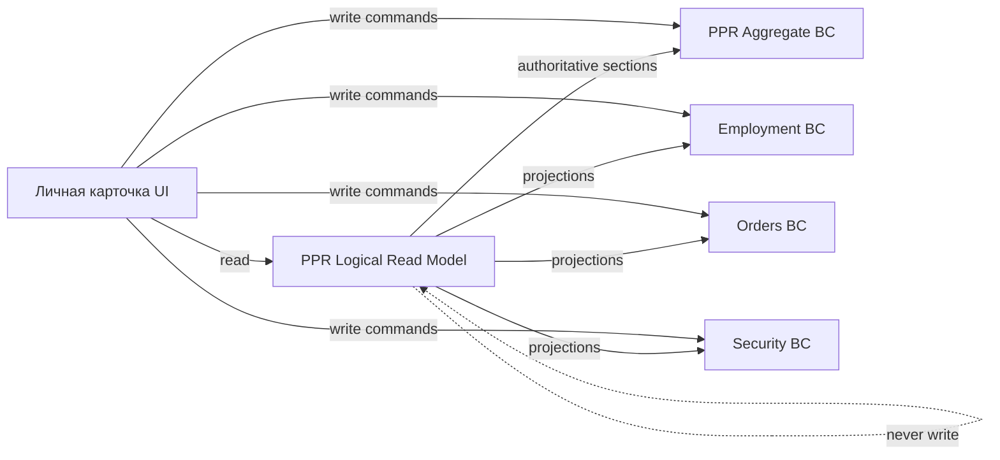
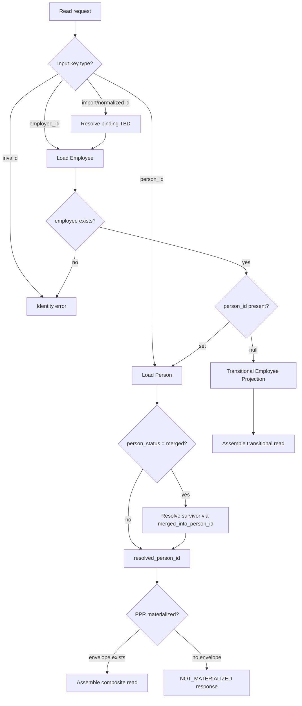
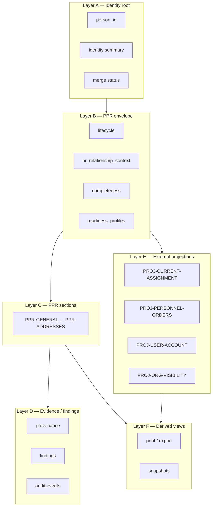
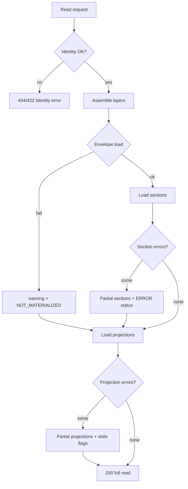
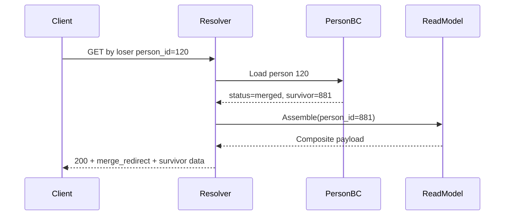
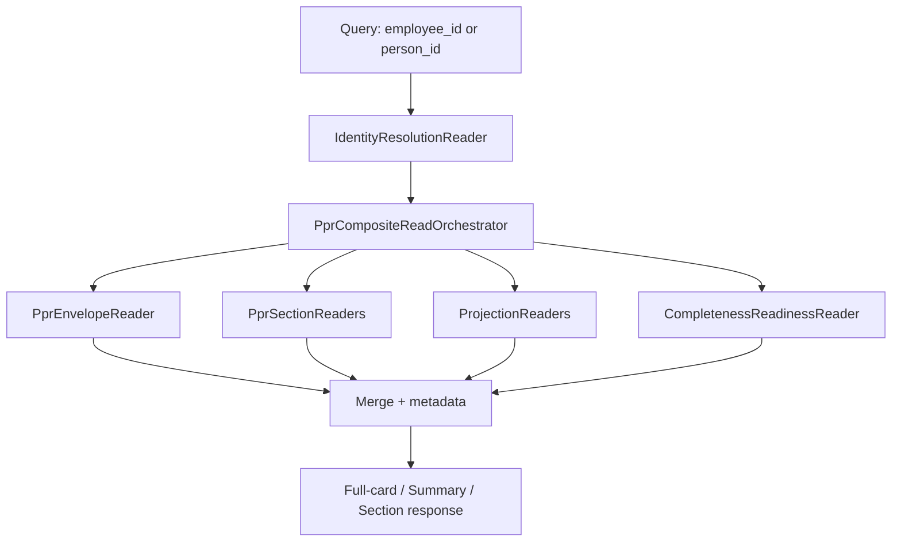
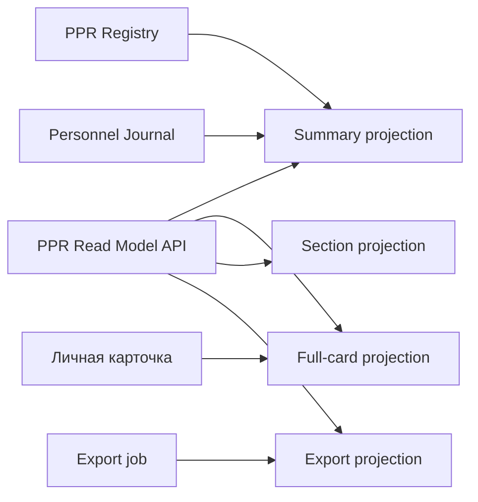
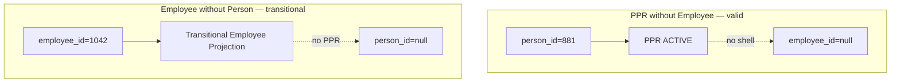

--------------------------------------------------

Document Status

Document:
WP-PR-005-logical-read-model-and-composite-projection

Title:
Personnel Personal Record — Logical Read Model & Composite Projection

Type:
Architecture Work Package

Status:
Draft — Ready for Review

Revision:
1

Date:
2026-07-15

Parent:
ADR-054 — Personnel Personal Record Aggregate Model

Depends on:
ARCH-002, WP-PR-002 (Completed), WP-PR-003 (Draft — Ready for Review), WP-PR-004 (Draft — Ready for Review), WP-HR-CARD-002 (Draft)

Purpose:
Normative specification of PPR logical read model and composite projection for Личная карточка по учёту кадров.
No code, migrations, or API changes in this WP.

--------------------------------------------------

# WP-PR-005 — Logical Read Model & Composite Projection

**Date:** 2026-07-15

---

## 1. Purpose and normative base

### 1.1 Purpose

Настоящий документ определяет **единую logical read model** и **composite projection** для Personnel Personal Record (PPR) — Личного листка по учёту кадров — в контексте **Личной карточки по учёту кадров** и смежных read-side сценариев (реестры, экспорт, deep links).

Документ является нормативной спецификацией для:

- WP-PR-006 (completeness/readiness read API boundaries — TBD);
- EPIC-3 (PPR API);
- EPIC-10 (identity linkage);
- UI consolidation (WP-HR-CARD);
- PPR registry (ADR-054 B-6).

**Out of scope:** DDL, REST paths, UI layout, RBAC final design, код, миграции, изменения ADR-054 / WP-PR-002 / WP-PR-003 / WP-PR-004 / WP-HR-CARD-002.

### 1.2 Mandatory references

| Document | Role |
|----------|------|
| [ARCH-002](./ARCH-002-personnel-personal-record-architecture.md) | Target architecture; INV-1…INV-9; Composite View principle |
| [ADR-054](../adr/ADR-054-personnel-personal-record-aggregate-model.md) | Accepted: domain autonomy + Person-root; `person_id` = PPR ID |
| [WP-PR-002](./WP-PR-002-aggregate-boundary-specification.md) | Boundary matrix; AB-1…AB-16 |
| [WP-PR-003](./WP-PR-003-section-catalog-and-completeness-model.md) | Section catalog; completeness levels; projections OUT |
| [WP-PR-004](./WP-PR-004-ppr-lifecycle-and-state-machine.md) | Lifecycle states; materialization; merge rules |
| [WP-HR-CARD-002](./WP-HR-CARD-002-unified-personnel-record-card.md) | Primary UI representation; PPR-REP-001 |
| [ADR-047](../adr/ADR-047-personnel-personal-file-architecture.md) | Personal File sections; four-layer model |
| [ADR-048](../adr/ADR-048-person-ownership-identity-creation-policy.md) | Person materialization; identity creation |

### 1.3 Repository audit (read-only)

Аудит выполнен 2026-07-15. **Существующий UI и сервисы не являются source of truth.**

| Artifact | Location | Audit finding |
|----------|----------|---------------|
| `hr_import_employee_card_service.py` | `app/services/` | Employee-centric composite; Import Profile + overrides; no `person_id` resolution in card payload |
| `employeeCardNav.ts` | `corpsite-ui/lib/` | `employee_id`-only href builder; sections: general, assignment, access, orders, history |
| `/directory/personnel/employees/{employeeId}/card` | `corpsite-ui/app/.../card/page.tsx` | Renders `EmployeeImportCard2PageClient`; dual-fetch employee + import-card |
| Employee card page components | `EmployeeImportCard2PageClient.tsx`, section components | UI orchestrates parallel API calls; no unified read contract |
| `person_education`, `person_training` | `app/db/models/personnel_migration.py` | Person-owned SoT (PMF pilot); not wired into `/card` |
| `personnel_record_metadata` | — | **Not implemented** — envelope/lifecycle/completeness gap |
| `personnel_record_events` | `personnel_migration.py` | Section audit journal; PMF-3B query service exists |
| `person_assignments` | ADR-042 schema | Canonical employment episodes per `person_id` |
| `employee_events` | employment migrations | Append-only HIRE/TRANSFER/TERMINATION; employee-scoped |
| `personnel_orders` | `app/db/models/personnel_orders.py` | Legal acts; HIRE requires `employee_id` |
| `employee_identities` | `app/db/models/employee_identity.py` | Employee-scoped IIN bridge |
| Visibility resolver | `personnel_visibility_resolver_service.py` | Org-scope read filter; uses `person_id` from user→employee join |
| Professional documents | `ProfessionalDocumentsPageClient.tsx` | Separate contour; employee/person linkage TBD |
| Import profile / normalized records | `hr_import_profile_service`, `hr_import_normalized_records` | Staging; employee-scoped overrides |
| Merge redirect | `persons.merged_into_person_id` | Schema exists; **no read-model redirect logic** in card services |

### 1.4 Architectural constraints (non-negotiable)

| Constraint | Source |
|------------|--------|
| PPR read keyed by **`person_id`** after resolution | ADR-054, WP-PR-002 AB-2 |
| **`employee_id`** — transitional navigation key only | ADR-054, WP-HR-CARD-002 |
| Read model **≠ aggregate**; **≠ source of truth** | INV-5, PPR-REP-001 |
| **Composite View ≠ Composite Ownership** | ARCH-002 §Composite View |
| Employment, Orders, RBAC, Visibility — **external projections** | WP-PR-002 AB-3…AB-8 |
| UI never writes cross-BC through composite projection | D-17 |
| Partial/degraded read allowed with explicit warnings | This document §12 |
| Identity resolution failures ≠ projection failures | D-8 |

---

## 2. Read model purpose

### 2.1 Definition

**PPR Logical Read Model** — вычисляемое, person-centric представление, собирающее:

1. **Identity root** (`persons`);
2. **PPR aggregate envelope** (`personnel_record_metadata` — planned);
3. **PPR business sections** (person-owned tables per WP-PR-003);
4. **Evidence / provenance / findings**;
5. **External projections** (Employment, Orders, RBAC, Visibility, Position Cabinet, User Account);
6. **Derived / documentary views** (print, export, snapshots).

### 2.2 What the read model is NOT

| Not | Reason |
|-----|--------|
| Aggregate | Mutations route to owner BC command surfaces |
| Source of truth | Authoritative stores remain in owner BC tables |
| UI state | Browser state, form drafts, tab selection — ephemeral |
| Import Profile | Staging artifact; transitional read only |
| Employee Card storage | Composite shell; projection consumer |

### 2.3 Read model consumers

| Consumer | Projection variant |
|----------|-------------------|
| **Личная карточка по учёту кадров** | Full-card composite |
| **PPR registry** (ADR-054 B-6) | Summary projection |
| **Журнал «Персонал»** | Summary + deep link |
| **Кадровый журнал / оргструктура** | Summary or section |
| **Import review / enroll** | Section + staging overlay |
| **Приказы / admin** | Section or external projection |
| **Export / печатная форма** | Export projection (derived) |

### 2.4 Write routing rule

**All write operations** initiated from Личная карточка **must route** to the owning bounded context:

| Data class | Write owner |
|------------|-------------|
| PPR sections | PPR command API (person_id) |
| Envelope lifecycle | PPR lifecycle commands |
| Employment / assignment | Employment BC |
| Personnel Orders | Orders BC |
| User Account / RBAC | Security BC |
| Import staging | Import BC (transitional) |

### 2.5 Core principle: Composite View ≠ Composite Ownership

```text
Личная карточка (UI)     = Composite View   — one screen, many owners
PPR Logical Read Model   = Composite Read   — one response, many sources
Personnel Personal Record = Domain Aggregate — one person_id, PPR-owned sections only
```

**Corollary:** наличие единого read response **не создаёт** единого write owner. UI-card **must not** persist data directly into composite projection tables or cross-BC joins.



---

## 3. Canonical identity resolution

### 3.1 Normative target

```text
person_id  →  canonical PPR read
```

All read-model assembly, completeness evaluation, lifecycle lookup, and audit filtering **after resolution** use **`resolved_person_id`**.

### 3.2 Allowed input keys

| Input key | Role | Resolution path |
|-----------|------|-----------------|
| **`person_id`** | Canonical | Merge check → survivor → PPR read |
| **`employee_id`** | Transitional navigation | `employees.person_id` → merge → PPR read |
| **import row id** / **normalized record id** | Staging navigation | Resolve bound `employee_id` or `person_id` **TBD** → chain above |
| **merge loser `person_id`** | Legacy/deep link | Redirect to survivor `person_id` |

### 3.3 Transitional navigation chain

```text
employee_id
    ↓
resolve Employee.person_id
    ↓
merge redirect (if person_status = merged)
    ↓
survivor person_id
    ↓
PPR logical read model
```



### 3.4 Resolution outcomes

| Scenario | HTTP/read semantics | `resolved_person_id` | `resolved_employee_id` | Mode |
|----------|---------------------|----------------------|------------------------|------|
| Valid `person_id`, active person | 200 full/partial read | input (or survivor) | best-effort employee **TBD** | `PPR_READ` |
| Valid `employee_id`, linked person | 200 | from employee | input | `PPR_READ` |
| Valid `employee_id`, `person_id = null` | 200 transitional | `null` | input | `TRANSITIONAL_EMPLOYEE_PROJECTION` |
| Merge loser `person_id` | 200 with redirect metadata | survivor | best-effort | `PPR_READ` + `merge_redirect` |
| Unknown `employee_id` | 404 identity | — | — | — |
| Unknown `person_id` | 404 identity | — | — | — |
| Stale employee→person link | 200 + warning | resolved or null | input | `STALE_IDENTITY_LINK` warning |
| Duplicate employee shells for one person | 200 + warning | person_id | **requested** employee_id | `MULTIPLE_EMPLOYEE_SHELLS` |
| Rehire (new employee_id, same person) | 200 | same person_id | current episode employee | `PPR_READ` |
| Concurrent employment episodes | 200 + context note | person_id | context-selected employee **TBD** | `PPR_READ` |
| Unresolved identity (import only) | 422 or 200 transitional **TBD** | null | null | `UNRESOLVED_IDENTITY` |

### 3.5 Rules

| ID | Rule |
|----|------|
| **IR-1** | `employee_id` **never** becomes canonical read key in response contract |
| **IR-2** | `resolved_person_id` is mandatory in successful PPR reads |
| **IR-3** | Merge loser requests **always** resolve to survivor for data assembly |
| **IR-4** | Identity errors (unknown keys) **must not** be masked as empty sections |
| **IR-5** | `employee_id = null` on journal row → card navigation blocked (existing EMP-NAV-001); read API may accept `person_id` directly **TBD** route |
| **IR-6** | Multiple employee shells do not create multiple PPR instances |

---

## 4. Materialization states

Read model must behave correctly for all lifecycle phases per [WP-PR-004](./WP-PR-004-ppr-lifecycle-and-state-machine.md).

**Critical:** `NOT_MATERIALIZED` — aggregate **absence**, not a stored envelope field value.

### 4.1 State behavior matrix

| Materialization / lifecycle | HTTP | Available PPR sections | External projections | Warnings | Mutability hints | Redirects | Degraded | CTA | Audit |
|----------------------------|------|------------------------|---------------------|----------|------------------|-----------|----------|-----|-------|
| **NOT_MATERIALIZED** | 200 or 404 policy **TBD** | None (empty catalog) | Person identity only; Employment if resolvable | `PPR_NOT_MATERIALIZED` | `START_COLLECTION` if permitted | — | Identity-only | Materialize / link identity | Person events only |
| **CREATED** | 200 | Envelope; minimal GENERAL if person exists | Employment if linked | `PPR_MINIMAL` | Lifecycle + section edits per policy | — | Partial | Start collection | Envelope created event **TBD** |
| **COLLECTING** | 200 | All implemented sections | Employment projections | Import stale, completeness gaps | Edit sections; activate gated | — | Partial sections OK | Activate / continue intake | Section + staging events |
| **READY** (optional) | 200 | All applicable | Full projections | Readiness vs lifecycle distinction | Activate | — | — | Activate PPR | As COLLECTING |
| **ACTIVE** | 200 | Full applicable catalog | Full projections | Stale external only | Full edit per capabilities | — | External partial OK | Archive / verify | Full audit |
| **ARCHIVED** | 200 | Read-only sections | Read-only projections | `PPR_ARCHIVED` | Restore gated **TBD** | — | Read-only mode | Restore | Full audit read-only |
| **MERGED (loser)** | 200 + redirect metadata | **No loser data assembly** | Survivor projections via redirect | `MERGE_REDIRECT` | **No writes to loser** | Logical → survivor | Redirect read | Open survivor card | Merge audit preserved |

### 4.2 NOT_MATERIALIZED semantics

| Aspect | Specification |
|--------|---------------|
| Meaning | Person exists; no `personnel_record_metadata` row |
| Query lifecycle | Returns logical `NOT_MATERIALIZED` (not envelope column read) |
| Sections | All PPR sections: `status = UNAVAILABLE`, `source_state = AGGREGATE_NOT_MATERIALIZED` |
| Completeness | Not evaluated (or `NOT_APPLICABLE`) |
| Employment projection | May still resolve if `employee_id` / `person_assignments` exist |
| UI | Must not present as fully populated PPR |

### 4.3 MERGED loser semantics

| Aspect | Specification |
|--------|---------------|
| Request by loser `person_id` | Resolve survivor; assemble read from survivor data |
| `merge_redirect` metadata | `requested_person_id`, `survivor_person_id`, `redirect_reason = PERSON_MERGED` |
| Writes | All mutation capabilities on loser = **denied** |
| Audit | Loser merge events visible; pointer to survivor |
| Deep links | Old loser bookmarks resolve with visible redirect notice |

---

## 5. Composite projection layers

### 5.1 Layer model

| Layer | Code | Content | Authority |
|-------|------|---------|-----------|
| **A — Identity root** | `LAYER-A` | Person identity, canonical `person_id`, merge status, name/IIN summary | Person BC (`persons`) |
| **B — PPR aggregate envelope** | `LAYER-B` | lifecycle, `hr_relationship_context`, completeness rollup, readiness summaries, `policy_version`, materialization | PPR aggregate (`personnel_record_metadata`) |
| **C — PPR business sections** | `LAYER-C` | All `PPR-*` sections per WP-PR-003 | PPR section tables |
| **D — Evidence / provenance / findings** | `LAYER-D` | verification, evidence links, findings, source/provenance, review state, audit events | PPR audit + evidence stores |
| **E — External projections** | `LAYER-E` | assignment, Employment, orders, User Account, Platform Roles, Visibility, Position Cabinet, operational tasks | Respective BCs |
| **F — Derived / documentary views** | `LAYER-F` | printable personal record, exports, snapshots, control output | Derived engines |



### 5.2 Layer C — Section catalog reference

All business sections defined in [WP-PR-003 §3.1](./WP-PR-003-section-catalog-and-completeness-model.md). Read model exposes each applicable section via **section read contract** (§8).

### 5.3 Layer E — External projections (normative OUT)

| Projection code | Read source (Phase 1) | Freshness class |
|-----------------|----------------------|-----------------|
| `PROJ-CURRENT-ASSIGNMENT` | `person_assignments` + `employees` snapshot | Eventual |
| `PROJ-EMPLOYMENT-RELATIONSHIP` | `person_assignments` lifecycle | Eventual |
| `PROJ-INTERNAL-EMPLOYMENT-HISTORY` | `employee_events` | Eventual |
| `PROJ-PERSONNEL-ORDERS` | `personnel_orders` + items | Eventual |
| `PROJ-USER-ACCOUNT` | `users` via `employee_id` | Eventual |
| `PROJ-PLATFORM-ROLE` | access resolver | Eventual |
| `PROJ-ORG-VISIBILITY` | visibility resolver | Eventual |
| `PROJ-POSITION-CABINET` | Position Cabinet services | Eventual / on-demand |
| `PROJ-IMPORT-STAGING` | Import Profile (transitional) | Staging |

---

## 6. Ownership matrix

**Normative rule:** each field/block has exactly one write owner. Composite projection is never write target.

| Field / block | Owner BC | Canonical source | Read source (Phase 1) | Write command owner | Freshness | Consistency | Sensitivity | Fallback | Degraded behavior | PPR completeness? | Cross-context readiness? |
|---------------|----------|------------------|----------------------|----------------------|-----------|-------------|-------------|----------|-------------------|-------------------|--------------------------|
| Person identity (name, IIN) | Person BC | `persons` | `persons` | Person / identity API | Strong | Strong | RESTRICTED | `employee_identities` **transitional only** | Show employee identity + warning | Via PPR-GENERAL | Identity linkage profiles |
| Merge status | Person BC | `persons.person_status`, `merged_into_person_id` | same | Person merge command | Strong | Strong | INTERNAL | — | Redirect metadata | No | No |
| PPR lifecycle / envelope | PPR aggregate | `personnel_record_metadata` **planned** | envelope table or NOT_MATERIALIZED | PPR lifecycle commands | Strong | Transactional with envelope | INTERNAL | Logical NOT_MATERIALIZED | Lifecycle unknown warning | No (envelope) | Yes (activation gates) |
| PPR-GENERAL scalars | PPR aggregate | `persons` + future columns | `persons` + import overlay **transitional** | PPR section API | Strong | Transactional per person | RESTRICTED | Import JSON | Import fallback + stale flag | Yes | Yes |
| PPR-EDUCATION | PPR aggregate | `person_education` | PMF table + import overlay | PMF / PPR section API | Strong | Transactional per person | INTERNAL | Import JSON | Partial section | Yes | Yes |
| PPR-TRAINING | PPR aggregate | `person_training` | PMF table + import overlay | PMF / PPR section API | Strong | Transactional per person | INTERNAL | Import JSON | Partial section | Yes | Position-dependent |
| PPR-IDENTITY-DOCUMENTS | PPR aggregate | `person_documents` **target** | `employee_documents` **transitional** | PPR docs API | Strong | Transactional | RESTRICTED | Import norm | Employee docs + warning | Yes | Process-dependent |
| PPR-MILITARY / FAMILY | PPR aggregate | target tables **NONE** | Import JSON only | PPR section API | Strong when implemented | Transactional | RESTRICTED | Import / redacted | Section not implemented | Policy TBD | Policy TBD |
| Import Profile sections | Import BC | `hr_import_rows` + overrides | `hr_import_employee_card_service` | Import card API | Staging | Eventually stale | INTERNAL | — | `IMPORT_STALE` warning | No (transitional) | No |
| Current assignment | Employment BC | `person_assignments` | assignment services | Employment commands | Eventual | Read snapshot | INTERNAL | `employees` denorm | `PROJECTION_UNAVAILABLE` | No | Yes (HIRE readiness) |
| Internal service history | Employment BC | `employee_events` | employee card section query | Orders apply (indirect) | Eventual | Append-only read | INTERNAL | — | Empty timeline | No | No |
| Personnel Orders | Orders BC | `personnel_orders` | orders query services | Orders workflow | Eventual | Workflow-consistent | INTERNAL | — | Empty list + warning | No | Yes (HIRE) |
| User Account | Security BC | `users` | employee account API | Security admin API | Eventual | Session-dependent | RESTRICTED | — | Account section hidden | No | Yes (enrollment) |
| Platform Roles / RBAC | Security BC | access grants | access resolver | Security admin | Eventual | Computed | RESTRICTED | — | Capabilities degraded | No | Yes |
| Org Visibility | Personnel Visibility BC | `personnel_visibility_assignments` | visibility resolver | Visibility admin | Eventual | Computed | INTERNAL | Privileged full scope | Omit if unavailable | No | No |
| Position Cabinet | Operations BC | ARCH-001 stores | cabinet services | Cabinet commands | Eventual | On-demand | INTERNAL | — | Tab hidden | No | No |
| Completeness rollup | PPR aggregate | computed | completeness engine **planned** | Recompute command/event | Derived | Snapshot at `evaluated_at` | INTERNAL | — | `COMPLETENESS_UNAVAILABLE` | N/A (meta) | N/A |
| Printable / export | Derived | snapshot engine **planned** | document engine | Export job | Point-in-time | Immutable snapshot | Per section policy | — | Export disabled | No | No |

---

## 7. Read contract

### 7.1 Architectural response shape

Contract is **architectural**, not a frozen REST schema. Field details marked **TBD** may evolve in implementation WPs.

| Top-level field | Purpose |
|-----------------|---------|
| `requested_key` | Original input (`type`, `value`) |
| `resolved_person_id` | Canonical PPR key after resolution |
| `resolved_employee_id` | Navigation context (nullable) |
| `identity_resolution` | Status, mode, warnings |
| `merge_redirect` | Survivor pointer if applicable |
| `materialization` | NOT_MATERIALIZED or envelope snapshot |
| `lifecycle` | `ppr_lifecycle_state`, `hr_relationship_context` |
| `completeness` | Rollup per WP-PR-003 |
| `readiness_profiles` | Level-5 profiles |
| `sections` | Map of section read contracts |
| `projections` | External projection blocks |
| `findings` | Cross-cutting findings |
| `provenance` | Aggregate-level provenance summary |
| `capabilities` | Computed action codes |
| `warnings` | Non-fatal issues |
| `freshness` | Per-source timestamps, stale flags |
| `policy_versions` | Completeness / lifecycle policy ids |
| `links` | Deep links (card, import-card, orders, survivor) |
| `evaluated_at` | Read model assembly timestamp |

### 7.2 Projection variants

| Variant | Includes | Excludes |
|---------|----------|----------|
| **Full-card** | All layers A–F (per permissions) | — |
| **Summary** | A, B (rollup), identity snippet, top warnings | Section records, heavy projections |
| **Section** | A, B (minimal), one `LAYER-C` section + linked evidence | Other sections |
| **Export** | A, C (applicable), F snapshot metadata | Live projections, capabilities (optional) |

### 7.3 JSON example (illustrative — not final API contract)

```json
{
  "requested_key": { "type": "employee_id", "value": 1042 },
  "resolved_person_id": 881,
  "resolved_employee_id": 1042,
  "identity_resolution": {
    "status": "RESOLVED",
    "mode": "PPR_READ",
    "warnings": []
  },
  "merge_redirect": null,
  "materialization": {
    "status": "MATERIALIZED",
    "ppr_lifecycle_state": "ACTIVE",
    "hr_relationship_context": "EMPLOYED"
  },
  "lifecycle": {
    "ppr_lifecycle_state": "ACTIVE",
    "hr_relationship_context": "EMPLOYED",
    "activated_at": "2026-03-15T10:00:00Z"
  },
  "completeness": {
    "overall_status": "PARTIAL",
    "percent_display": 72,
    "policy_version": "ppr-completeness-v1",
    "evaluated_at": "2026-07-15T14:00:00Z"
  },
  "readiness_profiles": {
    "HIRE_READY": { "status": "READY", "evaluated_at": "2026-07-15T14:00:00Z" }
  },
  "sections": {
    "PPR-GENERAL": {
      "section_code": "PPR-GENERAL",
      "status": "POPULATED",
      "review_status": "APPROVED",
      "verification_status": "VERIFIED",
      "applicability": "APPLICABLE",
      "records": [{ "full_name": "Иванов И.И.", "iin": "12********01" }],
      "findings": [],
      "provenance_summary": { "primary_source": "persons", "last_import_batch_id": null },
      "last_changed_at": "2026-06-01T09:00:00Z",
      "capabilities": ["VIEW_SECTION", "EDIT_GENERAL"],
      "source_state": "AUTHORITATIVE",
      "degraded_reason": null
    },
    "PPR-EDUCATION": {
      "section_code": "PPR-EDUCATION",
      "status": "POPULATED",
      "review_status": "PENDING",
      "verification_status": "IMPORTED",
      "applicability": "APPLICABLE",
      "records": [{ "education_id": 55, "institution_name": "Example University" }],
      "findings": [{ "code": "EVIDENCE_MISSING", "severity": "WARNING" }],
      "provenance_summary": { "primary_source": "person_education", "pmf_run_id": 12 },
      "last_changed_at": "2026-05-20T11:30:00Z",
      "capabilities": ["VIEW_SECTION", "EDIT_EDUCATION", "VERIFY_SECTION"],
      "source_state": "AUTHORITATIVE",
      "degraded_reason": null
    },
    "PPR-MILITARY": {
      "section_code": "PPR-MILITARY",
      "status": "UNAVAILABLE",
      "review_status": null,
      "verification_status": null,
      "applicability": "APPLICABLE",
      "records": [],
      "findings": [],
      "provenance_summary": null,
      "last_changed_at": null,
      "capabilities": ["VIEW_SECTION"],
      "source_state": "NOT_IMPLEMENTED",
      "degraded_reason": "SECTION_STORAGE_NOT_IMPLEMENTED"
    }
  },
  "projections": {
    "PROJ-CURRENT-ASSIGNMENT": {
      "status": "AVAILABLE",
      "data": { "position_title": "Врач", "org_unit_name": "Отделение" },
      "freshness": { "source": "person_assignments", "as_of": "2026-07-15T13:55:00Z", "stale": false }
    },
    "PROJ-PERSONNEL-ORDERS": {
      "status": "AVAILABLE",
      "data": { "recent_orders_count": 3 },
      "freshness": { "source": "personnel_orders", "as_of": "2026-07-15T13:55:00Z", "stale": false }
    },
    "PROJ-IMPORT-STAGING": {
      "status": "AVAILABLE",
      "data": { "has_import_row": true, "missing_from_latest_import": false },
      "freshness": { "source": "hr_import_rows", "as_of": "2026-06-01T00:00:00Z", "stale": true }
    }
  },
  "findings": [
    { "code": "IMPORT_BATCH_STALE", "severity": "INFO", "message": "Import data older than latest batch" }
  ],
  "provenance": {
    "aggregate_last_materialized_at": "2026-03-15T10:00:00Z",
    "section_sources": ["persons", "person_education", "hr_import_rows"]
  },
  "capabilities": [
    "VIEW_PPR",
    "EDIT_GENERAL",
    "EDIT_EDUCATION",
    "VERIFY_SECTION",
    "ARCHIVE_PPR",
    "OPEN_EMPLOYMENT",
    "OPEN_PERSONNEL_ORDER",
    "VIEW_AUDIT"
  ],
  "warnings": [],
  "freshness": {
    "ppr_sections": { "as_of": "2026-07-15T14:00:00Z", "stale": false },
    "employment_projections": { "as_of": "2026-07-15T13:55:00Z", "stale": false }
  },
  "policy_versions": {
    "completeness": "ppr-completeness-v1",
    "lifecycle": "ppr-lifecycle-v1"
  },
  "links": {
    "self": "/directory/personnel/employees/1042/card",
    "person_centric": null,
    "import_card": "/directory/personnel/employees/1042/import-card",
    "survivor_card": null
  },
  "evaluated_at": "2026-07-15T14:00:01Z"
}
```

---

## 8. Section read contract

### 8.1 Minimum fields per section projection

| Field | Purpose |
|-------|---------|
| `section_code` | Stable `PPR-*` code |
| `status` | Population status |
| `review_status` | HR review workflow |
| `verification_status` | Evidence verification level |
| `applicability` | APPLICABLE / NOT_APPLICABLE |
| `records` | Typed section rows (may be redacted) |
| `findings` | Section-scoped findings |
| `provenance_summary` | Primary source, import/PMF refs |
| `last_changed_at` | Section SoT timestamp |
| `capabilities` | Section-scoped actions |
| `source_state` | Authoritative source indicator |
| `degraded_reason` | Why degraded/absent |

### 8.2 Section `status` values

| Status | Meaning |
|--------|---------|
| `POPULATED` | Authoritative or accepted data present |
| `EMPTY` | Applicable but no records |
| `NOT_APPLICABLE` | Policy excludes section (e.g. military N/A) |
| `UNAVAILABLE` | Cannot serve section |
| `FORBIDDEN` | Policy/permission denies content |
| `ERROR` | Source failure |

### 8.3 Distinguishing absence causes

| Condition | `status` | `source_state` | `degraded_reason` |
|-----------|----------|----------------|-------------------|
| Section absent (no table) | `UNAVAILABLE` | `NOT_IMPLEMENTED` | `SECTION_STORAGE_NOT_IMPLEMENTED` |
| NOT_APPLICABLE by policy | `NOT_APPLICABLE` | `AUTHORITATIVE` | null |
| Not implemented in read assembler | `UNAVAILABLE` | `NOT_IMPLEMENTED` | `READ_ASSEMBLER_GAP` |
| Permission denied | `FORBIDDEN` | `AUTHORITATIVE` | `PERMISSION_DENIED` |
| Unresolved identity | `UNAVAILABLE` | — | `IDENTITY_UNRESOLVED` |
| No data | `EMPTY` | `AUTHORITATIVE` | null |
| Source error | `ERROR` | `SOURCE_ERROR` | `UPSTREAM_FAILURE` |

**Rule:** `FORBIDDEN` **must not** be represented as `EMPTY` (no information leakage vs denial distinction at section level).

---

## 9. Capabilities model

### 9.1 Definition

**Capability** — вычисляемый код допустимого действия для текущего principal в контексте:

- authorization policy;
- `ppr_lifecycle_state`;
- section `status` / `review_status`;
- `identity_resolution.mode`;
- materialization state.

**Capability ≠ Platform Role.** Roles feed authorization; capabilities are the read-model output.

### 9.2 Capability catalog (architectural)

| Code | Preconditions (illustrative) |
|------|------------------------------|
| `VIEW_PPR` | Resolved identity; view permission |
| `EDIT_GENERAL` | ACTIVE/COLLECTING; PPR-GENERAL edit grant |
| `EDIT_EDUCATION` | Section authoritative; not ARCHIVED loser |
| `EDIT_TRAINING` | Same pattern |
| `VERIFY_SECTION` | HR specialist; section populated |
| `START_COLLECTION` | NOT_MATERIALIZED or CREATED; materialize permission |
| `ACTIVATE_PPR` | COLLECTING/READY; lifecycle command allowed |
| `ARCHIVE_PPR` | ACTIVE; archive permission |
| `RESTORE_PPR` | ARCHIVED; restore policy **TBD** |
| `VIEW_SENSITIVE_FAMILY` | Elevated HR grant |
| `VIEW_MILITARY` | Elevated HR grant |
| `VIEW_AUDIT` | Auditor / HR head |
| `OPEN_EMPLOYMENT` | `resolved_employee_id` or employment link exists |
| `OPEN_PERSONNEL_ORDER` | Orders view permission |
| `LINK_PERSON_IDENTITY` | Transitional Employee Projection mode |
| `MATERIALIZE_PPR` | Person exists; envelope absent; HR permission |

### 9.3 Capability response rules

| Rule | Specification |
|------|---------------|
| **CAP-1** | Denied actions **omitted** from `capabilities` (not `{ allowed: false }` only — UI needs reason via `warnings` / section `degraded_reason`) |
| **CAP-2** | Loser `person_id` → all write capabilities denied |
| **CAP-3** | ARCHIVED → section edit capabilities denied; view retained |
| **CAP-4** | `TRANSITIONAL_EMPLOYEE_PROJECTION` → PPR edit capabilities denied until linkage |

---

## 10. Authorization and sensitivity

### 10.1 Three access levels

| Level | Scope | Mechanism |
|-------|-------|-----------|
| **Whole-card** | Can open Личная карточка at all | Personnel visibility + HR role + self-service policy **TBD** |
| **Section** | Per `PPR-*` section visibility | Section capability grants |
| **Field/record** | IIN, military, family, addresses | Sensitivity class + redaction rules |

### 10.2 Principal profiles (illustrative)

| Principal | Typical whole-card | Sensitive sections |
|-----------|-------------------|-------------------|
| HR specialist | Full PPR sections | Military, family per policy |
| HR head | Full + audit | All applicable |
| Department head | Summary + assignment projection | Limited PPR sections **TBD** |
| Employee self-service | Own card subset **TBD** | Own contacts; not military **TBD** |
| System admin | Operational projections | Not automatic PII |
| Auditor | Read-only audit + redacted PII | Masked identifiers |
| Read-only management | Summary projection | No RESTRICTED detail |

### 10.3 Sensitive sections

| Section | Sensitivity | Read behavior |
|---------|-------------|---------------|
| `PPR-MILITARY` | RESTRICTED | Omit or policy-gated |
| `PPR-FAMILY` | RESTRICTED | Omit or role-gated |
| `PPR-IDENTITY-DOCUMENTS` | RESTRICTED | Omit record details if denied |
| `PPR-ADDRESSES` | RESTRICTED | Mask street detail |
| `PPR-GENERAL` (IIN) | RESTRICTED | Mask `12********01` pattern |
| Professional / medical docs | RESTRICTED **TBD** | Separate contour |

### 10.4 Read model security rules

| ID | Rule |
|----|------|
| **SEC-1** | Hidden fields **not included** in response (no placeholder secrets) |
| **SEC-2** | Masked fields use explicit `redaction: "MASKED"` metadata **TBD** |
| **SEC-3** | `FORBIDDEN` section returns metadata only, no record leakage |
| **SEC-4** | `absence` (EMPTY) and `forbidden` (FORBIDDEN) use distinct statuses |
| **SEC-5** | Authorization evaluated **server-side** per request; no client-side-only hiding |

**Note:** Final RBAC matrix requires separate security review (out of scope).

---

## 11. Freshness and consistency

### 11.1 Consistency classes

| Class | Applies to | Guarantee |
|-------|------------|-----------|
| **Strongly consistent** | `persons` identity, merge flags | Single-row read |
| **Transactionally consistent** | PPR sections + envelope per `person_id` | Same DB transaction or snapshot read **TBD** |
| **Eventually consistent** | Employment, Orders, RBAC, Visibility | Separate `as_of` timestamps |
| **Derived / cached** | Completeness rollup, summary registry | `evaluated_at`; may be stale |

### 11.2 Freshness metadata (mandatory for external projections)

Each projection block includes:

```json
"freshness": {
  "source": "<table_or_service>",
  "as_of": "<ISO8601>",
  "stale": false,
  "stale_reason": null
}
```

### 11.3 Stale markers

| Condition | `stale` | Typical warning |
|-----------|---------|-----------------|
| Employment projection older than threshold **TBD** | true | `EMPLOYMENT_PROJECTION_STALE` |
| Import batch ≠ latest | true | `IMPORT_BATCH_STALE` |
| Completeness policy version mismatch | true | `POLICY_VERSION_MISMATCH` |
| Cached rollup older than section change | true | `COMPLETENESS_ROLLUP_STALE` |

### 11.4 Explainability requirement

Every partial composite read **must** be explainable via:

- `freshness` per layer;
- `evaluated_at`;
- `warnings` / `findings`;
- `source_state` per section.

---

## 12. Failure and degraded mode

### 12.1 Failure taxonomy

| Class | Examples | Response strategy |
|-------|----------|-------------------|
| **Critical identity** | Unknown employee/person; corrupt merge chain | 404 / 422; **no** partial PPR |
| **Non-critical projection** | Orders service timeout; visibility resolver error | 200 partial; projection `status = ERROR` |
| **Section source** | Table missing; query error | Section `status = ERROR`; other sections OK |
| **Policy engine** | Completeness unavailable | Omit rollup + warning |
| **Permission** | Section forbidden | `FORBIDDEN` section shell |

### 12.2 Scenario matrix

| Scenario | Identity | PPR sections | Projections | HTTP |
|----------|----------|--------------|-------------|------|
| Person found, PPR not materialized | OK | Empty/unavailable | Employment maybe | 200 |
| Employee found, `person_id` null | Transitional | Unavailable | Employment OK | 200 |
| Merge loser | Redirect survivor | Survivor data | Survivor projections | 200 + metadata |
| Section table absent | OK | `NOT_IMPLEMENTED` | OK | 200 partial |
| Projection service down | OK | OK | `ERROR` per projection | 200 partial |
| Completeness engine down | OK | OK | OK without rollup | 200 + warning |
| Employment projection missing | OK | OK | `UNAVAILABLE` | 200 |
| Permission denied (card) | — | — | — | 403 |
| Permission denied (section) | OK | `FORBIDDEN` section | OK | 200 |
| Source conflict (dual SoT) | OK | Finding `SOURCE_CONFLICT` | — | 200 + warning |
| Partial import data | OK | Import overlay | Import projection | 200 + stale |
| Stale cache | OK | OK | `stale: true` | 200 + warning |
| Duplicate person suspicion | OK | Finding | — | 200 + warning |

### 12.3 Anti-pattern

**Do not** return generic `500` when safe partial read is possible. **Do** separate identity failures from projection failures.



---

## 13. Merge redirect

### 13.1 Request paths

| Request | Behavior |
|---------|----------|
| Loser `person_id` | Resolve `merged_into_person_id` → survivor; assemble survivor read |
| `employee_id` linked to loser person | Resolve person → merge redirect → survivor |
| Survivor `person_id` | Normal read; optional audit note of merged losers **TBD** |

### 13.2 Redirect types

| Type | Specification |
|------|---------------|
| **Logical redirect** | **Default Phase 1** — same HTTP 200; `merge_redirect` metadata; data from survivor |
| **Hard redirect** | HTTP 301/308 to survivor URL — **not adopted Phase 1** (bookmark compatibility) |

### 13.3 `merge_redirect` metadata

```json
"merge_redirect": {
  "requested_person_id": 120,
  "survivor_person_id": 881,
  "redirect_type": "LOGICAL",
  "redirect_reason": "PERSON_MERGED",
  "merged_at": "2026-02-10T08:00:00Z",
  "audit_ref": "personnel_record_events:9901"
}
```

### 13.4 Rules

| ID | Rule |
|----|------|
| **MR-1** | Writes to loser `person_id` **prohibited** (WP-PR-004 LC-11) |
| **MR-2** | Provenance from loser preserved in audit; not silently dropped |
| **MR-3** | UI shows non-blocking merge notice (WP-HR-CARD) |
| **MR-4** | Deep links to loser resolve with survivor data + visible redirect |
| **MR-5** | No redirect loops — survivor must not be `merged` status |



---

## 14. Employee without Person

### 14.1 Term

**Transitional Employee Projection** (mode code: `TRANSITIONAL_EMPLOYEE_PROJECTION`) — employee shell exists; `employees.person_id IS NULL`.

This is **not** a PPR. **Not** a new aggregate.

### 14.2 Behavior

| Aspect | Behavior |
|--------|----------|
| Can open card? | **Yes** — existing `/card` route; transitional mode |
| Display name | Employee operational identity |
| PPR sections | All `UNAVAILABLE`; `degraded_reason = IDENTITY_UNRESOLVED` |
| Envelope / lifecycle | `NOT_MATERIALIZED`; no completeness |
| Employment projections | **Available** (assignment, events, orders via `employee_id`) |
| Import staging | Available via import-card if row bound |
| CTA | `LINK_PERSON_IDENTITY` / enrollment / identity reconciliation |
| Capabilities | `VIEW_*` operational; **no** `EDIT_*` PPR; `MATERIALIZE_PPR` denied until person linked |
| Warnings | `EMPLOYEE_WITHOUT_PERSON` (prominent) |

### 14.3 Prohibition

**Must not** present Transitional Employee Projection as fully populated Личный листок. UI header should distinguish mode (WP-HR-CARD future).

---

## 15. PPR without Employee

### 15.1 Valid scenario

Candidate or imported Person may have materialized PPR **without** Employee shell.

| Aspect | Behavior |
|--------|----------|
| Open by `person_id` | **Valid** — canonical path (future person-centric route **TBD**) |
| `resolved_employee_id` | `null` — **not an error** |
| PPR sections | Available per implementation |
| Employment projections | `UNAVAILABLE` or empty; `PROJ-CURRENT-ASSIGNMENT.status = UNAVAILABLE` |
| `hr_relationship_context` | Typically `CANDIDATE` or `UNKNOWN` |
| Readiness | Candidate / intake profiles per WP-PR-003 |
| CTA | Create employment / enroll / HIRE path |
| Warnings | `NO_EMPLOYMENT_SHELL` (INFO) |

---

## 16. Backward compatibility

### 16.1 Current routes and terms

| Artifact | Status Phase 1 |
|----------|----------------|
| `/directory/personnel/employees/{employeeId}/card` | **Retained** — primary transitional entry |
| `/directory/personnel/employees/{employeeId}/import-card` | **Retained** — staging API |
| `buildEmployeeCardHref()` | **Retained** — employee_id based |
| HR Dossier terminology | **Legacy alias** — converging to «Личная карточка» (WP-HR-CARD-002) |
| Employee Card (technical) | **Retained** in architecture docs |
| Working modal card | **Deprecated** for HR edit scenarios |
| HR Dossier services | **Retained** — refactored to consume read model incrementally |

### 16.2 Future person-centric route

```text
/directory/personnel/persons/{personId}/card   — TBD (Open Question)
```

Phase 1: internal resolution uses `person_id`; URL may remain employee-centric.

### 16.3 Compatibility rules

| Rule | Specification |
|------|---------------|
| **BC-1** | No route removal in WP-PR-005 |
| **BC-2** | Bookmarks to `/card` continue to work |
| **BC-3** | New read API may accept both keys; canonical response always includes `resolved_person_id` |
| **BC-4** | Import-card remains separate write surface for staging (not PPR SoT) |

---

## 17. Query strategy

### 17.1 Options compared

| Option | Description | Pros | Cons |
|--------|-------------|------|------|
| **A — Orchestration service** | `PprReadModelService` composes sub-readers in application layer | Clear ownership; partial/degraded control; auditable metadata | N+1 risk; requires disciplined sub-services |
| **B — Query handler + read repositories** | CQRS-style handler; per-layer repositories | Testable; mirrors BC boundaries | More boilerplate; orchestration still needed |
| **C — Database view / materialized view** | SQL view joining person + sections + employment | Fast reads; simple queries | Cross-BC join creep; stale; permission blur |
| **D — BFF aggregation (UI-side)** | Frontend parallel fetch (current `/card`) | Fast to ship | **Rejected** — UI becomes orchestration; ownership leak |

### 17.2 Phase 1 recommendation

**Adopt Option A + B hybrid:**

```text
PprCompositeReadOrchestrator (service)
  ├── IdentityResolutionReader
  ├── PprEnvelopeReader (personnel_record_metadata)
  ├── PprSectionReaders (per section_code)
  ├── EvidenceAndAuditReader
  ├── EmploymentProjectionReader
  ├── OrdersProjectionReader
  ├── SecurityProjectionReader
  └── CompletenessReadinessReader (WP-PR-006)
```

| Requirement | How met |
|-------------|---------|
| No new aggregate | Readers query existing owner stores |
| No direct UI joins | Single backend endpoint per projection variant |
| `person_id` canonical | IdentityResolutionReader first stage |
| Partial/degraded | Per-reader try/catch + status envelope |
| Auditable metadata | Orchestrator attaches `freshness`, `source_state` |

**Defer:** materialized view (Option C) until read patterns and SLA stable (Open Question).



---

## 18. Caching

### 18.1 Cacheable artifacts

| Artifact | Cache key base | Invalidation triggers |
|----------|----------------|----------------------|
| Summary registry row | `person_id` + `policy_version` | Section update, lifecycle, completeness |
| Completeness rollup | `person_id` + `policy_version` | `PPR_COMPLETENESS_CHANGED`, section updates |
| Section list (no records) | `person_id` + `section_code` + principal sensitivity class | Section update |
| Employment projection snapshot | `person_id` or `employee_id` + projection code | Employment events, orders |
| Identity resolution | `employee_id` → `person_id` | Person merge, employee link change |
| Capabilities | `person_id` + principal + lifecycle | Lifecycle, RBAC, section state |

### 18.2 Non-cacheable / restricted

| Data | Rule |
|------|------|
| RESTRICTED sections | No shared cross-user cache |
| User-specific authorization | Cache keyed by `principal_id` |
| Merge redirect | Invalidate loser and survivor keys on `PERSON_MERGED` |
| Import staging | Short TTL only; `IMPORT_*` events |

### 18.3 Technology

**TBD** — in-process LRU Phase 1 acceptable; distributed cache when multi-instance SLA requires.

---

## 19. Events and invalidation

| Event | Affected projection | person_id resolution | Ordering | Idempotency | Rebuild |
|-------|---------------------|----------------------|----------|-------------|---------|
| `PPR_SECTION_UPDATED` | Section + completeness summary | Direct | Per person serial | event_id | Section cache invalidate |
| `PPR_LIFECYCLE_CHANGED` | Envelope + capabilities + summary | Direct | Per person serial | event_id | Full-card if ACTIVE/ARCHIVED |
| `PPR_COMPLETENESS_CHANGED` | Completeness rollup only | Direct | After section commits | event_id | Recompute or invalidate |
| `PERSON_MERGED` | Identity + all caches for loser/survivor | Loser → survivor | Merge transaction boundary | merge_id | Full rebuild both ids |
| `EMPLOYMENT_CREATED` | PROJ-* employment blocks | Via employee.person_id | After employment commit | event_id | Projection refresh |
| `EMPLOYMENT_TERMINATED` | Assignment + context | Via person_id | After apply | event_id | Context + projection |
| `PERSONNEL_ORDER_APPLIED` | Orders + employment | Via order employee_id | After apply | order_id | Targeted projection |
| `USER_LINK_CHANGED` | PROJ-USER-ACCOUNT | Via employee_id | After security commit | — | Account projection |
| `VISIBILITY_CHANGED` | PROJ-ORG-VISIBILITY | Target user scope | Async OK | assignment_id | Visibility cache |
| `EVIDENCE_UPDATED` | Section verification + findings | Direct person_id | Per section | event_id | Section + completeness |

**Link:** WP-PR-004 domain events; future WP-PR-006 for completeness/readiness event contract.


---

## 20. UI projection

Without detailed UI design — architectural mapping per PPR-REP-001 and WP-HR-CARD-002.

| UI region | Read model source |
|-----------|-------------------|
| **Shell / header** | Layer A identity + `resolved_employee_id` context |
| **Identity summary** | `PPR-GENERAL` + person root |
| **Lifecycle badge** | `lifecycle.ppr_lifecycle_state` |
| **HR context chip** | `hr_relationship_context` (distinct from lifecycle) |
| **Completeness / readiness badges** | `completeness` + `readiness_profiles` |
| **Section tabs / blocks** | `sections.*` |
| **External projection tabs** | `projections.PROJ-*` (assignment, orders, access) |
| **Warnings banner** | `warnings` + `findings` |
| **Audit drawer** | Layer D events + `VIEW_AUDIT` capability |
| **Deep links** | `links` object |
| **Disabled actions** | Missing capability + `degraded_reason` / warning |
| **Degraded indicators** | `freshness.stale`, `source_state`, mode banner for transitional |

**Rule:** UI renders read model; **does not** compute ownership or completeness locally as SoT.

---

## 21. Registry use

| Use case | Projection variant | Notes |
|----------|-------------------|-------|
| PPR registry (ADR-054 B-6) | **Summary** | identity + lifecycle + completeness % + HR context |
| Журнал «Персонал» | **Summary** + link | Avoid full-card payload per row |
| Кадровый журнал | **Summary** or section | Event-centric |
| Import review | **Section** + `PROJ-IMPORT-STAGING` | Staging overlay |
| Приказы | **Section** / orders projection | Not full PPR |
| Оргструктура | **Summary** | Assignment snippet only |
| Admin operations | **Section** / capabilities | Audit-heavy |

**Anti-pattern:** using full-card payload for registry pagination.



---

## 22. Repository inventory

Read-only audit summary. **Current implementation is not source of truth.**

| Area | Current source | Current key | Current UI/API | Target read source | Ownership | Gap | Migration concern | Future WP |
|------|----------------|-------------|----------------|-------------------|-----------|-----|-------------------|-----------|
| Card shell | `EmployeeImportCard2PageClient` | `employee_id` | `/card` | `PprCompositeReadOrchestrator` | Presentation | No unified read | Dual fetch | WP-PR-005 impl |
| General section | `employees` + import profile | `employee_id` | `EmployeeCardGeneralSection` | `PPR-GENERAL` via `persons` | PPR / Person | employee-centric | person_id resolution | EPIC-3 |
| Education | `person_education` (PMF) not in card | `person_id` | PMF API only | `PPR-EDUCATION` section reader | PPR | Not in card UI | Wire section reader | EPIC-4 |
| Training | `person_training` | `person_id` | PMF API | `PPR-TRAINING` | PPR | Not in card | Same | EPIC-4 |
| Import portfolio | `hr_import_employee_card_service` | `employee_id` | `/import-card` | `PROJ-IMPORT-STAGING` | Import BC | Dual-read with PPR | Deprecate as SoT | EPIC-3 |
| Assignment | `person_assignments` / employee services | `employee_id` | `EmployeeOperationalAssignmentSection` | `PROJ-CURRENT-ASSIGNMENT` | Employment | Uses employee joins | person_id canonical | EPIC-3 |
| Personnel history | `employee_events` | `employee_id` | `EmployeePersonnelHistorySection` | `PROJ-INTERNAL-EMPLOYMENT-HISTORY` | Employment | employee-centric | OK as projection | — |
| Orders | personnel orders services | `employee_id` | `EmployeeCardOrdersSection` | `PROJ-PERSONNEL-ORDERS` | Orders BC | employee-centric | OK as projection | — |
| User account | employee account API | `employee_id` | `EmployeeAccountSections` | `PROJ-USER-ACCOUNT` | Security | employee-centric | OK as projection | — |
| Envelope / lifecycle | — | — | — | `personnel_record_metadata` | PPR | **Not implemented** | Add metadata table | WP-PR-004 impl |
| Completeness | — | — | — | Completeness engine | PPR | **Not implemented** | WP-PR-006 | WP-PR-006 |
| Audit events | `personnel_record_events` | `person_id` | PMF-3B API | Layer D reader | PPR audit | Partial taxonomy | Extend lifecycle events | WP-PR-004 |
| Identity bridge | `employee_identities` | `employee_id` | general section | Person BC transitional | Person | employee-scoped IIN | EPIC-10 linkage | EPIC-10 |
| Merge redirect | `persons.merged_into_person_id` | `person_id` | **None in card** | `IdentityResolutionReader` | Person BC | No read redirect | Add metadata | WP-PR-005 impl |
| Visibility | `personnel_visibility_resolver_service` | `user_id` | server-side lists | `PROJ-ORG-VISIBILITY` | Visibility BC | Not exposed in card read | Projection reader | EPIC-3 |
| Professional docs | separate page | mixed | `/professional-documents` | Evidence linkage | TBD | Split from employee docs | Reclassify | WP-PR-070 |
| Navigation | `employeeCardNav.ts` | `employee_id` | href builder | `links` in read model | Presentation | No person_id route | Future alias | WP-HR-CARD |
| Registry | — | — | — | Summary projection | Read model | **Not implemented** | ADR-054 B-6 | WP-PR-020 **TBD** |

### 22.1 Key risks from inventory

| Risk | Evidence |
|------|----------|
| employee-centric joins | Card loads `getEmployee(employeeId)` first |
| missing `person_id` | `employees.person_id` nullable; no transitional mode in UI |
| import dual-read | Card shows import + operational without PPR precedence rules |
| stale projection | `missing_from_latest_import` only on import path |
| direct UI orchestration | `Promise.all([getEmployee, getEmployeeImportCard2])` |

---

## 23. Diagrams

### 23.1 PPR-without-Employee vs Employee-without-Person



### 23.2–23.7

Diagrams §3.3 (identity resolution), §5.1 (composite layers), §17.2 (query orchestration), §12.3 (failure/degraded), §13.4 (merge redirect), §21 (full-card vs summary), §19 (event invalidation) satisfy the minimum diagram set.

---

## 24. Decision summary

| # | Decision |
|---|----------|
| **D-1** | Canonical read key = **`person_id`** (after resolution) |
| **D-2** | **`employee_id`** = transitional navigation key only |
| **D-3** | Read model is **projection**, not aggregate |
| **D-4** | **Composite View ≠ Composite Ownership** |
| **D-5** | PPR sections and envelope are **authoritative** for PPR data |
| **D-6** | Employment, Orders, RBAC, Visibility remain **external projections** |
| **D-7** | **Partial/degraded read** is allowed with explicit warnings |
| **D-8** | **Identity resolution failures** are distinct from projection failures |
| **D-9** | Merge loser resolves to survivor; **writes to loser prohibited** |
| **D-10** | **Employee without Person** = Transitional Employee Projection, **not PPR** |
| **D-11** | **PPR without Employee** is valid |
| **D-12** | **Capabilities are computed**, not stored as UI assumptions |
| **D-13** | Sensitive data may be **redacted or omitted** by policy |
| **D-14** | **Freshness metadata is mandatory** for external projections |
| **D-15** | Full-card, summary, section and export projections are **separate contracts** |
| **D-16** | Existing **`/card` route retained** for backward compatibility Phase 1 |
| **D-17** | **UI never performs cross-BC ownership writes** through composite projection |

---

## 25. Open questions

| ID | Question |
|----|----------|
| **OQ-1** | Future person-centric route (`/persons/{personId}/card`) timing |
| **OQ-2** | `employee_id` → `person_id` resolver ownership (Employment vs Identity BC) |
| **OQ-3** | Duplicate / multiple employee shells selection policy |
| **OQ-4** | Candidate-dedicated route and self-service read scope |
| **OQ-5** | Field-level authorization matrix |
| **OQ-6** | Masking rules per sensitivity class |
| **OQ-7** | Full-card API vs BFF — single endpoint shape |
| **OQ-8** | Cache strategy and TTL thresholds |
| **OQ-9** | Materialized projection / DB view need |
| **OQ-10** | SLA / freshness thresholds per projection |
| **OQ-11** | Employee self-service card access scope |
| **OQ-12** | Merge redirect UX — banner vs modal |
| **OQ-13** | Import-card merge into read model vs parallel surface |
| **OQ-14** | Completeness/readiness endpoint boundaries (WP-PR-006) |
| **OQ-15** | Audit retention and loser event display |
| **OQ-16** | Multi-organization context in composite read |
| **OQ-17** | NOT_MATERIALIZED HTTP semantics (200 vs 404) |
| **OQ-18** | Import/normalized record id resolution chain |

All marked **TBD** until implementation WPs.

---

## 26. Risks

| Risk | Impact | Mitigation |
|------|--------|------------|
| Composite ownership leak | Writes to wrong BC | D-4, D-17; ownership matrix §6 |
| employee-centric persistence | Rehire / merge breaks | D-1, D-2; identity resolution §3 |
| N+1 queries | Slow full-card | Section batch readers; summary projection |
| Over-fetching | Registry perf | D-15; separate contracts |
| Stale external projections | Wrong HR decisions | D-14; freshness metadata §11 |
| Security leakage | PII exposure | SEC-* rules §10; redaction |
| Hidden partial failures | Silent data absence | Failure taxonomy §12; section `source_state` |
| Merge redirect loops | Broken reads | MR-5; survivor validation |
| Duplicated API contracts | Client drift | Single orchestrator; variant field |
| Cache poisoning by auth context | Cross-user leak | Principal-scoped cache keys §18 |
| UI as orchestration layer | Ownership blur | Reject Option D §17; backend orchestrator |
| Premature materialized view | Join creep | Defer Option C; OQ-9 |
| Route churn | Broken bookmarks | D-16, BC-* §16 |
| Import dual-read drift | SoT confusion | PROJ-IMPORT-STAGING labeled transitional; warnings |

---

## 27. Constraints

Настоящий WP **не изменяет:**

- код;
- API;
- миграции;
- БД;
- ADR-054;
- WP-PR-002;
- WP-PR-003;
- WP-PR-004;
- WP-HR-CARD-002.

**Не выполняет:** commit, push, deploy.

**Не создаёт:** новый aggregate.

**Не делает:** `employee_id` canonical owner.

**Не включает:** Employment в PPR aggregate.

**Не принимает:** окончательное RBAC-решение (отдельный security review).

---

## 28. Consistency check

| Check | Status |
|-------|--------|
| ADR-054 alignment | ✅ Person-root; domain autonomy; read model ≠ aggregate |
| WP-PR-002 alignment | ✅ Boundary matrix respected; OUT projections |
| WP-PR-003 alignment | ✅ Section codes; envelope; completeness scope |
| WP-PR-004 alignment | ✅ Materialization states; merge; NOT_MATERIALIZED |
| PPR-REP-001 alignment | ✅ UI/card/print not independent aggregates |
| `person_id` canonical | ✅ |
| `employee_id` transitional | ✅ |
| PPR without Employee valid | ✅ §15 |
| Employee without Person not masquerading as PPR | ✅ §14 |
| Employment / Orders / RBAC OUT | ✅ §5.3, §6 |
| No composite ownership | ✅ §2.5, D-4, D-17 |
| Merge redirect safe | ✅ §13 |
| Partial reads explainable | ✅ §11, §12 |
| Sensitive data policy-aware | ✅ §10 |
| Mermaid diagrams valid | ✅ §2.5, §3.3, §5.1, §12.3, §13.4, §17.2, §19, §21, §23.1 |
| Internal links valid | ✅ §1.2 references |

---

## References

- [ARCH-002 — Personnel Personal Record Architecture](./ARCH-002-personnel-personal-record-architecture.md)
- [ADR-054 — Personnel Personal Record Aggregate Model](../adr/ADR-054-personnel-personal-record-aggregate-model.md)
- [WP-PR-002 — Aggregate Boundary Specification](./WP-PR-002-aggregate-boundary-specification.md)
- [WP-PR-003 — Section Catalog & Completeness Model](./WP-PR-003-section-catalog-and-completeness-model.md)
- [WP-PR-004 — PPR Lifecycle & State Machine](./WP-PR-004-ppr-lifecycle-and-state-machine.md)
- [WP-HR-CARD-002 — Unified Personnel Record Card](./WP-HR-CARD-002-unified-personnel-record-card.md)
- [ADR-047 — Personnel Personal File Architecture](../adr/ADR-047-personnel-personal-file-architecture.md)
- [ADR-048 — Person Ownership Identity Creation Policy](../adr/ADR-048-person-ownership-identity-creation-policy.md)

---

*End of WP-PR-005*
