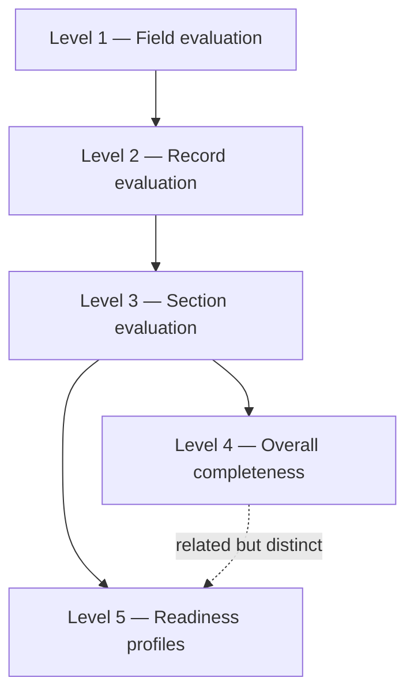
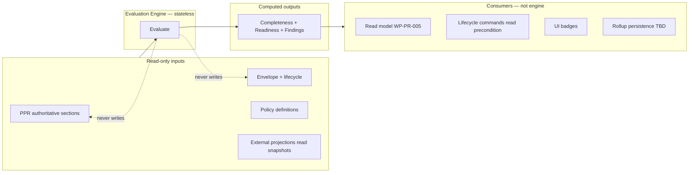
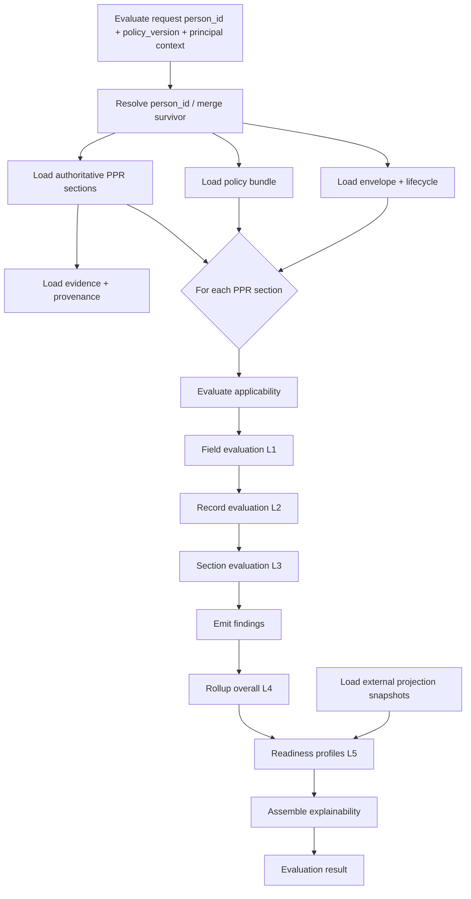
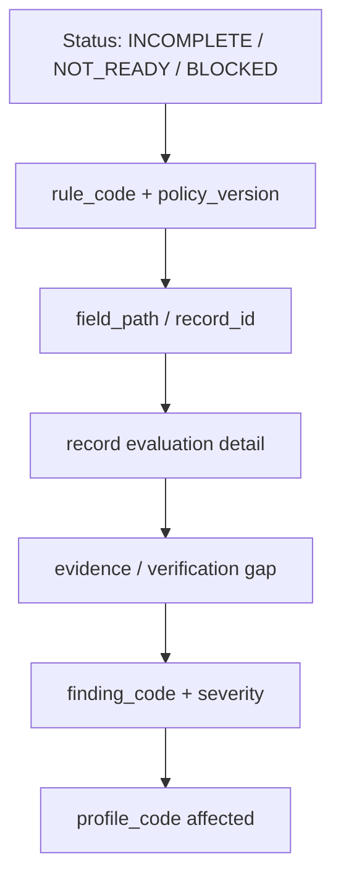
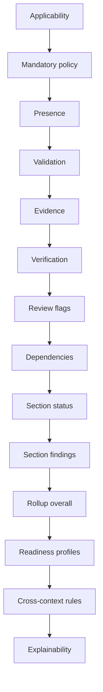
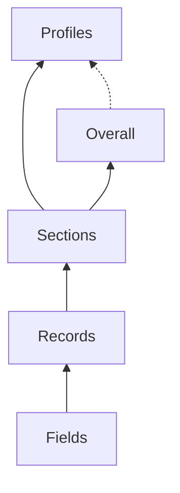
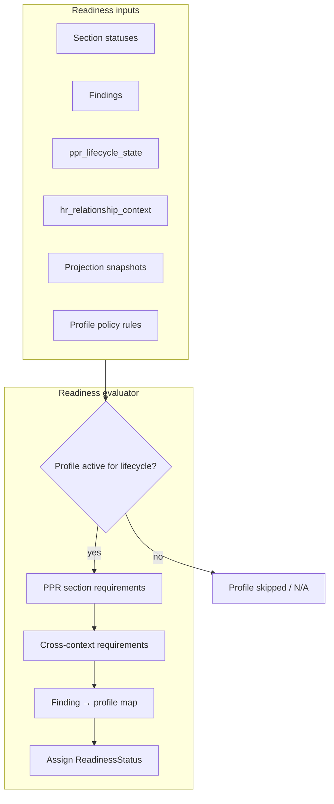
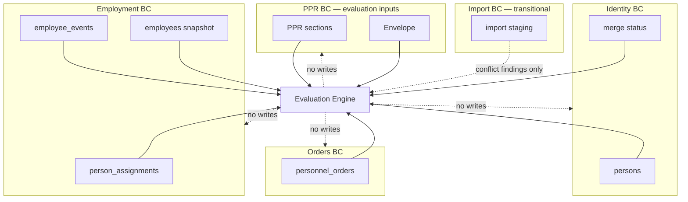
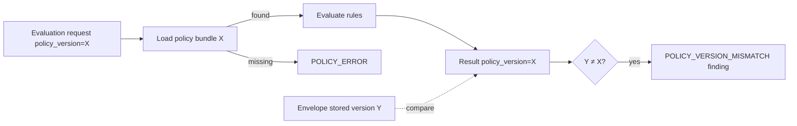
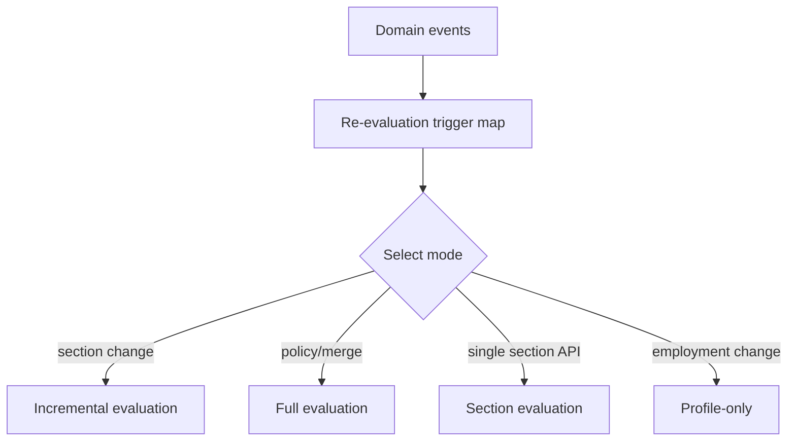

--------------------------------------------------

Document Status

Document:
WP-PR-006-completeness-and-readiness-evaluation-engine

Title:
Personnel Personal Record — Completeness & Readiness Evaluation Engine

Type:
Architecture Work Package

Status:
Draft — Ready for Review

Revision:
1

Date:
2026-07-15

Parent:
ADR-054 — Personnel Personal Record Aggregate Model

Depends on:
ARCH-002, WP-PR-002 (Completed), WP-PR-003 (Draft — Ready for Review), WP-PR-004 (Draft — Ready for Review), WP-PR-005 (Draft — Ready for Review), WP-HR-CARD-002 (Draft)

Purpose:
Normative architecture of the PPR Completeness & Readiness Evaluation Engine.
Defines **computation** only — not storage, UI, REST, or implementation.
No code, migrations, or API changes in this WP.

--------------------------------------------------

# WP-PR-006 — Completeness & Readiness Evaluation Engine

**Date:** 2026-07-15

---

## 1. Purpose

### 1.1 What the Evaluation Engine is

**PPR Completeness & Readiness Evaluation Engine** (далее — **Evaluation Engine**) — stateless, deterministic domain service, вычисляющий:

- **Completeness** — многоуровневое покрытие кадрового содержания PPR (Levels 1–4 per [WP-PR-003 §4](./WP-PR-003-section-catalog-and-completeness-model.md));
- **Readiness** — готовность PPR и связанных процессов по **readiness profiles** (Level 5 per WP-PR-003 §8);
- **Findings** — объяснимые результаты проверки правил;
- **Explainability artifacts** — цепочки причин для каждого статуса.

Evaluation Engine **читает** authoritative inputs и **возвращает** вычисленный результат. Он **не владеет** данными и **не изменяет** aggregate state.

**Canonical evaluation key:** `person_id` (после identity resolution per [WP-PR-005 §3](./WP-PR-005-logical-read-model-and-composite-projection.md)).

### 1.2 What the Evaluation Engine is NOT

| Not in scope | Owner / document |
|--------------|------------------|
| **Workflow engine** | Separate process automation |
| **Lifecycle state machine** | [WP-PR-004](./WP-PR-004-ppr-lifecycle-and-state-machine.md) — commands change lifecycle; engine only reads lifecycle as input |
| **UI rendering** | [WP-HR-CARD-002](./WP-HR-CARD-002-unified-personnel-record-card.md) — badges consume engine output |
| **Permissions / RBAC** | Security BC — engine receives principal context as input; does not decide grants |
| **Import pipeline** | Import BC — staging may be read as transitional input; not SoT |
| **Storage / persistence** | Envelope rollup fields on `personnel_record_metadata` — **output consumer**, not engine internals |
| **REST API design** | EPIC-3 / read model — separate WP |
| **HR policy content** | HR/legal tables — engine consumes `policy_version`; content approval separate (WP-PR-003 §7.0) |
| **DSL / rule language implementation** | Architecture only — no scripting engine prescribed |

### 1.3 Relationship to WP-PR-003

| WP-PR-003 defines | WP-PR-006 defines |
|-------------------|-------------------|
| Completeness hierarchy (Levels 1–5) | **How** each level is computed |
| `CompletenessStatus`, `ReadinessStatus`, `ReviewStatus` enums | Evaluation mapping to enums |
| Section catalog, mandatory policy **types** | Rule evaluation order and inputs |
| Readiness profile catalog | Profile evaluation algorithm |
| Findings contract (INFO / WARNING / BLOCKING) | Engine severity taxonomy + mapping |
| Rollup principles | Rollup algorithm (non-arithmetic) |

### 1.4 Architectural constraints (non-negotiable)

| Constraint | Source |
|------------|--------|
| Evaluation keyed by **`person_id`** | ADR-054, WP-PR-003 D-2 |
| **`employee_id` not owner** of evaluation | WP-PR-003 D-2, WP-PR-005 D-2 |
| Completeness **≠** readiness | WP-PR-003 D-7 |
| Completeness **≠** lifecycle | WP-PR-004 C-1…C-5 |
| **UI is not evaluator** | WP-PR-003 D-10, INV-5 |
| Employment projections **excluded** from PPR completeness denominator | WP-PR-003 D-11 |
| **Percentage is secondary** | WP-PR-003 D-6 |
| **Findings mandatory** for explainability | WP-PR-003 D-8 |
| **`policy_version` mandatory** | WP-PR-003 D-9 |
| Engine is **read-only** w.r.t. owner BCs | WP-PR-005 D-17 |

---

## 2. Evaluation architecture

### 2.1 Independent evaluation levels

Evaluation Engine разделяет вычисления на **независимые, воспроизводимые уровни**. Каждый уровень имеет собственные inputs, rules и outputs. Вышестоящий уровень **агрегирует** результаты нижестоящего, но **не переопределяет** их семантику.



### 2.2 Level responsibilities

| Level | Grain | Primary output | Consumed by |
|-------|-------|----------------|-------------|
| **1 — Field** | Single field path in section schema | `FieldStatus`: EMPTY \| FILLED \| NOT_APPLICABLE \| INVALID | Record evaluation |
| **2 — Record** | Single row (education, relative, …) | `CompletenessStatus` at record grain + record findings | Section evaluation |
| **3 — Section** | `PPR-*` business section | `CompletenessStatus` + section findings + verification/review dimensions | Overall rollup, readiness |
| **4 — Overall** | Entire PPR aggregate (applicable sections) | `overall_status` + `section_summary[]` + rollup findings | Readiness (partial input), read model |
| **5 — Readiness** | Per `profile_code` | `ReadinessStatus` per profile + profile findings | Lifecycle preconditions (read-only), capabilities |

### 2.3 Orthogonal dimensions (not levels)

These are evaluated **in parallel** with completeness levels, not as substitutes:

| Dimension | Enum | Evaluated at |
|-----------|------|--------------|
| **Review / quality** | `ReviewStatus` | Record / section |
| **Verification** | verification states per WP-PR-003 §9 | Record / section |
| **Applicability** | `APPLICABLE` \| `NOT_APPLICABLE` \| `UNKNOWN` | Section (before mandatory rules) |

### 2.4 Engine boundary



---

## 3. Evaluation pipeline

### 3.1 Full pipeline (normative)

Архитектурный pipeline без привязки к классам, очередям или SQL.

```text
1. Resolve person_id          (identity resolution — WP-PR-005; engine input)
2. Load envelope              (materialization, lifecycle, hr_relationship_context, stored policy_version)
3. Load policy bundle         (completeness + readiness rules for policy_version)
4. Load applicable sections   (authoritative PPR section data per catalog)
5. Load evidence / provenance (per record; verification inputs)
6. Load external snapshots    (cross-context inputs for profiles only — read-only)
7. Evaluate applicability     (per PPR-* section)
8. Evaluate fields            (Level 1, per applicable section)
9. Evaluate records           (Level 2)
10. Evaluate sections         (Level 3 + verification + review)
11. Emit section findings     (rule outputs)
12. Rollup overall            (Level 4 — non-arithmetic)
13. Evaluate readiness        (Level 5 — per profile)
14. Assemble explainability   (cause chains)
15. Attach evaluation metadata (policy_version, evaluated_at, input fingerprints)
16. Return result             (to read model / persistence consumer / capabilities)
```



### 3.2 Pipeline modes

| Mode | Scope | Trigger |
|------|-------|---------|
| **Full evaluation** | All levels, all applicable sections, all active profiles | Materialization, policy change, merge reconciliation |
| **Section evaluation** | Levels 1–3 for one `section_code` + dependent rollup/readiness | `PPR_SECTION_UPDATED` |
| **Incremental evaluation** | Recompute affected sections + rollup + impacted profiles | Section/evidence change with dependency graph |
| **Lazy evaluation** | Defer Level 5 until profile requested | Registry summary without all profiles **TBD** |

### 3.3 Capabilities consumption

Evaluation result is **input** to capability computation ([WP-PR-005 §9](./WP-PR-005-logical-read-model-and-composite-projection.md)) — not vice versa:

```text
Evaluation result
    ↓
Capabilities composer (authorization + lifecycle + evaluation)
    ↓
Read model capabilities[]
```

---

## 4. Evaluation inputs

### 4.1 Input categories

| Category | Source | Role in evaluation | UI as source? |
|----------|--------|-------------------|---------------|
| **Authoritative PPR sections** | `person_education`, `person_training`, `persons`, future `person_*` tables | Levels 1–3 primary data | **Forbidden** |
| **Envelope** | `personnel_record_metadata` **planned** | Lifecycle context; stored rollup snapshot; `policy_version` reference | **Forbidden** |
| **Evidence** | `source_document_id`, person_documents linkage, verification columns | Verification / evidence rules | **Forbidden** |
| **External projections** | Employment, Orders, Identity bridges — **read snapshots only** | Cross-context readiness profiles only | **Forbidden** |
| **Policy** | Policy store **TBD** — versioned rule definitions | All rule evaluation | **Forbidden** |
| **Lifecycle** | `ppr_lifecycle_state`, `hr_relationship_context` | Applicability, profile activation, preconditions | **Forbidden** |
| **Principal context** | Authorization snapshot passed in | Field redaction in explainability only — **not** rule mutation | **Forbidden** |
| **Transitional import overlay** | Import Profile, normalized records | **Excluded** from authoritative evaluation unless promoted to SoT — may produce `SOURCE_CONFLICT` finding only | **Forbidden** |

### 4.2 Input contract (architectural)

| Input field | Required | Description |
|-------------|----------|-------------|
| `person_id` | Yes | Canonical evaluation key |
| `policy_version` | Yes | Completeness + readiness policy bundle id |
| `evaluation_mode` | Yes | full \| section \| incremental \| profile |
| `section_codes` | Conditional | For section/incremental mode |
| `profile_codes` | Conditional | For profile-only lazy mode |
| `as_of` | Optional | Point-in-time evaluation **TBD** |
| `principal_context` | Optional | Redaction for explainability output |
| `projection_snapshots` | Conditional | Cross-context profiles; supplied by read orchestrator |

### 4.3 Materialization gate

| Envelope state | Evaluation behavior |
|----------------|---------------------|
| **NOT_MATERIALIZED** | Return `evaluation_status = NOT_EVALUABLE`; empty section results; readiness `NOT_READY` or `NOT_EVALUABLE` **TBD** |
| **MERGED (loser)** | Evaluate **survivor** `person_id` only; attach merge metadata |
| **ARCHIVED** | Full read-only evaluation permitted |

### 4.4 Forbidden inputs

| Forbidden | Reason |
|-----------|--------|
| UI form state | INV-5 |
| `employee_import_profile_overrides` as SoT | TEMPORARY staging |
| Composite read model cached without `policy_version` | Non-reproducible |
| Random / time-based rule outcomes | Violates determinism §13 |

---

## 5. Evaluation outputs

### 5.1 Normative result structure

| Output block | Content |
|--------------|---------|
| `evaluation_status` | `OK` \| `PARTIAL` \| `NOT_EVALUABLE` \| `POLICY_ERROR` |
| `person_id` | Evaluated person (survivor if merge redirect) |
| `policy_version` | Policy bundle used |
| `overall_completeness` | Level 4 rollup |
| `section_results` | Map `section_code` → section evaluation |
| `profile_results` | Map `profile_code` → readiness evaluation |
| `findings` | All findings (flat or grouped) |
| `warnings` | Engine-level warnings (policy mismatch, partial inputs) |
| `explainability` | Cause chains per status |
| `evaluation_timestamp` | `evaluated_at` |
| `input_fingerprint` | Hash of inputs + policy for idempotency check **TBD** |

### 5.2 `overall_completeness` (Level 4)

Per [WP-PR-003 §11](./WP-PR-003-section-catalog-and-completeness-model.md):

```json
{
  "overall_status": "PARTIALLY_COMPLETE",
  "completion_ratio": 0.62,
  "completion_ratio_scope": "mandatory_applicable_sections_only",
  "optional_coverage_ratio": 0.40,
  "section_summary": [],
  "blocking_findings": [],
  "warnings": []
}
```

**Primary:** `overall_status` + `section_summary` + findings. **`completion_ratio` is secondary** (display only).

### 5.3 `section_results` (Level 3)

Per section:

| Field | Description |
|-------|-------------|
| `section_code` | `PPR-*` |
| `completeness_status` | `CompletenessStatus` enum |
| `applicability_result` | From applicability evaluation |
| `mandatory_policy` | UNIVERSAL \| LIFECYCLE \| … |
| `record_results[]` | Level 2 summaries |
| `verification_summary` | Aggregated verification dimension |
| `review_summary` | Aggregated ReviewStatus |
| `findings[]` | Section-scoped |
| `explainability_ref` | Pointer to cause chain |

### 5.4 `profile_results` (Level 5)

Per profile:

| Field | Description |
|-------|-------------|
| `profile_code` | e.g. `HIRE_READY` |
| `readiness_status` | `ReadinessStatus` |
| `profile_class` | `PPR` \| `CROSS_CONTEXT` |
| `required_sections_met` | boolean / detail |
| `cross_context_inputs_met` | boolean / detail |
| `findings[]` | Profile-scoped |
| `explainability_ref` | Why NOT_READY / BLOCKED |

---

## 6. Explainability

### 6.1 Principle

**No magic percentages.** Every `CompletenessStatus`, `ReadinessStatus`, and rollup decision **must** be traceable to:

1. Rule id (`rule_code`);
2. Policy version;
3. Specific fields / records / evidence;
4. Finding codes;
5. Affected profile (if readiness).

### 6.2 Explainability chain

```text
Section incomplete (PPR-EDUCATION = INCOMPLETE)
    ↓ rule: MANDATORY_RECORD_MISSING (rule_code)
    ↓ policy: ppr-completeness-v1 / HIRE_READY requires basic education record
    ↓ field: institution_name EMPTY on record education_id=55
    ↓ evidence: source_document_id null (EVIDENCE_MISSING finding)
    ↓ profile impact: HIRE_READY = NOT_READY
```



### 6.3 Explainability artifact contract

| Field | Description |
|-------|-------------|
| `target_type` | field \| record \| section \| overall \| profile |
| `target_ref` | section_code, profile_code, record_id, field_path |
| `status_assigned` | Resulting enum value |
| `rule_code` | Stable rule identifier |
| `policy_version` | Rule bundle version |
| `cause_findings[]` | Finding codes that contributed |
| `cause_fields[]` | Field paths |
| `cause_records[]` | Record ids |
| `message_key` | i18n explanation |
| `profile_impacts[]` | Profiles affected by this cause |

### 6.4 Percent display rules

| Rule | Specification |
|------|---------------|
| **EXP-1** | `completion_ratio` **must** include `completion_ratio_scope` label |
| **EXP-2** | Ratio **cannot** be the only output for mandatory compliance |
| **EXP-3** | UI tooltip / detail panel **must** link to explainability chain |
| **EXP-4** | Redacted explainability for sensitive fields — field path only, no value |

---

## 7. Rule model

### 7.1 Architectural rule types

**No DSL.** Rules are declarative definitions consumed by the engine. Implementation may use tables, config files, or code registry — **not prescribed**.

| Rule type | Purpose | Evaluated at |
|-----------|---------|--------------|
| **Applicability rule** | Whether section applies to this Person/context | Before mandatory; sets NOT_APPLICABLE |
| **Mandatory rule** | Whether section/field/record required | After applicability |
| **Presence rule** | Whether required data present | Field / record level |
| **Verification rule** | Whether verification dimension satisfied | Record / section level |
| **Evidence rule** | Whether linked evidence satisfies policy | Record level |
| **Validation rule** | Format, date order, cardinality | Field / record level |
| **Dependency rule** | Cross-section or cross-field preconditions | Section level |
| **Profile rule** | Readiness profile requirements | Level 5 |
| **Cross-context rule** | External projection requirements for profiles | Level 5 only |

### 7.2 Rule identity

| Field | Description |
|-------|-------------|
| `rule_code` | Stable id (e.g. `MANDATORY_FIELD_IIN`, `HIRE_READY_SECTION_EDUCATION`) |
| `rule_type` | From §7.1 |
| `policy_version` | Bundle membership |
| `section_code` | Target section (nullable for profile rules) |
| `profile_code` | Target profile (profile rules only) |
| `severity_on_fail` | Default finding severity |
| `parameters` | Policy-defined thresholds, field lists **TBD** storage |

### 7.3 Rule sources

| Source | Content |
|--------|---------|
| **Section catalog** | WP-PR-003 §3.1 — `completeness_rule`, `applicability_rule`, `mandatory policy` columns |
| **Readiness profile matrix** | WP-PR-003 §8.2 — profile requirements (content HR-approved **TBD**) |
| **Validation catalog** | WP-PR-003 §3.1 `validation_rule` column |
| **Cross-context declarations** | WP-PR-003 §8.0 — explicit non-PPR inputs per profile |

### 7.4 Cyclic dependency prohibition

Dependency rules **must** form a directed acyclic graph (DAG) over sections/fields. Cycles are **policy errors** (`POLICY_ERROR`), not runtime guesses.

---

## 8. Rule evaluation order

### 8.1 Normative order (per section)

```text
1. Catalog lookup        (is PPR-* business section? skip PROJ-*)
2. Applicability rule
3. Mandatory policy      (UNIVERSAL / LIFECYCLE / PROCESS / POSITION / OPTIONAL)
4. Presence rules        (field → record)
5. Validation rules      (format, dates)
6. Evidence rules        (linked documents)
7. Verification rules    (verification dimension)
8. Review rules          (orthogonal flags — do not override completeness enum)
9. Dependency rules      (other sections)
10. Section status assign (CompletenessStatus)
11. Section findings emit
```

### 8.2 Post-section order

```text
All sections complete (steps 1–11)
    ↓
12. Overall rollup (Level 4)
    ↓
13. Readiness profile rules (Level 5)
    ↓
14. Cross-context rules (Level 5, profiles that declare external inputs)
    ↓
15. Explainability assembly
```



### 8.3 Order invariants

| ID | Invariant |
|----|-----------|
| **ORD-1** | Applicability **before** mandatory — NOT_APPLICABLE skips mandatory penalty |
| **ORD-2** | Presence **before** verification — cannot verify absent data |
| **ORD-3** | Evidence **before** verification satisfaction that requires document |
| **ORD-4** | Section rollup **before** readiness — profiles consume section statuses |
| **ORD-5** | Overall rollup **before** PPR-class readiness profiles |
| **ORD-6** | Cross-context rules **after** PPR inputs evaluated |
| **ORD-7** | Review **never** short-circuits presence evaluation |

---

## 9. Findings model

### 9.1 Findings are not completeness

**Findings** — отдельные наблюдения rule engine. `CompletenessStatus` и `ReadinessStatus` **выводятся** из правил и findings, но finding **не является** синонимом статуса.

| Statement | True |
|-----------|------|
| Finding describes a condition | ✅ |
| Finding alone defines overall_status | ❌ |
| Multiple findings may map to one status | ✅ |
| One finding may affect multiple profiles | ✅ (when policy declares) |

### 9.2 Severity taxonomy (Evaluation Engine)

Engine uses **four severities** internally. Mapping to [WP-PR-003 §10](./WP-PR-003-section-catalog-and-completeness-model.md) preserved:

| Engine severity | WP-PR-003 severity | Typical effect |
|-----------------|-------------------|----------------|
| **INFO** | INFO | Informational; no status downgrade |
| **WARNING** | WARNING | May yield `READY_WITH_WARNINGS`; no mandatory completeness downgrade |
| **ERROR** | *(engine extension)* | May prevent `COMPLETE_*` on affected record/section; does not auto-BLOCK profile unless profile rule maps it |
| **CRITICAL** | **BLOCKING** | May prevent `COMPLETE_*`; may set profile `BLOCKED` per policy |

**Normative mapping:** `CRITICAL` ≡ WP-PR-003 `BLOCKING` for interchange with WP-PR-003 contracts.

### 9.3 Severity effects matrix

| Severity | Affects CompletenessStatus? | Affects ReadinessStatus? | Example codes |
|----------|----------------------------|--------------------------|---------------|
| **INFO** | No | No | `SECTION_NOT_APPLICABLE`, `EMPLOYMENT_PROJECTION_UNAVAILABLE` |
| **WARNING** | No mandatory downgrade | May → `READY_WITH_WARNINGS` | `RECORD_UNVERIFIED`, `SOURCE_CONFLICT`, `POLICY_VERSION_MISMATCH` |
| **ERROR** | May cap at `INCOMPLETE` / `PARTIALLY_COMPLETE` | May → `NOT_READY` | `DATE_RANGE_INVALID`, `REQUIRED_FIELD_MISSING` (non-critical policy) |
| **CRITICAL** | May prevent `COMPLETE_VERIFIED` / `COMPLETE_UNVERIFIED` | May → `BLOCKED` for listed profiles | `PERSON_LINK_MISSING`, `MERGE_RECONCILIATION_REQUIRED` |

### 9.4 Finding contract (extends WP-PR-003 §10.1)

| Field | Type | Description |
|-------|------|-------------|
| `finding_code` | string | Stable code |
| `severity` | enum | INFO \| WARNING \| ERROR \| CRITICAL |
| `section_code` | string | Nullable for cross-cutting |
| `field_path` | string | Nullable |
| `record_id` | string | Nullable |
| `rule_code` | string | Originating rule |
| `message_key` | string | i18n |
| `status` | enum | OPEN \| RESOLVED \| WAIVED **TBD** |
| `detected_at` | datetime | Evaluation time |
| `process_profile` | string | Nullable — profile scope |
| `explainability_ref` | string | Link to cause chain |

### 9.5 Minimum finding catalog

Inherits WP-PR-003 §10.2 codes. Engine additions:

| finding_code | Default severity | Description |
|--------------|------------------|-------------|
| `EVAL_INPUT_PARTIAL` | WARNING | External snapshot missing for cross-context profile |
| `EVAL_POLICY_UNKNOWN` | CRITICAL | Requested policy_version not found |
| `EVAL_SECTION_NOT_IMPLEMENTED` | INFO | Section catalog entry exists; no storage |
| `EVAL_DEPENDENCY_UNSATISFIED` | ERROR | Cross-section dependency failed |

---

## 10. Rollup model

### 10.1 Rollup hierarchy

```text
Field results
    ↓ aggregate
Record completeness
    ↓ aggregate
Section completeness
    ↓ aggregate (non-arithmetic)
Overall completeness
    ↓ input to
Readiness profile evaluation
```



### 10.2 Record → section rollup

| Rule | Specification |
|------|---------------|
| **RU-1** | Section status derived from **worst applicable mandatory record** per policy — not average |
| **RU-2** | Zero records: `NOT_STARTED` if applicable mandatory; `NOT_APPLICABLE` if applicability false |
| **RU-3** | Attestation «нет данных» (e.g. no prior employment) — valid only when policy allows explicit attestation record **TBD** |
| **RU-4** | OPTIONAL sections with zero records — `NOT_STARTED` without overall penalty |

### 10.3 Section → overall rollup

Per [WP-PR-003 §11.1](./WP-PR-003-section-catalog-and-completeness-model.md):

| Rule | Specification |
|------|---------------|
| **RU-5** | **NOT_APPLICABLE** sections excluded from denominator |
| **RU-6** | **OPTIONAL** empty sections excluded from overall **status** penalty |
| **RU-7** | **AGGREGATE-ENVELOPE** excluded from denominator |
| **RU-8** | **PROJ-*** excluded entirely |
| **RU-9** | Overall `overall_status` = f(mandatory applicable section statuses) — **worst-wins** lattice, not mean |
| **RU-10** | `completion_ratio` = informational count metric; scope labeled; **not** primary |
| **RU-11** | CRITICAL finding does **not** auto-set global BLOCKED — profile rules decide |

### 10.4 Overall status lattice (worst-wins sketch)

```text
NOT_STARTED < INCOMPLETE < PARTIALLY_COMPLETE < COMPLETE_UNVERIFIED < COMPLETE_VERIFIED
NOT_APPLICABLE — excluded from rollup
```

Overall takes **minimum** rank among mandatory applicable sections (least complete wins).

### 10.5 Prohibited rollup patterns

| Prohibited | Reason |
|------------|--------|
| Simple average of section percentages | Hides blocking gaps (WP-PR-003 D-6) |
| Counting PROJ-* sections | Employment not in PPR completeness |
| Double-counting evidence as section | WP-PR-003 D-16 |
| Mixing ReviewStatus into CompletenessStatus ordinal | Orthogonal dimensions |

---

## 11. Readiness engine

### 11.1 Separation from completeness

**Readiness is not computed from percentages.**

| Input | Used for readiness? |
|-------|---------------------|
| `completion_ratio` | **No** — display only |
| `overall_status` | **Partial** — input signal, not sole determinant |
| Section `CompletenessStatus` per profile-required sections | **Yes** |
| Findings (CRITICAL / ERROR per profile mapping) | **Yes** |
| `ppr_lifecycle_state` | **Yes** — activates profile sets |
| Cross-context projection snapshots | **Yes** — cross-context profiles only |
| Verification dimension | **Yes** — when profile requires `COMPLETE_VERIFIED` |

### 11.2 Readiness evaluation algorithm (architectural)

```text
For each active profile_code (per lifecycle + policy):
  1. Load profile rule bundle
  2. If profile_class = PPR:
       check required sections/fields/verification per profile rule
  3. If profile_class = CROSS_CONTEXT:
       check PPR requirements AND declared projection inputs
  4. Evaluate profile-specific findings mapping
  5. Assign ReadinessStatus:
       - any CRITICAL finding mapped to profile → BLOCKED
       - requirements not met → NOT_READY
       - met with open WARNING → READY_WITH_WARNINGS
       - met clean → READY
  6. Emit explainability per profile
```



### 11.3 Profile catalog

Per [WP-PR-003 §8.1](./WP-PR-003-section-catalog-and-completeness-model.md):

| profile_code | Class |
|--------------|-------|
| `CANDIDATE_PROFILE_READY` | PPR |
| `HIRE_READY` | PPR |
| `EMPLOYMENT_READY` | Cross-context |
| `PERSONNEL_ORDER_READY` | Cross-context |
| `HR_AUDIT_READY` | PPR |
| `PERSONAL_RECORD_EXPORT_READY` | PPR |

### 11.4 Readiness vs lifecycle (normative)

| Rule | Source |
|------|--------|
| Readiness **never** triggers lifecycle transition | WP-PR-004 C-1 |
| Lifecycle commands **may read** readiness as precondition | WP-PR-004 C-2 |
| `MarkPPRReady` may require profile = READY at command time | WP-PR-004 §8.2 example |
| `ppr_lifecycle_state = READY` ≠ readiness profile `READY` | WP-PR-004 R-5 |

---

## 12. Cross-context dependencies

### 12.1 Read-only dependency map

Evaluation Engine **reads** external BC snapshots; **never mutates** them.



### 12.2 Cross-context inputs by profile (illustrative — policy TBD)

| profile_code | External inputs read |
|--------------|---------------------|
| `CANDIDATE_PROFILE_READY` | none |
| `HIRE_READY` | none (PPR only) |
| `EMPLOYMENT_READY` | `PROJ-EMPLOYMENT-RELATIONSHIP`, `PROJ-CURRENT-ASSIGNMENT` |
| `PERSONNEL_ORDER_READY` | `PROJ-PERSONNEL-ORDERS` state |
| `HR_AUDIT_READY` | none |
| `PERSONAL_RECORD_EXPORT_READY` | none |

### 12.3 Missing projection behavior

| Condition | PPR completeness | Cross-context readiness |
|-----------|------------------|-------------------------|
| Employment projection unavailable | Unchanged | `EMPLOYMENT_READY` → `NOT_READY` + `EVAL_INPUT_PARTIAL` or `EMPLOYMENT_PROJECTION_UNAVAILABLE` |
| Orders projection unavailable | Unchanged | `PERSONNEL_ORDER_READY` affected |

**Rule:** Employment gaps **do not** lower PPR overall completeness (WP-PR-003 D-11).

---

## 13. Determinism

### 13.1 Definition

**Deterministic evaluation:** для фиксированного набора inputs

```text
person_id + policy_version + authoritative section data
+ evidence + envelope lifecycle + projection snapshots + as_of (if used)
```

результат **идентичен** при каждом запуске.

### 13.2 Determinism rules

| ID | Rule |
|----|------|
| **DET-1** | No randomness, no ML confidence in status assignment Phase 1 |
| **DET-2** | No `evaluated_at` in rule logic — timestamp is output only |
| **DET-3** | Rule order fixed (§8) |
| **DET-4** | Tie-breaking explicit — e.g. worst-wins lattice §10.4 |
| **DET-5** | Same `policy_version` → same rule set |
| **DET-6** | Import overlay excluded unless committed to SoT |
| **DET-7** | Principal context affects **redaction only**, not rule outcomes |

### 13.3 Non-determinism sources (prohibited)

| Source | Mitigation |
|--------|------------|
| Floating policy without version | Require `policy_version` |
| Reading UI cache | Forbidden input |
| Concurrent unversioned projection | Pass `as_of` snapshot in input |
| Time-dependent rules without `as_of` | Policy must declare time anchor |

---

## 14. Idempotency

### 14.1 Definition

**Idempotent evaluation:** повторный вызов с теми же inputs **не изменяет** domain state.

Evaluation Engine is **pure function** (side-effect free):

```text
evaluate(inputs) → result
```

### 14.2 Idempotency rules

| ID | Rule |
|----|------|
| **IDP-1** | Engine does not INSERT/UPDATE owner BC tables |
| **IDP-2** | Rollup persistence (envelope snapshot) is **consumer responsibility** — compares `input_fingerprint` before write **TBD** |
| **IDP-3** | Re-evaluation may emit identical `PPR_COMPLETENESS_CHANGED` only if snapshot differs — consumer dedup **TBD** |
| **IDP-4** | Same inputs → byte-identical result JSON (excluding `evaluated_at` if excluded from hash) **TBD** canonical serialization |

### 14.3 Relationship to events

Engine **may be invoked** by event handlers; engine **does not** publish events itself (separation of evaluation vs notification).

---

## 15. Policy versioning

### 15.1 Mandatory `policy_version`

Every evaluation result **must** include:

| Field | Description |
|-------|-------------|
| `policy_version` | Identifier of loaded rule bundle |
| `completeness_policy_version` | May equal policy_version or sub-id **TBD** |
| `readiness_policy_version` | May equal policy_version or sub-id **TBD** |

### 15.2 Policy bundle contents (architectural)

| Content | Versioned |
|---------|-----------|
| Section catalog refs | Yes — pinned to catalog revision |
| Applicability rules | Yes |
| Mandatory policy per section | Yes |
| Field / record requirements | Yes |
| Readiness profile requirements | Yes |
| Finding severity mappings | Yes |
| Cross-context input declarations | Yes |

### 15.3 Policy mismatch handling

| Scenario | Behavior |
|----------|----------|
| Requested version not found | `evaluation_status = POLICY_ERROR`; CRITICAL finding `EVAL_POLICY_UNKNOWN` |
| Envelope stores older version than requested | Evaluate with requested; emit `POLICY_VERSION_MISMATCH` WARNING |
| Envelope stores newer than evaluator supports | `POLICY_VERSION_MISMATCH` CRITICAL **TBD** |



---

## 16. Re-evaluation triggers

Architectural triggers — **no queue implementation** prescribed.

| Trigger event | Evaluation mode | Scope |
|---------------|-----------------|-------|
| `PPR_SECTION_UPDATED` | Section / incremental | Changed section + rollup + affected profiles |
| `PPR_EVIDENCE_UPDATED` | Section / incremental | Parent section verification + rollup |
| `PPR_LIFECYCLE_CHANGED` | Full or profile-only | Applicability + active profile set |
| `PPR_COMPLETENESS_POLICY_CHANGED` | Full | All sections — new policy_version |
| `PERSON_MERGED` | Full | Survivor reconciliation + `MERGE_RECONCILIATION` findings |
| `EMPLOYMENT_CREATED` / `TERMINATED` | Profile-only | Cross-context profiles; `hr_relationship_context` inputs |
| `PERSONNEL_ORDER_APPLIED` | Profile-only | `PERSONNEL_ORDER_READY` |
| `IDENTITY_LINK_CHANGED` | Full | PPR-GENERAL + identity-dependent applicability |
| `IMPORT_PROMOTED_TO_SOT` | Section / full | PMF commit path — affected sections |
| Manual `ReevaluatePPR` command **TBD** | Full | Admin / HR |



**Link:** [WP-PR-005 §19](./WP-PR-005-logical-read-model-and-composite-projection.md) invalidation; WP-PR-004 `PPR_COMPLETENESS_CHANGED` event.

---

## 17. Performance model

Architectural strategies only — **no algorithms**.

| Strategy | Description | When |
|----------|-------------|------|
| **Full evaluation** | All sections, all profiles | Cold start, policy change, merge |
| **Incremental evaluation** | Dependency graph from changed section | Section update events |
| **Section evaluation** | Single `section_code` | Section API, editor save |
| **Lazy evaluation** | Defer Level 5 until profile requested | Registry list views |
| **Snapshot reuse** | Return stored rollup if `input_fingerprint` matches | Read model fast path **TBD** |
| **Parallel section evaluation** | Independent sections concurrent | Implementation option |
| **Batched registry evaluation** | Summary projection without records | PPR registry |

### 17.1 Performance invariants

| ID | Rule |
|----|------|
| **PERF-1** | Incremental **must** produce same result as full for same inputs |
| **PERF-2** | Lazy profile eval **must not** cache stale profile results across section changes without invalidation |
| **PERF-3** | Snapshot reuse **must** include `policy_version` in fingerprint |

---

## 18. Repository inventory

Read-only audit (2026-07-15). **Existing code is not evaluation engine.**

### 18.1 Exists today

| Artifact | Location | Evaluation relevance |
|----------|----------|---------------------|
| `person_education.verification_status` | `personnel_migration.py` | Verification rule input |
| `person_training.verification_status` | same | Same |
| `person_education.lifecycle_status` | same | Record active/void filter |
| `personnel_record_events` | same | Audit — not evaluation input for status |
| Section catalog (normative) | WP-PR-003 §3.1 | Rule definitions source |
| Completeness enums | WP-PR-003 §5 | Output enums |
| Readiness profiles (normative) | WP-PR-003 §8.1 | Profile rules source |
| Lifecycle ↔ completeness rules | WP-PR-004 §8, C-1…C-5 | Precondition read-only |
| Read model consumption | WP-PR-005 §7 | Output consumer |
| Import profile builders | `hr_import_profile_service.py` | **Not** evaluation SoT |
| `employee_import_profile_overrides` | ADR-038 | TEMPORARY — conflict findings only |

### 18.2 Absent today

| Component | Gap | Needed for engine |
|-----------|-----|-------------------|
| **Evaluation Engine service** | No `ppr_completeness` / `readiness` module | Core orchestrator |
| **`personnel_record_metadata`** | No envelope table | Lifecycle + stored rollup consumer |
| **Policy store** | No versioned rule bundle | `policy_version` loading |
| **Applicability evaluator** | No implementation | Rule type §7.1 |
| **Field/record rule registry** | No implementation | Levels 1–2 |
| **Section evaluator** | No implementation | Level 3 |
| **Rollup aggregator** | No implementation | Level 4 |
| **Readiness evaluator** | No implementation | Level 5 |
| **Explainability builder** | No implementation | §6 |
| **Finding persistence** | No store | Optional — may be ephemeral in result |
| **Re-evaluation trigger wiring** | No event handlers | §16 |
| **Cross-context snapshot supplier** | Partial (read model planned) | Projection inputs §12 |

### 18.3 Misleading artifacts (not evaluation evidence)

| Artifact | Why misleading |
|----------|------------------|
| `ImportProfileCardSections.tsx` | UI editor — not evaluator |
| `completion` in unrelated domains (operational orders) | Different bounded context |
| PMF `verification_status = pending` alone | Input signal — not computed completeness |
| Import JSON field counts | Not authoritative rollup |

### 18.4 Future work packages

| WP / EPIC | Delivers |
|-----------|----------|
| **WP-PR-006 implementation** | Engine service |
| **WP-PR-003 implementation** | Policy tables / seed |
| **WP-PR-004 implementation** | Envelope + `PPR_COMPLETENESS_CHANGED` |
| **WP-PR-005 implementation** | Read model embeds evaluation result |
| **EPIC-3** | API exposure |
| **WP-PR-024** **TBD** | Completeness UI |

---

## 19. Decision summary

| # | Decision |
|---|----------|
| **D-1** | Evaluation Engine is **stateless** and **deterministic** |
| **D-2** | Completeness evaluation is **explainable** — no magic percentages |
| **D-3** | **Readiness is independent** from `completion_ratio` and not derived from percentages |
| **D-4** | **`policy_version` is mandatory** on every evaluation result |
| **D-5** | Evaluation is keyed by **`person_id`**; `employee_id` is not owner |
| **D-6** | **Rule evaluation order is fixed** (§8) |
| **D-7** | **Rollup is non-arithmetic** — worst-wins lattice, not averaging |
| **D-8** | **UI is not evaluator** — consumes engine output only |
| **D-9** | **Findings are not completeness/status** — separate observations |
| **D-10** | Engine severity **CRITICAL** maps to WP-PR-003 **BLOCKING** |
| **D-11** | **Employment projections excluded** from PPR completeness denominator |
| **D-12** | **Cross-context rules** apply only to cross-context readiness profiles |
| **D-13** | Engine **never mutates** owner BC data (read-only) |
| **D-14** | **Re-evaluation is idempotent** — repeat produces same result, no side effects |
| **D-15** | **Lifecycle does not auto-change** from evaluation (WP-PR-004 C-1) |
| **D-16** | **NOT_APPLICABLE ≠ EMPTY** — distinct evaluation paths |
| **D-17** | **OPTIONAL** sections do not penalize overall status when empty |
| **D-18** | **Review and verification** are orthogonal dimensions — not folded into completeness enum |
| **D-19** | **Incremental evaluation must equal full** evaluation for identical inputs |

---

## 20. Open questions

| ID | Question |
|----|----------|
| **OQ-1** | Policy storage — DB tables vs config service vs code registry |
| **OQ-2** | Future **policy editor** UI and approval workflow |
| **OQ-3** | Formal **rule language** — stay declarative tables vs limited expression syntax |
| **OQ-4** | **Cached evaluation** snapshot on envelope — always recompute vs store |
| **OQ-5** | **Manual override / waiver** of findings with audit |
| **OQ-6** | **Re-evaluation SLA** — max staleness for rollup snapshot |
| **OQ-7** | `as_of` point-in-time evaluation for audit replay |
| **OQ-8** | **ERROR** vs **CRITICAL** boundary — canonical mapping to HR policy |
| **OQ-9** | Finding **persistence** — ephemeral in result vs `ppr_findings` table |
| **OQ-10** | **Batch evaluation** for PPR registry — parallelism limits |
| **OQ-11** | **Candidate self-service** — which rules apply at reduced principal |
| **OQ-12** | **Sensitive findings** redaction in explainability for non-HR principals |
| **OQ-13** | **Attestation records** («нет стажа», «не применимо») typed storage |
| **OQ-14** | **Profile activation matrix** per `ppr_lifecycle_state` — exhaustive list |
| **OQ-15** | **Canonical JSON serialization** for `input_fingerprint` / idempotency hash |
| **OQ-16** | **WAIVED** finding status — who may waive CRITICAL |
| **OQ-17** | Engine **packaging** — monolith service vs library module |
| **OQ-18** | Relationship to **WP-PR-024** completeness UI badges |

All marked **TBD**.

---

## 21. Risks

| Risk | Impact | Mitigation |
|------|--------|------------|
| **Policy drift** | Inconsistent evaluations across environments | Mandatory `policy_version`; POLICY_VERSION_MISMATCH findings |
| **Hidden evaluation** | UI computes completeness locally | D-8; WP-PR-005 capabilities consume engine only |
| **Magic percentages** | False sense of compliance | D-2, EXP-*; ratio secondary |
| **Performance at scale** | Full eval on every keystroke | Incremental + section modes §17 |
| **Cyclic dependency rules** | Non-terminating evaluation | DAG validation; POLICY_ERROR |
| **Cross-context leakage** | Employment gaps lower PPR completeness | D-11; separate profile class |
| **Manual overrides without audit** | Compliance gap | OQ-5; WAIVED status with actor **TBD** |
| **Import dual-read drift** | Staging mistaken for SoT | Exclude import from authoritative input §4 |
| **Stale rollup cache** | Wrong readiness preconditions | `input_fingerprint`; event invalidation §16 |
| **Severity inflation** | Everything CRITICAL | ERROR vs CRITICAL policy mapping OQ-8 |
| **Over-eager BLOCKED** | Process stopped incorrectly | Profile-specific CRITICAL mapping §9.3 |
| **Non-reproducible eval** | Audit failure | Determinism §13 |

---

## 22. Mermaid diagrams index

| # | Diagram | Section |
|---|---------|---------|
| 1 | Evaluation pipeline | §3.1 |
| 2 | Rule evaluation order | §8.2 |
| 3 | Rollup hierarchy | §10.1 |
| 4 | Readiness engine | §11.2 |
| 5 | Cross-context dependencies | §12.1 |
| 6 | Re-evaluation triggers | §16 |
| 7 | Explainability chain | §6.2 |
| 8 | Policy versioning | §15.3 |

Additional: §2.1 (evaluation levels), §2.4 (engine boundary).

---

## 23. Consistency check

| Document | Check | Status |
|----------|-------|--------|
| **ARCH-002** | INV-5 UI not SoT; PPR centrality | ✅ |
| **ADR-054** | `person_id` key; Person-root | ✅ |
| **WP-PR-002** | Employment OUT of aggregate; envelope IN | ✅ |
| **WP-PR-003** | Levels 1–5; enums; findings; rollup rules; profiles | ✅ severity mapping |
| **WP-PR-004** | C-1 no lifecycle auto-change; preconditions read-only | ✅ |
| **WP-PR-005** | Read model consumes evaluation; not evaluator | ✅ |
| **WP-HR-CARD-002** | Badges read engine; PPR-REP-001 | ✅ |

| Invariant | Status |
|-----------|--------|
| `person_id` canonical | ✅ |
| `employee_id` not owner | ✅ |
| Completeness ≠ readiness | ✅ |
| Completeness ≠ lifecycle | ✅ |
| No UI as source | ✅ |
| Employment not in denominator | ✅ |
| No magic percentages | ✅ |
| Deterministic + idempotent | ✅ |
| Engine read-only | ✅ |

---

## References

- [ARCH-002 — Personnel Personal Record Architecture](./ARCH-002-personnel-personal-record-architecture.md)
- [ADR-054 — Personnel Personal Record Aggregate Model](../adr/ADR-054-personnel-personal-record-aggregate-model.md)
- [WP-PR-002 — Aggregate Boundary Specification](./WP-PR-002-aggregate-boundary-specification.md)
- [WP-PR-003 — Section Catalog & Completeness Model](./WP-PR-003-section-catalog-and-completeness-model.md)
- [WP-PR-004 — PPR Lifecycle & State Machine](./WP-PR-004-ppr-lifecycle-and-state-machine.md)
- [WP-PR-005 — Logical Read Model & Composite Projection](./WP-PR-005-logical-read-model-and-composite-projection.md)
- [WP-HR-CARD-002 — Unified Personnel Record Card](./WP-HR-CARD-002-unified-personnel-record-card.md)

---

*End of WP-PR-006*
