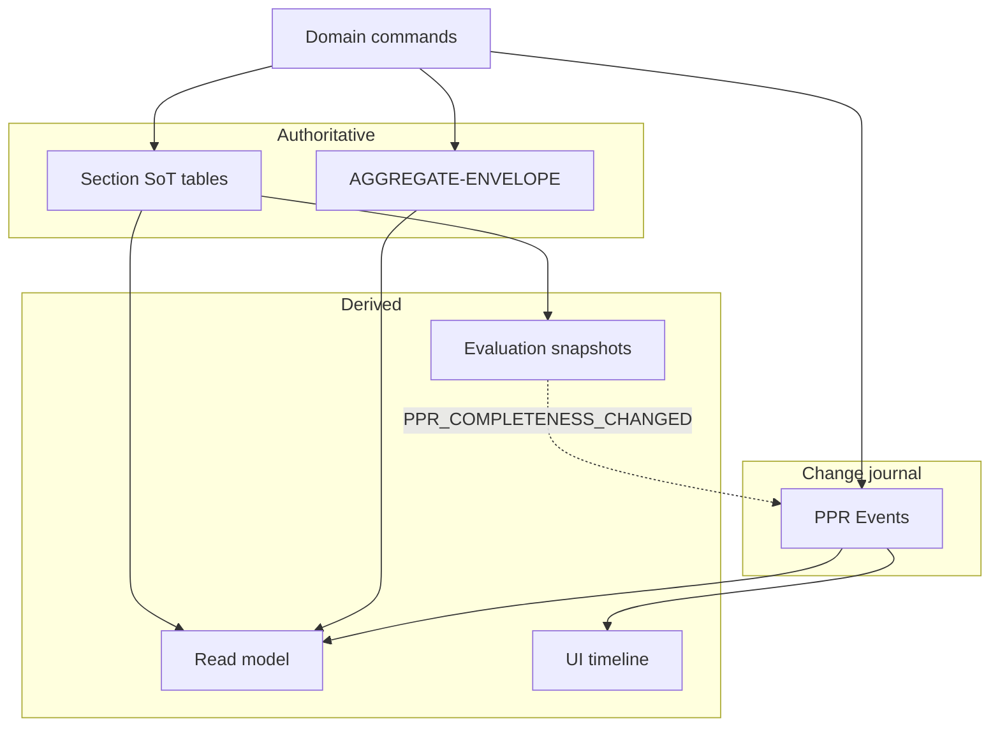
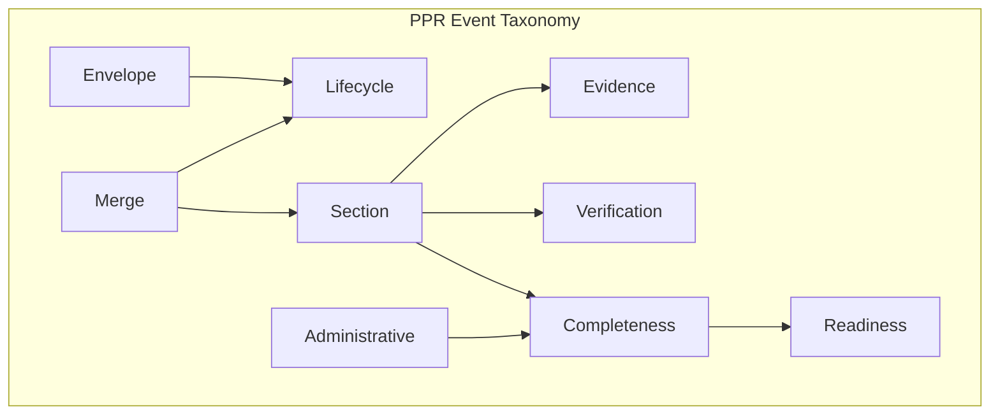
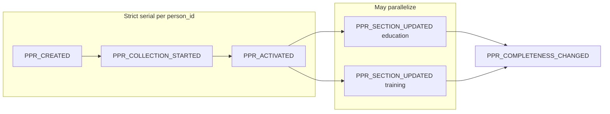
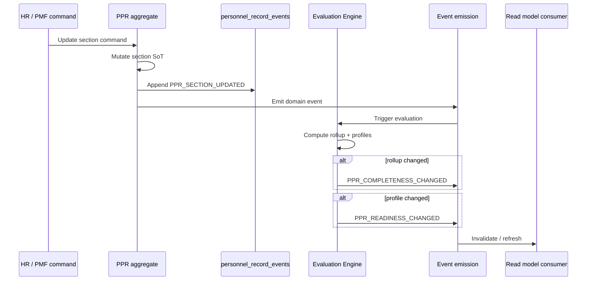
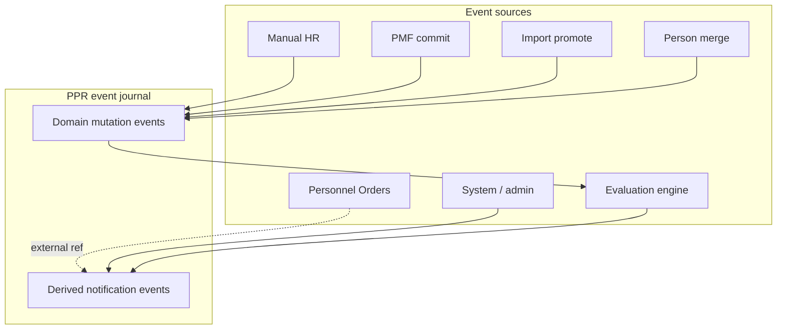
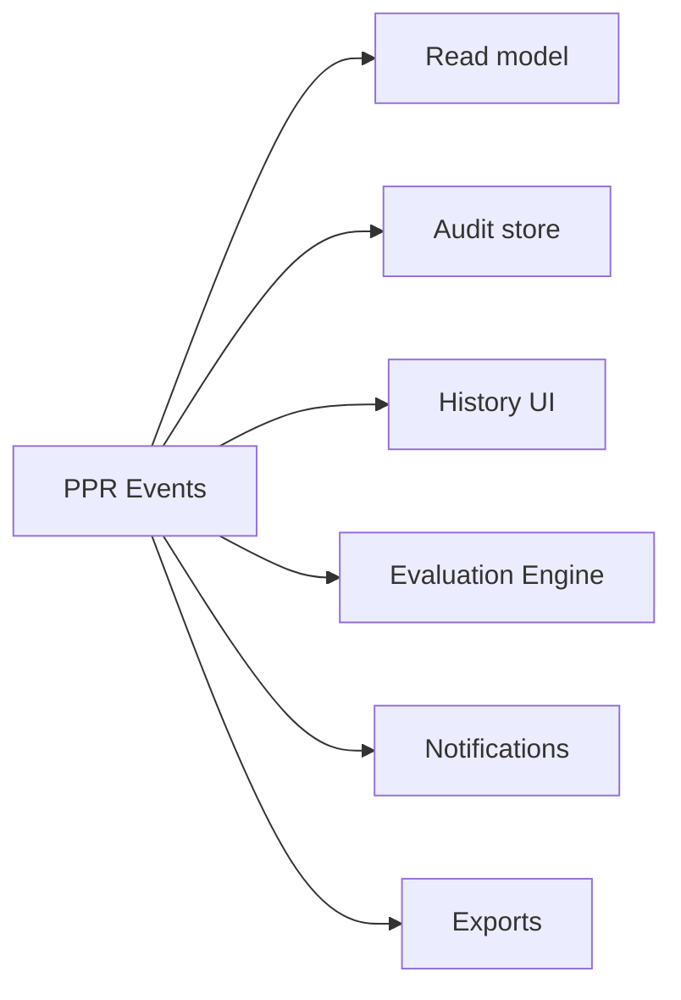
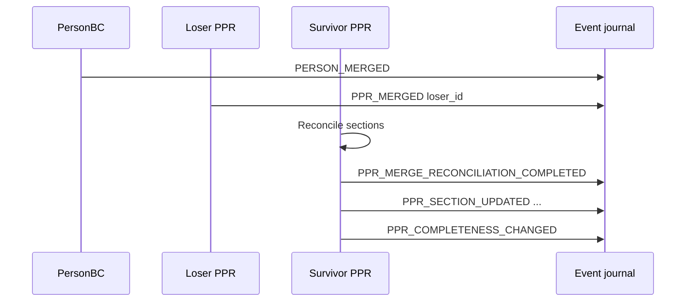

--------------------------------------------------

Document Status

Document:
WP-PR-007-ppr-event-taxonomy-and-change-model

Title:
Personnel Personal Record — Event Taxonomy & Change Model

Type:
Architecture Work Package

Status:
Draft — Ready for Review

Revision:
1

Date:
2026-07-15

Parent:
ADR-054 — Personnel Personal Record Aggregate Model

Depends on:
ARCH-002, WP-PR-002 (Completed), WP-PR-003 (Draft — Ready for Review), WP-PR-004 (Draft — Ready for Review), WP-PR-005 (Draft — Ready for Review), WP-PR-006 (Draft — Ready for Review), WP-HR-CARD-002 (Draft)

Purpose:
Normative architecture of PPR event taxonomy and change model.
Defines **what events exist**, **what changes they reflect**, **guarantees**, and **relationship to audit and read model**.
No event bus, broker, code, migrations, or API changes in this WP.

--------------------------------------------------

# WP-PR-007 — PPR Event Taxonomy & Change Model

**Date:** 2026-07-15

---

## 1. Purpose

### 1.1 What is a PPR Event

**PPR Event** — неизменяемая запись о **факте изменения** или **вычисленном результате**, относящемся к Personnel Personal Record (PPR) aggregate boundary или его AUDIT trail.

Событие:

- фиксирует **что произошло** (тип, время, актор, причина);
- указывает **на какой объект** (`person_id`, `section_code`, `record_id`);
- может нести **минимальный payload** для explainability и correlation;
- **не заменяет** authoritative state (section tables, envelope columns).

**Canonical event key space:** `person_id` (после merge resolution — survivor).

### 1.2 What is NOT a PPR Event

| Not a PPR event | Classification | Owner |
|-----------------|----------------|-------|
| Current field values in `person_education` | **Domain state** (SoT) | PPR section tables |
| `ppr_lifecycle_state` on envelope | **Domain state snapshot** | AGGREGATE-ENVELOPE |
| Completeness rollup snapshot | **Derived state** | Envelope / evaluation consumer |
| `employee_events` HIRE/TERMINATION | **Employment BC event** | Employment — external to PPR taxonomy |
| `personnel_orders` workflow state | **Orders BC state** | Personnel Orders |
| UI tab selection, form draft | **Ephemeral UI state** | Presentation |
| Import Profile JSON in staging | **TEMPORARY artifact** | Import BC |
| Read model composite response | **Projection** | WP-PR-005 — consumer, not event |
| Notification email / task | **Side effect** | Operations — not domain event |
| Kafka/RabbitMQ message envelope | **Transport** — out of scope | Infrastructure |

### 1.3 Document scope

| In scope | Out of scope |
|----------|--------------|
| Event taxonomy and categories | Event bus, broker, queue technology |
| Canonical event catalog | REST API paths |
| Payload principles | DDL migration for `personnel_record_events` |
| Invariants, ordering, causality | UI event timeline design |
| Sources and consumers (architectural) | RBAC for event visibility |
| Merge behaviour | Retention periods (legal TBD) |
| Relationship to `personnel_record_events` | Implementation classes |

### 1.4 Mandatory references

| Document | Role |
|----------|------|
| [ARCH-002](./ARCH-002-personnel-personal-record-architecture.md) | INV-1…INV-9; documents use snapshots |
| [ADR-054](../adr/ADR-054-personnel-personal-record-aggregate-model.md) | `person_id` = PPR ID; Person-root |
| [WP-PR-002](./WP-PR-002-aggregate-boundary-specification.md) | AB-12 AUDIT vs SoT; §9 aggregate events seed |
| [WP-PR-003](./WP-PR-003-section-catalog-and-completeness-model.md) | Completeness/readiness; findings |
| [WP-PR-004](./WP-PR-004-ppr-lifecycle-and-state-machine.md) | Lifecycle commands → events §7 |
| [WP-PR-005](./WP-PR-005-logical-read-model-and-composite-projection.md) | Read model invalidation §19 |
| [WP-PR-006](./WP-PR-006-completeness-and-readiness-evaluation-engine.md) | Evaluation triggers §16; engine does not publish |
| [WP-HR-CARD-002](./WP-HR-CARD-002-unified-personnel-record-card.md) | UI consumes events via read model |

---

## 2. Event philosophy

### 2.1 Events as change journal

PPR events form an **append-only change journal** complementary to authoritative state:

```text
Authoritative state (SoT)     = what IS true now
PPR events (journal)          = what CHANGED, when, by whom, why
Derived projections           = what we SHOW (read model, completeness)
```

Events enable: audit, history UI, causality tracing, projection invalidation, compliance replay **without** reconstructing SoT from events alone (AB-12).

### 2.2 Separation of concerns

| Concern | Role | Mutable? | Storage (Phase 1) |
|---------|------|----------|-------------------|
| **Domain state** | Section rows, person scalars | Yes — via commands | `person_*` tables, `persons` |
| **Lifecycle state** | `ppr_lifecycle_state`, `hr_relationship_context` | Yes — via lifecycle commands | `personnel_record_metadata` **planned** |
| **Audit journal** | Immutable change record | Append-only | `personnel_record_events` + envelope event log **TBD** |
| **Projections** | Read model, UI, registry | Rebuilt from SoT + events | Cache / computed |



### 2.3 Core principles

| ID | Principle |
|----|-----------|
| **EV-1** | Events record changes; **do not** replace section SoT |
| **EV-2** | `person_id` is the primary partition key for PPR events |
| **EV-3** | Employment / Orders events are **external** — referenced, not owned |
| **EV-4** | Evaluation emits **derived** events; evaluation itself is stateless (WP-PR-006) |
| **EV-5** | UI **never** emits authoritative PPR events — only commands through owner BC |
| **EV-6** | Same fact → one canonical event type (no duplicate semantics) |

---

## 3. Event taxonomy

### 3.1 Category model

Events grouped by **architectural concern**. Category informs ordering rules, retention class, and consumer mapping.

| Category | Code prefix | Describes |
|----------|-------------|-----------|
| **Envelope** | `PPR_ENVELOPE_*` / `PPR_*` lifecycle | Aggregate envelope materialization and metadata |
| **Section** | `PPR_SECTION_*` | Business section content mutations |
| **Evidence** | `PPR_EVIDENCE_*` | Document linkage, attachment changes |
| **Verification** | `PPR_VERIF_*` | Verification dimension changes on records |
| **Completeness** | `PPR_COMPLETENESS_*` | Derived completeness rollup changes |
| **Readiness** | `PPR_READINESS_*` | Derived readiness profile changes |
| **Lifecycle** | `PPR_LIFECYCLE_*` | `ppr_lifecycle_state` transitions |
| **Merge** | `PPR_MERGE_*` / `PERSON_MERGED` | Person merge and reconciliation |
| **Administrative** | `PPR_ADMIN_*` | Policy change, manual override, maintenance |



### 3.2 Event class: domain vs derived vs external

| Class | Mutates SoT? | Example |
|-------|--------------|---------|
| **Domain mutation event** | Yes (via command that event records) | `PPR_SECTION_UPDATED` |
| **Derived notification event** | No — records evaluation/rollup outcome | `PPR_COMPLETENESS_CHANGED` |
| **External reference event** | No — PPR consumes for projection/context | `EMPLOYMENT_CREATED` (Employment BC) |
| **Audit-only event** | No — journal entry mirroring domain event | Row in `personnel_record_events` |

### 3.3 Naming convention

**Normative pattern:** `PPR_<NOUN>_<PAST_TENSE_VERB>` or stable legacy codes (`EDUCATION_MIGRATED`) during transition.

| Rule | Example |
|------|---------|
| Prefix `PPR_` for aggregate-level | `PPR_CREATED`, `PPR_ARCHIVED` |
| Include `section_code` in payload, not event name | `PPR_SECTION_UPDATED` + `section_code=PPR-EDUCATION` |
| Person BC merge | `PERSON_MERGED` (Person BC publisher; PPR consumer) |
| Legacy PMF codes retained | `EDUCATION_MIGRATED` → maps to `PPR_SECTION_UPDATED` class |

---

## 4. Canonical event catalog

### 4.1 Envelope events

| event_type | Category | Trigger | Mutates SoT | Publisher |
|------------|----------|---------|-------------|-----------|
| **PPR_CREATED** | Envelope | `MaterializePPR` | Envelope insert | PPR aggregate |
| **PPR_MATERIALIZED** | Envelope | Alias / synonym **TBD** — prefer `PPR_CREATED` | Same | PPR aggregate |
| **PPR_ENVELOPE_UPDATED** | Envelope | Metadata field change (non-lifecycle) | Envelope | PPR aggregate |

### 4.2 Lifecycle events

| event_type | Category | Trigger | Payload minimum | Publisher |
|------------|----------|---------|-----------------|-----------|
| **PPR_COLLECTION_STARTED** | Lifecycle | `StartCollection` | person_id, from, to=COLLECTING | PPR |
| **PPR_MARKED_READY** | Lifecycle | `MarkPPRReady` | person_id, prior_state, profile_gate **TBD** | PPR |
| **PPR_ACTIVATED** | Lifecycle | `ActivatePPR` | person_id, prior_state | PPR |
| **PPR_COLLECTION_RESUMED** | Lifecycle | `ResumeCollection` | person_id, prior_state | PPR |
| **PPR_LIFECYCLE_CHANGED** | Lifecycle | Any lifecycle transition | person_id, from, to, reason | PPR |
| **PPR_ARCHIVED** | Lifecycle | `ArchivePPR` | person_id, reason | PPR |
| **PPR_RESTORED** | Lifecycle | `RestorePPR` | person_id, reason | PPR |
| **PPR_HR_CONTEXT_UPDATED** | Envelope | `UpdateHrRelationshipContext` | person_id, from_context, to_context | PPR |

*Note:* Specific lifecycle events (`PPR_ACTIVATED`, …) **may** emit both specific event and generic `PPR_LIFECYCLE_CHANGED` — consumer may dedupe **TBD** (OQ-3).

### 4.3 Section events

| event_type | Category | Trigger | Payload minimum | Publisher |
|------------|----------|---------|-----------------|-----------|
| **PPR_SECTION_UPDATED** | Section | Section write / PMF commit | person_id, section_code, record_table, record_id, change_kind | PPR section command |
| **PPR_SECTION_REMOVED** | Section | Record void / delete policy | person_id, section_code, record_id, reason | PPR |
| **PPR_SECTION_SUPERSEDED** | Section | Supersede row | person_id, old_record_id, new_record_id | PPR / PMF |
| **PPR_GENERAL_UPDATED** | Section | Person scalar cadre field | person_id, field_paths[] | PPR / Person BC **TBD** |

**Legacy PMF section codes (transitional — map to Section category):**

| Legacy event_type | Maps to | Status |
|-------------------|---------|--------|
| **EDUCATION_MIGRATED** | `PPR_SECTION_UPDATED` (PPR-EDUCATION) | ✅ implemented |
| **EDUCATION_VOIDED** | `PPR_SECTION_REMOVED` | ✅ implemented |
| **EDUCATION_SUPERSEDED** | `PPR_SECTION_SUPERSEDED` | ✅ implemented |
| **EDUCATION_VERIFIED** | `PPR_VERIFIED` | Planned |

### 4.4 Evidence events

| event_type | Category | Trigger | Payload minimum |
|------------|----------|---------|-----------------|
| **PPR_EVIDENCE_LINKED** | Evidence | Document attached to record | person_id, section_code, record_id, document_id |
| **PPR_EVIDENCE_UNLINKED** | Evidence | Document detached | Same |
| **PPR_EVIDENCE_UPDATED** | Evidence | Metadata/expiry change | person_id, document_id |

### 4.5 Verification events

| event_type | Category | Trigger | Payload minimum |
|------------|----------|---------|-----------------|
| **PPR_VERIFIED** | Verification | HR verification satisfied | person_id, section_code, record_id, verification_method |
| **PPR_UNVERIFIED** | Verification | Verification revoked | person_id, section_code, record_id, reason |
| **PPR_REVIEW_STATUS_CHANGED** | Verification | ReviewStatus change | person_id, section_code, from, to |

### 4.6 Completeness events (derived)

| event_type | Category | Trigger | Payload minimum |
|------------|----------|---------|-----------------|
| **PPR_COMPLETENESS_CHANGED** | Completeness | Evaluation rollup delta | person_id, policy_version, prior_status, new_status, snapshot_hash |
| **PPR_COMPLETENESS_POLICY_CHANGED** | Administrative | Policy bundle update | policy_version, effective_at |

**Rule (WP-PR-004 C-3):** `PPR_COMPLETENESS_CHANGED` **does not** imply `PPR_LIFECYCLE_CHANGED`.

### 4.7 Readiness events (derived)

| event_type | Category | Trigger | Payload minimum |
|------------|----------|---------|-----------------|
| **PPR_READINESS_CHANGED** | Readiness | Profile status delta | person_id, profile_code, from, to, policy_version |
| **PPR_READINESS_EVALUATED** | Readiness | Full profile eval (no delta) **TBD** | person_id, profile_results snapshot |

### 4.8 Merge events

| event_type | Category | Trigger | Publisher | Payload minimum |
|------------|----------|---------|-----------|-----------------|
| **PERSON_MERGED** | Merge | Person BC merge approved | **Person BC** | survivor_id, loser_id, merged_at |
| **PPR_MERGED** | Merge | Loser envelope terminal | PPR | loser_id, survivor_id |
| **PPR_MERGE_RECONCILIATION_COMPLETED** | Merge | Section dedup resolved | PPR | survivor_id, reconciliation_summary |
| **PPR_MERGE_RECONCILIATION_REQUIRED** | Merge | Duplicates detected | PPR / Evaluation | survivor_id, finding_refs |

### 4.9 Administrative events

| event_type | Category | Trigger | Payload minimum |
|------------|----------|---------|-----------------|
| **PPR_POLICY_VERSION_ACTIVATED** | Administrative | New policy deployed | policy_version, activated_by |
| **PPR_FINDING_WAIVED** | Administrative | Manual waiver **TBD** | person_id, finding_code, actor, reason |
| **PPR_REEVALUATION_REQUESTED** | Administrative | Manual full re-eval | person_id, actor, reason |
| **PPR_EXPORT_SNAPSHOT_CREATED** | Administrative | Export job | person_id, export_kind, snapshot_id |

### 4.10 External events (NOT PPR-owned — reference catalog)

PPR **consumes** for projections and cross-context readiness; **does not publish**.

| event_type | Owner BC | PPR use |
|------------|----------|---------|
| **EMPLOYMENT_CREATED** | Employment | Cross-context readiness; `hr_relationship_context` |
| **EMPLOYMENT_TERMINATED** | Employment | Same |
| **PERSONNEL_ORDER_APPLIED** | Orders | `PERSONNEL_ORDER_READY` inputs |
| **PMF_RUN_COMMITTED** | PMF | Triggers section + audit events |
| **IMPORT_BATCH_APPLIED** | Import | Staging only — not PPR SoT |
| **IDENTITY_LINK_CHANGED** | Person / Identity | Triggers full re-eval |

---

## 5. Event payload principles

### 5.1 Architectural envelope (all PPR events)

No final JSON API schema — **minimum required fields**:

| Field | Required | Description |
|-------|----------|-------------|
| `event_id` | Yes | Surrogate unique id (monotonic per store) |
| `event_type` | Yes | Canonical or legacy code from §4 |
| `person_id` | Yes | Partition key; survivor after merge |
| `occurred_at` | Yes | `event_at` — immutable timestamp |
| `actor` | Conditional | `actor_id` — user/system; required for manual mutations |
| `source` | Yes | `manual_hr` \| `pmf` \| `import` \| `system` \| `evaluation` \| `merge` \| `admin` |
| `correlation_id` | Recommended | command_id, merge_id, run_id, order_id |
| `policy_version` | Conditional | Required for completeness/readiness/admin policy events |
| `reason` | Conditional | Required for archive, merge, waiver, restore |
| `payload` | Optional | Type-specific body (`event_payload` JSONB) |

### 5.2 Section event payload (minimum)

| Field | Description |
|-------|-------------|
| `section_code` | `PPR-*` |
| `record_table_name` | e.g. `person_education` |
| `record_id` | Target row |
| `change_kind` | `create` \| `update` \| `void` \| `supersede` |
| `employee_context_id` | Transitional navigation context — optional |
| `migration_run_id` | PMF linkage — optional |
| `field_diff` | Changed paths only — **TBD** granularity (OQ-6) |

### 5.3 Derived event payload (completeness/readiness)

| Field | Description |
|-------|-------------|
| `policy_version` | Evaluation policy |
| `prior_snapshot_hash` | Dedup/idempotency |
| `new_snapshot_hash` | Dedup/idempotency |
| `overall_status` or `profile_code` + `readiness_status` | Delta summary |
| `causation_event_id` | Upstream domain event that triggered eval **TBD** |

### 5.4 Payload rules

| ID | Rule |
|----|------|
| **PL-1** | Payload **must not** contain full section row as SoT substitute |
| **PL-2** | Sensitive fields in payload — policy redaction **TBD** (OQ-12) |
| **PL-3** | `employee_id` in payload is **context only** — not partition key |
| **PL-4** | Legacy `personnel_record_events` shape remains valid Phase 1 |

---

## 6. Event invariants

| ID | Invariant | Specification |
|----|-----------|---------------|
| **EI-1** | **Immutability** | Events never updated or deleted; corrections via compensating event |
| **EI-2** | **Append-only** | New facts → new rows; no overwrite |
| **EI-3** | **Person ownership** | Every PPR event references exactly one `person_id` (survivor after merge) |
| **EI-4** | **No SoT rebuild** | Section state **not** derivable from events alone (AB-12) |
| **EI-5** | **Idempotent emission** | Same `correlation_id` + `event_type` → at most one logical event |
| **EI-6** | **Monotonic event_id** | Per store; `event_id` ordering proxy for occurrence order |
| **EI-7** | **Causal integrity** | Derived events reference evaluation trigger or upstream domain event |
| **EI-8** | **Loser terminal** | No events mutate loser `person_id` after `PPR_MERGED` except audit pointer |
| **EI-9** | **External boundary** | Employment events never stored as PPR domain events |

---

## 7. Event ordering

### 7.1 Ordering domains

| Domain | Key | Ordering guarantee |
|--------|-----|-------------------|
| **Per person_id** | `person_id` | Lifecycle events — **strict total order** per envelope |
| **Per section** | `person_id` + `section_code` | Section mutations — **serial** per section |
| **Per record** | `person_id` + `record_id` | Record mutations — **serial** |
| **Completeness** | `person_id` | **Partial order** — may batch; must reflect eval after causative mutations |
| **Cross-person** | — | **No global order** required |



### 7.2 Ordering rules

| ID | Rule |
|----|------|
| **ORD-1** | Lifecycle transition events for one `person_id` — **no concurrent conflicting** `to` states |
| **ORD-2** | `PPR_COMPLETENESS_CHANGED` — **after** causative section events in causal chain (§8) |
| **ORD-3** | `PPR_READINESS_CHANGED` — **after** `PPR_COMPLETENESS_CHANGED` when triggered by same mutation |
| **ORD-4** | `PERSON_MERGED` — **before** `PPR_MERGED` and survivor reconciliation events |
| **ORD-5** | Independent sections — evaluation may parallelize; rollup serializes per person |

### 7.3 Out-of-order handling

| Scenario | Behavior |
|----------|----------|
| Completeness arrives before section event visible | Consumer retries or waits for read consistency **TBD** |
| Duplicate `event_id` replay | Idempotent consumer dedup |
| Late projection refresh | Stale read until invalidation completes (WP-PR-005) |

---

## 8. Event causality

### 8.1 Normative cause chain

```text
Domain command (e.g. section write)
    ↓
PPR_SECTION_UPDATED (domain mutation event)
    ↓
Evaluation Engine invoked (WP-PR-006 — not an event publisher)
    ↓
PPR_COMPLETENESS_CHANGED (if rollup delta)
    ↓
PPR_READINESS_CHANGED (if profile delta)
    ↓
Read model / cache invalidation (consumer — not event)
    ↓
Projection refresh
```



### 8.2 Causality metadata

| Field | Purpose |
|-------|---------|
| `causation_event_id` | Parent domain event |
| `correlation_id` | End-to-end trace (command_id) |
| `evaluation_id` | Evaluation run fingerprint **TBD** |

### 8.3 Forbidden causal inversions

| Forbidden | Reason |
|-----------|--------|
| `PPR_COMPLETENESS_CHANGED` → lifecycle command | WP-PR-004 C-1 |
| `PPR_READINESS_CHANGED` → section SoT mutation | Readiness is derived |
| `PPR_SECTION_UPDATED` ← UI without command | INV-5 |
| Rebuild section from `PPR_COMPLETENESS_CHANGED` | Not a mutation event |

### 8.4 Lifecycle command causality (separate chain)

```text
Lifecycle command (e.g. ActivatePPR)
    ↓
PPR_LIFECYCLE_CHANGED
    ↓
May change active readiness profile set (input to next eval)
    ↓
Optional evaluation (applicability / profile activation)
    ↓
PPR_COMPLETENESS_CHANGED / PPR_READINESS_CHANGED (if applicable rules change)
```

**No automatic lifecycle from completeness** (WP-PR-004 C-1).

---

## 9. Event sources

| Source | Code | Emits | Examples |
|--------|------|-------|----------|
| **Manual HR** | `manual_hr` | Section, verification, lifecycle commands | `PPR_SECTION_UPDATED`, `PPR_VERIFIED` |
| **PMF** | `pmf` | Section via commit | `EDUCATION_MIGRATED` → `PPR_SECTION_UPDATED` |
| **Import** | `import` | Staging only; PPR event after promotion **TBD** | Post-PMF commit chain |
| **Personnel Orders** | `personnel_orders` | **External** — Employment BC | `EMPLOYMENT_CREATED`; may trigger `PPR_HR_CONTEXT_UPDATED` |
| **Merge** | `merge` | Person + PPR merge | `PERSON_MERGED`, `PPR_MERGED` |
| **Evaluation** | `evaluation` | Derived only | `PPR_COMPLETENESS_CHANGED`, `PPR_READINESS_CHANGED` |
| **System maintenance** | `system` | Admin, policy, re-eval | `PPR_POLICY_VERSION_ACTIVATED` |



---

## 10. Event consumers

Architectural consumers — **no event bus** prescribed. Delivery may be synchronous hook, outbox, or poll — **TBD** (OQ-8).

| Consumer | Subscribes to | Purpose |
|----------|---------------|---------|
| **Read model** | Section, lifecycle, completeness, readiness, merge | Cache invalidation; timeline (WP-PR-005 §19) |
| **Audit** | All domain + merge + admin | Compliance, actor trail |
| **History UI** | Section, lifecycle, verification, merge | Личная карточка timeline |
| **Evaluation Engine** | Section, evidence, lifecycle, policy, merge | Re-evaluation triggers (WP-PR-006 §16) |
| **Notifications** | Lifecycle, readiness BLOCKED, merge | HR alerts **TBD** |
| **Exports** | Section, snapshot admin | Export snapshot lineage |
| **Registry summary** | Lifecycle, completeness | PPR registry badges |



### 10.1 Consumer rules

| ID | Rule |
|----|------|
| **CON-1** | Consumers **must not** mutate SoT — only react |
| **CON-2** | Evaluation consumer **re-reads** SoT — does not trust payload as state |
| **CON-3** | Read model invalidation **may coalesce** frequent `PPR_COMPLETENESS_CHANGED` |
| **CON-4** | External BC consumers use own event stores — no write into `personnel_record_events` |

---

## 11. Event retention

### 11.1 Architectural principles (no legal periods)

| Principle | Specification |
|-----------|---------------|
| **RET-1** | Domain mutation events — **retain permanently** by default (cadre audit) |
| **RET-2** | Derived events (`PPR_COMPLETENESS_CHANGED`) — **may** be compacted to latest per policy_version **TBD** |
| **RET-3** | Merge loser events — **preserve**; pointer to survivor |
| **RET-4** | No hard delete of audit events Phase 1 |
| **RET-5** | Compensating events preferred over deletion |
| **RET-6** | Export snapshot events — retain per document retention policy **TBD** |

### 11.2 Storage tiers (architectural)

| Tier | Content | Access |
|------|---------|--------|
| **Hot** | Recent per person_id timeline | UI, read model |
| **Warm** | Full audit per person | Compliance queries |
| **Cold** | Archived PPR events **TBD** | Legal hold |

---

## 12. Merge behaviour

### 12.1 Survivor and loser

| Role | Event handling |
|------|----------------|
| **Loser `person_id`** | Terminal; `PPR_MERGED` emitted; no further domain mutation events |
| **Survivor `person_id`** | Receives reconciliation events; future events use survivor key only |
| **Historical loser events** | **Preserved** under loser `person_id`; audit queries resolve redirect |

### 12.2 Merge event sequence

```text
PERSON_MERGED (Person BC)
    ↓
PPR_MERGED (loser envelope)
    ↓
Section reconciliation (survivor SoT)
    ↓
PPR_MERGE_RECONCILIATION_REQUIRED (if duplicates)
    ↓
PPR_SECTION_UPDATED / supersede events on survivor
    ↓
PPR_MERGE_RECONCILIATION_COMPLETED
    ↓
Full evaluation on survivor
    ↓
PPR_COMPLETENESS_CHANGED / PPR_READINESS_CHANGED
```



### 12.3 Merge rules

| ID | Rule |
|----|------|
| **MR-1** | Post-merge events on loser **prohibited** (WP-PR-004 LC-11) |
| **MR-2** | Survivor timeline **may include** merged-from metadata in payload |
| **MR-3** | `personnel_record_events` for loser rows **not deleted** |
| **MR-4** | Read model resolves loser queries to survivor + `merge_redirect` (WP-PR-005 §13) |
| **MR-5** | Provenance from loser preserved in audit; not silently dropped |

---

## 13. Relationship with `personnel_record_events`

### 13.1 Current model (repository audit)

**Table:** `public.personnel_record_events` (PMF-1 schema)

| Column | Role today |
|--------|------------|
| `event_id` | BIGINT identity PK — monotonic |
| `person_id` | FK persons — partition key ✅ |
| `employee_context_id` | Optional transitional context |
| `domain_code` | FK `personnel_migration_domains` — PMF coupling |
| `record_table_name` | Section table reference ✅ |
| `record_id` | Row reference ✅ |
| `event_type` | TEXT — `EDUCATION_MIGRATED`, etc. |
| `event_at` | TIMESTAMPTZ — `occurred_at` ✅ |
| `actor_id` | TEXT nullable |
| `event_payload` | JSONB |
| `migration_run_id` / `migration_item_id` | PMF correlation ✅ |

**Writer:** `emit_personnel_record_event()` in `personnel_record_event_service.py`

**Reader:** `personnel_migration_record_events_query_service.py` (PMF-3B list/get API)

**Emitted today:** `EDUCATION_MIGRATED`, `EDUCATION_VOIDED`, `EDUCATION_SUPERSEDED` via PMF commit/supersede/void.

### 13.2 Classification per WP-PR-002 AB-12

| Statement | True |
|-----------|------|
| `personnel_record_events` = **AUDIT** trail | ✅ |
| Section tables = **SoT** | ✅ |
| Events ≠ section content replacement | ✅ |
| Rebuild sections from events alone — **prohibited** | ✅ |

### 13.3 What is preserved Phase 1

| Preserve | Reason |
|----------|--------|
| Existing table schema | No migration in this WP |
| `emit_personnel_record_event()` API | PMF production path |
| PMF-3B query API | Read-side audit |
| `domain_code` column | PMF domain coupling — transitional |
| Legacy `EDUCATION_*` event types | Backward compatibility |

### 13.4 What requires evolution (future WPs)

| Gap | Target |
|-----|--------|
| No envelope/lifecycle events | Add `PPR_CREATED`, `PPR_LIFECYCLE_CHANGED` emission on metadata table |
| No completeness/readiness events | Derived event emission after evaluation |
| `domain_code` required — blocks non-PMF sections | Generalize or default domain **TBD** |
| Event types PMF-specific naming | Map to canonical `PPR_*` catalog §4 |
| No `correlation_id` / `source` columns | Add envelope fields or payload convention |
| No merge events | `PERSON_MERGED` / `PPR_MERGED` handlers |
| Single store for all categories | May split envelope log vs section audit **TBD** (OQ-1) |

### 13.5 Dual-layer model (recommended)

```text
Layer 1 — personnel_record_events (existing)
    Section-level AUDIT; PMF-originated; preserved

Layer 2 — envelope event log (planned)
    Lifecycle, completeness, readiness, merge, admin
    May be same table with category discriminator OR separate — TBD
```

**Phase 1 recommendation:** extend payload conventions first; schema additive only in implementation WP.

---

## 14. Repository inventory

Read-only audit (2026-07-15).

### 14.1 Implemented

| Artifact | Location | Role |
|----------|----------|------|
| `personnel_record_events` table | `q1r2s3t4u5w6_pmf_1_...` migration | AUDIT journal |
| `PersonnelRecordEvent` ORM | `personnel_migration.py` | Model |
| `emit_personnel_record_event` | `personnel_record_event_service.py` | Append writer |
| PMF commit events | `personnel_migration_commit_service.py` | EDUCATION_* emission |
| Event types constants | `personnel_migration.py` | `EDUCATION_MIGRATED`, etc. |
| List/get events API | `personnel_migration_record_events_query_service.py` | PMF-3B read |
| Tests | `test_pmf_2_commit_engine.py`, `test_pmf_3b_mutation_api.py` | Event row assertions |

### 14.2 Not implemented

| Component | Gap |
|-----------|-----|
| `personnel_record_metadata` | No envelope — no lifecycle events |
| Canonical `PPR_*` event emission | Catalog §4 mostly planned |
| `PPR_COMPLETENESS_CHANGED` | No evaluation hook |
| `PPR_READINESS_CHANGED` | No evaluation hook |
| Merge event handlers | No `PERSON_MERGED` → PPR bridge |
| Event → read model invalidation wiring | WP-PR-005 planned |
| Event → evaluation trigger wiring | WP-PR-006 §16 planned |
| `correlation_id`, `source` standard | Payload gap |
| Compensating event pattern | Not used |
| Envelope event log | Greenfield |

### 14.3 Related but separate event systems (do not merge)

| System | Table / artifact | BC |
|--------|------------------|-----|
| `employee_events` | employment migrations | Employment |
| `hr_personnel_change_events` | ADR-043 | HR diff audit |
| `personnel_orders` workflow | orders models | Orders |
| Operational orders readiness | `signature_readiness_validation.py` | Document engine — unrelated |

### 14.4 WP-PR-002 / WP-PR-004 event name alignment

| WP-PR-002 (§9.1) | WP-PR-007 canonical | Status |
|------------------|---------------------|--------|
| `PERSONNEL_PERSONAL_RECORD_ACTIVATED` | `PPR_CREATED` | Align naming |
| `PERSONNEL_PERSONAL_RECORD_LIFECYCLE_CHANGED` | `PPR_LIFECYCLE_CHANGED` | Shorter canonical |
| `PERSONNEL_PERSONAL_RECORD_COMPLETENESS_CHANGED` | `PPR_COMPLETENESS_CHANGED` | Align |
| `SECTION_UPDATED` | `PPR_SECTION_UPDATED` | Prefix added |
| `EDUCATION_MIGRATED` | Legacy → `PPR_SECTION_UPDATED` | Transitional |

---

## 15. Decision summary

| # | Decision |
|---|----------|
| **D-1** | PPR events form an **append-only change journal** — not SoT |
| **D-2** | **`person_id`** is the primary event partition key |
| **D-3** | Events are **immutable** — no update/delete; compensating events only |
| **D-4** | **Section SoT** and **audit events** are strictly separated (AB-12) |
| **D-5** | **Canonical catalog** uses `PPR_*` types; legacy PMF codes transitional |
| **D-6** | **Completeness/readiness events are derived** — not mutating |
| **D-7** | **Completeness events do not cause lifecycle** changes (C-1, C-3) |
| **D-8** | **Employment/Orders events are external** — not PPR-owned |
| **D-9** | **Evaluation Engine consumes** triggers; **separate component emits** derived events |
| **D-10** | **Causal order:** section mutation → evaluation → completeness → readiness → projection |
| **D-11** | **`personnel_record_events` preserved** Phase 1 — evolved additively |
| **D-12** | **Merge loser** — terminal; events preserved; survivor continues |
| **D-13** | **Idempotent emission** via `correlation_id` |
| **D-14** | **No event bus** prescribed — architectural consumers only |
| **D-15** | **UI does not emit** authoritative PPR events |

---

## 16. Open questions

| ID | Question |
|----|----------|
| **OQ-1** | Single table vs split stores (section audit vs envelope events) |
| **OQ-2** | `domain_code` generalization for non-PMF sections |
| **OQ-3** | Specific lifecycle event + generic `PPR_LIFECYCLE_CHANGED` — dual emit? |
| **OQ-4** | `field_diff` granularity in section payload |
| **OQ-5** | Compensating event taxonomy (`PPR_SECTION_UPDATE_REVERTED`?) |
| **OQ-6** | `PPR_READINESS_EVALUATED` vs delta-only `PPR_READINESS_CHANGED` |
| **OQ-7** | Coalescing / sampling of frequent `PPR_COMPLETENESS_CHANGED` |
| **OQ-8** | Delivery mechanism — sync hook vs outbox vs poll |
| **OQ-9** | Event visibility / RBAC for sensitive sections in timeline |
| **OQ-10** | Legal retention periods and cold storage |
| **OQ-11** | Replay / rebuild projections from events — prohibited scope confirmation |
| **OQ-12** | Sensitive field redaction in `event_payload` |
| **OQ-13** | Import promotion — when does staging emit PPR section event |
| **OQ-14** | `PPR_GENERAL_UPDATED` — Person BC vs PPR aggregate publisher |
| **OQ-15** | Canonical rename migration for `EDUCATION_*` → `PPR_SECTION_*` |
| **OQ-16** | Global `event_id` vs per-person sequence for ordering |
| **OQ-17** | Notification rules for `PPR_READINESS_CHANGED` → BLOCKED |
| **OQ-18** | Cross-organization event partitioning **TBD** |

---

## 17. Risks

| Risk | Impact | Mitigation |
|------|--------|------------|
| **Event explosion** | Storage, consumer lag | Coalesce completeness; incremental eval |
| **Duplicate events** | Double invalidation, wrong audit | `correlation_id` idempotency EI-5 |
| **Ordering violations** | Stale projections | Per-person serial lifecycle; causal metadata |
| **Idempotency gaps** | Duplicate rows on retry | correlation_id + event_type unique **TBD** |
| **Merge ambiguity** | Events on wrong person_id | MR-* rules; survivor-only writes |
| **Projection drift** | UI stale vs SoT | Read model freshness (WP-PR-005) |
| **Audit inconsistency** | Missing events on write path | Command → event mandatory pattern |
| **Event-as-SoT creep** | Rebuild sections from journal | EI-4, AB-12 |
| **Legacy type proliferation** | `EDUCATION_*` + `PPR_*` duplicate | Mapping table §4.3; OQ-15 |
| **domain_code coupling** | Non-PMF sections blocked | OQ-2 |
| **Sensitive payload leakage** | PII in JSONB | PL-2, OQ-12 |
| **Hidden evaluation events** | Completeness changes without audit | Emit `PPR_COMPLETENESS_CHANGED` on delta |

---

## 18. Mermaid diagrams index

| # | Diagram | Section |
|---|---------|---------|
| 1 | Event taxonomy categories | §3.1 |
| 2 | Cause chain (sequence) | §8.1 |
| 3 | Event philosophy (state vs journal vs derived) | §2.2 |
| 4 | Merge event sequence | §12.2 |
| 5 | Event consumers | §10 |
| 6 | Event sources | §9 |
| 7 | Event ordering (serial vs parallel) | §7.1 |
| 8 | Aggregate timeline (lifecycle → sections → derived) | §7.1 + §8.4 |

Additional: §2.2 domain/lifecycle/audit/projections separation.

### 18.1 Aggregate timeline (person_id)

```mermaid
gantt
  title PPR Event Timeline (illustrative — one person_id)
  dateFormat X
  axisFormat %s

  section Envelope
  PPR_CREATED           :0, 1
  section Lifecycle
  PPR_COLLECTION_STARTED :1, 2
  PPR_ACTIVATED         :3, 4
  section Sections
  PPR_SECTION_UPDATED edu :4, 5
  PPR_SECTION_UPDATED training :4, 5
  section Derived
  PPR_COMPLETENESS_CHANGED :6, 7
  PPR_READINESS_CHANGED    :7, 8
  section Lifecycle
  PPR_ARCHIVED          :20, 21
```



---

## 19. Consistency check

| Document | Check | Status |
|----------|-------|--------|
| **ARCH-002** | INV-5 UI not SoT; snapshots | ✅ |
| **ADR-054** | `person_id` key | ✅ |
| **WP-PR-002** | AB-12 AUDIT; §9 events; external boundary | ✅ naming aligned §14.4 |
| **WP-PR-003** | Completeness ≠ readiness; findings | ✅ derived events separate |
| **WP-PR-004** | Commands → events §7; C-1/C-3 | ✅ |
| **WP-PR-005** | Invalidation §19; merge redirect | ✅ consumers |
| **WP-PR-006** | Eval triggers; engine stateless | ✅ D-9 separation |
| **WP-HR-CARD-002** | Timeline reads audit | ✅ |

| Invariant | Status |
|-----------|--------|
| Events ≠ SoT | ✅ |
| `person_id` canonical | ✅ |
| Append-only | ✅ |
| No event bus design | ✅ |
| Employment external | ✅ |
| Merge loser terminal | ✅ |
| personnel_record_events preserved | ✅ |

---

## References

- [ARCH-002 — Personnel Personal Record Architecture](./ARCH-002-personnel-personal-record-architecture.md)
- [ADR-054 — Personnel Personal Record Aggregate Model](../adr/ADR-054-personnel-personal-record-aggregate-model.md)
- [WP-PR-002 — Aggregate Boundary Specification](./WP-PR-002-aggregate-boundary-specification.md)
- [WP-PR-003 — Section Catalog & Completeness Model](./WP-PR-003-section-catalog-and-completeness-model.md)
- [WP-PR-004 — PPR Lifecycle & State Machine](./WP-PR-004-ppr-lifecycle-and-state-machine.md)
- [WP-PR-005 — Logical Read Model & Composite Projection](./WP-PR-005-logical-read-model-and-composite-projection.md)
- [WP-PR-006 — Completeness & Readiness Evaluation Engine](./WP-PR-006-completeness-and-readiness-evaluation-engine.md)
- [WP-HR-CARD-002 — Unified Personnel Record Card](./WP-HR-CARD-002-unified-personnel-record-card.md)

---

*End of WP-PR-007*
