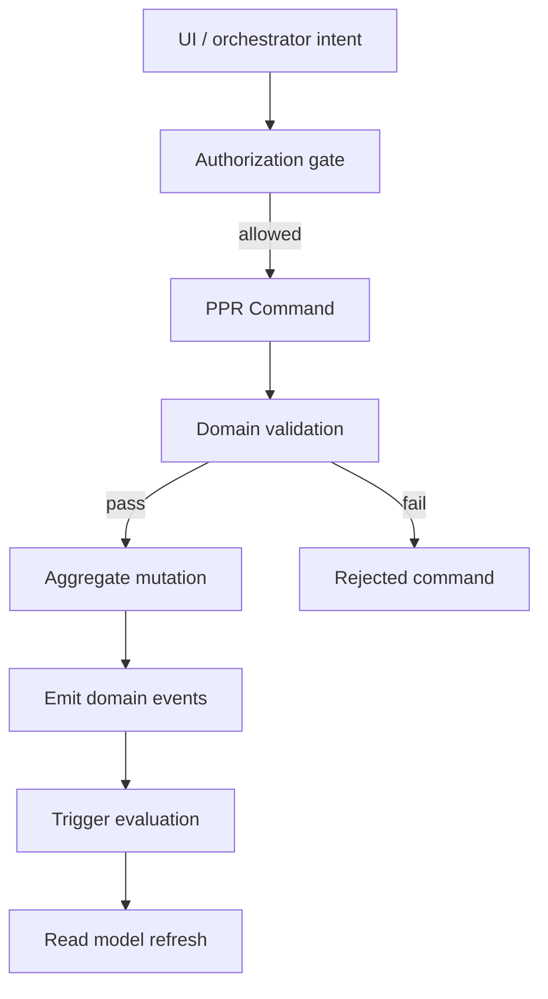
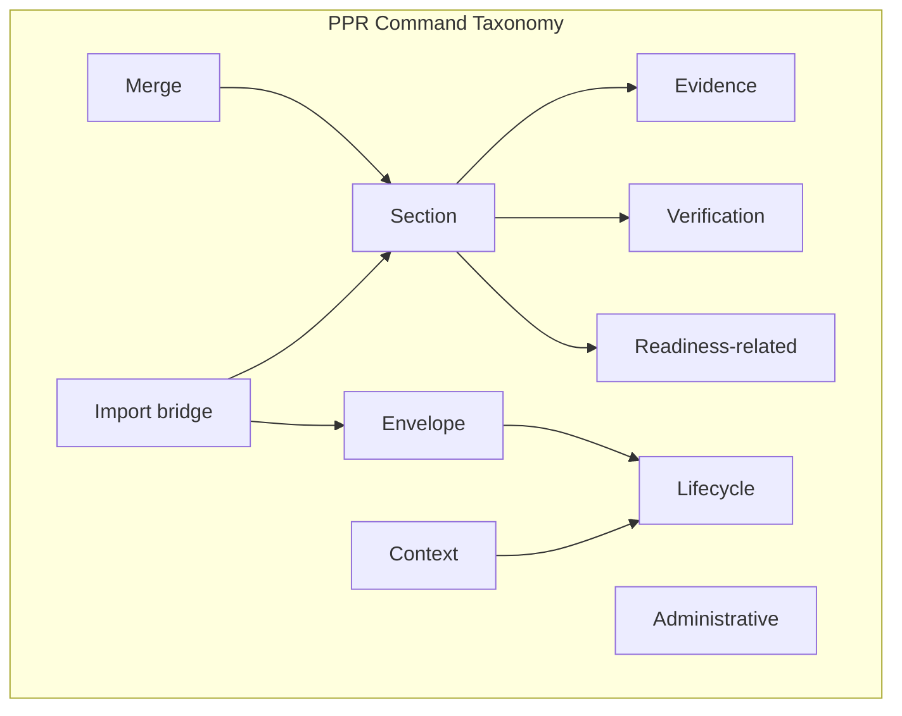
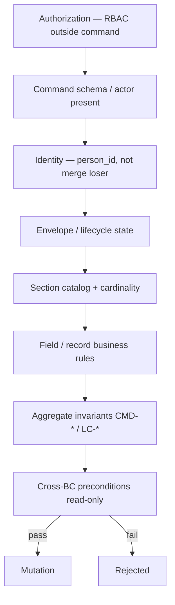
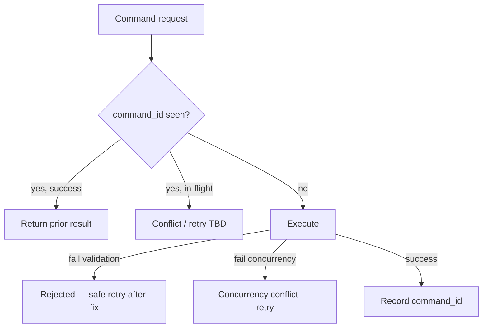
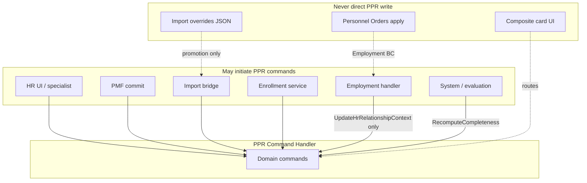
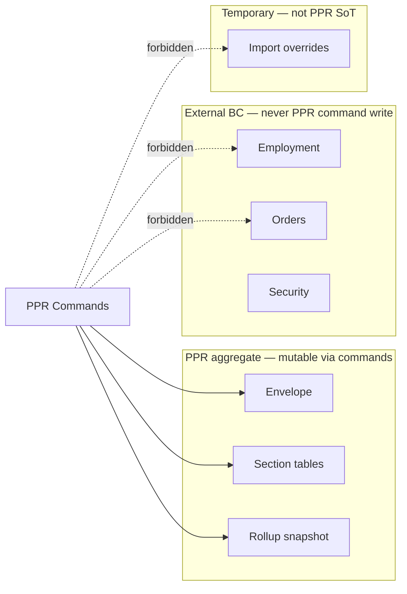

--------------------------------------------------

Document Status

Document:
WP-PR-008-command-model-and-mutation-contracts

Title:
Personnel Personal Record — Command Model & Mutation Contracts

Type:
Architecture Work Package

Status:
Draft — Ready for Review

Revision:
1

Date:
2026-07-15

Parent:
ADR-054 — Personnel Personal Record Aggregate Model

Depends on:
ARCH-002, WP-PR-002 (Completed), WP-PR-003 (Draft — Ready for Review), WP-PR-004 (Draft — Ready for Review), WP-PR-005 (Draft — Ready for Review), WP-PR-006 (Draft — Ready for Review), WP-PR-007 (Draft — Ready for Review), WP-HR-CARD-002 (Draft)

Purpose:
Normative architecture of PPR command model and mutation contracts.
Defines **what commands exist**, **who initiates them**, **what they mutate**, **invariants**, and **resulting events**.
No REST, SQL, queues, code, migrations, or implementation in this WP.

--------------------------------------------------

# WP-PR-008 — Command Model & Mutation Contracts

**Date:** 2026-07-15

---

## 1. Purpose

### 1.1 What is a PPR Command

**PPR Command** (domain command) — именованное **намерение изменить** authoritative state в границах Personnel Personal Record aggregate (или разрешённый envelope/metadata), прошедшее:

1. **Authorization gate** (вне команды — Security BC);
2. **Domain validation** (preconditions, invariants);
3. **Atomic mutation** (envelope и/или section SoT);
4. **Event emission** (journal per [WP-PR-007](./WP-PR-007-ppr-event-taxonomy-and-change-model.md));
5. **Downstream triggers** (evaluation, read model invalidation — не часть mutation).

**Canonical command target:** `person_id` (survivor after merge resolution).

### 1.2 What a command is NOT

| Concept | Difference from PPR command |
|---------|----------------------------|
| **UI action** | Presentation intent («Сохранить», tab click) — maps **to** command; not authoritative |
| **REST endpoint** | Transport adapter; may invoke one or more commands — not the command itself |
| **Service method** | Implementation detail; may bundle validation + mutation — command is domain contract |
| **Domain event** | **Past fact** recorded **after** successful mutation (WP-PR-007) |
| **Workflow step** | Orchestration across BCs; may **invoke** commands — not a command |
| **Read model refresh** | Projection consumer — never mutates SoT |
| **Evaluation run** | Stateless compute ([WP-PR-006](./WP-PR-006-completeness-and-readiness-evaluation-engine.md)) — may be **triggered** by command, not a section mutation |
| **Import staging write** | Import BC TEMPORARY — not PPR aggregate mutation until promotion |

### 1.3 Document scope

| In scope | Out of scope |
|----------|--------------|
| Command taxonomy and catalog | REST paths, HTTP status codes |
| Validation and mutation contracts | DDL, ORM, SQL transactions |
| Idempotency and concurrency (architectural) | Message queues, outbox implementation |
| Cross-context orchestration rules | RBAC matrix (security review) |
| Command → event mapping | UI form design |
| Repository inventory (read-only) | Code changes |

### 1.4 Mandatory references

| Document | Role |
|----------|------|
| [ARCH-002](./ARCH-002-personnel-personal-record-architecture.md) | INV-1…INV-9; UI ≠ SoT |
| [ADR-054](../adr/ADR-054-personnel-personal-record-aggregate-model.md) | `person_id` = PPR ID; Person-root |
| [WP-PR-002](./WP-PR-002-aggregate-boundary-specification.md) | Boundary matrix; write paths §8 |
| [WP-PR-003](./WP-PR-003-section-catalog-and-completeness-model.md) | Section catalog; completeness preconditions |
| [WP-PR-004](./WP-PR-004-ppr-lifecycle-and-state-machine.md) | Lifecycle commands §6; transitions |
| [WP-PR-005](./WP-PR-005-logical-read-model-and-composite-projection.md) | Write routing; no composite ownership |
| [WP-PR-006](./WP-PR-006-completeness-and-readiness-evaluation-engine.md) | Recompute triggers; engine stateless |
| [WP-PR-007](./WP-PR-007-ppr-event-taxonomy-and-change-model.md) | Event catalog; causality |
| [WP-HR-CARD-002](./WP-HR-CARD-002-unified-personnel-record-card.md) | UI maps to commands |

---

## 2. Command philosophy

### 2.1 Mutation pipeline

```text
Command intent (authorized principal)
    ↓
Authorization gate (RBAC — outside command body)
    ↓
Domain validation (preconditions + invariants)
    ↓
Aggregate mutation (atomic unit)
    ↓
Domain events (append-only journal)
    ↓
Derived triggers (evaluation, projection invalidation)
    ↓
Read model update (consumer — async or sync TBD)
```



### 2.2 Core principles

| ID | Principle |
|----|-----------|
| **CMD-1** | Commands mutate **owner BC stores** only — no cross-BC direct writes |
| **CMD-2** | Личная карточка **routes** commands — never writes composite projection as SoT |
| **CMD-3** | One successful command → **at least one** domain event (or explicit no-op idempotent) |
| **CMD-4** | Failed validation → **no** mutation, **no** domain event |
| **CMD-5** | Employment / Orders mutations **outside** PPR command catalog |
| **CMD-6** | `employee_id` in command context — navigation only; `person_id` required for PPR mutations |
| **CMD-7** | Completeness/readiness **never** auto-trigger lifecycle commands (WP-PR-004 C-1) |

---

## 3. Command taxonomy

| Category | Scope | Mutates envelope? | Mutates sections? | Examples |
|----------|-------|-------------------|-------------------|----------|
| **Envelope** | AGGREGATE-ENVELOPE existence | Yes (create) | No | `MaterializePPR` |
| **Lifecycle** | `ppr_lifecycle_state` | Yes | No | `ActivatePPR`, `ArchivePPR` |
| **Section** | `PPR-*` business records | Rollup only | Yes | `AddSectionRecord`, `UpdateSectionRecord` |
| **Evidence** | Document linkage on records | No | Evidence fields | `LinkEvidence`, `UnlinkEvidence` |
| **Verification** | Verification/review dimension | No | Metadata columns | `VerifyRecord`, `UnverifyRecord` |
| **Readiness-related** | Derived snapshots | Rollup fields | No | `RecomputeCompleteness`, `ReevaluateProfiles` |
| **Administrative** | Policy, waiver, maintenance | Optional | No | `WaiveFinding` **TBD** |
| **Merge** | Person merge reconciliation | Yes (loser terminal) | Yes (survivor) | `ApplyPersonMerge` |
| **Import bridge** | Staging → PPR promotion | May invoke `MaterializePPR` | Via section commands | `PromoteImportSection` **TBD** |
| **Context** | `hr_relationship_context` | Yes (informational) | No | `UpdateHrRelationshipContext` |



---

## 4. Canonical command catalog

### 4.1 Architectural command envelope (all commands)

| Field | Required | Description |
|-------|----------|-------------|
| `command_id` | Yes | UUID — idempotency key |
| `command_type` | Yes | Canonical name from §4.2 |
| `person_id` | Yes | Target PPR (survivor) |
| `actor_id` | Yes | Principal or `system` |
| `issued_at` | Yes | Command timestamp |
| `reason` | Conditional | Archive, merge, void, waiver |
| `policy_version` | Conditional | Lifecycle / completeness policy |
| `correlation_id` | Recommended | order_id, run_id, import_batch_id |
| `expected_version` | Conditional | Optimistic concurrency token **TBD** |

### 4.2 Command reference tables

**Legend — Mutates:** ENV = envelope, SEC = section SoT, ROLL = completeness rollup only, CTX = hr_relationship_context, EV = evidence link, META = verification metadata.

#### Envelope

##### MaterializePPR

| Aspect | Specification |
|--------|---------------|
| **Purpose** | Create AGGREGATE-ENVELOPE; begin materialized lifecycle |
| **Owner** | PPR aggregate |
| **Preconditions** | Person exists; no materialized envelope for `person_id`; not merge loser |
| **Postconditions** | `ppr_lifecycle_state = CREATED`; envelope row exists |
| **Mutates** | ENV |
| **Events** | `PPR_CREATED`, optionally `PPR_LIFECYCLE_CHANGED` |
| **Forbidden** | Section writes; Employment writes; duplicate envelope |

##### UpdateHrRelationshipContext

| Aspect | Specification |
|--------|---------------|
| **Purpose** | Update informational `hr_relationship_context` label |
| **Owner** | PPR aggregate (envelope field) |
| **Preconditions** | Envelope materialized; not MERGED loser |
| **Postconditions** | Context field updated; **lifecycle unchanged** |
| **Mutates** | CTX |
| **Events** | `PPR_HR_CONTEXT_UPDATED` |
| **Forbidden** | Changing `ppr_lifecycle_state`; archiving on termination |
| **Initiators** | HR command, Employment projection handler, enrollment **TBD** |

#### Lifecycle

##### StartCollection

| Aspect | Specification |
|--------|---------------|
| **Purpose** | Transition CREATED → COLLECTING |
| **Owner** | PPR aggregate |
| **Preconditions** | Envelope CREATED; not ARCHIVED/MERGED |
| **Postconditions** | `ppr_lifecycle_state = COLLECTING` |
| **Mutates** | ENV |
| **Events** | `PPR_COLLECTION_STARTED`, `PPR_LIFECYCLE_CHANGED` |
| **Forbidden** | Skipping from NOT_MATERIALIZED without MaterializePPR |

##### MarkPPRReady (`MarkReady`)

| Aspect | Specification |
|--------|---------------|
| **Purpose** | Optional gate CREATED/COLLECTING → READY |
| **Owner** | PPR aggregate |
| **Preconditions** | Envelope in CREATED/COLLECTING; explicit HR intent; readiness precondition **read-only** at command time **TBD** |
| **Postconditions** | `ppr_lifecycle_state = READY` |
| **Mutates** | ENV |
| **Events** | `PPR_MARKED_READY`, `PPR_LIFECYCLE_CHANGED` |
| **Forbidden** | Auto-entry from completeness alone (WP-PR-004 R-3) |

##### ActivatePPR

| Aspect | Specification |
|--------|---------------|
| **Purpose** | Enter ACTIVE operational mode |
| **Owner** | PPR aggregate |
| **Preconditions** | Envelope CREATED, COLLECTING, or READY; not MERGED loser |
| **Postconditions** | `ppr_lifecycle_state = ACTIVE` |
| **Mutates** | ENV |
| **Events** | `PPR_ACTIVATED`, `PPR_LIFECYCLE_CHANGED` |
| **Forbidden** | Employment activation; creating new PPR on rehire |

##### ResumeCollection

| Aspect | Specification |
|--------|---------------|
| **Purpose** | READY → COLLECTING |
| **Owner** | PPR aggregate |
| **Preconditions** | `ppr_lifecycle_state = READY` |
| **Postconditions** | `ppr_lifecycle_state = COLLECTING` |
| **Mutates** | ENV |
| **Events** | `PPR_COLLECTION_RESUMED`, `PPR_LIFECYCLE_CHANGED` |
| **Forbidden** | Section deletion as side effect |

##### ArchivePPR

| Aspect | Specification |
|--------|---------------|
| **Purpose** | Read-only storage closure on envelope |
| **Owner** | PPR aggregate |
| **Preconditions** | ACTIVE (or policy TBD); `reason` required; not MERGED loser |
| **Postconditions** | `ppr_lifecycle_state = ARCHIVED`; section writes blocked until restore |
| **Mutates** | ENV |
| **Events** | `PPR_ARCHIVED`, `PPR_LIFECYCLE_CHANGED` |
| **Forbidden** | Auto-archive on termination; hard delete |

##### RestorePPR

| Aspect | Specification |
|--------|---------------|
| **Purpose** | ARCHIVED → ACTIVE |
| **Owner** | PPR aggregate |
| **Preconditions** | ARCHIVED; restore policy satisfied **TBD**; survivor only |
| **Postconditions** | `ppr_lifecycle_state = ACTIVE` |
| **Mutates** | ENV |
| **Events** | `PPR_RESTORED`, `PPR_LIFECYCLE_CHANGED` |
| **Forbidden** | Restore MERGED loser (WP-PR-004 M-2) |

#### Section

##### UpdateGeneralSection

| Aspect | Specification |
|--------|---------------|
| **Purpose** | Mutate scalar `PPR-GENERAL` fields on Person / person columns |
| **Owner** | PPR aggregate (partial ROOT + IN) |
| **Preconditions** | Envelope materialized; not ARCHIVED without restore; not MERGED loser; field-level validation |
| **Postconditions** | `persons` cadre scalars updated |
| **Mutates** | SEC (`persons` / future person columns) |
| **Events** | `PPR_SECTION_UPDATED` (`section_code=PPR-GENERAL`) |
| **Forbidden** | Photo/name-history/marital via this command — use section-specific |

##### AddSectionRecord

| Aspect | Specification |
|--------|---------------|
| **Purpose** | Insert new row in typed section table |
| **Owner** | PPR aggregate |
| **Preconditions** | Section implemented; cardinality allows; envelope not ARCHIVED; validation rules pass |
| **Postconditions** | New active record; audit event |
| **Mutates** | SEC |
| **Events** | `PPR_SECTION_UPDATED` (`change_kind=create`) |
| **Forbidden** | Writing to Import Profile as SoT; Employment tables |

##### UpdateSectionRecord

| Aspect | Specification |
|--------|---------------|
| **Purpose** | Update existing section row |
| **Owner** | PPR aggregate |
| **Preconditions** | Record exists, `lifecycle_status=active`; not voided |
| **Postconditions** | Record updated; provenance fields **TBD** |
| **Mutates** | SEC |
| **Events** | `PPR_SECTION_UPDATED` (`change_kind=update`) |
| **Forbidden** | In-place overwrite of superseded row |

##### VoidSectionRecord

| Aspect | Specification |
|--------|---------------|
| **Purpose** | Soft-delete / void section row |
| **Owner** | PPR aggregate |
| **Preconditions** | Record active; `void_reason` required |
| **Postconditions** | `lifecycle_status=voided` |
| **Mutates** | SEC |
| **Events** | `PPR_SECTION_REMOVED` / legacy `EDUCATION_VOIDED` |
| **Forbidden** | Hard delete Phase 1 |

##### SupersedeSectionRecord

| Aspect | Specification |
|--------|---------------|
| **Purpose** | Mark old row superseded; insert replacement |
| **Owner** | PPR aggregate |
| **Preconditions** | Old record active; replacement payload valid |
| **Postconditions** | Old `superseded`; new `active` |
| **Mutates** | SEC (atomic pair) |
| **Events** | `PPR_SECTION_SUPERSEDED`, `PPR_SECTION_UPDATED` |
| **Forbidden** | Partial supersede without replacement |

#### Evidence

##### LinkEvidence

| Aspect | Specification |
|--------|---------------|
| **Purpose** | Attach confirming document to parent record |
| **Owner** | PPR aggregate |
| **Preconditions** | Parent record active; document eligible **TBD** |
| **Postconditions** | `source_document_id` set |
| **Mutates** | EV |
| **Events** | `PPR_EVIDENCE_LINKED` |
| **Forbidden** | Employment order documents as PPR evidence without reclassification |

##### UnlinkEvidence

| Aspect | Specification |
|--------|---------------|
| **Purpose** | Remove document linkage |
| **Owner** | PPR aggregate |
| **Preconditions** | Link exists |
| **Postconditions** | Link cleared; document entity may remain in doc store |
| **Mutates** | EV |
| **Events** | `PPR_EVIDENCE_UNLINKED` |
| **Forbidden** | Deleting document file as side effect **TBD** |

#### Verification

##### VerifyRecord

| Aspect | Specification |
|--------|---------------|
| **Purpose** | Satisfy verification dimension on record |
| **Owner** | PPR aggregate |
| **Preconditions** | Record populated; verifier authority **TBD**; envelope not ARCHIVED |
| **Postconditions** | `verification_status` → verified; may affect completeness on re-eval |
| **Mutates** | META |
| **Events** | `PPR_VERIFIED` |
| **Forbidden** | Auto-verify on import without policy |

##### UnverifyRecord

| Aspect | Specification |
|--------|---------------|
| **Purpose** | Revoke verification |
| **Owner** | PPR aggregate |
| **Preconditions** | Record was verified; `reason` required |
| **Postconditions** | Verification rolled back |
| **Mutates** | META |
| **Events** | `PPR_UNVERIFIED` |
| **Forbidden** | Voiding record without explicit VoidSectionRecord |

#### Readiness-related

##### RecomputeCompleteness

| Aspect | Specification |
|--------|---------------|
| **Purpose** | Run evaluation Level 4; refresh rollup snapshot |
| **Owner** | PPR metadata service (derived write to envelope rollup only) |
| **Preconditions** | Envelope materialized; policy_version resolvable |
| **Postconditions** | Rollup fields updated if delta; **lifecycle unchanged** |
| **Mutates** | ROLL |
| **Events** | `PPR_COMPLETENESS_CHANGED` (if delta) |
| **Forbidden** | Mutating section SoT; lifecycle transition |

##### ReevaluateProfiles

| Aspect | Specification |
|--------|---------------|
| **Purpose** | Run evaluation Level 5 for profiles |
| **Owner** | PPR metadata service |
| **Preconditions** | Completeness inputs available or co-evaluated |
| **Postconditions** | Profile snapshot updated; **lifecycle unchanged** |
| **Mutates** | ROLL |
| **Events** | `PPR_READINESS_CHANGED` (per changed profile) |
| **Forbidden** | Writing readiness as UI assumption without evaluation |

#### Merge

##### ApplyPersonMerge (`ApplyMerge`)

| Aspect | Specification |
|--------|---------------|
| **Purpose** | Terminal loser envelope; reconcile survivor sections |
| **Owner** | Person BC + PPR aggregate (orchestrated) |
| **Preconditions** | Merge approved; survivor/loser distinct; loser not already merged |
| **Postconditions** | Loser `MERGED`; survivor retains PPR; reconciliation findings |
| **Mutates** | ENV (loser), SEC (survivor reconciliation) |
| **Events** | `PERSON_MERGED`, `PPR_MERGED`, reconciliation events |
| **Forbidden** | SplitPerson; restore loser; commands on loser after apply |

#### Import bridge (transitional)

##### PromoteImportSection **TBD**

| Aspect | Specification |
|--------|---------------|
| **Purpose** | Map import staging fragment to PPR section command(s) |
| **Owner** | Import bridge orchestrator |
| **Preconditions** | Import row bound to `person_id`; PMF or direct section path **TBD** |
| **Postconditions** | Staging unchanged or marked promoted; PPR section mutated via child commands |
| **Mutates** | SEC (via delegated commands) |
| **Events** | `PPR_SECTION_UPDATED`; not Import Profile as SoT |
| **Forbidden** | `employee_import_profile_overrides` as permanent SoT |

### 4.3 PMF command mapping (transitional)

| PMF operation today | Canonical PPR command |
|---------------------|----------------------|
| `commit_run` | `AddSectionRecord` / `UpdateSectionRecord` (batch) |
| `void_run` / void record | `VoidSectionRecord` |
| `supersede_record` | `SupersedeSectionRecord` |
| `create_draft_run` | **Not** aggregate mutation — staging only |

### 4.4 Commands explicitly OUT of PPR catalog

| Operation | Owner BC | PPR relation |
|-----------|----------|--------------|
| HIRE / TRANSFER / TERMINATION apply | Employment / Orders | May trigger `UpdateHrRelationshipContext` only |
| `save_employee_import_card` | Import (TEMPORARY) | **Not** PPR command |
| RBAC grant/revoke | Security | No PPR mutation |
| Visibility assignment | Personnel Visibility | No PPR mutation |
| Personnel Order draft/sign | Orders BC | No direct PPR section write |
| Document Engine print | Derived | Snapshot only |

---

## 5. Validation model

### 5.1 Validation layers



### 5.2 Validated inside PPR command

| Check | Examples |
|-------|----------|
| Envelope exists / state allows command | Cannot `ActivatePPR` on MERGED loser |
| Section applicability | Military rules **TBD** |
| Record lifecycle | Cannot update voided row |
| Cardinality | 0..N vs 0..1 per WP-PR-003 |
| Field format | IIN, dates |
| Aggregate invariants | §12 |
| Idempotency / duplicate command_id | §7 |

### 5.3 Validated outside command (external BC)

| Check | Where |
|-------|-------|
| Principal may invoke command | Authorization gate |
| Employment episode exists | Employment BC before cross-context readiness only |
| Order signed/applied | Orders BC |
| Person merge legal approval | Person BC |
| Import row ownership | Import BC |

### 5.4 Must NOT validate inside section command

| Must not | Reason |
|----------|--------|
| Employment assignment correctness | Employment BC |
| Platform role grants | Security BC |
| Completeness auto-lifecycle | WP-PR-004 C-1 |
| Import staging freshness | Informational only |
| Read model cache state | Projection layer |

---

## 6. Mutation contracts

### 6.1 Permitted mutation targets

| Target | Commands | Atomic unit |
|--------|----------|-------------|
| `personnel_record_metadata` envelope | Lifecycle, Materialize, Archive, context | One envelope row per command |
| `persons` scalar cadre fields | `UpdateGeneralSection` | One person row |
| `person_*` section tables | Section CRUD, evidence, verification | One record or supersede pair |
| Envelope rollup fields | `RecomputeCompleteness`, `ReevaluateProfiles` | Rollup snapshot update |
| `personnel_record_events` | **Append only** — via all successful mutations | One+ audit rows per command |

### 6.2 Forbidden mutation targets

| Target | Reason |
|--------|--------|
| `employee_import_profile_overrides` as PPR SoT | TEMPORARY |
| `employees`, `person_assignments` | Employment BC |
| `personnel_orders` | Orders BC |
| `employee_events` | Employment BC |
| Read model cache tables | Projection |
| Composite UI state | INV-5 |
| Loser `person_id` envelope after merge | Terminal |

### 6.3 Atomicity rules

| ID | Rule |
|----|------|
| **AT-1** | `SupersedeSectionRecord` — old void/supersede + new insert = **one** atomic mutation |
| **AT-2** | Lifecycle command + section command — **separate** transactions unless explicit saga **TBD** |
| **AT-3** | Command failure → **full rollback** of its mutation unit |
| **AT-4** | Event append **same transaction** as SoT mutation (preferred) **TBD** |
| **AT-5** | `RecomputeCompleteness` may run **after** section commit transaction |
| **AT-6** | `ApplyPersonMerge` — multi-aggregate saga; PPR reconciliation **eventually** consistent **TBD** |

### 6.4 One aggregate mutation definition

**Single PPR aggregate mutation** = изменение, затрагивающее:

- один envelope state transition **OR**
- один section record (create/update/void) **OR**
- one supersede pair **OR**
- rollup-only snapshot update

Batch commands (PMF `commit_run`) = **multiple** mutations with shared `correlation_id`.

---

## 7. Idempotency

### 7.1 Idempotency model

| Field | Role |
|-------|------|
| `command_id` | Primary idempotency key |
| `command_type` + `person_id` + payload hash | Secondary dedup **TBD** |
| `merge_id` | Merge commands |
| `policy_version` + snapshot hash | Recompute dedup |

### 7.2 Command idempotency matrix

| Command | Idempotent? | Notes |
|---------|-------------|-------|
| `MaterializePPR` | **Yes** | Second call no-op if envelope exists |
| `ActivatePPR` | **Yes** | If already ACTIVE — no-op or reject **TBD** |
| `ArchivePPR` | **Yes** | If already ARCHIVED |
| `AddSectionRecord` | **No** | Unless duplicate detection by business key **TBD** |
| `UpdateSectionRecord` | **Partial** | Same `command_id` replay safe |
| `VoidSectionRecord` | **Yes** | Second void no-op |
| `SupersedeSectionRecord` | **No** | New supersede = new command |
| `RecomputeCompleteness` | **Yes** | Same inputs → same rollup; event only if delta |
| `ApplyPersonMerge` | **Yes** | `merge_id` dedup |
| `UpdateHrRelationshipContext` | **Yes** | Same target context — no-op |

### 7.3 Retry semantics



---

## 8. Optimistic concurrency

### 8.1 Architectural model (no SQL)

| Concept | Specification |
|---------|---------------|
| **Envelope version** | Monotonic integer or timestamp on `personnel_record_metadata` **TBD** |
| **Record version** | Per-row `updated_at` or `row_version` on section tables |
| **Command `expected_version`** | Client supplies; mismatch → concurrency conflict |
| **Scope** | Per `person_id` envelope; per `record_id` for section updates |

### 8.2 Conflict outcomes

| Scenario | Result |
|----------|--------|
| Stale envelope version on lifecycle command | `ConcurrencyConflict` — no mutation |
| Stale record version on update | `ConcurrencyConflict` |
| Lost update without versioning | **Prohibited** for production paths **TBD** |

### 8.3 Commands requiring concurrency check

| Command | Version target |
|---------|----------------|
| `UpdateSectionRecord` | `record_id` |
| `SupersedeSectionRecord` | old `record_id` |
| Lifecycle commands | envelope version |
| `UpdateGeneralSection` | person/envelope version |

---

## 9. Authorization boundary

| Layer | Responsibility |
|-------|----------------|
| **Authorization gate** | May principal invoke `command_type` on `person_id`? |
| **PPR command body** | Domain preconditions only |
| **Capabilities** (read-side) | Computed from auth + state — not command input |

| Rule | Specification |
|------|---------------|
| **AUTH-1** | Command handler **does not** read Platform Role directly as business rule |
| **AUTH-2** | Sensitive section commands (`VerifyRecord`, family/military) — gated **before** handler |
| **AUTH-3** | Rejected authorization → **no** command execution; distinct from validation failure |
| **AUTH-4** | `actor_id` recorded on success — from authenticated principal |

---

## 10. Cross-context interactions



| BC | Initiates PPR commands? | Direct PPR write? |
|----|-------------------------|-------------------|
| **Employment** | `UpdateHrRelationshipContext` only | **No** |
| **Personnel Orders** | Via Employment apply → context update | **No** section writes |
| **Import** | Bridge → section commands after promotion | **No** to overrides as SoT |
| **PMF** | Section commands on commit | **Yes** — controlled gateway (AB-13) |
| **Identity** | `UpdateGeneralSection`, linkage **TBD** | Person scalars only |
| **Visibility** | **No** | **No** |
| **Document Engine** | Export snapshot — derived | **No** PPR SoT |
| **Evaluation** | `RecomputeCompleteness` / `ReevaluateProfiles` | Rollup only |

---

## 11. Failure model

Architectural failure kinds — **no HTTP mapping**.

| Failure | Meaning | Mutation? | Event? |
|---------|---------|-----------|--------|
| **ValidationFailure** | Schema, missing actor, invalid field | No | No |
| **BusinessRuleFailure** | Invariant violated, wrong lifecycle | No | No |
| **ConcurrencyConflict** | Stale version | No | No |
| **AggregateMissing** | NOT_MATERIALIZED when required | No | No |
| **AlreadyApplied** | Idempotent no-op or duplicate | No | No (or prior ack) |
| **NotApplicable** | Command wrong for state | No | No |
| **RejectedCommand** | Authorization denied | No | No |
| **ExternalDependencyFailure** | Cross-BC read failed | No | No |
| **PartialSagaFailure** | Merge reconciliation incomplete | **TBD** — compensating saga |

---

## 12. Command invariants

| ID | Invariant |
|----|-----------|
| **CI-1** | Every PPR mutation targets **`person_id`** (survivor) |
| **CI-2** | **`employee_id` is not** aggregate identifier |
| **CI-3** | No command mutates **Employment** tables from PPR handler |
| **CI-4** | No command mutates **Personnel Orders** from PPR handler |
| **CI-5** | **UI / composite projection** never direct SoT write |
| **CI-6** | **Merge loser** accepts **no** commands after `ApplyPersonMerge` |
| **CI-7** | **Rehire** does not run `MaterializePPR` again |
| **CI-8** | **Termination** does not run `ArchivePPR` automatically |
| **CI-9** | **Completeness/readiness** commands do not change `ppr_lifecycle_state` |
| **CI-10** | **Section void** preserves row — no hard delete Phase 1 |
| **CI-11** | **Audit event** appended on every successful domain mutation |
| **CI-12** | **Failed command** leaves SoT unchanged |
| **CI-13** | **ARCHIVED** blocks section mutations until `RestorePPR` |
| **CI-14** | **One Person → one materialized envelope** at a time |
| **CI-15** | **Import staging** promotion must delegate to section commands |
| **CI-16** | **PMF bypass** (direct SQL to sections) prohibited |
| **CI-17** | **Evidence link** does not substitute section content |
| **CI-18** | **VerifyRecord** does not skip presence rules |
| **CI-19** | **ApplyPersonMerge** irreversible on loser |
| **CI-20** | **command_id** uniqueness enforced per handler store **TBD** |

Extends ARCH-002 INV-1…INV-9, WP-PR-004 LC-*, WP-PR-007 EI-*.

---

## 13. Repository inventory

Read-only audit (2026-07-15). **Not source of truth for target architecture.**

### 13.1 Implemented mutation paths

| Path | Location | Maps to canonical command | Gap |
|------|----------|---------------------------|-----|
| PMF `commit_run` | `personnel_migration_commit_service.py` | `AddSectionRecord` / update | No envelope commands; requires `person_id` |
| PMF `void_run` / void record | same | `VoidSectionRecord` | Education domain only |
| PMF `supersede_record` | same | `SupersedeSectionRecord` | ✅ partial |
| `emit_personnel_record_event` | `personnel_record_event_service.py` | Event append | No lifecycle events |
| `save_employee_import_card` | `hr_import_employee_card_service.py` | **Not PPR** — Import TEMPORARY | employee-scoped |
| `personnel_orders_apply_service` | orders apply | Employment BC | No PPR section write ✅ |
| Enrollment | `hr_import_enroll_employee_service.py` | Employment + identity **TBD** | No MaterializePPR |

### 13.2 Not implemented

| Command | Status |
|---------|--------|
| `MaterializePPR` | No `personnel_record_metadata` |
| All lifecycle commands | No envelope table |
| `UpdateGeneralSection` (PPR API) | Partial via `persons` direct **TBD** |
| `LinkEvidence` / `VerifyRecord` | No unified API |
| `RecomputeCompleteness` / `ReevaluateProfiles` | No engine hook |
| `ApplyPersonMerge` (PPR side) | No reconciliation handler |
| `UpdateHrRelationshipContext` | No explicit command |
| Command idempotency store | No `command_id` persistence |
| Optimistic concurrency | No `expected_version` |

### 13.3 Anti-patterns observed

| Pattern | Risk |
|---------|------|
| `employee_import_profile_overrides` save from card UI | Composite ownership leak |
| PMF keyed by `employee_context_id` | Transitional; needs `person_id` |
| No envelope → lifecycle commands in code | State machine not enforced |

---

## 14. Decision summary

| # | Decision |
|---|----------|
| **D-1** | **Domain commands** are the sole authoritative mutation interface for PPR |
| **D-2** | Commands target **`person_id`**; `employee_id` is context only |
| **D-3** | **UI actions map to commands** — never write SoT directly |
| **D-4** | **Successful command → domain event(s)** per WP-PR-007 |
| **D-5** | **Failed validation → no mutation** |
| **D-6** | **Employment / Orders** outside PPR command catalog |
| **D-7** | **Completeness commands** mutate rollup only — not lifecycle |
| **D-8** | **PMF commit** is transitional **write gateway** to section commands |
| **D-9** | **Import overrides** are not PPR commands |
| **D-10** | **Authorization outside** command; domain validation inside |
| **D-11** | **Idempotency** via `command_id` for lifecycle and materialize |
| **D-12** | **Optimistic concurrency** on envelope and records — architectural requirement |
| **D-13** | **Supersede** is atomic pair mutation |
| **D-14** | **Merge loser** terminal — no further commands |
| **D-15** | **Evaluation triggered after** section mutation — not embedded in section command |

---

## 15. Open questions

| ID | Question |
|----|----------|
| **OQ-1** | `ActivatePPR` when already ACTIVE — no-op vs reject |
| **OQ-2** | Single transaction: mutation + event + rollup trigger |
| **OQ-3** | `command_id` persistence store design |
| **OQ-4** | Envelope `row_version` vs timestamp concurrency |
| **OQ-5** | `PromoteImportSection` — PMF-only vs direct section API |
| **OQ-6** | Batch `commit_run` as one command or many |
| **OQ-7** | `UpdateGeneralSection` — Person BC vs PPR ownership split |
| **OQ-8** | Saga compensation for partial merge |
| **OQ-9** | Who may `RestorePPR` |
| **OQ-10** | `MarkPPRReady` mandatory readiness precondition list |
| **OQ-11** | Auto `MaterializePPR` on enroll vs manual |
| **OQ-12** | Field-level command granularity vs coarse `UpdatePPRSections` |
| **OQ-13** | WaiveFinding administrative command |
| **OQ-14** | Candidate self-service command subset |
| **OQ-15** | Command audit separate from `personnel_record_events` |
| **OQ-16** | Timeout and in-flight `command_id` handling |
| **OQ-17** | Document deletion side effect on `UnlinkEvidence` |
| **OQ-18** | Cross-org command authorization |

---

## 16. Risks

| Risk | Impact | Mitigation |
|------|--------|------------|
| **Composite ownership leak** | UI writes overrides | D-3, D-9; CI-5 |
| **Command bypass** | Direct SQL to sections | CI-16; PMF gateway |
| **Duplicate commands** | Double records | command_id; CI-20 |
| **Lost updates** | Stale concurrent edits | §8 concurrency |
| **Lifecycle drift** | No envelope in DB | MaterializePPR implementation |
| **Event without mutation** | Audit inconsistency | CI-11, CI-12 |
| **Mutation without event** | WP-PR-007 violation | AT-4 |
| **Orders → PPR leak** | Wrong BC ownership | CI-3, CI-4 |
| **Idempotency gaps** | Duplicate envelopes | D-11 |
| **Merge partial failure** | Inconsistent survivor | Saga OQ-8 |
| **Over-coarse commands** | Hard to authorize/explain | Section-level catalog §4 |
| **Evaluation in section cmd** | Blurred boundaries | D-15 |

---

## 17. Mermaid diagrams index

| # | Diagram | Section |
|---|---------|---------|
| 1 | Command / mutation pipeline | §2.1 |
| 2 | Command taxonomy | §3 |
| 3 | Validation layers | §5.1 |
| 4 | Cross-context orchestration | §10 |
| 5 | Retry / idempotency | §7.3 |
| 6 | Command → Events (lifecycle) | §4 + below |
| 7 | Ownership boundaries | §6.2 + §10 |
| 8 | Aggregate mutation atomic units | §6.3 |

### 17.1 Command → Events (lifecycle)

```mermaid
sequenceDiagram
  participant Actor
  participant Handler as PPR Command Handler
  participant ENV as Envelope SoT
  participant AUD as personnel_record_events

  Actor->>Handler: ActivatePPR command_id
  Handler->>Handler: Validate lifecycle
  Handler->>ENV: ppr_lifecycle_state = ACTIVE
  Handler->>AUD: Append PPR_ACTIVATED
  Handler-->>Actor: Success
  Note over Handler: Triggers RecomputeCompleteness async
```

### 17.2 Ownership boundaries



---

## 18. Consistency check

| Document | Check | Status |
|----------|-------|--------|
| **ARCH-002** | INV-5; commands not UI | ✅ |
| **ADR-054** | `person_id` key | ✅ |
| **WP-PR-002** | Write paths; AB-12; PMF gateway | ✅ |
| **WP-PR-003** | Section catalog; preconditions | ✅ |
| **WP-PR-004** | Lifecycle commands §6; C-1 | ✅ |
| **WP-PR-005** | Write routing; no composite write | ✅ |
| **WP-PR-006** | Recompute separate; stateless eval | ✅ |
| **WP-PR-007** | Command → event causality | ✅ |
| **WP-HR-CARD-002** | UI maps to commands | ✅ |

| Invariant | Status |
|-----------|--------|
| No contradiction with prior WP | ✅ |
| No new ADR | ✅ |
| No REST/SQL/queues | ✅ |
| Employment/Orders OUT | ✅ |
| Merge loser terminal | ✅ |
| Completeness ≠ lifecycle | ✅ |

---

## References

- [ARCH-002 — Personnel Personal Record Architecture](./ARCH-002-personnel-personal-record-architecture.md)
- [ADR-054 — Personnel Personal Record Aggregate Model](../adr/ADR-054-personnel-personal-record-aggregate-model.md)
- [WP-PR-002 — Aggregate Boundary Specification](./WP-PR-002-aggregate-boundary-specification.md)
- [WP-PR-003 — Section Catalog & Completeness Model](./WP-PR-003-section-catalog-and-completeness-model.md)
- [WP-PR-004 — PPR Lifecycle & State Machine](./WP-PR-004-ppr-lifecycle-and-state-machine.md)
- [WP-PR-005 — Logical Read Model & Composite Projection](./WP-PR-005-logical-read-model-and-composite-projection.md)
- [WP-PR-006 — Completeness & Readiness Evaluation Engine](./WP-PR-006-completeness-and-readiness-evaluation-engine.md)
- [WP-PR-007 — PPR Event Taxonomy & Change Model](./WP-PR-007-ppr-event-taxonomy-and-change-model.md)
- [WP-HR-CARD-002 — Unified Personnel Record Card](./WP-HR-CARD-002-unified-personnel-record-card.md)

---

*End of WP-PR-008*
