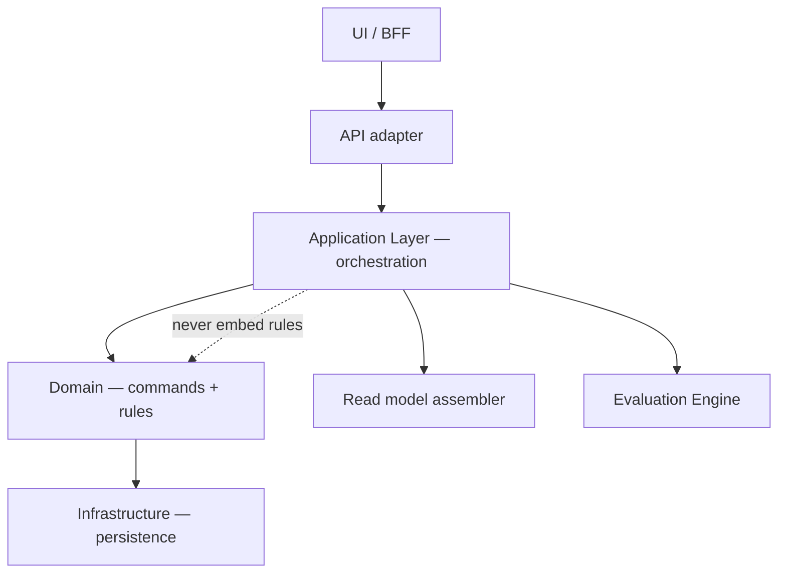
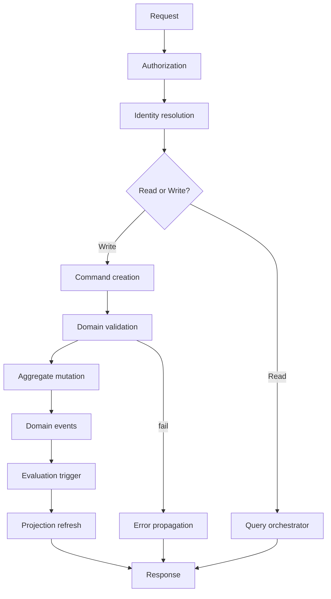
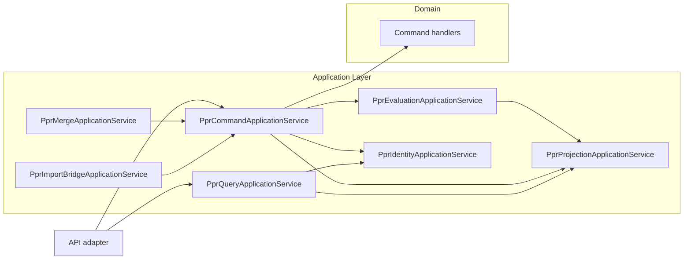
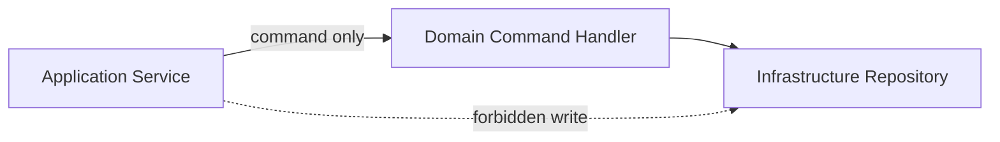
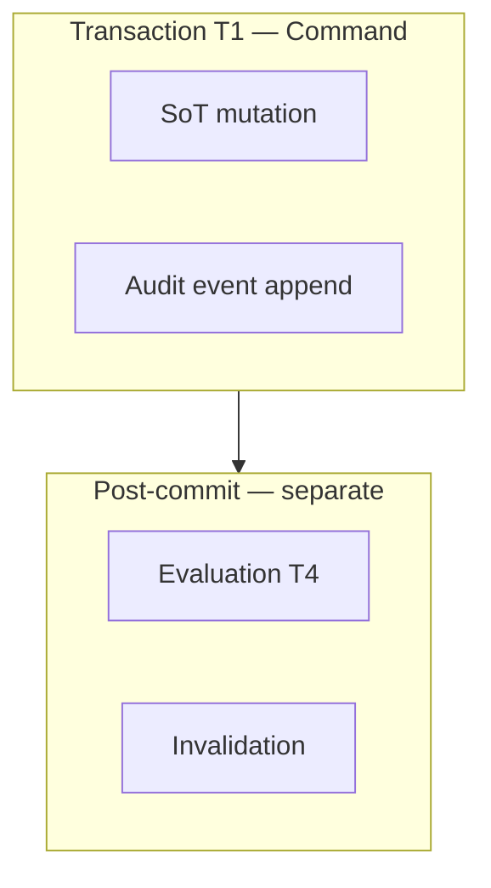
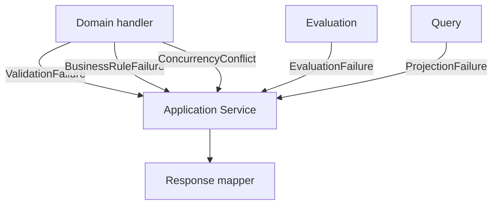
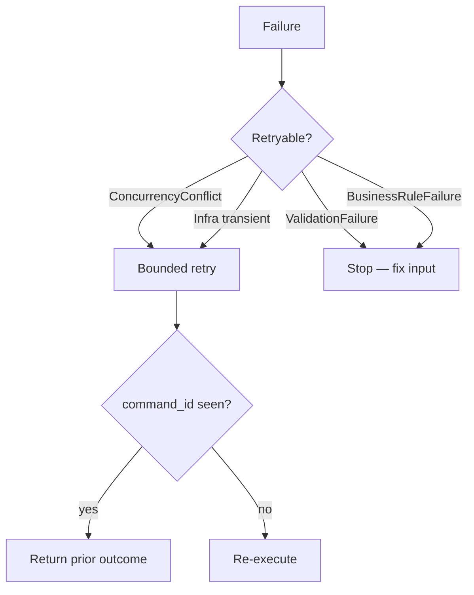
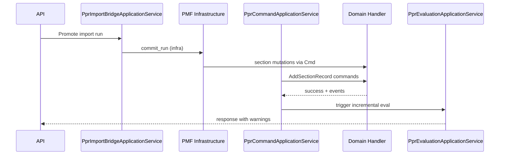
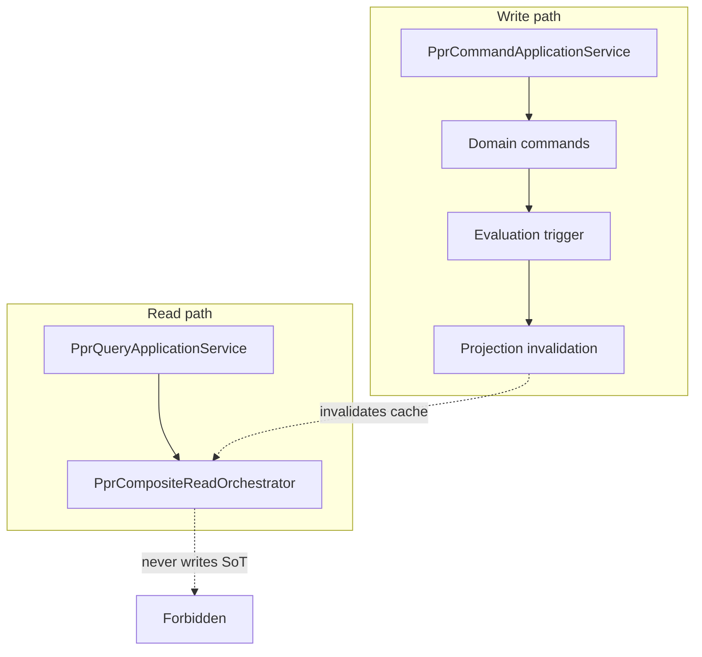

--------------------------------------------------

Document Status

Document:
WP-PR-009-application-service-layer

Title:
Personnel Personal Record — Application Service Layer

Type:
Architecture Work Package

Status:
Draft — Ready for Review

Revision:
1

Date:
2026-07-15

Parent:
ADR-054 — Personnel Personal Record Aggregate Model

Depends on:
ARCH-002, WP-PR-002 (Completed), WP-PR-003 (Draft — Ready for Review), WP-PR-004 (Draft — Ready for Review), WP-PR-005 (Draft — Ready for Review), WP-PR-006 (Draft — Ready for Review), WP-PR-007 (Draft — Ready for Review), WP-PR-008 (Draft — Ready for Review), WP-HR-CARD-002 (Draft)

Purpose:
Normative architecture of the PPR Application Service Layer — orchestration only, no domain rules.
No REST, SQL, DI framework, code, migrations, or implementation in this WP.

--------------------------------------------------

# WP-PR-009 — PPR Application Service Layer

**Date:** 2026-07-15

---

## 1. Purpose

### 1.1 Role of the Application Layer

**PPR Application Service Layer** — архитектурный слой **orchestration**, координирующий:

- входящий intent (из API adapter, UI backend-for-frontend, batch job, cross-BC handler);
- authorization gate;
- identity resolution ([WP-PR-005 §3](./WP-PR-005-logical-read-model-and-composite-projection.md));
- вызов **domain commands** ([WP-PR-008](./WP-PR-008-command-model-and-mutation-contracts.md));
- emission / delegation of **domain events** ([WP-PR-007](./WP-PR-007-ppr-event-taxonomy-and-change-model.md));
- триггер **evaluation** ([WP-PR-006](./WP-PR-006-completeness-and-readiness-evaluation-engine.md));
- инвалидацию / сборку **read model** ([WP-PR-005](./WP-PR-005-logical-read-model-and-composite-projection.md));
- формирование **application response** (success / failure envelope).

Application Layer **не содержит предметных правил** PPR. Правила живут в Domain (commands, invariants, aggregate behavior) и Policy (completeness/readiness rules per WP-PR-003).

### 1.2 Layer distinction

| Layer | Responsibility | PPR example |
|-------|----------------|-------------|
| **UI / Presentation** | Render, user intent, navigation | `EmployeeImportCard2PageClient` — must not own rules |
| **API / Transport** | HTTP mapping, serialization, auth middleware | `personnel_migration_router` — thin adapter |
| **Application** | **Orchestration** — sequence, transactions, cross-BC coordination | `PprCommandApplicationService` (planned) |
| **Domain** | Commands, invariants, aggregate mutation semantics | `MaterializePPR`, section mutation rules |
| **Infrastructure** | Persistence, messaging hooks, external clients | DB repositories, `emit_personnel_record_event` |



### 1.3 What Application Layer is NOT

| Not | Reason |
|-----|--------|
| Domain aggregate | No business invariants inside application service |
| REST controller | Transport is separate adapter |
| Read model store | Projection is consumer/output |
| Evaluation Engine | Stateless compute — invoked, not duplicated |
| Import staging logic | Import BC — application only bridges |
| UI state holder | INV-5 |
| DI framework configuration | Out of scope |

### 1.4 Mandatory references

| Document | Role |
|----------|------|
| [ARCH-002](./ARCH-002-personnel-personal-record-architecture.md) | Layering; INV-5 |
| [ADR-054](../adr/ADR-054-personnel-personal-record-aggregate-model.md) | `person_id` canonical |
| [WP-PR-002](./WP-PR-002-aggregate-boundary-specification.md) | BC boundaries; write paths |
| [WP-PR-004](./WP-PR-004-ppr-lifecycle-and-state-machine.md) | Lifecycle commands |
| [WP-PR-005](./WP-PR-005-logical-read-model-and-composite-projection.md) | Read orchestrator; identity resolution |
| [WP-PR-006](./WP-PR-006-completeness-and-readiness-evaluation-engine.md) | Evaluation triggers |
| [WP-PR-007](./WP-PR-007-ppr-event-taxonomy-and-change-model.md) | Event causality |
| [WP-PR-008](./WP-PR-008-command-model-and-mutation-contracts.md) | Command catalog; validation |
| [WP-HR-CARD-002](./WP-HR-CARD-002-unified-personnel-record-card.md) | UI routes through application |

---

## 2. Responsibilities

### 2.1 Application Layer MUST do

| ID | Responsibility |
|----|----------------|
| **AL-1** | Resolve `person_id` from input keys before domain operations |
| **AL-2** | Enforce authorization gate before command execution |
| **AL-3** | Construct domain commands with `command_id`, `actor_id`, correlation |
| **AL-4** | Invoke domain command handlers in correct order |
| **AL-5** | Define transaction / unit-of-work boundaries per command |
| **AL-6** | Trigger evaluation after successful section/lifecycle mutations |
| **AL-7** | Trigger read model invalidation or refresh |
| **AL-8** | Coordinate cross-BC orchestration (delegate, not mutate foreign BC) |
| **AL-9** | Map domain failures to application response (no HTTP here) |
| **AL-10** | Propagate `policy_version` and freshness metadata to read responses |
| **AL-11** | Deduplicate retries via `command_id` |
| **AL-12** | Separate read path (query) from write path (command) |

### 2.2 Application Layer MUST NOT do

| ID | Prohibition |
|----|-------------|
| **AL-N1** | Encode completeness rules, lifecycle transitions, or section validation |
| **AL-N2** | Write directly to section SoT bypassing domain commands |
| **AL-N3** | Write Employment / Orders tables from PPR application service |
| **AL-N4** | Compute completeness locally instead of Evaluation Engine |
| **AL-N5** | Treat Import Profile / overrides as authoritative mutation target |
| **AL-N6** | Embed RBAC business rules (only call authorization gate) |
| **AL-N7** | Become fat god-service with all HR domain logic |
| **AL-N8** | Reconstruct section SoT from events |
| **AL-N9** | Auto-trigger lifecycle from evaluation results |
| **AL-N10** | Perform UI-specific field mapping as domain truth |

---

## 3. Typical execution pipeline

### 3.1 Write path (command)

```text
Request (intent + principal + input key)
    ↓
Authorization (may principal invoke command?)
    ↓
Identity resolution (person_id, merge redirect, transitional mode)
    ↓
Command creation (command envelope per WP-PR-008 §4.1)
    ↓
Domain validation (preconditions, invariants — domain handler)
    ↓
Aggregate mutation (atomic unit — domain + infrastructure)
    ↓
Domain events (append journal — WP-PR-007)
    ↓
Evaluation trigger (RecomputeCompleteness / ReevaluateProfiles if applicable)
    ↓
Projection refresh / cache invalidation
    ↓
Application response (result + warnings + capabilities refresh hint)
```

### 3.2 Read path (query)

```text
Request (projection variant + input key + principal)
    ↓
Authorization (may principal read?)
    ↓
Identity resolution
    ↓
PprQueryApplicationService → PprCompositeReadOrchestrator (WP-PR-005)
    ↓
Optional: attach evaluation snapshot (precomputed or on-demand)
    ↓
Application response (read contract; no mutation)
```



---

## 4. Application service catalog

Architectural service boundaries — **not** class implementations.

| Service | Primary responsibility |
|---------|------------------------|
| **PprCommandApplicationService** | Write path: dispatch all PPR domain commands |
| **PprQueryApplicationService** | Read path: full-card, summary, section projections |
| **PprEvaluationApplicationService** | Invoke evaluation engine; emit derived events; no rules |
| **PprLifecycleApplicationService** | Facade for envelope/lifecycle commands (subset of Command) |
| **PprSectionApplicationService** | Facade for section/evidence/verification commands |
| **PprMergeApplicationService** | Person merge orchestration across Person BC + PPR |
| **PprProjectionApplicationService** | Read model invalidation, cache keys, refresh scheduling |
| **PprImportBridgeApplicationService** | Import/PMF → delegated PPR commands (transitional) |

**Optional facades (may merge into Command service Phase 1):**

| Service | Note |
|---------|------|
| `PprIdentityApplicationService` | Wraps identity resolution for reuse |
| `PprCapabilitiesApplicationService` | Composes capabilities after command/read |

### 4.1 Service collaboration



---

## 5. Service responsibilities

### 5.1 PprCommandApplicationService

| | |
|-|-|
| **Owns** | Command dispatch sequencing; unit-of-work scope; `command_id` dedup; post-command evaluation trigger decision |
| **Calls** | Domain command handlers; `PprIdentityApplicationService`; `PprEvaluationApplicationService`; `PprProjectionApplicationService`; authorization gate |
| **Never owns** | Section validation rules; lifecycle transition rules; RBAC matrix; persistence SQL |

### 5.2 PprQueryApplicationService

| | |
|-|-|
| **Owns** | Read request routing (full / summary / section); projection variant selection; degraded/partial response assembly |
| **Calls** | `PprCompositeReadOrchestrator` (WP-PR-005); identity resolution; authorization; optional evaluation snapshot reader |
| **Never owns** | Section SoT; completeness computation; UI layout; cross-BC writes |

### 5.3 PprEvaluationApplicationService

| | |
|-|-|
| **Owns** | When to invoke evaluation; mode selection (full / incremental / section); derived event emission delegation |
| **Calls** | Evaluation Engine (WP-PR-006); envelope rollup writer; event emitter for `PPR_COMPLETENESS_CHANGED` / `PPR_READINESS_CHANGED` |
| **Never owns** | Rule definitions; completeness algorithms; lifecycle side effects |

### 5.4 PprLifecycleApplicationService

| | |
|-|-|
| **Owns** | Lifecycle command choreography (`MaterializePPR` → `StartCollection` → …); precondition read of evaluation **without** enforcing rules inline |
| **Calls** | `PprCommandApplicationService` or domain lifecycle handler directly |
| **Never owns** | `ppr_lifecycle_state` transition rules (domain); auto-transition from completeness |

### 5.5 PprSectionApplicationService

| | |
|-|-|
| **Owns** | Section command batching (PMF commit mapping); correlation of supersede pairs |
| **Calls** | Domain section handlers; `PprEvaluationApplicationService` after commit |
| **Never owns** | Field validation rules; PMF domain plugin internals |

### 5.6 PprMergeApplicationService

| | |
|-|-|
| **Owns** | Multi-step merge saga orchestration: Person BC → PPR loser → survivor reconciliation → evaluation |
| **Calls** | Person merge API; `PprCommandApplicationService` (`ApplyPersonMerge`); `PprEvaluationApplicationService` |
| **Never owns** | Person merge approval rules; duplicate reconciliation algorithms (domain) |

### 5.7 PprProjectionApplicationService

| | |
|-|-|
| **Owns** | Cache key computation; invalidation map per WP-PR-007 events; refresh scheduling |
| **Calls** | Read model stores; optional async refresh **TBD** |
| **Never owns** | Read model assembly logic (orchestrator); source data |

### 5.8 PprImportBridgeApplicationService

| | |
|-|-|
| **Owns** | Map import/PMF completion to delegated PPR commands; `correlation_id` from run/batch |
| **Calls** | PMF services; `PprSectionApplicationService`; optional `MaterializePPR` |
| **Never owns** | Import staging SoT; promotion parsing rules (Import BC) |

---

## 6. Interaction with Domain

### 6.1 Application → Domain

| Interaction | Pattern |
|-------------|---------|
| Execute command | `handler.execute(command)` — validation inside handler |
| Preconditions | Domain returns `ValidationFailure` / `BusinessRuleFailure` |
| Mutation | Domain invokes infrastructure repositories |
| Events | Domain or application emits per WP-PR-007 — **single emission authority TBD** (OQ-3) |

### 6.2 Application must NOT

| Prohibited | Reason |
|------------|--------|
| Duplicate invariant checks for convenience | Domain leakage |
| Branch on `section_code` business rules | Belongs in domain/policy |
| Skip command handler for «simple» updates | CI-16 WP-PR-008 |
| Call repository from application directly for writes | Bypass commands |



---

## 7. Interaction with Read Model

### 7.1 When to call read model

| Scenario | Service |
|----------|---------|
| Card open (full-card) | `PprQueryApplicationService` |
| Registry row (summary) | `PprQueryApplicationService` |
| Post-command response with fresh state | `PprQueryApplicationService` after invalidation |
| Section editor load | Section projection variant |

### 7.2 When forbidden

| Forbidden | Reason |
|-----------|--------|
| Read model as write target | Projection ≠ SoT |
| UI parallel fetch bypassing query service | WP-PR-005 rejected Option D |
| Stale cache without invalidation after command | Projection inconsistency |
| Full-card payload for registry pagination | WP-PR-005 §21 |

### 7.3 Read-after-write

```text
Command success
    ↓
PprProjectionApplicationService.invalidate(person_id, scopes)
    ↓
PprQueryApplicationService (optional same-request refresh)
    ↓
Response includes read snapshot or refresh hint
```

**Rule:** read-after-write **may** return eventually consistent snapshot if invalidation async (OQ-7).

---

## 8. Interaction with Evaluation Engine

### 8.1 When to trigger evaluation

| Trigger | Mode | Caller |
|---------|------|--------|
| After `PPR_SECTION_*` command success | incremental / section | `PprEvaluationApplicationService` |
| After evidence/verification command | section | same |
| After `PPR_LIFECYCLE_CHANGED` | profile activation set | same |
| After `PERSON_MERGED` reconciliation | full | `PprMergeApplicationService` |
| Policy version change | full | Admin command |
| Manual `RecomputeCompleteness` | full | `PprCommandApplicationService` |
| Read-only card open | **lazy** — use stored snapshot | `PprQueryApplicationService` — **no** eval unless stale |

### 8.2 When NOT to trigger

| Scenario | Reason |
|----------|--------|
| Failed command | No mutation — no eval |
| Read-only query (fresh snapshot) | Avoid double eval |
| Lifecycle command with no section/applicability change | Optional skip **TBD** |
| Import staging write | Not PPR SoT |
| Inside domain command handler | Separation of concerns — eval after commit |

### 8.3 Double evaluation guard

| ID | Rule |
|----|------|
| **EV-1** | At most **one** incremental eval per successful section command (same transaction boundary or immediate follow-up) |
| **EV-2** | Coalesce multiple section commands in batch → **one** rollup eval |
| **EV-3** | `input_fingerprint` dedup before emitting `PPR_COMPLETENESS_CHANGED` |

---

## 9. Transaction boundaries

Architectural model — **no SQL**.

### 9.1 Transaction scopes

| Scope | Includes | Excludes |
|-------|----------|----------|
| **T1 — Command mutation** | Section/envelope SoT update + audit event append | Evaluation; projection refresh |
| **T2 — Lifecycle command** | Envelope transition + lifecycle events | Cross-BC Employment |
| **T3 — Supersede pair** | Old supersede + new insert (WP-PR-008 AT-1) | Evaluation |
| **T4 — Evaluation persist** | Rollup snapshot write + derived events | Section SoT |
| **T5 — Merge saga** | Multi-step; separate transactions per step **TBD** | Atomic cross-BC |



### 9.2 Rules

| ID | Rule |
|----|------|
| **TX-1** | Failed T1 → full rollback; no events; no eval |
| **TX-2** | Evaluation failure **does not** rollback successful T1 |
| **TX-3** | Projection refresh failure **does not** rollback T1 |
| **TX-4** | Cross-BC orchestration uses compensating actions — not distributed lock in application **TBD** |

---

## 10. Unit of Work (conceptual)

**Unit of Work (UoW)** — граница согласованности одной application operation.

| UoW type | Commands included | Consistency |
|----------|-------------------|-------------|
| **Single command UoW** | One domain command | ACID on PPR stores T1 |
| **Batch section UoW** | PMF commit → N section mutations | Shared `correlation_id`; one eval at end |
| **Lifecycle UoW** | One lifecycle command | Envelope atomic |
| **Saga UoW** | Merge, enroll+materialize | Multi-transaction; eventual consistency |

Application layer **opens/commits** UoW; domain **participates**; infrastructure **implements** persistence.

**No ORM session prescription.**

---

## 11. Error propagation

| Failure type | Origin | Application behavior | Propagate to client |
|--------------|--------|----------------------|---------------------|
| **ValidationFailure** | Domain preconditions | No mutation; no eval | Field/command errors |
| **BusinessRuleFailure** | Domain invariants | No mutation | Rule code + message_key |
| **ConcurrencyConflict** | Optimistic version | No mutation; retry allowed | Conflict indicator |
| **AggregateMissing** | No envelope | Reject or route to Materialize **TBD** | Not found / not materialized |
| **IdentityFailure** | Unresolved person | No PPR operation | Identity error (distinct from projection) |
| **AuthorizationDenied** | Auth gate | No command invoked | Forbidden |
| **InfrastructureFailure** | DB, timeout | No partial commit if T1 incomplete | Service unavailable |
| **EvaluationFailure** | Engine/policy | Mutation stands; rollup stale flag | Warning on response |
| **ProjectionFailure** | Read assembler | Mutation stands; degraded read | Partial + warnings |



**Rule:** Identity errors **never** masked as empty sections (WP-PR-005 §12).

---

## 12. Retry model

### 12.1 Retryable

| Condition | Retry | Idempotency |
|-----------|-------|-------------|
| `ConcurrencyConflict` | Yes — client refresh + resubmit | New `command_id` or same **TBD** |
| `InfrastructureFailure` (transient) | Yes — bounded backoff | Same `command_id` |
| `ProjectionFailure` / `EvaluationFailure` | Yes — background retry | Eval fingerprint dedup |
| Network timeout after unknown commit state | Reconcile via `command_id` lookup **TBD** |

### 12.2 Non-retryable

| Condition | Reason |
|-----------|--------|
| `ValidationFailure` | Fix input |
| `BusinessRuleFailure` | State/rule mismatch |
| `AuthorizationDenied` | Policy |
| `IdentityFailure` | Wrong key |
| Merge loser command | Terminal |
| Duplicate non-idempotent command without dedup | Risk double mutation |



### 12.3 Retry storm mitigation

| Mitigation | Owner |
|------------|-------|
| Exponential backoff | Application / infrastructure policy |
| Eval coalescing per person_id | `PprEvaluationApplicationService` |
| Invalidation debounce | `PprProjectionApplicationService` |
| Max retry budget | OQ-11 |

---

## 13. Cross-context orchestration

### 13.1 Orchestration patterns

| BC | Application pattern | PPR Application Service |
|----|---------------------|-------------------------|
| **Employment** | Orders apply → Employment handler → optional `UpdateHrRelationshipContext` | `PprLifecycleApplicationService` or dedicated handler — **delegates** command; never writes `employee_events` |
| **Personnel Orders** | Order workflow stays in Orders BC | No direct PPR section write |
| **Import** | Promote → `PprImportBridgeApplicationService` → section commands | Bridge only |
| **PMF** | `commit_run` → map to `PprSectionApplicationService` | Transitional gateway |
| **Identity** | Link person → may trigger `MaterializePPR` **TBD** | `PprIdentityApplicationService` |
| **Visibility** | Read scope for query authorization | Query gate only — no PPR mutation |
| **Document Engine** | Export job → snapshot read + derived artifact | Query + admin command — no SoT write |



### 13.2 Anti-patterns

| Anti-pattern | Risk |
|--------------|------|
| Enroll service writes PPR sections directly | Domain leakage |
| Card UI calls 3 APIs without application layer | Double fetch; no identity resolution |
| Orders apply updates `person_education` | BC violation |
| Application encodes HIRE readiness rules | Belongs in WP-PR-006 policy |

---

## 14. Repository inventory

Read-only audit (2026-07-15). **Current code is transitional — not target application layer.**

### 14.1 Existing artifacts mapped to layers

| Artifact | Current layer | Target application service | Gap |
|----------|---------------|---------------------------|-----|
| `personnel_migration_router.py` | API adapter | Thin — delegates to Command/Section | Mixed with PMF |
| `personnel_migration_commit_service.py` | Domain-ish + infra | `PprSectionApplicationService` + domain handlers | No command envelope |
| `personnel_migration_query_service.py` | Query infra | `PprQueryApplicationService` | No composite read |
| `personnel_migration_record_events_query_service.py` | Query infra | Part of query/history | OK transitional |
| `hr_import_employee_card_service.py` | Import + composite | **Not** PPR application — Import bridge | employee-centric |
| `hr_import_enroll_employee_service.py` | Cross-BC orchestration | Partial enroll orchestrator | No PPR lifecycle |
| `EmployeeImportCard2PageClient.tsx` | **UI orchestration** | Should call single query API | Anti-pattern per WP-PR-005 |
| `personnel_record_event_service.py` | Infrastructure | Event append repo | OK |
| `personnel_visibility_resolver_service.py` | Security/read scope | Auth gate input for query | Not PPR-specific |
| `identity_reconciliation_service.py` | Identity BC | `PprIdentityApplicationService` input | Large; separate BC |

### 14.2 Missing application services

| Planned service | Status |
|-----------------|--------|
| `PprCommandApplicationService` | **Not implemented** |
| `PprQueryApplicationService` / `PprCompositeReadOrchestrator` | **Not implemented** |
| `PprEvaluationApplicationService` | **Not implemented** |
| `PprLifecycleApplicationService` | **Not implemented** |
| `PprMergeApplicationService` | **Not implemented** |
| `PprProjectionApplicationService` | **Not implemented** |
| `PprImportBridgeApplicationService` | Partial via PMF only |
| Central identity resolution | **Not implemented** |
| `command_id` dedup store | **Not implemented** |

### 14.3 Layer violations today

| Violation | Evidence |
|-----------|----------|
| UI as orchestrator | `Promise.all([getEmployee, getEmployeeImportCard2])` |
| Import card save as HR mutation | `save_employee_import_card` → overrides |
| PMF requires `employee_context_id` | Transitional; app layer should resolve `person_id` |
| No lifecycle application facade | No envelope |

---

## 15. Decision summary

| # | Decision |
|---|----------|
| **D-1** | Application Layer = **orchestration only** — no domain rules |
| **D-2** | All PPR writes go through **domain commands** via application dispatch |
| **D-3** | **Read and write paths separated** — Query vs Command services |
| **D-4** | **Identity resolution** is application concern before domain/read |
| **D-5** | **Authorization** outside command body — gate before application handler |
| **D-6** | **Evaluation triggered post-commit** — not inside mutation transaction |
| **D-7** | **Projection invalidation** after successful write — separate step |
| **D-8** | **Cross-BC orchestration** delegates — never direct foreign BC writes |
| **D-9** | **PMF/import** routed through Import Bridge application service |
| **D-10** | **UI must not** replace application layer orchestration |
| **D-11** | **Failed command** — no eval, no invalidation |
| **D-12** | **Eval/projection failure** does not rollback mutation |
| **D-13** | **Idempotent commands** deduped at application entry |
| **D-14** | **No fat application service** — split by command/query/eval/merge/projection |
| **D-15** | **No REST/SQL/DI** in this WP — architectural boundaries only |

---

## 16. Open questions

| ID | Question |
|----|----------|
| **OQ-1** | Single `PprApplicationService` vs split catalog §4 Phase 1 |
| **OQ-2** | Event emission authority — domain handler vs application |
| **OQ-3** | Same-request read-after-write vs async refresh |
| **OQ-4** | `command_id` dedup store placement (app vs infra) |
| **OQ-5** | Sync vs async evaluation trigger |
| **OQ-6** | Sync vs async projection invalidation |
| **OQ-7** | Enroll flow — single application saga entry point |
| **OQ-8** | BFF layer between UI and `PprQueryApplicationService` |
| **OQ-9** | PMF router remains public API or internal only |
| **OQ-10** | Capabilities composer — separate service or query adjunct |
| **OQ-11** | Max retry budget and backoff policy |
| **OQ-12** | Transaction T1 includes event append or separate **TBD** |
| **OQ-13** | Merge saga compensation ownership |
| **OQ-14** | Lazy eval on read when snapshot stale — threshold |
| **OQ-15** | Application layer entry for batch/registry jobs |
| **OQ-16** | Correlation tracing across cross-BC orchestration |
| **OQ-17** | Whether lifecycle facade is separate deployable module |
| **OQ-18** | Testing strategy for application without DI prescription |

---

## 17. Risks

| Risk | Impact | Mitigation |
|------|--------|------------|
| **Fat application service** | Domain leakage; untestable | D-14 service split §4 |
| **Domain leakage** | Rules in application | AL-N1; domain handlers only |
| **Double evaluation** | Perf; duplicate events | EV-1…EV-3 |
| **Transaction split errors** | Orphan events | TX-1, TX-2; UoW §10 |
| **Projection inconsistency** | Stale UI | Invalidation §7; PRJ service |
| **Retry storms** | Load spike | §12.3 backoff |
| **Cross-context coupling** | BC violations | §13 delegate pattern |
| **UI orchestration persistence** | WP-PR-005 Option D | D-10 |
| **God enroll service** | Mixed concerns | Dedicated saga OQ-7 |
| **Missing command envelope** | No idempotency | WP-PR-008 command_id |

---

## 18. Mermaid diagrams index

| # | Diagram | Section |
|---|---------|---------|
| 1 | Layer stack (UI/API/App/Domain/Infra) | §1.2 |
| 2 | Write/read execution pipeline | §3 |
| 3 | Application service collaboration | §4.1 |
| 4 | Domain interaction (no direct repo write) | §6.2 |
| 5 | Transaction boundaries T1 vs post-commit | §9.1 |
| 6 | Retry flow | §12 |
| 7 | Cross-context import bridge sequence | §13.1 |
| 8 | Read/write separation | §3.2 + below |

### 18.1 Read/write separation



---

## 19. Consistency check

| Document | Check | Status |
|----------|-------|--------|
| **ARCH-002** | UI ≠ SoT; layering | ✅ |
| **ADR-054** | `person_id` canonical | ✅ |
| **WP-PR-002** | BC boundaries; PMF gateway | ✅ |
| **WP-PR-003** | Policy in engine — not application | ✅ |
| **WP-PR-004** | Lifecycle via commands; C-1 no auto | ✅ |
| **WP-PR-005** | Read orchestrator; reject UI BFF | ✅ |
| **WP-PR-006** | Engine stateless; app triggers | ✅ |
| **WP-PR-007** | Events after mutation; causality | ✅ |
| **WP-PR-008** | Command pipeline; no rules in app | ✅ |
| **WP-HR-CARD-002** | UI routes through application | ✅ |

| Constraint | Status |
|------------|--------|
| No contradiction with prior WP | ✅ |
| No REST/SQL/DI/code | ✅ |
| Orchestration only | ✅ |
| Prior WP/ADR unchanged | ✅ |

---

## References

- [ARCH-002 — Personnel Personal Record Architecture](./ARCH-002-personnel-personal-record-architecture.md)
- [ADR-054 — Personnel Personal Record Aggregate Model](../adr/ADR-054-personnel-personal-record-aggregate-model.md)
- [WP-PR-002 — Aggregate Boundary Specification](./WP-PR-002-aggregate-boundary-specification.md)
- [WP-PR-003 — Section Catalog & Completeness Model](./WP-PR-003-section-catalog-and-completeness-model.md)
- [WP-PR-004 — PPR Lifecycle & State Machine](./WP-PR-004-ppr-lifecycle-and-state-machine.md)
- [WP-PR-005 — Logical Read Model & Composite Projection](./WP-PR-005-logical-read-model-and-composite-projection.md)
- [WP-PR-006 — Completeness & Readiness Evaluation Engine](./WP-PR-006-completeness-and-readiness-evaluation-engine.md)
- [WP-PR-007 — PPR Event Taxonomy & Change Model](./WP-PR-007-ppr-event-taxonomy-and-change-model.md)
- [WP-PR-008 — Command Model & Mutation Contracts](./WP-PR-008-command-model-and-mutation-contracts.md)
- [WP-HR-CARD-002 — Unified Personnel Record Card](./WP-HR-CARD-002-unified-personnel-record-card.md)

---

*End of WP-PR-009*
