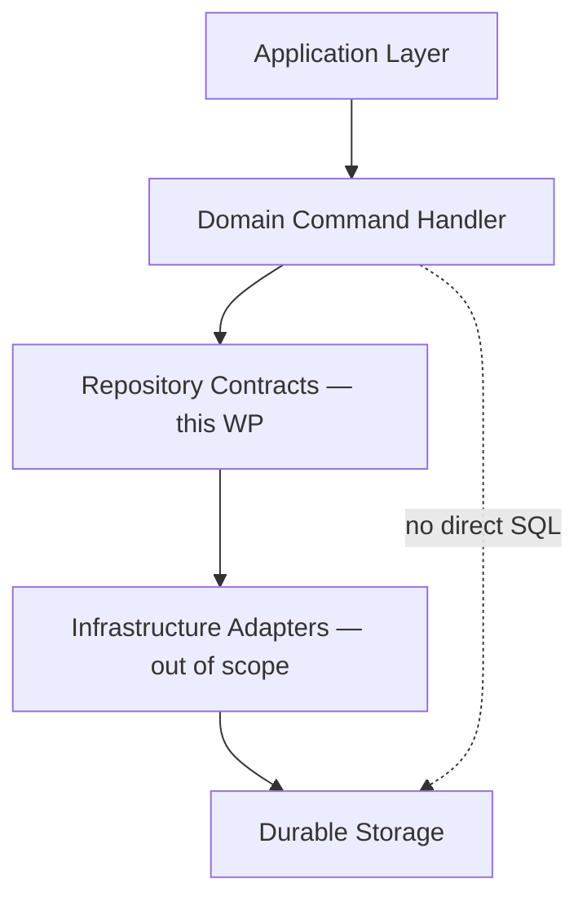
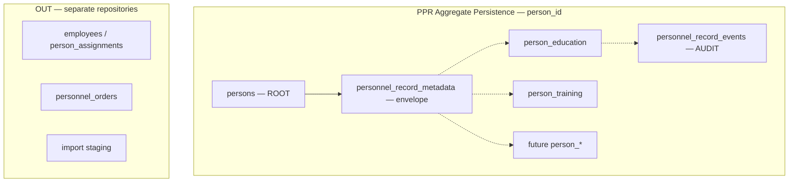
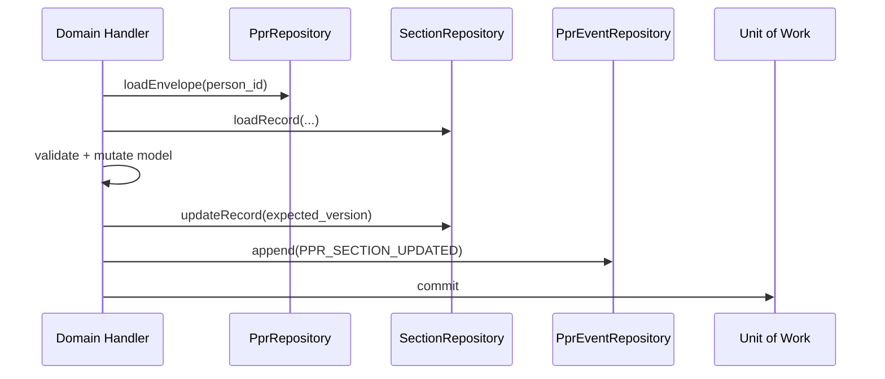
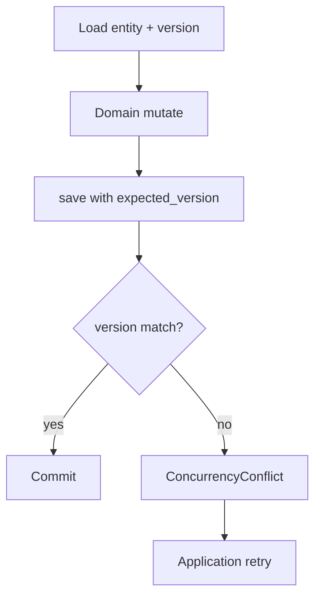
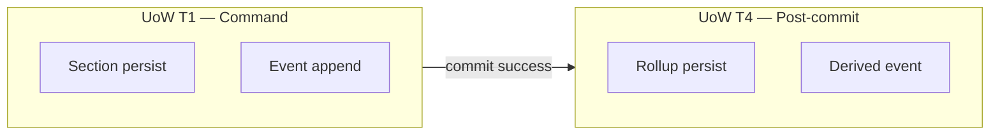
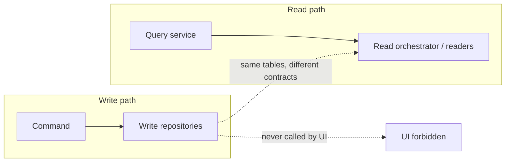
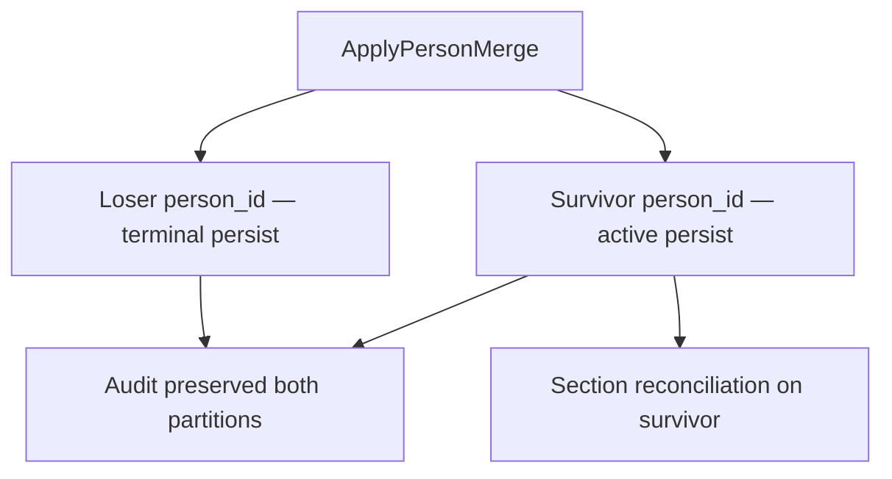
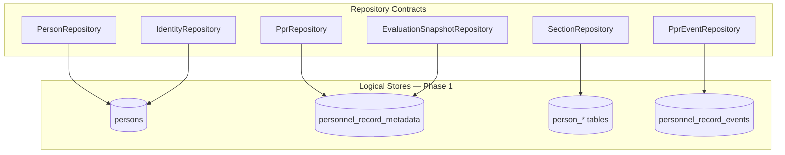

--------------------------------------------------

Document Status

Document:
WP-PR-010-persistence-model-and-repository-contracts

Title:
Personnel Personal Record — Persistence Model & Repository Contracts

Type:
Architecture Work Package

Status:
Draft — Ready for Review

Revision:
2

Date:
2026-07-15

Parent:
ADR-054 — Personnel Personal Record Aggregate Model

Depends on:
ARCH-002, WP-PR-002 (Completed), WP-PR-003 (Draft — Ready for Review), WP-PR-004 (Draft — Ready for Review), WP-PR-005 (Draft — Ready for Review), WP-PR-006 (Draft — Ready for Review), WP-PR-007 (Draft — Ready for Review), WP-PR-008 (Draft — Ready for Review), WP-PR-009 (Draft — Ready for Review), WP-HR-CARD-002 (Draft)

Purpose:
Normative persistence model and repository contracts for PPR.
No SQL, ORM, Alembic, storage engine implementation, or code in this WP.

--------------------------------------------------

# WP-PR-010 — Persistence Model & Repository Contracts

**Date:** 2026-07-15

---

## 1. Purpose

### 1.1 Role of the Persistence Layer

**PPR Persistence Layer** — архитектурный слой **materialization** aggregate state и audit journal в durable stores, доступный **только** через **repository contracts**.

Persistence:

- сохраняет и загружает **aggregate-consistent** state по `person_id`;
- обеспечивает **transactional boundaries** для atomic mutations;
- поддерживает **optimistic concurrency**;
- append-only **event journal** ([WP-PR-007](./WP-PR-007-ppr-event-taxonomy-and-change-model.md));
- **не** содержит предметных правил (Domain) и **не** orchestration (Application).

### 1.2 Layer distinction

| Layer | Responsibility | PPR example |
|-------|----------------|-------------|
| **Domain** | Commands, invariants, what to mutate | `ActivatePPR` semantics |
| **Application** | Orchestration, UoW scope, when to save | `PprCommandApplicationService` |
| **Persistence (this WP)** | **Contracts** for load/save aggregate persistence units | `PprRepository.updateEnvelope()` |
| **Infrastructure** | Concrete adapters implementing contracts | Table mapping, connection — out of scope |
| **Storage engine** | PostgreSQL etc. | **Not specified** |



### 1.3 What Persistence is NOT

| Not | Reason |
|-----|--------|
| Application orchestration | WP-PR-009 |
| Read model assembly | WP-PR-005 — separate readers |
| Evaluation computation | WP-PR-006 — reads via repositories |
| REST DTO mapping | API adapter |
| UI cache | Presentation |
| Import staging tables as PPR SoT | TEMPORARY per WP-PR-002 |
| Employment / Orders storage | External BC |

### 1.4 Mandatory references

| Document | Role |
|----------|------|
| [ADR-054](../adr/ADR-054-personnel-personal-record-aggregate-model.md) | Person-root Phase 1; `person_id` = PPR ID |
| [WP-PR-002](./WP-PR-002-aggregate-boundary-specification.md) | Boundary matrix; storage mapping |
| [WP-PR-004](./WP-PR-004-ppr-lifecycle-and-state-machine.md) | Envelope lifecycle fields |
| [WP-PR-007](./WP-PR-007-ppr-event-taxonomy-and-change-model.md) | Event persistence; AUDIT vs SoT |
| [WP-PR-008](./WP-PR-008-command-model-and-mutation-contracts.md) | Mutation targets; atomicity |
| [WP-PR-009](./WP-PR-009-application-service-layer.md) | UoW; transaction T1–T5 |

---

## 2. Persistence philosophy

### 2.1 Repository persists aggregate units — not raw rows or transport shapes

**Normative principle:** repository API выражен в терминах **aggregate persistence units** и **typed section records** (domain-shaped), а **не** в терминах raw database rows, transport DTO или UI model.

| Repository speaks in | Repository does NOT speak in |
|---------------------|------------------------------|
| `person_id` | `employee_id` as primary key |
| Envelope snapshot (aggregate unit) | Raw SQL column list |
| Section record (domain model) | Import Profile JSON shape |
| Aggregate version | UI form state |
| Audit event append | Read model projection blob |

**Clarification:** `SectionRepository` persists **typed section records** — это допустимая persistence unit, не нарушение принципа. Принцип запрещает работу с **raw rows**, **transport DTO** и **UI model**, а не сохранение section records как domain-shaped persistence units.

### 2.2 Person-root Phase 1 (ADR-054)

```text
Person (persons)           = identity ROOT; person_id = PPR identifier
+ personnel_record_metadata = AGGREGATE-ENVELOPE (planned)
+ person_* section tables  = typed section SoT
+ personnel_record_events  = AUDIT journal
= Personnel Personal Record (logical aggregate persistence)
```

**No `personal_record_id` Phase 1.** Separate header table is envelope metadata on `person_id`, not a second aggregate root.

### 2.3 Core principles

| ID | Principle |
|----|-----------|
| **PER-1** | One logical PPR per `person_id` in persistence |
| **PER-2** | Section tables are SoT; events are AUDIT only |
| **PER-3** | Repositories **never** serve UI directly |
| **PER-4** | Cross-BC tables **out of scope** for PprRepository family |
| **PER-5** | Load/save through contracts — no ad-hoc persistence in application |
| **PER-6** | Partial aggregate save **must** be explicit — no silent half-persist |

---

## 3. Aggregate persistence model

### 3.1 Components IN aggregate persistence

| Component | Storage (Phase 1) | Role | In aggregate load? |
|-----------|-------------------|------|-------------------|
| **Identity root** | `persons` | Person anchor; scalar identity fields for PPR-GENERAL | Yes — partial |
| **Envelope** | `personnel_record_metadata` **planned** | lifecycle, `hr_relationship_context`, rollup snapshot, `policy_version`, version | Yes — when materialized |
| **Sections** | `person_education`, `person_training`, future `person_*` | Business section SoT | Per command scope |
| **Evidence links** | columns on section rows / `person_documents` **target** | `source_document_id` etc. | With parent section |
| **Metadata (rollup)** | envelope columns | completeness/readiness **snapshots** — derived cache | With envelope |
| **Lifecycle** | envelope `ppr_lifecycle_state` | Aggregate lifecycle | With envelope |
| **Version** | envelope `row_version` + per-record version **TBD** | Optimistic concurrency | Yes |
| **Audit journal** | `personnel_record_events` | Append-only events | Separate repository; not aggregate SoT |

### 3.2 Components OUT of PPR persistence

| Component | Owner | Repository |
|-----------|-------|------------|
| `employees`, `person_assignments` | Employment BC | EmploymentRepository — **not** PprRepository |
| `personnel_orders` | Orders BC | OrdersRepository |
| `employee_import_profile_overrides` | Import TEMPORARY | ImportRepository |
| `hr_import_rows` | Import TEMPORARY | ImportRepository |
| Read model cache | Projection | ReadModelStore — not PPR SoT |
| `employee_events` | Employment BC | EmploymentRepository |

### 3.3 Aggregate persistence diagram



### 3.4 NOT_MATERIALIZED persistence

| State | Persistence shape |
|-------|-------------------|
| Person without envelope | `persons` row only; no `personnel_record_metadata`; sections may exist from PMF |
| Query | `PprRepository.existsEnvelope(person_id)` → false |

#### 3.4.1 Transitional compatibility vs target architecture

| Aspect | Transitional compatibility (current) | Target architecture (post-envelope) |
|--------|--------------------------------------|-------------------------------------|
| Sections without envelope | **Allowed** — existing `person_*` rows from PMF may exist without `personnel_record_metadata` | **Not allowed for new mutations** |
| New section mutations | May target NOT_MATERIALIZED persons during transition | **Only** for materialized PPR (`existsEnvelope` → true) |
| Lifecycle commands | Require envelope (or `MaterializePPR` first) | Same |
| Read path | May load sections without envelope | Same; envelope adds lifecycle/rollup |

**Bootstrap — `MaterializePPR`:**

```text
MaterializePPR(person_id)
  → PprRepository.insertEnvelope(envelope)   // creates envelope over existing person
  → sections already on person_* remain authoritative SoT
  → PPR_CREATED event appended in same UoW
```

`MaterializePPR` **не** пересоздаёт section rows — envelope materializes **поверх** существующих section records. После materialization новые section mutations **должны** выполняться только для materialized PPR.

---

## 4. Repository contracts

### 4.0 Aggregate persistence — no single aggregate repository

**Normative model:** **aggregate repository не существует** как единый contract.

| Concept | Specification |
|---------|---------------|
| **Logical aggregate** | PPR = `persons` + envelope + sections + audit journal (§3) |
| **Physical persistence** | Достигается **кооперацией** нескольких repositories |
| **Orchestration** | **Application Layer** + **Unit of Work** — load/save scope per command |
| **`PprRepository`** | **Envelope repository only** — **не** repository всего aggregate |

Имя `PprRepository` сохранено по соглашению; семантически это **envelope repository**. Альтернативное имя `PprEnvelopeRepository` эквивалентно. Ни один repository **не** владеет всем aggregate целиком.

### 4.1 Repository catalog

| Repository | Scope | Primary key |
|------------|-------|-------------|
| **PprRepository** | **Envelope only** — existence, lifecycle, rollup anchor; **not** whole aggregate | `person_id` |
| **PersonRepository** | Person identity root — cadre subset (Person BC boundary) | `person_id` |
| **IdentityRepository** | Resolution bridges (`employee_id` → `person_id`, merge) | lookup keys |
| **SectionRepository** | Generic or per-section section SoT | `person_id` + `section_code` + `record_id` |
| **PprEventRepository** | Append-only `personnel_record_events` | `event_id` |
| **EvaluationSnapshotRepository** | Envelope rollup fields (derived cache) | `person_id` |

**Note:** `SectionRepository` as single generic contract **or** typed `EducationSectionRepository` — **OQ-1**. Architecture allows **both**; final choice deferred.

### 4.2 PprRepository — envelope repository (not aggregate repository)

| Operation | Purpose |
|-----------|---------|
| `existsEnvelope(person_id)` | Materialization check |
| `loadEnvelope(person_id)` | Envelope + version + lifecycle |
| `insertEnvelope(envelope)` | `MaterializePPR` |
| `updateEnvelope(envelope, expected_version)` | Lifecycle / context / metadata |
| `markMergedLoser(loser_id, survivor_id)` | Terminal loser envelope |

**Owns:** `personnel_record_metadata` **only** (planned).

**Never owns:** section rows; employment; import; **не** является aggregate repository.

**Explicit:** `PprRepository` **не** загружает и **не** сохраняет aggregate целиком. Aggregate load/save — orchestration Application Layer через несколько repositories в одном UoW.

### 4.3 PersonRepository

| Operation | Purpose |
|-----------|---------|
| `loadPerson(person_id)` | Identity scalars (PPR-GENERAL subset on `persons`) |
| `updatePersonScalars(person_id, fields, expected_version)` | `UpdateGeneralSection` persistence |
| `loadMergeStatus(person_id)` | `person_status`, `merged_into_person_id` |

**Owns:** `persons` cadre-relevant columns — **только кадровый subset** полей Person.

**Never owns:** envelope lifecycle (unless columns on persons — **not** Phase 1); sections; non-cadre Person BC fields.

#### 4.3.1 PersonRepository boundary (normative)

| Rule | Specification |
|------|---------------|
| **PRB-1** | `PersonRepository` работает **только** с **кадровым subset** полей Person — поля, входящие в PPR-GENERAL и merge-status |
| **PRB-2** | Физическое расположение колонок в `persons` **не** определяет ownership — ownership определяет **Bounded Context** |
| **PRB-3** | `UpdateGeneralSection` **маршрутизирует** изменения согласно ownership конкретного поля: cadre subset → `PersonRepository`; section-owned fields → `SectionRepository`; envelope fields → `PprRepository` |
| **PRB-4** | Person BC identity operations may share infrastructure adapter; PPR commands use **subset only** — не весь `persons` row |

**Example:** поле может физически находиться в `persons`, но если ownership принадлежит другому BC — `PersonRepository` **не** пишет его; command handler маршрутизирует в правильный repository.

### 4.4 IdentityRepository

| Operation | Purpose |
|-----------|---------|
| `resolvePersonFromEmployee(employee_id)` | Transitional navigation |
| `resolveSurvivor(person_id)` | Merge redirect |
| `findDuplicatePersonCandidates(match_key, iin)` | Linkage — read only for PPR path |

**Owns:** nothing — **read-only** for PPR application.

**Never owns:** mutation of Employment or merge approval (Person BC command).

### 4.5 SectionRepository (contract)

| Operation | Purpose |
|-----------|---------|
| `loadActiveRecords(person_id, section_code)` | Section read for command preconditions |
| `loadRecord(person_id, section_code, record_id)` | Single record + version |
| `insertRecord(record)` | `AddSectionRecord` |
| `updateRecord(record, expected_version)` | `UpdateSectionRecord` |
| `voidRecord(record_id, reason)` | `VoidSectionRecord` |
| `supersedePair(old_id, new_record)` | **Atomic** `SupersedeSectionRecord` |

**Owns:** person-owned section tables per `section_code` mapping.

**Never owns:** envelope; events (except via separate append in same UoW).

### 4.6 PprEventRepository

| Operation | Purpose |
|-----------|---------|
| `append(event)` | Append-only; returns `event_id` |
| `listByPerson(person_id, filters)` | Audit/history read |
| `existsByCorrelation(correlation_id, event_type)` | Idempotency check |

**Owns:** `personnel_record_events` journal.

**Never owns:** section SoT; must not be used to reconstruct authoritative content (AB-12).

### 4.7 EvaluationSnapshotRepository

| Operation | Purpose |
|-----------|---------|
| `loadRollup(person_id)` | Read cached completeness/readiness snapshot |
| `saveRollup(person_id, snapshot, prior_hash)` | Post-evaluation persist |
| `isStale(person_id, fingerprint)` | Skip write if unchanged |

**Owns:** envelope rollup columns only.

**Never owns:** evaluation rules; recompute logic.

### 4.8 Repository invariants

| ID | Invariant |
|----|-----------|
| **RI-1** | All PPR repositories key by `person_id` for aggregate operations |
| **RI-2** | `employee_id` **not** accepted as primary persistence key |
| **RI-3** | `append` on event repo — **no** update/delete |
| **RI-4** | `supersedePair` — atomic in one UoW |
| **RI-5** | Loser `person_id` — **no** envelope/section writes after merge |
| **RI-6** | Repository methods **do not** invoke evaluation or emit derived events |
| **RI-7** | Load returns **domain-shaped** records, not raw transport DTOs |
| **RI-8** | Cross-BC repositories **not** callable from PprRepository implementation |

---

## 5. Save model

### 5.1 Normative save pipeline (domain + persistence)

```text
Load aggregate slice (repositories per command scope)
    ↓
Domain mutate in-memory aggregate model
    ↓
Domain validate (invariants)
    ↓
Persist (repositories within UoW)
    ↓
Append audit events (PprEventRepository)
    ↓
Commit UoW
    ↓
(return to Application → evaluation trigger)
```



### 5.2 Save granularity

| Command type | Repositories touched |
|--------------|---------------------|
| Lifecycle | `PprRepository` + `PprEventRepository` |
| Section CRUD | `SectionRepository` + `PprEventRepository` |
| General scalars | `PersonRepository` + `PprEventRepository` |
| Supersede | `SectionRepository.supersedePair` + events |
| Recompute snapshot | `EvaluationSnapshotRepository` + `PprEventRepository` (derived) |
| Materialize | `PprRepository.insert` + event |

### 5.3 Forbidden save patterns

| Forbidden | Risk |
|-----------|------|
| Save section without event | Audit inconsistency |
| Save **domain mutation event** without corresponding mutation (except idempotent replay) | Ghost audit for authoritative changes |
| Save envelope lifecycle from evaluation service | Domain leakage |
| Save import overrides as PPR section | Wrong SoT |

#### 5.3.1 Event-without-mutation rule (normative)

| Event category | May exist without SoT mutation? | Condition |
|----------------|--------------------------------|---------|
| **Domain mutation events** (section CRUD, lifecycle transition) | **No** | Must correspond to committed SoT mutation in same UoW |
| **Derived events** (completeness/readiness notification) | **Yes** | Own cause: post-evaluation result |
| **Evaluation events** | **Yes** | Own cause: evaluation run |
| **Policy events** | **Yes** | Own cause: policy version change |
| **Administrative events** | **Yes** | Own cause: admin action (e.g. `MaterializePPR`) |
| **Idempotent replay** | **Yes** | Same `command_id` / `correlation_id` — no duplicate SoT write |

**Normative:** запрет «save event without mutation» относится **только** к **domain mutation events**, не к derived/evaluation/policy/administrative events с собственной причиной возникновения.

---

## 6. Snapshot model

### 6.1 Snapshot types

| Snapshot type | Storage | Authoritative? |
|---------------|---------|----------------|
| **Aggregate envelope state** | `personnel_record_metadata` | **Yes** for lifecycle/context |
| **Section row state** | `person_*` tables | **Yes** for section content |
| **Completeness/readiness rollup** | envelope columns | **Derived cache** — not SoT |
| **Export/print snapshot** | export job artifact | **Derived** — point-in-time ([ARCH-002 INV-6]) |
| **Read model cache** | projection store | **Not** authoritative |

### 6.2 When snapshot (rollup) is allowed

| Scenario | Allowed |
|----------|---------|
| Post-evaluation persist to envelope | Yes — `EvaluationSnapshotRepository` |
| Read model cache after assembly | Yes — separate store |
| Export job frozen copy | Yes — DERIVED |

### 6.3 When snapshot is forbidden

| Scenario | Reason |
|----------|--------|
| Replace section SoT with rollup JSON | AB-12 violation |
| UI localStorage as persistence | INV-5 |
| Import Profile as snapshot of PPR | TEMPORARY only |
| Rebuild sections from event log alone | EI-4 WP-PR-007 |

---

## 7. Optimistic concurrency

### 7.1 Version model (architectural)

| Entity | Version field | Checked on |
|--------|---------------|------------|
| Envelope | `envelope_version` / `updated_at` **TBD** | Lifecycle commands |
| Section record | `record_version` / `updated_at` | Update, void, supersede |
| Person scalars | `person_version` **TBD** | `UpdateGeneralSection` |
| Rollup snapshot | `snapshot_hash` | Eval persist dedup |

### 7.2 Contract pattern

```text
load → expected_version from client or loaded entity
update(entity, expected_version)
  → match: persist
  → mismatch: ConcurrencyConflict (no partial write)
```



### 7.3 Retry

Retry policy owned by **Application Layer** ([WP-PR-009 §12](./WP-PR-009-application-service-layer.md)) — not repository.

---

## 8. Transaction boundaries

### 8.1 Layer responsibilities

| Layer | Transaction role |
|-------|------------------|
| **Application** | Opens/commits UoW; defines scope per command |
| **Domain handler** | Participates; requests persist |
| **Repository** | Executes persist within active UoW |
| **Unit of Work** | Tracks dirty aggregates; single commit |

### 8.2 Standard UoW scopes (aligned WP-PR-009)

| UoW | Repositories | Atomic |
|-----|--------------|--------|
| **UoW-Section** | SectionRepository + PprEventRepository | Yes |
| **UoW-Lifecycle** | PprRepository + PprEventRepository | Yes |
| **UoW-Supersede** | SectionRepository.supersedePair + events | Yes |
| **UoW-Eval** | EvaluationSnapshotRepository + PprEventRepository | Yes — separate from section UoW |
| **UoW-Merge** | Multi-step saga — **not** single atomic cross-person **TBD** |



### 8.3 Repository transaction rules

| ID | Rule |
|----|------|
| **TX-1** | Repository **does not** commit autonomously — UoW commits |
| **TX-2** | Authoritative PPR SoT mutation и соответствующий audit/domain event append **фиксируются в одном локальном Unit of Work** — **mandatory** |
| **TX-3** | Nested UoW across BCs **prohibited** |

#### 8.3.1 Local UoW atomicity vs event delivery (normative separation)

| In scope (TX-2) | Out of scope |
|-----------------|--------------|
| SoT mutation + event **append** in same local UoW | Event **publication** to message bus |
| Single commit boundary for authoritative write + journal | Event **delivery** guarantees |
| Atomicity of persist + append | **Integration** fan-out |
| | **Notification** dispatch |
| | **Outbox** pattern implementation |
| | Kafka / Rabbit / external consumers |

**Normative:** атомарность **mutation + event append** в локальном UoW — **зафиксировано**. **OQ-12** касается **только** механизма доставки/integration **после** commit — **не** атомарности append.

---

## 9. Aggregate consistency

### 9.1 Must be atomic (strong consistency)

| Operation | Consistency |
|-----------|-------------|
| Supersede pair | Both rows + events |
| Void record | Status + event |
| Lifecycle transition | Envelope + lifecycle event |
| Materialize envelope | Insert + created event |
| Event append with mutation | Same UoW |

### 9.2 Eventual consistency allowed

| Operation | Notes |
|-----------|-------|
| Rollup snapshot after section save | Post-commit eval |
| Read model cache | Invalidation async |
| Cross-BC `hr_relationship_context` sync | Employment projection lag |
| Merge survivor reconciliation | Saga steps |
| Registry summary | Catches up via events |

### 9.3 Consistency invariants

| ID | Invariant |
|----|-----------|
| **AC-1** | No lifecycle state without envelope row (when materialized) |
| **AC-2** | Active section record **never** duplicated by supersede invariants |
| **AC-3** | Loser person — envelope terminal; survivor is continuation |
| **AC-4** | Rollup may lag SoT — must carry `evaluated_at` / stale flag |
| **AC-5** | Events **never** contradict committed SoT at same `event_id` ordering |

---

## 10. Read model interaction

| Rule | Specification |
|------|---------------|
| **RM-1** | Repositories **do not** return UI-shaped card DTOs |
| **RM-2** | Read model uses **readers** — may share underlying tables but separate contracts |
| **RM-3** | `PprQueryApplicationService` may call read optimized queries — **not** write repositories |
| **RM-4** | CQRS: write repos enforce invariants; read side may denormalize **TBD** |
| **RM-5** | Repository load for **command** uses authoritative tables only — not import overrides |



---

## 11. Event persistence

### 11.1 What is persisted (WP-PR-007 alignment)

| Persisted | Store | Repository |
|-----------|-------|------------|
| Section mutation events | `personnel_record_events` | `PprEventRepository` |
| Lifecycle events | same or envelope log **TBD** | `PprEventRepository` |
| Derived completeness/readiness notifications | same | append after eval |
| `correlation_id`, `command_id` | event payload / columns **TBD** | idempotency |

### 11.2 What is NOT persisted as events

| Not persisted | Reason |
|---------------|--------|
| Full section row copy as only record | SoT is section table |
| Employment HIRE events | `employee_events` — other BC |
| Read model payloads | Projection |
| Evaluation explainability full tree | Optional separate store OQ-8 |
| Failed command attempts | Optional audit OQ-9 |

### 11.3 Event persistence rules

| ID | Rule |
|----|------|
| **EP-1** | Append-only — no UPDATE/DELETE |
| **EP-2** | `person_id` on event — see §11.3.1 (historical vs post-merge) |
| **EP-3** | Events do not substitute section reads in command path |
| **EP-4** | Legacy PMF `domain_code` retained Phase 1 — evolution OQ-10 |

#### 11.3.1 Event `person_id` — historical vs active (normative)

| Event timing | `person_id` on event | Notes |
|--------------|---------------------|-------|
| **Historical events** (pre-merge, on loser partition) | **Original** `person_id` at time of occurrence | Preserved — **not** rewritten to survivor |
| **`PPR_MERGED`** on loser | **Loser** `person_id` | **Terminal** event for loser — last authoritative event on loser partition |
| **New mutation events** (post-merge) | **Survivor** `person_id` only | No new authoritative events on loser |
| **Merge metadata** | `merged_into_person_id`, `survivor_person_id` in payload | Links loser → survivor for audit queries |

**Normative:** исторические события **сохраняют** исходный `person_id`. После merge новые mutation events создаются **только** для survivor. Merge metadata обеспечивает связь loser → survivor.

---

## 12. Merge persistence

### 12.1 Loser

| Action | Persistence |
|--------|-------------|
| Envelope → MERGED terminal | `PprRepository.markMergedLoser` |
| Section rows on loser | **Frozen** — no new writes |
| Events on loser | **Preserved** — historical partition; **original** `person_id` retained |
| `PPR_MERGED` event | **Terminal** event on loser — last authoritative event for loser partition |
| `persons.merged_into_person_id` | PersonRepository / Person BC |

### 12.2 Survivor

| Action | Persistence |
|--------|-------------|
| Reconcile duplicate sections | `SectionRepository` commands on survivor |
| **New** mutation events (post-merge) | `person_id = survivor` **only** |
| Historical events on loser | **Unchanged** — readable via loser partition + merge metadata |
| Envelope unchanged or updated per policy | `PprRepository` |
| Rollup recompute | `EvaluationSnapshotRepository` |



### 12.3 Merge invariants

| ID | Rule |
|----|------|
| **MP-1** | No section insert/update targeting loser after merge |
| **MP-2** | Survivor load includes reconciliation status metadata |
| **MP-3** | Historical queries on loser remain readable — events retain **original** `person_id` |
| **MP-4** | Merge does not delete section rows — void/supersede policy **TBD** |
| **MP-5** | `PPR_MERGED` on loser is **terminal** — no subsequent authoritative events on loser |
| **MP-6** | Post-merge mutation events use **survivor** `person_id` only; merge metadata links partitions |

---

## 13. Cross-context persistence

| BC | PPR repository may read? | PPR repository may write? |
|----|------------------------|-------------------------|
| **Employment** (`employees`, `person_assignments`) | IdentityRepository only | **No** |
| **Personnel Orders** | No via PprRepository | **No** |
| **Import** staging | No for SoT | **No** |
| **PMF** runs/items | Correlation read only | **No** — commit delegates to SectionRepository |
| **Visibility** | No | **No** |
| **Identity** (`persons` merge fields) | PersonRepository read | Person BC write; PPR uses subset |
| **Document Engine** | Evidence document metadata read **TBD** | **No** order docs |

**Rule:** PMF infrastructure calls **SectionRepository** through domain handler — not bypass.

---

## 14. Repository inventory

Read-only audit (2026-07-15).

### 14.1 Existing persistence artifacts

| Artifact | Location | Maps to contract | Gap |
|----------|----------|------------------|-----|
| `persons` table | ADR-042 migration | `PersonRepository` | No repository abstraction |
| `person_education` | `personnel_migration.py` | `SectionRepository` (education) | Direct SQL in PMF |
| `person_training` | same | `SectionRepository` (training) | same |
| `personnel_record_events` | same | `PprEventRepository` | `emit_personnel_record_event` only |
| `personnel_record_metadata` | — | `PprRepository` | **Not implemented** |
| `personnel_migration_commit_service` | commit/void/supersede | Section persist + events | No envelope; employee-centric |
| `personnel_migration_query_service` | read runs/items | Not PPR aggregate load | PMF-specific |
| `hr_import_employee_card_service` | overrides | Import — **wrong BC** | Not PPR repository |
| `employee_identities` | employee model | Identity bridge — employee scoped | EPIC-10 |
| `merged_into_person_id` | persons schema | `IdentityRepository` / Person BC | No PPR merge repo |

### 14.2 Missing contracts

| Contract | Status |
|----------|--------|
| `PprRepository` (envelope) | **Missing** |
| Unified `SectionRepository` | **Missing** — ad-hoc SQL |
| `IdentityRepository` for PPR path | **Partial** in services |
| `EvaluationSnapshotRepository` | **Missing** |
| `Unit of Work` abstraction | **Missing** — `engine.begin()` ad-hoc |
| Optimistic `expected_version` | **Missing** |
| `command_id` idempotency store | **Missing** |
| Typed future section repos | **Missing** |

### 14.3 Anti-patterns in codebase

| Pattern | Risk |
|---------|------|
| PMF `commit_service` raw SQL | No aggregate load/save model |
| `FORBIDDEN_TABLES` guard only in tests | No runtime boundary |
| `employee_context_id` required for PMF | Transitional key leakage |
| No envelope → lifecycle not persisted | State machine gap |
| Event emit without repository interface | Hard to test/swap |

---

## 15. Decision summary

| # | Decision |
|---|----------|
| **D-1** | **Person-root** persistence — `person_id` = aggregate key (ADR-054) |
| **D-2** | **Repository persists aggregate units and typed section records** — not raw rows, transport DTO, or UI model |
| **D-3** | **Section tables = SoT**; **events = AUDIT** only |
| **D-4** | **No aggregate repository** — `PprRepository` owns **envelope only**; `SectionRepository` owns sections; orchestration via Application + UoW |
| **D-5** | **`PprEventRepository`** append-only |
| **D-6** | **Rollup snapshot** on envelope — derived cache, not SoT |
| **D-7** | **Optimistic concurrency** required on envelope and records |
| **D-8** | **Supersede pair atomic** in one UoW |
| **D-9** | **Repositories never** write Employment/Orders/Import |
| **D-10** | **Repositories never** serve UI directly |
| **D-11** | **Read model** uses separate read contracts |
| **D-12** | **Merge loser** terminal for PPR writes |
| **D-13** | **Eval persist** separate UoW from section mutation |
| **D-14** | **Mutation + event append** atomic in local UoW — delivery/integration out of scope |
| **D-15** | **No SQL/ORM/Alembic** in this WP |
| **D-16** | **Infrastructure adapters** implement contracts — not prescribed here |

---

## 16. Open questions

| ID | Question |
|----|----------|
| **OQ-1** | Generic `SectionRepository` vs per-section typed repos — **both allowed**; final choice deferred |
| **OQ-2** | `personnel_record_metadata` column catalog — separate WP |
| **OQ-3** | Envelope + section in one physical transaction always? |
| **OQ-4** | `record_version` column vs `updated_at` concurrency |
| **OQ-5** | Single `personnel_record_events` vs split envelope log |
| **OQ-6** | CQRS read replicas for section load |
| **OQ-7** | Evidence in `person_documents` — separate EvidenceRepository? |
| **OQ-8** | Persist full explainability tree |
| **OQ-9** | Failed command attempt audit table |
| **OQ-10** | Relax `domain_code` NOT NULL on events |
| **OQ-11** | Merge reconciliation — void vs supersede duplicates |
| **OQ-12** | Event **delivery/integration** mechanism after commit (outbox, bus, async fan-out) — **not** local UoW atomicity of append |
| **OQ-13** | PersonRepository vs Person BC repository split |
| **OQ-14** | Soft-delete persons with PPR retention |
| **OQ-15** | Batch PMF commit — single UoW scope |
| **OQ-16** | Read-through cache invalidation at repository layer |
| **OQ-17** | Multi-organization envelope partitioning |
| **OQ-18** | Phase 2 `personal_record_id` impact on contracts |

---

## 17. Risks

| Risk | Impact | Mitigation |
|------|--------|------------|
| **Repository leakage** | Employment writes in PprRepo | RI-8; §13 matrix |
| **Anemic persistence** | Dumb CRUD without UoW | Save model §5 |
| **Aggregate split** | Envelope without sections sync | AC-1; explicit load scope |
| **Partial save** | Orphan event or row | UoW; TX-1 |
| **Lost update** | No version check | §7 concurrency |
| **Double write** | Retry without idempotency | `command_id` + event correlation |
| **Stale snapshot** | Rollup trusted as SoT | D-6; stale flags |
| **Cross-context corruption** | Import override as section | D-9; PER-4 |
| **Event-as-SoT** | Rebuild from journal | RI-3; AB-12 |
| **God repository** | One repo for all tables | Split catalog §4 |
| **PMF bypass** | Direct SQL forever | SectionRepository mandate |

---

## 18. Mermaid diagrams index

| # | Diagram | Section |
|---|---------|---------|
| 1 | Layer stack (App/Domain/Repo/Infra) | §1.2 |
| 2 | Aggregate persistence components | §3.3 |
| 3 | Save pipeline sequence | §5.1 |
| 4 | Transaction UoW T1 vs T4 | §8.2 |
| 5 | Optimistic concurrency flow | §7.2 |
| 6 | Merge persistence | §12 |
| 7 | Read/write repository separation | §10 |
| 8 | Cross-context boundary (text §13 + aggregate diagram §3.3) | §3, §13 |

### 18.1 Persistence architecture overview



---

## 19. Consistency check

| Document | Check | Status |
|----------|-------|--------|
| **ARCH-002** | INV-5; Person-root; snapshots DERIVED | ✅ |
| **ADR-054** | Person-root; no `personal_record_id` Phase 1 | ✅ |
| **WP-PR-002** | Boundary matrix; AB-12 AUDIT | ✅ |
| **WP-PR-003** | Envelope metadata; section catalog | ✅ |
| **WP-PR-004** | Lifecycle on envelope | ✅ |
| **WP-PR-005** | Read separate; identity resolution | ✅ |
| **WP-PR-006** | Rollup derived; eval separate UoW | ✅ |
| **WP-PR-007** | Event append; immutability | ✅ |
| **WP-PR-008** | Mutation targets; atomic supersede | ✅ |
| **WP-PR-009** | UoW owner application; TX scopes | ✅ |
| **WP-HR-CARD-002** | UI not persistence consumer | ✅ |

| Constraint | Status |
|------------|--------|
| No SQL/ORM/Alembic/code | ✅ |
| Prior WP/ADR unchanged | ✅ |
| No contradiction | ✅ |

---

## References

- [ARCH-002 — Personnel Personal Record Architecture](./ARCH-002-personnel-personal-record-architecture.md)
- [ADR-054 — Personnel Personal Record Aggregate Model](../adr/ADR-054-personnel-personal-record-aggregate-model.md)
- [WP-PR-002 — Aggregate Boundary Specification](./WP-PR-002-aggregate-boundary-specification.md)
- [WP-PR-003 — Section Catalog & Completeness Model](./WP-PR-003-section-catalog-and-completeness-model.md)
- [WP-PR-004 — PPR Lifecycle & State Machine](./WP-PR-004-ppr-lifecycle-and-state-machine.md)
- [WP-PR-005 — Logical Read Model & Composite Projection](./WP-PR-005-logical-read-model-and-composite-projection.md)
- [WP-PR-006 — Completeness & Readiness Evaluation Engine](./WP-PR-006-completeness-and-readiness-evaluation-engine.md)
- [WP-PR-007 — PPR Event Taxonomy & Change Model](./WP-PR-007-ppr-event-taxonomy-and-change-model.md)
- [WP-PR-008 — Command Model & Mutation Contracts](./WP-PR-008-command-model-and-mutation-contracts.md)
- [WP-PR-009 — Application Service Layer](./WP-PR-009-application-service-layer.md)
- [WP-HR-CARD-002 — Unified Personnel Record Card](./WP-HR-CARD-002-unified-personnel-record-card.md)

---

*End of WP-PR-010*
