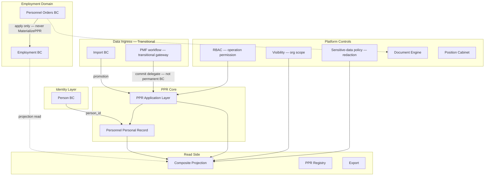
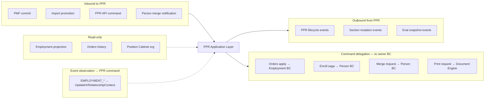
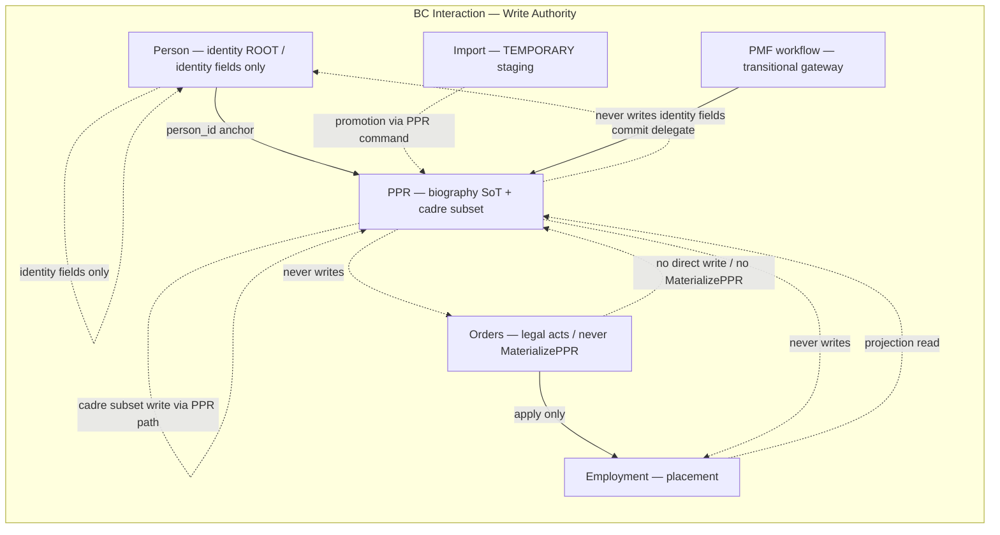
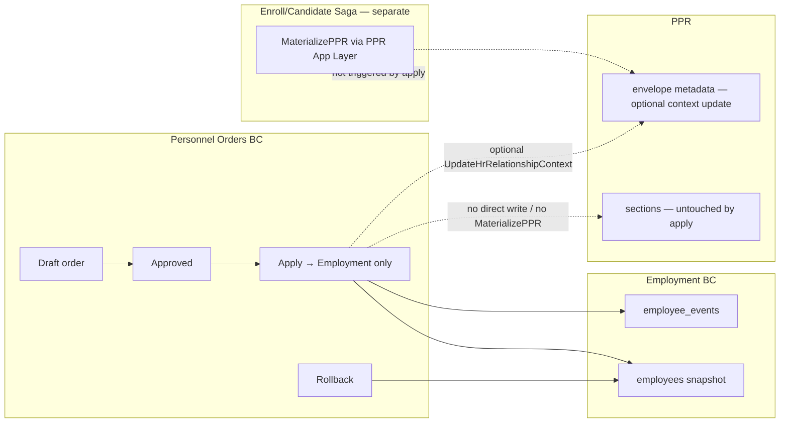
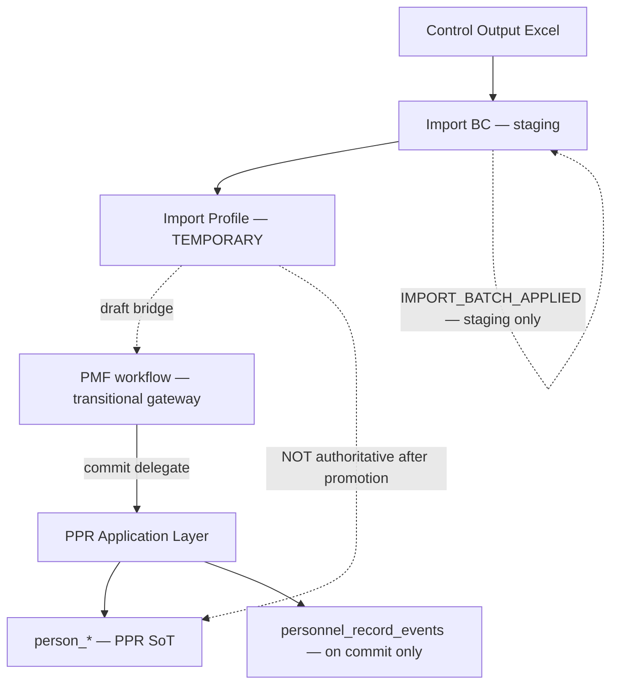
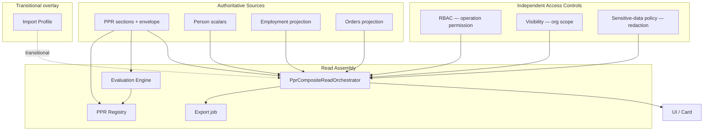
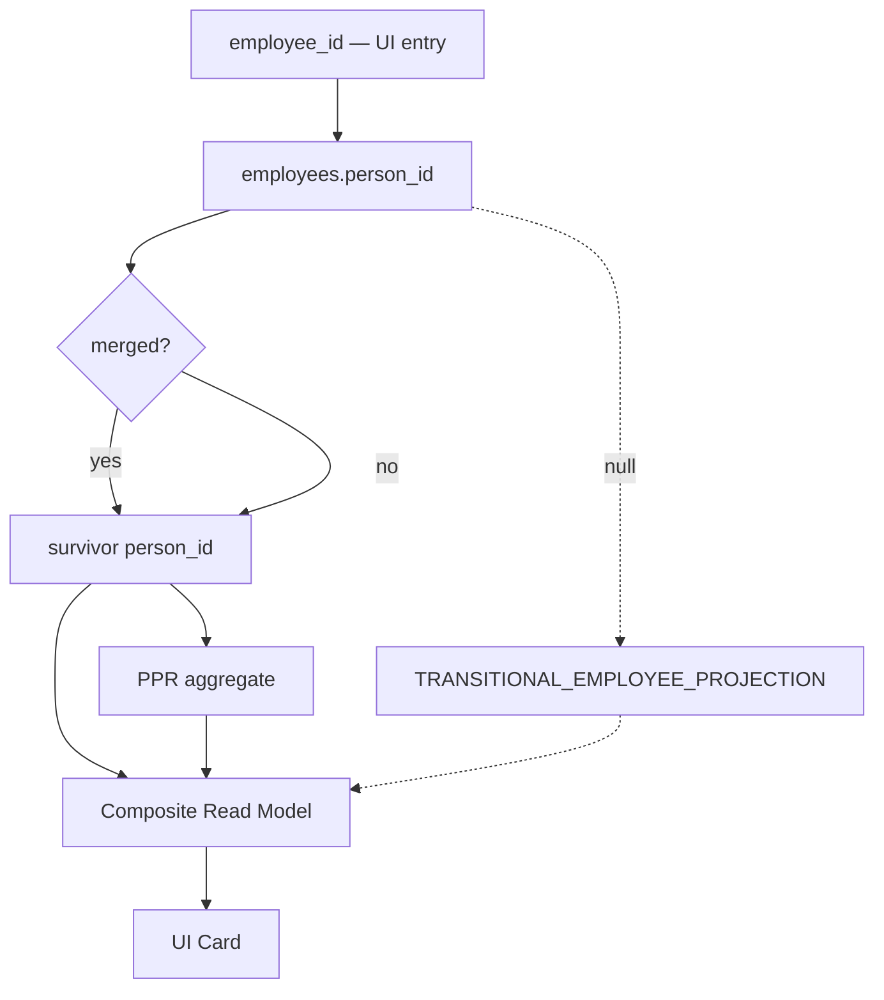
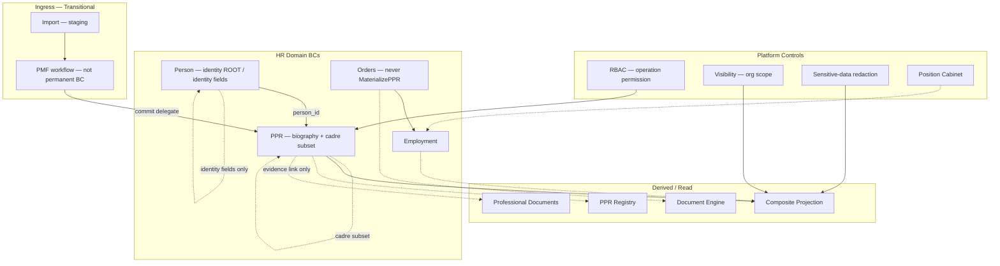
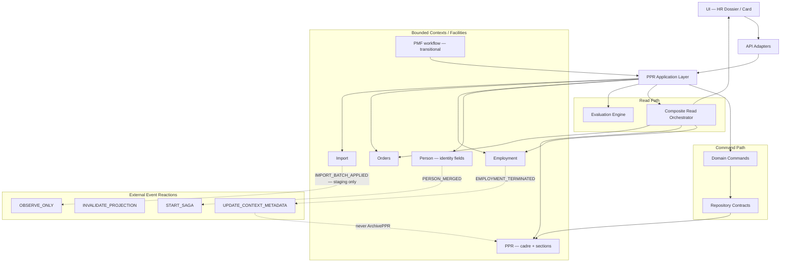

--------------------------------------------------

Document Status

Document:
WP-PR-011-integration-architecture-and-bounded-context-interaction

Title:
Personnel Personal Record — Integration Architecture & Bounded Context Interaction

Type:
Architecture Work Package

Status:
Draft — Ready for Review

Revision:
2

Date:
2026-07-15

Revision History:

| Rev | Date | Summary |
|-----|------|---------|
| 1 | 2026-07-15 | Initial draft — integration architecture, BC matrix, identity flow |
| 2 | 2026-07-15 | Architectural review clarifications: termination≠ArchivePPR; `persons` field ownership; command delegation taxonomy; Orders≠MaterializePPR; PMF transitional status; IMPORT_BATCH_APPLIED staging-only; evidence-link ownership; RBAC/Visibility/redaction separation; external event reaction taxonomy; event loop protection |

Parent:
ADR-054 — Personnel Personal Record Aggregate Model

Depends on:
ARCH-002, WP-PR-002 (Completed), WP-PR-003 (Draft — Ready for Review), WP-PR-004 (Draft — Ready for Review), WP-PR-005 (Draft — Ready for Review), WP-PR-006 (Draft — Ready for Review), WP-PR-007 (Draft — Ready for Review), WP-PR-008 (Draft — Ready for Review), WP-PR-009 (Draft — Ready for Review), WP-PR-010 (Draft — Ready for Review), WP-HR-CARD-002 (Draft)

Purpose:
Normative integration architecture for PPR interaction with neighboring bounded contexts.
No REST, SQL, messaging implementation, code, migrations, or infrastructure design in this WP.

--------------------------------------------------

# WP-PR-011 — Integration Architecture & Bounded Context Interaction

**Date:** 2026-07-15

---

## 1. Purpose

### 1.1 Role of this document

**PPR Integration Architecture** — нормативная спецификация **архитектурных контрактов** взаимодействия Personnel Personal Record (PPR) с соседними bounded contexts.

Документ определяет:

- **кто** владеет данными и командами;
- **как** BC взаимодействуют (read, write, delegate, project);
- **что** запрещено на границах;
- **как** разрешается identity (`employee_id` → `person_id` → PPR);
- **какие** события эмитятся, потребляются или игнорируются;
- **как** transitional artifacts (Import, PMF) встраиваются в target architecture.

### 1.2 What counts as integration

| Is integration | Definition |
|----------------|------------|
| **Cross-BC command delegation** | PPR Application Layer инициирует или принимает intent, маршрутизируя в owner BC |
| **Identity resolution** | `employee_id` → `person_id`, merge redirect, survivor resolution |
| **Read-side projection consumption** | Composite Projection собирает slices из нескольких BC |
| **Event observation** | PPR потребляет внешние BC events для metadata/projection; эмитит PPR events для audit/invalidation |
| **Import/PMF bridge** | Promotion staging → authoritative PPR section SoT |
| **Orders→Employment apply** | Legal act mutates Employment; PPR observes, не владеет |
| **Access control gates** | RBAC (operation permission), Visibility (org scope), sensitive-data policy (field redaction) — independent dimensions |
| **Application orchestration** | UoW, saga steps, post-commit eval — координация BC без shared ownership |

### 1.3 What is NOT integration (out of scope)

| Not integration | Owner document |
|-----------------|----------------|
| REST paths, HTTP verbs, OpenAPI | API adapter WPs |
| SQL, ORM, Alembic, table DDL | Infrastructure WPs |
| Kafka/Rabbit/outbox implementation | Infrastructure / OQ delivery |
| UI layout, React components | WP-HR-CARD-002 |
| Domain command semantics | WP-PR-008 |
| Repository persist contracts | WP-PR-010 |
| Evaluation rule engine internals | WP-PR-006 |
| PPR lifecycle state machine | WP-PR-004 |

### 1.4 Mandatory references

| Document | Role in integration |
|----------|---------------------|
| [ARCH-002](./ARCH-002-personnel-personal-record-architecture.md) | Master invariants INV-1…INV-9; Person/Employment separation |
| [ADR-054](../adr/ADR-054-personnel-personal-record-aggregate-model.md) | Person-root; `person_id` = PPR ID Phase 1 |
| [WP-PR-002](./WP-PR-002-aggregate-boundary-specification.md) | Boundary matrix; AB-1…16 |
| [WP-PR-005](./WP-PR-005-logical-read-model-and-composite-projection.md) | Composite read; identity resolution; write routing |
| [WP-PR-007](./WP-PR-007-ppr-event-taxonomy-and-change-model.md) | Event taxonomy; AUDIT vs SoT |
| [WP-PR-009](./WP-PR-009-application-service-layer.md) | Orchestration; cross-BC delegation |
| [WP-PR-010](./WP-PR-010-persistence-model-and-repository-contracts.md) | Repository boundaries; cross-context persistence matrix |
| [WP-HR-CARD-002](./WP-HR-CARD-002-unified-personnel-record-card.md) | UI projection; transitional `employee_id` navigation |

---

## 2. Integration philosophy

### 2.1 PPR as central HR aggregate

**Personnel Personal Record** — центральный **кадровый aggregate** (Личный листок): биографические и кадровые разделы, привязанные к `person_id`.

PPR **не** является:

- operational employment shell;
- legal orders store;
- import staging area;
- UI card;
- org structure master;
- security principal.

```text
Person (identity ROOT — not owner of entire physical persons row)
  └── Personnel Personal Record (logical aggregate — person_id)
        ├── reads/consumes → Employment projections
        ├── reads/consumes → Orders history (projection)
        ├── receives writes → PMF workflow delegate / PPR commands
        └── observed by → Composite Projection / Registry / Export
```

### 2.2 Neighboring bounded contexts

| Bounded Context | Relationship to PPR | Integration stance |
|-----------------|---------------------|-------------------|
| **Person** | Identity ROOT; merge; IIN; identity-owned `persons` fields | Upstream identity; PPR depends on `person_id`; **not** owner of entire physical `persons` row |
| **Employment** | Current placement; employment lifecycle | Separate BC; projection into composite read |
| **Personnel Orders** | Legal employment acts | Mutates Employment only; **never** materializes PPR |
| **Import** | Bootstrap from Control Output | TEMPORARY staging; promotion bridge to PPR |
| **PMF workflow** | Controlled migration facility (transitional) | REFERENCE write gateway — **not** a permanent standalone BC decision |
| **Position Cabinet** | Org structure, positions | Read for assignment context; no PPR ownership |
| **Visibility** | Org-scoped subject visibility | Which Person/Employee/PPR records are in scope — **not** edit permission |
| **RBAC / Security** | Platform operation permission | Whether command/query type is allowed — **not** org scope or field redaction |
| **Sensitive-data policy** | Field/section redaction, masking | Restricted sections in response — independent of RBAC and Visibility |
| **Document Engine** | Print/PDF artifacts | DERIVED from Orders; read-only to PPR |
| **Professional Documents** | Document entity/file lifecycle | Separate from PPR evidence-link semantics (WP-PR-003 evidence model) |

### 2.3 Core integration principles

| ID | Principle |
|----|-----------|
| **INT-1** | **Single ownership** — каждый data class имеет ровно один authoritative BC |
| **INT-2** | **Composite View ≠ Composite Ownership** — UI собирает; writes маршрутизируются |
| **INT-3** | **Application Layer orchestrates** — cross-BC coordination через delegation, не shared tables |
| **INT-4** | **person_id canonical** — PPR integration keys by `person_id`; `employee_id` transitional only |
| **INT-5** | **Events observe, not substitute** — PPR events = AUDIT; Employment events = Employment BC |
| **INT-6** | **Import/PMF transitional** — не permanent SoT; PMF workflow status as permanent BC **not decided** here |
| **INT-7** | **Orders change Employment** — never PPR sections directly (INV-9) |
| **INT-8** | **No integration cycles** — PPR must not trigger callback that re-enters PPR write without guard |
| **INT-9** | **Fail closed on identity** — unresolved `person_id` blocks authoritative PPR write |
| **INT-10** | **Projection lag explicit** — read-side eventual consistency documented per slice |
| **INT-11** | **Physical table ≠ field ownership** — `persons` row shared; ownership by field catalog |
| **INT-12** | **Termination ≠ ArchivePPR** — Employment end does not archive PPR (WP-PR-004) |
| **INT-13** | **RBAC, Visibility, redaction** — three independent access-control dimensions |

### 2.4 Integration architecture overview



---

## 3. Integration taxonomy

### 3.1 Interaction types

| Type | Definition | PPR role | Example |
|------|------------|----------|---------|
| **Inbound** | External BC initiates intent affecting PPR | Consumer / command target | PMF workflow commit delegate → `AddSectionRecord` |
| **Outbound** | PPR emits signal consumed elsewhere | Producer | `PPR_ACTIVATED` → registry invalidation |
| **Bidirectional** | Negotiated protocol both directions | Orchestrator mediates | Person merge → PPR reconciliation saga |
| **Read-only** | PPR or peer reads foreign data; no write | Reader | Employment current assignment in composite |
| **Command delegation** | Application forwards intent to **owner BC** of target mutation | Delegator | Orders apply → Employment BC; enroll saga → Person BC creation; merge request → Person BC |
| **PPR metadata command** | External event observed → Application handler → **PPR-owned** command | Handler + PPR command | `EMPLOYMENT_TERMINATED` → optional `UpdateHrRelationshipContext` on envelope |
| **Projection consumption** | Assembler reads multiple BC slices | Consumer | Composite Projection Layer E |

### 3.2 Direction matrix

| From → To | Person | PPR | Employment | Orders | Import | PMF workflow | Visibility | RBAC |
|-----------|--------|-----|------------|--------|--------|--------------|------------|------|
| **Person → PPR** | — | identity anchor | — | — | — | — | — | — |
| **PPR → Person** | merge status read | — | — | — | — | — | — | — |
| **Orders → Employment** | — | — | apply | — | — | — | — | — |
| **Orders → PPR** | — | read/projection | — | — | — | — | — | — |
| **Import → PPR** | — | promotion bridge | — | — | — | draft | — | — |
| **PMF → PPR** | — | section commit | — | — | — | — | — | — |
| **Employment → PPR** | — | projection read | — | — | — | — | — | — |
| **RBAC → all** | gate | gate | gate | gate | gate | gate | gate | — |
| **Visibility → read** | — | scope filter | scope filter | — | — | — | — | — |

### 3.3 Integration taxonomy diagram



---

## 4. Bounded Context interaction matrix

### 4.1 Master matrix

**Normative — `persons` field ownership:** physical table `persons` is shared storage. Ownership is determined by **field catalog** (WP-PR-008, WP-PR-010 PRB), not by table location. Person is **identity root** — not owner of the entire physical row.

| BC | Ownership | PPR Reads | PPR Writes | Commands (initiate) | Commands (receive) | Events (emit) | Events (consume) | Projections | Identity |
|----|-----------|-----------|------------|---------------------|-------------------|---------------|------------------|-------------|----------|
| **Person** | Identity-owned `persons` fields: `person_status`, merge fields, `match_key`, IIN policy, identity creation/merge | merge status, identity scalars | **Identity fields: No.** PPR does not write merge/status/match fields | `ApplyPersonMerge` (Person BC) | — | `PERSON_MERGED` (Person BC) | `PERSON_MERGED` → START_SAGA | Identity anchor in composite | **ROOT** — `person_id` |
| **PPR** | envelope, sections, audit; **PPR-owned cadre subset** on `persons` (PPR-GENERAL per field catalog) | self + approved cadre subset | **Cadre subset only** via `UpdateGeneralSection` / PPR command path; identity fields **never** | all PPR commands incl. `ArchivePPR`, `MaterializePPR` | PMF/Import bridge delegate | `PPR_*` per WP-PR-007 | Employment metadata events | SoT slices | `person_id` canonical |
| **Employment** | `employees`, `person_assignments`, `employee_events` | current assignment, history | **No** from PPR | HIRE/TRANSFER/TERM via Orders | — | `EMPLOYMENT_*`, `employee_events` | — | `PROJ-CURRENT-ASSIGNMENT`, `PROJ-INTERNAL-EMPLOYMENT-HISTORY` | `employee_id` operational |
| **Personnel Orders** | `personnel_orders` | order list, status | **No** — **never** calls `MaterializePPR` | Apply/Rollback (Orders BC) → Employment | — | `PERSONNEL_ORDER_APPLIED` | — | `PROJ-PERSONNEL-ORDERS` | order items may reference `employee_id` |
| **Import** | staging, Import Profile | profile for reconciliation | **No** direct PPR SoT | import batch jobs | — | `IMPORT_BATCH_APPLIED` (staging only) | — | transitional card overlay | `employee_id` scoped staging |
| **PMF workflow** | runs/items (TEMPORARY); **not** permanent BC | run status | **No** direct — delegates to PPR commands | migration wizard | receives commit delegate | `PMF_RUN_COMMITTED` (workflow) | — | migration UI state | `person_id` + `employee_context_id` |
| **Position Cabinet** | org units, positions | org/position labels | **No** | org structure commands (Cabinet BC) | — | org change events | — | assignment context labels | org scope |
| **Visibility** | visibility assignments | scope resolution | **No** | admin assignments | — | `VISIBILITY_CHANGED` | INVALIDATE_PROJECTION | filters which subjects visible | via `employee_id`→`person_id` |
| **RBAC** | users, roles, grants | permission check | **No** | access admin | — | `USER_LINK_CHANGED` | INVALIDATE_PROJECTION | operation gate — not field redaction | user→employee link |
| **Sensitive-data policy** | field/section classification | redaction rules | **No** | policy admin | — | policy change events **TBD** | read response shaping | masks restricted sections/fields | per `person_id` + role |
| **Document Engine** | print templates | order payload read | **No** | generate PDF (DERIVED) — delegated | — | — | — | print artifacts | order-linked |
| **Professional Documents** | document entity/file lifecycle | document metadata (legacy employee-scoped) | **No** file lifecycle | document attach (Documents BC) | — | — | — | card attachments | legacy `employee_id`; target `person_id` |

#### 4.1.1 `persons` row — field ownership split

| Category | Owner | PPR integration write |
|----------|-------|----------------------|
| **A. Person-owned identity fields** | Person BC | **Forbidden** — `person_status`, `merged_into_person_id`, `match_key`, IIN policy fields, identity creation |
| **B. PPR-owned cadre subset (PPR-GENERAL)** | PPR (via field catalog) | **Allowed** only through `UpdateGeneralSection` / PPR command path |
| **C. Other BC fields on `persons`** | respective BC | Routed by `UpdateGeneralSection` field router — not PPR by default |

**Rule:** Physical table ownership ≠ bounded-context field ownership (OWN-1, INT-11).

### 4.2 Interaction matrix diagram



---

## 5. Person BC

### 5.0 Person identity root vs `persons` row ownership

**Normative:** Person является **identity root** для PPR (`person_id`), но это **не означает**, что весь физический `persons` row принадлежит Person BC.

| Concept | Specification |
|---------|---------------|
| **Identity root** | `person_id` anchor; merge; identity resolution |
| **Physical `persons` row** | shared storage — field-level ownership by catalog |
| **Field routing** | `UpdateGeneralSection` маршрутизирует **каждое поле** по owner BC (WP-PR-010 PRB-3) |
| **PPR constraint** | PPR **не** изменяет identity-owned fields |
| **Person BC constraint** | Person BC **не** получает ownership PPR-owned cadre fields только из-за общего table storage |

### 5.1 Identity ownership (Person-owned fields)

| Aspect | Owner | PPR relationship |
|--------|-------|------------------|
| `persons` row creation | Person BC | PPR requires existing `person_id` (or created in enroll saga via Person BC delegation) |
| IIN, `match_key` (identity policy) | Person BC | PPR reads; **does not write** identity match fields |
| `person_status` (active/merged) | Person BC | PPR reads; merge blocks loser writes |
| `merged_into_person_id` | Person BC | Identity resolution redirect |
| Identity creation / merge approval | Person BC | PPR receives merge **notification** only |

### 5.1.1 PPR-owned cadre subset on `persons`

| Aspect | Owner | PPR relationship |
|--------|-------|------------------|
| PPR-GENERAL cadre fields (field catalog) | PPR | Written **only** via `UpdateGeneralSection` / PPR command path |
| Physical location in `persons` | shared table | Does **not** change ownership |
| Person BC | — | Does **not** own cadre subset solely because fields are in `persons` |

### 5.2 Merge integration

| Step | Person BC | PPR integration |
|------|-----------|-----------------|
| Merge approved | Updates `persons` merge fields | `PprMergeApplicationService` reconciles sections |
| Loser terminal | `person_status = merged` | `PprRepository.markMergedLoser`; no new PPR writes |
| Survivor continuation | survivor `person_id` | all new PPR commands target survivor |
| Historical audit | preserved on loser partition | events retain original `person_id` (WP-PR-010 §11.3.1) |

### 5.3 Resolution

| Resolver input | Output | Used by |
|----------------|--------|---------|
| `person_id` | survivor if merged; else input | PPR commands, composite read |
| `employee_id` | `employees.person_id` → merge check → survivor | transitional UI, PMF entry |
| `match_key` / IIN | Person candidates | Person BC dedup; not PPR write path |

### 5.4 Allowed interactions

| Interaction | Direction | Mechanism |
|-------------|-----------|-----------|
| Read Person scalars | Person → PPR read | `PersonRepository.loadPerson()` |
| Read merge status | Person → PPR read | `PersonRepository.loadMergeStatus()` |
| Merge notification | Person → PPR inbound | Application handler → `PprMergeApplicationService` |
| Materialize PPR on new Person | coordinated saga | Enroll/create Person then `MaterializePPR` |
| Identity resolution | PPR → Person read | `IdentityRepository.resolveSurvivor()` |

### 5.5 Forbidden interactions

| Forbidden | Reason |
|-----------|--------|
| PPR command mutates `person_status`, merge fields, `match_key` | Person BC ownership — identity fields |
| PPR writes cadre fields outside `UpdateGeneralSection` path | Violates field routing (WP-PR-008, WP-PR-010 PRB) |
| PPR creates Person without Person BC command | Identity policy ADR-048 |
| PPR rewrites historical `person_id` on events | WP-PR-010 EP-2 / §11.3.1 |
| Composite Projection triggers Person merge | UI not integration orchestrator |
| Import staging creates authoritative Person merge | Import TEMPORARY |

---

## 6. Employment BC

### 6.1 Why Employment is not part of PPR

| Rationale | Reference |
|-----------|-----------|
| **Different lifecycle** — position/subdivision changes via orders; biography persists across termination/rehire | INV-3, INV-4 |
| **Different ownership** — Orders apply mutates Employment, not PPR sections | INV-9, AB-4 |
| **Operational shell** — access, tasks, notifications tied to Employee | ARCH-002 exclusions |
| **Prior vs internal employment** — external employers in PPR sections; in-org career = projection | AB-7, AB-8 |
| **Rehire semantics** — same `person_id`, new `employee_id`; one PPR | INV-4, IR-6 |

### 6.2 Employment projections consumed by PPR read

| Projection slice | Source | Consistency |
|------------------|--------|-------------|
| Current assignment | `employees` snapshot + `person_assignments` | Eventual — post order apply |
| Internal employment history | `employee_events` + assignments | Eventual |
| `hr_relationship_context` on envelope | derived from Employment **metadata only** | Optional refresh on `EMPLOYMENT_CREATED` |

### 6.3 Assignment, termination, rehire

**Normative (WP-PR-004 alignment):** завершение Employment **не архивирует** PPR. `ARCHIVED` ≠ `FORMER_EMPLOYEE`. `ArchivePPR` — отдельная явная команда; termination **никогда** не вызывает её автоматически.

| Event (Employment BC) | PPR reaction type | PPR reaction | PPR must NOT |
|----------------------|-------------------|--------------|--------------|
| HIRE applied | `UPDATE_CONTEXT_METADATA` | optional `UpdateHrRelationshipContext` → `hr_relationship_context` | create section rows; mutate `employees`; `MaterializePPR` |
| TRANSFER applied | `INVALIDATE_PROJECTION` | projection update in composite read | write assignment SoT |
| TERMINATION applied | `UPDATE_CONTEXT_METADATA` | optional `UpdateHrRelationshipContext` → `FORMER_EMPLOYEE` context label | **`ArchivePPR`**; auto-archive; mutate `employees` |
| Rehire (new `employee_id`) | `UPDATE_CONTEXT_METADATA` | same PPR `person_id`; new Employment shell | duplicate PPR; second `MaterializePPR` |

**Clarification:** `hr_relationship_context = FORMER_EMPLOYEE` is a **context label** on envelope metadata — not `ppr_lifecycle_state = ARCHIVED` (WP-PR-004 D-5, D-6).

### 6.4 Allowed interactions

| Interaction | Mechanism |
|-------------|-----------|
| Read current assignment for composite | `PprCompositeReadOrchestrator` → Employment reader |
| Read `employee_events` history | read-only Employment repository |
| Update `hr_relationship_context` on envelope | PPR command `UpdateHrRelationshipContext` — **PPR metadata command**, not delegation to Employment BC |

### 6.5 Forbidden interactions

| Forbidden | Reason |
|-----------|--------|
| PPR `SectionRepository` writes `employees` | Cross-BC (WP-PR-010 §13) |
| PPR emits `employee_events` | Employment BC ownership |
| Orders apply from PPR Application Service | Orders BC delegation only |
| Composite card save → Employment tables | Write routing (WP-PR-005 D-17) |
| TERMINATION → auto `ArchivePPR` | WP-PR-004: termination never archives PPR |

### 6.6 Employment interaction diagram

```mermaid
sequenceDiagram
  participant Ord as Personnel Orders BC
  participant Emp as Employment BC
  participant App as PPR Application Layer
  participant Ppr as PPR Aggregate
  participant Read as Composite Read

  Ord->>Emp: Apply HIRE / TRANSFER / TERM
  Emp->>Emp: mutate employees + employee_events
  Note over Ppr: PPR NOT written by Orders; TERMINATION never ArchivePPR
  App->>Emp: read assignment (optional)
  App->>Ppr: UpdateHrRelationshipContext — PPR metadata command
  Note over App,Ppr: NOT delegation to Employment BC
  Read->>Emp: projection slice
  Read->>Ppr: section slices
```

---

## 7. Personnel Orders BC

### 7.1 Commands that initiate PPR changes

**Normative:** Personnel Orders BC **never** directly mutates PPR section SoT (INV-9). Orders **never** calls `MaterializePPR`. Order apply **does not** create PPR.

| Command / trigger | Initiates PPR change? | Notes |
|-------------------|----------------------|-------|
| HIRE apply | **No** | Creates/links Employment only; PPR metadata optional via separate handler |
| TRANSFER apply | **No** | Employment only |
| TERMINATION apply | **No** | Employment only; may trigger `UpdateHrRelationshipContext` — **never** `ArchivePPR` |
| Order rollback | **No** | Employment revert; PPR sections unaffected |
| Candidate HIRE (target) | **No** from Orders | `MaterializePPR` only in **separate enroll/candidate application saga** — not Orders apply |

#### 7.1.1 Orders vs MaterializePPR (normative)

| Rule | Specification |
|------|---------------|
| **ORD-M-1** | Personnel Orders BC **does not** call `MaterializePPR` directly |
| **ORD-M-2** | Order apply **does not** create PPR |
| **ORD-M-3** | Materialization may occur only in **enroll/candidate application saga** coordinated by Application Layer |
| **ORD-M-4** | Saga may coordinate Person BC + PPR + Employment — Orders remains legal-act owner; Employment remains placement owner |
| **ORD-M-5** | PPR materialization executes through **PPR Application Layer** — `MaterializePPR` command |
| **ORD-M-6** | Rehire (repeat HIRE) **never** creates second PPR — same `person_id` |

**Normative:** Personnel Orders **never** directly mutate PPR section SoT (INV-9).

### 7.2 Commands that do NOT touch PPR

| Orders command | Target BC |
|----------------|-----------|
| Create draft order | Orders BC |
| Approve order | Orders BC |
| Apply to Employment | Employment BC |
| Rollback apply | Employment BC |
| Print/PDF generate | Document Engine (DERIVED) |

### 7.3 Apply integration (current transitional)

| Step | BC | Integration note |
|------|-----|------------------|
| Order approved | Orders | status transition |
| Apply invoked | Orders → Employment (delegation) | `personnel_orders_apply_service` |
| HIRE item | requires `employee_id` **today** | OAD-5: Person-first target |
| Post-apply | Employment emits `employee_events` | PPR may **observe** — optional `UpdateHrRelationshipContext` |
| MaterializePPR | **Not** in apply path | Only in separate enroll/candidate saga if needed |

### 7.4 Rollback integration

| Aspect | Rule |
|--------|------|
| Employment rollback | Orders BC reverses `employees` / events per policy |
| PPR sections | **Not rolled back** by order rollback — biography independent |
| PPR envelope lifecycle | **Not tied** to single order apply |
| Audit | separate journals — `employee_events` vs `personnel_record_events` |

### 7.5 Read interactions

| Read use | Consumer | Data |
|----------|----------|------|
| Composite card | Composite Projection | order list, status — Layer E |
| Document Engine | Orders read adapter | order payload for print |
| PPR evaluation | **Not** orders as SoT | orders may inform readiness **TBD** |
| PPR command preconditions | **No** — orders not command gate for sections | |

### 7.6 Orders interaction diagram



---

## 8. Import / PMF workflow

### 8.0 PMF status — transitional, not permanent BC

**Normative:** статус PMF как самостоятельного **долгоживущего bounded context** **не является решением** WP-PR-011.

В данном документе PMF описывается как:

- **PMF workflow** / **migration subsystem** / **controlled migration facility** / **transitional write gateway**

Target architecture:

| PMF does NOT own | PMF does |
|------------------|----------|
| PPR section SoT | delegate mutation through PPR commands |
| Person identity | use `person_id` as commit target |
| Employment | provide `employee_context_id` as transitional UI entry |
| permanent aggregate status | remain transitional until cutover |

### 8.1 Bridge architecture

```text
Control Output Excel (external INPUT)
  → Import BC: hr_import_rows, Import Profile
  → employee_import_profile_overrides (TEMPORARY)
  → PMF workflow: runs/items (TEMPORARY)
  → PPR Application Layer: commit delegate
  → person_* section SoT (AUTHORITATIVE)
  → personnel_record_events (AUDIT)
```

### 8.2 Import BC role

| Artifact | Classification | Integration |
|----------|----------------|-------------|
| `hr_import_rows` | TEMPORARY staging | Not PPR SoT |
| Import Profile | TEMPORARY reconciliation | Bootstrap; dual-read until cutover |
| `employee_import_profile_overrides` | TEMPORARY | Card overlay; not authoritative post-promotion |
| Enroll from import | cross-BC saga | Person + Employment creation; may trigger `MaterializePPR` |

### 8.3 PMF workflow role

| Artifact | Classification | Integration |
|----------|----------------|-------------|
| PMF runs/items | TEMPORARY | Workflow audit; not section SoT |
| PMF commit path | transitional write gateway | Delegates to PPR domain commands — **not** direct SoT ownership |
| `person_education`, `person_training` | IN — PPR SoT | Post-commit authoritative |
| `employee_context_id` | transitional entry key | UI/PMF entry; commit targets `person_id` |

### 8.4 Promotion — when data becomes PPR

| Stage | Data status | Integration event | PPR SoT mutation? |
|-------|-------------|-------------------|-------------------|
| Import upload | staging only | `IMPORT_BATCH_APPLIED` — **Import staging only; not applied to PPR** | **No** |
| Import Profile edit | TEMPORARY overlay | none | **No** |
| PMF draft item | TEMPORARY workflow | run/item state | **No** |
| **PMF commit** | **promoted to PPR SoT** | `PPR_SECTION_*` / legacy `EDUCATION_*` | **Yes** — only here |
| Post-cutover read-switch | Import Profile not authoritative | read from `person_*` only | — |

**Normative — `IMPORT_BATCH_APPLIED`:**

- относится **только** к Import staging;
- **не** означает promotion в PPR;
- **не** означает mutation PPR SoT;
- **не** вызывает PPR section events;
- PPR mutation event появляется **только** после успешного promotion/commit через PPR command path.

**Normative:** данные становятся PPR **только** при успешном commit через PPR command path (PMF delegate or direct PPR API) — не при Import upload alone.

### 8.5 Import bridge diagram



### 8.6 Transitional violations (current codebase)

| Pattern | Status | Target |
|---------|--------|--------|
| `hr_import_employee_card_service` composite write | **violates** write routing | read-only projection; writes via PPR commands |
| Dual-read Import Profile vs PMF committed | **transitional** | read-switch flag (EPIC-8) |
| PMF commit blocked without `person_id` | **correct** guard | retain |
| Import Profile as card SoT | **transitional** | deprecate post-cutover |

---

## 9. Read-side integrations

### 9.0 Access control dimensions (normative separation)

| Dimension | Question answered | Does NOT determine |
|-----------|-------------------|-------------------|
| **RBAC** | Is this **operation type** permitted for this user? | Org scope; field visibility; edit vs read on specific record |
| **Visibility** | Which **Person / Employee / PPR subjects** are in org scope? | Operation permission; field-level redaction |
| **Sensitive-data policy** | Which **fields/sections** are redacted or masked in response? | Org scope; platform role alone |

**Normative rules:**

- успешный RBAC check **не** означает доступ ко всем PPR sections;
- Visibility **не** определяет право редактировать;
- field-level redaction может дополнительно ограничивать response после RBAC + Visibility;
- Candidate without Employee требует отдельного visibility/sensitivity рассмотрения (OQ-16).

### 9.1 Composite Projection

| Aspect | Integration rule |
|--------|------------------|
| Owner | WP-PR-005 — `PprCompositeReadOrchestrator` |
| Inputs | PPR sections, Person scalars, Employment projections, Orders list, Import overlay (transitional) |
| Output | Composite View DTO — **not** SoT (INV-5) |
| Write | **Forbidden** — returns slices; UI routes writes to owner BC |
| Identity | `resolved_person_id` mandatory; `employee_id` context only |

### 9.2 Read Model

| Consumer | Integration |
|----------|-------------|
| HR Dossier / Личная карточка | Composite Projection + WP-HR-CARD-002 |
| PPR Query Application Service | read-optimized queries; **not** write repositories |
| Registry summary | event-driven catch-up; derived |

### 9.3 Evaluation

| Aspect | Integration |
|--------|-------------|
| Trigger | post-commit from PPR Application Layer |
| Input | authoritative PPR sections + envelope — **not** Import overlay |
| Output | rollup on envelope; `PPR_COMPLETENESS_CHANGED` etc. |
| Failure | does not rollback section mutation (WP-PR-009 TX-3) |

### 9.4 Export

| Aspect | Integration |
|--------|-------------|
| Source | point-in-time Composite Projection or registry |
| Nature | DERIVED snapshot (ARCH-002 INV-6) |
| Integration | `PPR_EXPORT_SNAPSHOT_CREATED` event; no write-back |

### 9.5 Registry

| Aspect | Integration |
|--------|-------------|
| Purpose | operational list — completeness, lifecycle summary |
| Authority | **not** proof of separate aggregate (ADR-054 B-6) |
| Update | consumes PPR events; eventual consistency |

### 9.6 Read-side integration diagram



---

## 10. Event interactions

### 10.1 PPR-emitted events (outbound)

| Category | Events | Consumers |
|----------|--------|-----------|
| Lifecycle | `PPR_CREATED`, `PPR_ACTIVATED`, `PPR_LIFECYCLE_CHANGED`, … | Registry, read cache invalidation |
| Section | `PPR_SECTION_UPDATED`, `PPR_SECTION_SUPERSEDED`, … | Audit UI, registry |
| Derived | `PPR_COMPLETENESS_CHANGED`, `PPR_READINESS_CHANGED` | Registry, notifications **TBD** |
| Merge | `PPR_MERGED`, `PPR_MERGE_RECONCILIATION_*` | Identity audit, registry |
| Admin | `PPR_EXPORT_SNAPSHOT_CREATED`, `PPR_POLICY_VERSION_ACTIVATED` | Export, policy audit |

Full catalog: [WP-PR-007](./WP-PR-007-ppr-event-taxonomy-and-change-model.md).

### 10.2 External event reaction taxonomy

**Normative:** каждое внешнее событие классифицируется по **reaction type**. Observation **не** означает повторное применение mutation.

| Reaction type | Meaning | Handler constraint |
|---------------|---------|-------------------|
| **OBSERVE_ONLY** | Audit/notification — no PPR mutation | No SoT write; no PPR command |
| **INVALIDATE_PROJECTION** | Read cache / composite slice stale | No domain command; no SoT write |
| **REQUEST_REEVALUATION** | Trigger eval engine | Post-commit; no section mutation |
| **ISSUE_PPR_COMMAND** | Application Layer issues PPR-owned command | Through PPR Application Layer only |
| **START_SAGA** | Multi-step orchestration with explicit owner | Named saga orchestrator |
| **UPDATE_CONTEXT_METADATA** | PPR envelope metadata only — not section SoT | `UpdateHrRelationshipContext` etc. |

#### 10.2.1 External events — classified reactions

| Event | Source | Reaction type | Handler / outcome | Mutates PPR SoT? |
|-------|--------|---------------|-------------------|------------------|
| `PERSON_MERGED` | Person | **START_SAGA** | merge reconciliation orchestrator | Yes — survivor/loser policy |
| `EMPLOYMENT_CREATED` | Employment | **UPDATE_CONTEXT_METADATA** | optional `UpdateHrRelationshipContext` | metadata only |
| `EMPLOYMENT_TERMINATED` | Employment | **UPDATE_CONTEXT_METADATA** | optional `UpdateHrRelationshipContext` → `FORMER_EMPLOYEE`; **never** `ArchivePPR` | metadata only |
| `PERSONNEL_ORDER_APPLIED` | Orders | **INVALIDATE_PROJECTION** | composite/assignment slice refresh | **No** |
| `IMPORT_BATCH_APPLIED` | Import | **OBSERVE_ONLY** | staging notification — **Import staging only; not applied to PPR** | **No** |
| `PMF_RUN_COMMITTED` | PMF workflow | **OBSERVE_ONLY** | workflow audit — commit path already wrote SoT; **no second section mutation** | **No** |
| `VISIBILITY_CHANGED` | Visibility | **INVALIDATE_PROJECTION** | scope cache invalidation | **No** |
| `USER_LINK_CHANGED` | RBAC | **INVALIDATE_PROJECTION** | identity-access cache invalidation | **No** |
| `PPR_POLICY_VERSION_ACTIVATED` | PPR admin | **REQUEST_REEVALUATION** | eval engine refresh | rollup only |

### 10.3 Events ignored by PPR (as write triggers)

| Event | Reason |
|-------|--------|
| `employee_events` detail (HIRE/TRANSFER/TERM) | Employment BC internal; consumed via projection reader — **not** PPR write trigger |
| Org structure change events | Position Cabinet — not PPR |
| Document Engine render events | DERIVED — no SoT |
| Import row-level staging events | TEMPORARY — not authoritative; `IMPORT_BATCH_APPLIED` is OBSERVE_ONLY |
| Failed command attempts | optional audit — not PPR SoT (WP-PR-007) |
| `PMF_RUN_COMMITTED` as section mutation trigger | commit already applied — observation only |

### 10.4 Event integration rules

| ID | Rule |
|----|------|
| **EVI-1** | PPR events partition by `person_id` per WP-PR-007 / WP-PR-010 §11.3.1 |
| **EVI-2** | PPR **never** emits Employment lifecycle events |
| **EVI-3** | Consumed events **must not** trigger direct SQL cross-BC writes — Application handler only |
| **EVI-4** | Event consumption for projection **may** lag — eventual consistency |
| **EVI-5** | PPR mutation event on promotion **only** after PPR command commit — **not** on `IMPORT_BATCH_APPLIED` |
| **EVI-6** | Event loops prohibited — handler must idempotency-guard (II-15, II-25) |
| **EVI-7** | Every external event has explicit **reaction type** (§10.2) — no implicit mutation |
| **EVI-8** | `ISSUE_PPR_COMMAND` and `START_SAGA` only through Application Layer |
| **EVI-9** | Observation does **not** mean re-applying already committed mutation |

### 10.5 Event loop protection (normative)

| Rule | Specification |
|------|---------------|
| **ELP-1** | Handlers use `source_event_id` / `correlation_id` for idempotency |
| **ELP-2** | Re-delivered event **must not** create duplicate mutation |
| **ELP-3** | `PMF_RUN_COMMITTED` **never** re-executes section mutation — commit path already persisted SoT |
| **ELP-4** | Employment context update (`UpdateHrRelationshipContext`) **never** emits new Employment event |
| **ELP-5** | Projection invalidation **never** initiates domain command |
| **ELP-6** | Derived PPR event (e.g. `PPR_COMPLETENESS_CHANGED`) **never** re-triggers source mutation |
| **ELP-7** | One event must not create integration cycle back into source BC write path |
| **ELP-8** | `START_SAGA` has explicit orchestrator owner and terminal condition |

**Note:** broker/outbox implementation — out of scope (WP-PR-010 §8.3.1 OQ-12).

### 10.6 WP-PR-007 alignment

| WP-PR-007 rule | Integration implication |
|----------------|------------------------|
| EV-1…6 | Events record changes; Employment external |
| EI-1…9 | Append-only; no rebuild SoT from events |
| PL-1…4 | `employee_id` in payload = context only |

---

## 11. Identity flow

### 11.1 Normative resolution chain

```text
employee_id (transitional UI/API entry)
  ↓
employees.person_id (nullable — blocks authoritative write if null)
  ↓
merge check: person_status = merged → merged_into_person_id
  ↓
survivor person_id
  ↓
PPR logical aggregate (commands + authoritative read)
  ↓
Composite Read Model (resolved_person_id mandatory in response)
  ↓
UI (Личная карточка / HR Dossier — projection only)
```

### 11.2 Resolution modes

| Scenario | `resolved_person_id` | Mode |
|----------|---------------------|------|
| Employee linked to Person | from `employees.person_id` | `PPR_READ` |
| Employee, `person_id = null` | null | `TRANSITIONAL_EMPLOYEE_PROJECTION` |
| Direct `person_id` query | input or survivor | `PPR_READ` |
| Merge loser | survivor | `PPR_READ` + `merge_redirect` |
| PPR without Employee (Candidate) | `person_id` set; `employee_id` null | Valid |

### 11.3 Identity flow diagram



### 11.4 Identity integration rules

| ID | Rule |
|----|------|
| **IDF-1** | `person_id` = canonical PPR identifier (ADR-054) |
| **IDF-2** | `employee_id` never canonical in composite response (WP-PR-005 IR-1) |
| **IDF-3** | Multiple `employee_id` per Person → one PPR (IR-6) |
| **IDF-4** | Rehire → same `person_id`, new `employee_id` |
| **IDF-5** | PMF commit **blocked** without linked `person_id` |
| **IDF-6** | Identity resolution failures **fail closed** for authoritative write |

---

## 12. Ownership rules

### 12.0 Professional Documents vs PPR evidence-link

| Aspect | Current (legacy) | Target |
|--------|------------------|--------|
| Document storage | may be employee-scoped | person/PPR-oriented linkage |
| Identity key | `employee_id` transitional | `person_id` + `section_code` + `record_id` + `document_id` |
| Document file lifecycle | Professional Documents BC | **not** PPR |
| Evidence link semantics | PPR owns link, not file | `source_document_id` etc. per WP-PR-003 |
| Migration | legacy employee-scoped identity | alignment/migration **TBD** (OQ-8) |

**Normative:** document entity/file lifecycle and evidence linkage are **separate ownership units**. PPR does **not** create a new aggregate for documents.

### 12.1 BCs that NEVER mutate PPR

| BC | May read PPR? | May mutate PPR? |
|----|---------------|-----------------|
| **Employment** | projection only | **Never** |
| **Personnel Orders** | projection only | **Never** |
| **Import** | staging/reconciliation | **Never** direct SoT |
| **PMF workflow** | workflow state | **Never** direct — delegates to PPR commands |
| **Position Cabinet** | org labels | **Never** |
| **Visibility** | scope filter | **Never** — does not grant edit permission |
| **RBAC** | auth gate | **Never** — does not grant org scope or field access |
| **Sensitive-data policy** | redaction rules | **Never** — shapes response only |
| **Document Engine** | print read | **Never** |
| **Professional Documents** | document file lifecycle | **Never** section content; evidence **link** owned by PPR |
| **UI / Composite Projection** | display | **Never** |

### 12.2 BCs / paths that MAY initiate PPR commands

| Initiator | Commands | Mechanism |
|-----------|----------|-----------|
| **PPR API adapter** | all PPR commands | `PprCommandApplicationService` |
| **PMF workflow commit delegate** | section CRUD, supersede, void | PPR command path via Application Layer |
| **Import promotion bridge** | `MaterializePPR`, section add **TBD** | `PprImportBridgeApplicationService` |
| **Person merge handler** | merge reconciliation | `PprMergeApplicationService` |
| **PPR admin** | lifecycle, policy | `PprLifecycleApplicationService` |
| **Evaluation post-commit** | rollup snapshot only | `EvaluationSnapshotRepository` — derived |

### 12.3 Shared table physicality ≠ shared ownership

| Rule | Specification |
|------|---------------|
| **OWN-1** | Physical co-location in `persons` does **not** determine ownership — field catalog does |
| **OWN-2** | `UpdateGeneralSection` routes each field to owner repository (WP-PR-010 PRB-3) |
| **OWN-3** | Composite View assembly never implies write authority |
| **OWN-4** | TEMPORARY artifacts never gain ownership through prolonged use |
| **OWN-5** | Person identity root ≠ ownership of entire `persons` physical row |
| **OWN-6** | PPR-owned cadre subset writable **only** through PPR command path |
| **OWN-7** | Identity-owned fields remain Person BC — PPR read-only |
| **OWN-8** | Evidence document lifecycle (Documents BC) ≠ evidence link semantics (PPR) |
| **OWN-9** | RBAC, Visibility, redaction are independent — success on one does not imply others |

---

## 13. Integration invariants

| ID | Invariant |
|----|-----------|
| **II-1** | PPR has exactly one logical instance per `person_id` (PER-1) |
| **II-2** | `person_id` is the only canonical PPR persistence and integration key |
| **II-3** | `employee_id` is transitional navigation context — not PPR primary key |
| **II-4** | Personnel Orders apply mutates Employment only — never PPR section SoT |
| **II-5** | Import staging is never authoritative PPR SoT after promotion cutover |
| **II-6** | PMF workflow commit delegates to PPR commands — does not bypass domain layer |
| **II-7** | Composite Projection is read-only — no write routing from UI card |
| **II-8** | Person BC owns identity fields — PPR never mutates merge/status/match fields |
| **II-9** | Employment BC owns `employees`, `person_assignments`, `employee_events` |
| **II-10** | PPR events are AUDIT — never substitute section SoT reads in command path |
| **II-11** | Cross-BC mutation only through Application Layer orchestration |
| **II-12** | Loser `person_id` receives no new PPR writes after merge |
| **II-13** | Historical PPR events retain original `person_id` — not rewritten |
| **II-14** | Post-merge mutation events use survivor `person_id` only |
| **II-15** | Event handlers must be idempotent — no integration loops |
| **II-16** | Evaluation failure does not rollback committed PPR section mutation |
| **II-17** | Import Profile dual-read must be explicitly flagged transitional |
| **II-18** | Document Engine artifacts are DERIVED — not PPR storage |
| **II-19** | RBAC, Visibility, and sensitive-data redaction enforced **independently** |
| **II-20** | No BC may acquire PPR ownership implicitly through shared adapter or table access |
| **II-21** | **Termination never auto-archives PPR** — `ArchivePPR` is explicit command only (WP-PR-004) |
| **II-22** | **ARCHIVED ≠ FORMER_EMPLOYEE** — lifecycle state vs context label |
| **II-23** | Approved PPR cadre fields in `persons` mutated **only** through PPR command path |
| **II-24** | Personnel Orders **never** calls `MaterializePPR`; rehire never creates second PPR |
| **II-25** | `IMPORT_BATCH_APPLIED` and `PMF_RUN_COMMITTED` observation **never** duplicate commit mutation |
| **II-26** | Evidence document lifecycle (Documents BC) and evidence link (PPR) have separate owners |
| **II-27** | External events have explicit reaction type — no implicit mutation |
| **II-28** | PMF as permanent standalone BC — **not decided** in this WP |

---

## 14. Repository inventory

Read-only audit (2026-07-15). Integration touchpoints — not persistence contracts (see WP-PR-010).

### 14.1 Integration services — existing

| Service / artifact | Path | BC today | Target integration role | Gap |
|--------------------|------|----------|----------------------|-----|
| PMF commit | `app/services/personnel_migration_commit_service.py` | PMF workflow → PPR gateway | PPR command path delegate | employee-centric guards; direct SQL |
| PMF API router | `app/api/personnel_migration_router.py` | API adapter | thin → Application Layer | fat adapter risk |
| PPR event writer | `app/services/personnel_record_event_service.py` | infrastructure | `PprEventRepository` | no contract abstraction |
| PPR event reader | `app/services/personnel_migration_record_events_query_service.py` | query | history reader | employee_id resolution embedded |
| Import composite card | `app/services/hr_import_employee_card_service.py` | Import + projection | **read-only** composite | **violates** — wrong BC for writes |
| Import profile builder | `app/services/hr_import_profile_service.py` | Import BC | `ImportRepository` | correct BC |
| Enroll from import | `app/services/hr_import_enroll_employee_service.py` | cross-BC saga | enroll orchestration | no `MaterializePPR` |
| Orders apply | `app/services/personnel_orders_apply_service.py` | Orders→Employment | correct — not PPR | HIRE requires `employee_id` transitional |
| Identity reconciliation | `app/services/identity_reconciliation_service.py` | Person BC | merge/linkage input | no `IdentityRepository` contract |
| Person assignment sync | `app/services/hr_person_assignment_sync_service.py` | Employment sync | Employment BC | correct |
| Visibility resolver | `app/services/personnel_visibility_resolver_service.py` | Visibility | read gate | correct |
| Document Engine personnel | `app/document_engine/adapters/personnel/` | Orders read | DERIVED print | correct — external to PPR |

### 14.2 Integration services — missing (target)

| Planned service | Source WP | Status |
|-----------------|-----------|--------|
| `PprCommandApplicationService` | WP-PR-009 | **Missing** |
| `PprCompositeReadOrchestrator` | WP-PR-005 | **Missing** |
| `PprImportBridgeApplicationService` | WP-PR-009 §5.8 | **Missing** |
| `PprMergeApplicationService` | WP-PR-009 | **Missing** |
| `IdentityRepository` (contract) | WP-PR-010 | **Partial** — scattered |
| Identity resolution middleware | WP-PR-005 §3 | **Missing** unified |
| Read-switch feature flag | ARCH-002 EPIC-8 | **Missing** |
| PPR registry projector | ADR-054 B-6 | **Missing** |

### 14.3 Transitional patterns

| Pattern | Classification | Risk |
|---------|----------------|------|
| `employee_context_id` in PMF UI | transitional entry | key leakage |
| `/card` route by `employee_id` | transitional nav (WP-HR-CARD-002) | identity drift |
| Import Profile authoritative read | transitional dual-read | projection inconsistency |
| `hr_import_employee_card_service` writes | **violates target** | shared ownership |
| PMF blocks commit without `person_id` | **correct guard** | retain |
| No merge redirect in card services | transitional gap | wrong person reads |

### 14.4 UI integration touchpoints

| Artifact | Path | Integration note |
|----------|------|------------------|
| Employee card page | `corpsite-ui/app/directory/personnel/employees/.../card/` | employee_id route — transitional |
| Card nav helper | `corpsite-ui/lib/employeeCardNav.ts` | employee_id only |
| Import card sections | `ImportProfileCardSections.tsx` | Import BC UI — not PPR editor |
| PMF wizard | PMF UI | delegates to PMF API |

---

## 15. Decision summary

| # | Decision |
|---|----------|
| **D-1** | PPR integration is **contract-based** — Application Layer orchestrates BC delegation |
| **D-2** | **`person_id` canonical** — all PPR integration keys; `employee_id` transitional |
| **D-3** | **Composite View ≠ Composite Ownership** — reads assemble; writes route to owner BC |
| **D-4** | **Person BC** owns **identity fields** — PPR owns **cadre subset** on `persons`; physical table ≠ field ownership |
| **D-5** | **Employment BC** separate — Orders apply never writes PPR sections |
| **D-6** | **Personnel Orders** mutate Employment only — **never** calls `MaterializePPR` directly |
| **D-7** | **Import TEMPORARY** — `IMPORT_BATCH_APPLIED` is staging-only; promotion only via PPR command path |
| **D-8** | **PMF workflow transitional** — write gateway delegates to PPR commands; permanent BC status **not decided** here |
| **D-9** | **Identity resolution** mandatory before authoritative PPR write |
| **D-10** | **Merge** — loser terminal; survivor continuation; historical events preserved |
| **D-11** | **PPR events outbound** per WP-PR-007; Employment events never emitted by PPR |
| **D-12** | **External events** classified by reaction taxonomy (§10.2) — Application handlers only |
| **D-13** | **Read-side eventual consistency** explicit per projection slice |
| **D-14** | **Evaluation** post-commit — failure does not rollback mutation |
| **D-15** | **RBAC, Visibility, sensitive-data policy** — three independent access controls |
| **D-16** | **Document Engine** DERIVED from Orders — not PPR integration write path |
| **D-17** | **Position Cabinet** read-only context — no PPR ownership |
| **D-18** | **Import/PMF bridge** — promotion through PPR command path only |
| **D-19** | **No integration cycles** — idempotent handlers; observation ≠ duplicate mutation |
| **D-20** | **Termination never auto-archives PPR** — `ArchivePPR` explicit; `ARCHIVED` ≠ `FORMER_EMPLOYEE` (WP-PR-004) |
| **D-21** | **MaterializePPR** only via enroll/candidate saga + PPR Application Layer — not Orders apply |
| **D-22** | **Professional Documents** own file lifecycle; **PPR** owns evidence-link semantics |
| **D-23** | **`UpdateHrRelationshipContext`** is PPR metadata command — not cross-BC delegation |
| **D-24** | **No REST/SQL/messaging implementation** in this WP — architecture only |

---

## 16. Open questions

| ID | Question |
|----|----------|
| **OQ-1** | Person-centric URL route — when to replace `employee_id` navigation |
| **OQ-2** | Unified `IdentityResolutionService` ownership — PPR vs platform |
| **OQ-3** | `NOT_MATERIALIZED` PPR HTTP semantics for composite read |
| **OQ-4** | Import promotion event timing — on commit vs on batch (PPR event only on commit) |
| **OQ-5** | `hr_relationship_context` auto-refresh on `EMPLOYMENT_CREATED` — mandatory or optional |
| **OQ-6** | Post-termination HR workflow — warning, retention review, archive recommendation, separate HR review task (**not** auto-archive) |
| **OQ-7** | Candidate without Employee — deep link and materialization entry |
| **OQ-8** | Evidence-link migration — employee-scoped document identity → person/PPR-oriented linkage |
| **OQ-9** | Orders list in composite — full history vs summary |
| **OQ-10** | Read-switch cutover flag scope — per section vs per card |
| **OQ-11** | Import Profile → PMF draft bridge — id resolution chain |
| **OQ-12** | Enroll/candidate saga — orchestration sequence for Person + Employment + `MaterializePPR` (Orders **not** initiator) |
| **OQ-13** | PMF API public vs internal — router boundary |
| **OQ-14** | Cross-BC saga timeout and compensation for merge |
| **OQ-15** | Registry projector — event subscription vs poll |
| **OQ-16** | Visibility and sensitive-data policy for Candidate without Employee |
| **OQ-17** | Position Cabinet change — projection invalidation latency SLA |
| **OQ-18** | Evaluation readiness — consume Orders status? |
| **OQ-19** | HIRE Person-first (OAD-5) — enroll saga sequence; Orders apply separate from materialization |
| **OQ-20** | PMF permanent subsystem status vs retirement after cutover; Import-first vs legacy-only (OAD-7) |
| **OQ-21** | External event delivery/integration mechanism after commit — architectural level only (outbox/bus TBD) |

---

## 17. Risks

| Risk | Impact | Mitigation |
|------|--------|------------|
| **Cross-context leakage** | Employment/Import writes in PPR path | II-4, II-9; §12; WP-PR-010 §13 |
| **Shared ownership** | `persons` table dual-writer confusion | OWN-1…4; PRB rules WP-PR-010 |
| **Identity drift** | `employee_id` used as PPR key | IDF-1…3; transitional flags |
| **Double writes** | Import Profile + PMF both "authoritative" | D-7; read-switch; II-17 |
| **Projection inconsistency** | dual-read Import vs committed sections | transitional warnings; EPIC-8 |
| **Event loops** | PPR handler triggers Employment triggers PPR | II-15, II-25; ELP-1…8 |
| **Duplicate mutation from observed events** | `PMF_RUN_COMMITTED` re-applies commit | ELP-3; II-25 |
| **Termination-archive confusion** | TERMINATION perceived as ARCHIVED | D-20; II-21, II-22; WP-PR-004 |
| **persons field ownership drift** | PPR writes identity fields or Person writes cadre subset | OWN-5…7; D-4 |
| **RBAC/Visibility conflation** | operation permitted but wrong scope or over-exposed fields | D-15; II-19; §9.0 |
| **Evidence ownership confusion** | PPR stores files or Documents own section content | D-22; OWN-8; II-26 |
| **Orders materialize confusion** | HIRE apply perceived as PPR creation | D-6, D-21; ORD-M-1…6 |
| **IMPORT_BATCH misread as promotion** | staging event triggers PPR write | D-7; II-25; §8.4 |
| **PMF permanent BC assumption** | transitional gateway treated as domain | D-8; II-28; §8.0 |
| **Integration cycles** | saga without terminal condition | II-11; ELP-7; Application Layer ownership |
| **Hidden dependencies** | composite service calls foreign BC storage directly | repository contracts; read orchestrator |
| **Temporary becoming permanent** | Import Profile as de-facto SoT | D-7; cutover plan ARCH-002 EPIC-9 |

---

## 18. Mermaid diagrams

| # | Diagram | Section |
|---|---------|---------|
| 1 | Integration architecture overview | §2.4 |
| 2 | Integration taxonomy | §3.3 |
| 3 | BC interaction matrix | §4.2 |
| 4 | Employment interaction sequence | §6.6 |
| 5 | Orders interaction flow | §7.6 |
| 6 | Import/PMF bridge | §8.5 |
| 7 | Read-side integration | §9.6 |
| 8 | Identity flow | §11.3 |
| 9 | External event reaction taxonomy | §10.2 |
| 10 | Bounded Context map | §18.1 |

### 18.1 Bounded Context map



### 18.2 Overall integration architecture



---

## 19. Consistency check

| Document | Check | Status |
|----------|-------|--------|
| **ARCH-002** | INV-1…9; Person/Employment separation; Import TEMPORARY; Orders→Employment | ✅ |
| **ADR-054** | Person-root; `person_id` = PPR ID; registry not proof | ✅ |
| **WP-HR-CARD-002** | Card = projection; `employee_id` transitional nav | ✅ |
| **WP-PR-002** | AB-1…16 boundary matrix; PMF gateway; Import not SoT | ✅ |
| **WP-PR-003** | Section catalog ownership | ✅ |
| **WP-PR-004** | Lifecycle on envelope; **ARCHIVED ≠ FORMER_EMPLOYEE**; termination never auto-archives | ✅ |
| **WP-PR-005** | Composite read; identity resolution; write routing; access dimensions | ✅ |
| **WP-PR-006** | Import excluded from eval SoT; post-commit | ✅ |
| **WP-PR-007** | Event taxonomy; Employment external; AUDIT only | ✅ |
| **WP-PR-008** | `UpdateGeneralSection` field ownership routing | ✅ |
| **WP-PR-009** | Application orchestration; Import bridge; no domain rules | ✅ |
| **WP-PR-010** | `persons` field ownership PRB; cross-context matrix; merge events | ✅ |

| Cross-check item | Status |
|------------------|--------|
| ARCHIVED ≠ FORMER_EMPLOYEE | ✅ |
| UpdateGeneralSection field ownership | ✅ |
| Person-root without full `persons` row ownership | ✅ |
| Orders → Employment only | ✅ |
| PMF transitional — not permanent BC decision | ✅ |
| Import not SoT; IMPORT_BATCH staging-only | ✅ |
| Evidence ownership split | ✅ |
| RBAC / Visibility / redaction separation | ✅ |
| Event loop protection | ✅ |

| Constraint | Status |
|------------|--------|
| No REST/SQL/messaging/code | ✅ |
| Prior WP/ADR unchanged | ✅ |
| No new ADR | ✅ |
| No contradiction with WP-PR-002…010 | ✅ |

---

## References

- [ARCH-002 — Personnel Personal Record Architecture](./ARCH-002-personnel-personal-record-architecture.md)
- [ADR-054 — Personnel Personal Record Aggregate Model](../adr/ADR-054-personnel-personal-record-aggregate-model.md)
- [WP-PR-002 — Aggregate Boundary Specification](./WP-PR-002-aggregate-boundary-specification.md)
- [WP-PR-003 — Section Catalog & Completeness Model](./WP-PR-003-section-catalog-and-completeness-model.md)
- [WP-PR-004 — PPR Lifecycle & State Machine](./WP-PR-004-ppr-lifecycle-and-state-machine.md)
- [WP-PR-005 — Logical Read Model & Composite Projection](./WP-PR-005-logical-read-model-and-composite-projection.md)
- [WP-PR-006 — Completeness & Readiness Evaluation Engine](./WP-PR-006-completeness-and-readiness-evaluation-engine.md)
- [WP-PR-007 — PPR Event Taxonomy & Change Model](./WP-PR-007-ppr-event-taxonomy-and-change-model.md)
- [WP-PR-008 — Command Model & Mutation Contracts](./WP-PR-008-command-model-and-mutation-contracts.md)
- [WP-PR-009 — Application Service Layer](./WP-PR-009-application-service-layer.md)
- [WP-PR-010 — Persistence Model & Repository Contracts](./WP-PR-010-persistence-model-and-repository-contracts.md)
- [WP-HR-CARD-002 — Unified Personnel Record Card](./WP-HR-CARD-002-unified-personnel-record-card.md)

---

*End of WP-PR-011*
