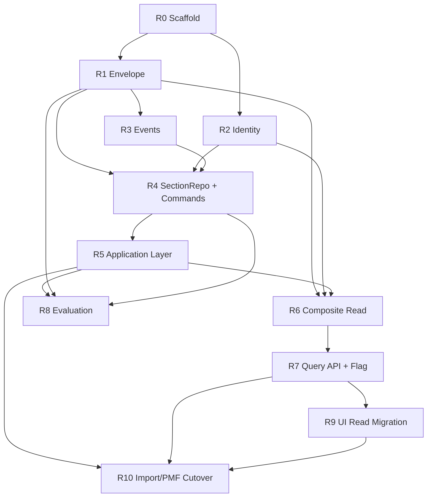
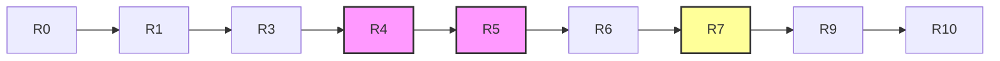
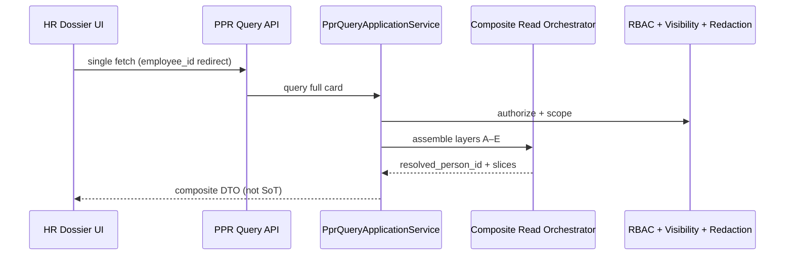

--------------------------------------------------

Document Status

Document:
WP-PR-012-ppr-implementation-roadmap

Title:
Personnel Personal Record — Phase 1 Implementation Roadmap

Type:
Architecture Work Package — Implementation Plan

Status:
In Progress — R0–R7 complete; forward-flow Applicant→Employee complete

Revision:
3

Date:
2026-07-16

Revision History:

| Rev | Date | Summary |
|-----|------|---------|
| 1 | 2026-07-15 | Initial gap analysis and R0–R10 phased roadmap |
| 2 | 2026-07-15 | Review clarifications: R1 infra-only (no MaterializePPR); MaterializePPR in R5; R4/R5 boundary; R3 event infra vs activation; R6A/R6B sub-stages; R8 additive rollup migration; DG-ReadSwitch; WP mapping fix; first coding slice R0+R1 |
| 3 | 2026-07-16 | Mark R0–R7 **COMPLETE**; forward-flow «Заявитель → Работник» **COMPLETE**; VOID HIRE / REHIRE backlog registered |

Parent:
ARCH-002 — Personnel Personal Record Architecture

Depends on:
ARCH-002, ARCH-002-IMPLEMENTATION-ROADMAP, ADR-054, WP-PR-002 (Completed), WP-PR-003 (Draft — Ready for Review), WP-PR-004 (Draft — Ready for Review), WP-PR-005 (Draft — Ready for Review), WP-PR-006 (Draft — Ready for Review), WP-PR-007 (Draft — Ready for Review), WP-PR-008 (Draft — Ready for Review), WP-PR-009 (Draft — Ready for Review), WP-PR-010 (Draft — Ready for Review), WP-PR-011 (Draft — Ready for Review)

Purpose:
Gap analysis and safe phased implementation plan for PPR Phase 1.
No code, migrations, API implementation, or business feature delivery in this WP.

--------------------------------------------------

# WP-PR-012 — PPR Phase 1 Implementation Roadmap

**Date:** 2026-07-16 (rev. 3)

---

## 0. Implementation status (2026-07-16)

### PPR phases R0–R7 — COMPLETE

| Phase | Name | Status |
|-------|------|--------|
| **R0** | Module scaffold | ✅ **Complete** |
| **R1** | Envelope persistence | ✅ **Complete** |
| **R2** | Identity + PersonRepository | ✅ **Complete** |
| **R3** | Event repository | ✅ **Complete** |
| **R4** | SectionRepository + handlers | ✅ **Complete** |
| **R5** | Application Layer (write) | ✅ **Complete** |
| **R6** | Composite read v1 | ✅ **Complete** |
| **R7** | Query API + read-switch | ✅ **Complete** |

### Forward-flow «Заявитель → Работник» — COMPLETE

```text
PPR (CANDIDATE) → intended employment → HIRE → Apply → Employee + Assignment → PPR (EMPLOYED)
```

Architectural review sign-off: 2026-07-16. Ready for commit.

ADR note: [ADR-054-NOTE-intended-employment-lifecycle](../adr/ADR-054-NOTE-intended-employment-lifecycle.md).

### Next EPICs (planned)

| EPIC | Scope | Backlog |
|------|-------|---------|
| **VOID HIRE** | Rollback hr_context, assignment, operational_status; integration test | [WP-PO-HIRE-LIFECYCLE-BACKLOG-INDEX](../personnel-orders/work-packages/WP-PO-HIRE-LIFECYCLE-BACKLOG-INDEX.md) |
| **TERMINATION / REHIRE** | hr_context sync; E2E lifecycle | same index |
| **EPIC-4** | New person_* PPR sections | [ARCH-002-IMPLEMENTATION-ROADMAP](./ARCH-002-IMPLEMENTATION-ROADMAP.md) |
| **R8–R10** | Evaluation, UI migration, Import/PMF cutover | This document §R8–R10 |

---

## 1. Purpose

### 1.1 Role of this document

Архитектурная фаза PPR завершена (WP-PR-002…011, ADR-054, ARCH-002). Перед кодированием необходим:

1. **Gap analysis** — текущее состояние vs target architecture;
2. **Phased roadmap** — безопасные независимые этапы;
3. **Dependency graph** — critical path и параллелизм;
4. **Explicit boundaries** — что создаётся / не создаётся на каждом этапе.

### 1.2 What this document IS

| Is | Description |
|----|-------------|
| Implementation plan | Sequenced phases with goals, risks, tests |
| Gap inventory | Services, repos, domain, events, tables, API, UI |
| Bridge strategy | Reuse transitional PMF/Import without big-bang rewrite |
| Test strategy outline | Contract/regression expectations per phase |

### 1.3 What this document IS NOT

| Is NOT | Reason |
|--------|--------|
| Code / DDL / migrations | Separate implementation WPs |
| New ADR | Architecture already decided |
| Business feature spec | Commands/events defined in WP-PR-008/007 |
| Sprint calendar | Out of scope per ARCH-002 roadmap |
| EPIC replacement | Complements ARCH-002-IMPLEMENTATION-ROADMAP |

### 1.4 Relationship to ARCH-002 EPICs

| ARCH-002 EPIC | WP-PR-012 phases |
|---------------|------------------|
| EPIC-1 Foundation | **R0–R5** (scaffold, envelope, repos, commands, application) |
| EPIC-4 PMF Integration | **R4, R10** (section bridge, domain expansion) |
| EPIC-6 Card Transformation | **R6, R7, R9** (read model, composite, UI migration) |
| EPIC-8 Data Migration | **R10** (cutover prep) |
| EPIC-9 Legacy Removal | **R10+** (post Phase 1) |
| EPIC-10 Identity | **R2** (identity resolution) |
| EPIC-2 Candidate | **Out of Phase 1** — parallel track later |
| EPIC-5 Orders HIRE redesign | **Out of Phase 1** — observe only |

---

## 2. Current state summary

### 2.1 Transitional architecture (as-is)

```text
Control Output Excel
  → hr_import_* staging
  → Import Profile + employee_import_profile_overrides
  → PMF workflow (education pilot → person_education / person_training)
  → HR Dossier UI (dual fetch: employee + import-card)
  → Personnel Orders apply → Employment only
```

### 2.2 What already aligns with target

| Asset | Status |
|-------|--------|
| `person_id` as PPR identifier (ADR-054) | ✅ normative |
| `person_education`, `person_training` SoT | ✅ PMF commit path |
| `personnel_record_events` append-only journal | ✅ partial (legacy types) |
| `persons` identity root + merge fields | ✅ schema exists |
| Orders → Employment boundary | ✅ no PPR section writes |
| PMF commit requires `person_id` | ✅ guard in commit service |

### 2.3 Critical gaps (blockers)

| Gap | Impact |
|-----|--------|
| No `personnel_record_metadata` / envelope | Repository infra blocked until R1; `MaterializePPR` command until R5 |
| No `app/ppr/` domain module | No command handlers |
| No repository contracts | PMF direct SQL |
| No Application Layer | No orchestration, no UoW |
| No composite read orchestrator | UI dual-fetch anti-pattern |
| No evaluation engine | No completeness rollup |
| Import card writes overrides as SoT | WP-PR-011 violation |

---

## 3. Gap analysis — 15 dimensions

### 3.1 Reusable services (keep / thin adapter)

| Service | Path | Strategy |
|---------|------|----------|
| `personnel_record_event_service` | `app/services/personnel_record_event_service.py` | Wrap as `PprEventRepository` adapter |
| `personnel_migration_commit_service` | `app/services/personnel_migration_commit_service.py` | Infra behind section commands + bridge |
| `education_migration_plugin` | `app/services/education_migration_plugin.py` | Map to section command handlers |
| `personnel_migration_domain_registry` | `app/services/personnel_migration_domain_registry.py` | Extend for new PMF domains |
| `personnel_migration_query_service` | `app/services/personnel_migration_query_service.py` | PMF workflow reads (transitional) |
| `personnel_migration_record_events_query_service` | `app/services/personnel_migration_record_events_query_service.py` | Audit/history slice |
| `personnel_migration_types` | `app/services/personnel_migration_types.py` | Error taxonomy reuse |
| `hr_import_profile_service` | `app/services/hr_import_profile_service.py` | Bootstrap read (transitional) |
| `employee_import_profile_override_service` | `app/services/employee_import_profile_override_service.py` | Transitional until cutover |
| `identity_reconciliation_service` | `app/services/identity_reconciliation_service.py` | Person BC input |
| `hr_effective_canonical_service` | `app/services/hr_effective_canonical_service.py` | `resolve_effective_person` transitional |
| `personnel_visibility_resolver_service` | `app/services/personnel_visibility_resolver_service.py` | Composite read gate |
| `access_resolver_service` | `app/services/access_resolver_service.py` | RBAC adjunct |
| `personnel_orders_apply_service` | `app/services/personnel_orders_apply_service.py` | Employment BC — unchanged |
| `personnel_orders_*` family | `app/services/personnel_orders_*.py` | Orders BC — unchanged |
| `hr_import_enroll_employee_service` | `app/services/hr_import_enroll_employee_service.py` | Saga wrapper + optional MaterializePPR |
| `hr_canonical_snapshot_service` | `app/services/hr_canonical_snapshot_service.py` | Transitional export |
| `hr_personnel_lifecycle_service` | `app/services/hr_personnel_lifecycle_service.py` | Employment lifecycle — not PPR |

### 3.2 Services to replace

| Service | Path | Violation | Target |
|---------|------|-----------|--------|
| Import card composite write | `hr_import_employee_card_service.py` | Override SoT writes | PPR commands / PMF bridge only |
| Import card composite read | same | No identity resolution, no envelope | `PprQueryApplicationService` + orchestrator |
| PMF commit as domain | `personnel_migration_commit_service.py` | Raw SQL, no command envelope | Handlers + `SectionRepository` |
| Inline employee→person resolution | `_resolve_employee_person_id` in commit | Ad-hoc | `IdentityRepository` |
| Import education profile CRUD | `hr_import_education_profile_service.py` | Parallel SoT path | Deprecate after read-switch |

### 3.3 Services to deprecate (gradual)

| Service / path | Trigger | Notes |
|----------------|---------|-------|
| `GET/PATCH/DELETE .../import-card` | EPIC-6 read-switch (DG-ReadSwitch) | Section-level or card-level TBD |
| Override SoT in dossier reads | DG-6 / EPIC-9 | Shadow-read first |
| `employee_context_id` as PMF primary entry | Person-scoped PMF stable | `person_id` on runs already exists |
| Legacy `EDUCATION_*` event names | Canonical `PPR_SECTION_*` via R5 command path | Legacy path unchanged until bridge |
| Enroll without MaterializePPR | EPIC-2/5 convergence | Document coexistence |
| UI `Promise.all` dual fetch | Single PPR query API | WP-PR-009 anti-pattern |

### 3.4 New services required

| Service | Source WP | Package suggestion |
|---------|-----------|-------------------|
| `PprCommandApplicationService` | WP-PR-009 | `app/ppr/application/` |
| `PprQueryApplicationService` | WP-PR-009 | same |
| `PprCompositeReadOrchestrator` | WP-PR-005 | `app/ppr/read/` |
| `PprLifecycleApplicationService` | WP-PR-009 | `app/ppr/application/` |
| `PprSectionApplicationService` | WP-PR-009 | same |
| `PprImportBridgeApplicationService` | WP-PR-009, WP-PR-011 | same |
| `PprMergeApplicationService` | WP-PR-011 | same (stub Phase 1) |
| `PprEvaluationApplicationService` | WP-PR-006/009 | same |
| `PprProjectionApplicationService` | WP-PR-009 | same |
| `PprIdentityApplicationService` | WP-PR-011 | same |
| Evaluation Engine (stateless) | WP-PR-006 | `app/ppr/evaluation/` |
| **Unit of Work** | WP-PR-010 | `app/ppr/infrastructure/` — contract in **R4**; application boundary in **R5** |

**Structural note:** `app/ppr/` package does not exist — greenfield scaffold required (Phase R0).

### 3.5 Missing repositories

| Contract | Target store | Current | Gap |
|----------|--------------|---------|-----|
| `PprRepository` | `personnel_record_metadata` | Missing table + repo | **Blocker** |
| `PersonRepository` | `persons` cadre subset | Scattered SQL | No abstraction, no version |
| `IdentityRepository` | read bridges | Partial in services | No unified contract |
| `SectionRepository` | `person_*` | PMF raw SQL | No generic contract |
| `PprEventRepository` | `personnel_record_events` | `emit_personnel_record_event()` | No interface, no idempotency |
| `EvaluationSnapshotRepository` | envelope rollup (R8 columns) | Missing | No completeness persist until R8 |

### 3.6 Missing domain objects

| Object | Spec | Status |
|--------|------|--------|
| Aggregate envelope | WP-PR-004, WP-PR-010 | Missing — no table |
| Section record (domain-shaped) | WP-PR-010 | ORM exists; no domain types |
| Command envelope | WP-PR-008 | Missing — `command_id`, `expected_version` |
| NOT_MATERIALIZED state | WP-PR-004 §3.4 | Logical only |
| Completeness/readiness snapshot | WP-PR-006 | Missing |
| Policy bundle runtime | WP-PR-003 | Doc only |
| Candidate entity | EPIC-2 | Out of Phase 1 |

### 3.7 Missing command handlers

| Command | Phase 1 priority | Current |
|---------|------------------|---------|
| **`MaterializePPR`** | **Must** — handler in **R5** (uses `PprRepository` from R1) | Not implemented |
| **`StartCollection`**, **`ActivatePPR`** | **Must** | Not implemented |
| `AddSectionRecord` / update / void / supersede | **Must** | PMF commit only (no envelope) |
| **`UpdateGeneralSection`** | Should | Not implemented |
| **`UpdateHrRelationshipContext`** | Should | Not implemented |
| **`RecomputeCompleteness`** | Should | Not implemented |
| `ArchivePPR`, `RestorePPR` | Optional Phase 1 | Not implemented |
| `ApplyPersonMerge` (PPR side) | EPIC-10 | Not implemented |
| `LinkEvidence`, `VerifyRecord` | Later | Not implemented |

### 3.8 Missing query services

| Component | Spec | Current substitute |
|-----------|------|-------------------|
| `PprCompositeReadOrchestrator` | WP-PR-005 | `get_employee_import_card` + UI merge |
| `PprQueryApplicationService` | WP-PR-009 | None |
| Identity resolution (unified) | WP-PR-005 §3 | Ad-hoc PMF + UI |
| PPR registry summary | ADR-054 B-6 | None |
| Evaluation snapshot reader | WP-PR-006 | None |
| Read-after-write invalidation | WP-PR-009 | None |

### 3.9 Missing events (vs WP-PR-007)

**Implemented (legacy):** `EDUCATION_MIGRATED`, `EDUCATION_VOIDED`, `EDUCATION_SUPERSEDED` via PMF.

**Not implemented:**

| Category | Examples |
|----------|----------|
| Envelope | `PPR_CREATED`, `PPR_ENVELOPE_UPDATED` |
| Lifecycle | `PPR_LIFECYCLE_CHANGED`, `PPR_ACTIVATED`, `PPR_ARCHIVED`, … |
| Canonical section | `PPR_SECTION_UPDATED` (non-legacy name) |
| Derived | `PPR_COMPLETENESS_CHANGED`, `PPR_READINESS_CHANGED` |
| Merge | `PPR_MERGED`, reconciliation events |
| Metadata | `correlation_id`, `command_id` columns — TBD |

**External (keep separate):** `employee_events`, `hr_personnel_change_events`.

### 3.10 Tables that fit (reuse)

| Table | Role | Assessment |
|-------|------|------------|
| `persons` | Identity ROOT + PPR-GENERAL subset | ✅ Fit |
| `person_education` | PPR-EDUCATION SoT | ✅ Fit |
| `person_training` | PPR-TRAINING SoT | ✅ Fit |
| `personnel_record_events` | AUDIT journal | ✅ Fit — extend additively |
| `personnel_migration_*` | PMF workflow TEMPORARY | ✅ Transitional |
| `employees`, `person_assignments` | Employment BC | ✅ OUT of PPR |
| `employee_events` | Employment journal | ✅ External |
| `hr_import_*`, `employee_import_profile_overrides` | Import TEMPORARY | ✅ Transitional |

### 3.11 Tables to add (later / phased)

| Table | When | Priority |
|-------|------|----------|
| **`personnel_record_metadata`** (minimal lifecycle/version) | **Phase R1** | **Must** — envelope infra |
| Envelope rollup columns (`completeness`, `readiness`, `evaluated_at`, `policy_version`) | **Phase R8** | Additive migration — not R1 |
| Command idempotency store | Phase R4 | Should |
| `person_qualifications`, `person_awards`, … | EPIC-4+ | Per WP-PR-003 catalog |
| `person_documents` (evidence) | EPIC-4 | Evidence links |
| Read model cache | Optional | TBD |
| Policy rule store | With evaluation | WP-PR-006 |

**Rejected Phase 1:** `personnel_personal_records` / `personal_record_id`.

### 3.12 APIs to keep

| API | Path | Notes |
|-----|------|-------|
| PMF router | `app/api/personnel_migration_router.py` | Thin adapter after refactor |
| Personnel orders | `app/directory/personnel_orders_routes.py` | Employment BC |
| HR import (non-card) | `app/directory/hr_import_routes.py` | Bootstrap pipeline |
| Personnel admin | `app/api/personnel_admin_router.py` | Separate from PPR commands |
| Employees directory | `app/directory/employees_routes.py` | Employment read |
| PMF event read endpoints | `personnel_migration_router.py` | Until unified PPR query |

### 3.13 APIs to replace / add

| Endpoint | Issue | Target |
|----------|-------|--------|
| `GET/PATCH/DELETE .../import-card` | Fat composite + override writes | PPR query API + command path |
| PMF `commit` internal | Bypasses command envelope | `PprImportBridgeApplicationService` |
| Import education profile handlers | Parallel SoT | Deprecate post read-switch |
| **(new)** PPR query API | Missing | `PprQueryApplicationService` facade |
| **(new)** PPR command API | Missing | `PprCommandApplicationService` facade |

### 3.14 UI reusable

| Component | Path |
|-----------|------|
| PMF wizard shell | `MigrationWizardShell.tsx`, `MigrationSessionPageClient.tsx` |
| Migration API client | `personnelMigrationApi.client.ts` |
| Card section shells | `EmployeeImportCardSection.tsx`, operational sections |
| General section shell | `EmployeeCardGeneralSection.tsx` |
| Terminology helpers | `personnelCardTerminology.ts`, `employeeCardNav.ts` |
| Import field editors | `ImportProfileCardSections.tsx` — partial (field mapping) |

### 3.15 UI transitional

| Component | Path | Issue |
|-----------|------|-------|
| `EmployeeImportCard2PageClient.tsx` | dual `Promise.all` fetch | WP-PR-005/009 anti-pattern |
| `/card` and `/import-card` routes | `employee_id` only | Transitional nav |
| `importApi.client.ts` | override PATCH | Wrong write path |
| `ImportEducationProfileCardModal.tsx` | Import Profile edit | Not PPR SoT |
| `MigrationHomePageClient.tsx` | employee-centric entry | Transitional |

---

## 4. Implementation strategy

### 4.1 Core principles

| ID | Principle |
|----|-----------|
| **IMP-1** | **Strangler fig** — bridge PMF/Import; do not big-bang replace |
| **IMP-2** | **Dual-path until read-switch** — configuration per DG-ReadSwitch before R7 |
| **IMP-3** | **Commands behind existing APIs** — PMF router stays; internals change |
| **IMP-4** | **Tests before refactor** — PMF regression harness first |
| **IMP-5** | **Envelope infra before command path** — R1 repository before R5 handlers |
| **IMP-6** | **No business features in scaffold phases** — infrastructure only |
| **IMP-7** | **Orders/Employment untouched** in foundation slice R0–R5 |

### 4.2 Phase naming and program scope

Phases **R0–R10** are **roadmap phases** — independently deliverable with clear exit criteria.

| Term | Meaning |
|------|---------|
| **PPR Phase 1 implementation program** | Full ARCH-002 foundation through cutover prep — all of R0–R10 |
| **Roadmap phases R0–R10** | Sequenced delivery units in this document |
| **Foundation slice** | **R0–R5** — scaffold, envelope infra, repos, domain handlers, Application Layer write path |
| **Read migration slice** | **R6–R9** — composite read, query API, evaluation (R8 parallel), UI read migration |
| **Cutover preparation** | **R10** — Import/PMF write guard and promotion hardening |

**Normative:** R6–R10 are **not** called "foundation" — only R0–R5 is the foundation slice.

### 4.3 Unit of Work ownership

| Phase | UoW responsibility |
|-------|-------------------|
| **R4** | UoW **contract** + infrastructure **primitives** (track dirty entities, commit/rollback hooks) |
| **R5** | Application **transaction boundary**: mutation + event append + commit; post-commit hooks for eval/projection **outside** mutation UoW |

---

## 5. Phase roadmap

### R0 — PPR module scaffold & test harness

| Attribute | Value |
|-----------|-------|
| **Goal** | Create `app/ppr/` package structure without business behavior |
| **Creates** | Package layout: `domain/`, `application/`, `infrastructure/`, `read/`, `evaluation/`; shared types; test fixtures |
| **Does NOT create** | Handlers, repositories impl, API routes, UI changes, migrations |
| **Reuses** | Existing `tests/test_pmf_*.py` as regression baseline |
| **Tests** | Package import smoke; directory contract tests; PMF regression unchanged (green) |
| **Risks** | Premature abstraction — keep scaffold minimal |
| **Dependencies** | None (entry point) |
| **Complexity** | **S** (Small) |

---

### R1 — Envelope persistence infrastructure (`personnel_record_metadata`)

| Attribute | Value |
|-----------|-------|
| **Goal** | Envelope **persistence infrastructure** per WP-PR-010 — repository-level only; **not** domain command execution |
| **Creates** | DDL migration `personnel_record_metadata` (**minimal** lifecycle/version columns only); minimal ORM model; `PprRepository` contract; SQLAlchemy adapter; `existsEnvelope`, `loadEnvelope`, `insertEnvelope`, `updateEnvelope` with optimistic version |
| **Does NOT create** | `MaterializePPR` handler or any domain command; `PPR_CREATED` emission; UI; evaluation rollup columns; Application Layer |
| **Reuses** | `persons` FK; existing `person_*` rows (envelope insert does not require or block on section rows) |
| **Tests** | Insert envelope; duplicate envelope protection (repository-level); load existing envelope; optimistic version conflict; existing `person_*` rows do not block envelope insertion |
| **Risks** | Column catalog drift vs WP-PR-003 — lock **minimal** R1 column set only |
| **Dependencies** | R0 |
| **Complexity** | **M** (Medium) |

**Exit criteria:** `PprRepository` can create/load/update a minimal envelope for an existing `person_id`, including optimistic version enforcement.

**Normative:** repository duplicate protection ≠ command `command_id` idempotency (latter is R5 Application Layer).

---

### R2 — Identity resolution & PersonRepository

| Attribute | Value |
|-----------|-------|
| **Goal** | Unified `employee_id` → `person_id` → survivor resolution (WP-PR-005, WP-PR-011) |
| **Creates** | `IdentityRepository` contract + adapter; `PersonRepository` (cadre subset); resolution middleware hook for application layer |
| **Does NOT create** | Person BC merge commands; UI route change |
| **Reuses** | `identity_reconciliation_service`, `hr_effective_canonical_service`, `employees.person_id` |
| **Tests** | Merge redirect; null `person_id` fail-closed; survivor resolution |
| **Risks** | Identity drift if resolution bypassed in legacy paths |
| **Dependencies** | R0 (parallel with R1 after R0) |
| **Complexity** | **M** |

**Exit criteria:** Single resolution function used by all new PPR entry points.

---

### R3 — Event repository infrastructure

| Attribute | Value |
|-----------|-------|
| **Goal** | Event **infrastructure** per WP-PR-010 — contract and adapter; activation deferred to R4/R5 |
| **Creates** | `PprEventRepository` contract; adapter over `personnel_record_events`; canonical event type support; metadata/idempotency primitives (`existsByCorrelation`); legacy→canonical **mapping contract** (not wired to PMF path yet) |
| **Does NOT create** | Dual-emit from legacy PMF commit path; full WP-PR-007 catalog emission; outbox/delivery; `PPR_CREATED` from production paths |
| **Reuses** | `personnel_record_event_service.py` as adapter base |
| **Tests** | Append-only invariant; `existsByCorrelation`; mapping contract unit tests; **no** second canonical event from unchanged PMF path |
| **Risks** | `domain_code` NOT NULL legacy constraint (WP-PR-007 OQ-10); double-emission if activated too early |
| **Dependencies** | R0, R1 |
| **Complexity** | **M** |

**Normative sequence:**

| Stage | Responsibility |
|-------|----------------|
| **R3** | Supplies event infrastructure only |
| **R4/R5** | Activate canonical event emission from **command path** |
| **Transitional** | Legacy PMF path keeps `EDUCATION_*` until R5 bridge; old path **must not** independently emit second canonical event for same mutation |

**Exit criteria:** `PprEventRepository` contract tested; mapping contract defined; PMF production path unchanged.

---

### R4 — SectionRepository & domain handlers (section mutations)

| Attribute | Value |
|-----------|-------|
| **Goal** | Domain-shaped section persistence; PMF parity at domain/infrastructure level — **no** Application orchestration |
| **Creates** | Domain-shaped section records; `SectionRepository` contract + adapter; section mutation **domain handlers**: `AddSectionRecord`, `UpdateSectionRecord`, `VoidSectionRecord`, `SupersedeSectionRecord`; command envelope **types**; **UoW contract** + infrastructure implementation primitives |
| **Does NOT create** | Application Layer services; authorization gate; `command_id` idempotency orchestration; PMF bridge wiring; `MaterializePPR`; lifecycle handlers; API changes; canonical event emission activation (wired in R5) |
| **Reuses** | `personnel_migration_commit_service` logic → refactored behind handlers; `education_migration_plugin` |
| **Tests** | PMF regression parity (`test_pmf_2_commit_engine.py`); supersede atomicity; UoW primitive unit tests; envelope-required gate for new mutations |
| **Risks** | Behavioral regression in PMF pilot — parity tests critical |
| **Dependencies** | R1, R2, R3 — **R4 blocked until R2 complete** |
| **Complexity** | **L** (Large) |

**Exit criteria:** Section handlers + `SectionRepository` pass PMF parity tests at domain/infrastructure level; UoW primitives available for R5.

**Normative:** R4 owns **domain/infrastructure** — not command orchestration (R5).

---

### R5 — Application Layer (write path)

| Attribute | Value |
|-----------|-------|
| **Goal** | Application orchestration per WP-PR-009; transaction boundary; PMF bridge; lifecycle commands including **`MaterializePPR`** |
| **Creates** | `PprCommandApplicationService`, `PprSectionApplicationService`, `PprImportBridgeApplicationService`, `PprLifecycleApplicationService`; **domain handler `MaterializePPR`** (uses `PprRepository` from R1); handlers `StartCollection`, `ActivatePPR`, `UpdateGeneralSection`; authorization-before-handler contract; identity resolution integration; `command_id` idempotency; application transaction boundary (mutation + event append + commit); post-commit hook registration (eval/projection — not in mutation UoW) |
| **Does NOT create** | REST redesign; evaluation engine; composite read; rollup columns (R8) |
| **Reuses** | R1–R4 repositories, handlers, UoW primitives; `personnel_migration_router` as thin adapter |
| **Tests** | See **R5 MaterializePPR tests** below; Application integration; UoW atomicity (mutation + event); PMF bridge delegation |
| **Risks** | Fat application service — split per WP-PR-009 |
| **Dependencies** | R1, R2, R3, R4 |
| **Complexity** | **L** |

#### R5 — MaterializePPR ownership (normative)

| Rule | Specification |
|------|---------------|
| **MPR-1** | Domain handler `MaterializePPR` **created in R5** — not R1 |
| **MPR-2** | Handler uses `PprRepository` from R1 |
| **MPR-3** | `command_id` idempotency ensured by Application Layer / UoW path — not repository duplicate check alone |
| **MPR-4** | Repository duplicate envelope protection ≠ command idempotency |
| **MPR-5** | `MaterializePPR` emits `PPR_CREATED` atomically via `PprEventRepository` (R3) in same UoW |

#### R5 — mandatory MaterializePPR tests

| Test | Expected |
|------|----------|
| First `MaterializePPR` | Creates envelope + `PPR_CREATED` |
| Repeated same `command_id` | Idempotent result — no duplicate envelope/event |
| Second different command, already materialized | Does not create duplicate envelope/event |
| Existing `person_education` / `person_training` | Rows preserved — envelope only |
| Unresolved `person_id` | Fail closed |
| Mutation + event append | Atomic in one UoW |

**Exit criteria:** All new PPR writes go through Application Layer; PMF router delegates to bridge; `MaterializePPR` operational.

---

### R6 — Query layer & composite read v1

| Attribute | Value |
|-----------|-------|
| **Goal** | Replace `get_employee_import_card` assembly with orchestrator (WP-PR-005) — two internal sub-stages |
| **Creates** | `PprCompositeReadOrchestrator`; `PprQueryApplicationService`; Layers A–E assembly |
| **Does NOT create** | Full 20+ sections; registry; export; write path |
| **Reuses** | Employment readers; PMF event history; import profile transitional overlay; visibility resolver |
| **Risks** | Dual-read drift — DG-ReadSwitch configuration required before R7 |
| **Dependencies** | See sub-stages below |
| **Complexity** | **L** |

#### R6A — Contracts and assembler skeleton

| Attribute | Value |
|-----------|-------|
| **Sub-stage** | R6A (internal — not separate roadmap phase) |
| **Dependencies** | **R1 + R2** |
| **Creates** | Read contracts; DTOs; identity + envelope layers; `NOT_MATERIALIZED` response shape; Employment reader interfaces; orchestrator skeleton |
| **Does NOT create** | Command-backed authoritative section reads; canonical audit integration; read-after-write semantics |
| **Parallel** | May start after R1+R2 complete — while R3/R4/R5 in progress |

#### R6B — Authoritative composite integration

| Attribute | Value |
|-----------|-------|
| **Sub-stage** | R6B (internal — not separate roadmap phase) |
| **Dependencies** | **R5** (hard gate) |
| **Creates** | Command-backed PPR section reads; canonical audit/history slices; read-after-write semantics; Application Layer integration |
| **Tests** | Identity resolution in response; `NOT_MATERIALIZED` mode; merge redirect; authoritative section slices; no override write |
| **Exit gate** | **Phase R6 complete only after R5** |

**Exit criteria (R6):** Full orchestrator returns `resolved_person_id` + authoritative slices when R6B complete; skeleton usable for early contract tests after R6A.

---

### R7 — PPR query API & read-switch configuration

| Attribute | Value |
|-----------|-------|
| **Goal** | Single query endpoint; read-switch between legacy and PPR composite path (EPIC-6) |
| **Creates** | New query routes (`person_id` canonical, `employee_id` redirect); **section-level or card-level read-switch configuration** (granularity per **DG-ReadSwitch**); shadow-read comparison logging |
| **Does NOT create** | Command API surface (internal first); UI rewrite; fixed `ppr_read_<section>` flag naming — implementation choice deferred |
| **Reuses** | R6 orchestrator; existing auth middleware |
| **Tests** | Read-switch off = legacy path; on = PPR path; response schema contract |
| **Risks** | Breaking HR Dossier during shadow period |
| **Dependencies** | R6 (R6B complete — full orchestrator) |
| **Complexity** | **M** |

---

### R8 — Evaluation engine v1

| Attribute | Value |
|-----------|-------|
| **Goal** | Post-commit completeness/readiness per WP-PR-006 |
| **Creates** | **Additive migration** for envelope rollup columns (`completeness`, `readiness`, `evaluated_at`, `policy_version` per WP-PR-003); stateless evaluation engine; `EvaluationSnapshotRepository`; `PprEvaluationApplicationService`; `PPR_COMPLETENESS_CHANGED` event; policy seed (education/training) |
| **Does NOT create** | Full explainability tree; Orders-based readiness; rollup columns in R1 migration |
| **Reuses** | R1 minimal envelope (extended additively); section repos (R4); post-commit hook from R5 |
| **Tests** | Eval does not rollback mutation; import overlay excluded; stale snapshot flag |
| **Risks** | Policy drift vs WP-PR-003 — `policy_version` on envelope |
| **Dependencies** | R1 (minimal envelope), R4, R5 |
| **Complexity** | **L** |

**Normative — rollup schema ownership:**

| Phase | Envelope columns |
|-------|------------------|
| **R1** | Minimal lifecycle + version only |
| **R8** | **Additive migration** for evaluation rollup columns |

**Parallel with:** R6B/R7 (after R5 complete) — not on read-switch critical path.

---

### R9 — UI migration (read path)

| Attribute | Value |
|-----------|-------|
| **Goal** | Replace dual-fetch with single PPR query API (WP-HR-CARD-002) |
| **Creates** | Updated `EmployeeImportCard2PageClient` data layer; PPR API client; read-switch aware section rendering |
| **Does NOT create** | Person-centric URL (OQ-1); new section editors for all domains |
| **Reuses** | Section shell components; operational sections; PMF wizard unchanged |
| **Tests** | E2E card load; flag toggle; degraded NOT_MATERIALIZED display |
| **Risks** | UI regression; employee_id route retained transitional |
| **Dependencies** | R7 |
| **Complexity** | **M** |

---

### R10 — Import/PMF cutover preparation

| Attribute | Value |
|-----------|-------|
| **Goal** | Disable override writes; deprecate import-card PATCH; PMF as sole write gateway for pilot sections |
| **Creates** | Write guard on `save_employee_import_card`; migration report (Import vs PPR diff); enroll saga MaterializePPR hook; training PMF domain enablement |
| **Does NOT create** | Full EPIC-9 legacy removal; all WP-PR-003 sections |
| **Reuses** | R5 bridge; R9 read path; existing import upload pipeline |
| **Tests** | PATCH import-card rejected/redirected; PMF-only write for education/training; promotion event on commit only |
| **Risks** | Operators relying on Import Profile edit — comms + training |
| **Dependencies** | R5, R7, R9 |
| **Complexity** | **L** |

---

## 6. Phase summary table

| Phase | Name | Complexity | Depends on | Parallel after | Status |
|-------|------|------------|------------|----------------|--------|
| **R0** | Module scaffold | S | — | — | ✅ Complete |
| **R1** | Envelope | M | R0 | R0 | ✅ Complete |
| **R2** | Identity + PersonRepository | M | R0 | R0 | ✅ Complete |
| **R3** | Event repository | M | R0, R1 | R1 | ✅ Complete |
| **R4** | SectionRepository + handlers | L | R1, R2, R3 | R3 | ✅ Complete |
| **R5** | Application Layer (write) | L | R1–R4 | R4 | ✅ Complete |
| **R6** | Composite read v1 (R6A+R6B) | L | R1+R2 (R6A); **R5 (R6B exit)** | R1+R2 for R6A; R5 for R6B | ✅ Complete |
| **R7** | Query API + read-switch | M | R6 complete | R6 | ✅ Complete |
| **R8** | Evaluation v1 | L | R1, R4, R5 | R5 | Planned |
| **R9** | UI migration (read) | M | R7 | R7 | Planned |
| **R10** | Import/PMF cutover prep | L | R5, R7, R9 | R9 | Planned |

---

## 7. Dependency graph

### 7.1 Mermaid — phase dependencies



### 7.2 Parallel workstreams

| After phase | Can run in parallel |
|-------------|---------------------|
| **R0 complete** | **R1 + R2** |
| **R1 + R2 complete** | R3; **R6A** (contracts/skeleton) |
| **R3 complete** | R4 (blocked until **R2** complete) |
| **R4 complete** | R5 |
| **R5 complete** | **R6B** finish; R8; R7 prep |
| **R6 complete** (R6B) | R7 |
| **R7 complete** | R9 |
| **R9 complete** | R10 |

**Not parallelizable:** R4 before R2 complete; R5 before R4; **R6B before R5**; R6 exit before R5; R7 before R6 complete.

### 7.3 Critical path

```text
R0 → R1 → R3 → R4 → R5 → R6 → R7 → R9 → R10
```

**Parallel (off critical path):**

- **R2** runs parallel to R1 (after R0); **R4 blocked until R2** complete
- **R6A** (contracts/skeleton) may progress after R1+R2 — does not satisfy R6 exit
- **R6 exit gate requires R5** (R6B)
- **R8** parallel to R6/R7 after R5 — not on read-switch critical path

**Critical path length:** 9 phases on main chain; R2 merges into R4 dependency.

**Bottleneck:** **R4** (PMF commit refactor with regression parity) — highest regression risk.

### 7.4 Critical path diagram



---

## 8. Test strategy by phase

| Phase | Test types | Key suites |
|-------|------------|------------|
| R0 | Smoke, import | Package structure; `test_pmf_*` green |
| R1 | Repository contract | Envelope CRUD, version conflict |
| R2 | Unit, integration | Identity resolution matrix |
| R3 | Contract | Append-only; `existsByCorrelation`; mapping contract — **no PMF path change** |
| R4 | **Regression critical** | `test_pmf_2_commit_engine.py` parity; supersede atomic; UoW primitives |
| R5 | Integration | MaterializePPR suite; UoW atomicity; `command_id` idempotency |
| R6 | Contract | R6A skeleton; R6B authoritative slices; `resolved_person_id` |
| R7 | API contract | Read-switch configuration matrix (DG-ReadSwitch) |
| R8 | Unit | Policy eval; no rollback on failure |
| R9 | E2E | Card load single API |
| R10 | Integration, E2E | Write guard; cutover report |

### 8.1 Non-negotiable regression gates

| Gate | Before phase |
|------|--------------|
| PMF commit parity tests green | R4 merge |
| PMF API tests green | R5 deploy |
| No import-card data loss | R10 flag on |

---

## 9. Risk register (implementation)

| Risk | Phase | Mitigation |
|------|-------|------------|
| PMF behavioral regression | R4, R5 | Parity tests; feature flag on commit path |
| Dual-read inconsistency | R6, R7, R9 | Shadow-read logging; DG-ReadSwitch configuration |
| Envelope column creep | R1 | Minimal column set; WP-PR-003 alignment review |
| Identity resolution bypass | R2, R6 | Fail-closed; lint/grep for direct `employee_id` writes |
| Import override dependency | R10 | Gradual PATCH disable; operator comms |
| Scope creep (Candidate, HIRE) | All | Explicit out-of-scope per phase |
| God module in `app/ppr/` | R0, R5 | Package boundaries per WP-PR-009 |
| Event double-emission | R3, R5 | R3 infra only; canonical emit activated in R4/R5 command path |
| UI big-bang | R9 | Read path only first; writes still PMF |
| Temporary becoming permanent | R10 | Cutover criteria in ARCH-002 EPIC-9 |

---

## 10. Decision gates (implementation)

| Gate | Decision needed | Blocks |
|------|-----------------|--------|
| **DG-0** | Approve WP-PR-012 roadmap | All implementation |
| **DG-3** | OAD-8 Phase 1 section scope | R8 policy seed; R10 PMF domains |
| **DG-1** | Closed (Person-root) | — |
| **DG-2** | Candidate representation | EPIC-2 — out of Phase 1 |
| **DG-ReadSwitch** | Per-section vs full-card read-switch granularity | **R7** implementation |
| Envelope minimal column catalog | WP-PR-003 § envelope lifecycle fields | R1 migration |
| Envelope rollup column catalog | WP-PR-003 § rollup fields | R8 additive migration |

---

## 11. Out of scope — PPR Phase 1 program (deferred items)

| Item | Deferred to |
|------|-------------|
| Candidate lifecycle (EPIC-2) | Separate track |
| HIRE Person-first (OAD-5) | EPIC-5 |
| Control Output derived export (OAD-4) | EPIC-7 |
| Full section catalog (20+ sections) | EPIC-4 incremental |
| Legacy Import removal (EPIC-9) | Post read-switch stable |
| Merge reconciliation (full) | EPIC-10 |
| Person-centric URL | OQ-1 |
| Kafka/Rabbit/outbox | Infrastructure WP |
| Evidence document migration | OQ-8 |

---

## 12. Deliverables checklist (PPR Phase 1 program complete)

| # | Deliverable | Phase |
|---|-------------|-------|
| 1 | `app/ppr/` module with domain/application/infrastructure/read | R0 |
| 2 | `personnel_record_metadata` (minimal) + `PprRepository` | R1 |
| 3 | `IdentityRepository` + `PersonRepository` | R2 |
| 4 | `PprEventRepository` + mapping contract (activation in R5) | R3 |
| 5 | `SectionRepository` + section domain handlers + UoW primitives | R4 |
| 6 | Application Layer + `MaterializePPR` | R5 |
| 7 | `PprCompositeReadOrchestrator` (R6A+R6B) | R6 |
| 8 | PPR query API + read-switch configuration | R7 |
| 9 | Evaluation v1 + additive rollup migration | R8 |
| 10 | UI single-fetch read path | R9 |
| 11 | Import write guard + cutover prep | R10 |
| 12 | PMF regression suite green throughout | All |

---

## 13. Mapping to implementation WPs

| WP-ID | Title | Roadmap phase | Notes |
|-------|-------|---------------|-------|
| WP-PR-012-01 | Module scaffold | **R0** | Package layout only |
| WP-PR-012-02 | Envelope persistence | **R1** | Repository infra — no MaterializePPR |
| WP-PR-012-03 | Identity repositories | **R2** | IdentityRepository + PersonRepository |
| WP-PR-012-04 | Event repository | **R3** | Infra + mapping contract — no PMF dual-emit |
| WP-PR-012-05 | SectionRepository + domain handlers | **R4** | UoW primitives; no Application orchestration |
| WP-PR-012-06 | Application Layer + MaterializePPR | **R5** | Write path; PMF bridge; lifecycle commands |
| WP-PR-012-07 | Composite read | **R6** | R6A skeleton + R6B integration |
| WP-PR-012-08 | Query API + read-switch | **R7** | DG-ReadSwitch required |
| WP-PR-012-09 | Evaluation v1 | **R8** | Additive rollup migration |
| WP-PR-012-10 | UI read migration | **R9** | Single-fetch card |
| WP-PR-012-11 | Cutover preparation | **R10** | Import/PMF write guard |
| WP-PR-012-12 | Cross-phase regression & contract tests | **All** | Continuous harness — not a feature phase |

**Normative:** one implementation WP maps to **one** roadmap phase (WP-PR-012-12 spans all as test track only).

---

## 14. Consistency check

| Document | Check | Status |
|----------|-------|--------|
| **ARCH-002** | INV-1…9; transitional dual-path; no Variant C | ✅ |
| **ARCH-002-ROADMAP** | EPIC alignment; phased migration | ✅ |
| **ADR-054** | Person-root; no `personal_record_id` | ✅ |
| **WP-PR-002** | Boundary matrix; PMF gateway; tables IN/OUT | ✅ |
| **WP-PR-004** | Lifecycle; MaterializePPR; termination ≠ archive | ✅ |
| **WP-PR-005** | Composite read; identity resolution | ✅ |
| **WP-PR-006** | Eval post-commit; import excluded | ✅ |
| **WP-PR-007** | Event taxonomy; canonical emit from command path (R5) | ✅ |
| **WP-PR-008** | Command catalog priorities | ✅ |
| **WP-PR-009** | Application services list | ✅ |
| **WP-PR-010** | Repository contracts | ✅ |
| **WP-PR-011** | Integration boundaries; PMF transitional | ✅ |

| Constraint | Status |
|------------|--------|
| No code in this WP | ✅ |
| No new ADR | ✅ |
| No migration scripts | ✅ |
| Prior WP/ADR unchanged | ✅ |

---

## 15. Mermaid — target write path (post R5)

```mermaid
sequenceDiagram
  participant API as API Adapter
  participant App as PPR Application Layer
  participant Dom as Domain Handler
  participant Repo as Repositories
  participant UoW as Unit of Work
  participant PMF as PMF Workflow

  PMF->>API: commit request
  API->>App: PprImportBridgeApplicationService
  App->>App: identity resolve
  App->>Dom: AddSectionRecord / etc.
  Dom->>Repo: SectionRepository + PprEventRepository
  App->>UoW: mutation + event append + commit
  Note over App,UoW: Eval/projection post-commit — outside mutation UoW
  Note over App: No direct SQL; no override write
```

---

## 16. Mermaid — target read path (post R7)



---

## 17. First approved implementation slice

**Recommended first coding task** after DG-0 approval of WP-PR-012 Rev 2:

### Scope: R0 + R1 only

| In scope | Out of scope |
|----------|--------------|
| `app/ppr/` minimal package scaffold | Domain commands |
| `personnel_record_metadata` migration (minimal columns) | `MaterializePPR` handler |
| Minimal ORM model | API routes |
| `PprRepository` contract | UI changes |
| SQLAlchemy adapter | PMF refactor |
| Repository contract tests | Event taxonomy migration beyond compile-time interfaces |
| | Application Layer |
| | Behavior change in production paths |

### Deliverables

1. Package directories: `domain/`, `application/`, `infrastructure/`, `read/`, `evaluation/` (empty/minimal `__init__` only).
2. Alembic migration: `personnel_record_metadata` — lifecycle state, version, `person_id` FK, audit timestamps (minimal set per WP-PR-003 envelope lifecycle — **not** rollup columns).
3. `PprRepository` interface per WP-PR-010 §4.2.
4. SQLAlchemy adapter implementation.
5. Tests: insert; duplicate protection; load; optimistic version conflict; envelope insert with pre-existing `person_*` rows.

### Exit gate (before R2 starts)

| Criterion | Required |
|-----------|----------|
| Migration upgrades/downgrades cleanly | ✅ |
| Repository contract tests green | ✅ |
| Existing `test_pmf_*` suite unchanged (green) | ✅ |
| Orders/import production paths unchanged | ✅ |
| No new runtime behavior in PMF/orders/import | ✅ |

**Normative:** this slice is the basis for the next **separate coding task** — not combined with R2+ in one PR.

---

## References

- [ARCH-002 — Personnel Personal Record Architecture](./ARCH-002-personnel-personal-record-architecture.md)
- [ARCH-002-IMPLEMENTATION-ROADMAP](./ARCH-002-IMPLEMENTATION-ROADMAP.md)
- [ADR-054 — Personnel Personal Record Aggregate Model](../adr/ADR-054-personnel-personal-record-aggregate-model.md)
- [WP-PR-002 — Aggregate Boundary Specification](./WP-PR-002-aggregate-boundary-specification.md)
- [WP-PR-003 — Section Catalog & Completeness Model](./WP-PR-003-section-catalog-and-completeness-model.md)
- [WP-PR-004 — PPR Lifecycle & State Machine](./WP-PR-004-ppr-lifecycle-and-state-machine.md)
- [WP-PR-005 — Logical Read Model & Composite Projection](./WP-PR-005-logical-read-model-and-composite-projection.md)
- [WP-PR-006 — Completeness & Readiness Evaluation Engine](./WP-PR-006-completeness-and-readiness-evaluation-engine.md)
- [WP-PR-007 — PPR Event Taxonomy & Change Model](./WP-PR-007-ppr-event-taxonomy-and-change-model.md)
- [WP-PR-008 — Command Model & Mutation Contracts](./WP-PR-008-command-model-and-mutation-contracts.md)
- [WP-PR-009 — Application Service Layer](./WP-PR-009-application-service-layer.md)
- [WP-PR-010 — Persistence Model & Repository Contracts](./WP-PR-010-persistence-model-and-repository-contracts.md)
- [WP-PR-011 — Integration Architecture & Bounded Context Interaction](./WP-PR-011-integration-architecture-and-bounded-context-interaction.md)

---

*End of WP-PR-012*
