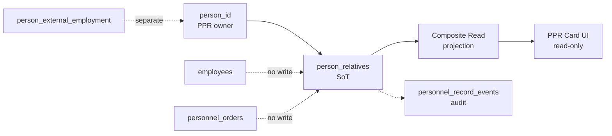

--------------------------------------------------

Document Status

Document:
WP-PR-P4-001-person-relatives-ppr-family

Title:
Person Relatives — PPR-FAMILY Section (EPIC-4)

Type:
Architecture Work Package — Implementation Specification

Status:
Draft — Ready for Review

Revision:
2

Date:
2026-07-16

Parent:
EPIC-4 — PMF Integration / Person-owned section expansion (ARCH-002)

Depends on:
ADR-054, WP-PR-002 (Completed), WP-PR-003 (Draft — Ready for Review), WP-PR-008…011, WP-PR-012 (R0–R7 Complete), ADR-047 appendix §2.2 (form §13)

Purpose:
Normative specification for the first new person_* section in EPIC-4 — PPR-FAMILY
(person_relatives). No code, DDL, migrations, API, or UI implementation in this WP.

--------------------------------------------------

# WP-PR-P4-001 — Person Relatives (PPR-FAMILY)

**Date:** 2026-07-16 (rev. 2)

---

## Revision History

| Rev | Date | Summary |
|-----|------|---------|
| 1 | 2026-07-16 | Initial WP: domain model, boundaries, Query API contract, UI sketch, PMF assessment |
| 2 | 2026-07-16 | Architectural review pass: simplified cadre-only model; `organization_name`; address comparison; explicit acceptance criteria; aggregate boundary reaffirmation |

---

## 1. Purpose

### 1.1 Goal

Реализовать первую **новую** person-owned секцию EPIC-4 — **`PPR-FAMILY`** (`person_relatives`) — как полнофункциональный шаблон для последующих `person_*` секций:

- typed Source of Truth на `person_id`;
- command write path через Application Layer;
- composite read slice;
- read-only UI в личной карточке;
- canonical audit в `personnel_record_events`.

Закрыть **GAP §13** официальной формы личного листка по учёту кадров (Приложение № 2).

### 1.2 Architectural principle (rev. 2 — normative)

**PPR-FAMILY — кадровый учёт сведений о близких родственниках работника/заявителя, а не личная карточка каждого родственника.**

| Is | Is NOT |
|----|--------|
| Cadre dossier rows keyed by `person_id` | Person entity / identity record for each relative |
| Snapshot of HR-relevant facts at time of entry | Living profile with ongoing maintenance |
| Minimal field set aligned with official form §13 | Full demographic or employment registry for relatives |

Phase 1 содержит **только кадрово значимые сведения**. Не моделировать полноценную сущность «человек».

### 1.3 What this WP IS / IS NOT

| Is | Is NOT |
|----|--------|
| Implementation specification for PPR-FAMILY | Code, DDL, Alembic migrations |
| Domain model and invariants | Runtime changes |
| Query API additive contract | Breaking API changes |
| UI read-section design | UI implementation |
| Test and acceptance criteria | PMF legacy import plugin (no source data) |

---

## 2. Normative base — official form §13

### 2.1 Subjects to record (Приложение № 2, п. 13)

- отец, мать;
- братья, сёстры;
- дети;
- муж / жена (супруг).

### 2.2 Tabular columns on the official form

| Column (RU) | Maps to Phase 1 field |
|-------------|----------------------|
| Степень родства | `relationship_type` |
| Фамилия, имя, отчество | `full_name` (single string — **not** decomposed) |
| Дата, место рождения | `birth_date`, `birth_place` |
| Место работы, должность | `organization_name` (universal label — see §4.3) |
| Адрес местожительства | `residence_address` (see §5) |

**Explicitly OUT of PPR-FAMILY (rev. 2):**

- прежние ФИО родственника (сноска [1] формы) — belongs to identity/name-history domain, not cadre relative row;
- decomposition of `full_name` into `last_name` / `first_name` / `middle_name`;
- occupation title, school class, student course, activity description — see §4.4.

### 2.3 Separation from PPR-MARITAL-STATUS

Scalar «семейное положение» (женат/замужем/холост…) — отдельная секция **`PPR-MARITAL-STATUS`** (`person_marital_status`, 0..1). **Не** входит в этот WP.

Супруг(а) **может** присутствовать как строка `relationship_type = spouse` в `person_relatives` **и** как scalar marital status в будущем WP — без смешения storage.

---

## 3. Existing project state

| Source | Relatives data | Assessment |
|--------|----------------|------------|
| Control list Excel (columns C–R) | ❌ | No family column |
| `normalized_payload` / `build_import_profile()` | ❌ | No `relative_records` |
| PMF domains | ❌ | Only `education` plugin |
| `person_relatives` table | ❌ | Greenfield |
| PPR composite read / UI | ❌ | Section absent |
| Future `personnel_intake_sessions` | 📋 planned | Out of scope Phase 1 |

**Conclusion:** no legacy bootstrap. Primary write path Phase 1 = HR manual entry via PPR command path. **PMF plugin not required** (see §12).

---

## 4. Domain model (rev. 2 — simplified)

### 4.1 `RelativeRecord`

```text
RelativeRecord
├── relative_id: int | None          # PK after persist
├── person_id: int                   # aggregate owner (FK → persons)
├── relationship_type: str           # enum §4.2
├── full_name: str                   # REQUIRED — single FIO string
├── birth_date: date | None
├── birth_place: str | None
├── organization_name: str | None    # place of work, study, service, etc.
├── residence_address: str | None    # Phase 1: free text (see §5)
├── notes: str | None                # rare clarifications only
├── verification_status: str         # pending | verified | needs_attention | rejected
├── lifecycle_status: str            # active | superseded | voided
├── source_type: str                 # entered | imported | normalized | derived
├── metadata: Mapping[str, Any] | None
├── created_at: datetime | None
└── updated_at: datetime | None      # optimistic token (as education)
```

**section_code:** `PPR-FAMILY`
**table:** `person_relatives`
**PK column:** `relative_id`

### 4.2 `relationship_type` enum (Phase 1)

| Code | RU label |
|------|----------|
| `father` | Отец |
| `mother` | Мать |
| `brother` | Брат |
| `sister` | Сестра |
| `son` | Сын |
| `daughter` | Дочь |
| `spouse` | Супруг(а) |
| `other_close` | Иной близкий родственник |

Enum extension — additive only; does not block Phase 1.

### 4.3 `organization_name` (replaces `employer_name`, rev. 2)

**Decision:** field name **`organization_name`**, not `employer_name` or `occupation_title`.

| Relative situation | Example `organization_name` value |
|--------------------|-----------------------------------|
| Employed | `ТОО «Пример»` |
| Student | `Школа-лицей № 28` |
| Pensioner | `—` or empty; clarification in `notes`: «пенсионер» |
| Unemployed | empty; `notes`: «не работает» |
| Self-employed | `ИП Иванова М.П.` |
| Military | `Воинская часть 12345` |

**Rationale:** «организация» универсальнее «работодатель»; должность/класс/курс **не** выделяются в отдельные поля.

### 4.4 Child activity — explicitly NOT modeled (rev. 2)

**Do not add** Phase 1 fields such as:

- `occupation_title`
- `activity_description`
- `school_class`
- `student_course`
- `employer_name` (superseded by `organization_name`)

**Rationale:**

- information ages quickly;
- not subject of ongoing cadre maintenance;
- not typically refreshed annually;
- does not affect cadre processes (hire, orders, assignment).

For rare cases HR uses **`notes`** only, e.g. «пенсионер», «не работает», «инвалид».

### 4.5 Field mandatory matrix

| Field | Mandatory (arch.) | Notes |
|-------|-------------------|-------|
| `person_id` | **Yes** | Owner key |
| `relationship_type` | **Yes** | |
| `full_name` | **Yes** | Non-empty trimmed string |
| `birth_date` | Recommended | Policy TBD (OQ-FAM-1) |
| `birth_place` | Recommended | |
| `organization_name` | Optional | Empty valid |
| `residence_address` | Recommended | See §5 |
| `notes` | Optional | Rare clarifications only |
| `verification_status` | **Yes** (default `pending`) | |
| `lifecycle_status` | **Yes** (default `active`) | |
| `source_type` | **Yes** (default `entered`) | |

### 4.6 Invariants

| ID | Invariant |
|----|-----------|
| **FAM-1** | Owner = **`person_id`** only; `employee_id` is not completeness or SoT owner |
| **FAM-2** | Cardinality **0..N** active rows per person |
| **FAM-3** | Mutations via void/supersede; hard delete forbidden |
| **FAM-4** | `birth_date` ≤ today when present |
| **FAM-5** | At most one active `spouse` per `person_id` — **WARNING** finding, not BLOCKING (policy TBD) |
| **FAM-6** | Rows survive Hire, Rehire, Termination on same `person_id` |
| **FAM-7** | Employment BC and Personnel Orders **must not** write `person_relatives` |
| **FAM-8** | Sensitivity **RESTRICTED** — RBAC/redaction on read |
| **FAM-9** | **No** FK from `person_relatives` to `employees`, `person_assignments`, or `personnel_orders` |
| **FAM-10** | Relative row is **not** a Person aggregate root; no `relative_person_id` in Phase 1 |

---

## 5. Address model — architectural comparison (rev. 2)

### 5.1 Options evaluated

| Criterion | **A — `residence_address` (TEXT)** | **B — Structured address** |
|-----------|-----------------------------------|---------------------------|
| Alignment with official form §13 | ✅ «Адрес местожительства» — free hand entry | ⚠️ Form does not require structured parts |
| Phase 1 implementation cost | **Low** — one column | High — country/region/city/street/postal + validation |
| Import bootstrap | N/A (no legacy source) | N/A |
| Print/export §13 | Sufficient for literal reproduction | Better for analytics — **not** Phase 1 goal |
| Completeness engine | Simple `FILLED` / `EMPTY` | Per-field rules — premature |
| Consistency with `PPR-ADDRESSES` | Different section; employee addresses may structure later | Future alignment possible |
| Risk of stale partial data | Low | Medium — half-filled structured rows |
| HR entry UX in Phase 1 | Matches paper form habit | Extra fields slow data entry |

### 5.2 Decision (Phase 1)

**Use Option A:** single nullable text column **`residence_address`**.

Structured address decomposition is **deferred** to a future WP (likely `PPR-ADDRESSES` for employee cadre addresses, or a rev. 2+ of family if HR policy requires it). **No premature normalization.**

---

## 6. Aggregate boundaries (rev. 2 — reaffirmed)

```text
Person (aggregate root, person_id)
  ├── personnel_record_metadata     [AGGREGATE-ENVELOPE — not business section]
  ├── person_education              [PPR-EDUCATION]
  ├── person_training               [PPR-TRAINING]
  ├── person_relatives              [PPR-FAMILY] ← NEW SoT (this WP)
  └── personnel_record_events       [AUDIT — provenance journal, not content SoT]
```

### 6.1 Ownership matrix

| Concept | Role for PPR-FAMILY |
|---------|---------------------|
| **Owner** | **Person** (`person_id`) |
| **Source of Truth** | **`person_relatives`** |
| **Projection** | Composite read `sections.PPR-FAMILY`; future print §13 |
| **Lifecycle** | Per-row add / update / void / supersede |
| **Audit** | `personnel_record_events` append-only |

### 6.2 Explicit non-owners — no links (rev. 2)

| Bounded context / artifact | Relationship to PPR-FAMILY |
|-----------------------------|---------------------------|
| **Employee** (`employees`) | ❌ Not owner; no FK |
| **Employment Relationship** (`person_assignments`) | ❌ Not owner; no write path |
| **Personnel Orders** | ❌ Apply/Hire does not mutate relatives |
| **ADR-056 Employment Biography** (`person_external_employment`) | ❌ Separate section; no overlap |
| **Operational `contacts`** | ❌ Employee operational directory only |
| **PPR-CONTACTS / PPR-ADDRESSES** | ❌ Employee cadre contact/address — separate future WPs |



---

## 7. Scope

### 7.1 In scope (implementation, post-approval)

1. DDL `person_relatives` (minimal columns per §4.1)
2. Domain `RelativeRecord` + validation
3. `SectionRepository` + handlers (add / update / void / supersede)
4. `PprSectionApplicationService` + canonical events
5. `PprSectionAggregationReader.load_family()`
6. Query API additive types and composite slice
7. UI read `PprCardFamilySection` + nav
8. HR command path (internal / API facade)
9. Contract and regression tests (education pattern)
10. Architecture guard tests (no cross-BC writes)

### 7.2 Out of scope

- `PPR-MARITAL-STATUS`
- PMF plugin (no legacy source)
- `personnel_intake_sessions` candidate form
- PPR card inline editing (EPIC-3)
- Completeness engine rules (R8)
- Evidence documents
- Print/PDF §13
- ADR-056 Employment Biography
- Structured address model
- FIO decomposition; previous names history
- Child occupation / education detail fields
- Changes to envelope, Hire, Apply, Employment BC

---

## 8. Backend specification

Implementation follows **`person_education`** pattern (R4/R5/R6/R7).

| # | Deliverable |
|---|-------------|
| B1 | Migration `person_relatives` |
| B2 | ORM `PersonRelative` |
| B3 | `RelativeRecord`, `SECTION_CODE_PPR_FAMILY`, extend `SUPPORTED_SECTION_CODES` |
| B4 | `SectionRepository` spec + `_SECTION_SPECS` |
| B5 | Domain handlers |
| B6 | Command types: `AddRelativeRecord`, `UpdateRelativeRecord`, `VoidRelativeRecord`, `SupersedeRelativeRecord` |
| B7 | `PprSectionApplicationService` methods |
| B8 | `event_builder` mapping for `PPR-FAMILY` |
| B9 | Orchestrator + aggregation reader |
| B10 | `ppr_schemas` / `ppr_mappers` |
| B11 | RBAC RESTRICTED redaction on read |

**Envelope gate:** mutations require materialized PPR (same as education).

---

## 9. Frontend specification (read-only Phase 1)

### 9.1 Navigation

Add to `pprCardSections.ts`:

```text
{ id: "family", title: "Родственники" }
```

Recommended position: after «Обучение», before «Предполагаемое трудоустройство».

### 9.2 `PprCardFamilySection` layout

```text
┌─ Родственники ─────────────────────────────────────────┐
│  п. 13 личного листка · только просмотр (Phase 1)      │
├────────────────────────────────────────────────────────┤
│  ▼ Супруг(а)                                           │
│    ФИО: Иванова Мария Петровна                         │
│    Дата рождения: 12.03.1985 · г. Алматы              │
│    Организация: ТОО «Пример»                           │
│    Адрес: г. Алматы, ул. …                            │
├────────────────────────────────────────────────────────┤
│  ▼ Сын                                                 │
│    ...                                                 │
├────────────────────────────────────────────────────────┤
│  Пустое состояние: «Сведения о родственниках не внесены»│
│  ▸ Заменённые (superseded) · ▸ Аннулированные (voided) │
└────────────────────────────────────────────────────────┘
```

**Display rules:**

- Group cards by active records; label from `relationship_type`;
- Show `organization_name` as «Организация» (not «Место работы»);
- Show `notes` only when non-empty;
- **Same section for CANDIDATE and EMPLOYED**;
- superseded/voided — collapsible (education pattern).

---

## 10. Query API contract (additive)

### 10.1 `PprRelativeRecordResponse` (rev. 2)

```python
class PprRelativeRecordResponse(BaseModel):
    record_id: int | None = None
    relationship_type: str
    relationship_label: str | None = None
    full_name: str
    birth_date: date | None = None
    birth_place: str | None = None
    organization_name: str | None = None
    residence_address: str | None = None
    notes: str | None = None
    verification_status: str
    lifecycle_status: str
```

**Removed from rev. 1 contract:** `last_name`, `first_name`, `middle_name`, `employer_name`, `occupation_title`, `previous_names`, `lives_with_employee`.

### 10.2 Composite fragment

```json
{
  "sections": {
    "PPR-FAMILY": {
      "section_code": "PPR-FAMILY",
      "active": [
        {
          "record_id": 42,
          "relationship_type": "spouse",
          "relationship_label": "Супруг(а)",
          "full_name": "Иванова Мария Петровна",
          "birth_date": "1985-03-12",
          "birth_place": "г. Алматы",
          "organization_name": "ТОО «Пример»",
          "residence_address": "г. Алматы, …",
          "notes": null,
          "verification_status": "pending",
          "lifecycle_status": "active"
        }
      ],
      "superseded": [],
      "voided": []
    }
  }
}
```

### 10.3 Summary

`PprCompositeSummaryResponse` — additive field:

```python
family_active_count: int = 0
```

**Breaking changes:** none. Existing endpoints unchanged; payload additive only.

---

## 11. Tests

| Suite | Coverage |
|-------|----------|
| `test_section_repository_contract.py` | CRUD + lifecycle buckets |
| `test_section_handlers.py` | FAM-4, FAM-5, required `full_name` |
| `test_r5_application_write_path.py` | command + event atomicity |
| `test_r6_composite_query.py` | family slice |
| `test_r7_ppr_api.py` | schema contract (rev. 2 fields) |
| `test_r5_architecture_guard.py` | no Employment / Orders writes |
| `PprPersonalCardPageClient.test.tsx` | CANDIDATE + EMPLOYED render |
| Applicant → Employee regression | Hire does not touch `person_relatives` rows |

---

## 12. PMF assessment

**PMF plugin: not required Phase 1.**

| Reason | Detail |
|--------|--------|
| No legacy source | Control list has no relatives column |
| PMF = migration bridge | ADR-PMF-001; nothing to migrate |
| Primary input | HR manual entry |

**Future:** if `personnel_intake_sessions` or bulk Excel appears — separate WP; may use same command path without PMF.

---

## 13. Acceptance criteria (rev. 2)

### 13.1 Functional

1. `person_relatives` is the **only** SoT for `PPR-FAMILY`.
2. HR can add / update / void / supersede relative rows via PPR command path.
3. Composite read returns `sections.PPR-FAMILY` with active / superseded / voided buckets.
4. PPR card displays «Родственники» with empty state and record cards.
5. Each mutation emits canonical `personnel_record_events`.
6. Void / supersede idempotent; optimistic concurrency on `updated_at`.

### 13.2 Lifecycle parity (rev. 2 — explicit)

7. ✅ Section behaves **identically** for **`CANDIDATE`** and **`EMPLOYED`** (`hr_relationship_context` does not hide or fork family data).
8. ✅ Relative data **survives** **Hire**, **Rehire**, and **Termination** on the same `person_id` (no new PPR fork).
9. ✅ **Employment BC is not** owner of family data — no writes from `employees`, `person_assignments`, or enrollment sync.
10. ✅ **Personnel Orders do not** create, update, or void relative rows (Apply / HIRE / TERMINATION unchanged).

### 13.3 Boundary

11. ✅ ADR-056 Employment Biography untouched.
12. ✅ No FK or write coupling to Employee, Employment Relationship, or Orders.
13. ✅ Sensitive fields subject to RESTRICTED RBAC policy.

### 13.4 Regression

14. ✅ Education / training PMF parity unchanged.
15. ✅ Applicant → Employee forward-flow E2E green.

---

## 14. Risks

| Risk | Mitigation |
|------|------------|
| OQ-FAM-1: mandatory relative set for MMC | CONDITIONAL policy; empty 0..N Phase 1 |
| Spouse in family vs marital status | Separate WP `PPR-MARITAL-STATUS`; clear UI labels |
| Mass empty cards (no import) | Expected; HR comms |
| Over-modeling relative as Person | **Rev. 2 principle** — cadre snapshot only |
| Structured address deferred | `residence_address` text sufficient §13 |

---

## 15. Dependencies

| Dependency | Status |
|------------|--------|
| PPR R0–R7 | ✅ Complete |
| SectionRepository pattern (education) | ✅ Ready |
| Composite read orchestrator | ✅ Ready |
| HR policy OQ-4 (relatives scope) | ⏳ TBD |

---

## 16. Implementation slices (post-approval)

| Slice | Content |
|-------|---------|
| **P4-001-A** | Schema + domain + repository contract tests |
| **P4-001-B** | Handlers + application + events |
| **P4-001-C** | Composite read + Query API |
| **P4-001-D** | UI read section |
| **P4-001-E** | HR command API surface |

---

## 17. EPIC-4 numbering

| ID | Section |
|----|---------|
| **WP-PR-P4-001** | **PPR-FAMILY** (this WP) |
| WP-PR-P4-002 | PPR-MARITAL-STATUS (planned) |
| WP-PR-P4-003 | PPR-CONTACTS (planned) |

Employment Biography remains **WP-PR-013…019** per ADR-056 (deferred).

---

## 18. Related documents

| Document | Relation |
|----------|----------|
| [WP-PR-003](./WP-PR-003-section-catalog-and-completeness-model.md) | Section catalog `PPR-FAMILY` |
| [WP-PR-002](./WP-PR-002-aggregate-boundary-specification.md) | Boundary matrix §6 |
| [ADR-054](../adr/ADR-054-personnel-personal-record-aggregate-model.md) | Person-root aggregate |
| [ADR-047 appendix](../adr/ADR-047-appendix-four-layer-model.md) | Form §13 |
| [ADR-056](../adr/ADR-056-employment-biography-in-ppr.md) | Explicit non-overlap |
| [WP-PR-012](./WP-PR-012-ppr-implementation-roadmap.md) | R0–R7 foundation |

---

*End of WP-PR-P4-001 rev. 2*
