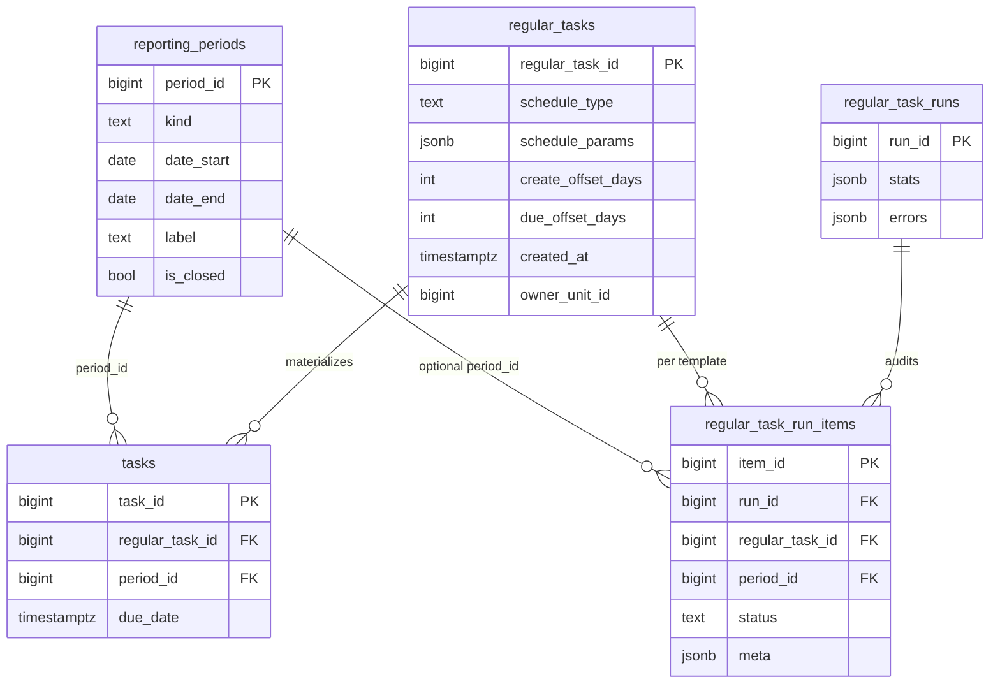
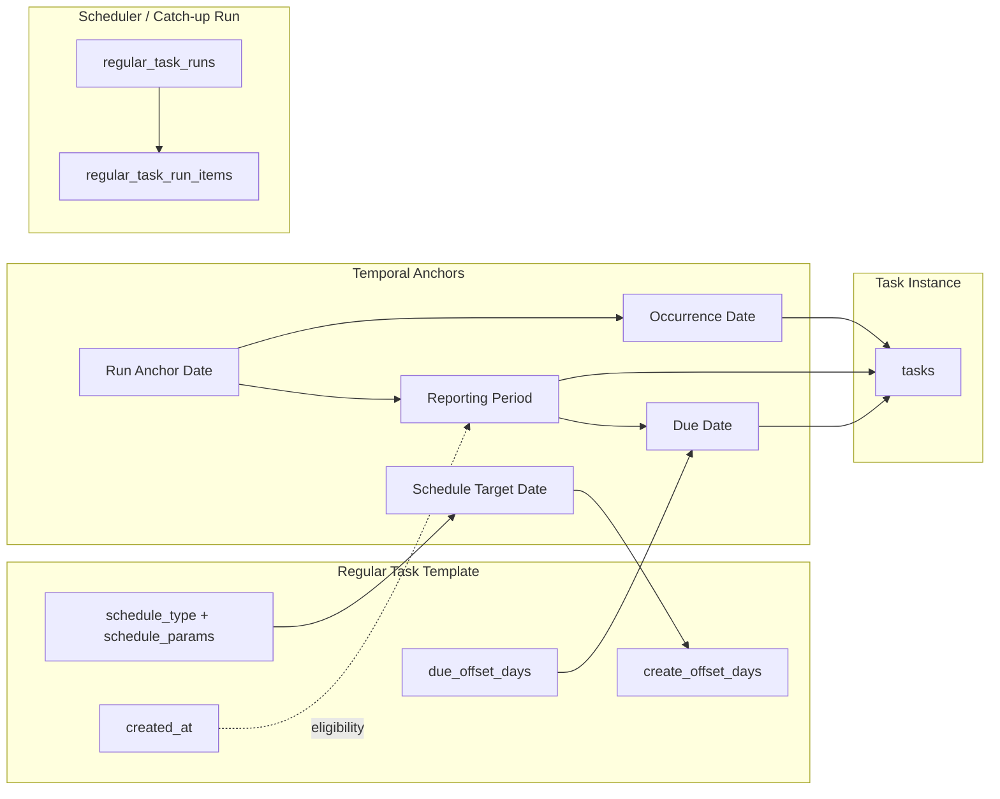

# WP-RT-002 — Regular Task Temporal Model (Draft)

| Поле | Значение |
|------|----------|
| Статус | **Accepted** (comments resolved) |
| Дата | 2026-07-07 |
| Область | Regular Tasks: Scheduler, Catch-up, Reporting Period, Task Instance |
| Ограничение этапа | Код, БД, API, UI **не изменяются** |
| Связанные ADR | ADR-010, ADR-020, ADR-020 RTS addendum, ARCH-001 |

---

## 1. Executive Summary

Подсистема Regular Tasks уже содержит работающую временную модель, достаточную для v1 (weekly/monthly/yearly, automatic scheduler, catch-up, журнал запусков). Модель **функциональна**, но **не полностью формализована**: несколько временных якорей смешаны в UI и документации, а часть ADR-010 не отражена в коде.

После деплоя 07.07.2026 добавлено важное бизнес-правило catch-up: шаблон не может породить задачу за отчётный период, завершившийся до `created_at` шаблона. Это правило укрепляет temporal model, но выявляет необходимость явного разделения понятий **Run Anchor**, **Reporting Period** и **Occurrence Date**.

**Рекомендация этапа WP-RT-002:** зафиксировать целевую терминологию и политики в amendment к ADR-020 (Temporal Model Addendum), без срочного рефакторинга генератора. Критические расхождения (недельная модель, подписи monthly catch-up) — отдельные work packages с явным ADR/amendment.

**Verdict (architecture review):** принят с устранением замечаний (2026-07-07).

---

## 2. Текущая модель (As-Is)

### 2.1. Участники и таблицы



**Источник:** `alembic/versions/02b0d99063cd_baseline.py`, `app/services/regular_tasks_service.py`.

### 2.2. Временные якоря (факт реализации)

| Якорь | Где задаётся | Смысл в коде |
|-------|--------------|--------------|
| **Run Anchor Date** (`today_effective` / `run_for_date`) | Дата запуска scheduler/catch-up | Точка, относительно которой вычисляется отчётный период и `occurrence_date` |
| **Schedule Target Date** | `schedule_params` + `create_offset_days` | Календарный день, когда шаблон «due» для automatic run |
| **Reporting Period** | `_reporting_period_resolve()` | Предыдущий период относительно Run Anchor: week window / prev month / prev year |
| **Occurrence Date** | Run Anchor (`today_effective`) | Дата появления instance в системе (§5) |
| **Due Date** | `period_end + due_offset_days` | Срок исполнения экземпляра (§6) |

**Occurrence Date** и **Due Date** — производные значения от Run Anchor и Reporting Period (§5–6), а не независимые входные параметры schedule.

Генератор: `run_regular_tasks_generation_tx()` в `regular_tasks_service.py`.

---

## 3. Reporting Period

### 3.1. Архитектурный смысл (As-Is)

**Reporting Period** — самостоятельная доменная сущность в БД (`reporting_periods`), представляющая интервал отчётности, за который создаётся экземпляр задачи. Термин **«закрытый интервал» (closed interval)** — целевая терминология и policy (период завершён, когда `period_end < today`); в текущей реализации это не enforced генератором.

| Свойство | Реализация |
|----------|------------|
| Самостоятельная сущность | Да — таблица с `period_id`, get-or-create при генерации |
| Независимость от Scheduler Run | Да — период существует/создаётся при первом обращении, не привязан к `run_id` |
| Границы | `date_start`..`date_end` (inclusive), `kind` = `weekly` \| `monthly` \| `yearly` |
| Связь с задачей | `tasks.period_id` — обязательный FK для regular task instances |
| `is_closed` | Поле есть в схеме; **генератор не использует** (целевой флаг для будущей policy) |
| Eligibility «период завершён» | **UI-side** (`catchUpPeriodOptions.ts`): список catch-up строится так, что `period_end < today`; backend guard — рекомендация (§7.4) |

### 3.2. Правило вычисления границ (текущее)

От Run Anchor Date `for_date`:

| `schedule_type` | Reporting Period | Пример: `for_date = 2026-07-01` |
|-----------------|------------------|----------------------------------|
| weekly | `[for_date−7 .. for_date−1]` | 2026-06-24..2026-06-30 |
| monthly | предыдущий календарный месяц | 2026-06-01..2026-06-30 |
| yearly | предыдущий календарный год | 2025-01-01..2025-12-31 |

Код: `_prev_week_period_bounds_simple`, `_prev_month_period_bounds`, `_prev_year_period_bounds` → `_reporting_period_resolve()`.

**Важно:** это не ISO-неделя и не «неделя с четверга» (ADR-010). Это скользящее 7-дневное окно.

### 3.3. Целевая модель (To-Be) — предложение

#### 3.3.1. Reporting Period как Period Catalog

Reporting Period остаётся **каталогом канонических интервалов** с уникальностью `(kind, date_start, date_end)`. Scheduler и Catch-up **не создают произвольные периоды** — только разрешённые типы из policy.

Поддерживаемые типы v1 (уже в коде):

- `weekly` — rolling 7-day window (зафиксировать в ADR как operational convention)
- `monthly` — календарный месяц
- `yearly` — календарный год

Расширения v2 (не в коде, но архитектурно совместимы):

- `quarter` — календарный квартал
- `day` — календарный день (для daily regular tasks)
- `custom` — только через явный ADR (риск фрагментации KPI)

#### 3.3.2. Независимость от Scheduler

Reporting Period **должен** существовать независимо от запуска:

- период может быть предсоздан справочником (опционально, v2);
- период может появиться lazy при первой генерации (текущее поведение);
- `is_closed` в будущем может блокировать новые instances (сейчас не используется).

#### 3.3.3. Рекомендуемое уточнение ADR-010

ADR-010 описывает неделю, начинающуюся в **четверг**. Код использует **скользящее окно 7 дней** и catch-up anchor на **среду**. Требуется **amendment**: либо принять rolling window как canonical, либо запланировать миграцию к calendar week (отдельный ADR, breaking change для KPI).

---

## 4. Scheduler Run

### 4.1. Архитектурный смысл (As-Is)

**Scheduler Run** (`regular_task_runs`) — **операционное событие материализации**: попытка создать экземпляры задач из активных шаблонов на конкретную дату.

| Вопрос | Ответ (текущая реализация) |
|--------|---------------------------|
| Что делает Scheduler? | Обходит активные шаблоны, для due-шаблонов материализует `tasks` + пишет audit в `regular_task_run_items` |
| Создаёт новые задачи? | Да, INSERT в `tasks` (или dedup/update существующей) |
| Материализует экземпляры? | Да — один instance на `(regular_task_id, period_id, executor_role_id[, assignment_scope])` |
| Automatic vs Catch-up | Один генератор `run_regular_tasks_generation_tx`, разные флаги |

### 4.2. Automatic Run (`POST /internal/regular-tasks/run`)

| Параметр | Значение |
|----------|----------|
| Run Anchor | `today` (локально UTC+5) |
| Due check | `_is_due_today_or_with_offset()` — schedule target date минус `create_offset_days` |
| Time gate | `schedule_params.time` ≤ фактического времени run (RTS-1: cron 08:30) |
| `force_due` | false |
| `run_kind` | `automatic` |
| `trigger_source` | `automatic` (cron) или `manual` (admin invoke) |
| Пропуски | Не due — **без строки в журнале** (silent skip) |

RTS-3 (ADR addendum): **scheduler не backfill'ит** пропущенные периоды.

### 4.3. Catch-up Run (`POST /internal/regular-tasks/catch-up`)

| Параметр | Значение |
|----------|----------|
| Run Anchor | preset-resolved `run_for_date` (`past_week`, `past_month`, `manual`) |
| Due check | **пропущен** (`force_due=true`) |
| Time gate | **пропущен** |
| `run_kind` | `catch_up` |
| Фильтры | schedule_type, org scope, executor_role, regular_task_id |
| Доп. правила | catch-up **разрешён** только если `period_end >= template.created_at::date`; skip с `template_created_after_reporting_period`, если `period_end < created_at::date` (07.07.2026; см. §7.4, `is_catch_up_allowed_for_template_created_at()`) |
| Пропуски | Явные journal items: `dry_run`, `template_created_after_reporting_period` |

### 4.4. Целевая модель (To-Be) — предложение

Scheduler Run остаётся **audit + orchestration event**, не доменной сущностью периода.

Рекомендуемые ограничения (частично уже есть):

| Ограничение | Статус | Рекомендация |
|-------------|--------|--------------|
| Scheduler ≠ Catch-up | ✅ RTS-3 | Сохранить |
| Один automatic run / сутки | ✅ RTS-1 | Сохранить |
| Catch-up только для завершённых периодов | ⚠️ частично (UI) | Формализовать policy |
| Catch-up не раньше `created_at` шаблона | ✅ 07.07.2026 | Сохранить, расширить на automatic? (отдельное решение) |
| Все due-шаблоны → journal item | ⚠️ automatic silent skip | Рассмотреть `not_due_today` skip reason (observability) |
| DB unique constraint на dedupe | ❌ нет в Alembic baseline | ADR amendment: app-level vs DB-level |

---

## 5. Task Occurrence

### 5.1. Архитектурный смысл (As-Is)

**Task Occurrence** — факт появления экземпляра задачи в системе в рамках конкретного Scheduler/Catch-up Run.

| Аспект | Реализация |
|--------|------------|
| Связь с шаблоном | `tasks.regular_task_id` |
| Связь с Reporting Period | `tasks.period_id` |
| Момент возникновения | `occurrence_date = today_effective` (Run Anchor), **не** начало отчётного периода |
| Хранение | `regular_task_run_items.meta.occurrence_date`, origin block в `tasks.description` |
| Влияние `created_at` шаблона | Только catch-up: skip если `period_end < created_at::date` |
| Задача без периода? | Для regular instances — **нет** (`period_id` обязателен при генерации) |

### 5.2. Различие Occurrence Date vs Reporting Period

Пример (monthly catch-up, UI «Июнь 2026», `run_for_date=2026-06-01`):

| Поле | Значение |
|------|----------|
| Run Anchor / Occurrence Date | 2026-06-01 |
| Reporting Period (backend) | 2026-05-01..2026-05-31 |
| UI label периода (после fix 07.07) | «Июнь 2026» (имя anchor month) |

**Архитектурный разрыв:** UI label catch-up monthly = **имя месяца Run Anchor**, а Reporting Period = **предыдущий месяц**. Пользователь видит «Июнь», а задача создаётся за **Май**. Это главный UX/semantic gap temporal model.

### 5.3. Целевая модель (To-Be) — предложение

Ввести явную терминологию:

| Термин (internal) | UI (предложение) | Определение |
|-------------------|------------------|-------------|
| `run_anchor_date` | Дата запуска | Дата, на которую выполняется catch-up/scheduler |
| `reporting_period` | Отчётный период | Интервал, за который требуется отчёт |
| `occurrence_date` | Дата возникновения задачи | Дата появления instance в системе (= run anchor в v1) |

**Политика v2 (на выбор, требует ADR):**

- **Вариант A (минимальный):** UI показывает **Reporting Period bounds**, не anchor month label.
- **Вариант B (семантический):** monthly catch-up `run_for_date` = 1-е число месяца **отчётности** (не предыдущего), generator пересмотрен.
- **Вариант C (статус-кво + docs):** сохранить backend, но в UI явно: «Запуск за июнь → отчёт за май».

Рекомендация WP-RT-002: **Вариант C краткосрочно**, **Вариант A среднесрочно** (без изменения generator).

---

## 6. Due Date

### 6.1. Архитектурный смысл (As-Is)

**Due Date** (`tasks.due_date`) — срок исполнения экземпляра задачи.

**Текущая формула (единственная в генераторе):**

```
due_date = reporting_period.date_end + due_offset_days
```

Код: `_due_date_from_reporting_period_end()`.

`create_offset_days` влияет только на **момент создания** (due-day gating), не на `due_date`.

### 6.2. Политики (оценка)

| Политика | Описание | Статус | Плюсы | Ограничения |
|----------|----------|--------|-------|-------------|
| **P1: от конца отчётного периода** | `period_end + N` | ✅ **Текущая** | Простая, предсказуемая для KPI, привязка к отчётности | Не учитывает день фактического создания при late catch-up |
| **P2: от даты создания** | `occurrence_date + N` | ❌ | Справедливо при catch-up | Ломает единый срок для automatic и catch-up за тот же период |
| **P3: фиксированная календарная** | `bymonthday` в следующем месяце | ❌ | Гибкость для бизнеса | Сложная валидация, конфликты с period model |
| **P4: пользовательские правила** | expression / policy engine | ❌ | Максимальная выразительность | Over-engineering для v1 |

### 6.3. Расхождение UI ↔ Backend

`TemplateAdvancedPlanningBlock` описывает:

- create offset — «относительно **начала периода**»;
- due offset — «относительно **стандартного срока**».

Backend использует:

- create offset — относительно **schedule target date**;
- due offset — относительно **`period_end`**.

**Рекомендация:** amendment ADR-020 + правка UI copy (не generator) для согласования терминов.

### 6.4. Целевая модель (To-Be)

- **Базовая политика v1:** P1 (`period_end + due_offset_days`) — без изменений.
- **Расширение v2:** optional `due_anchor: period_end | occurrence_date | fixed` на шаблоне — только через ADR.
- **Catch-up late create:** при P1 задача за май, пойманная в июле, всё равно имеет due_date = конец мая + N. Это **осознанное** поведение (отчёт за май, срок привязан к маю). Документировать.

---

## 7. Catch-up

### 7.1. Концепция (As-Is)

Catch-up — **контролируемая материализация** экземпляров за прошлые Run Anchor dates, когда automatic scheduler не отработал (RTS-3).

Workflow: dry-run → review → confirm → live run → journal.

### 7.2. Какие периоды показывать пользователю

UI (`catchUpPeriodOptions.ts`) строит список динамически от `today`:

| schedule_type | Доступные периоды | Недоступные |
|---------------|-------------------|-------------|
| weekly | 12 прошлых недель (rolling window) | Текущая незавершённая неделя |
| monthly | Завершённые месяцы до **предыдущего** включительно | Текущий месяц |
| yearly | Прошлые отчётные годы | Текущий год |

Пример на 2026-07-07: monthly включает **Июнь 2026**, не включает **Июль 2026**.

### 7.3. Автоматические пропуски и причины

| Причина | Ключ `meta.reason` | Тип | Когда |
|---------|-------------------|-----|-------|
| Пробный прогон | `dry_run` | Техническая | `dry_run=true` |
| Шаблон создан позже периода | `template_created_after_reporting_period` | **Архитектурная** | catch-up, `period_end < created_at` |
| Ошибка валидации schedule | — (error item) | Техническая | invalid `schedule_params` |
| Нет executor_role | — (error item) | Техническая | NULL role |
| Дедупликация | `dedupe_mode` в meta | Техническая/бизнес | active task exists |

**Архитектурные причины** — следуют из temporal policy, должны быть стабильными и документированными.

**Технические причины** — инфраструктура, валидация, режим dry-run.

**Примечание (dry-run):** при `dry_run=true` в `regular_task_runs.stats` поле `trigger_source` устанавливается в `test` (`resolve_trigger_source()`), тогда как в `regular_task_run_items.meta.reason` для пропущенных строк остаётся `dry_run`.

### 7.4. Целевая политика Catch-up Eligibility

```
ELIGIBLE if:
  1. reporting_period is completed (period_end < today)
  2. template.created_at::date <= period_end
  3. template is active and schedule valid
  4. no existing instance (dedup) OR explicit overwrite policy (future)

INELIGIBLE with explicit skip reason:
  - template_created_after_reporting_period (rule 2)
  - period_not_completed (rule 1) — UI already hides; backend should reject if forced
  - schedule_invalid
  - archived_template
```

Правило 2 реализовано (07.07.2026). Правило 1 — частично (UI only). Рекомендуется backend guard для `manual` preset с будущим anchor.

---

## 8. Terminology Review

### 8.1. Текущие термины

| English (internal) | Russian UI (текущий) | Оценка понятности | Комментарий |
|--------------------|----------------------|-------------------|-------------|
| Reporting Period | Период отчётности / Период | ⚠️ Средне | Не всегда совпадает с label catch-up monthly |
| Execution Period | — (нет термина) | ❌ | Не выделен; пользователь путает с reporting |
| Scheduler Run | Автоматический запуск | ✅ | RTS addendum помогает |
| Catch-up | Догоняющий запуск | ✅ | |
| Task Occurrence | Дата возникновения (задачи) | ⚠️ | Звучит как бизнес-событие, а это run anchor |
| Due Date | Срок исполнения | ✅ | |
| Skip Reason | Пропуск / Пробный прогон | ⚠️ | Недавно улучшено для `skip_message` |

### 8.2. Предлагаемые UI-названия (без изменения internal model)

| Internal | UI (предложение) | Пояснение для пользователя |
|----------|------------------|----------------------------|
| `reporting_period` | **Отчётный период** | «За какой интервал нужно сдать отчёт» (даты начала–конца) |
| `run_anchor_date` | **Дата запуска** | «За какую дату выполняется прогон» (уже есть в catch-up UI) |
| `occurrence_date` | **Дата появления задачи** | «Когда задача создана в системе» |
| `schedule_type` | **Периодичность** | weekly/monthly/yearly |
| `execution_period` | *(не вводить в v1)* | Резерв для KPI «неделя исполнения» |
| `skip_reason` | **Причина** | Таблица review catch-up |

---

## 9. Целевая Temporal Model (To-Be) — сводка



**Инварианты целевой модели:**

1. Каждый regular task instance имеет ровно один Reporting Period.
2. Reporting Period определяется от Run Anchor, не от Schedule Target.
3. Occurrence Date = Run Anchor Date (v1).
4. Due Date = f(Reporting Period end, due_offset) (v1, политика P1).
5. Catch-up не создаёт instances за периоды, завершившиеся до `created_at` шаблона.
6. Scheduler не backfill'ит; catch-up — единственный recovery path (RTS-3).

---

## 10. Сравнение реализации с целевой моделью

| Подсистема | Соответствует | Требует изменения | Комментарий |
|------------|:-------------:|:-----------------:|-------------|
| **Scheduler** | ✅ | ⚠️ | RTS-1..4 соблюдены; silent skip non-due без journal row |
| **Catch-up** | ✅ | ⚠️ | `created_at` rule OK; monthly UI label ≠ reporting period bounds |
| **Preview** | ✅ | ⚠️ | `skip_message` после 07.07; dry_run vs architectural skip разделены |
| **Regular Task Template** | ✅ | ⚠️ | UI copy offsets ≠ backend; legacy fields (`periodicity`, `deadline_offset_days`) |
| **Task Instance** | ✅ | ⚠️ | Dedupe app-level; ADR unique index не в Alembic baseline |
| **Reporting Period** | ✅ | ⚠️ | Rolling weekly ≠ ADR-010; `is_closed` unused; no quarter/day |
| **API** | ✅ | ⚠️ | Контракт стабилен; нет explicit eligibility endpoint |
| **UI** | ⚠️ | ✅ | Catch-up period labels, offset hints, yearly stale i18n |

Легенда: ✅ — соответствует или приемлемо; ⚠️ — желательное улучшение.

---

## 11. Выводы и рекомендации

### 11.1. Что уже реализовано корректно

- **Reporting Period как сущность** с get-or-create и FK на tasks.
- **Разделение Scheduler ≠ Catch-up** (ADR RTS-3).
- **Единый генератор** с флагами `force_due`, `catch_up_meta`, journal items.
- **Due date policy P1** — последовательна и тестируема.
- **Catch-up workflow** (dry-run → review → live) с audit trail.
- **Правило `created_at`** (07.07.2026) — архитектурно верное ограничение temporal eligibility.
- **Динамический список периодов** catch-up от текущей даты.

> Org scope и template-derived role filters в catch-up UI — полезная операционная функция, но **вне temporal model** WP-RT-002; не включать в core temporal conclusions.

### 11.2. Желательные изменения (приоритет)

| Приоритет | Изменение | Тип |
|-----------|-----------|-----|
| P0 | **ADR-020 Temporal Model Addendum** — формализовать 3 якоря, catch-up eligibility, P1 due policy | Документация |
| P1 | UI: показывать **bounds отчётного периода** в catch-up review (не только anchor month) | UI copy/labels |
| P1 | UI: согласовать подсказки `create_offset_days` / `due_offset_days` с backend | UI copy |
| P2 | Backend guard: catch-up `run_for_date` не в будущем / период completed | Implementation |
| P2 | Automatic run: optional journal skip `not_due_today` (observability) | Implementation |
| P3 | DB unique constraint dedupe (как ADR-020) или explicit ADR отказ | Schema ADR |
| P3 | Weekly model: rolling vs calendar week (ADR-010 reconciliation) | **ADR amendment** |

### 11.3. Что можно оставить без изменений

- Формула `due_date = period_end + due_offset_days`.
- `occurrence_date = run_anchor_date` (v1).
- Lazy creation `reporting_periods`.
- Daily scheduler 08:30 + time gate (RTS-1).
- Application-level dedupe (пока работает).
- Yearly schedule_type support (код готов; только cleanup i18n).

### 11.4. Классификация изменений

| Изменение | Обычный рефакторинг | Требует ADR / amendment |
|-----------|:-------------------:|:-----------------------:|
| UI labels catch-up period bounds | | ✅ ADR-020 amendment |
| UI offset hints | ✅ | |
| `skip_message` / RunItemMeta types | ✅ | |
| `created_at` catch-up rule | | ✅ (зафиксировано 07.07, нужен ADR text) |
| Rolling week → calendar week | | ✅ **новый ADR** (breaking) |
| `due_anchor` policy selector on template | | ✅ ADR |
| DB dedupe unique index | | ✅ ADR + migration |
| `is_closed` enforcement | | ✅ ADR |
| Quarter/day period kinds | | ✅ ADR |

---

## 12. Предлагаемые следующие шаги (вне scope WP-RT-002)

1. ~~**Ratify** этот draft на architecture review.~~ ✅ Принят (comments resolved, 2026-07-07).
2. Подготовить **ADR-020 Amendment: Temporal Model** (1–2 стр.) с инвариантами §9 — **отдельный шаг**, не в scope WP-RT-002.
3. Создать **WP-RT-003**: UI alignment catch-up period display (bounds + пояснение anchor vs reporting).
4. Создать **WP-RT-004**: ADR-010 vs rolling week reconciliation (бизнес-решение).
5. Опционально: **WP-RT-005**: backend eligibility API для catch-up preview без full dry-run.

---

## 13. Ссылки на код и документацию

| Артефакт | Путь |
|----------|------|
| Генератор | `app/services/regular_tasks_service.py` |
| Catch-up eligibility | `is_catch_up_allowed_for_template_created_at()` in `regular_tasks_service.py` |
| Scheduler status | `app/services/regular_task_scheduler_status.py` |
| Catch-up API | `app/services/regular_tasks_router.py` |
| Catch-up period picker | `corpsite-ui/lib/catchUpPeriodOptions.ts` |
| Catch-up review | `corpsite-ui/lib/catchUpWorkflow.ts` |
| Run journal types | `corpsite-ui/lib/regularTaskRunJournal.ts` |
| ADR-020 contract | `docs/adr/ADR-020-regular-tasks-contract-v1.md` |
| RTS addendum | `docs/adr/ADR-020-scheduler-operations-addendum.md` |
| ADR-010 hierarchy | `docs/adr/ADR-010-regular-tasks-hierarchy.md` |
| Scheduler runbook | `docs/ops/REGULAR_TASK_SCHEDULER_RUNBOOK.md` |
| Tests catch-up | `tests/test_regular_tasks_catch_up.py` |

---

*Конец документа. Изменения кода/схемы по этому WP не производились.*
